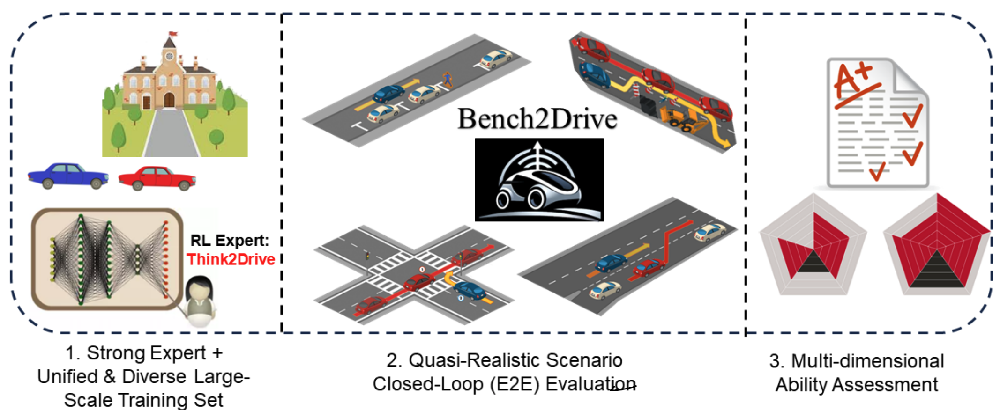
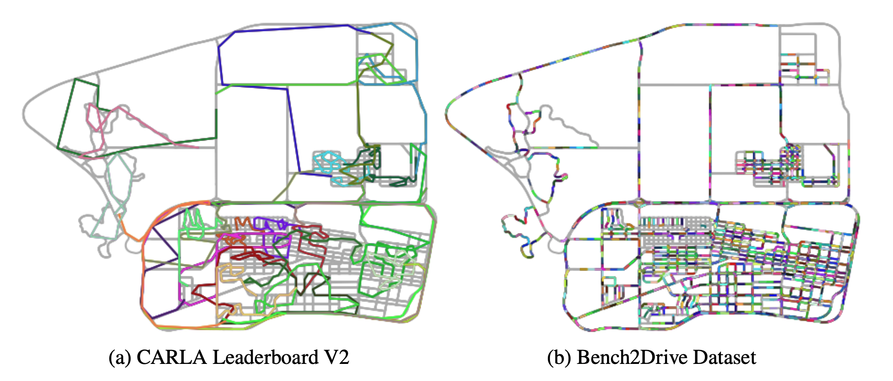
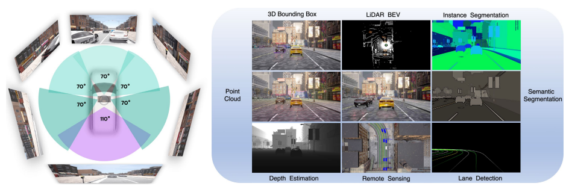
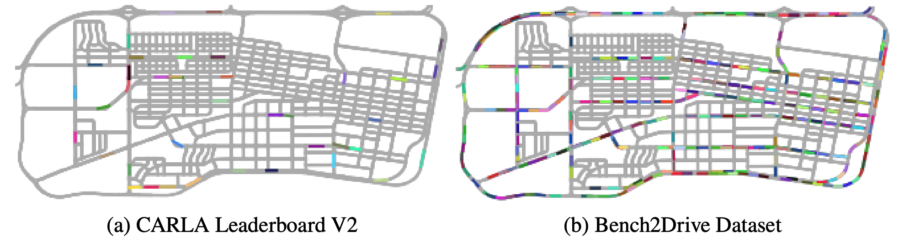
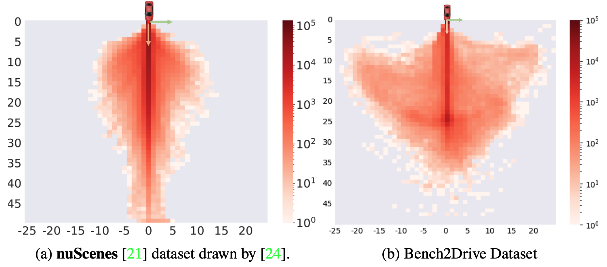
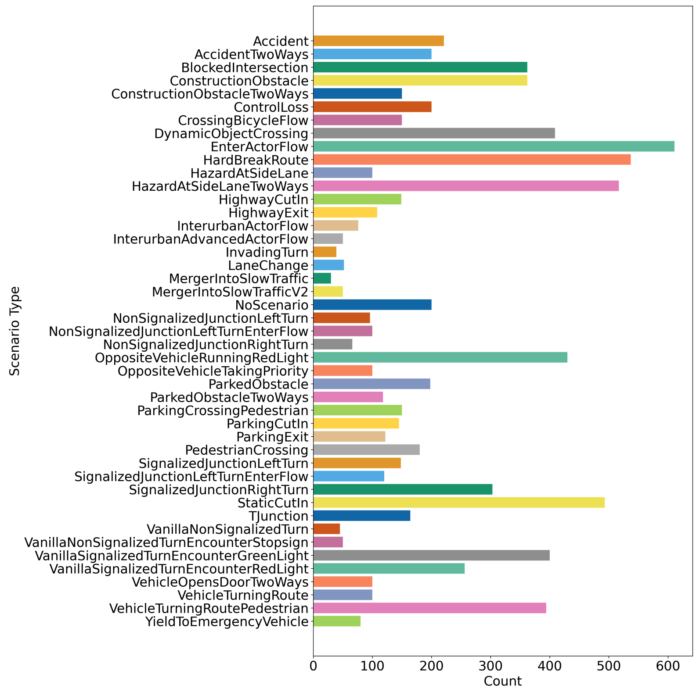
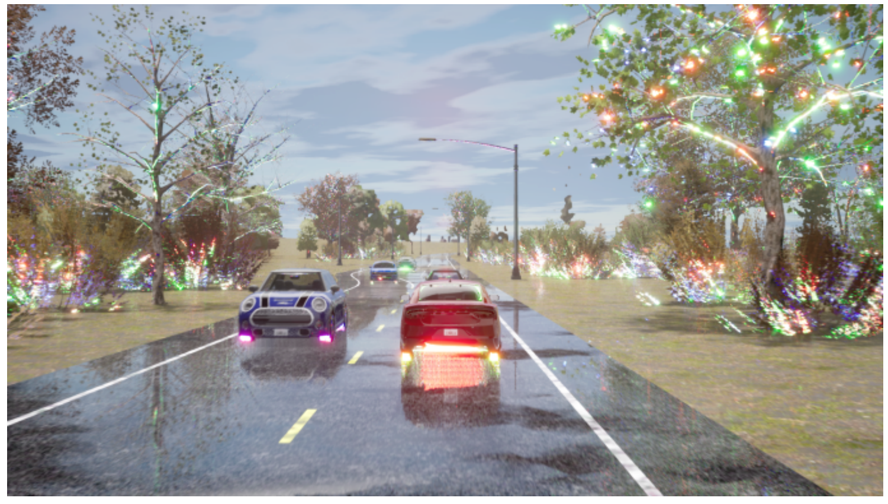
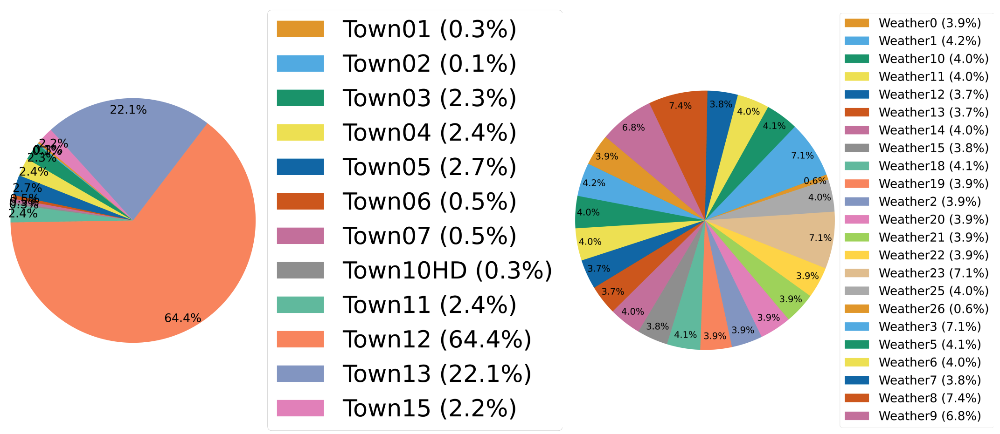

# Bench2Drive

[Bench2Drive: Towards Multi-Ability Benchmarking of Closed-Loop End-To-End Autonomous Driving](https://arxiv.org/abs/2406.03877)の和訳

### Abstract

基盤モデル（foundation models）が急速に拡大する時代において、自動運転技術は変革の入り口に近づいており、データ駆動型でスケールアップする潜在能力を持つことから、エンドツーエンド自動運転（E2E-AD）が台頭してきています。しかし、既存のE2E-AD手法は主に、L2誤差や衝突率を指標としたオープンループのログ再生方式（例：nuScenes）で評価されていますが、これらは最近コミュニティで認識されているように、アルゴリズムの運転性能を完全に反映することはできません。クローズドループプロトコルの下で評価されるE2E-AD手法については、固定されたルート（例：CARLAにおけるTown05LongやLongest6）でテストされ、ドライビングスコア（driving score）を指標としていますが、これは滑らかでない評価関数や長いルートにおける大きなランダム性のために分散が高いことで知られています。さらに、これらの手法は通常、トレーニング用に独自のデータを収集するため、アルゴリズムレベルでの公平な比較が不可能です。完全自動運転（FSD）のための包括的で現実的かつ公平なテスト環境という最重要のニーズを満たすために、我々は「Bench2Drive」を提示します。これは、クローズドループ方式でE2E-ADシステムの複数の能力を評価するための初のベンチマークです。Bench2Driveの公式トレーニングデータは、CARLA v2における44のインタラクティブなシナリオ（割り込み、追い越し、迂回など）、23の天候（晴れ、霧、雨など）、12の町（都市、村、大学など）の下で均一に分布した13,638のショートクリップから収集された、200万の完全にアノテーションされたフレームで構成されています。その評価プロトコルでは、E2E-ADモデルが異なる場所や天候の下で44のインタラクティブなシナリオを通過することを要求し、これらは合計220のルートになります。これにより、異なる状況下での運転能力に関する包括的かつ分離された（disentangled）評価を提供します。我々は最先端のE2E-ADモデルを実装し、Bench2Driveで評価を行い、現在の状況と将来の方向性に関する洞察を提供します。

**図1: Bench2Driveの概要**

## 1 イントロダクション

近年、自動運転の分野は、基盤モデルの急速な進歩とスケーリングに後押しされ、著しい成長を遂げています [^1], [^2], [^3]。これらの進展は、従来のモジュールベースの認識 [^9], [^10], [^11], [^12], [^13]、予測 [^14], [^15], [^16], [^17]、計画 [^18], [^19], [^20] のパイプラインとは対照的に、車両の自動化へのスケーラブルでデータ駆動型のアプローチを約束する、エンドツーエンド自動運転（E2E-AD）システム [^4], [^5], [^6], [^7], [^8] の新時代を切り開きました。このようなシステムは、膨大な量のデータから学習できるように設計されており、車両知能の展望を変革する可能性があります。

これらの進歩にもかかわらず、E2E-ADシステムの評価方法は依然として重大なボトルネックとなっています。一般的な方法の一つは、nuScenes [^21] のようなデータセットに記録された専門家の軌跡を用いてログ再生を行うこと、すなわちオープンループ評価です。これらのモデル [^4], [^22] は通常、生のセンサー情報を入力として自車の将来の位置を予測します。指標としては、記録された軌跡に対するL2誤差や、衝突が発生する割合が使用されます。しかし、コミュニティ [^23], [^24], [^19] で広く議論されているように、これらのオープンループ指標は、分布シフト [^25] や因果的混乱 [^26], [^27] などの問題により、計画（planning）の熟達度を示すには不十分です。nuScenesはまた、検証セットが小さく不均衡である（フレームの約75%が直進し続けることのみを必要とする）という問題もあります [^24]。その結果、自車の状態（位置、速度など）のみをエンコードする方法 [^23] が、センサー入力を持つ複雑な手法 [^4] と比較して同様のL2誤差を達成できてしまい、これがE2E-ADのためのクローズドループ評価ベンチマークへの要求を促しています。

CARLA [^28] は、クローズドループE2E-AD評価のために最も広く使用されているシミュレータの一つです。その枠組みの中で、Town05LongやLongest6といったベンチマークが確立されており、ADシステムが特定の時間制約内で安全に完了する必要がある複数のルートを特徴としています。しかし、これらのベンチマークは、車線追従、右左折、衝突回避、信号遵守といった基本的なスキルのみを評価しており [^29], [^30]、複雑でインタラクティブな交通下でのADシステムの運転能力を検証できていません。最新のCARLA Leaderboard v2は、より複雑な状況におけるADシステムのロバスト性を評価するために設計された39の挑戦的なシナリオを導入しています。それにもかかわらず、7キロメートルから10キロメートルの範囲でシナリオが詰め込まれた評価用の公式ルートは、図2(a)に示すように、完璧に完了するにはあまりにも困難な、手ごわい課題を提示しています。その結果、指数減衰関数を採用したドライビングスコア指標では、異なるADシステムを効果的に比較することが難しくなります。なぜなら、それらは非常に低いスコアになる傾向があるからです。例えば、現在のLeaderboard v2[^1]では、参加手法のスコアは100点中10点未満です。さらに、既存の手法は通常、独自にデータを収集するため、アルゴリズムレベルでの公平な比較は不可能です。

**図2: Town12ルートの長さの可視化。異なるルートは異なる色で可視化されている。Bench2Driveの方がルート長が短く、スムーズな評価を可能としている**

自動運転（AD）システムの評価における前述の課題に対処するためには、それらの能力を詳細な方法で公平に評価する新しいベンチマークを開発することが不可欠です。この目的のために、我々は包括的で現実的かつ公平なクローズドループ環境でE2E-ADシステムを評価するように設計された新しいベンチマーク、Bench2Driveを紹介します。Bench2Driveには、最先端の専門家モデルであるThink2Drive [^31] によって収集された公式トレーニングデータセットがあり、13,638のクリップから得られた200万の完全にアノテーションされたフレームで構成されています。これは、賑やかな市内中心部の晴れた日から趣のある村の霧の条件まで、異なる天候や町の下での割り込み、追い越し、迂回などの44のインタラクティブなシナリオの多様な配列に及びます。評価プロトコルには220の短いルートが含まれており、各ルートは長さ約150メートルで、単一の特定のシナリオを含んでいます。このようにして、個々のスキルの評価が分離され、44の異なるスキルセットにわたるADシステムの熟達度の詳細な比較が可能になります。さらに、各ルートの短さは、ドライビングスコアに対する指数減衰関数の影響を軽減し、異なるシステム間でのパフォーマンスのより正確で有意義な比較を容易にします。このような構造化され焦点を絞ったベンチマークは、各ADシステムの長所と短所に関するより明確な洞察を提供し、ターゲットを絞った改善とより洗練された技術開発を可能にします。

要約すると、提案されたBench2Driveベンチマークの特徴は以下の通りです：

*   **包括的なシナリオカバレッジ**: Bench2Driveは、44のインタラクティブなシナリオにわたってADシステムをテストするように設計されており、複雑な状況下での能力に関する徹底的な評価を提供します。
*   **詳細なスキル評価**: それぞれが特定の運転シナリオに焦点を当てた220の短いルートにわたって評価を構築することで、Bench2Driveは異なるADシステムが個々のタスクでどのように機能するかについての詳細な分析と比較を可能にします。
*   **クローズドループ評価プロトコル**: Bench2Driveはクローズドループ方式でADシステムを評価し、ADシステムのアクションが環境に直接影響を与えます。この設定は、ADシステムの運転性能の正確な評価を提供します。
*   **多様で大規模な公式トレーニングデータ**: Bench2Driveは、多様なシナリオ、天候、町の下での13,638クリップからの200万の完全にアノテーションされたフレームの標準化されたトレーニングセットで構成されており、すべてのADシステムが豊富かつ同様の条件下でトレーニングされることを保証します。これは、公平なアルゴリズムレベルの比較にとって極めて重要です。

これらの特徴により、Bench2Driveは自動運転分野における先駆的なベンチマークとなり、研究者がE2E-ADシステムを現実的、包括的、かつ公平な方法で洗練し評価するための不可欠なツールを提供します。我々は、TCP [^5]、ThinkTwice [^30]、DriveAdapter [^27]、UniAD [^4]、VAD [^22]、AD-MLP [^23] などのいくつかの古典的なベースラインを実装し、それらをBench2Driveで評価します。我々は、L2誤差のようなオープンループ指標が実際の運転性能を反映できないという事実を確認します。古典的なクローズドループ指標であるドライビングスコアについては、詳細が不足しており、その重いペナルティが過度に保守的な運転戦略を助長することを発見しましたが、Bench2Driveは異なる手法の能力に関する包括的な理解を提供します。

## 2 関連研究

### 2.1 プランニングベンチマーク

自動運転分野におけるベンチマーキングは、認識のためのKITTI [^32] や行動予測のためのNGSIM/highD [^33]、BARK [^34] といった特化したデータセットから、様々な協調的なシステムコンポーネントの評価を促進するnuScenes [^21]、Argoverse [^35]、Waymo [^36] のような統合された形式へと進化してきました。最近では、学習ベースの手法に対するプランニング能力の評価が関心分野となっています [^37], [^38], [^39], [^40], [^41]。表1に、プランニングベンチマークの比較を示します。nuScenes [^21] は、オープンループ指標を提供しているものの、クローズドループシミュレーションが欠如しているため、プランニングの熟達度を適切に評価できないと批判されてきました [^23], [^24], [^19]。さらに、シナリオの大部分（75%）が単純な運転のみを必要とする不均衡な検証セットに悩まされており、複雑な環境におけるADシステムの意思決定能力への挑戦が不十分です [^24]。nuPlan [^38] とWaymax [^37] はクローズドループ評価を提供しますが、バウンディングボックスレベルの評価に限定されており、センサーシミュレーションを除外しているため、E2E-AD手法には適していません。CARLA Leaderboard V1の修正版であるLongest6 [^6] は、車線追従、右左折、衝突回避、信号機といった基本的なスキルのみを評価します。CARLA Leaderboard V2 [^28] は、専門家のデモンストレーションデータを欠いています。コミュニティ [^42], [^43] で広く議論されているように、公式のトレーニングセットがないため、異なる手法の比較はアルゴリズムレベルではなくシステムレベルになってしまいます。Bench2Driveは、大規模でアノテーションが豊富な公式トレーニングデータセットと多能力評価セットを提供することで、これらの欠点に対処します。これにより、全ルートの平均スコアを主要な性能指標として依存する既存のベンチマークの限界を克服し、ADシステムの運転能力のより詳細で有益な評価が可能になります。

**表1: 関連するプランニングベンチマークとの比較**
Bench2Driveは、クローズドループ下で多能力分析を用いてE2E-AD手法を評価する唯一のベンチマークです。

| Benchmark | Sensor | Closed-Loop | E2E-Sim | Expert | Complex | Multi-Ability-Eval |
| :--- | :---: | :---: | :---: | :---: | :---: | :---: |
| nuScenes [^21] | ✔ | ✘ | ✘ | ✔ | ✘ | ✘ |
| nuPlan [^38] | ✘ | ✔ | ✘ | ✔ | ✔ | ✘ |
| Waymax [^37] | ✘ | ✔ | ✘ | ✔ | ✔ | ✘ |
| Longest6 [^6] | ✔ | ✔ | ✔ | ✔ | ✘ | ✘ |
| CARLA LB V2 [^28] | ✔ | ✔ | ✔ | ✘ | ✔ | ✘ |
| **Bench2Drive (Ours)** | **✔** | **✔** | **✔** | **✔** | **✔** | **✔** |

### 2.2 エンドツーエンド自動運転

E2E-ADの概念は1980年代に遡ることができます [^44]。最近では、ニューラルネットワーク、特にTransformer [^45] の台頭により、スケーリング則の力が実証され、E2E-ADへの熱意が再燃しています [^46], [^47], [^48], [^49], [^50]。しかし、これらはオープンループ方式でのみ評価されているか [^51], [^4], [^22], [^52]、Town05Long/Longest6のような比較的単純なシーンで評価されています [^53], [^54], [^42], [^55], [^56], [^57], [^58], [^59], [^60]。Bench2Driveは、E2E-AD手法の能力を比較するための挑戦的かつ包括的なアリーナを提供します。

## 3 Bench2Drive

Bench2Driveは、公式トレーニングセットとしてCARLAで収集された大規模な完全アノテーション付きデータセット、詳細な運転スキル評価のための評価ツールキット、およびトレーニングデータセットと評価ツールキットに合わせて調整されたいくつかの最先端E2E-AD手法の実装で構成されています。すべてのデータ、コード、チェックポイントはGitHubおよびHuggingfaceにてApache License 2.0の下で公開されています。詳細を以下のセクションで説明します。

### 3.1 データ収集エージェント

データ収集エージェント（専門家）は、生徒モデルがデータから学習できるようにデータを収集する責任があります。現実世界では、これは通常、KITTI [^32]、nuScenes [^21]、Waymo [^36]、Argoverse [^35] のキュレーションのように、人間が都市を運転して行われます。しかし、これには多大な人的労力が必要です。シミュレーションには、安価な代替手段である教師モデルがあります。教師モデルは、現実世界では利用できない情報（特権情報と呼ばれます）、例えば、周囲のエージェントの正解位置、状態、意図、交通信号の正解状態などを使用します。その結果、CARLAを使用する人々は、シミュレーション内で特権情報を使用して運転するために、ルールを書くか [^43], [^61]、RLモデルをトレーニングします [^50], [^31]。本研究では、Bench2Driveの構築中に44のシナリオすべてを解決できる唯一の専門家モデルであるため、ワールドモデルベースの強化学習教師であるThink2Drive [^31] を使用してCARLA内をナビゲートし、データを収集します。なお、Bench2Driveのリリース後、ルールベースの専門家PDM-Lite [^61][^2] がオープンソース化され、ユーザーはカスタマイズされた需要のためにそれを使用することができます。

### 3.2 専門家データセット

クローズドループ方式で評価される既存のE2E-AD手法 [^5], [^6], [^56], [^57] は、通常、CARLAシミュレータを使用して独自のデータを収集します。しかし、[^42], [^43] で強調されているように、これらのデータセットのサイズと分布はパフォーマンスに大きく影響し、アルゴリズムレベルの公平な比較を困難にします。これに対処するために、我々は公式トレーニングセットとして機能するように、10 Hzでサンプリングされた3Dバウンディングボックス、深度、セマンティックセグメンテーションを含む包括的なアノテーションを備えた大規模な専門家データセットを構築しました。専門家からの情報は生徒モデルの重要なガイダンスになり得るため [^49], [^27], [^60]、専門家モデルであるThink2Drive [^31] の価値推定と特徴も提供します。図3に概要を示します。コミュニティによる既存のE2E-AD手法の再実装を容易にするために、我々はnuScenes [^21] と同様のセンサー構成を採用しています：

**図3: 専門家データセットのセンサー設定とアノテーション。** nuScenes [^21] のセンサー設定に従います。アノテーションには、3Dバウンディングボックス、深度、セマンティック/インスタンスセグメンテーション、HDマップ、およびThink2Drive [^31] ExpertからのRL価値推定と特徴が含まれます。

*   **1x LiDAR**: 64チャンネル、85メートル範囲、毎秒600,000ポイント
*   **6x カメラ**: 全周囲カバレッジ、900x1600解像度、JPEG圧縮（品質レベル20）
*   **5x レーダー**: 100メートル範囲、水平および垂直FoV 30°
*   **1x IMU & GNSS**: 位置、ヨー、速度、加速度、角速度
*   **1x BEVカメラ**: デバッグ、可視化、リモートセンシング
*   **HDマップ**: 車線、中心線、トポロジー、動的な信号状態、信号と一時停止標識のトリガーエリア

さらに、認識と行動の両方の観点からのデータのロングテール分布（自動運転における重大なボトルネック [^62]、nuScenesのクリップの約75%は自車が直進するだけである）によって引き起こされる課題に取り組むために、我々は天候条件、風景、行動の分布ができる限り均一になるようにしています。図4に示すように、CARLA Leaderboard V2の公式ルートと比較して、シナリオのために利用可能な場所をより多く追加し、データの多様性を高めています。さらに、Appendix Gで詳述するように、行動の多様性を高めるためにLeaderboard V2を超えて5つのシナリオを設計しました。シナリオ、天候、町の分布についてはAppendix Bで説明します。図示されているように、Bench2Driveデータセットは認識と行動の両方の多様性に富んでいます。

データ分割については、運転プロセスを短いクリップに分割しました。各クリップは約150メートルの長さで、単一の特定のシナリオを含んでいます。この分割により、個々の運転スキルのカリキュラム学習 [^63] が可能になります。異なる計算能力に対応するために、我々は3つのデータサブセットを設計しました：mini（デバッグと可視化用の10クリップ）、base（1,000クリップ、nuScenesに匹敵、8xRTX3090サーバーに適しています）、およびfull（大規模研究用の10,000クリップ）。

**図4: Town12におけるシナリオ「ConstructionObstacle（工事障害物）」の分布**
異なる色は、「ConstructionObstacle」を含む異なるルートを表しています。Bench2Driveは、「ConstructionObstacle」を生成できる場所をより多く持っています。

**表2: スキルセットとシナリオ**

| Skill | Scenario |
| :--- | :--- |
| Merging | CrossingBicycleFlow, EnterActorFlow, HighwayExit, InterurbanActorFlow, HighwayCutIn, InterurbanAdvancedActorFlow, MergerIntoSlowTrafficV2, MergeIntoSlowTraffic, NonSignalizedJunctionLeftTurn, NonSignalizedJunctionRightTurn, NonSignalizedJunctionLeftTurnEnterFlow, ParkingExit, LaneChange, SignalizedJunctionLeftTurn, SignalizedJunctionRightTurn, SignalizedJunctionLeftTurnEnterFlow |
| Overtaking | Accident, AccidentTwoWays, ConstructionObstacle, ConstructionObstacleTwoWays, HazardAtSideLaneTwoWays, HazardAtSideLane, ParkedObstacleTwoWays, ParkedObstacle, VehicleOpenDoorTwoWays |
| Emergency Brake | BlockedIntersection, DynamicObjectCrossing, HardBreakRoute, OppositeVehicleTakingPriority, OppositeVehicleRunningRedLight, ParkingCutIn, PedestrianCrossing, ParkingCrossingPedestrian, StaticCutIn, VehicleTurningRoute, VehicleTurningRoutePedestrian, ControlLoss |
| Give Way | InvadingTurn, YieldToEmergencyVehicle |
| Traffic Sign | EnterActorFlow, CrossingBicycleFlow, NonSignalizedJunctionLeftTurn, NonSignalizedJunctionRightTurn, NonSignalizedJunctionLeftTurnEnterFlow, OppositeVehicleTakingPriority, OppositeVehicleRunningRedLight, PedestrianCrossing, SignalizedJunctionLeftTurn, SignalizedJunctionRightTurn, SignalizedJunctionLeftTurnEnterFlow, TJunction, VanillaNonSignalizedTurn, VanillaSignalizedTurnEncounterGreenLight, VanillaSignalizedTurnEncounterRedLight, VanillaNonSignalizedTurnEncounterStopsign, VehicleTurningRoute, VehicleTurningRoutePedestrian |

### 3.3 多能力評価

既存のプランニングベンチマーク [^28], [^38], [^37] は、提供されたすべてのルートの平均スコアによってADシステムのパフォーマンスを評価します。このアプローチは運転能力の一般的な概要を提供しますが、異なる手法の特定の強みと弱みを特定することはできません。さらに悪いことに、Longest6 [^6] やLeaderboard V2 [^28] のようなCARLAにおける既存のベンチマークは数キロメートルをカバーしており、ドライビングスコア指標の分散が高くなります。この分散は、違反スコアが累積的な乗算を通じてエラーにペナルティを科すために生じ、結果を大きく歪める可能性があります。例えば、それぞれがルートの90%を完了する3回のテスト実行を考えた場合、赤信号無視の回数が0回、1回、2回と異なるとします。対応するドライビングスコアは90、$90 * 0.7 = 63$、$90 * 0.7 * 0.7 = 44.1$となり、これにより大きな標準偏差（18.9）が生じ、手法間の比較が信頼できなくなります。

これらの問題に対処するために、我々は44のシナリオすべてに対してより詳細な評価フレームワークを提案します。具体的には、シナリオごとに異なる天候と町を特徴とする5つの異なる短いルート（長さ約150メートル）を設計し、合計220のルートになります。このアプローチにより、人々は分離されたスキルによってADシステムの能力を評価でき、分散が減少したより詳細な分析につながります。さらに、表2に示すように、都市運転のための5つの高度なスキル（合流、追い越し、譲り合い、交通標識、緊急ブレーキ）を要約し、各スキルのスコアを報告します。分離された設計は、どのスキルがADシステムによって効果的に処理され、どのスキルがそうでないかについてのより明確な洞察を提供し、システムパフォーマンスのより微妙な理解を促進します。

正式には、評価セットは220のルートで構成され、各ルートは特定の町と天候における出発地 $(x_{\text{src}}, y_{\text{src}})$ と目的地 $(x_{\text{dst}}, y_{\text{dst}})$ のペアを定義します。生のセンサー入力（カメラ、LiDAR、IMU/GPSなど）およびターゲットウェイポイントが与えられた場合、自車は出発地から目的地まで運転する必要があります。パフォーマンスを評価するために、2つの指標を設計します：

*   **成功率 (Success Rate, SR)**: この指標は、割り当てられた時間内に交通違反なしで正常に完了したルートの割合を測定します。自車がルール違反なしに目的地に到達した場合、ルートは成功とみなされます。成功率は、式1（左）に示すように、成功したルートと総ルート数の比率として計算されます。
*   **ドライビングスコア (Driving Score, DS)**: この指標は、参照としてCARLA [^28] の公式指標に従います。これは、ルート完了と違反に対するペナルティの両方を考慮します。具体的には、式1（右）に示すように、ルート完了率を平均し、違反の重大度に基づいてペナルティを科します。ドライビングスコアは、同じタイプまたはグループの総ルート数で正規化されます。

$$
\text{Success Rate} = \frac{n_{\text{success}}}{n_{\text{total}}}
$$

$$
\text{Driving Score} = \frac{1}{n_{\text{total}}} \sum_{i=1}^{n_{\text{total}}} (\text{Route-Completion}_i * \prod_{j=1}^{n_{i,\text{penalty}}} p_{i,j}) \quad (1)
$$

ここで、$n_{\text{success}}$ と $n_{\text{total}}$ はそれぞれ成功したルートの数と総サンプル数を表します。$\text{Route-Completion}_i$ は $i$ 番目のルートで完了したルート距離の割合を表します。$p_{i,j}$ は $i$ 番目のルートにおける $j$ 番目の違反ペナルティを意味します。違反の種類とペナルティスコアの詳細についてはAppendix Fを参照してください。

さらに、アルゴリズムの目標達成能力を超えて、運転軌跡の効率性と滑らかさを測定するために以下の2つの指標を提案します：

*   **効率性 (Efficiency)**: CARLAチームは、自動運転車の速度が低すぎるかどうかをチェックする機能を実装しました。これは、車両の速度を近くの車両と比較することで決定されます：
    $$
    \text{Speed Percentage} = \frac{\text{Ego Vehicle's Speed}}{\text{Average Speed of Nearby Vehicles}} \quad (2)
    $$
    この関数は、車両の速度と現在のフレームにおける近くの車両の平均速度を使用して速度パーセンテージを計算します。CARLA Leaderboardはルートごとに4つのチェックポイントを設定し、自車がチェックポイントに到着したときに速度をチェックします。具体的には、車両が近くの車両よりも速い場合、運転効率は100%より大きくなります。チェック結果は、最終的なドライビングスコアのペナルティとして含まれます。しかし、チェックポイントが4つしかないため、車両は次のチェックポイントに到達する前に総ルート距離の25%をカバーする必要があります。これは、低速に対するペナルティ値の分散が高くなることにつながり、ドライビングスコアへの運転能力の反映を複雑にします。これを緩和するために、我々はチェックポイントの数を20に増やします。速度チェックは総ルート長の5%ごとに実行され、ドライビングスコアの計算からは除外されます。最終的な運転効率指標は、すべてのチェックにわたる速度パーセンテージの平均として定義されます。

$$
\text{Driving Efficiency} = \frac{\sum_{i} \text{Speed Percentage}_i}{\text{Speed Check Times}} \quad (3)
$$

自車が最初の5%のチェックポイントを通過できなかった場合、このルートは最終的な運転効率指標の計算に含まれません。異常な速度スパイク（例えば、車両が現在のマップレイヤーから落下した場合など）が発生するケースを考慮するために、1000%を超える速度パーセンテージ値は除外されます。

*   **快適性 (Comfortness)**: 快適性は人間の経験と密接に関連しているため、それを測定するには自動運転ポリシーを多数の人間の運転専門家の行動と比較する必要があります。このため、我々は人気のあるベンチマークnuPlan [^38] の滑らかさ（快適性とも呼ばれる）プロトコルに従います。これは、自車の最小および最大縦方向加速度、横方向加速度の最大絶対値、ヨーレート、ヨー加速度、ジャークの縦方向成分、およびジャークベクトルの最大大きさを評価します。これらの変数は、nuPlanの人間の専門家の軌跡の調査から経験的に決定されたデフォルト値を持つ閾値と比較されます。快適性は、これらの値が専門家の値の上限と下限の範囲内に収まるかどうかに基づいて測定されます。

$$
\text{Frame Variable Smoothness (FVS)} = 
\begin{cases} 
\text{True} & \text{if lower bound } \le p_i \le \text{upper bound}, \\
\text{False} & \text{otherwise}
\end{cases} \quad p \in \text{smoothness vars}, 0 \le i \le \text{total frames} \quad (4)
$$

ここで、滑らかさ変数（vars）には以下が含まれます：縦方向加速度 - 専門家範囲: [-4.05, 2.40]、最大絶対横方向加速度 - 専門家範囲: [-4.89, 4.89]、ヨーレート - 専門家範囲: [-0.95, 0.95]、ヨー加速度 - 専門家範囲: [-1.93, 1.93]、ジャークの縦方向成分 - 専門家範囲: [-4.13, 4.13]、ジャークベクトルの最大大きさ - 専門家範囲: [-8.37, 8.37]。軌跡は、すべての滑らかさ変数が滑らかさの基準を満たす場合にのみ「スムーズ」とみなされます。

$$
\text{Trajectory Smoothness} = \land_{i=0}^{\text{total frames}} \text{FVS}
$$

nuPlanでは、滑らかさは軌跡全体にわたってこれらの変数をフレームごとに評価することで決定されますが、これは局所的な運転行動の影響を受けやすくなります。例えば、前方の車両が急ブレーキをかけた場合、自車も衝突を避けるために急ブレーキをかけなければなりません。この場合、自車の急ブレーキ行動が適切であり、他の時点での運転がスムーズであっても、軌跡全体がスムーズでないと判断され、不合理な評価結果につながる可能性があります。この問題を軽減するために、評価のために軌跡全体をタイムステップ間隔 $n=20$ で分割します。

$$
\text{Segment Smoothness} = \land_{i=\text{start frame}}^{\text{end frame}} \text{FVS}
$$

最終的な滑らかさ指標は、セグメントの総数に対するスムーズな軌跡セグメントの比率として定義されます。

$$
\text{Smoothness} = \frac{\text{Number of Smoothness Segments}}{\text{Total Segments}}
$$

具体的には、自車がブロックされ（速度が60秒以上0.1未満のままである）、失敗ケースとなった場合でも、その速度は人間にとって安全であるため、このセグメントは依然としてスムーズとみなされます。なお、軌跡の総フレーム数が20未満の場合、それぞれのルートは滑らかさ評価から除外されます。

## 4 実験

### 4.1 ベースラインとデータセット

コミュニティのための出発点を確立するために、我々はBench2Driveにいくつかの古典的なE2E-AD手法を実装しました：

*   **UniAD** [^4] は、認識と予測を明示的に行い、情報の転送にTransformer Queryを使用します。これとともに、Bench2Driveで一般的に使用されるBEVFormer [^10] も実装しています。
*   **VAD** [^22] もTransformer Queryを採用していますが、ベクトル化されたシーン表現を用いており、効率を向上させています。
*   **AD-MLP** [^23] は、単純に自車の履歴状態をMLPに入力して将来の軌跡を予測するもので、履歴状態補間プランナーの単純なベースラインです。
*   **TCP** [^64] は、フロントカメラと自車状態のみを入力として使用し、軌跡と制御信号の両方を予測します。これはCARLA v1における単純ながら効果的なベースラインです。
*   **ThinkTwice** [^30] は、計画ルートを層ごとに改良し、専門家の特徴を蒸留することで、粗いものから細かいものへ（coarse-to-fine）というアイデアを推進しています。
*   **DriveAdapter** [^27] は、認識と計画の学習を分離し、アダプターモジュールによって2つの部分を接続することで、専門家モデルの力を完全に解き放つ新しいパラダイムを提案しています。

コミュニティ内で利用可能な計算リソースが様々であることを認識し、我々はこれらのベースラインモデルをbaseサブセット（1,000クリップ）でトレーニングしました。トレーニングには950クリップを使用し、オープンループ評価用に50クリップを残しました。検証セットには44のシナリオのおのおのが少なくとも1つのクリップを含み、天候の分布がバランス取れていることを確認しました。AD-MLPとTCPは1 * A6000でトレーニングされ、ThinkTwice、DriveAdapter、UniAD、VADは8 * A100でトレーニングされました。クローズドループ評価については、セクション3.3で述べた220のテストルートを使用してCARLAですべてのモデルを実行し、それに応じて指標を計算しました。なお、一部のモデルは特定のルートで誤った動作（例：バグのある場所への運転）をし、スコアなしでCARLAをクラッシュさせる可能性があります。我々はこれらのルートを0スコアとして扱います。実装の詳細についてはAppendix Cを参照してください。

### 4.2 結果

表3と表4において、ベースラインE2E-AD手法をオープンループ評価とクローズドループ評価の両方で比較し、以下の知見を得ました：

**オープンループ指標はモデルの収束を示すことができるが、高度な比較には失敗する。** AD-MLPは高いL2誤差を持ち、クローズドループ評価では極めて悪いパフォーマンスを示しますが、VADは低いL2誤差とまずまずのクローズドループパフォーマンスを持っています。これは、ニューラルネットワークの収束とフィッティング状態を確認するためにL2誤差を使用できること、つまりL2誤差が非常に高い場合、システム内に何か問題があるはずであることを示しています。このケースでは、AD-MLPは生のセンサーを使用しておらず、これは盲目的に運転することに似ているため、データセットに適合することは不可能です。特筆すべきは、nuScenes [^21] での知見とは異なり、AD-MLPはBench2Driveでは図5に示すように行動の多様性が優れているため、まともなL2誤差を達成できないことです。一方で、UniAD-baseはVADと比較して低いL2誤差を持っていますが、クローズドループパフォーマンスは悪く、[^19], [^24] での知見と一致しています。オープンループ評価は、分布シフト [^25] や因果的混乱 [^26], [^27] などの問題を無視するため、データセットへの適合が良いモデルに対して意味のある比較を提供できず、クローズドループ評価の重要性を実証しています。

効率性と滑らかさについては、AD-MLPが素早い失敗とスタックのために最も低い効率性を持っていることが観察できます。UniADはTCP-trajと比較して高い効率性とよりスムーズな軌跡を持っており、UniADの計画ヘッドに対する事後最適化の有効性を実証しています。

**専門家特徴の蒸留は重要なガイダンスを提供する。** [^49], [^50] で指摘されているように、ADの高次元入力空間（すなわち、複数の画像と点群）のために、E2E-AD手法は過学習する傾向があります。すでに強力な運転知識を持っている専門家からの特徴は、蒸留によってこの問題を緩和するのに役立つ可能性があります。その結果、専門家特徴の蒸留を行う手法（TCP/ThinkTwice/DriveAdapter）は、行わない手法（VAD/UniAD）を大差で上回っています。TCP-trajの蒸留ありとなしの比較からも、同様の傾向が観察できます。しかし、現実世界の設定では専門家の特徴を取得することは困難である可能性があり、さらなる研究の価値があります。

**インタラクティブな行動は学習が難しい。** すべてのモデルにおいて、強い相互作用に関するスキル（合流、追い越し、緊急ブレーキ）のスコアは不十分です。これは2つの観点から来ている可能性があります：(I) ロングテール問題。異なるシナリオのクリップ数が同様になるようにしていますが、1つのクリップ内でインタラクティブな行動に関するフレームはごくわずかです。その結果、学習が困難になっている可能性があります。(II) 模倣学習パラダイム。制御信号や軌跡の直接的な教師ありトレーニングでは、相互作用のゲーム性、思考、推論プロセスに関するガイダンスを提供できない可能性があります。より高度なトレーニングパラダイムが有望な方向性となるでしょう。

**表3: Bench2DriveにおけるbaseトレーニングセットでのE2E-AD手法のオープンループおよびクローズドループ結果。** Avg. L2は、UniADと同様に2Hzでの2秒間の予測で平均化されています。*は専門家特徴の蒸留を示します。

| Method | Open-loop Metric | Closed-loop Metric | | | | |
| :--- | :---: | :---: | :---: | :---: | :---: | :---: |
| | **Avg. L2 $\downarrow$** | **Driving Score $\uparrow$** | **Success Rate(%) $\uparrow$** | **Efficiency $\uparrow$** | **Comfortness $\uparrow$** |
| AD-MLP [^23] | 3.64 | 18.05 | 0.00 | 48.45 | 22.63 |
| UniAD-Tiny [^4] | 0.80 | 40.73 | 13.18 | 123.92 | 47.04 |
| UniAD-Base [^4] | 0.73 | 45.81 | 16.36 | 129.21 | 43.58 |
| VAD [^22] | 0.91 | 42.35 | 15.00 | 157.94 | 46.01 |
| TCP* [^5] | 1.70 | 40.70 | 15.00 | 54.26 | 47.80 |
| TCP-ctrl* | - | 30.47 | 7.27 | 55.97 | 51.51 |
| TCP-traj* | 1.70 | 59.90 | 30.00 | 76.54 | 18.08 |
| TCP-traj w/o distillation | 1.96 | 49.30 | 20.45 | 78.78 | 22.96 |
| ThinkTwice* [^30] | 0.95 | 62.44 | 31.23 | 69.33 | 16.22 |
| DriveAdapter* [^27] | 1.01 | 64.22 | 33.08 | 70.22 | 16.01 |

**表4: baseトレーニングセットでのE2E-AD手法の多能力結果。** *は専門家特徴の蒸留を示します。

| Method | Ability (%) $\uparrow$ | | | | | |
| :--- | :---: | :---: | :---: | :---: | :---: | :---: |
| | **Merging** | **Overtaking** | **Emergency Brake** | **Give Way** | **Traffic Sign** | **Mean** |
| AD-MLP [^23] | 0.00 | 0.00 | 0.00 | 0.00 | 4.35 | 0.87 |
| UniAD-Tiny [^4] | 8.89 | 9.33 | 20.00 | 20.00 | 15.43 | 14.73 |
| UniAD-Base [^4] | 14.10 | 17.78 | 21.67 | 10.00 | 14.21 | 15.55 |
| VAD [^22] | 8.11 | 24.44 | 18.64 | 20.00 | 19.15 | 18.07 |
| TCP* [^5] | 16.18 | 20.00 | 20.00 | 10.00 | 6.99 | 14.63 |
| TCP-ctrl* | 10.29 | 4.44 | 10.00 | 10.00 | 6.45 | 8.23 |
| TCP-traj* | 8.89 | 24.29 | 51.67 | 40.00 | 46.28 | 34.22 |
| TCP-traj w/o distillation | 17.14 | 6.67 | 40.00 | 50.00 | 28.72 | 28.51 |
| ThinkTwice* [^30] | 27.38 | 18.42 | 35.82 | 50.00 | 54.23 | 37.17 |
| DriveAdapter* [^27] | 28.82 | 26.38 | 48.76 | 50.00 | 56.43 | 42.08 |

**図5: 自車の将来位置の分布。** Bench2Driveはより多くの旋回軌跡を持っており、より良い行動の多様性を示しており、より良いトレーニングデータを提供し、オープンループ評価とクローズドループ評価の間のギャップが少ないことを示しています。

### 4.3 ケース分析

我々は可視化を行い、結果を `https://github.com/Thinklab-SJTU/Bench2DriveZoo/blob/uniad/vad/analysis/analysis.md` にアップロードしました。5つの能力すべてについて、比較と分析を容易にするために、いくつかのベースラインが成功し、いくつかのベースラインが失敗する代表的なシナリオを選択しました。対応する失敗分析を提供することで、ユーザーや実務者が既存のE2E-AD手法の長所、短所、および将来の課題について感覚をつかめるようにしています。

## 5 結論

本研究では、エンドツーエンド自動運転手法のクローズドループ評価に特化した新しいベンチマークであるBench2Driveを提示します。我々は、公式トレーニングセットとして完全アノテーション付きの大規模データセットと、詳細な運転スキル評価のための多能力評価ツールキットをオープンソース化します。最先端のE2E-AD手法がBench2Driveでテストされ、その長所と短所が評価され、将来の方向性に対する洞察が提供されました。

**制限事項**: CARLAにおけるシミュレーションのレンダリングは現実世界と比較してギャップがあるため、同時期の研究であるNAVSIM [^65] で行われているように、現実世界のデータセットを利用することは補完的になり得ます。実際、エンドツーエンド自動運転アルゴリズムの評価には、この分野におけるジレンマが存在します：

| Source of Images | Pros | Cons |
| :--- | :--- | :--- |
| Real World Datasets | Realistic | Non-Reactive |
| Simulation Rendering | Reactive | Cartoon Style |

拡散モデル [^66] のような生成モデルは、現実的で反応性のあるレンダリングを提供する可能性を持っており、この分野にはいくつかの先駆的な研究 [^67], [^68], [^69] があります。しかし、拡散の錯覚やアーティファクトの問題はさらなる探求が必要です。

**社会的影響**: ADシステムの展開は輸送に革命をもたらす計り知れない可能性を秘めていますが、同時に重大な倫理的および安全性に関する懸念ももたらします。Bench2Driveは、制御されたシミュレーション環境でADシステムの能力を厳密に検証するためのプラットフォームとして機能し、現実世界への展開前に潜在的な欠陥を特定するのに役立ちます。主要なリスクの一つは、シミュレーションと現実のギャップ、つまりADシステムがシミュレーションでどのように機能するかと現実世界でどのように機能するかの違いです。シミュレーションは、現実世界の運転条件の複雑さと予測不可能性を完全に再現することに困難があります。まれなエッジケース、予期しない人間の行動、または変化する環境条件などのモデル化されていない要因により、ADシステムがシミュレーションではうまく機能しても現実世界のシナリオでは失敗するリスクがあります。Bench2Driveは現実世界のテストを置き換えるのではなく補完することを意図しており、シミュレーションは広範な公道テストを含むより広範な検証プロセスの一部であることを強調することが重要です。

## References
[^1]: Rishi Bommasani, Drew A Hudson, Ehsan Adeli, Russ Altman, Simran Arora, Sydney von Arx, Michael S Bernstein, Jeannette Bohg, Antoine Bosselut, Emma Brunskill, et al. On the opportunities and risks of foundation models. arXiv preprint arXiv:2108.07258, 2021.
[^2]: Team OpenAI. Gpt-4 technical report. 2023.
[^3]: Zhenjie Yang, Xiaosong Jia, Hongyang Li, and Junchi Yan. Llm4drive: A survey of large language models for autonomous driving. ArXiv, abs/2311.01043, 2023.
[^4]: Yihan Hu, Jiazhi Yang, Li Chen, Keyu Li, Chonghao Sima, Xizhou Zhu, Siqi Chai, Senyao Du, Tianwei Lin, Wenhai Wang, et al. Planning-oriented autonomous driving. In CVPR, pages 17853–17862, 2023.
[^5]: Penghao Wu, Xiaosong Jia, Li Chen, Junchi Yan, Hongyang Li, and Yu Qiao. Trajectory-guided control prediction for end-to-end autonomous driving: A simple yet strong baseline. NeurIPS, 35:6119–6132, 2022.
[^6]: Kashyap Chitta, Aditya Prakash, Bernhard Jaeger, Zehao Yu, Katrin Renz, and Andreas Geiger. Transfuser: Imitation with transformer-based sensor fusion for autonomous driving. TPAMI, 2023.
[^7]: Yinda Xu, Zeyu Wang, Zuoxin Li, Ye Yuan, and Gang Yu. Siamfc++: Towards robust and accurate visual tracking with target estimation guidelines. In AAAI, pages 12549–12556, 2020.
[^8]: Yinda Xu and Lidong Yu. Drl-based trajectory tracking for motion-related modules in autonomous driving. arXiv preprint arXiv:2308.15991, 2023.
[^9]: Hongyang Li, Chonghao Sima, Jifeng Dai, Wenhai Wang, Lewei Lu, Huijie Wang, Jia Zeng, Zhiqi Li, Jiazhi Yang, Hanming Deng, Hao Tian, Enze Xie, Jiangwei Xie, Li Chen, Tianyu Li, Yang Li, Yulu Gao, Xiaosong Jia, Si Liu, Jianping Shi, Dahua Lin, and Yu Qiao. Delving into the devils of bird’s-eye-view perception: A review, evaluation and recipe. TPAMI, pages 1–20, 2023.
[^10]: Zhiqi Li, Wenhai Wang, Hongyang Li, Enze Xie, Chonghao Sima, Tong Lu, Yu Qiao, and Jifeng Dai. Bevformer: Learning bird’s-eye-view representation from multi-camera images via spatiotemporal transformers. ECCV, 2022.
[^11]: Zhijian Liu, Haotian Tang, Alexander Amini, Xingyu Yang, Huizi Mao, Daniela Rus, and Song Han. Bevfusion: Multi-task multi-sensor fusion with unified bird’s-eye view representation. In ICRA, 2023.
[^12]: Xianliang Huang, Jiajie Gou, Shuhang Chen, Zhizhou Zhong, Jihong Guan, and Shuigeng Zhou. Iddr-ngp: Incorporating detectors for distractors removal with instant neural radiance field. In Proceedings of the 31st ACM International Conference on Multimedia, pages 1343–1351, 2023.
[^13]: Yutao Zhu, Xiaosong Jia, Xinyu Yang, and Junchi Yan. Flatfusion: Delving into details of sparse transformer-based camera-lidar fusion for autonomous driving, 2024.
[^14]: Xiaosong Jia, Liting Sun, Hang Zhao, Masayoshi Tomizuka, and Wei Zhan. Multi-agent trajectory prediction by combining egocentric and allocentric views. In CoRL, pages 1434–1443. PMLR, 2022.
[^15]: Xiaosong Jia, Li Chen, Penghao Wu, Jia Zeng, Junchi Yan, Hongyang Li, and Yu Qiao. Towards capturing the temporal dynamics for trajectory prediction: a coarse-to-fine approach. In CoRL, pages 910–920. PMLR, 2023.
[^16]: Xiaosong Jia, Penghao Wu, Li Chen, Yu Liu, Hongyang Li, and Junchi Yan. Hdgt: Heterogeneous driving graph transformer for multi-agent trajectory prediction via scene encoding. TPAMI, 2023.
[^17]: Xiaosong Jia, Shaoshuai Shi, Zijun Chen, Li Jiang, Wenlong Liao, Tao He, and Junchi Yan. Amp: Autoregressive motion prediction revisited with next token prediction for autonomous driving. arXiv preprint arXiv:2403.13331, 2024.
[^18]: Xiaosong Jia, Liting Sun, Masayoshi Tomizuka, and Wei Zhan. Ide-net: Interactive driving event and pattern extraction from human data. IEEE RA-L, 6(2):3065–3072, 2021.
[^19]: Daniel Dauner, Marcel Hallgarten, Andreas Geiger, and Kashyap Chitta. Parting with misconceptions about learning-based vehicle motion planning. In CoRL, 2023.
[^20]: Yazhe Niu, Yuan Pu, Zhenjie Yang, Xueyan Li, Tong Zhou, Jiyuan Ren, Shuai Hu, Hongsheng Li, and Yu Liu. Lightzero: A unified benchmark for monte carlo tree search in general sequential decision scenarios. Advances in Neural Information Processing Systems, 36, 2024.
[^21]: Holger Caesar, Varun Bankiti, Alex H. Lang, Sourabh Vora, Venice Erin Liong, Qiang Xu, Anush Krishnan, Yu Pan, Giancarlo Baldan, and Oscar Beijbom. nuscenes: A multimodal dataset for autonomous driving. In CVPR, 2020.
[^22]: Bo Jiang, Shaoyu Chen, Qing Xu, Bencheng Liao, Jiajie Chen, Helong Zhou, Qian Zhang, Wenyu Liu, Chang Huang, and Xinggang Wang. Vad: Vectorized scene representation for efficient autonomous driving. ICCV, 2023.
[^23]: Jiang-Tian Zhai, Ze Feng, Jihao Du, Yongqiang Mao, Jiang-Jiang Liu, Zichang Tan, Yifu Zhang, Xiaoqing Ye, and Jingdong Wang. Rethinking the open-loop evaluation of end-to-end autonomous driving in nuscenes. arXiv preprint arXiv:2305.10430, 2023.
[^24]: Zhiqi Li, Zhiding Yu, Shiyi Lan, Jiahan Li, Jan Kautz, Tong Lu, and José M. Álvarez. Is ego status all you need for open-loop end-to-end autonomous driving? ArXiv, abs/2312.03031, 2023.
[^25]: Stéphane Ross, Geoffrey Gordon, and Drew Bagnell. A reduction of imitation learning and structured prediction to no-regret online learning. In Proceedings of the fourteenth international conference on artificial intelligence and statistics, pages 627–635. JMLR Workshop and Conference Proceedings, 2011.
[^26]: Pim De Haan, Dinesh Jayaraman, and Sergey Levine. Causal confusion in imitation learning. NeurIPS, 32, 2019.
[^27]: Xiaosong Jia, Yulu Gao, Li Chen, Junchi Yan, Patrick Langechuan Liu, and Hongyang Li. Driveadapter: Breaking the coupling barrier of perception and planning in end-to-end autonomous driving. In ICCV, 2023.
[^28]: Alexey Dosovitskiy, German Ros, Felipe Codevilla, Antonio Lopez, and Vladlen Koltun. Carla: An open urban driving simulator. In CoRL, pages 1–16. PMLR, 2017.
[^29]: Dian Chen and Philipp Krähenbühl. Learning from all vehicles. In CVPR, pages 17222–17231, 2022.
[^30]: Xiaosong Jia, Penghao Wu, Li Chen, Jiangwei Xie, Conghui He, Junchi Yan, and Hongyang Li. Think twice before driving: Towards scalable decoders for end-to-end autonomous driving. In CVPR, 2023.
[^31]: Qifeng Li, Xiaosong Jia, Shaobo Wang, and Junchi Yan. Think2drive: Efficient reinforcement learning by thinking in latent world model for quasi-realistic autonomous driving (in carla-v2). arXiv preprint arXiv:2402.16720, 2024.
[^32]: Andreas Geiger, Philip Lenz, and Raquel Urtasun. Are we ready for autonomous driving? the kitti vision benchmark suite. In CVPR, 2012.
[^33]: Robert Krajewski, Julian Bock, Laurent Kloeker, and Lutz Eckstein. The highd dataset: A drone dataset of naturalistic vehicle trajectories on german highways for validation of highly automated driving systems. In ITSC, pages 2118–2125. IEEE, 2018.
[^34]: Julian Bernhard, Klemens Esterle, Patrick Hart, and Tobias Kessler. Bark: Open behavior benchmarking in multi-agent environments. In 2020 IEEE/RSJ International Conference on Intelligent Robots and Systems (IROS), pages 6201–6208. IEEE, 2020.
[^35]: Benjamin Wilson, William Qi, Tanmay Agarwal, John Lambert, Jagjeet Singh, Siddhesh Khandelwal, Bowen Pan, Ratnesh Kumar, Andrew Hartnett, Jhony Kaesemodel Pontes, Deva Ramanan, Peter Carr, and James Hays. Argoverse 2: Next generation datasets for self-driving perception and forecasting. In NeurIPS Datasets and Benchmarks, 2021.
[^36]: Pei Sun, Henrik Kretzschmar, Xerxes Dotiwalla, Aurelien Chouard, Vijaysai Patnaik, Paul Tsui, James Guo, Yin Zhou, Yuning Chai, Benjamin Caine, et al. Scalability in perception for autonomous driving: Waymo open dataset. In CVPR, pages 2446–2454, 2020.
[^37]: Cole Gulino, Justin Fu, Wenjie Luo, George Tucker, Eli Bronstein, Yiren Lu, Jean Harb, Xinlei Pan, Yan Wang, Xiangyu Chen, et al. Waymax: An accelerated, data-driven simulator for large-scale autonomous driving research. NeurIPS, 36, 2024.
[^38]: Napat Karnchanachari, Dimitris Geromichalos, Kok Seang Tan, Nanxiang Li, Christopher Eriksen, Shakiba Yaghoubi, Noushin Mehdipour, Gianmarco Bernasconi, Whye Kit Fong, Yiluan Guo, et al. Towards learning-based planning: The nuplan benchmark for real-world autonomous driving. arXiv preprint arXiv:2403.04133, 2024.
[^39]: Runze Liu, Fengshuo Bai, Yali Du, and Yaodong Yang. Meta-reward-net: Implicitly differentiable reward learning for preference-based reinforcement learning. In S. Koyejo, S. Mohamed, A. Agarwal, D. Belgrave, K. Cho, and A. Oh, editors, Advances in Neural Information Processing Systems, volume 35, pages 22270–22284. Curran Associates, Inc., 2022.
[^40]: Fengshuo Bai, Hongming Zhang, Tianyang Tao, Zhiheng Wu, Yanna Wang, and Bo Xu. Picor: Multi-task deep reinforcement learning with policy correction. Proceedings of the AAAI Conference on Artificial Intelligence, 37(6):6728–6736, Jun. 2023.
[^41]: Fengshuo Bai, Rui Zhao, Hongming Zhang, Sijia Cui, Ying Wen, Yaodong Yang, Bo Xu, and Lei Han. Efficient preference-based reinforcement learning via aligned experience estimation. arXiv preprint arXiv:2405.18688, 2024.
[^42]: Katrin Renz, Kashyap Chitta, Otniel-Bogdan Mercea, A. Sophia Koepke, Zeynep Akata, and Andreas Geiger. Plant: explainable planning transformers via object-level representations. In CoRL, 2022.
[^43]: Bernhard Jaeger, Kashyap Chitta, and Andreas Geiger. Hidden biases of end-to-end driving models. In ICCV, 2023.
[^44]: Dean A Pomerleau. Alvinn: An autonomous land vehicle in a neural network. NeurIPS, 1, 1988.
[^45]: Ashish Vaswani, Noam M. Shazeer, Niki Parmar, Jakob Uszkoreit, Llion Jones, Aidan N. Gomez, Lukasz Kaiser, and Illia Polosukhin. Attention is all you need. In NeurIPS, 2017.
[^46]: Felipe Codevilla, Matthias Müller, Antonio López, Vladlen Koltun, and Alexey Dosovitskiy. End-to-end driving via conditional imitation learning. In ICRA, pages 4693–4700, 2018.
[^47]: Felipe Codevilla, Eder Santana, Antonio M López, and Adrien Gaidon. Exploring the limitations of behavior cloning for autonomous driving. In CVPR, pages 9329–9338, 2019.
[^48]: Marin Toromanoff, Emilie Wirbel, and Fabien Moutarde. End-to-end model-free reinforcement learning for urban driving using implicit affordances. In CVPR, pages 7153–7162, 2020.
[^49]: Dian Chen, Brady Zhou, Vladlen Koltun, and Philipp Krähenbühl. Learning by cheating. In CoRL, pages 66–75. PMLR, 2020.
[^50]: Zhejun Zhang, Alexander Liniger, Dengxin Dai, Fisher Yu, and Luc Van Gool. End-to-end urban driving by imitating a reinforcement learning coach. In ICCV, 2021.
[^51]: Shengchao Hu, Li Chen, Penghao Wu, Hongyang Li, Junchi Yan, and Dacheng Tao. St-p3: End-to-end vision-based autonomous driving via spatial-temporal feature learning. In ECCV, 2022.
[^52]: Han Lu, Xiaosong Jia, Yichen Xie, Wenlong Liao, Xiaokang Yang, and Junchi Yan. Activead: Planning-oriented active learning for end-to-end autonomous driving, 2024.
[^53]: Kashyap Chitta, Aditya Prakash, and Andreas Geiger. Neat: Neural attention fields for end-to-end autonomous driving. In ICCV, pages 15793–15803, 2021.
[^54]: Aditya Prakash, Kashyap Chitta, and Andreas Geiger. Multi-modal fusion transformer for end-to-end autonomous driving. In CVPR, 2021.
[^55]: Penghao Wu, Li Chen, Hongyang Li, Xiaosong Jia, Junchi Yan, and Yu Qiao. Policy pre-training for autonomous driving via self-supervised geometric modeling. In ICLR, 2023.
[^56]: Dian Chen and Philipp Krähenbühl. Learning from all vehicles. In CVPR, 2022.
[^57]: Hao Shao, Letian Wang, RuoBing Chen, Hongsheng Li, and Yu Liu. Safety-enhanced autonomous driving using interpretable sensor fusion transformer. CoRL, 2022.
[^58]: Anthony Hu, Gianluca Corrado, Nicolas Griffiths, Zak Murez, Corina Gurau, Hudson Yeo, Alex Kendall, Roberto Cipolla, and Jamie Shotton. Model-based imitation learning for urban driving. NeurIPS, 2022.
[^59]: Qingwen Zhang, Mingkai Tang, Ruoyu Geng, Feiyi Chen, Ren Xin, and Lujia Wang. Mmfn: multi-modal-fusion-net for end-to-end driving. IROS, 2022.
[^60]: Jimuyang Zhang, Zanming Huang, and Eshed Ohn-Bar. Coaching a teachable student. In CVPR, 2023.
[^61]: Jens Beißwenger. PDM-Lite: A rule-based planner for carla leaderboard 2.0. https://github.com/ OpenDriveLab/DriveLM/blob/DriveLM-CARLA/docs/report.pdf, 2024.
[^62]: Ashesh Jain, Luca Del Pero, Hugo Grimmett, and Peter Ondruska. Autonomy 2.0: Why is self-driving always 5 years away? arXiv preprint arXiv:2107.08142, 2021.
[^63]: Petru Soviany, Radu Tudor Ionescu, Paolo Rota, and Nicu Sebe. Curriculum learning: A survey, 2022.
[^64]: Penghao Wu, Xiaosong Jia, Li Chen, Junchi Yan, Hongyang Li, and Yu Qiao. Trajectory-guided control prediction for end-to-end autonomous driving: A simple yet strong baseline. In NeurIPS, 2022.
[^65]: Daniel Dauner, Marcel Hallgarten, Tianyu Li, Xinshuo Weng, Zhiyu Huang, Zetong Yang, Hongyang Li, Igor Gilitschenski, Boris Ivanovic, Marco Pavone, Andreas Geiger, and Kashyap Chitta. Navsim: Data-driven non-reactive autonomous vehicle simulation and benchmarking. arXiv, 2406.15349, 2024.
[^66]: Jonathan Ho, Ajay Jain, and Pieter Abbeel. Denoising diffusion probabilistic models. Advances in neural information processing systems, 33:6840–6851, 2020.
[^67]: Jiazhi Yang, Shenyuan Gao, Yihang Qiu, Li Chen, Tianyu Li, Bo Dai, Kashyap Chitta, Penghao Wu, Jia Zeng, Ping Luo, Jun Zhang, Andreas Geiger, Yu Qiao, and Hongyang Li. Generalized predictive model for autonomous driving. In Proceedings of the IEEE/CVF Conference on Computer Vision and Pattern Recognition (CVPR), 2024.
[^68]: Shenyuan Gao, Jiazhi Yang, Li Chen, Kashyap Chitta, Yihang Qiu, Andreas Geiger, Jun Zhang, and Hongyang Li. Vista: A generalizable driving world model with high fidelity and versatile controllability. In Advances in Neural Information Processing Systems (NeurIPS), 2024.
[^69]: Yunsong Zhou, Michael Simon, Zhenghao Peng, Sicheng Mo, Hongzi Zhu, Minyi Guo, and Bolei Zhou. Simgen: Simulator-conditioned driving scene generation. arXiv preprint arXiv:2406.09386, 2024.

## チェックリスト

チェックリストは参考文献に続きます。これらの質問への回答方法については、チェックリストのガイドラインをよくお読みください。各質問について、デフォルトの [TODO] を [Yes]、[No]、または [N/A] に変更してください。回答には、論文の適切なセクションを参照するか、簡単なインライン説明を提供することで、正当な理由を含めることを強くお勧めします。例えば：

*   コードとデータセットのライセンスを含めましたか？ [Yes] セクション3を参照。

質問を修正せず、回答には提供されたマクロのみを使用してください。チェックリストのセクションはページ制限にカウントされないことに注意してください。論文では、この説明ブロックを削除し、チェックリストのセクション見出しと以下の質問/回答のみを保持してください。

1. 全著者向け...
(a) アブストラクトとイントロダクションで行われた主な主張は、論文の貢献と範囲を正確に反映していますか？ [Yes]
(b) あなたの研究の限界について説明しましたか？ [Yes]
(c) あなたの研究の潜在的な負の社会的影響について議論しましたか？ [Yes]
(d) 倫理審査ガイドラインを読み、あなたの論文がそれに準拠していることを確認しましたか？ [Yes]

2. 理論的結果を含める場合...
(a) すべての理論的結果の仮定の完全なセットを述べましたか？ [N/A]
(b) すべての理論的結果の完全な証明を含めましたか？ [N/A]

3. 実験（例：ベンチマーク用）を行った場合...
(a) 主な実験結果を再現するために必要なコード、データ、および指示を含めましたか（補足資料またはURLとして）？ [Yes]
(b) すべてのトレーニングの詳細（例：データ分割、ハイパーパラメータ、それらの選択方法）を指定しましたか？ [Yes]
(c) エラーバーを報告しましたか（例：実験を複数回実行した後のランダムシードに関して）？ [No]
(d) 計算の総量と使用したリソースの種類（例：GPUの種類、内部クラスタ、またはクラウドプロバイダー）を含めましたか？ [Yes]

4. 既存のアセット（例：コード、データ、モデル）を使用している、または新しいアセットをキュレーション/リリースしている場合...
(a) あなたの研究が既存のアセットを使用している場合、作成者を引用しましたか？ [Yes]
(b) アセットのライセンスについて言及しましたか？ [Yes]
(c) 新しいアセットを補足資料またはURLとして含めましたか？ [Yes]
(d) 使用/キュレーションしているデータの対象者から同意が得られたかどうか、およびその方法について議論しましたか？ [N/A]
(e) 使用/キュレーションしているデータに個人を特定できる情報や不快なコンテンツが含まれているかどうかについて議論しましたか？ [N/A]

5. クラウドソーシングを使用した場合、または人間を対象とした研究を実施した場合...
(a) 参加者に与えられた指示の全文と、該当する場合はスクリーンショットを含めましたか？ [N/A]
(b) 該当する場合、参加者の潜在的なリスクについて説明し、機関審査委員会（IRB）の承認へのリンクを含めましたか？ [N/A]
(c) 参加者に支払われた推定時給と、参加者の報酬に費やされた総額を含めましたか？ [N/A]

## A データ収集の詳細

データの収集は、自動パイプラインと手動チェックの組み合わせです。以下に詳細を示します：

**ルート**: 専門家モデルThink2Driveを使用して、事前定義されたルートファイルで実行し、違反のないものだけを保持します。我々は、すべてのマップを走査するアルゴリズムを設計し、シナリオがトリガーされる可能性があるかどうかを判断し、可能な限り町をカバーすることを目指しています。天候、町、シナリオのバランスは、手動チェックによって確保されています。CARLAの挙動やレンダリングは、図7に示すようにバグがある場合があり、我々はそれらの悪いクリップを手動でフィルタリングします。

**アノテーション**: アノテーションを収集するためにCARLAの公式APIを利用します。注目すべき点として、API内にはいくつかのバグがあります：(I) すべての歩行者の速度値がAPIから0になっています。ベースライン手法のトレーニング中に微分することによって手動で速度を計算します。(II) スピードメーターとIMUの戻り値がNoneになることがあります。トレーニング中、これらの値を0で埋めます。(III) CARLAの一部の停止標識は地面にあり、バウンディングボックスがありません。これを補うために、すべての停止標識を長方形で記録し、そのトリガーボリュームを示します。(IV) 一部の静止車両の回転と位置がAPIによって間違っています。そのため、正しい中心と範囲を使用して3Dバウンディングボックスを取得します。

**オブジェクトクラス**: 異なるオブジェクトの異なる属性を考慮して、すべてのオブジェクトを4つの主要なタイプに分類し、グループごとに保存します：車両（Vehicle）、交通標識（Traffic Sign）、交通信号（Traffic Light）、歩行者（Pedestrian）。車両はさらに静的車両と動的車両に細分されます。静的車両はシナリオ全体を通して静止しており、"static.prop.mesh"から取得した一意のアクター識別子によって区別されます。交通標識については、speed_limit_sign（速度制限標識）、stop_sign（一時停止標識）、yield_sign（譲れ標識）、warning_sign（警告標識：工事警告、交通警告、事故警告を含む）、dirt_debris（土砂/破片）、cone（コーン）で構成されます。特に、speed_limit_sign、stop_sign、yield_signなどのtrigger_volume（トリガーボリューム）を伴う標識にはトリガーボリュームがあり、そこでは長方形も保存します。警告標識とコーンの座標はアクタークラスの中心と範囲から取得されますが、dirt_debrisは座標が不正確なため追加の変換が必要です。交通信号については、交通標識と信号のトリガーボリューム座標はアクターに対して相対的であり、追加の変換が必要です。各交通標識/信号は、ポールとライト/サイン自体の2つの部分で構成されていますが、APIからのバウンディングボックスはライト/サインのみです。

**座標系**: Nuscenesで使用されているY-down右手系とは異なり、CARLAはUnreal Engine座標系を採用しており、これはZ-up左手座標系です。コンパスでは、北（Unreal Engineでは[0.0, -1.0, 0.0]）に関する方向は、左手系の標準的なヨー角がコンパスのシータから1/2パイを引いたものであることを意味します。まれに、これがNaN値になることがあり、手動でフィルタリングする必要があります。

**マップ情報**: HDマップは、lane_indexを持つroad_idに整理されています。各レーンには、ポイントのワールド座標と方向、レーンタイプ、色識別子、隣接するroad_id-lane_id（左、右、および接続された道路IDとレーンID）、およびトポロジー構造（例：'Junction'、'Normal'、'EnterNormal'、'EnterJunction'、'PassNormal'、'PassJunction'、'StartJunctionMultiChange'、または'StartNormalMultiChange'）が含まれます。Trigger_Volumesは標識のトリガーエリアを表し、'Points'はトリガーボリュームの頂点の位置を指定し、'Type'は'StopSign'または'TrafficLight'であり、'ParentActor_Location'はトリガーボリュームに関連付けられた親アクターの位置の詳細を提供します。

**データ圧縮**: ファイルサイズを削減するために、[^43] に従い、圧縮データ形式を採用しました。画像は品質=20のJPGを使用して圧縮されます。クローズドループ評価中のtrain-valギャップを避けるために、推論中にもメモリ内JPG圧縮と解凍を使用します。セマンティックセグメンテーションと深度データはPNGファイルとして保存されます。LiDAR点群を圧縮するために、laszipという特殊なアルゴリズムを使用します。JSONファイルはGZIPを使用して圧縮されます。

**図6: Bench2Driveデータセットのシナリオ分布**

## B シナリオ、町、天候の分布

図8に示すように、天候の分布はほぼ均一ですが、町の分布はTown12とTown13によって支配されています。この不均衡は2つの観点から生じています：(I) Town12やTown13のような新しい町は、コミュニティが都市レベルのシーンでのアプリケーションを探索できるように、CARLAチームによって意図的に古い町よりもはるかに大きく設計されています。したがって、より多様な風景のために、より大きな町でより多くのデータを収集します。(II) Leaderboard v2の多くの新しいシナリオは最近設計されたものであり、古い町は新しいシナリオに必要なレイアウトをサポートしていません。例えば、駐車場からの退出（parking exit）には、他の駐車車両の存在が必要です。その結果、シナリオタイプのバランスを確保するために、新しい町でより多くのデータを収集する必要があります。

**図7: CARLAのバグのあるレンダリング。**

**図8: Bench2Driveデータセットの町と天候の分布**

## C ベースラインの実装詳細

すべてのベースラインE2E-AD手法について、公式にオープンソース化されたコード、環境、および設定に厳密に従っています。いくつかの修正点があります：(I) 物体検出モジュールを持つ手法については、CARLA [^3] に従って検出クラスを変更します。(II) Bench2Driveのデータ収集は10Hzですが、バウンディングボックス付きのnuScenesは2Hzです。Bench2Driveのクリップが長いため、Bench2Drive-baseはnuScenesと比較して約10倍のフレームを持っていますが、冗長性が高くなっています。UniAD/VAD/ThinkTwice/DriveAdapterのような計算負荷の高い手法については、元のバージョンと比較して1/10のエポック数でトレーニングします。トレーニングステップ数が同様であるため、同様のレベルの損失が観察されます。(III) ThinkTwiceとDriveAdapterは専門家のBEV特徴を必要とするため、Think2Drive専門家を使用してそれらの専門家特徴を再生成します。さらに、他の手法との公平な比較のために、両方をLiDARなしの6台のカメラに変更します。

## D トレーニングおよび評価のリソース要件

ベースラインのトレーニングと評価のリソース要件を報告します。なお、評価時間は、より多くのルートで並列に評価するためにGPUを増やすことで線形に高速化できます。

**表5: baseセットでのトレーニングと220ルートでの評価のリソース要件。** UniADのトレーニングは、BEVFormer、stage1、およびstage2で構成されています。

| | Training | Evaluation |
| :--- | :--- | :--- |
| AD-MLP | 1 A600 * 1 day | 4 A6000 * 6 hours |
| TCP | 1 A600 * 1 day | 4 A6000 * 6 hours |
| VAD | 8 H800 * 5 days | 8 H800 * 2 days |
| UniAD-base | 8 H800 * (3+3+3)=9 days | 8 H800 * 2 days |

## E NPCエージェントの行動モデル

CARLAでは、CARLAエージェントに3つの行動タイプ（慎重、通常、攻撃的）が事前設定されています。これらの行動タイプはNPCの運転アクションを支配し、速度、他車への反応、安全プロトコルなどの要因に影響を与えます。各行動モードの主要なパラメータは以下のとおりです：

*   **max_speed**: NPC車両が到達できる最高速度（km/h）を設定します。
*   **speed_lim_dist**: 車両の目標速度が現在の制限速度からどれくらい離れるか（km/h）を定義する値。
*   **speed_decrease**: 前方の遅い車両に近づいたときのNPCの減速を制御します。
*   **safety_time**: 前方の車両が急ブレーキをかけた場合の衝突までの時間を推定します。
*   **min_proximity_threshold**: NPCが回避行動やあおり運転などのアクションを起こす前の最小距離を定義します。
*   **braking_distance**: NPCが衝突を避けるために緊急停止を実行する距離。
*   **tailgate_counter**: NPCが最後のあおり運転アクションの後、すぐに新しいあおり運転アクションを開始するのを防ぐカウンター。

これらの行動設計は自車（自動運転車）と相互作用し、NPCがシミュレーション内の自車の存在とアクションに応答することを保証します。異なる行動スタイルのパラメータは以下のとおりです。

**表6: 慎重、通常、攻撃的な行動パラメータの比較。**

| Parameter | Cautious | Normal | Aggressive |
| :--- | :---: | :---: | :---: |
| max_speed (km/h) | 40 | 50 | 70 |
| speed_lim_dist (km/h) | 6 | 3 | 1 |
| speed_decrease (km/h) | 12 | 10 | 8 |
| safety_time (seconds) | 3 | 3 | 3 |
| min_proximity_threshold (meters) | 12 | 10 | 8 |
| braking_distance (meters) | 6 | 5 | 4 |
| tailgate_counter (times) | 0 | 0 | -1 |

ノンプレイヤーキャラクター（NPC）車両のためのbehavior_agent.pyにおけるルールベースの行動決定アルゴリズムを以下に示します：

**Algorithm 1 Non-Player Character (NPC) Vehicles Behavior Decision**
1: 車両の周囲情報を更新
2: **if** 赤信号または一時停止標識を検知 **then**
3:     **return** emergency_stop()
4: **end if**
5: **if** 歩行者を検知 **and** 制動距離内 **then**
6:     **return** emergency_stop()
7: **end if**
8: **if** 他の車両が近くにいる **then**
9:     **if** 制動距離内 **then**
10:        **return** emergency_stop()
11:    **else**
12:        **return** car_following()
13:    **end if**
14: **else if** 自車が交差点にいる **and** (左折 **or** 右折) **then**
15:    adjust_speed_limit()
16:    **return** PID_Control
17: **else if** 通常の運転条件 **then**
18:    maintain_speed_limit()
19:    **return** PID_Control
20: **end if**

歩行者の行動は、ルートラインを一貫して一定速度で遵守し、後ろ歩きができないことによって特徴づけられます。自動運転シナリオにおいて、歩行者の安全は最重要事項です。自動運転車が人間と相互作用する場合、歩行者は最も高い優先順位を持ち、自動運転車は交通状況に関係なく歩行者に道を譲ることを学ぶべきです。

## F 違反スコアに関する詳細

表7に、Leaderboard v2によって設計された各違反のペナルティスコアを示します。

**表7: 違反の種類とペナルティ。** https://leaderboard.carla.org/ に従っています。

| Infraction | Penalty | Note |
| :--- | :--- | :--- |
| Pedestrian Collision | 0.50 | 違反ごとに罰せられます。 |
| Vehicles Collision | 0.60 | 違反ごとに罰せられます。 |
| Other Collision | 0.65 | 違反ごとに罰せられます。 |
| Running Red Light | 0.70 | 違反ごとに罰せられます。 |
| Scenario Timeout | 0.70 | 4分以内に特定のシナリオを通過できない。 |
| Too Slow | 0.70 | 周囲の車両と適切な速度を維持できない。 |
| No Give Way | 0.70 | 緊急車両に譲らない。 |
| Off-road | - | ルート完了では考慮されません。 |
| Route Deviation | - | 30メートル以上逸脱する。即座にシャットダウン。 |
| Agent Blocked | - | 180秒間アクションなし。即座にシャットダウン。 |
| Route Timeout | - | 最大制限時間を超える。即座にシャットダウン。 |

## G シナリオの説明

Bench2Driveは、CARLA Leaderboard V2から拡張された44のコーナーシナリオを提供します。以下にそれらの詳細を示します：

1.  **ControlLoss (制御不能)**
    自車は道路上の悪条件により制御を失い、元の車線に戻るために回復しなければなりません。
2.  **ParkingExit (駐車からの退出)**
    自車は縦列駐車スペースから交通の流れの中へ退出する必要があります。
3.  **ParkingCutIn (駐車車両の割り込み)**
    自車は、縦列駐車スペースから出てくる駐車車両が前に割り込めるように、減速またはブレーキをかけなければなりません。
4.  **StaticCutIn (静止車両の割り込み)**
    自車は、隣接車線の遅い交通の流れの中にいる車両が前に割り込めるように、減速またはブレーキをかけなければなりません。ParkingCutInと比較して、隣接車線にはより多くの車があり、その中のどれかが割り込んでくる可能性があります。
5.  **ParkedObstacle (駐車障害物)**
    自車は、車線の一部を塞いでいる駐車車両に遭遇し、それを避けるために同じ方向に動いている交通の中へ車線変更を行わなければなりません。
6.  **ParkedObstacleTwoWays (双方向駐車障害物)**
    ParkedObstacleの「双方向」バージョン。自車は、車線を塞いでいる駐車車両に遭遇し、それを避けるために反対方向に動いている交通の中へ車線変更を行わなければなりません。
7.  **Construction (工事)**
    自車は、塞いでいる工事現場に遭遇し、それを避けるために同じ方向に動いている交通の中へ車線変更を行わなければなりません。ParkedObstacleと比較して、工事は車線のより多くの幅を占有します。自車は、工事区域を迂回するために一時的にタスクルートから完全に逸脱する必要があります。
8.  **ConstructionTwoWays (双方向工事)**
    Constructionの「双方向」バージョン。
9.  **Accident (事故)**
    自車は、車線の一部を塞いでいる複数の事故車に遭遇し、それを避けるために同じ方向に動いている交通の中へ車線変更を行わなければなりません。ParkedObstacleやConstructionと比較して、これらの事故車は車線に沿ってより多くの長さを占有します。自車は、事故区域を迂回するためにより長い時間タスクルートから完全に逸脱する必要があります。
10. **AccidentTwoWays (双方向事故)**
    Accidentの「双方向」バージョン。ParkedObstacleTwoWaysやConstructionTwoWaysと比較して、自車がルート上の障害物（すなわち事故車）を迂回するための時間枠ははるかに短いです。
11. **HazardAtSideLane (側道ハザード)**
    自車は、車線の一部を塞いでいる低速移動するハザードに遭遇します。自車は、それを避けるために同じ方向に動いている交通の車線の隣でブレーキをかけるか、マヌーバ（回避行動）を行う必要があります。
12. **HazardAtSideLaneTwoWays (双方向側道ハザード)**
    自車は、車線の一部を塞いでいる低速移動するハザードに遭遇します。自車は、反対方向に動いている交通の車線の隣でそれを避けるためにブレーキをかけるか、マヌーバを行う必要があります。
13. **VehiclesDooropenTwoWays (双方向ドア開放)**
    自車は、自車線に向かってドアを開ける駐車車両に遭遇し、それを避けるためにマヌーバを行う必要があります。
14. **DynamicObjectCrossing (動的物体横断)**
    自車が静止プロップ（物体）に近づいたとき、その後ろから歩行者または自転車が突然道路を横断します。自車は即座に急ブレーキをかけなければなりません。
15. **ParkingCrossingPedestrian (駐車車両からの歩行者横断)**
    自車は、駐車車両の後ろから現れて車線に進んでくる歩行者に遭遇します。自車は、それを避けるためにブレーキをかけるか、マヌーバを行う必要があります。DynamicObjectCrossingと比較して、歩行者は道路に近く、自車はよりタイムリーに行動する必要があります。
16. **HardBrake (急ブレーキ)**
    先行車が突然減速し、自車は緊急ブレーキまたは回避マヌーバを実行しなければなりません。
17. **YieldToEmergencyVehicle (緊急車両への譲り合い)**
    自車は、後ろから近づいてくる緊急車両に接近されます。自車は、緊急車両が通過できるようにマヌーバを行う必要があります。
18. **InvadingTurn (侵入ターン)**
    自車が右折しようとしているとき、反対車線から来た車両が自車の車線に侵入し、自車は衝突の可能性を避けるために右に移動することを余儀なくされます。
19. **PedestrainCrossing (歩行者横断)**
    自車が交差点に入っている間、自然な歩行者のグループが突然道路を横断し、信号を無視します。自車は、青信号やクリアな交差点であっても、すべての歩行者が通過するのを待つために停止しなければなりません。
20. **VehicleTurningRoutePedestrian (車両旋回ルート歩行者)**
    マヌーバを実行している間、自車は道路を横断する歩行者に遭遇し、緊急ブレーキまたは回避マヌーバを実行しなければなりません。
21. **VehicleTurningRoute (車両旋回ルート)**
    マヌーバを実行している間、自車は道路を横断する自転車に遭遇し、緊急ブレーキまたは回避マヌーバを実行しなければなりません。VehicleTurningRoutePedestrianと比較して、自転車はより速く動き、自車はより早くブレーキをかける必要があります。
22. **BlockedIntersection (塞がれた交差点)**
    マヌーバを実行している間、自車は道路上の停止車両に遭遇し、緊急ブレーキまたは回避マヌーバを実行しなければなりません。
23. **SignalizedJunctionLeftTurn (信号あり交差点左折)**
    自車は交差点で非保護左折を行い、対向車に道を譲ります。
24. **SignalizedJunctionLeftTurnEnterFlow (信号あり交差点左折合流)**
    自車は交差点で非保護左折を行い、対向交通に合流します。
25. **NonSignalizedJunctionLeftTurn (信号なし交差点左折)**
    SignalizedJunctionLeftTurnの信号なしバージョン。自車は信号なしで対向車と交渉しなければなりません。
26. **NonSignalizedJunctionLeftTurnEnterFlow (信号なし交差点左折合流)**
    SignalizedJunctionLeftTurnEnterFlowの信号なしバージョン。
27. **SignalizedJunctionRightTurn (信号あり交差点右折)**
    自車は交差点で右折しており、左から来る交通の流れに安全に合流しなければなりません。
28. **NonSignalizedJunctionRightTurn (信号なし交差点右折)**
    SignalizedJunctionRightTurnの信号なしバージョン。自車は信号なしで交通の流れと交渉しなければなりません。
29. **EnterActorFlows (アクターフローへの進入)**
    自車が交差点に入ると、車の流れが自車の前で赤信号を無視し、自車は反応（流れを中断するか、流れに合流するか）を余儀なくされます。これらの車両は、パトカー、救急車、消防車などの「特別な」車両です。
30. **HighwayExit (高速道路出口)**
    自車は、オフランプで高速道路を出るために動いている交通の車線を横断しなければなりません。
31. **MergerIntoSlowTraffic (低速交通への合流)**
    自車は、高速道路を出る際にオフランプ上の低速交通の流れに合流しなければなりません。
32. **MergerIntoSlowTrafficV2 (低速交通への合流V2)**
    自車は、高速道路を運転している際にオンランプから来る低速交通の流れに合流しなければなりません。
33. **InterurbanActorFlow (都市間アクターフロー)**
    自車は、左折して都市間道路を離れ、高速の交通の流れを横断します。
34. **InterurbanAdvancedActorFlow (都市間高度アクターフロー)**
    自車は、左折して都市間道路に組み込まれ、最初に高速の交通の流れを横断し、次に別の流れに合流します。
35. **HighwayCutIn (高速道路割り込み)**
    自車は、高速道路のオンランプから自車線に合流してくる車両に遭遇します。自車は、衝突を避けるために減速、ブレーキ、または車線変更を行う必要があります。
36. **CrossingBicycleFlow (自転車フロー横断)**
    自車は、左右から横断してくる自転車に道を譲りながら、交差点でターンを行う必要があります。
37. **OppositeVehicleRunningRedLight (対向車赤信号無視)**
    自車は交差点で直進していますが、横断車両が赤信号を無視するため、自車は衝突を避ける必要があります。
38. **OppositeVehicleTakingPriority (対向車優先権奪取)**
    OppositeVehicleTakingPriorityの信号なしバージョン。（注：原文の説明が重複していますが、文脈上「OppositeVehicleRunningRedLightの信号なし版」または類似の優先権侵害シナリオと思われます）
39. **VanillaNonSignalizedTurn (バニラ信号なしターン)**
    自車が信号なし交差点（交通標識や信号なし）を通過することを学ぶための基本的なシナリオ。
40. **VanillaNonSignalizedTurnEncounterStopsign (バニラ信号なしターン一時停止遭遇)**
    自車が一時停止標識で停止し発進することを学ぶための基本的なシナリオ。
41. **VanillaSignalizedTurnEncounterGreenLight (バニラ信号ありターン青信号遭遇)**
    自車が信号あり交差点を通過することを学ぶための基本的なシナリオ。
42. **VanillaSignalizedTurnEncounterRedLight (バニラ信号ありターン赤信号遭遇)**
    自車が、信号が赤から青に変わるときに信号あり交差点を通過することを学ぶための基本的なシナリオ。
43. **LaneChange (車線変更)**
    自車が車線変更を行い、衝突を避けることを学ぶための基本的なシナリオ。
44. **TJunction (T字路)**
    自車がT字路を通過することを学ぶための基本的なシナリオ。

## H 著者声明

我々は、権利侵害などの場合にすべての責任を負い、セクション3にあるようにデータ、コード、チェックポイントのライセンスを確認します。

## I ライセンス

すべてのデータ、コード、チェックポイントは、Apache License 2.0の下でGitHubおよびHuggingfaceにあります。

## J データシート

### J.1 動機

**データセットはどのような目的で作成されましたか？特定のタスクが念頭にありましたか？埋める必要のある特定のギャップがありましたか？説明してください。**
完全自動運転（FSD）のための包括的で現実的なテスト環境のニーズを満たすためにベンチマークを構築しました。主なタスクはエンドツーエンド自動運転です。既存のベンチマークは、E2E-AD手法のための運転スキルのクローズドループの詳細な評価を提供できませんでした。

**データセットは誰が作成しましたか（例：どのチーム、研究グループ）、またどのエンティティ（例：企業、機関、組織）を代表して作成しましたか？**
このデータセットは、上海交通大学のAIスクールおよびCSE学科のReThinkLabのXiaosong Jia, Zhenjie Yang, Qifeng Li, Zhiyuan Zhang, Junchi Yanによってキュレーションされました。

### J.2 配布

**データセットは、データセットが作成されたエンティティ（例：企業、機関、組織）以外の第三者に配布されますか？**
はい。

**データセットはどのように配布されますか（例：ウェブサイト上のtarball、API、GitHub）？**
すべてのデータ、コード、チェックポイントはGitHub (https://github.com/Thinklab-SJTU/Bench2Drive) およびHuggingface (https://huggingface.co/datasets/rethinlab/Bench2Drive) にあります。

### J.3 メンテナンス

**誰がデータセットをサポート/ホスティング/メンテナンスしますか？**
すべての著者、およびJunchi Yan教授率いる上海交通大学ReThinkLabの潜在的な新しいメンバーです。

**データセットの所有者/キュレーター/マネージャーへの連絡方法（例：メールアドレス）は？**
Xiasong Jia (jiaxiaosong@sjtu.edu.cn) およびJunchi Yan (yanjunchi@sjtu.edu.cn) に連絡してください。

**正誤表はありますか？**
提出時点では正誤表はありません。

**データセットは更新されますか（例：ラベリングエラーの修正、新しいインスタンスの追加、インスタンスの削除）？**
はい、データセットをメンテナンスします。

**古いバージョンのデータセットは引き続きサポート/ホスティング/メンテナンスされますか？**
はい。

**他の人がデータセットを拡張/増強/構築/寄与したい場合、そのためのメカニズムはありますか？**
はい、彼らは `https://github.com/Thinklab-SJTU/Bench2Drive` のガイドに従うことができます。

### J.4 構成

**データセットを構成するインスタンスは何を表していますか？**
1つの基本的なインスタンスは1つのクリップです。各クリップには、生のセンサー情報とアノテーションを含む10 Hzの数百または数千のフレームが含まれています。

**合計でいくつのインスタンスがありますか（適切な場合、各タイプの）？**
Bench2Driveには13,638のクリップがあります。

**個々のインスタンス間の関係は明示されていますか？**
はい。各クリップにはシナリオタイプと場所がアノテーションされています。クリップは同じシナリオタイプまたは近くの場所を持つ可能性があります。

**推奨されるデータ分割（例：トレーニング、開発/検証、テスト）はありますか？**
はい。GitHubリポジトリにあります。

**データセットは自己完結型ですか、それとも外部リソースにリンクまたは依存していますか？**
自己完結型です。

### J.5 収集プロセス

**データ収集プロセスには誰が関与しましたか（例：学生、クラウドワーカー、請負業者）、そして彼らはどのように報酬を受け取りましたか（例：クラウドワーカーにはいくら支払われましたか）？**
すべてのデータはCARLAで自動的に収集されました。収集コードは著者によって書かれました。

### J.6 使用

**データセットはどのような（他の）タスクに使用できますか？**
既存のアノテーションを使用すると、データセットは3D物体検出、セマンティックセグメンテーション、インスタンスセグメンテーション、点群セグメンテーション、深度推定、追跡、動作予測を行うためにも使用できます。
