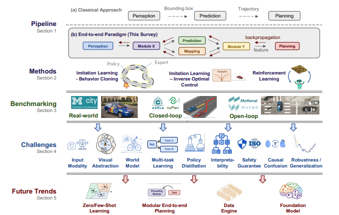
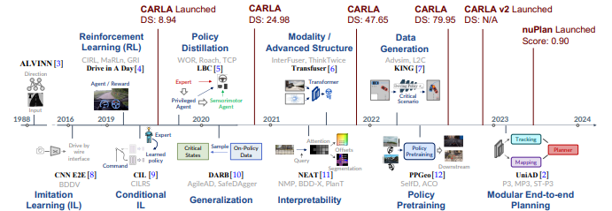
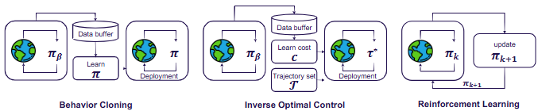
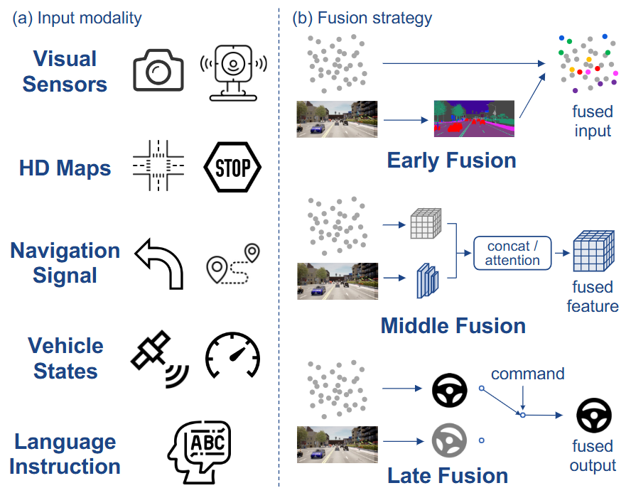
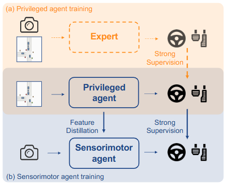
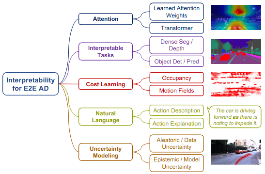
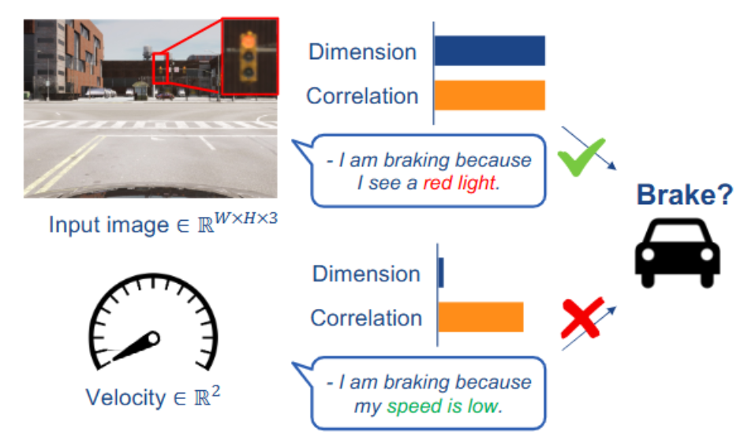
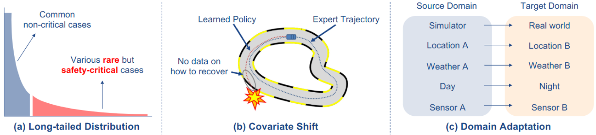

# E2E自動運転AIサーベイ論文

[End-to-end Autonomous Driving: Challenges and Frontiers](https://arxiv.org/abs/2306.16927)の和訳

## Abstract

自動運転コミュニティでは、検出や運動予測といった個別タスクに集中するのではなく、生のセンサー入力を利用して車両運動計画を生成するエンドツーエンドアルゴリズムフレームワークを採用するアプローチが急速に成長している。モジュール式パイプラインと比較して、エンドツーエンドシステムは知覚と計画のための共同特徴最適化の恩恵を受ける。この分野の発展は、大規模データセットの利用可能性、閉ループ評価、そして困難なシナリオで効果的に動作する自律走行アルゴリズムへの需要の高まりによって促進されてきた。本調査では、エンドツーエンド自律走行の動機付け、ロードマップ、方法論、課題、将来動向を網羅する270本以上の論文を包括的に分析する。マルチモーダリティ、解釈可能性、因果関係の混同、頑健性、世界モデルなど、いくつかの重要な課題について掘り下げます。さらに、基盤モデルと視覚的事前学習における現在の進展、およびこれらの技術をエンドツーエンド運転フレームワークに組み込む方法についても議論します。最新の情報を掲載したリポジトリを積極的に維持しています。

## 1 INTRODUCTION

従来の自動運転システムはモジュール設計戦略を採用しており、知覚、予測、計画といった各機能が個別に開発され、車載システムに統合される。ステアリングや加速の出力を生成する計画／制御モジュールは、運転体験を決定する上で極めて重要な役割を担う。モジュール型パイプラインにおける計画手法として最も一般的なのは、高度なルールベース設計の利用であるが、これは道路上で発生する膨大な状況に対処するには往々にして非効率的である。したがって、大規模データを活用し、学習ベースの計画を実行可能な代替手段として採用する傾向が強まっている。

エンドツーエンド自律走行システムを、生センサーデータを入力として受け取り、計画および／または低レベル制御動作を出力として生成する完全微分可能なプログラムと定義する。図1(a)-(b)は従来型とエンドツーエンドの定式化の違いを示す。従来型アプローチでは、バウンディングボックスや車両軌跡など各コンポーネントの出力を後続ユニットに直接供給する（破線矢印）。これに対し、エンドツーエンドのパラダイムでは特徴表現がコンポーネント間で伝播される（灰色の実線矢印）。最適化対象は例えば計画性能と設定され、バックプロパゲーションにより損失関数が最小化される（赤色矢印）。このプロセスにおいてタスクは統合的かつグローバルに最適化される。

*調査の概要(a) パイプラインと手法エンドツーエンド自律走行を、生センサー入力と計画/制御出力を備えた学習ベースのアルゴリズムフレームワークと定義する。270本以上の論文を詳細に分析し、模倣学習（IL）と強化学習（RL）に分類する。(b) ベンチマーク評価。主要なベンチマークを閉ループ評価と開ループ評価に分類。閉ループシミュレーションの多様な側面と、本課題における開ループ評価の限界点を網羅。(c) 課題。本稿の核心となるセクションである。幅広いトピックから主要課題を列挙し、これらの懸念が極めて重要である理由を詳細に分析する。これらの課題に対する有望な解決策についても取り上げる。(d) 今後の動向。基盤モデルの急速な発展や視覚的事前学習などの支援により、エンドツーエンドパラダイムがどのように恩恵を受け得るかを議論する。一部写真はオンラインリソースより提供*

本調査では、この新興トピックについて広範なレビューを行う。図1は本研究の概要を示す。まず、エンドツーエンド自律走行システムの動機付けとロードマップについて議論する。エンドツーエンドアプローチは模倣学習と強化学習に大別され、これらの手法について簡潔に概説する。閉ループ評価と開ループ評価の両方におけるデータセットとベンチマークを網羅する。解釈可能性、汎化性能、世界モデル、因果関係の混同など、一連の重要な課題を要約する。最後に、データエンジンや大規模基盤モデルなどからの最新進展を取り込むためにコミュニティが取り組むべき将来の動向について議論する。なお、本レビューは主に理論的観点から構成されていることに留意されたい。バージョン管理、ユニットテスト、データサーバー、データクリーニング、ソフトウェア・ハードウェアの共同設計などのエンジニアリング努力は、エンドツーエンド技術の導入において重要な役割を果たす。これらのトピックに関する最新の実践に関する公開情報は限られている。今後の議論において、コミュニティがよりオープンになることを期待する。

### 1.1 End-to-end Systemのモチベーション

従来のパイプラインでは、各モデルは独立したコンポーネントとして機能し、特定のタスク（例：信号機検出）に対応する。この設計は解釈可能性とデバッグの容易さの点で有益である。しかし、モジュール間の最適化目標が異なるため（検出は平均精度（mAP）を追求し、計画は運転の安全性と快適性を目指す）、システム全体が統一された目標、すなわち最終的な計画／制御タスクと整合しない可能性がある。順次処理が進むにつれ、各モジュールからの誤差が累積し、情報損失を招く可能性がある。さらに、単一のエンドツーエンドニューラルネットワークと比較して、複数のエンコーダとメッセージ伝達システムを伴うマルチタスク・マルチモデル展開は、計算負荷を増大させ、計算リソースの非効率的な使用につながる恐れがある。

従来のモデルとは対照的に、エンドツーエンド自律システムにはいくつかの利点がある。(a) 最も明らかな利点は、知覚・予測・計画を単一モデルに統合し、それらを共同で学習できる簡潔さである。(b) 中間表現を含むシステム全体が最終課題に向けて最適化される。(c) 共有バックボーンにより計算効率が向上する。(d) データ駆動型最適化は、単に訓練リソースをスケールアップするだけでシステムを改善する可能性を秘めている。

エンドツーエンドパラダイムが必ずしも計画／制御出力のみを持つ単一のブラックボックスを意味するわけではないことに留意されたい。従来型アプローチと同様に、中間表現と出力を有し得る（図1(b)）。実際、複数の最先端システム[^1], [^2]はモジュール設計を提案しつつ、優れた性能を達成するために全コンポーネントを統合的に最適化している。

### 1.2 End-to-end Systemの歴史

図2はエンドツーエンド自律走行における重要な成果の時系列ロードマップを示しており、各部分は本質的なパラダイムシフトまたは性能向上を示す。エンドツーエンド自律走行の歴史は1988年のALVINN [^3]に遡り、カメラとレーザー測距装置からの2つの「網膜」を入力とし、単純なニューラルネットワークがステアリング出力を生成した。NVIDIAはプロトタイプのエンドツーエンドCNNシステムを設計し、GPUコンピューティングの新時代においてこの概念を再確立した[^8]。深層ニューラルネットワークの開発により、模倣学習[^15], [^16]と強化学習[^4], [^17], [^18], [^19]の両分野で顕著な進展が達成された。LBC[^5]で提案されたポリシー蒸留パラダイムと関連手法[^20], [^21], [^22], [^23]は、良好な挙動を示すエキスパートを模倣することで閉ループ性能を大幅に向上させた。エキスパートと学習済みポリシーの乖離による汎化能力の強化のため、複数の論文[^10], [^24], [^25]がトレーニング中のオンポリシーデータ[^26]の集約を提案している。

*図2：エンドツーエンド自律走行のロードマップ[^9]。主要なマイルストーンを時系列で提示し、類似の研究を同一テーマに分類している。代表的な研究または最初の研究は図解付きで太字表示し、同一テーマ内のその他の文献の発表時期は異なる場合がある。また、CARLAリーダーボード[^13]（DS、0～100点）および最近のnuPlanチャレンジ[^14]（スコア、0～1点）における各年の最高スコアも表示している。*

2021年頃、重要な転換点が訪れた。妥当な計算コスト内で多様なセンサー構成が可能となったことで、TransFuser [^6], [^28] やその多くの派生モデル [^29], [^30], [^31] に見られるように、より多くのモダリティと高度なアーキテクチャ（例：Transformers [^27]）を組み込み、グローバルな文脈と代表的な特徴を捉えることに焦点が当てられた。シミュレーション環境に関する知見の深化と相まって、これらの先進的設計はCARLAベンチマーク[^13]において大幅な性能向上をもたらした。自律システムの解釈可能性と安全性を高めるため、学習プロセスをより適切に監視したり注意視覚化を活用したりする様々な補助モジュールを明示的に組み込むアプローチ[^11], [^32], [^33]が提案されている。最近の研究では、安全性が極めて重要なデータの生成[^7], [^34], [^35]、ポリシー学習用に調整された基盤モデルまたはバックボーンの事前学習[^12], [^36], [^37]、モジュール化されたエンドツーエンド計画哲学の提唱[^1], [^2], [^38], [^39]が優先されている。一方、この分野の研究を促進するため、新しく挑戦的なCARLA v2[^13]およびnuPlan[^14]ベンチマークが導入されている。

### 1.3 他のサーベイとの比較

本調査と先行調査[^40], [^41], [^42], [^43], [^44], [^45], [^46], [^47], [^48]との相違点を明確にしたいと思います。先行調査の一部[^40], [^41], [^42], [^43]は、エンドツーエンドシステムという点で当調査と類似した内容を扱っています。しかし、これらは分野における近年の大きな変遷に伴い登場した新たなベンチマークやアプローチを網羅しておらず、フロンティアや課題への言及も限定的です。その他の調査は、模倣学習[^44], [^45], [^46]や強化学習[^47], [^48]など、この領域の特定トピックに焦点を当てている。これに対し、本調査は幅広いトピックを網羅し、重要な課題について深く議論することで、この分野における最新動向に関する最新情報を提供する。

### 1.4 本サーベイの意義

本サーベイは、以下の3つの意義を持ちます

- (a) 高度な動機付け、方法論、ベンチマークなどを含む、エンドツーエンド自律走行に関する包括的な分析を初めて提供する。単一ブロックの最適化ではなく、安全で快適な運転の実現を最終目標として、アルゴリズムフレームワーク全体を設計する哲学を提唱する。
- (b) 並列アプローチが直面する重大な課題を徹底的に調査した。調査対象の270本以上の論文から主要な側面を要約し、汎化性、言語ガイド学習、因果関係の混同などのトピックについて詳細な分析を提供している。
- (c) 大規模基盤モデルとデータエンジンの活用がもたらす広範な影響を考察する。本研究領域と、それが提供する高品質データの膨大な規模が、この分野を大きく前進させると確信している。今後の研究促進のため、新規文献やオープンソースプロジェクトを随時更新するリポジトリを運用している。

## 2. E2E自動運転AIの分類

本節では、既存のエンドツーエンド自動運転アプローチの大半の基盤となる基本原理を概説する。2.1節では模倣学習を用いた手法について論じ、最も普及している二つのサブカテゴリーである行動クローン法と逆最適制御の詳細を説明する。2.2節では強化学習パラダイムに基づく手法をまとめる。

*図3：2つの模倣学習フレームワーク（行動クローニング（Behavior Cloning）と逆最適制御（Inverse Optimal Control））と、オンライン強化学習（Reinforcement Learning）を含む3つの一般的なパラダイムを図示する。*

### 2.1 模倣学習

模倣学習（Imitation Learning, IL）は、実演からの学習とも呼ばれ、エキスパート（熟練者）の行動を模倣することで、エージェント（学習主体）がポリシー（制御則）を習得する手法である。ILには、エキスパートのポリシー\(\pi_\beta\)のもとで収集された軌跡（trajectory）のデータセット\(D = \{\xi_i\}\)が必要であり、各軌跡は状態（state）と行動（action）のペアのシーケンスで構成される。ILの目的は、エキスパートのポリシー\(\pi_\beta\)と一致するエージェントのポリシー\(\pi\)を学習することである。

学習されるポリシー\(\pi\)は、計画された軌跡（planned trajectories）または制御信号（control signals）を出力することができる。初期の研究では、データ収集の容易さから制御出力を採用することが多かった。しかし、異なるステップで制御を予測すると、操作が不連続になる可能性があり、また、ネットワークが特定の車両ダイナミクスに特化してしまうため、他の車両への汎化が妨げられるという問題があった。これに対し、経路上のウェイポイント（waypoints）を予測する手法も存在し、これは比較的長い時間軸を考慮する。一方で、車両が追従すべき軌跡を制御信号に変換するには、車両モデルや制御アルゴリズムが関与するため、追加のコントローラが必要となり、これは簡単ではない。これら2つのパラダイム間に明確な性能差がないことから、本サーベイではこれらを特に区別せず扱う。より詳細な議論は[^22]に譲る。

ILの中で広く用いられる手法の一つが、**行動クローニング**（Behavior Cloning, BC）[^49]である。BCは、ILの問題を教師あり学習に帰着させる。また、**逆最適制御**（Inverse Optimal Control, IOC）または逆強化学習（Inverse Reinforcement Learning, IRL）[^50]も、ILの一種であり、エキスパートの実演から報酬関数を学習する手法である。以下、これら2つのカテゴリについて詳述する。

#### 2.1.1 行動クローニング (BC)

BCでは、エージェントのポリシーをエキスパートのものと一致させるために、収集したデータセット上で教師あり学習として計画損失を最小化する。これは\(​\mathbb{E}​_{(s,a)} \ell(\pi_{\theta} (s), a)\)の形で表され、\(\ell(\pi_{\theta} (s), a)\)はエージェントの行動とエキスパートの行動の間の距離を測る損失関数である。自動運転のためのBCの初期の応用[^3], [^8], [^51]では、カメラ入力から制御信号を生成するためにエンドツーエンドのニューラルネットワークを利用した。さらに、マルチセンサー入力[^6], [^52]や補助タスク[^16], [^28]、エキスパート設計の改善[^21]などの発展により、BCベースのエンドツーエンド運転モデルは複雑な都市環境にも対応できるようになった。BCはシンプルで効率的であり、RLで必要な報酬設計が不要な点が利点である。しかし、訓練時に各状態を独立同分布と見なすため、共変量シフトの問題が生じる。一般的なILでは、この問題に対処するためにいくつかのオンポリシー手法が提案されている[^26], [^53], [^54], [^55]。エンドツーエンド自動運転では、DAgger[^26]が[^5], [^10], [^25], [^56]などで採用された。また、入力と出力の誤った相関に依存してしまう因果的混乱もBCの問題として知られ、エンドツーエンド自動運転の文脈で[^57], [^58], [^59], [^60]などで議論されている。これら2つの課題については、Sec. 4.9とSec. 4.8でさらに詳述する。

#### 2.1.2 逆最適制御 (IOC)

伝統的な逆最適制御（IOC: Inverse Optimal Control）アルゴリズムは、エキスパートの実演から未知の報酬関数\(R(s, a)\)を学習する。ここで、エキスパートの報酬関数は特徴量の線形結合として表現できることが多い[^50], [^61], [^62], [^63], [^64]。しかし、連続かつ高次元の自動運転シナリオでは、報酬の定義は暗黙的であり、最適化が難しい。生成対向模倣学習（Generative Adversarial Imitation Learning）[^65], [^66], [^67]は、IOCにおける一つの特殊なアプローチであり、報酬関数を、生成対向ネットワーク（GAN: Generative Adversarial Networks）[^68]の概念と同様に、エキスパートと学習済みポリシーを区別するための対向的目標として設計する。最近、いくつかの研究は、補助的な知覚タスクとともにコスト体積またはコスト関数を最適化することを提案している。コストは報酬の別の表現であるため、これらの手法はIOCの範疇に属すると分類される。コスト学習の枠組みは以下のように定義される。エンドツーエンドアプローチは妥当なコスト\(c(\cdot)\)を学習し、アルゴリズム的な軌跡サンプラーを用いて最小コストの軌跡\(\tau^*\)を選択する（図3参照）。コスト設計に関しては、バードアイ・ビュー（BEV）における学習済みコスト体積[^32]、他のエージェントの将来の動きから計算される結合エネルギー[^69]、または確率的意味占有やフリースペース層のセット[^39], [^70], [^71]などの表現がある。一方、軌跡は通常、固定されたエキスパート軌跡セットからのサンプリング[^1], [^72]、または運動学モデルを用いたパラメータサンプリングによって生成される[^32], [^38], [^39], [^70]。そして、古典的なIOC手法と同様に、最大マージン損失が採用され、エキスパートの実演が最小コストとなり、他の軌跡が高いコストとなるように学習が行われる。コスト学習アプローチにはいくつかの課題が存在する。特に、より現実的なコストを生成するために、HDマップや補助的な知覚タスク、複数のセンサーが一般的に組み込まれるが、これによりマルチモーダル・マルチタスクフレームワークにおける学習とデータセット構築の難しさが増す。それにもかかわらず、前述のコスト学習手法は意思決定の安全性と解釈可能性を大幅に向上させ（Sec. 4.6参照）、産業界にインスパイアされたエンドツーエンドシステム設計が実世界への応用に適したアプローチであるとわれわれは考えている。

### 2.2 強化学習

強化学習（Reinforcement Learning, RL）[^73], [^74]は、試行錯誤による学習の分野である。Deep Q-Networks（DQN）[^75]がAtariベンチマーク[^76]で人間の制御レベルを達成したことにより、深層強化学習が広く知られるようになった。DQNは、現在の状態と行動を入力として受け取り、その行動の割引収益を予測するニューラルネットワーク（クリティックまたはQ-ネットワーク）を訓練する。ポリシーは、予測収益が最も高い行動を選択することによって暗黙的に定義される。RLには、潜在的に安全でない行動を実行できる環境が必要であり、新しいデータを収集する（例えば、ランダムな行動を通じて）。さらに、RLはILよりも訓練に大幅に多くのデータを必要とする。このため、現代のRL手法では、複数の環境にわたってデータ収集を並列化することが多い[^77]。実世界でこれらの要件を満たすことは大きな課題となる。したがって、運転にRLを用いたほとんどの研究はシミュレーション環境でのみ行われている。多くはDQNのさまざまな拡張を使用しており、コミュニティはまだ特定のRLアルゴリズムに収束していない。

RLは、空の道路での実車によるレーン追従を学習することに成功している[^4]。この結果は有望であるが、同様のタスクが30年前にILによってすでに達成されていたことに留意すべきである[^3]。現在まで、ILと競合するエンドツーエンドのRL訓練の結果は報告されていない。この失敗の理由は、おそらく、RLを通じて得られる勾配が、運転に必要な深い知覚アーキテクチャ（ResNetなど）を訓練するのに不十分であるためと考えられる。RLが成功しているAtariなどのベンチマークで使用されるモデルは比較的浅く、わずか数層で構成されている[^78]。

RLは、教師あり学習（SL）と組み合わせることでエンドツーエンド運転にうまく適用されている。Implicit Affordances[^18], [^19]では、CNNエンコーダをセマンティックセグメンテーションなどのタスクで事前学習し、2段階目でこのエンコーダを凍結し、凍結されたエンコーダの特徴量を用いて浅いポリシーヘッドを現代的なQ学習[^79]で訓練する。RLは、ILで事前学習されたネットワークの微調整にも使用できる[^17], [^80]。また、ネットワークが特権的なシミュレータ情報にアクセスできる場合にも効果的に適用できる[^48], [^81], [^82]。特権的なRLエージェントはデータセットのキュレーションに使用できる。Roach[^21]は、特権的なBEVセマンティックマップ上でRLエージェントを訓練し、そのポリシーを使って下流のILエージェントを訓練するためのデータセットを自動的に収集する。WoR[^20]は、Q関数とタブラル動的計画法を用いて、静的なデータセットに対する追加または改善されたラベルを生成する。

この分野における課題の一つは、シミュレーションから実世界への知見の転移である。RLでは、目的は報酬関数として表現され、多くのアルゴリズムはそれらが密で、各環境ステップでフィードバックを提供することを要求する。現在の研究では、進捗や衝突回避などの単純な目的が一般的である。これらの単純な設計は、リスクの高い行動を促進する可能性がある[^81]。より良い報酬関数の設計または学習は未解決の問題である。別の方向性としては、スパース報酬を扱えるRLアルゴリズムを開発し、関連する指標を直接最適化することが挙げられる。RLは、世界モデル[^83], [^84], [^85]と効果的に組み合わせることができるが、これには特有の課題がある（Sec. 4.3参照）。現在の自動運転のためのRLソリューションは、シーンの低次元表現に大きく依存しており、この問題についてはSec. 4.2.2でさらに議論する。

## 3 ベンチマーク評価

自動運転システムは安全性を確保するために包括的な評価を必要とする。研究者はこれを達成するために、適切なデータセット、シミュレータ、指標、ハードウェアを用いてこれらのシステムをベンチマークしなければならない。本節では、エンドツーエンド自動運転システムのベンチマークに対する3つのアプローチを区別する：（1）実世界評価、（2）シミュレーションにおけるオンラインまたはクローズドループ評価、（3）運転データセット上でのオフラインまたはオープンプループ評価。スケーラブルで原理的なオンラインシミュレーション設定に焦点を当て、実世界およびオフライン評価を完全性のために要約する。

### 3.1 実世界評価

自動運転のベンチマークに関する初期の取り組みは、実世界での評価を含んでいた。特に、DARPAは一連のレースを主催した。最初のイベントでは、240kmのルートをモハーベ砂漠を通過して自律走行する車両に100万ドルの賞金が提供されたが、達成したチームはなかった[^86]。最終シリーズのイベントであるDARPA Urban Challengeでは、車両は交通法規に従いながら障害物を避けつつ、96kmの模擬都市コースを走行する必要があった[^87]。これらのレースは、LiDARセンサーなどの自動運転技術の重要な発展を促進した。この精神を受け継ぎ、ミシガン大学は自動運転車のテストを容易にするために、大きな制御された実世界環境であるMCityを設立した[^88]。しかし、データと車両の不足により、このような学術的な取り組みはエンドツーエンドシステムには広く採用されていない。一方で、無人運転車のフリートを展開するための資源を持つ業界では、アルゴリズムの改善をベンチマークするために実世界評価に頼ることができる。

### 3.2 オンライン/クローズドループシミュレーション

実世界で自動運転システムのテストを実施することはコストがかかり、リスクも伴う。この課題に対処するために、シミュレーションは有効な代替手段である[^14], [^89], [^90], [^91], [^92], [^93]。シミュレータは、迅速なプロトタイピングとテストを容易にし、アイデアの迅速な反復を可能にし、ユニットテストのための多様なシナリオへの低コストでのアクセスを提供する。さらに、シミュレータは、性能を正確に測定するためのツールを提供する。しかし、シミュレーション環境で得られた結果が必ずしも実世界に一般化するとは限らないことが主な欠点である（Sec. 4.9.3）。

クローズドループ評価では、実世界のドライビング環境を密接に模倣したシミュレーション環境を構築する。評価では、シミュレーション環境で運転システムを展開し、その性能を測定する。システムは、指定された目的地に向かって進みながら、交通の中を安全に走行しなければならない。このようなシミュレータを開発するには、4つの主要なサブタスクが含まれる：パラメータ初期化、交通シミュレーション、センサーシミュレーション、および車両ダイナミクスシミュレーション。これらのサブタスクについて以下に簡潔に説明し、続いて、現在利用可能なクローズドループベンチマークのためのオープンソースシミュレータの概要を示す。

#### 3.2.1 パラメータ初期化

シミュレーションの利点の一つは、気象、地図、3Dアセット、交通シーンにおけるオブジェクトの配置などの低レベルの属性を含む環境を高度に制御できることである。しかし、これらのパラメータの数は膨大であり、設計上の課題となる。現在のシミュレータは、この問題に2つの方法で対処している。

##### プロシージャル生成

従来、初期パラメータは3Dアーティストやエンジニアによって手動で調整されていた[^89], [^90], [^91], [^92]。これはスケーラビリティを制限する。近年、コンピュータアルゴリズムを用いて、シミュレーションの特性の一部を確率分布からサンプリングすることが可能になった。これはプロシージャル生成と呼ばれる[^94]。プロシージャル生成アルゴリズムは、ルール、ヒューリスティック、およびランダム化を組み合わせて、多様な道路網、交通パターン、照明条件、およびオブジェクト配置を作成する[^95], [^96]。手動設計に比べて効率的であるため、ビデオゲームやシミュレーションでの初期化手法として広く採用されている。しかし、このプロセスには、生成の信頼性を制御するための事前定義されたパラメータとアルゴリズムが必要であり、時間と専門知識を要する。

##### データ駆動型

シミュレーション初期化のためのデータ駆動型アプローチは、必要なパラメータを学習することを目的とする。最も簡単な方法は、実際のドライビングログからサンプリングすることである[^14] [^93]。ここでは、道路地図や交通パターンなどのパラメータが、事前に記録されたデータセットから直接抽出される。ログサンプリングの利点は、実世界のデータに存在する自然な変動性を捉えることができ、より現実的なシミュレーションシナリオにつながることである。ただし、自動運転システムの堅牢性をテストするために重要なまれな状況を包含できない可能性がある。このようなシナリオの表現を増やすために、初期パラメータを最適化することができる[^7], [^34], [^35]。初期化に対するもう一つの高度なデータ駆動型アプローチは、生成モデリングである。ここでは、機械学習アルゴリズムを利用して、実世界のデータの潜在的な構造と分布を学習する。そして、実世界に似ているが元のデータには含まれていない新しいシナリオを生成することができる[^97], [^98], [^99], [^100]。

#### 3.2.2 交通シミュレーション

交通シミュレーションには、現実的な動きで環境内に仮想エンティティを生成し、配置することが含まれる[^98], [^101]。これらのエンティティには、車両（自動車、オートバイ、自転車など）や歩行者が含まれることが多い。交通シミュレータは、速度、加速度、制動、妨害、および他のエンティティの動作の影響を考慮する必要がある。さらに、信号の状態は、現実的な市街地運転をシミュレートするために定期的に更新されなければならない。交通シミュレーションには2つの一般的なアプローチがあり、これを以下に説明する。

##### ルールベース

ルールベースの交通シミュレータは、定義済みのルールを使用して、交通エンティティの動きを生成する。この概念の最も顕著な実装は、インテリジェントドライバーモデル (IDM) である[^102]。IDMは、現在の速度、先行車両の速度、および所望の安全距離に基づいて、各車両の加速度を計算する、車追従モデルである。広く使用され、単純明快であるが、このアプローチは、都市環境における現実的な動きや複雑な相互作用をシミュレートするには不十分な場合がある。

##### データ駆動型交通シミュレーション

現実的な人間の交通行動は、車線変更、マージ、突然の停止など、非常にインタラクティブで複雑なものである。このような行動をモデル化するために、データ駆動型の交通シミュレーションでは、実世界のドライビングから収集されたデータを利用する。これらのモデルは、より微妙で現実的な行動を捉えることができるが、トレーニングには大量のラベル付きデータが必要となる。このタスクには、幅広い学習ベースの手法が提案されている[^98], [^99], [^101], [^103], [^104], [^105]。

#### 3.2.3 センサシミュレーション

センサシミュレーションは、エンドツーエンドの自動運転システムを評価する上で非常に重要である。これには、シミュレータ内の異なる視点から運転システムが受信するであろう、カメラ画像やLiDARスキャンなどのシミュレートされた生のセンサデータを生成することが含まれる [^106], [^107], [^108]。このプロセスでは、ノイズやオクルージョンを考慮して、自動運転システムを現実的に評価する必要がある。センサシミュレーションに関するアイデアには、主に2つの流れがある。以下に説明する。

##### グラフィックスベース

最近のコンピュータグラフィックスシミュレータは、環境の3Dモデルと交通エンティティモデルを使用して、センサ内の物理的なレンダリングプロセスを近似することによりセンサデータを生成する[^90], [^91]。たとえば、これには、カメラ画像をシミュレートする際に、実世界の環境に存在するオクルージョン、影、反射などが含まれる。ただし、グラフィックスベースのシミュレーションのリアリズムは、しばしば不十分であるか、重い計算を伴うため、並列化が簡単ではない[^109]。これは、3Dモデルの品質とセンサのモデリングに使用される近似に密接に関連している。ドライビングデータのためのグラフィックスベースのレンダリングに関する包括的な調査は、[^110]で提供されている。

##### データ駆動型センサシミュレーション

データ駆動型のセンサシミュレーションは、実世界のセンサデータを活用して、エゴ車両と背景交通の両方が記録時とは異なる動きをするシミュレーションを作成する[^111], [^112], [^113]。一般的な手法としては、Neural Radiance Fields (NeRF) [^114]や3D Gaussian Splatting [^115]があり、シーンの幾何学と外観の暗黙的表現を学習することで、シーンの新しいビューを生成できる。これらの手法は、グラフィックスベースのアプローチよりも視覚的に現実的なセンサデータを生成できるが、レンダリングに時間がかかったり、再構成する各シーンごとに独立したトレーニングが必要になる[^108], [^116], [^117], [^118], [^119]などの制限がある。データ駆動型センサシミュレーションのもう一つのアプローチは、ドメイン適応であり、実センサデータとグラフィックスベースのシミュレートセンサデータの間のギャップを最小化することを目的としている [^120]。GAN などのディープラーニング技術を用いて、リアリズムを向上させることができる（セクション4.9.3）。

#### 3.2.4 車両ダイナミクスシミュレーション

運転シミュレーションの最後の側面は、シミュレートされた車両が物理的に妥当な動きに従うことを保証することである。現在公開されているほとんどのシミュレータは、ユニサイクルモデル[^121]や自転車モデル[^122]などの非常に単純化された車両モデルを使用している。しかし、アルゴリズムをシミュレーションから実世界へシームレスに移行させるためには、より正確な車両ダイナミクスの物理モデリングを取り入れることが不可欠である。たとえば、CARLAはマルチボディシステムアプローチを採用し、車両を4つの車輪上のバネ質量の集合として表現している。包括的なレビューについては、[^123]を参照されたい。

#### 3.2.5 ベンチマーク

表1に、現在までに利用可能なエンドツーエンドの運転ベンチマークの簡潔な概要を示す。

|シミュレータ|ベンチマーク|
|---|---|
|CARLA|CoRL [^91], noCrash [^124], Town05 [^6], LAV [^52], Roach [^21], Longest6 [^28], Leaderboard v1 and v2 [^13]|
|nuPlan|NAVSIM [^125], Val14 [^126], Leaderboard [^14]|

2019年、CARLA[^91]でリリースされたオリジナルのベンチマークは、ほぼ完璧なスコアで解決された[^5]。その後、NoCrashベンチマーク[^124]では、特定の気象条件の下で1つのCARLAの町でトレーニングを行い、別の町と一連の気象条件への汎化をテストする。Town05ベンチマーク[^6]では、利用可能なすべての町でトレーニングを行い、Town05をテストのために保留する。同様に、LAVベンチマークは、Town02とTown05を除くすべての町でトレーニングを行い、両方をテストのために予約する。Roach[^21]は、3つのテストタウンを使用するが、すべてトレーニング中に観察されており、Town05とLAVの安全クリティカルなシナリオは含まれていない。最後に、Longest6ベンチマーク[^28]は、6つのテストタウンを使用する。Leaderboard（v1およびv2）[^13]の2つのオンラインサーバは、評価ルートを機密に保つことで公正な比較を保証する。Leaderboard v2は、長いルート長（v1の1〜2kmに対して平均8km以上）や、さまざまな新しい交通シナリオにより、非常に挑戦的である。nuPlanシミュレータは、現在NAVSIMプロジェクト[^125]を介してエンドツーエンドシステムを評価するためにアクセス可能である。さらに、nuPlan（セクション3.2.1）のデータ駆動型パラメータ初期化を介して、マップとオブジェクトプロパティを入力するエージェント用の2つのベンチマークがある。Val14は、[^126]で提案されており、nuPlanの検証分割を使用する。プライベートテストセットを使用する提出サーバであるLeaderboardは、2023年のnuPlanチャレンジで使用されたが、現在は一般公開されていない。

### 3.3 オフライン/オープンループ評価

オープンループ評価は、主に、記録された専門の運転行動に対するシステムの性能を評価する。この方法では、(1) センサの読み取り値、(2) 目標位置、(3) 対応する将来の運転軌跡を含む評価データセットが必要であり、通常は人間のドライバーから取得される。センサ入力と目標位置を入力として与えられた場合、システムの予測した将来の軌跡と運転ログの軌跡を比較することで性能が測定される。システムは、人間の正解との軌跡予測の一致度、および他のエージェントとの衝突確率などの補助的な指標に基づいて評価される。オープループ評価の利点は、シミュレータを必要としないため、現実的な交通やセンサデータを使用して簡単に実装できることである。しかし、主な欠点は、実際のテスト分布における性能を測定していないことである。テスト中に、運転システムは専門の運転経路から逸脱する可能性があり、そのようなずれから回復するシステムの能力を検証することが不可欠である（セクション4.9.2）。さらに、予測された軌跡と記録された軌跡の間の距離は、マルチモーダルシナリオでは理想的な指標ではない。たとえば、旋回レーンに合流する場合、すぐに合流するか後で合流するかという両方の選択肢が有効である可能性があるが、オープループ評価ではデータで観察されなかった選択肢にペナルティが課される。したがって、衝突確率や予測誤差を測定するだけでなく、交通違反、進行度、運転の快適性などのより包括的な側面をカバーするために、いくつかの指標が提案されている[^126]。このアプローチでは、軌跡の包括的なデータセットが必要である。この目的で最も一般的なデータセットには、nuScenes [^127]、Argoverse [^128]、Waymo [^129]、およびnuPlan [^14]がある。これらのデータセットはすべて、さまざまな難易度を持つ多数の実世界の運転トラバーサルで構成されている。しかし、前述の欠点により、オープループ結果は、クローズドループでの運転行動の改善に関する決定的な証拠を提供しない[^124], [^126], [^130], [^131]。全体として、利用可能で適用可能なクローズドループベンチマークが、今後の研究で推奨される。

## 4 E2E自動運転の課題

図1に示す各トピックに従って、現在の課題、関連研究または潜在的な解決策、リスク、および機会について説明する。まず、セクション4.1では、さまざまな入力モダリティの処理における課題から始める。次に、セクション4.2では、効率的なポリシー学習のための視覚的抽象化に関する議論を行う。さらに、ワールドモデル学習（セクション4.3）、マルチタスクフレームワーク（セクション4.4）、ポリシーディスティレーション（セクション4.5）などの学習パラダイムを紹介する。最後に、セクション4.6の解釈可能性、セクション4.7の安全性保証、セクション4.8の因果関係の混乱、セクション4.9のロバスト性など、安全で信頼性の高いエンドツーエンドの自動運転を妨げる一般的な問題について議論する。

### 4.1 センシングと入力モダリティに関するジレンマ

#### 4.1.1 センシングとマルチセンサフュージョン

##### センシング

初期の研究[^8]では、単眼カメラで車線を追従することに成功したが、この単一の入力モダリティでは複雑なシナリオに対応できない。そのため、図4に示すように、さまざまなセンサが最近の自動運転車両に導入されている。特に、カメラからのRGB画像は、人間が世界を認識する方法を再現し、豊富な意味論的な詳細を提供する。LiDARやステレオカメラは、正確な3D空間情報を提供する。ミリ波レーダーやイベントカメラなどの新しいセンサーは、物体の相対的な動きを捉えるのに優れている。さらに、速度計やIMUからの車両の状態、およびナビゲーションコマンドは、運転システムをガイドする他の入力ラインである。しかし、さまざまなセンサーは、それぞれ異なる視点、データ分布、および大きな価格差を持っており、自動運転のために効果的にセンサーのレイアウトを設計し、それらを融合して互いに補完させるという課題が生じる。

*図4：入力モダリティと融合戦略の例。異なるモダリティはそれぞれ異なる特性を持っており、効果的なセンサ融合の課題につながる。ここでは、ポイントクラウドと画像を例に、さまざまな融合戦略を示す。*

##### マルチセンサーフュージョン

マルチセンサーフュージョンは、物体検出 [^132], [^133] やセマンティックセグメンテーション [^134], [^135] などの知覚関連分野で主に議論されており、通常、初期融合、中間融合、後期融合の3つのグループに分類される。エンドツーエンドの自動運転アルゴリズムも同様の融合スキームを探求している。初期融合は、共有特徴抽出器に供給する前にセンサ入力を結合するもので、結合は融合のための一般的な方法である [^32], [^136], [^137], [^138], [^139]。視点の不一致を解決するために、点群を画像に投影する [^140]、またはその逆（LiDAR 点のセマンティックラベルを予測する [^52], [^141]）などの手法が用いられる。一方、後期融合は、複数のモダリティからの複数の結果を結合するもので、性能が劣るためあまり議論されていない [^6], [^142]。これらの方法とは対照的に、中間融合は、入力を別々に符号化し、特徴レベルで融合することで、ネットワーク内でマルチセンサーフュージョンを実現する。単純な結合も頻繁に採用されている [^15], [^22], [^30], [^143], [^144], [^145], [^146], [^147]。最近では、Transformer [27] を用いて特徴間の相互作用をモデル化する手法が登場している [^6], [^28], [^29], [^148], [^149]。Transformer の注意メカニズムは、異なるセンサ入力のコンテキストを集約し、より安全なエンドツーエンドの自動運転を実現する上で大きな効果を発揮している。知覚の進歩に触発されて、BEV [^132], [^133] のような統一された空間でモダリティをモデル化することは有益である。エンドツーエンドの自動運転では、ポリシー関連のコンテキストを特定し、無関係な詳細を破棄することも必要である。知覚に基づく表現については、セクション 4.2.1 で議論する。さらに、自己注意層は、すべてのトークンを自由に相互接続するため、大きな計算コストがかかり、有用な情報抽出を保証できない。知覚分野における高度な Transformer ベースの融合メカニズム [^150], [^151] は、エンドツーエンドの自動運転タスクへの応用が期待されている。

#### 4.1.2 言語入力の活用

人間は視覚的知覚と内在的な知識の両方を用いて因果的な行動をとっている。自動運転に関連する分野、例えば具現化AIでは、視覚運動エージェントを制御するための微細な知識や指示として自然言語を取り入れることで顕著な進歩が見られた[^152], [^153], [^154], [^155]。しかし、ロボット工学的な応用と比較すると、運転タスクはタスク分解を必要とせず、より単純である一方、屋外環境は高度に動的なエージェントが存在し、接地のための特徴的なアンカーが少ないため、非常に複雑である。運転に言語知識を取り入れるために、いくつかのデータセットが提案され、屋外での接地や視覚言語ナビゲーションタスクのベンチマークが行われている[^156], [^157], [^158], [^159]。HAD[^160]は人から車へのアドバイスを取り入れ、視覚的接地タスクを追加した。Sriramら[^161]は自然言語指示を高レベルの行動に変換し、[^162],[^163]はテキストを直接接地させた。CLIP-MC[^164]とLM-Nav[^165]はCLIP[^166]を用いて、指示から言語知識を抽出し、画像から視覚的特徴を抽出した。

最近、大きな言語モデル（LLMs）の急速な発展[^167], [^168]を受けて、知覚されたシーンをトークンにエンコードし、LLMsに制御予測とテキストベースの説明を求める研究が行われている[^169], [^170], [^171]。研究者たちはまた、運転タスクを質問応答問題として定式化し、対応するベンチマークを構築している[^172], [^173]。これらの研究は、LLMsが複雑な指示の処理や異なるデータ領域への一般化を可能にする機会を提供し、ロボット工学への応用と同様の利点があることを強調している[^174]。しかし、現在のLLMsを道路上の運転に用いることは、推論時間の長さ、定量的精度の低さ、出力の不安定さなどの課題がある。潜在的な解決策としては、複雑なシナリオに限定してクラウド上でLLMsを活用することや、高レベルの行動予測にのみLLMsを用いることが考えられる。

### 4.2 視覚的抽象化への依存

エンドツーエンドの自動運転システムは、状態を潜在的な特徴表現にエンコードする段階と、その中間的な特徴を用いて運転方針をデコードする段階の2つに大別される。都市部での運転では、入力状態、すなわち周囲の環境と自車状態は、ビデオゲーム[^18], [^175]などの一般的な方針学習ベンチマークと比較して、はるかに多様で高次元である。これは、表現と意思決定に必要な注意領域との間にミスアライメントを引き起こす可能性がある。したがって、「適切な」中間的な知覚表現を設計するか、プロキシタスクを用いて視覚エンコーダを事前にトレーニングすることが有効である。これにより、ネットワークは運転に有効な情報を効果的に抽出し、後続の方針段階を促進することができる。さらに、強化学習（RL）手法のサンプル効率も向上させることができる。

#### 4.2.1 表現設計

単純な表現は、様々なバックボーンを使用して抽出される。古典的な畳み込みニューラルネットワーク（CNN）は、並進等分散性と高い効率性という利点があり、依然として主流である[^176]。深度事前学習済みCNN[^177]は、知覚能力と下流タスクのパフォーマンスを大幅に向上させる。一方、Transformerベースの特徴抽出器[^178], [^179]は、知覚タスクにおいて優れたスケーラビリティを示しているが、エンドツーエンドの運転にはまだ広く採用されていない。運転特有の表現として、研究者たちは、異なるセンサー入力と時間情報を統一された3D空間内で融合するBird's Eye View（BEV）の概念を導入している[^133], [^180], [^181]。これは、下流タスクへの適応も容易にする[^2], [^30], [^182], [^183]。さらに、グリッドベースの3D占有率が開発され、不規則な物体を捉え、計画時の衝突回避に使用されている[^184]。しかし、BEV法に比べて、密な表現には膨大な計算コストがかかる。もう一つの未解決の問題は、マップの表現である。従来の自動運転はHDマップに依存しているが、HDマップの入手コストが高いため、BEVセグメンテーション[^185]、ベクトル化されたレーンファイン[^186]、中心線とそのトポロジー[^187], [^188]、レーンセグメント[^189]など、さまざまな定式化によるオンラインマッピング手法が考案されている。しかし、エンドツーエンドシステムに最も適した定式化はまだ検証されていない。

様々な表現設計は、後続の意思決定プロセスをどのように設計するかについての可能性を提供するが、全体のフレームワークとして両方の部分を共同設計する必要があるため、課題も生じる。さらに、トレーニングリソースの拡大によるいくつかの単純で効果的なアプローチで観察された傾向[^22], [^28]を考えると、マップなどの明示的な表現の究極的な必要性は不確かである。

#### 4.2.2 表現学習

表現学習は、特定の帰納バイアスや事前情報を組み込むことが多い。学習された表現には、情報のボトルネックが生じる可能性があり、決定に関係のない冗長な文脈が削除される可能性がある。初期の手法の中には、事前に学習されたネットワークからのセマンティックセグメンテーションマスクを、後続のポリシー学習の入力表現として直接利用するものがある [^190], [^191]。SESR [^192]は、VAE [^193]を通じてセグメンテーションマスクをクラスごとに分離された表現にさらに符号化する。[^194], [^195]では、交通信号の状態、車線中心からのオフセット、先行車両までの距離などの予測されたアフォーダンス指標が、ポリシー学習の表現として使用される。セグメンテーションなどの結果が人間によって定義されたボトルネックとなり、有用な情報が失われる可能性があることを考慮し、事前学習タスクの中間特徴をRL学習の有効な表現として選択する研究もある [^18], [^19], [^196], [^197]。[^198]では、VAEの潜在特徴が、セグメンテーションと深度マップの拡散境界から得られるアテンションマップによって拡張され、重要な領域が強調される。TARP [^199]は、一連の以前のタスクからのデータを活用して、さまざまなタスク関連の予測タスクを実行し、有用な表現を取得する。[^200]では、潜在表現は、報酬とダイナミクスモデルの出力の違いで構成されるπ-ビシミュレーションメトリックを近似することによって学習される。ACO [^36]は、コントラスト学習構造にステアリング角度の分類を追加することで、判別可能な特徴を学習する。最近、PPGeo [^12]は、未調整のドライビングビデオ上で自己教師あり方式で、深度推定とともに動き予測を通じて有効な表現を学習することを提案している。ViDAR [^201]は、生の画像と点群のペアを利用し、点群予測事前タスクで視覚エンコーダを事前学習する。これらの研究は、大規模なラベルなしデータからの自己教師あり表現学習が、ポリシー学習に有望であり、将来の研究に値することを示している。

### 4.3 モデルベース強化学習のための世界モデリングの複雑さ

エンドツーエンドモデルでは、知覚表現をより適切に抽象化する能力に加えて、安全な操作を行うために将来について合理的な予測を行うことが不可欠である。本節では、世界モデルがポリシーモデルのための明示的な将来予測を提供する現在のモデルベース強化学習（MBRL）の課題について主に議論する。深層強化学習（RL）は通常、高いサンプル複雑性に悩まされており、これは自動運転において顕著である。モデルベース強化学習は、エージェントが実際の環境ではなく学習された世界モデルと対話できるようにすることで、サンプル効率を向上させる有望な方向性を提供する。MBRL手法は、遷移ダイナミクスと報酬関数で構成される明示的な世界（環境）モデルを採用している。これは、CARLAのようなシミュレータが比較的遅い自動運転において特に有用である。しかし、高度に動的な環境をモデル化することは難しい課題である。問題を単純化するために、Chenら [^20] は、遷移ダイナミクスを非反応的な世界モデルと単純な運動学的自転車モデルに分解する。[^138] では、確率的順序潜在モデルが世界モデルとして使用される。学習した世界モデルの潜在的な不正確さを解決するために、Henaff ら [^202] は、ポリシーネットワークをドロップアウト正則化でトレーニングし、不確実性コストを推定する。別のアプローチ [^203] では、複数の世界モデルのアンサンブルを使用して不確実性の推定を行い、それに基づいて想像上のロールアウトを適切に打ち切ったり調整したりする。Dreamer [^83] に着想を得て、ISO-Dream [^204] は視覚的ダイナミクスを制御可能な状態と制御不能な状態に分離し、分離された状態でポリシーをトレーニングする。生の画像空間で世界モデルを学習することは、自動運転にとって簡単ではないことに注意すべきである。交通信号のような重要な小さな詳細は、予測された画像では見落とされやすい。この問題に対処するために、いくつかの研究 [^205], [^206], [^207] では、拡散技術 [^208] を採用している。MILE [^209] は、Dreamer スタイルの世界モデル学習を、BEV セグメンテーション空間での補助タスクとして模倣学習とともに組み込んでいる。SEM2 [^137] も Dreamer 構造を拡張しているが、BEV マップ入力を使用し、RL でトレーニングする。学習された世界モデルを MBRL に直接使用する以外に、DeRL [^197] は、モデルフリーのアクタークリティックフレームワークと世界モデルを、両方のモデルからの行動または状態の自己評価を融合することで組み合わせている。エンドツーエンドの自動運転のための世界モデル学習は、RL のサンプル複雑性を大幅に削減し、運転に役立つ世界を理解する上で有望な方向性である。しかし、運転環境は非常に複雑で動的であるため、何をモデル化する必要があるか、どのように世界を効果的にモデル化するかを決定するには、さらなる研究が必要である。

### 4.4 マルチタスク学習への依存

マルチタスク学習（MTL）は、共有表現に基づいて複数の関連タスクを別々のヘッドを通じて共同で実行することを含む。MTLは、計算コストの削減、関連するドメイン知識の共有、タスク間の関係を活用してモデルの汎化能力を向上させる能力など、さまざまな利点を提供する[^210]。したがって、MTLは、最終的なポリシー予測が環境の包括的な理解を必要とするエンドツーエンドの自動運転に適している。しかし、補助タスクの最適な組み合わせと損失の適切な重み付けによって最高のパフォーマンスを達成することは、大きな課題となる。一般的な視覚タスクとは異なり、エンドツーエンドの自動運転では密な予測が疎な信号を予測する。疎な監視は、エンコーダで意思決定に役立つ情報を抽出する難易度を高める。画像入力の場合、セマンティックセグメンテーション[^28], [^31], [^140], [^211], [^212], [^213]や深度推定[^28], [^31], [^211], [^212], [^213]などの補助タスクが、エンドツーエンドの自動運転モデルで一般的に採用されている。セマンティックセグメンテーションは、モデルがシーンを高レベルで理解するのに役立ち、深度推定により、モデルは環境の3D形状を捉え、重要なオブジェクトまでの距離をより正確に推定できる。視点画像に対する補助タスクに加えて、3Dオブジェクト検出[^28], [^31], [^52]もLiDARエンコーダに役立つ。BEVが自動運転の自然で一般的な表現になるにつれて、BEVセグメンテーションなどのタスクが、BEV空間で特徴を集約するモデルに含まれるようになった[^11], [^23], [^28], [^29], [^30], [^31], [^52], [^149]。さらに、これらの視覚タスクに加えて、[^29,] [^211], [^214]は、交通信号の状態、反対車線までの距離などの視覚的アフォーダンスも予測する。それにもかかわらず、複数のタイプの整列した高品質なアノテーションを持つ大規模なデータセットを構築することは、実世界のアプリケーションにとって自明ではない。これは、現在のモデルがMTLに大きく依存しているため、大きな懸念事項である。

### 4.5 非効率的な専門家とポリシー蒸留

模倣学習、またはその主要なサブカテゴリである行動クローニングは、専門家の行動を模倣する教師あり学習にすぎないため、対応する方法は通常「教師-生徒」パラダイムに従います。ここには2つの主要な課題があります。

CARLAが提供するハンドクラフトされたエキスパートオートパイロットなどの教師は、周囲のエージェントや地図の真の状態にアクセスできるにもかかわらず、完璧なドライバーではありません。
生徒は、センサー入力のみで記録された出力によって監視されるため、知覚的特徴を抽出し、ポリシーを最初から同時に学習する必要があります。
いくつかの研究では、学習プロセスを2つの段階に分割することを提案しています。つまり、より強力な教師ネットワークをトレーニングし、そのポリシーを生徒に蒸留するというものです。特に、Chenら[^5], [^52]は、まず特権エージェントを環境の状態にアクセスして行動を学習させ、次にセンサーモーターエージェント（生徒）に特権エージェントを密接に模倣させ、出力を蒸留します。特権エージェントへのよりコンパクトなBEV表現の入力は、元のエキスパートよりも強力な一般化能力と監視を提供します。このプロセスは図5に示されています。

*図5：方策の蒸留。(a) 特権エージェントは、特権的な正解データにアクセスして、堅牢なポリシーを学習する。エキスパートは破線でラベル付けされており、特権エージェントがRLを介してトレーニングされている場合は必須ではないことを示している。(b) センサモーターエージェントは、特徴の蒸留と出力の模倣の両方を通じて、特権エージェントを模倣する。*

計画結果のみを監視するのではなく、いくつかの研究では、特徴レベルでの知識の蒸留も行っています。たとえば、FM-Net [^215]は、セグメンテーションとオプティカルフローモデルを補助教師として使用して特徴トレーニングをガイドします。SAM [^216]は、教師と生徒のネットワーク間にL2特徴損失を追加し、CaT [^23]はBEVの特徴を整列させます。WoR [^20]は、モデルベースのアクション値関数を学習し、それを使用して視覚運動ポリシーを監視します。Roach [^21]は、RLを使用してより強力な特権エキスパートをトレーニングし、BCの上限を排除します。複数の蒸留ターゲット、つまりアクション分布、値/報酬、および潜在特徴を組み込みます。強力なRLエキスパートを活用することで、TCP [^22]は、単一のカメラを視覚入力として使用して、CARLAリーダーボードで新しい最先端を達成します。DriveAdapter [^182]は、特徴整列の目的で、知覚のみの生徒とアダプターを学習します。分離されたパラダイムは、教師の知識と生徒のトレーニング効率を完全に活用します。

堅牢なエキスパートを設計し、さまざまなレベルで知識を伝達するために多大な努力が払われてきましたが、教師-生徒パラダイムは依然として非効率的な蒸留に悩まされています。たとえば、特権エージェントは、画像内の小さなオブジェクトである信号灯の真の状態にアクセスできるため、対応する特徴を蒸留することが困難です。その結果、視覚運動エージェントは、特権エージェントと比較して大きなパフォーマンスギャップを示します。また、生徒の因果関係の混乱につながる可能性もあります（4.8節を参照）。ギャップを最小限に抑えるために、機械学習における一般的な蒸留方法からより多くのインスピレーションを引き出す方法を探求する価値があります。

### 4.6 解釈可能性の欠如

解釈可能性は、自律運転において極めて重要な役割を果たす [^217]。これにより、エンジニアはシステムをより適切にデバッグでき、社会的な観点からのパフォーマンス保証を提供し、公衆の受け入れを促進する。エンドツーエンドのドライビングモデルの解釈可能性を実現することは、より本質的であり、困難である。トレーニングされたモデルが与えられた場合、いくつかの事後的なX-AI（説明可能なAI）技術を適用して、顕著性マップ [^211], [^218], [^219], [^220], [^221] を取得できる。顕著性マップは、モデルが主に計画のために依存している視覚入力の特定の領域を強調表示する。ただし、このアプローチは限られた情報を提供し、その有効性と妥当性を評価することは困難である。代わりに、モデル設計で直接解釈可能性を強化するエンドツーエンドのフレームワークに焦点を当てる。以下に図6で、解釈可能性の各カテゴリを紹介する。

*図6：さまざまな形式の解釈可能性のまとめ。これらは、エンドツーエンドモデルの意思決定プロセスと出力の信頼性を人間が理解するのに役立つ。*

#### 注意可視化

注意メカニズムは、ある程度の解釈可能性を提供する。[^33], [^211], [^214], [^221], [^222] では、学習された注意重みを適用して、中間特徴マップから重要な特徴を集約している。注意重みは、異なるオブジェクト領域 [^223] または固定グリッド [^224] からROIプーリングされた特徴を適応的に組み合わせることもできる。NEAT [^11] は、特徴を反復的に集約して注意重みを予測し、集約された特徴を精緻化する。最近では、Transformerの注意ブロックを採用して、異なるセンサー入力をよりよく融合し、注意マップが入力の重要な領域を表示して運転判断に役立てている [^28], [^29], [^31], [^148], [^225]。PlanT [^226] では、注意層が異なる車両からの特徴を処理し、対応するアクションに対する解釈可能な洞察を提供する。事後的な顕著性マップ法と同様に、注意マップはモデルの焦点に関する直接的な手がかりを提供するが、その忠実性と有用性は依然として限られている。

#### 解釈可能なタスク

多くのILベースの研究は、ポリシー予測以外の潜在的な特徴表現を他の意味のある情報にデコードすることで解釈可能性を導入している。例えば、セマンティックセグメンテーション [^2], [^11], [^15], [^28], [^29], [^31], [^52], [^140], [^164], [^211], [^212], [^213], [^227]、深度推定 [^15], [^28], [^31], [^211], [^212]、オブジェクト検出 [^2], [^28], [^31], [^52]、アフォーダンス予測 [^29], [^211], [^214]、モーション予測 [^2], [^52]、および視線マップ推定 [^228] などである。これらの手法は解釈可能な情報を提供するが、そのほとんどはこれらの予測を補助タスクとして扱っている [^11], [^15], [^28], [^31], [^140], [^211], [^212], [^214] に過ぎず、最終的な運転判断に直接的な影響を与えていない。一部の研究 [^29], [^52] では、これらの出力を最終的な行動に使用しているが、追加の安全性チェックを実行するためだけに組み込まれている。

#### ルール統合とコスト学習

2.1.2節で論じたように、コスト学習ベースの手法は従来のモジュラーシステムと類似しており、したがってある程度の解釈可能性を有する。NMP [^32] と DSDNet [^229] は、検出と動作予測結果とともにコストボリュームを構築する。P3 [^39] は、予測された意味的占有マップと快適性と交通ルールの制約を組み合わせてコスト関数を構築する。確率的占有や時間的動作フィールド [^1]、創発的占有 [^71]、フリー空間 [^70] などのさまざまな表現が、サンプリングされた軌道の評価に使用される。[^38], [^126], [^183], [^230] では、安全性、快適性、交通ルール、ルートなどの事前定義されたルールが、知覚と予測の出力に基づいてコストを形成するために明示的に組み込まれ、堅牢性と安全性の向上が実証されている。

#### 言語による説明可能性

システムを人間が理解できるようにする解釈可能性の側面として、自然言語が適している。Kim ら [^33] と Xu ら [^231] は、運転動画や画像に説明をペアリングしたデータセットを開発し、制御と説明出力を備えたエンドツーエンドモデルを提案している。BEEF [^232] は、予測された軌道と中間的知覚特徴を融合して意思決定の根拠を予測する。ADAPT [^233] は、Transformer ベースのネットワークを提案し、アクション、ナレーション、推論を共同で推定する。最近では、[^170], [^172], [^173] がマルチモダリティと基礎モデルの進歩に頼り、LLM/VLM を使用して意思決定に関連する説明を提供している。これは 4.1.2 節で論じられている。

#### 不確実性のモデリング

不確実性は、ディープラーニングモデルの出力の信頼性を解釈するための定量的アプローチである [^234], [^235]。これは、設計者やユーザーが改善や必要な介入が必要な不確実なケースを特定するのに役立つ。ディープラーニングには、2 種類の不確実性がある。偶有的不確実性と認知的不確実性である。偶有的不確実性はタスクに固有のものであり、認知的不確実性はデータやモデリング能力の限界によるものである。[^236] では、モデル内で特定の確率的正則化を活用して、複数の前方パスのサンプルを実行し、不確実性を測定している。ただし、複数の前方パスを実行する必要があるため、リアルタイムシナリオでは実行できない。Loquercio ら [^235] と Filos ら [^237] は、専門家の尤度モデルのアンサンブルを使用して認知的不確実性を捉え、その結果を集約して安全な計画を実行することを提案している。偶有的不確実性をモデル化する方法として、運転アクション/計画と不確実性（通常は分散で表される）を明示的に予測する手法がある [^147], [^238], [^239]。このような手法は、ネットワークが予測する変数として、アクションレベルで不確実性を直接モデル化し定量化する。プランナーは、予測された不確実性に基づいて最終的なアクションを生成する。複数アクションから最も不確実性の低いアクションを選択するか [^238]、不確実性に基づいて提案されたアクションの重み付き組み合わせを生成する [^147]。現在、予測された不確実性は主にハードコードされたルールと組み合わせて使用されている。不確実性をモデル化し、自律運転に活用するためのより良い方法を探求する必要がある。

### 4.7 安全性の保証の欠如

現実世界のシナリオで自動運転システムを展開する際には、安全性の確保が最も重要である。しかし、エンドツーエンドのフレームワークの学習ベースの性質上、従来のルールベースのアプローチとは異なり、安全性に関する正確な数学的保証が本質的に欠けている [^240]。しかし、モジュラー型の自動運転システムでは、すでにモーション・プランニングや速度予測モジュール内に特定の安全性関連の制約や最適化が組み込まれており、安全性を強制していることに留意すべきである [^241], [^242], [^243]。これらのメカニズムは、ポストプロセスステップや安全性チェックとしてエンドツーエンドモデルに統合されるように適応させることができ、それによって追加の安全性保証を提供することができる。さらに、4.6節で論じたような中間的解釈可能性予測、例えば検出やモーション予測の結果は、ポスト処理手順で利用することができる。

### 4.8 因果関係の混乱

運転は時間的な滑らかさを示すタスクであり、過去の動きが次の行動の信頼できる予測因子となる。しかし、複数のフレームでトレーニングされた手法は、このショートカットに過度に依存し [^244]、デプロイ中に致命的な障害を被る可能性がある。この問題は、一部の研究ではコピーキャット問題 [^57] と呼ばれ、因果関係の混乱 [^245] の一例であり、より多くの情報にアクセスできることが、かえってパフォーマンスの低下につながる。因果関係の混乱は、模倣学習においてはほぼ20年来の課題となっている。この効果に関する最も初期の報告の1つは、LeCunら [^246] によるものである。彼らは、ステアリング予測に単一の入力フレームを使用することで、このような外挿を回避した。単純ではあるが、これは現在の最先端のIL手法 [^22], [^28] でも好ましい解決策である。残念ながら、単一のフレームを使用すると、周囲のアクターの動きを抽出することが困難になる。因果関係の混乱のもう1つの原因は、速度測定である [^16]。図7は、赤信号で停止している車の例を示している。車の行動は、その速度と高い相関がある可能性がある。なぜなら、速度がゼロで、行動がブレーキであるフレームが多数あるためである。交通信号が赤から青に変わったときにのみ、この相関関係は崩れる。

*図7：因果関係の混乱。車の現在の行動は、速度や車の過去の軌跡などの低次元の誤った特徴と強く相関している。エンドツーエンドモデルはこれらに依存する可能性があり、因果関係の混乱につながる。*

複数のフレームを使用する場合、因果関係の混乱の問題に対処するためのいくつかのアプローチがある。[^57] では、著者らは、エゴエージェントの過去の行動を予測する敵対的モデルをトレーニングすることで、ボトルネック表現からスプリアスな時間的相関を除去しようとしている。直感的には、結果として得られるミニマックス最適化により、ネットワークは中間層から過去を排除するようにトレーニングされる。これは、MuJoCoではうまく機能するが、複雑なビジョンに基づく運転にはスケールしない。OREO [^59] は、画像を意味オブジェクトを表す離散コードにマッピングし、同じ離散コードを共有するユニットにランダムなドロップアウトマスクを適用する。これにより、Atariで混乱した状況でのパフォーマンスが向上する。エンドツーエンドの運転では、ChauffeurNet [^247] は、過去のエゴモーションを中間的なBEV抽象表現として使用し、トレーニング中に50％の確率でそれをドロップアウトさせることで、因果関係の混乱の問題に対処している。Wenら [^58] は、トレーニング損失のキーフレームを、意思決定の変化が発生する場所（したがって、過去を外挿することで予測できない）で加重することを提案している。
PrimeNet[^60]は、アンサンブルを使用することで、キーフレームと比較してパフォーマンスを向上させる。ここでは、シングルフレームモデルの予測が、マルチフレームモデルへの追加入力として与えられる。Chuangら[^248]も同様のアプローチをとっているが、マルチフレームネットワークをアクションではなくアクション残差で監視している。さらに、因果関係の混乱の問題は、LiDARの履歴のみ（単一フレームの画像とともに）を使用し、点群を1つの座標系に再配置することで回避できる。これにより、エゴモーションが削除され、他の車両の過去の状態に関する情報が保持される。この手法は複数の研究[^1], [^32], [^52]で使用されているが、このように動機づけられたものではない。しかし、これらの研究では、因果関係の混乱の問題の研究を簡素化するために修正された環境が使用されている。3.2.5節で述べたような最先端の設定でのパフォーマンスの向上を示すことは、未解決の問題である。

### 4.9 ロバスト性の欠如

#### 4.9.1 ロングテール分布

ロングテール分布問題の重要な側面の1つは、データセットの不均衡であり、図8 (a)に示すように、いくつかのクラスが大部分を占める。これは、モデルが多様な環境に一般化する上で大きな課題となる。この問題を緩和するために、オーバーサンプリング[^249], [^250]、アンダーサンプリング[^251], [^252]、データ拡張[^253], [^254]などのデータ処理手法が使用される。さらに、重み付けベースのアプローチ[^255], [^256]も一般的に使用される。

*図8：ロバスト性の課題。データセット分布の不一致に関連して、3つの主な一般化の問題が発生する。すなわち、ロングテール分布と通常のケース、エキスパートの実演とテストシナリオ、場所や天候などのドメインシフトである。*

エンドツーエンドの自動運転の文脈では、長尾分布の問題は特に深刻である。ほとんどの運転は反復的で興味のないもの、例えば、多くのフレームでレーンに沿って運転することである。逆に、興味深い安全上重要なシナリオはまれに発生するが、性質は多様であり、安全上の理由から現実世界で再現するのは難しい。これに対処するために、いくつかの研究は、手作りのシナリオ[^13], [^101], [^257], [^258], [^259]に頼って、シミュレーションでより多様なデータを生成している。LBC[^5]は、特権エージェントを活用して、異なるナビゲーションコマンドに基づいて想像上の監視を生成する。LAV[^52]は、トレーニングのために非エゴエージェントの軌跡を含めて、データの多様性を促進する。[^260]では、まれなイベントの確率の評価を加速するために、重要サンプリング戦略を適用するシミュレーションフレームワークが提案されている。別の研究ライン[^7], [^34], [^35], [^261], [^262], [^263]は、敵対的攻撃を通じて、データ駆動型で安全上重要なシナリオを生成する。[^261]では、ベイズ最適化を使用して敵対的シナリオを生成する。Learning to collide[^35]は、運転シナリオを構成要素上の同時分布として表し、方策勾配RL手法を適用してリスクの高いシナリオを生成する。AdvSim[^34]は、エージェントの軌跡を変更して、物理的な妥当性を保ちながら障害を引き起こす。KING[^7]は、微分可能な運動学モデルを通じて勾配を使用する安全上重要な摂動のための最適化アルゴリズムを提案する。一般的に、長尾分布をカバーする現実的な安全上重要なシナリオを効率的に生成することは、依然として大きな課題である。多くの研究がシミュレータ内の敵対的シナリオに焦点を当てているが、重要なシナリオマイニングとシミュレーションへの潜在的な適応のために、実世界のデータをよりよく活用することも不可欠である。さらに、これらの長尾分布の安全上重要なシナリオの下で、エンドツーエンドの自動運転方法を評価するための体系的で、厳格で、包括的で、現実的なテストフレームワークが重要である。

#### 4.9.2 共変量シフト

2.1節で述べたように、行動クローニングにとって重要な課題の1つは共変量シフトである。エキスパートの方策と学習済みエージェントの方策の状態分布は異なり、学習済みエージェントが未知のテスト環境に展開されたとき、または他のエージェントの反応がトレーニング時と異なる場合に、誤差が累積する可能性がある。これにより、学習済みエージェントがトレーニングのためのエキスパートの分布外の状態になる可能性があり、深刻な失敗につながる。図8 (b)に例を示す。DAgger (データセット集約) [^26] は、この問題に対する一般的な解決策である。DAggerは反復的なトレーニングプロセスである。現在の学習済み方策は各反復でロールアウトされ、新しいデータを収集し、エキスパートは訪問した状態にラベルを付ける。これにより、不完全な方策が訪問する可能性のある最適でない状態からの回復方法の例を追加することで、データセットが充実する。その後、方策は拡張されたデータセットでトレーニングされ、このプロセスが繰り返される。ただし、DAggerの欠点の1つは、オンラインでクエリできるエキスパートが必要なことである。エンドツーエンドの自動運転の場合、DAggerは[^24]でMPCベースのエキスパートとともに採用されている。エキスパートへのクエリ回数を減らすために、SafeDAgger [^25] は、現在の方策とエキスパート方策の偏差を推定する安全方策を学習することで、元のDAggerアルゴリズムを拡張している。エキスパートは、偏差が大きい場合にのみクエリされる。MetaDAgger [^56] は、DAggerとメタ学習を組み合わせて、複数の環境からのデータを集約する。LBC [^5] はDAggerを採用し、損失の高いデータをより頻繁に再サンプリングする。DARB [^10] では、失敗や安全性に関連するサンプルをよりよく活用するために、タスクベース、方策ベース、方策とエキスパートベースのメカニズムを含むいくつかのメカニズムを提案し、そのような重要な状態をサンプリングしている。

#### 4.9.3 ドメイン適応

ドメイン適応（DA）は、ターゲットタスクがソースタスクと同じであるが、ドメインが異なる転移学習の一種である。ここでは、ソースドメインにはラベルが利用できるが、ターゲットドメインにはラベルが利用できないか、限られた量のラベルしか利用できないシナリオについて説明する。図8 (c)に示すように、自動運転タスクのドメイン適応にはいくつかのケースが含まれる[^264]:

- シミュレーションから現実世界への適応（Sim-to-real）：トレーニングに使用されるシミュレータと展開に使用される現実世界の間の大きなギャップ。
- 地理的な場所から別の地理的な場所への適応（Geography-to-geography）：環境の外観が異なるさまざまな地理的な場所。
- 天候から別の天候への適応（Weather-to-weather）：雨、霧、雪などの天候条件によって引き起こされるセンサー入力の変化。
日中から夜間への適応（Day-to-night）：視覚入力における照明の変化。
- センサーから別のセンサーへの適応（Sensor-to-sensor）：解像度や相対的な位置などのセンサーの特性の違い。

上記のケースはしばしば重複することに注意する。通常、ドメイン不変の特徴学習は、画像トランスレータと判別器を使用して、2つのドメインの画像を共通の潜在空間またはセグメンテーションマップなどの表現にマッピングすることで達成される [^265], [^266]。LUSR [^267] と UAIL [^238] は、それぞれCycle-Consistent VAEとGANを採用して、画像をドメイン固有の部分とドメイン一般の部分からなる潜在表現に投影する。SESR [^192] では、意味セグメンテーションマスクからクラスディスタングルされたエンコーディングを抽出し、sim-to-realのギャップを減らす。ドメインランダマイゼーション [^268], [^269], [^270] も、RLの方策学習のためのシンプルで効果的なsim-to-real技術であり、エンドツーエンドの自動運転にさらに適応されている [^190], [^271]。これは、シミュレータのレンダリングと物理設定をランダム化して、トレーニング中に現実世界のバリエーションをカバーすることで実現される。現在、ソースターゲット画像マッピングまたはドメイン不変の特徴学習によるsim-to-real適応に焦点が当てられている。他のDAケースは、多様で大規模なデータセットを構築することで処理される。現在の手法は主に画像の視覚的なギャップに焦点を当てており、LiDARが運転のための一般的な入力モダリティになっていることを考えると、LiDARに特化した適応技術も設計する必要がある。さらに、シミュレータと現実世界の間の交通エージェントの行動のギャップにも注意する必要がある。NeRF [^114] などの手法を通じて、実世界のデータをシミュレーションに組み込むことも、別の有望な方向である。

## 5 将来の方向性

これまでに議論してきた課題と機会を踏まえ、以下のような将来の研究における重要な方向性を挙げる。これらは、この分野に広範な影響を与える可能性がある。

### 5.1 ゼロショットおよび少数ショット学習

自動運転モデルは、最終的には訓練データの分布を超えた実世界のシナリオに遭遇することは避けられない。これは、ラベル付きデータが限られている、または存在しない未知のターゲットドメインにモデルをうまく適応させることができるかどうかという疑問を提起する。エンドツーエンドの自動運転ドメインにおけるこのタスクを定式化し、ゼロショット/少数ショット学習の文献からの技術を取り入れることが、これを実現するための重要なステップである[^272], [^273]。

### 5.2 モジュラーエンドツーエンドプランニング

モジュラーエンドツーエンドプランニングフレームワークは、複数のモジュールを最適化しながら、最終的なプランニングタスクを優先する。これにより、4.6節で示したような解釈可能性の利点が得られる。これは、最近の文献[^2], [^274]で提唱されており、テスラやWayveなどの業界ソリューションでも同様のアイデアが採用されている。これらの微分可能な知覚モジュールを設計する際には、物体検出のための3Dバウンディングボックスの必要性や、静的シーン知覚のためのBEVセグメンテーションとレーントポロジーのどちらを選択するか、限られたモジュールデータでのトレーニング戦略など、損失関数の選択に関するいくつかの疑問が生じる。

### 5.3 データエンジン

自動運転のための大規模で高品質なデータの重要性は、いくら強調してもしすぎることはない[^275]。自動ラベリングパイプラインを備えたデータエンジンを確立する[^276]ことで、データとモデルの両方の反復的な開発が大幅に促進される。自動運転、特にモジュラーエンドツーエンドプランニングシステムのデータエンジンは、大規模な知覚モデルの助けを借りて、高品質な知覚ラベルのアノテーション付けのプロセスを合理化する必要がある。また、3.2節で論じたデータ駆動型の評価を促進し、データの多様性とモデルの汎化能力を促進するために、ハード/コーナーケースの抽出、シーン生成、編集をサポートする必要がある。データエンジンを活用することで、自動運転モデルは一貫した改善を実現できる。

### 5.4 ファウンデーションモデル

言語[^167], [^168]と視覚[^276], [^277]の両方のファウンデーションモデルの最近の進歩により、大規模なデータとモデル容量が、高度な推論タスクにおけるAIの巨大な可能性を解き放つことが証明された。ファインチューニング[^278]やプロンプト学習[^279]のパラダイム、自己教師あり再構築[^280]や対照的なペア[^166]の形式での最適化などは、すべてエンドツーエンドの自動運転ドメインに適用可能である。しかし、LLMを直接自動運転に採用するのは難しいと考えている。自動運転エージェントの出力は安定した正確な測定値を必要とするのに対し、言語モデルの生成出力はその正確さに関係なく人間らしく振る舞うことを目的としているためである。自動運転のための「ファウンデーション」モデルを開発するための実現可能な解決策は、2D、3D、または潜在空間で環境の妥当な未来を予測できるワールドモデルをトレーニングすることである。プランニングのような下流タスクで良好な性能を発揮するには、モデルの最適化対象はフレームレベルの知覚を超えた十分に洗練されたものである必要がある。

## 6 結論と展望

本調査では、基本的な手法の概要を示し、シミュレーションとベンチマークのさまざまな側面をまとめた。これまでの膨大な文献を徹底的に分析し、幅広い重要な課題と有望な解決策を強調した。

### 展望

業界は長年にわたり、高速道路での自動運転を実現できる高度なモジュールベースシステムの開発に多大な努力を注いできた。しかし、これらのシステムは市街地の道路や交差点などの複雑なシナリオに直面すると大きな課題に直面する。したがって、ますます多くの企業が、これらの環境に特化したエンドツーエンドの自動運転技術の探求を開始している。大規模で高品質なデータ収集、大規模なモデル学習、信頼性の高いベンチマークの確立により、エンドツーエンドアプローチは、モジュールスタックと比較して、性能と有効性の点で大きな可能性を秘めていると予想される。総じて、エンドツーエンドの自動運転は、汎用エージェントの構築という究極の目標に向かって、大きな機会と課題に同時に直面している。新興技術の時代において、この調査がこの分野に新たな光を当てるための出発点となることを期待している。

## REFERENCES

[^1]:S. Casas, A. Sadat, and R. Urtasun, “Mp3: A unified model to map, perceive, predict and plan,” in CVPR, 2021.
[^2]:Y. Hu, J. Yang, L. Chen, K. Li, C. Sima, X. Zhu, S. Chai, S. Du, T. Lin, W. Wang, L. Lu, X. Jia, Q. Liu, J. Dai, Y. Qiao, and H. Li, “Planning-oriented autonomous driving,” in CVPR, 2023.
[^3]:D. A. Pomerleau, “Alvinn: An autonomous land vehicle in a neural network,” in NeurIPS, 1988.
[^4]:A. Kendall, J. Hawke, D. Janz, P. Mazur, D. Reda, J.-M. Allen, V.-D. Lam, A. Bewley, and A. Shah, “Learning to drive in a day,” in ICRA, 2019.
[^5]:D. Chen, B. Zhou, V. Koltun, and P. Krähenbühl, “Learning by cheating,” in CoRL, 2020.
[^6]:A. Prakash, K. Chitta, and A. Geiger, “Multi-modal fusion transformer for end-to-end autonomous driving,” in CVPR, 2021.
[^7]:N. Hanselmann, K. Renz, K. Chitta, A. Bhattacharyya, and A. Geiger, “King: Generating safety-critical driving scenarios for robust imitation via kinematics gradients,” in ECCV, 2022.
[^8]:M. Bojarski, D. Del Testa, D. Dworakowski, B. Firner, B. Flepp, P. Goyal, L. D. Jackel, M. Monfort, U. Muller, J. Zhang, et al., “End to end learning for self-driving cars,” arXiv.org, vol. 1604.07316, 2016.
[^9]:F. Codevilla, M. Müller, A. López, V. Koltun, and A. Dosovitskiy, “End-to-end driving via conditional imitation learning,” in ICRA, 2018.
[^10]:A. Prakash, A. Behl, E. Ohn-Bar, K. Chitta, and A. Geiger, “Exploring data aggregation in policy learning for visionbased urban autonomous driving,” in CVPR, 2020.
[^11]:K. Chitta, A. Prakash, and A. Geiger, “Neat: Neural attention fields for end-to-end autonomous driving,” in ICCV, 2021.
[^12]:P. Wu, L. Chen, H. Li, X. Jia, J. Yan, and Y. Qiao, “Policy pre-training for autonomous driving via self-supervised geometric modeling,” in ICLR, 2023.
[^13]:CARLA, [“CARLA autonomous driving leaderboard.”](https://leaderboard.carla.org/), 2022.
[^14]:H. Caesar, J. Kabzan, K. S. Tan, W. K. Fong, E. Wolff, A. Lang, L. Fletcher, O. Beijbom, and S. Omari, “Nuplan: A closed-loop ml-based planning benchmark for autonomous vehicles,” in CVPR Workshops, 2021.
[^15]:J. Hawke, R. Shen, C. Gurau, S. Sharma, D. Reda, N. Nikolov, P. Mazur, S. Micklethwaite, N. Griffiths, A. Shah, et al., “Urban driving with conditional imitation learning,” in ICRA, 2020.
[^16]:F. Codevilla, E. Santana, A. M. López, and A. Gaidon, “Exploring the limitations of behavior cloning for autonomous driving,” in ICCV, 2019.
[^17]:X. Liang, T. Wang, L. Yang, and E. Xing, “Cirl: Controllable imitative reinforcement learning for vision-based self-driving,” in ECCV, 2018.
[^18]:M. Toromanoff, E. Wirbel, and F. Moutarde, “End-toend model-free reinforcement learning for urban driving using implicit affordances,” in CVPR, 2020.
[^19]:R. Chekroun, M. Toromanoff, S. Hornauer, and F. Moutarde, “Gri: General reinforced imitation and its application to vision-based autonomous driving,” Robotics, 2023.
[^20]:D. Chen, V. Koltun, and P. Krähenbühl, “Learning to drive from a world on rails,” in ICCV, 2021.
[^21]:Z. Zhang, A. Liniger, D. Dai, F. Yu, and L. Van Gool, “End-to-end urban driving by imitating a reinforcement learning coach,” in ICCV, 2021.
[^22]:P. Wu, X. Jia, L. Chen, J. Yan, H. Li, and Y. Qiao, “Trajectory-guided control prediction for end-to-end autonomous driving: A simple yet strong baseline,” in NeurIPS, 2022.
[^23]:J. Zhang, Z. Huang, and E. Ohn-Bar, “Coaching a teachable student,” in CVPR, 2023.
[^24]:Y. Pan, C.-A. Cheng, K. Saigol, K. Lee, X. Yan, E. A. Theodorou, and B. Boots, “Agile autonomous driving using end-to-end deep imitation learning,” in RSS, 2017.
[^25]:J. Zhang and K. Cho, “Query-efficient imitation learning for end-to-end simulated driving,” in AAAI, 2017.
[^26]:S. Ross, G. Gordon, and D. Bagnell, “A reduction of imitation learning and structured prediction to no-regret online learning,” in AISTATS, 2011.
[^27]:A. Vaswani, N. Shazeer, N. Parmar, J. Uszkoreit, L. Jones, A. N. Gomez, Ł. Kaiser, and I. Polosukhin, “Attention is all you need,” in NeurIPS, 2017.
[^28]:K. Chitta, A. Prakash, B. Jaeger, Z. Yu, K. Renz, and A. Geiger, “Transfuser: Imitation with transformer-based sensor fusion for autonomous driving,” PAMI, 2022.
[^29]:H. Shao, L. Wang, R. Chen, H. Li, and Y. Liu, “Safetyenhanced autonomous driving using interpretable sensor fusion transformer,” in CoRL, 2022.
[^30]:X. Jia, P. Wu, L. Chen, J. Xie, C. He, J. Yan, and H. Li, “Think twice before driving: Towards scalable decoders for end-to-end autonomous driving,” in CVPR, 2023.
[^31]:B. Jaeger, K. Chitta, and A. Geiger, “Hidden biases of endto-end driving models,” in ICCV, 2023.
[^32]:W. Zeng, W. Luo, S. Suo, A. Sadat, B. Yang, S. Casas, and R. Urtasun, “End-to-end interpretable neural motion planner,” in CVPR, 2019.
[^33]:J. Kim, A. Rohrbach, T. Darrell, J. Canny, and Z. Akata, “Textual explanations for self-driving vehicles,” in ECCV, 2018.
[^34]:J. Wang, A. Pun, J. Tu, S. Manivasagam, A. Sadat, S. Casas, M. Ren, and R. Urtasun, “Advsim: Generating safety-critical scenarios for self-driving vehicles,” in CVPR, 2021.
[^35]:W. Ding, B. Chen, M. Xu, and D. Zhao, “Learning to collide: An adaptive safety-critical scenarios generating method,” in IROS, 2020.
[^36]:Q. Zhang, Z. Peng, and B. Zhou, “Learning to drive by  15 watching youtube videos: Action-conditioned contrastive policy pretraining,” in ECCV, 2022.
[^37]:J. Zhang, R. Zhu, and E. Ohn-Bar, “Selfd: Self-learning large-scale driving policies from the web,” in CVPR, 2022.
[^38]:S. Hu, L. Chen, P. Wu, H. Li, J. Yan, and D. Tao, “St-p3: End-to-end vision-based autonomous driving via spatialtemporal feature learning,” in ECCV, 2022.
[^39]:A. Sadat, S. Casas, M. Ren, X. Wu, P. Dhawan, and R. Urtasun, “Perceive, predict, and plan: Safe motion planning through interpretable semantic representations,” in ECCV, 2020.
[^40]:J. Janai, F. Güney, A. Behl, and A. Geiger, “Computer vision for autonomous vehicles: Problems, datasets and state-of-the-art,” arXiv.org, vol. 1704.05519, 2017.
[^41]:A. Tampuu, T. Matiisen, M. Semikin, D. Fishman, and N. Muhammad, “A survey of end-to-end driving: Architectures and training methods,” TNNLS, 2020.
[^42]:S. Teng, X. Hu, P. Deng, B. Li, Y. Li, D. Yang, Y. Ai, L. Li, L. Chen, Z. Xuanyuan, et al., “Motion planning for autonomous driving: The state of the art and future perspectives,” TIV, 2023.
[^43]:D. Coelho and M. Oliveira, “A review of end-to-end autonomous driving in urban environments,” IEEE Access, 2022.
[^44]:A. O. Ly and M. Akhloufi, “Learning to drive by imitation: An overview of deep behavior cloning methods,” TIV, 2020.
[^45]:L. Le Mero, D. Yi, M. Dianati, and A. Mouzakitis, “A survey on imitation learning techniques for end-to-end autonomous vehicles,” TITS, 2022.
[^46]:B. Zheng, S. Verma, J. Zhou, I. W. Tsang, and F. Chen, “Imitation learning: Progress, taxonomies and challenges,” TNNLS, 2022.
[^47]:Z. Zhu and H. Zhao, “A survey of deep RL and IL for autonomous driving policy learning,” TITS, 2021.
[^48]:B. R. Kiran, I. Sobh, V. Talpaert, P. Mannion, A. A. A. Sallab, S. K. Yogamani, and P. Pérez, “Deep reinforcement learning for autonomous driving: A survey,” TITS, 2021.
[^49]:M. Bain and C. Sammut, “A framework for behavioural cloning,” in Machine Intelligence 15, 1995.
[^50]:B. D. Ziebart, A. L. Maas, J. A. Bagnell, A. K. Dey, et al., “Maximum entropy inverse reinforcement learning,” in AAAI, 2008.
[^51]:Y. Lecun, E. Cosatto, J. Ben, U. Muller, and B. Flepp, “Dave: Autonomous off-road vehicle control using endto-end learning,” Tech. Rep. DARPA-IPTO Final Report, Courant Institute/CBLL, 2004.
[^52]:D. Chen and P. Krähenbühl, “Learning from all vehicles,” in CVPR, 2022.
[^53]:K. Judah, A. P. Fern, T. G. Dietterich, and P. Tadepalli, “Active imitation learning: Formal and practical reductions to iid learning,” JMLR, 2014.
[^54]:S. Ross and D. Bagnell, “Efficient reductions for imitation learning,” in AISTATS, 2010.
[^55]:S. Ross and J. A. Bagnell, “Reinforcement and imitation learning via interactive no-regret learning,” arXiv.org, vol. 1406.5979, 2014.
[^56]:A. E. Sallab, M. Saeed, O. A. Tawab, and M. Abdou, “Meta learning framework for automated driving,” arXiv.org, vol. 1706.04038, 2017.
[^57]:C. Wen, J. Lin, T. Darrell, D. Jayaraman, and Y. Gao, “Fighting copycat agents in behavioral cloning from observation histories,” in NeurIPS, 2020.
[^58]:C. Wen, J. Lin, J. Qian, Y. Gao, and D. Jayaraman, “Keyframe-focused visual imitation learning,” in ICML, 2021.
[^59]:J. Park, Y. Seo, C. Liu, L. Zhao, T. Qin, J. Shin, and T.-Y. Liu, “Object-aware regularization for addressing causal confusion in imitation learning,” in NeurIPS, 2021.
[^60]:C. Wen, J. Qian, J. Lin, J. Teng, D. Jayaraman, and Y. Gao, “Fighting fire with fire: avoiding dnn shortcuts through priming,” in ICML, 2022.
[^61]:D. Brown, W. Goo, P. Nagarajan, and S. Niekum, “Extrapolating beyond suboptimal demonstrations via inverse reinforcement learning from observations,” in ICML, 2019.
[^62]:C. Finn, S. Levine, and P. Abbeel, “Guided cost learning: Deep inverse optimal control via policy optimization,” in ICML, 2016.
[^63]:S. Reddy, A. D. Dragan, and S. Levine, “Sqil: Imitation learning via reinforcement learning with sparse rewards,” arXiv.org, vol. 1905.11108, 2019.
[^64]:S. Luo, H. Kasaei, and L. Schomaker, “Self-imitation learning by planning,” in ICRA, 2021.
[^65]:J. Ho and S. Ermon, “Generative adversarial imitation learning,” in NeurIPS, 2016.
[^66]:Y. Li, J. Song, and S. Ermon, “Infogail: Interpretable imitation learning from visual demonstrations,” in NeurIPS, 2017.
[^67]:G. Lee, D. Kim, W. Oh, K. Lee, and S. Oh, “Mixgail: Autonomous driving using demonstrations with mixed qualities,” in IROS, 2020.
[^68]:I. Goodfellow, J. Pouget-Abadie, M. Mirza, B. Xu, D. Warde-Farley, S. Ozair, A. Courville, and Y. Bengio, “Generative adversarial networks,” ACM, 2020.
[^69]:H. Wang, P. Cai, R. Fan, Y. Sun, and M. Liu, “End-toend interactive prediction and planning with optical flow distillation for autonomous driving,” in CVPR Workshops, 2021.
[^70]:P. Hu, A. Huang, J. Dolan, D. Held, and D. Ramanan, “Safe local motion planning with self-supervised freespace forecasting,” in CVPR, 2021.
[^71]:T. Khurana, P. Hu, A. Dave, J. Ziglar, D. Held, and D. Ramanan, “Differentiable raycasting for self-supervised occupancy forecasting,” in ECCV, 2022.
[^72]:S. Chen, B. Jiang, H. Gao, B. Liao, Q. Xu, Q. Zhang, C. Huang, W. Liu, and X. Wang, “Vadv2: End-to-end vectorized autonomous driving via probabilistic planning,” arXiv.org, vol. 2402.13243, 2024.
[^73]:R. S. Sutton and A. G. Barto, “Reinforcement learning: An introduction,” TNNLS, 1998.
[^74]:B. Jaeger and A. Geiger, “An invitation to deep reinforcement learning,” arXiv.org, vol. 2312.08365, 2023.
[^75]:V. Mnih, K. Kavukcuoglu, D. Silver, A. A. Rusu, J. Veness, M. G. Bellemare, A. Graves, M. Riedmiller, A. K. Fidjeland, G. Ostrovski, et al., “Human-level control through deep reinforcement learning,” Nature, 2015.
[^76]:M. G. Bellemare, Y. Naddaf, J. Veness, and M. Bowling, “The arcade learning environment: An evaluation platform for general agents,” JAIR, 2013.
[^77]:D. Horgan, J. Quan, D. Budden, G. Barth-Maron, M. Hessel, H. Van Hasselt, and D. Silver, “Distributed prioritized experience replay,” arXiv.org, vol. 1803.00933, 2018.
[^78]:J. Bjorck, C. P. Gomes, and K. Q. Weinberger, “Towards deeper deep reinforcement learning with spectral normalization,” in NeurIPS, 2021.
[^79]:M. Toromanoff, E. Wirbel, and F. Moutarde, “Is deep reinforcement learning really superhuman on atari? leveling the playing field,” arXiv.org, vol. 1908.04683, 2019.
[^80]:E. Ohn-Bar, A. Prakash, A. Behl, K. Chitta, and A. Geiger, “Learning situational driving,” in CVPR, 2020.
[^81]:W. B. Knox, A. Allievi, H. Banzhaf, F. Schmitt, and P. Stone, “Reward (mis)design for autonomous driving,” AI, 2023.
[^82]:C. Zhang, R. Guo, W. Zeng, Y. Xiong, B. Dai, R. Hu, M. Ren, and R. Urtasun, “Rethinking closed-loop training for autonomous driving,” in ECCV, 2022.
[^83]:D. Hafner, T. Lillicrap, J. Ba, and M. Norouzi, “Dream to control: Learning behaviors by latent imagination,” in ICLR, 2020.  16
[^84]:D. Hafner, T. Lillicrap, M. Norouzi, and J. Ba, “Mastering atari with discrete world models,” in ICLR, 2021.
[^85]:D. Ha and J. Schmidhuber, “Recurrent world models facilitate policy evolution,” in NeurIPS, 2018.
[^86]:M. Buehler, K. Iagnemma, and S. Singh, The 2005 DARPA grand challenge: the great robot race, vol. 36. Springer, 2007.
[^87]:M. Buehler, K. Iagnemma, and S. Singh, The DARPA urban challenge: autonomous vehicles in city traffic, vol. 56. Springer Science & Business Media, 2009.
[^88]:U. of Michigan, [“Mcity.”](https://mcity.umich.edu/), 2015.
[^89]:T. Team, “Torcs, the open racing car simulator.” https: //sourceforge.net/projects/torcs/, 2000.
[^90]:M. Martinez, C. Sitawarin, K. Finch, L. Meincke, A. Yablonski, and A. Kornhauser, “Beyond grand theft auto v for training, testing and enhancing deep learning in self driving cars,” arXiv.org, vol. 1712.01397, 2017.
[^91]:A. Dosovitskiy, G. Ros, F. Codevilla, A. Lopez, and V. Koltun, “CARLA: An open urban driving simulator,” in CoRL, 2017.
[^92]:D. Team, [“Deepdrive: a simulator that allows anyone with a pc to push the state-of-the-art in self-driving.”]( https://github.com/deepdrive/deepdrive), 2020.
[^93]:Q. Li, Z. Peng, L. Feng, Q. Zhang, Z. Xue, and B. Zhou, “Metadrive: Composing diverse driving scenarios for generalizable reinforcement learning,” PAMI, 2022.
[^94]:M. Hendrikx, S. Meijer, J. Van Der Velden, and A. Iosup, “Procedural content generation for games: A survey,” TOMM, 2013.
[^95]:D. J. Fremont, T. Dreossi, S. Ghosh, X. Yue, A. L. Sangiovanni-Vincentelli, and S. A. Seshia, “Scenic: a language for scenario specification and scene generation,” in PLDI, 2019.
[^96]:F. Hauer, T. Schmidt, B. Holzmüller, and A. Pretschner, “Did we test all scenarios for automated and autonomous driving systems?,” in ITSC, 2019.
[^97]:S. Tan, K. Wong, S. Wang, S. Manivasagam, M. Ren, and R. Urtasun, “Scenegen: Learning to generate realistic traffic scenes,” in CVPR, 2021.
[^98]:L. Bergamini, Y. Ye, O. Scheel, L. Chen, C. Hu, L. D. Pero, B. Osinski, H. Grimmett, and P. Ondruska, “Simnet: Learning reactive self-driving simulations from realworld observations,” in ICRA, 2021.
[^99]:L. Feng, Q. Li, Z. Peng, S. Tan, and B. Zhou, “Trafficgen: Learning to generate diverse and realistic traffic scenarios,” in ICRA, 2023.
[^100]:K. Chitta, D. Dauner, and A. Geiger, “Sledge: Synthesizing simulation environments for driving agents with generative models,” in ECCV, 2024.
[^101]:S. Suo, S. Regalado, S. Casas, and R. Urtasun, “Trafficsim: Learning to simulate realistic multi-agent behaviors,” in CVPR, 2021.
[^102]:M. Treiber, A. Hennecke, and D. Helbing, “Congested traffic states in empirical observations and microscopic simulations,” Physical review E, 2000.
[^103]:Z. Zhong, D. Rempe, D. Xu, Y. Chen, S. Veer, T. Che, B. Ray, and M. Pavone, “Guided conditional diffusion for controllable traffic simulation,” in ICRA, 2023.
[^104]:D. Xu, Y. Chen, B. Ivanovic, and M. Pavone, “Bits: Bi-level imitation for traffic simulation,” in ICRA, 2023.
[^105]:Z. Zhang, A. Liniger, D. Dai, F. Yu, and L. Van Gool, “TrafficBots: Towards world models for autonomous driving simulation and motion prediction,” in ICRA, 2023.
[^106]:S. Manivasagam, S. Wang, K. Wong, W. Zeng, M. Sazanovich, S. Tan, B. Yang, W. Ma, and R. Urtasun, “Lidarsim: Realistic lidar simulation by leveraging the real world,” in CVPR, 2020.
[^107]:Y. Chen, F. Rong, S. Duggal, S. Wang, X. Yan, S. Manivasagam, S. Xue, E. Yumer, and R. Urtasun, “Geosim: Realistic video simulation via geometry-aware composition for self-driving,” in CVPR, 2021.
[^108]:Z. Yang, Y. Chen, J. Wang, S. Manivasagam, W.-C. Ma, A. J. Yang, and R. Urtasun, “Unisim: A neural closedloop sensor simulator,” in CVPR, 2023.
[^109]:A. Petrenko, E. Wijmans, B. Shacklett, and V. Koltun, “Megaverse: Simulating embodied agents at one million experiences per second,” in ICML, 2021.
[^110]:Z. Song, Z. He, X. Li, Q. Ma, R. Ming, Z. Mao, H. Pei, L. Peng, J. Hu, D. Yao, et al., “Synthetic datasets for autonomous driving: A survey,” TIV, 2024.
[^111]:A. Amini, I. Gilitschenski, J. Phillips, J. Moseyko, R. Banerjee, S. Karaman, and D. Rus, “Learning robust control policies for end-to-end autonomous driving from data-driven simulation,” RA-L, 2020.
[^112]:A. Amini, T.-H. Wang, I. Gilitschenski, W. Schwarting, Z. Liu, S. Han, S. Karaman, and D. Rus, “Vista 2.0: An open, data-driven simulator for multimodal sensing and policy learning for autonomous vehicles,” in ICRA, 2022.
[^113]:T.-H. Wang, A. Amini, W. Schwarting, I. Gilitschenski, S. Karaman, and D. Rus, “Learning interactive driving policies via data-driven simulation,” in ICRA, 2022.
[^114]:B. Mildenhall, P. P. Srinivasan, M. Tancik, J. T. Barron, R. Ramamoorthi, and R. Ng, “Nerf: Representing scenes as neural radiance fields for view synthesis,” in ECCV, 2020.
[^115]:B. Kerbl, G. Kopanas, T. Leimkühler, and G. Drettakis, “3d gaussian splatting for real-time radiance field rendering,” ACM Trans. on Graphics, 2023.
[^116]:M. Tancik, V. Casser, X. Yan, S. Pradhan, B. Mildenhall, P. P. Srinivasan, J. T. Barron, and H. Kretzschmar, “Block-nerf: Scalable large scene neural view synthesis,” in CVPR, 2022.
[^117]:H. Turki, D. Ramanan, and M. Satyanarayanan, “Meganerf: Scalable construction of large-scale nerfs for virtual fly-throughs,” in CVPR, 2022.
[^118]:A. Kundu, K. Genova, X. Yin, A. Fathi, C. Pantofaru, L. Guibas, A. Tagliasacchi, F. Dellaert, and T. Funkhouser, “Panoptic Neural Fields: A Semantic Object-Aware Neural Scene Representation,” in CVPR, 2022.
[^119]:Y. Yang, Y. Yang, H. Guo, R. Xiong, Y. Wang, and Y. Liao, “Urbangiraffe: Representing urban scenes as compositional generative neural feature fields,” in ICCV, 2023.
[^120]:S. R. Richter, H. A. Alhaija, and V. Koltun, “Enhancing photorealism enhancement,” PAMI, 2023.
[^121]:A. Schoonwinkel, Design and test of a computer-stabilized unicycle. Stanford University, 1988.
[^122]:P. Polack, F. Altché, B. d’Andréa Novel, and A. de La Fortelle, “The kinematic bicycle model: A consistent model for planning feasible trajectories for autonomous vehicles?,” in IV, 2017.
[^123]:R. Rajamani, Vehicle dynamics and control. Springer Science & Business Media, 2011.
[^124]:F. Codevilla, A. M. Lopez, V. Koltun, and A. Dosovitskiy, “On offline evaluation of vision-based driving models,” in ECCV, 2018.
[^125]:D. Dauner, M. Hallgarten, T. Li, X. Weng, Z. Huang, Z. Yang, H. Li, I. Gilitschenski, B. Ivanovic, M. Pavone, et al., “Navsim: Data-driven non-reactive autonomous vehicle simulation and benchmarking,” arXiv.org, vol. 2406.15349, 2024.
[^126]:D. Dauner, M. Hallgarten, A. Geiger, and K. Chitta, “Parting with misconceptions about learning-based vehicle motion planning,” in CoRL, 2023.
[^127]:H. Caesar, V. Bankiti, A. H. Lang, S. Vora, V. E. Liong, Q. Xu, A. Krishnan, Y. Pan, G. Baldan, and O. Beijbom, “nuscenes: A multimodal dataset for autonomous driving,” in CVPR, 2020.
[^128]:B. Wilson, W. Qi, T. Agarwal, J. Lambert, J. Singh, S. Khandelwal, B. Pan, R. Kumar, A. Hartnett, J. K. Pontes, et al., “Argoverse 2: Next generation datasets  17 for self-driving perception and forecasting,” in NeurIPS Datasets and Benchmarks, 2021.
[^129]:P. Sun, H. Kretzschmar, X. Dotiwalla, A. Chouard, V. Patnaik, P. Tsui, J. Guo, Y. Zhou, Y. Chai, B. Caine, et al., “Scalability in perception for autonomous driving: Waymo open dataset,” in CVPR, 2020.
[^130]:J.-T. Zhai, Z. Feng, J. Du, Y. Mao, J.-J. Liu, Z. Tan, Y. Zhang, X. Ye, and J. Wang, “Rethinking the open-loop evaluation of end-to-end autonomous driving in nuscenes,” arXiv.org, vol. 2305.10430, 2023.
[^131]:Z. Li, Z. Yu, S. Lan, J. Li, J. Kautz, T. Lu, and J. M. Alvarez, “Is ego status all you need for open-loop endto-end autonomous driving?,” in CVPR, 2024.
[^132]:T. Liang, H. Xie, K. Yu, Z. Xia, Z. Lin, Y. Wang, T. Tang, B. Wang, and Z. Tang, “BEVFusion: A simple and robust liDAR-camera fusion framework,” in NeurIPS, 2022.
[^133]:Z. Liu, H. Tang, A. Amini, X. Yang, H. Mao, D. Rus, and S. Han, “Bevfusion: Multi-task multi-sensor fusion with unified bird’s-eye view representation,” in ICRA, 2023.
[^134]:R. Zhang, S. A. Candra, K. Vetter, and A. Zakhor, “Sensor fusion for semantic segmentation of urban scenes,” in ICRA, 2015.
[^135]:G. P. Meyer, J. Charland, D. Hegde, A. Laddha, and C. Vallespi-Gonzalez, “Sensor fusion for joint 3d object detection and semantic segmentation,” in CVPR Workshops, 2019.
[^136]:B. Zhou, P. Krähenbühl, and V. Koltun, “Does computer vision matter for action?,” Science Robotics, 2019.
[^137]:Z. Gao, Y. Mu, R. Shen, C. Chen, Y. Ren, J. Chen, S. E. Li, P. Luo, and Y. Lu, “Enhance sample efficiency and robustness of end-to-end urban autonomous driving via semantic masked world model,” TITS, 2024.
[^138]:J. Chen, S. E. Li, and M. Tomizuka, “Interpretable endto-end urban autonomous driving with latent deep reinforcement learning,” TITS, 2022.
[^139]:P. Cai, S. Wang, H. Wang, and M. Liu, “Carl-lead: Lidarbased end-to-end autonomous driving with contrastive deep reinforcement learning,” arXiv.org, vol. 2109.08473, 2021.
[^140]:Z. Huang, C. Lv, Y. Xing, and J. Wu, “Multi-modal sensor fusion-based deep neural network for end-to-end autonomous driving with scene understanding,” IEEE Sensors Journal, 2020.
[^141]:O. Natan and J. Miura, “Fully end-to-end autonomous driving with semantic depth cloud mapping and multiagent,” in IV, 2022.
[^142]:Y. Xiao, F. Codevilla, A. Gurram, O. Urfalioglu, and A. M. López, “Multimodal end-to-end autonomous driving,” TITS, 2020.
[^143]:I. Sobh, L. Amin, S. Abdelkarim, K. Elmadawy, M. Saeed, O. Abdeltawab, M. E. Gamal, and A. E. Sallab, “End-toend multi-modal sensors fusion system for urban automated driving,” in NeurIPS Workshops, 2018.
[^144]:Y. Chen, J. Wang, J. Li, C. Lu, Z. Luo, H. Xue, and C. Wang, “Lidar-video driving dataset: Learning driving policies effectively,” in CVPR, 2018.
[^145]:H. M. Eraqi, M. N. Moustafa, and J. Honer, “Dynamic conditional imitation learning for autonomous driving,” TITS, 2022.
[^146]:S. Chowdhuri, T. Pankaj, and K. Zipser, “Multinet: Multimodal multi-task learning for autonomous driving,” in WACV, 2019.
[^147]:P. Cai, S. Wang, Y. Sun, and M. Liu, “Probabilistic endto-end vehicle navigation in complex dynamic environments with multimodal sensor fusion,” RA-L, 2020.
[^148]:Q. Zhang, M. Tang, R. Geng, F. Chen, R. Xin, and L. Wang, “Mmfn: Multi-modal-fusion-net for end-to-end driving,” in IROS, 2022.
[^149]:H. Shao, L. Wang, R. Chen, S. L. Waslander, H. Li, and Y. Liu, “Reasonnet: End-to-end driving with temporal and global reasoning,” in CVPR, 2023.
[^150]:Y. Li, A. W. Yu, T. Meng, B. Caine, J. Ngiam, D. Peng, J. Shen, Y. Lu, D. Zhou, Q. V. Le, et al., “Deepfusion: Lidarcamera deep fusion for multi-modal 3d object detection,” in CVPR, 2022.
[^151]:S. Borse, M. Klingner, V. R. Kumar, H. Cai, A. Almuzairee, S. Yogamani, and F. Porikli, “X-align: Cross-modal crossview alignment for bird’s-eye-view segmentation,” in WACV, 2023.
[^152]:P. Anderson, Q. Wu, D. Teney, J. Bruce, M. Johnson, N. Sünderhauf, I. Reid, S. Gould, and A. Van Den Hengel, “Vision-and-language navigation: Interpreting visuallygrounded navigation instructions in real environments,” in CVPR, 2018.
[^153]:M. Shridhar, L. Manuelli, and D. Fox, “Cliport: What and where pathways for robotic manipulation,” in CoRL, 2022.
[^154]:J. Duan, S. Yu, H. L. Tan, H. Zhu, and C. Tan, “A survey of embodied ai: From simulators to research tasks,” TETCI, 2022.
[^155]:S. Vemprala, R. Bonatti, A. Bucker, and A. Kapoor, “Chatgpt for robotics: Design principles and model abilities,” arXiv.org, vol. 2306.17582, 2023.
[^156]:T. Deruyttere, S. Vandenhende, D. Grujicic, L. Van Gool, and M. F. Moens, “Talk2car: Taking control of your selfdriving car,” in EMNLP, 2019.
[^157]:P. Mirowski, M. Grimes, M. Malinowski, K. M. Hermann, K. Anderson, D. Teplyashin, K. Simonyan, A. Zisserman, R. Hadsell, et al., “Learning to navigate in cities without a map,” in NeurIPS, 2018.
[^158]:H. Chen, A. Suhr, D. Misra, N. Snavely, and Y. Artzi, “Touchdown: Natural language navigation and spatial reasoning in visual street environments,” in CVPR, 2019.
[^159]:R. Schumann and S. Riezler, “Generating landmark navigation instructions from maps as a graph-to-text problem,” in ACL, 2021.
[^160]:J. Kim, T. Misu, Y.-T. Chen, A. Tawari, and J. Canny, “Grounding human-to-vehicle advice for self-driving vehicles,” in CVPR, 2019.
[^161]:S. Narayanan, T. Maniar, J. Kalyanasundaram, V. Gandhi, B. Bhowmick, and K. M. Krishna, “Talk to the vehicle: Language conditioned autonomous navigation of self driving cars,” in IROS, 2019.
[^162]:J. Kim, S. Moon, A. Rohrbach, T. Darrell, and J. Canny, “Advisable learning for self-driving vehicles by internalizing observation-to-action rules,” in CVPR, 2020.
[^163]:J. Roh, C. Paxton, A. Pronobis, A. Farhadi, and D. Fox, “Conditional driving from natural language instructions,” in CoRL, 2019.
[^164]:K. Jain, V. Chhangani, A. Tiwari, K. M. Krishna, and V. Gandhi, “Ground then navigate: Language-guided navigation in dynamic scenes,” in ICRA, 2023.
[^165]:D. Shah, B. Osi ´nski, b. ichter, and S. Levine, “Lm-nav: Robotic navigation with large pre-trained models of language, vision, and action,” in CoRL, 2023.
[^166]:A. Radford, J. W. Kim, C. Hallacy, A. Ramesh, G. Goh, S. Agarwal, G. Sastry, A. Askell, P. Mishkin, J. Clark, et al., “Learning transferable visual models from natural language supervision,” in ICML, 2021.
[^167]:OpenAI, “GPT-4 Technical Report,” arXiv.org, vol. 2303.08774, 2023.
[^168]:H. Touvron, T. Lavril, G. Izacard, X. Martinet, M.-A. Lachaux, T. Lacroix, B. Rozière, N. Goyal, E. Hambro, F. Azhar, et al., “Llama: Open and efficient foundation language models,” arXiv.org, vol. 2302.13971, 2023.
[^169]:J. Mao, Y. Qian, H. Zhao, and Y. Wang, “Gpt-driver: Learning to drive with gpt,” arXiv.org, vol. 2310.01415, 2023.
[^170]:Z. Xu, Y. Zhang, E. Xie, Z. Zhao, Y. Guo, K. K. Wong, Z. Li, and H. Zhao, “Drivegpt4: Interpretable end-to-end au 18 tonomous driving via large language model,” arXiv.org, vol. 2310.01412, 2023.
[^171]:H. Shao, Y. Hu, L. Wang, S. L. Waslander, Y. Liu, and H. Li, “Lmdrive: Closed-loop end-to-end driving with large language models,” in CVPR, 2024.
[^172]:C. Sima, K. Renz, K. Chitta, L. Chen, H. Zhang, C. Xie, J. Beißwenger, P. Luo, A. Geiger, and H. Li, “Drivelm: Driving with graph visual question answering,” in ECCV, 2024.
[^173]:T. Qian, J. Chen, L. Zhuo, Y. Jiao, and Y.-G. Jiang, “Nuscenes-qa: A multi-modal visual question answering benchmark for autonomous driving scenario,” in AAAI, 2024.
[^174]:Z. Yang, X. Jia, H. Li, and J. Yan, “A survey of large language models for autonomous driving,” arXiv.org, vol. 2311.01043, 2023.
[^175]:B. Hilleli and R. El-Yaniv, “Toward deep reinforcement learning without a simulator: An autonomous steering example,” in AAAI, 2018.
[^176]:K. He, X. Zhang, S. Ren, and J. Sun, “Deep residual learning for image recognition,” in CVPR, 2016.
[^177]:Y. Lee, J.-w. Hwang, S. Lee, Y. Bae, and J. Park, “An energy and gpu-computation efficient backbone network for real-time object detection,” in CVPR Workshops, 2019.
[^178]:A. Dosovitskiy, L. Beyer, A. Kolesnikov, D. Weissenborn, X. Zhai, T. Unterthiner, M. Dehghani, M. Minderer, G. Heigold, S. Gelly, et al., “An image is worth 16x16 words: Transformers for image recognition at scale,” in ICLR, 2021.
[^179]:M. Dehghani, J. Djolonga, B. Mustafa, P. Padlewski, J. Heek, J. Gilmer, A. P. Steiner, M. Caron, R. Geirhos, I. Alabdulmohsin, et al., “Scaling vision transformers to 22 billion parameters,” in ICML, 2023.
[^180]:H. Li, C. Sima, J. Dai, W. Wang, L. Lu, H. Wang, J. Zeng, Z. Li, J. Yang, H. Deng, et al., “Delving into the devils of bird’s-eye-view perception: A review, evaluation and recipe,” PAMI, 2023.
[^181]:Z. Li, W. Wang, H. Li, E. Xie, C. Sima, T. Lu, Y. Qiao, and J. Dai, “Bevformer: Learning bird’s-eye-view representation from multi-camera images via spatiotemporal transformers,” in ECCV, 2022.
[^182]:X. Jia, Y. Gao, L. Chen, J. Yan, P. L. Liu, and H. Li, “Driveadapter: Breaking the coupling barrier of perception and planning in end-to-end autonomous driving,” in ICCV, 2023.
[^183]:B. Jiang, S. Chen, Q. Xu, B. Liao, J. Chen, H. Zhou, Q. Zhang, W. Liu, C. Huang, and X. Wang, “Vad: Vectorized scene representation for efficient autonomous driving,” in ICCV, 2023.
[^184]:W. Tong, C. Sima, T. Wang, L. Chen, S. Wu, H. Deng, Y. Gu, L. Lu, P. Luo, D. Lin, et al., “Scene as occupancy,” in ICCV, 2023.
[^185]:Q. Li, Y. Wang, Y. Wang, and H. Zhao, “Hdmapnet: An online hd map construction and evaluation framework,” in ICRA, 2022.
[^186]:B. Liao, S. Chen, X. Wang, T. Cheng, Q. Zhang, W. Liu, and C. Huang, “MapTR: Structured modeling and learning for online vectorized HD map construction,” in ICLR, 2023.
[^187]:H. Wang, T. Li, Y. Li, L. Chen, C. Sima, Z. Liu, B. Wang, P. Jia, Y. Wang, S. Jiang, et al., “Openlane-v2: A topology reasoning benchmark for unified 3d hd mapping,” in NeurIPS Datasets and Benchmarks, 2023.
[^188]:T. Li, L. Chen, H. Wang, Y. Li, J. Yang, X. Geng, S. Jiang, Y. Wang, H. Xu, C. Xu, et al., “Graph-based topology reasoning for driving scenes,” arXiv.org, vol. 2304.05277, 2023.
[^189]:T. Li, P. Jia, B. Wang, L. Chen, K. JIANG, J. Yan, and H. Li, “Lanesegnet: Map learning with lane segment perception for autonomous driving,” in ICLR, 2024.
[^190]:G. Wang, H. Niu, D. Zhu, J. Hu, X. Zhan, and G. Zhou, “A versatile and efficient reinforcement learning framework for autonomous driving,” arXiv.org, vol. 2110.11573, 2021.
[^191]:A. Behl, K. Chitta, A. Prakash, E. Ohn-Bar, and A. Geiger, “Label efficient visual abstractions for autonomous driving,” in IROS, 2020.
[^192]:S.-H. Chung, S.-H. Kong, S. Cho, and I. M. A. Nahrendra, “Segmented encoding for sim2real of rl-based end-to-end autonomous driving,” in IV, 2022.
[^193]:D. P. Kingma and M. Welling, “Auto-encoding variational bayes,” arXiv.org, vol. 1312.6114, 2013.
[^194]:M. Ahmed, A. Abobakr, C. P. Lim, and S. Nahavandi, “Policy-based reinforcement learning for training autonomous driving agents in urban areas with affordance learning,” TITS, 2022.
[^195]:A. Sauer, N. Savinov, and A. Geiger, “Conditional affordance learning for driving in urban environments,” in CoRL, 2018.
[^196]:X. Zhang, M. Wu, H. Ma, T. Hu, and J. Yuan, “Multi-task long-range urban driving based on hierarchical planning and reinforcement learning,” in ITSC, 2021.
[^197]:C. Huang, R. Zhang, M. Ouyang, P. Wei, J. Lin, J. Su, and L. Lin, “Deductive reinforcement learning for visual autonomous urban driving navigation,” TNNLS, 2021.
[^198]:R. Cheng, C. Agia, F. Shkurti, D. Meger, and G. Dudek, “Latent attention augmentation for robust autonomous driving policies,” in IROS, 2021.
[^199]:J. Yamada, K. Pertsch, A. Gunjal, and J. J. Lim, “Taskinduced representation learning,” in ICLR, 2022.
[^200]:J. Chen and S. Pan, “Learning generalizable representations for reinforcement learning via adaptive metalearner of behavioral similarities,” in ICLR, 2022.
[^201]:Z. Yang, L. Chen, Y. Sun, and H. Li, “Visual point cloud forecasting enables scalable autonomous driving,” in CVPR, 2024.
[^202]:M. Henaff, A. Canziani, and Y. LeCun, “Model-predictive policy learning with uncertainty regularization for driving in dense traffic,” in ICLR, 2019.
[^203]:J. Wu, Z. Huang, and C. Lv, “Uncertainty-aware modelbased reinforcement learning: Methodology and application in autonomous driving,” IV, 2022.
[^204]:M. Pan, X. Zhu, Y. Wang, and X. Yang, “Iso-dream: Isolating and leveraging noncontrollable visual dynamics in world models,” in NeurIPS, 2022.
[^205]:J. Yang, S. Gao, Y. Qiu, L. Chen, T. Li, B. Dai, K. Chitta, P. Wu, J. Zeng, P. Luo, et al., “Generalized predictive model for autonomous driving,” in CVPR, 2024.
[^206]:S. Gao, J. Yang, L. Chen, K. Chitta, Y. Qiu, A. Geiger, J. Zhang, and H. Li, “Vista: A generalizable driving world model with high fidelity and versatile controllability,” arXiv.org, vol. 2405.17398, 2024.
[^207]:Y. Wang, J. He, L. Fan, H. Li, Y. Chen, and Z. Zhang, “Driving into the future: Multiview visual forecasting and planning with world model for autonomous driving,” in CVPR, 2024.
[^208]:R. Rombach, A. Blattmann, D. Lorenz, P. Esser, and B. Ommer, “High-resolution image synthesis with latent diffusion models,” in CVPR, 2022.
[^209]:A. Hu, G. Corrado, N. Griffiths, Z. Murez, C. Gurau, H. Yeo, A. Kendall, R. Cipolla, and J. Shotton, “Modelbased imitation learning for urban driving,” in NeurIPS, 2022.
[^210]:R. Caruana, “Multitask learning,” Machine Learning, 1997.
[^211]:K. Ishihara, A. Kanervisto, J. Miura, and V. Hautamaki, “Multi-task learning with attention for end-to-end autonomous driving,” in CVPR Workshops, 2021.
[^212]:Z. Li, T. Motoyoshi, K. Sasaki, T. Ogata, and S. Sugano, “Rethinking self-driving: Multi-task knowledge for better generalization and accident explanation ability,” arXiv.org, vol. 1809.11100, 2018.  19
[^213]:H. Xu, Y. Gao, F. Yu, and T. Darrell, “End-to-end learning of driving models from large-scale video datasets,” in CVPR, 2017.
[^214]:A. Mehta, A. Subramanian, and A. Subramanian, “Learning end-to-end autonomous driving using guided auxiliary supervision,” in ICVGIP, 2018.
[^215]:Y. Hou, Z. Ma, C. Liu, and C. C. Loy, “Learning to steer by mimicking features from heterogeneous auxiliary networks,” in AAAI, 2019.
[^216]:A. Zhao, T. He, Y. Liang, H. Huang, G. Van den Broeck, and S. Soatto, “Sam: Squeeze-and-mimic networks for conditional visual driving policy learning,” in CoRL, 2020.
[^217]:É. Zablocki, H. Ben-Younes, P. Pérez, and M. Cord, “Explainability of deep vision-based autonomous driving systems: Review and challenges,” IJCV, 2022.
[^218]:M. Bojarski, P. Yeres, A. Choromanska, K. Choromanski, B. Firner, L. Jackel, and U. Muller, “Explaining how a deep neural network trained with end-to-end learning steers a car,” arXiv.org, vol. 1704.07911, 2017.
[^219]:M. Bojarski, A. Choromanska, K. Choromanski, B. Firner, L. J. Ackel, U. Muller, P. Yeres, and K. Zieba, “Visualbackprop: Efficient visualization of cnns for autonomous driving,” in ICRA, 2018.
[^220]:S. Mohseni, A. Jagadeesh, and Z. Wang, “Predicting model failure using saliency maps in autonomous driving systems,” arXiv.org, vol. 1905.07679, 2019.
[^221]:J. Kim and J. Canny, “Interpretable learning for selfdriving cars by visualizing causal attention,” in ICCV, 2017.
[^222]:K. Mori, H. Fukui, T. Murase, T. Hirakawa, T. Yamashita, and H. Fujiyoshi, “Visual explanation by attention branch network for end-to-end learning-based self-driving,” in IV, 2019.
[^223]:D. Wang, C. Devin, Q.-Z. Cai, F. Yu, and T. Darrell, “Deep object-centric policies for autonomous driving,” in ICRA, 2019.
[^224]:L. Cultrera, L. Seidenari, F. Becattini, P. Pala, and A. Del Bimbo, “Explaining autonomous driving by learning end-to-end visual attention,” in CVPR Workshops, 2020.
[^225]:Y. Xiao, F. Codevilla, D. P. Bustamante, and A. M. Lopez, “Scaling self-supervised end-to-end driving with multiview attention learning,” arXiv.org, vol. 2302.03198, 2023.
[^226]:K. Renz, K. Chitta, O.-B. Mercea, A. S. Koepke, Z. Akata, and A. Geiger, “Plant: Explainable planning transformers via object-level representations,” in CoRL, 2022.
[^227]:Y. Sun, X. Wang, Y. Zhang, J. Tang, X. Tang, and J. Yao, “Interpretable end-to-end driving model for implicit scene understanding,” in ITSC, 2023.
[^228]:C. Liu, Y. Chen, M. Liu, and B. E. Shi, “Using eye gaze to enhance generalization of imitation networks to unseen environments,” TNNLS, 2020.
[^229]:W. Zeng, S. Wang, R. Liao, Y. Chen, B. Yang, and R. Urtasun, “Dsdnet: Deep structured self-driving network,” in ECCV, 2020.
[^230]:A. Cui, S. Casas, A. Sadat, R. Liao, and R. Urtasun, “Lookout: Diverse multi-future prediction and planning for self-driving,” in ICCV, 2021.
[^231]:Y. Xu, X. Yang, L. Gong, H.-C. Lin, T.-Y. Wu, Y. Li, and N. Vasconcelos, “Explainable object-induced action decision for autonomous vehicles,” in CVPR, 2020.
[^232]:H. Ben-Younes, É. Zablocki, P. Pérez, and M. Cord, “Driving behavior explanation with multi-level fusion,” Pattern Recognition, 2022.
[^233]:B. Jin, X. Liu, Y. Zheng, P. Li, H. Zhao, T. Zhang, Y. Zheng, G. Zhou, and J. Liu, “Adapt: Action-aware driving caption transformer,” in ICRA, 2023.
[^234]:C. Guo, G. Pleiss, Y. Sun, and K. Q. Weinberger, “On calibration of modern neural networks,” in ICML, 2017.
[^235]:A. Loquercio, M. Segu, and D. Scaramuzza, “A general framework for uncertainty estimation in deep learning,” RA-L, 2020.
[^236]:R. Michelmore, M. Kwiatkowska, and Y. Gal, “Evaluating uncertainty quantification in end-to-end autonomous driving control,” arXiv.org, vol. 1811.06817, 2018.
[^237]:A. Filos, P. Tigkas, R. McAllister, N. Rhinehart, S. Levine, and Y. Gal, “Can autonomous vehicles identify, recover from, and adapt to distribution shifts?,” in ICML, 2020.
[^238]:L. Tai, P. Yun, Y. Chen, C. Liu, H. Ye, and M. Liu, “Visualbased autonomous driving deployment from a stochastic and uncertainty-aware perspective,” in IROS, 2019.
[^239]:P. Cai, Y. Sun, H. Wang, and M. Liu, “Vtgnet: A visionbased trajectory generation network for autonomous vehicles in urban environments,” IV, 2020.
[^240]:S. Shalev-Shwartz, S. Shammah, and A. Shashua, “On a formal model of safe and scalable self-driving cars,” arXiv.org, vol. 1708.06374, 2017.
[^241]:T. Brüdigam, M. Olbrich, D. Wollherr, and M. Leibold, “Stochastic model predictive control with a safety guarantee for automated driving,” IV, 2021.
[^242]:Y. Lyu, W. Luo, and J. M. Dolan, “Probabilistic safetyassured adaptive merging control for autonomous vehicles,” in ICRA, 2021.
[^243]:J. P. Allamaa, P. Patrinos, T. Ohtsuka, and T. D. Son, “Realtime mpc with control barrier functions for autonomous driving using safety enhanced collocation,” arXiv.org, vol. 2401.06648, 2024.
[^244]:R. Geirhos, J. Jacobsen, C. Michaelis, R. S. Zemel, W. Brendel, M. Bethge, and F. A. Wichmann, “Shortcut learning in deep neural networks,” Nature Machine Intelligence, 2020.
[^245]:P. de Haan, D. Jayaraman, and S. Levine, “Causal confusion in imitation learning,” in NeurIPS, 2019.
[^246]:U. Muller, J. Ben, E. Cosatto, B. Flepp, and Y. LeCun, “Offroad obstacle avoidance through end-to-end learning,” in NeurIPS, 2005.
[^247]:M. Bansal, A. Krizhevsky, and A. S. Ogale, “Chauffeurnet: Learning to drive by imitating the best and synthesizing the worst,” in RSS, 2019.
[^248]:C. Chuang, D. Yang, C. Wen, and Y. Gao, “Resolving copycat problems in visual imitation learning via residual action prediction,” in ECCV, 2022.
[^249]:M. Buda, A. Maki, and M. A. Mazurowski, “A systematic study of the class imbalance problem in convolutional neural networks,” NN, 2018.
[^250]:J. Byrd and Z. Lipton, “What is the effect of importance weighting in deep learning?,” in ICML, 2019.
[^251]:I. Mani and I. Zhang, “knn approach to unbalanced data distributions: a case study involving information extraction,” in ICML Workshops, 2003.
[^252]:X.-Y. Liu, J. Wu, and Z.-H. Zhou, “Exploratory undersampling for class-imbalance learning,” TCYB, 2008.
[^253]:S. Gidaris and N. Komodakis, “Dynamic few-shot visual learning without forgetting,” in CVPR, 2018.
[^254]:H. Zhang, M. Cisse, Y. N. Dauphin, and D. Lopez-Paz, “mixup: Beyond empirical risk minimization,” in ICLR, 2017.
[^255]:T.-Y. Lin, P. Goyal, R. Girshick, K. He, and P. Dollár, “Focal loss for dense object detection,” in ICCV, 2017.
[^256]:Y. Cui, M. Jia, T.-Y. Lin, Y. Song, and S. Belongie, “Classbalanced loss based on effective number of samples,” in CVPR, 2019.
[^257]:S. Akhauri, L. Y. Zheng, and M. C. Lin, “Enhanced transfer learning for autonomous driving with systematic accident simulation,” in IROS, 2020.
[^258]:Q. Li, Z. Peng, Q. Zhang, C. Liu, and B. Zhou, “Improving the generalization of end-to-end driving through procedural generation,” arXiv.org, vol. 2012.13681, 2020.
[^259]:P. A. Lopez, M. Behrisch, L. Bieker-Walz, J. Erdmann, Y.-P. Flötteröd, R. Hilbrich, L. Lücken, J. Rummel, P. Wagner,  20 and E. Wießner, “Microscopic traffic simulation using sumo,” in ITSC, 2018.
[^260]:M. O’Kelly, A. Sinha, H. Namkoong, R. Tedrake, and J. C. Duchi, “Scalable end-to-end autonomous vehicle testing via rare-event simulation,” in NeurIPS, 2018.
[^261]:Y. Abeysirigoonawardena, F. Shkurti, and G. Dudek, “Generating adversarial driving scenarios in high-fidelity simulators,” in ICRA, 2019.
[^262]:W. Ding, B. Chen, B. Li, K. J. Eun, and D. Zhao, “Multimodal safety-critical scenarios generation for decisionmaking algorithms evaluation,” RA-L, 2021.
[^263]:L. Zhang, Z. Peng, Q. Li, and B. Zhou, “CAT: Closedloop adversarial training for safe end-to-end driving,” in CoRL, 2023.
[^264]:L. T. Triess, M. Dreissig, C. B. Rist, and J. M. Zöllner, “A survey on deep domain adaptation for lidar perception,” in IV Workshops, 2021.
[^265]:Y. You, X. Pan, Z. Wang, and C. Lu, “Virtual to real reinforcement learning for autonomous driving,” in BMVC, 2017.
[^266]:A. Bewley, J. Rigley, Y. Liu, J. Hawke, R. Shen, V.-D. Lam, and A. Kendall, “Learning to drive from simulation without real world labels,” in ICRA, 2019.
[^267]:J. Xing, T. Nagata, K. Chen, X. Zou, E. Neftci, and J. L. Krichmar, “Domain adaptation in reinforcement learning via latent unified state representation,” in AAAI, 2021.
[^268]:J. Tobin, R. Fong, A. Ray, J. Schneider, W. Zaremba, and P. Abbeel, “Domain randomization for transferring deep neural networks from simulation to the real world,” in IROS, 2017.
[^269]:X. B. Peng, M. Andrychowicz, W. Zaremba, and P. Abbeel, “Sim-to-real transfer of robotic control with dynamics randomization,” in ICRA, 2018.
[^270]:J. Matas, S. James, and A. J. Davison, “Sim-to-real reinforcement learning for deformable object manipulation,” in CoRL, 2018.
[^271]:B. Osi ´nski, A. Jakubowski, P. Zi˛ecina, P. Miło´s, C. Galias, S. Homoceanu, and H. Michalewski, “Simulation-based reinforcement learning for real-world autonomous driving,” in ICRA, 2020.
[^272]:R. Kirk, A. Zhang, E. Grefenstette, and T. Rocktäschel, “A survey of zero-shot generalisation in deep reinforcement learning,” JAIR, 2023.
[^273]:J. Snell, K. Swersky, and R. Zemel, “Prototypical networks for few-shot learning,” in NeurIPS, 2017.
[^274]:P. Karkus, B. Ivanovic, S. Mannor, and M. Pavone, “Diffstack: A differentiable and modular control stack for autonomous vehicles,” in CoRL, 2022.
[^275]:H. Li, Y. Li, H. Wang, J. Zeng, P. Cai, H. Xu, D. Lin, J. Yan, F. Xu, L. Xiong, et al., “Open-sourced data ecosystem in autonomous driving: the present and future,” arXiv.org, vol. 2312.03408, 2023.
[^276]:A. Kirillov, E. Mintun, N. Ravi, H. Mao, C. Rolland, L. Gustafson, T. Xiao, S. Whitehead, A. C. Berg, W.-Y. Lo, et al., “Segment anything,” in ICCV, 2023.
[^277]:M. Oquab, T. Darcet, T. Moutakanni, H. Vo, M. Szafraniec, V. Khalidov, P. Fernandez, D. Haziza, F. Massa, A. ElNouby, et al., “Dinov2: Learning robust visual features without supervision,” TMLR, 2024.
[^278]:J.-B. Alayrac, J. Donahue, P. Luc, A. Miech, I. Barr, Y. Hasson, K. Lenc, A. Mensch, K. Millican, M. Reynolds, et al., “Flamingo: a visual language model for few-shot learning,” in NeurIPS, 2022.
[^279]:L. Ouyang, J. Wu, X. Jiang, D. Almeida, C. Wainwright, P. Mishkin, C. Zhang, S. Agarwal, K. Slama, A. Ray, et al., “Training language models to follow instructions with human feedback,” in NeurIPS, 2022.
[^280]:K. He, X. Chen, S. Xie, Y. Li, P. Dollár, and R. Girshick, “Masked autoencoders are scalable vision learners,” in CVPR, 2022.
