# UniAD

[Planning-oriented Autonomous Driving](https://arxiv.org/abs/2212.10156)の和訳

## Abstract

現代の自動運転システムは、Perception、Prediction、Planningという順序でモジュール化されたタスクを特徴としている。幅広い多様なタスクを実行し、高度な知能を実現するために、現代のアプローチでは、個々のタスクに対して独立したモデルを展開するか、別々のヘッドを持つマルチタスクパラダイムを設計している。しかし、これらのアプローチは、誤差の蓄積やタスク間の調整不足に悩まされる可能性がある。代わりに、自動運転車のPlanning（経路計画）という究極の目標を追求するために、好ましいフレームワークを考案し、最適化すべきであると主張する。これを目標として、PerceptionとPredictionの中核要素を再検討し、すべてのタスクがPlanningに寄与するようにタスクに優先順位を付ける。Unified Autonomous Driving（UniAD）を導入する。これは、最新の包括的なフレームワークであり、1つのネットワークにフルスタックの自動運転タスクを組み込んでいる。これは、各モジュールの利点を活用し、グローバルな視点からエージェントの相互作用のための補完的な特徴抽象化を提供するように精巧に設計されている。タスクは、統一されたクエリインターフェイスを通じて互いに通信し、Planningに向けて互いに促進し合う。挑戦的なnuScenesベンチマークでUniADを実装する。広範なアブレーションにより、このような哲学を用いることの有効性が、すべての面で以前の最先端技術を大幅に上回ることで証明される。コードとモデルは公開されている。

## 1. Introduction

ディープラーニングの成功により、自動運転アルゴリズムは、Perceptionにおける検出、Tracking、Mapping、PredictionにおけるMotionやOccupancy予測など、一連のタスクで構成されるようになった。図1(a)に示すように、ほとんどの産業ソリューションは、オンボードチップのリソース帯域幅が許す限り、各タスクに対して独立したスタンドアロンモデルを展開している[^68],[^71]。このような設計は、チーム間の研究開発の難しさを単純化するが、最適化目標の孤立により、モジュール間の情報損失、誤差の蓄積、特徴のずれのリスクを孕んでいる[^57],[^66],[^82]。

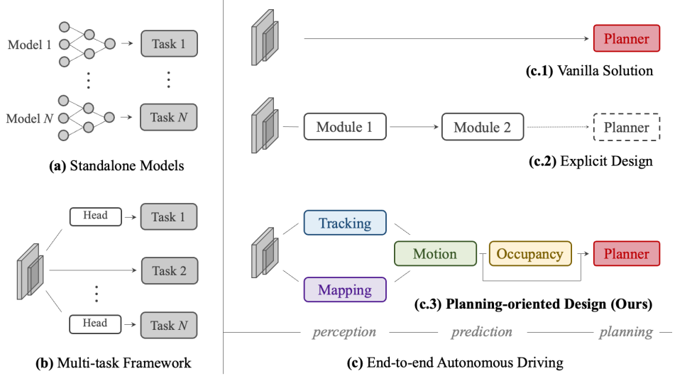
*図1.自動運転フレームワークのさまざまな設計の比較。(a) 多くの産業用ソリューションは、各タスクに個別のモデルを配備している。(b) マルチタスク学習手法では、バックボーンを共有し、タスクごとにヘッドを分ける。(c) エンドツーエンドのパラダイムは、PerceptionとPredictionのモジュールを統合する。これまでの試みでは、(c.1) でPlanningへの直接最適化を採用するか、(c.2) で部分的なコンポーネントのみを組み込んだシステムを構築していた。一方、我々は (c.3) で、望ましいシステムはPlanningに焦点を当てるとともに、前段のタスクを適切に整理してPlanningを支援すべきであると主張する。*

より洗練された設計としては、図1(b)に示すように、複数のタスク固有のヘッドを共有の特徴抽出器に差し込むことで、幅広いタスクをマルチタスクラーニング(MTL)パラダイムに組み込むことが挙げられる。これは、一般的な視覚 [^79],[^92],[^108] や自動運転 [^15],[^60],[^101],[^105] など、多くの分野で一般的な手法である。例えば、Transfuser [^20] や BEVerse [^105] などの研究や、Mobileye [^68]、Tesla [^87]、Nvidia [^71] などの製品がこれに該当する。MTLでは、タスク間で共同で学習する戦略により、特徴の抽象化を活用できる。また、追加のタスクへの拡張が容易になり、オンボードチップの計算コストを節約できる。しかし、このようなスキームは、望ましくない「ネガティブトランスファー」 [^23],[^64] を引き起こす可能性がある。

これとは対照的に、エンドツーエンド自動運転 [^11], [^15], [^19], [^38], [^97] の出現により、Perception、Prediction、Planningのすべてのノードが一体として統合されるようになった。先行するタスクの選択と優先順位は、Planningに有利なように決定されるべきである。システムはPlanning志向であるべきであり、スタンドアロンオプションのような累積誤差やMTLスキームのようなネガティブトランスファーが少ないように、特定のコンポーネントを組み込んだ精巧な設計がなされるべきである。表1は、異なるフレームワーク設計のタスク分類を説明している。

|Design|Approach|Perc. Det.|Perc. Track|Perc. Map|Pred. Motion|Pred. Occ.|Plan|
|---|---|---|---|---|---|---|---|
|(b)|NMP [101]|✓|||✓||✓|
|(b)|NEAT [19]|||✓|||✓|
|(b)|BEVerse [105]|✓||✓||✓||
|(c.1)|[^14],[^16],[^78],[^97]||||||✓|
|(c.2)|PnPNet† [^57]|✓|✓||✓|||
|(c.2)|ViP3D† [^30]|✓|✓||✓|||
|(c.2)|P3 [^82]|||||✓|✓|
|(c.2)|MP3 [^11]|||✓||✓|✓|
|(c.2)|ST-P3 [^38]|||✓||✓|✓|
|(c.2)|LAV [^15]|✓||✓|✓||✓|
|(c.3)|UniAD (ours)|✓|✓|✓|✓|✓|✓|

*表1.タスクの比較と分類。「Design」列は図1に従って分類されている。「Det.」は3D物体検出を、「Map」はオンライン地図作成を、「Occ.」は占有マップ予測を表す。†：これらの研究はPlanningのために直接提案されたものではないが、依然としてPerceptionとPredictionの精神を共有している。UniADは、計画を容易にするために5つの重要な運転タスクを実行する。*

エンドツーエンドパラダイムに従って、1つの「タブララサ」（ゼロから組み立てる）的な手法は、図1(c.1)に示すように、PerceptionとPredictionの明確な監視なしに、Planningされた軌道を直接予測することである。先駆的な研究 [^14], [^16], [^21], [^22], [^78], [^95], [^97], [^106] は、閉ループシミュレーション [^26] でこのバニラ設計を検証した。このような方向性はさらなる検討に値するが、特に高度にダイナミックな都市シナリオにおいては、安全性の保証と解釈可能性に欠けている。本論文では、別の観点から以下の疑問を提起する。信頼性が高く、Planning志向の自動運転システムに向けて、Planningに有利なようにパイプラインをどのように設計するか？どのような先行タスクが必要か？直感的な解決策としては、周囲の物体を認識し、将来の挙動を予測し、安全な操作を明示的にPlanningすることである（図1(c.2)を参照）。現代的なアプローチ [^11], [^30], [^38], [^57], [^82] は、よい洞察を提供し、印象的な性能を達成している。しかし、我々は、詳細に魔が宿ると主張する。以前の研究は多かれ少なかれ、表1の(c.2)ブロックに示すように、Planning志向の精神を彷彿とさせる特定のコンポーネントを見落としている。これらのモジュールの詳細な定義と用語、必要性については、補足資料で詳述する。これを踏まえて、Unified Autonomous DrivingアルゴリズムフレームワークであるUniADを導入する。これは、図1(c.3)と表1(c.3)に示すように、安全でロバストなシステムに向けて5つの重要なタスクを活用するものである。UniADは、Planning志向の精神で設計されている。我々は、これは単なるエンジニアリング努力によるタスクの単純な積み重ねではないと主張する。重要な要素は、すべてのノードを接続するためのクエリベースの設計である。従来のバウンディングボックス表現と比較して、クエリはより大きな受容野を享受し、上流のPredictionからの複合誤差を緩和する。さらに、クエリは柔軟に様々な相互作用をモデル化し、エンコードすることができる。例えば、複数のエージェント間の関係などである。我々の知る限り、UniADは、自動運転の分野において、Perception、Prediction、Planningを含む様々なタスクの共同協力を包括的に調査した最初の研究である。貢献は以下のようにまとめられる。(a) Planning志向の哲学に従った自動運転フレームワークの新しい展望を提示し、スタンドアロン設計や単純なマルチタスクラーニングではなく、効果的なタスク調整の必要性を実証する。(b) 幅広いタスクを活用する包括的なエンドツーエンドシステムであるUniADを提案する。実用化の鍵となるのは、すべてのノードを接続するインターフェイスとしてのクエリ設計である。これにより、UniADは、Planningに向けて柔軟な中間表現とマルチタスク知識の交換を享受する。(c) 現実的なシナリオのための挑戦的なベンチマークでUniADを実装する。広範なアブレーション（各構成要素の分析）により、我々の手法が従来の最先端技術をすべての面で上回っていることを検証する。本研究が、自動運転システムのターゲット駆動型設計に光を当て、様々な運転タスクを調整するための出発点を提供することを期待する。

## 2. 手法の概要

図2に示すように、UniADは、4つのトランスフォーマーデコーダベースのPerception・Predictionモジュールと、最終的なプランナーで構成されている。クエリQは、運転シナリオにおけるエンティティの異なる相互作用をモデル化するために、パイプラインを接続する役割を果たす。具体的には、マルチカメラ画像のシーケンスが特徴抽出器に供給され、結果として得られる透視図特徴は、BEVFormer [^55] の既製のBEVエンコーダによって、統一された鳥瞰図（BEV）特徴Bに変換される。UniADは特定のBEVエンコーダに限定されず、長期的な時間融合 [^31], [^74] やマルチモーダル融合 [^58], [^64] を備えたより豊富なBEV表現を抽出するために、他の代替手段を利用することもできる。TrackFormerでは、トラッククエリと呼ばれる学習可能な埋め込みが、Bからエージェント（他の車両、自転車、歩行者、路上の物体などの周囲の動的オブジェクト）の情報を照会し、エージェントを検出・追跡する。MapFormerは、マップクエリを道路要素（例えば、車線や分離帯）の意味的抽象化として使用し、マップの汎視的セグメンテーションを実行する。上記のクエリは、エージェントとマップを表す。MotionFormerは、エージェントとマップ間の相互作用を捉え、各エージェントの将来の軌跡を予測する。各エージェントの行動はシーン内の他のエージェントに大きな影響を与える可能性があるため、このモジュールは、考慮されるすべてのエージェントに対して共同で予測を行う。同時に、我々は、ego-vehicleクエリを考案し、ego-vehicleを明示的にモデル化し、このシーン中心のパラダイムで他のエージェントと相互作用できるようにする。OccFormerは、BEV特徴Bをクエリとして使用し、エージェント単位の知識をキーおよび値として備え、エージェントのアイデンティティを保存したまま、マルチステップの将来の占有率を予測する。最後に、Plannerは、MotionFormerからの表現力豊かなego-vehicleクエリを利用して、Planning結果を予測し、OccFormerによって予測された占有領域から離れることで衝突を回避する。

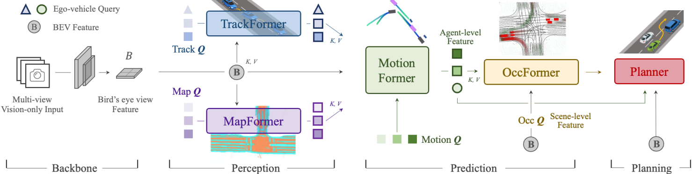
*図2.UniADのパイプライン。これはPlanning指向の哲学に基づき、きわめて丁寧に設計されている。単なるタスクの積み重ねではなく、各Perception・Predictionモジュールの影響を調査し、前段のノードからの連続した最適化の利点を活かして、運転シーンにおける最終的なPlanningを支援している。すべてのPerceptionおよびPredictionモジュールは、タスククエリを各ノードを接続するインターフェースとして用いたトランスフォーマデコーダ構造で設計されている。最後に、シンプルなアテンションに基づくプランナーが配置され、前段のモジュールから抽出された知識を考慮しながら、エゴ車両（自車）の将来の経路点を予測する。占有マップは視覚的な目的でのみ表示されている*

### 2.1. Perception：Tracking and Mapping

#### TrackFormer

検出とMulti-Object Tracking（MOT）を非微分可能な後処理なしで行う。[^100], [^104]に着想を得て、同様のクエリ設計を採用している。物体検出 [^8], [^109] で使用される従来の検出クエリに加えて、フレーム間でエージェントを追跡するための追加のトラッククエリが導入されている。具体的には、各タイムステップで、初期化された検出クエリは、初めて認識される新生エージェントを検出する役割を担い、トラッククエリは、前のフレームで検出されたエージェントを継続的にモデル化する。検出クエリとトラッククエリの両方が、BEV特徴Bに注意を払うことでエージェントの抽象化を捉える。シーンが連続的に変化するにつれて、現在のフレームのトラッククエリは、自己注意モジュールで以前に記録されたものと相互作用し、対応するエージェントが完全に消えるまで（一時的に追跡不能になるまで）、時間情報を集約する。[^8]と同様に、TrackFormerはN層を含み、最終的な出力状態\(Q_A\)は、下流のPredictionタスクのために\(N_a\)個の有効なエージェントの知識を提供する。ego-vehicle周辺の他のエージェントをエンコードするクエリに加えて、クエリセットに1つの特定のego-vehicleクエリを導入し、自動運転車自体を明示的にモデル化する。これはさらにPlanningに使用される。

#### MapFormer

Panoptic SegFormer [^56] という2次元汎視的セグメンテーション手法に基づいて設計されている。道路要素を疎に表現し、マップクエリとして、下流のMotion Forecastingを支援するために、位置と構造の知識をエンコードする。運転シナリオでは、車線、分離帯、交差点を「things（物体）」として、走行可能領域を「stuff（背景）」として設定する [^50]。MapFormerもN層のスタック構造を持ち、各層の出力結果はすべて監視されるが、最後の層で更新されたクエリ\(Q_M\)のみが、エージェントとマップの相互作用のためにMotionFormerに転送される。

### 2.2. Predition：Motion Forecasting

最近の研究により、トランスフォーマー構造が動きタスクに有効であることが証明されている [^43], [^44], [^63], [^69], [^70], [^84], [^99]。これに着想を得て、エンドツーエンド設定でMotionFormerを提案する。TrackFormerとMapFormerからそれぞれ動的エージェントのための高度に抽象化されたクエリ\(Q_A\)と静的なマップ\(Q_M\)を取得し、MotionFormerは、シーン中心の方法で、すべてのエージェントのマルチモーダルな将来の動き、つまり上位k個の可能な軌跡を予測する。このパラダイムは、1回のフォワードパスでフレーム内のマルチエージェント軌跡を生成し、シーン全体を各エージェントの座標に合わせる計算コストを大幅に削減する [^49]。同時に、TrackFormerからのego-vehicleクエリをMotionFormerに渡し、将来のダイナミクスを考慮して、ego-vehicleが他のエージェントと相互作用できるようにする。形式的に、出力される動きは

```math
\{\hat{x}_{i,k} \in ​\mathbb{R}^{T\times2}|i = 1, \ldots, N_a; k = 1, \ldots, ​\mathcal{K}\}
```

として定式化される。ここで、iはエージェントのインデックス、kは軌跡のモダリティのインデックス、Tは予測の時間軸の長さである。

#### MotionFormer

N層で構成され、各層は3種類の相互作用を捉える：エージェント間、エージェントとマップ、エージェントと目標地点である。各モーションクエリ\(Q_{i,k}\)（後述するが、簡略化のため、以下の文脈では下付き文字i, kを省略する）について、他のエージェント\(Q_A\)またはマップ要素\(Q_M\)との相互作用は次のように定式化できる：

```math
Q_{a/m} = \text{MHCA}(\text{MHSA}(Q), Q_A/Q_M)
\tag{1}
```

ここで、MHCAとMHSAはそれぞれマルチヘッドクロスアテンションとマルチヘッド自己アテンションを表す [^91]。予測軌跡を精緻化するために、目標地点、つまりゴールポイントにも注意を払うことが重要であるため、変形可能なアテンション [^109] を介してエージェントとゴールポイントのアテンションを次のように考案する：

```math
Q_g = \text{DeformAttn}(Q, \hat{x}^{l-1}_T, B)
\tag{2}
```

ここで、\(\hat{x}^{l-1}_T\)は前の層の予測軌跡の終点である。\(\text{DeformAttn}(q, r, x)\)は、クエリq、参照点r、空間特徴xを受け取る変形可能なアテンションモジュールである。参照点を中心とする空間特徴に対してスパースアテンションを実行する。これにより、予測軌跡は終点周辺を認識した上でさらに精緻化される。3つの相互作用はすべて並行してモデル化され、生成された\(Q_a\)、\(Q_m\)、\(Q_g\)は連結され、マルチ層パーセプトロン（MLP）に渡されて、クエリコンテキスト\(Q_{ctx}\)が生成される。次に、\(Q_{ctx}\)は、次の層に送られて精緻化されるか、最後の層で予測結果としてデコードされる。

#### Motion Queries

MotionFormerの各層への入力クエリは、Motion Queryと呼ばれ、2つのコンポーネントで構成される。前の層で生成されたクエリコンテキスト\(Q_{ctx}\)と、クエリ位置\(Q_{pos}\)である。具体的には、\(Q_{pos}\)は、式(3)に示すように、4つの位置情報を統合する。(1) シーン単位のアンカーの位置\(I_s\)、(2) エージェント単位のアンカーの位置\(I_a\)、(3) エージェント(i)の現在位置、(4) 予測された目標地点である。

```math
Q_{pos} = \text{MLP}(\text{PE}(I_s)) + \text{MLP}(\text{PE}(I_a))\\ + \text{MLP}(\text{PE}(\hat{x}_0)) + \text{MLP}(\text{PE}(\hat{x}^{l-1}_T))
\tag{3}
```

ここで、正弦波位置符号化\(\text{PE}(\cdot)\)の後にMLPが続く形で、位置点をエンコードするために使用される。また、最初の層では\(\hat{x}^0_T\)は\(I_s\)として設定される（下付き文字i, kも省略される）。シーン単位のアンカーは、グローバルな視点での事前的な動きの統計を表し、エージェント単位のアンカーは、ローカルな座標での可能な意図を捉える。両方とも、グラウンドトゥルース軌跡の終点に対してk-meansアルゴリズムによってクラスタリングされ、予測の不確実性を狭めるために使用される。事前知識とは対照的に、開始点は各エージェントにカスタマイズされた位置埋め込みを提供し、予測された終点は、粗いものから細かいものへと層ごとに最適化される動的なアンカーとして機能する。

#### Non-linear Optimization

従来の動作予測手法とは異なり、エージェントの位置や対応する軌跡といった正解データに直接アクセスできるわけではないため、本エンドツーエンドの枠組みでは、前のモジュールからの予測の不確実性を考慮する。上流モジュールによって予測された不完全な検出位置や見出し角度から正解の経路点を回帰すると、大きな曲率や加速度を持つ非現実的な軌道予測につながる可能性がある。これを解決するために、上流モジュールによって予測された不完全な開始点に対して、ターゲット軌跡を物理的に実行可能なものにするために、非線形スムーザー[^7]を採用する。このプロセスは以下の通りである:

```math
\tilde{\boldsymbol{x}}^* = \arg \min_{\boldsymbol{x}} c(\boldsymbol{x}, \tilde{\boldsymbol{x}})
\tag{4}
```

ここで、\(\tilde{\boldsymbol{x}}\)と\(\tilde{\boldsymbol{x}}^*\)は正解とスムーズ化された軌跡を表し、\(\boldsymbol{x}\)は複数ショット法[3]によって生成され、コスト関数は以下のように表される:

```math
c(\boldsymbol{x}, \tilde{\boldsymbol{x}}) = \lambda_{xy} |\boldsymbol{x}, \tilde{\boldsymbol{x}}|_2 + \lambda_{goal} |\boldsymbol{x}_T, \tilde{\boldsymbol{x}}_T|_2 + \sum_{\phi \in \Phi} \phi(\boldsymbol{x})
\tag{5}
```

ここで\(\lambda_{xy}\)と\(\lambda_{goal}\)はハイパーパラメータであり、運動学的関数セット\(\Phi\)は、ジャーク、曲率、曲率変化率、加速度、横加速度の5つの項を含む。コスト関数は、ターゲット軌跡を運動学的制約に従うように正則化する。このターゲット軌跡の最適化は、学習時のみ実行され、推論には影響しない。

### 2.3. Prediction：Occupancy Prediction

Occupancy Gridmapは、各セルが占有されているかどうかを示す信念度を持つ離散化されたBEV表現である。Occupancy Predictionタスクは、グリッドマップが将来どのように変化するかを予測することである。従来のアプローチでは、観測されたBEV特徴量から将来の予測を時間的に拡張するためにRNN構造を利用していた [^35], [^38], [^105] 。しかし、これらの手法は、BEV特徴量をRNNの隠れ状態に圧縮するため、主にエージェントに依存しない。そのため、高度に手作業で設計されたクラスタリング事後処理に依存して、各エージェントのOccupancyマップを生成する。エージェントごとの知識の利用が不十分なため、シーンがどのように進展するかを理解するために不可欠な、すべてのエージェントの動作をグローバルに予測することは困難である。これを解決するために、OccFormerを提案し、シーン全体の特徴とエージェントごとの特徴を2つの側面で組み込む。OccFormerは、\(T_o\)個の順序付きブロックで構成され、\(T_o\)は予測の時間軸を示す。\(T_o\)は通常、動作タスクにおける\(T\)よりも小さい。これは、密度の高いOccupancy表現のコストが高いためである。各ブロックは、前の層からの豊かなエージェント特徴量\(G^t\)と状態（密度の高い特徴量）\(F^{t-1}\)を入力として受け取り、インスタンスレベルとシーン全体の情報を考慮して、時間ステップ\(t\)における\(F^t\)を生成する。エージェント特徴量\(G^t\)を動的および空間的先験情報とともに取得するために、MotionFormerからのモーダル次元におけるモーションクエリを最大プーリングし、\(Q_X \in \mathbb{R}^{N_a \times D}\)と表記する。ここで、\(D\)は特徴量の次元である。次に、これを上流のトラッククエリ\(Q_A\)と現在の位置埋め込み\(P_A\)とともに、時間特有のMLPを通じて融合する：

```math
G^t = \text{MLP}_t([Q_A, P_A, Q_X]), t = 1, \ldots, T_o,
\tag{6}
```

ここで、\([\cdot]\)は連結を示す。シーン全体の知識については、BEV特徴量\(B\)をトレーニング効率のために\(\frac{1}{4}\)解像度にダウンサンプリングし、最初のブロック入力\(F^0\)として使用する。トレーニングメモリをさらに節約するために、各ブロックはダウンサンプル-アップサンプル方式に従い、その間にピクセルエージェントの相互作用を実行するためのアテンションモジュールを配置する。ダウンサンプリングされた特徴量は\(F_{ds}^t\)と表記される。

#### ピクセルとエージェントの相互作用

ピクセルとエージェントの相互作用は、未来の占有状態を予測する際に、シーン全体レベルとエージェントレベルの理解を統合するために設計されている。我々は、密度の高い特徴量\(F_{ds}^t\)をクエリとし、インスタンスレベルの特徴量をキーおよびバリューとして用い、時間経過に従って密度の高い特徴量を更新する。具体的には、\(F_{ds}^t\)は自己注意層を通じて遠く離れたグリッド間の相互作用をモデル化し、その後、交差注意層によってエージェント特徴量\(G^t\)と各グリッドの特徴量との相互作用をモデル化する。さらに、ピクセルとエージェントの対応関係を整列させるために、交差注意をアテンションマスクで制約している。このマスクは、各ピクセルが時刻\(t\)で占有されているエージェントのみに注目するように制限しており、[^17] に着想を得ている。密度の高い特徴量の更新プロセスは次のように定式化される：

```math
D_{ds}^t = \text{MHCA}(\text{MHSA}(F_{ds}^t), G^t, \text{attn mask} = O_m^t).
\tag{7}
```

アテンションマスク\(O_m^t\)は占有状態と意味的に類似しており、追加のエージェントレベル特徴量と密度の高い特徴量\(F_{ds}^t\)の積によって生成される。ここで、エージェントレベル特徴量をマスク特徴量\(M^t = \text{MLP}(G^t)\)と呼ぶ。式(7)の相互作用プロセスの後、\(D_{ds}^t\)は(B)の\(\frac{1}{4}\)のサイズにアップサンプリングされる。さらに、\(D_{ds}^t\)とブロック入力\(F^{t-1}\)を残差接続として追加し、得られた特徴量\(F^t\)を次のブロックに渡す。

#### インスタンスレベルの占有状態

インスタンスレベルの占有状態は、各エージェントの識別情報を保持した占有状態を表す。これは、最近のクエリベースのセグメンテーション手法[^18], [^52]と同様に、行列積によって簡単にもとめられる。形式的には、BEV特徴量\(B\)の元のサイズ\(H \times W\)の占有予測を得るため、シーンレベルの特徴量\(F^t\)を畳み込みデコーダを用いて\(F_{\text{dec}}^t \in \mathbb{R}^{C \times H \times W}\)にアップサンプリングする。ここで、(C)はチャネル次元である。エージェントレベルの特徴量については、粗いマスク特徴量\(M^t\)をさらなるMLPを用いて占有特徴量\(U^t \in \mathbb{R}^{N_a \times C}\)に更新する。実験的に、元のエージェント特徴量\(G^t\)ではなくマスク特徴量\(M^t\)から\(U^t\)を生成する方が優れた性能を示すことが確認された。時刻\(t\)における最終的なインスタンスレベルの占有状態は次式で表される：

```math
\hat{O}_A^t = U^t \cdot F_{\text{dec}}^t.
\tag{8}
```

### 2.4 Planning

高精度地図（HDマップ）や事前に定義されたルートなしでPlanningを行う場合、進行方向を示すための高レベルなコマンドが必要とされる[^11], [^38]。それに従い、原始的なナビゲーション信号（左折、右折、直進）を3つの学習可能な埋め込み、すなわち「コマンド埋め込み」に変換する。MotionFormerから得られたエゴ車両クエリはすでにマルチモーダルな意図を表現しているため、これにコマンド埋め込みを組み合わせて「Planningクエリ」を形成する。このPlanningクエリをBEV特徴量 (B) にアテンションを適用することで、周囲の状況を認識させ、その後、将来の経路点 (\hat{\tau}) へのデコードを行う。さらに衝突を回避するために、推論時のみニュートン法を用いて (\hat{\tau}) を最適化する：

```math
\tau^* = \arg \min_{\tau} f(\tau, \hat{\tau}, \hat{O}),
\tag{9}
```

ここで、\(\hat{\tau}\)は元のPlanning予測、\(\tau^*\)は最適化されたPlanningであり、複数ショット法[^3]によって生成される経路\(\tau\)の中からコスト関数\(f(\cdot)\)を最小化するものとして選択される。\(\hat{O}\)は、OccFormerからのインスタンス単位のOccupancy Predictionを統合した古典的な二値占有マップである。コスト関数\(f(\cdot)\)は次のように計算される：

```math
f(\tau, \hat{\tau}, \hat{O}) = \lambda_{\text{coord}} |\tau, \hat{\tau}|_2 + \lambda_{\text{obs}} \sum_t D(\tau_t, \hat{O}^t),
\tag{10}
```

```math
D(\tau_t, \hat{O}^t) = \sum_{(x,y) \in S} \frac{1}{\sigma \sqrt{2\pi}} \exp\left( -\frac{|\tau_t - (x, y)|_2^2}{2\sigma^2} \right).
\tag{11}
```

ここで、\(\lambda_{\text{coord}}\)、\(\lambda_{\text{obs}}\)、および\(\sigma\)はハイパーパラメータであり、\(t\)は将来の時間ステップを指す。\(L_2\)コスト\(f(\tau, \hat{\tau}, \hat{O})\)は経路を元の予測値に引き寄せる一方で、衝突項 (D) は、

```math
S = \{(x, y) \mid |(x, y) - \tau_t|_2 < d,\ \hat{O}_{x,y}^t = 1\}
```

で定義される占有セルの周囲から経路を押し返すように作用する。

### 2.5. 学習

UniADは二段階で学習される。まず、初期段階として、TrackingモジュールとMappingモジュールというPerception部分を数エポック（実験では6エポック）同時に学習し、その後、Perception・Prediction・Planningのすべてのモジュールを含めて20エポックにわたりエンドツーエンドで学習する。この二段階学習は、実証的により安定であることが確認されている。各損失関数の詳細については補足資料を参照されたい。

#### 共有マッチング

UniADはインスタンス単位のモデル化を伴うため、PerceptionおよびPredictinoタスクにおいて、予測結果を正解セットと対応付ける必要がある。DETR[^8], [^56]と同様に、TrackingおよびオンラインMappingの段階では、二部マッチングアルゴリズムを採用している。Trackingについては、検出クエリから得られた候補が新しく出現した正解オブジェクトと対応付けられ、トラッククエリの予測は前のフレームから継承された割り当てを保持する。Trackingモジュールにおけるこのマッチング結果は、MotionとOccupancyのノードでも再利用され、エンドツーエンドのフレームワーク内で、過去のトラックから将来の動きへ一貫してエージェントをモデル化するための基盤として機能する。

## 3. 実験

我々は、困難なnuScenesデータセット[^6]を用いて実験を実施した。本節では、私たちの設計の有効性を以下の3つの観点から検証する。第一に、タスク間の連携の利点とそれがPlanningに与える影響を示す統合的な結果、第二に、各タスクのモジュール性能を従来手法と比較した結果、第三に、特定のモジュールの設計空間に関する削除実験である。スペースの制約により、すべてのプロトコル、一部の削除実験および可視化結果は補足資料に示す。

### 3.1. 統合的結果

エンドツーエンドパイプラインにおける前段タスクの有効性と必要性を証明するために、表2に示すように幅広い削除実験を実施した。この表の各行は、第二列「モジュール」に記載されたタスクモジュールを組み込んだ際のモデル性能を示している。最初の行（ID-0）は、個別のタスクヘッドを用いた基本的なマルチタスク基準モデルとして比較対象となっている。各指標の最良結果は太字、次点の結果は下線で示している。

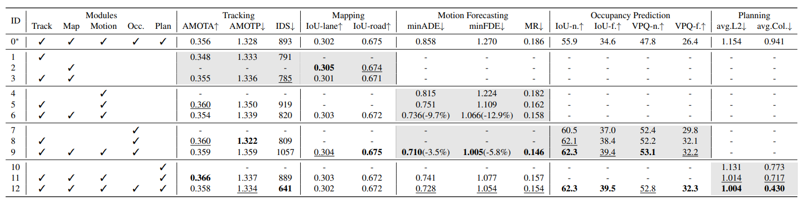
*表2.各タスクの有効性に関する詳細なアブレーション分析。これらの結果から、二つのPerceptionサブタスクがMotion Forecastingに大きく貢献しており、予測性能も二つのPredictionモジュールを統合することによって向上することがわかる。すべての前段表現を用いることで、安全性を確保するためにPlanningの目的達成が大幅に向上する。UniADは、PredictionおよびPlanningタスクにおいて、単純なマルチタスク学習（MTL）アプローチを大きく上回り、同時にPerception性能における顕著な低下も伴わないという優位性を有している。簡潔さのため、主要な指標のみを示している。「avg.L2」と「avg.Col」は、Planning時間軸にわたる平均値を表す。ID-0は、各タスクに個別のヘッドを持つMTL方式である。*

#### 安全なPlanningに向けた道筋

PredictionはPerceptionよりもPlanningに近い位置にあるため、まず私たちのフレームワークにおける二つのPredictionタスク、すなわちMotionとOccupancyの効果を検討した。実験10～12では、中間タスクを一切含まない単純なエンドツーエンドPlanning（実験10、図1(c.1)）と比較して、この二つのタスクを同時に導入した場合にのみ（実験12）、PlanningのL2誤差と衝突率の両指標が最良の結果を達成した。したがって、安全なPlanningを実現するには、この二つのPredictionタスクがいずれも必要であると結論づけられる。さらに前の段階として、実験7～9では、二種類のPredictionタスク間の協同効果を示した。両タスクが密接に統合された場合（実験9）、minADEが-3.5%、minFDEが-5.8%、MRが-1.3%、IoU-f.が+2.4%、VPQ-f.が+2.4%改善し、エージェントとシーンの両方の表現を含める必要性が示された。一方、優れたMotion Forecasting性能を実現するため、実験4～6ではPerceptionモジュールがどのように貢献するかを検討した。特に、TrackingとMappingの両モジュールを組み込むことで、Prediction性能が顕著に向上した（minADEが-9.7%、minFDEが-12.9%、MRが-2.3%）。また、実験1～3では、Perceptionサブタスクを同時学習することで、単一タスクと同等の結果を得られることを示している。さらに、単純なマルチタスク学習（実験0、図1(b)）と比較すると、実験12はすべての主要指標で大幅に優れ、minADEが-15.2%、minFDEが-17.0%、MRが-3.2%、IoU-f.が+4.9%、VPQ-f.が+5.9%、avg.L2が-0.15m、avg.Col.が-0.51%改善し、私たちのPlanning指向設計の優位性を明確に示している。

### 3.2. モジュール別の結果

Perception→Prediction→Planningの順序に沿って、nuScenes検証セットにおいて、各タスクモジュールの性能を従来の最先端手法と比較して報告する。UniADは、単一の学習済みネットワークでこれらのすべてのタスクを同時に行うことに注意されたい。各タスクの主指標は、表の中でグレー背景で示されている。

#### Perceptionの評価結果

表3のMulti-Object Trackingについて、UniADはMUTR3D[^104]に対して+6.5%、ViP3D[^30]に対して+14.2%のAMOTA向上を達成している。さらに、UniADはIDスイッチ数が最低であり、各トラックレットの時間的安定性の高さを示している。表4のオンラインMappingでは、UniADはレーンのセグメンテーション性能がBEVFormerと比較して+7.4%のIoU向上を達成し、これはモーションモジュールにおけるエージェントと道路の相互作用にとって極めて重要である。我々のTrackingモジュールはエンドツーエンドのパラダイムに基づいているため、Immortal Tracker[^93]のような複雑な対応ルーチンを用いる検出Tracking法には及ばない。また、Mapping性能も、特定のクラスにおいては従来のPerception指向手法に劣る。しかし、我々はUniADが、完全なモデル容量を用いてPerceptionを最適化することではなく、最終的なPlanningに有効なPerception情報を活用することを意図していると主張する。

| Method | AMOTA↑ | AMOTP↓ | Recall↑ | IDS↓ |
|--------|--------|--------|---------|------|
| Immortal Tracker† [^93] | 0.378 | 1.119 | 0.478 | 936 |
| ViP3D [^30] | 0.217 | 1.625 | 0.363 | - |
| QD3DT [^36] | 0.242 | 1.518 | 0.399 | - |
| MUTR3D [^104] | 0.294 | 1.498 | 0.427 | 3822 |
| UniAD | 0.359 | 1.320 | 0.467 | 906 |

*表3：Multi-Object Trackingの評価結果。Multi-Object Trackingにおいて、UniADは画像入力のみを使用する従来のエンドツーエンドMOT手法をすべての指標で上回っている。†：事後関連付ける検出追跡法で、公平な比較のためにBEVFormerを用いて再実装したもの。*

| Method | Lanes↑ | Drivable↑ | Divider↑ | Crossing↑ |
|--------|--------|-----------|----------|-----------|
| VPN [^72] | 18.0 | 76.0 | - | - |
| LSS [^76] | 18.3 | 73.9 | - | - |
| BEVFormer [^55] | 23.9 | 77.5 | - | - |
| BEVerse† [^105] | - | - | 30.6 | 17.2 |
| UniAD | 31.3 | 69.1 | 25.7 | 13.8 |

*表4. Online Mappingの評価結果。UniADは、広範な道路セマンティクスを備え、最先端の知覚指向手法と競争力のある性能を発揮している。ここではセグメンテーションのIoU（%）を報告する。†：BEVFormerを用いて再実装したもの。*

#### Predictionの評価結果

Motion Forecastingの結果は表5に示されており、UniADは従来のビジョンベースのエンドツーエンド手法を著しく上回っている。minADEにおける予測誤差は、PnPNet-vision[^57]に対して38.3%、ViP3D[^30]に対して65.4%削減された。表6に示す占有予測に関して、UniADは近距離領域で顕著な改善を達成し、大力なデータ拡張を用いたFIERY[^35]とBEVerse[^105]と比較して、それぞれIoU-nearが+4.0%、+2.0%向上した。

| Method | minADE(m)↓ | minFDE(m)↓ | MR↓ | EPA↑ |
|--------|------------|------------|-----|------|
| PnPNet† [^57] | 1.15 | 1.95 | 0.226 | 0.222 |
| ViP3D [^30] | 2.05 | 2.84 | 0.246 | 0.226 |
| Constant Pos. | 5.80 | 10.27 | 0.347 | - |
| Constant Vel. | 2.13 | 4.01 | 0.318 | - |
| UniAD | 0.71 | 1.02 | 0.151 | 0.456 |

*表5. Motion Forecastingの評価結果。UniADは、従来のビジョンベースのエンドツーエンド手法を著しく上回る性能を発揮している。また、固定位置または一定速度で車両をモデル化した2つの比較設定も報告する。†：BEVFormerを用いて再実装したもの。*

| Method | IoU-n.↑ | IoU-f.↑ | VPQ-n.↑ | VPQ-f.↑ |
|--------|---------|---------|---------|---------|
| FIERY [^35] | 59.4 | 36.7 | 50.2 | 29.9 |
| StretchBEV [^1] | 55.5 | 37.1 | 46.0 | 29.0 |
| ST-P3 [^38] | - | 38.9 | - | 32.1 |
| BEVerse† [^105] | 61.4 | 40.9 | 54.3 | 36.1 |
| UniAD | 63.4 | 40.2 | 54.7 | 33.5 |

*表6. Occupancy Predictionの評価結果。UniADは、計画にとってより重要である近距離領域で顕著な改善を達成している。“n.”と“f.”は、それぞれ近さ（30×30m）と遠さ（50×50m）の評価範囲を示す。†：重度のデータ拡張で学習されたモデル。*

#### Planningの評価結果

エゴ車両クエリと占有状態の両方から得られる豊かな空間的・時間的情報を活用することで、UniADはST-P3[^38]と比較して、計画時間軸にわたる平均的なL2誤差を51.2%、衝突率を56.3%低減した。さらに、通常知覚タスクにおいて困難とされるLiDARベースの手法に対しても、顕著に優れた性能を発揮している。

| Method | L2(m)↓ |  |  |  | Col. Rate(%)↓ |  |  |  |
|--------|--------|----|----|----|---------------|----|----|----|
|        | 1s     | 2s | 3s | Avg. | 1s            | 2s | 3s | Avg. |
| NMP† [^101] | - | - | 2.31 | - | - | - | 1.92 | - |
| SA-NMP† [^101] | - | - | 2.05 | - | - | - | 1.59 | - |
| FF† [^37] | 0.55 | 1.20 | 2.54 | 1.43 | 0.06 | 0.17 | 1.07 | 0.43 |
| EO† [^47] | 0.67 | 1.36 | 2.78 | 1.60 | 0.04 | 0.09 | 0.88 | 0.33 |
| ST-P3 [^38] | 1.33 | 2.11 | 2.90 | 2.11 | 0.23 | 0.62 | 1.27 | 0.71 |
| UniAD | 0.48 | 0.96 | 1.65 | 1.03 | 0.05 | 0.17 | 0.71 | 0.31 |

*表7. Planningの評価結果。UniADは、すべての時間区間で最も低いL2誤差と衝突率を達成しており、多くのケースでLiDARベースの手法（†）を上回り、本システムの安全性を実証している。*

### 3.3. 定性的な結果

図3は、複雑なシーンにおけるすべてのタスクの結果を可視化したものである。エゴ車両（自車）は、前方の車両とレーンの可能性のある動きに注意しながら走行している。補足資料では、さらに多くの困難なシーンの可視化結果と、計画指向設計の有望な事例を示している。その事例では、前段のモジュールで予測結果に不正確さが生じても、後段のタスクがそれを回復している。たとえば、対象物の進行方向に大きなずれがあったり、追跡モジュールで検出に失敗しても、計画された軌道は依然として合理的である。また、UniADの失敗事例は、補足資料に示すように、主に大型トラックやトレーラーといったロングテールのシーンで発生していると分析している。

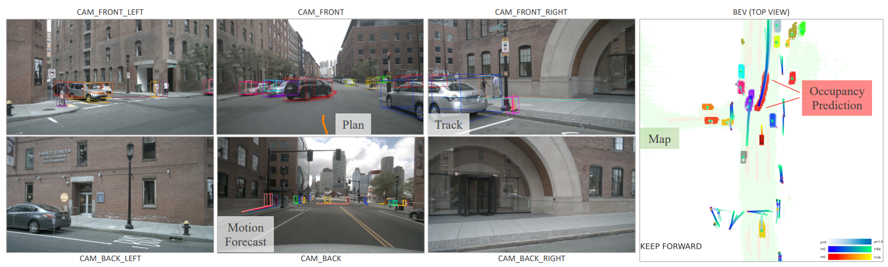
*図3.各モジュール出力の可視化結果例。周囲の画像とBEVにおいて、すべてのタスクの結果を示す。Motion ForecastingとOccupancy Predictionの結果は一貫しており、このシーンではエゴ車両（自車）が前方の黒い車に進路を譲っている。各エージェントには一意の色が割り当てられている。Motion Forecastingの結果では、画像ビューにはトップ1の軌跡、BEVにはトップ3の軌跡のみを可視化対象として選択している。*

### 3.4. アブレーション分析

#### MotionFormerにおける設計の効果

表8は、2.2節で説明したすべての提案構成要素が、minADE、minFDE、ミスレート、minFDE-mAPの各指標における最終的な性能に寄与していることを示している。特に、回転させたシーンレベルのアンカーは、minADEを-15.8%、minFDEを-11.2%、minFDE-mAPを+1.9%向上させるなど、顕著な性能改善をもたらしており、これはシーン全体を基準としたMotion Forecastingが本質的に重要であることを示している。エージェント–目標点の相互作用は、計画指向の視覚的特徴を運動クエリに組み込むことで、周囲のエージェントがエゴ車両（自車）の意図を考慮することでさらなる恩恵を受けられるようになる。さらに、非線形最適化戦略は、エンドツーエンドのシナリオにおける知覚の不確実性を考慮することで、minADEを-5.0%、minFDEを-8.4%、MRを-1.0%改善し、minFDE-mAPを+0.7%向上させた。

| ID | Scene-l. Anch. | Goal Inter. | Ego Q | NLO. | minADE↓ | minFDE↓ | MR↓ | minFDE-mAP∗↑ |
|----|----------------|-------------|--------|------|----------|----------|-----|----------------|
| 1  |                |             |        |      | 0.844    | 1.336    | 0.177 | 0.246          |
| 2  | ✓              |             |        |      | 0.768    | 1.159    | 0.164 | 0.267          |
| 3  | ✓              | ✓           |        |      | 0.755    | 1.130    | 0.168 | 0.264          |
| 4  | ✓              | ✓           | ✓      |      | 0.747    | 1.096    | 0.156 | 0.266          |
| 5  | ✓              | ✓           | ✓      | ✓    | 0.710    | 1.004    | 0.146 | 0.273          |

*表8. MotionFormerにおける設計のアブレーション分析。すべてのコンポーネントが最終的な性能に貢献している。「Scene-l. Anch.」は回転したシーンレベルのアンカーを示す。「Goal Inter.」はエージェント–目標点の相互作用を意味し、「Ego Q」はエゴ車両クエリを、「NLO.」は非線形最適化戦略を表す。∗：検出精度と予測精度を同時に考慮した指標であり、詳細は補足資料に記載する。*

#### OccFormerにおける設計の効果

表9に示すように、局所的な制約なしに各ピクセルをすべてのエージェントにアテンションさせる方法（実験2）は、アテンションを用いないベースライン（実験1）と比べてやや劣る性能を示す。しかし、占有に基づいたアテンションマスクはこの問題を解消し、特に近距離領域で顕著な向上をもたらす（実験3：IoU-n.が+1.0%、VPQ-n.が+1.4%向上）。また、エージェント特徴ではなくマスク特徴 (M_t) を再利用して占有特徴を算出することで、性能がさらに向上することが確認された。

| ID | Cross. Attn. | Attn. Mask | Mask Feat. | IoU-n.↑ | IoU-f.↑ | VPQ-n.↑ | VPQ-f.↑ |
|----|--------------|------------|------------|---------|---------|---------|---------|
| 1  |              |            |            | 61.2    | 39.7    | 51.5    | 31.8    |
| 2  | ✓            |            |            | 61.3    | 39.4    | 51.0    | 31.8    |
| 3  | ✓            | ✓          |            | 62.3    | 39.7    | 52.4    | 32.5    |
| 4  | ✓            | ✓          | ✓          | 62.6    | 39.5    | 53.2    | 32.8    |

*表9. OccFormerにおける設計のアブレーション分析。マスク付きの交差注意とマスク特徴の再利用は、予測性能の改善に寄与している。「Cross. Attn.」および「Attn. Mask」は、それぞれピクセルとエージェントの相互作用における交差注意とアテンションマスクを表す。「Mask Feat.」は、インスタンスレベルの占有を生成するためにマスク特徴を再利用することを示す。*

#### Plannerにおける設計の効果

表10では、提案したPlannerの設計（BEV特徴へのアテンション、衝突損失による学習、占有を用いた最適化戦略）に関する削除実験を示す。従来の研究[^37], [^38]と同様に、安全性を重視するには、単純な軌道模倣（L2誤差）よりも衝突率を低くすることが望ましく、UniADではこれらの要素をすべて組み合わせることで衝突率が低減されている。

| ID | BEV Att. | Col. Loss | Occ. Optim. | L2↓ (1s) | L2↓ (2s) | L2↓ (3s) | Col. Rate↓ (1s) | Col. Rate↓ (2s) | Col. Rate↓ (3s) |
|----|----------|-----------|-------------|----------|----------|----------|-----------------|-----------------|-----------------|
| 1  |          |           |             | 0.44     | 0.99     | 1.71     | 0.56            | 0.88            | 1.64            |
| 2  | ✓        |           |             | 0.44     | 1.04     | 1.81     | 0.35            | 0.71            | 1.58            |
| 3  | ✓        | ✓         |             | 0.44     | 1.02     | 1.76     | 0.30            | 0.51            | 1.39            |
| 4  | ✓        | ✓         | ✓           | 0.54     | 1.09     | 1.81     | 0.13            | 0.42            | 1.05            |

*表10. Plannerにおける設計のアブレーション分析。結果は、各前段タスクの必要性を示している。「BEV Att.」はBEV特徴へのアテンションを意味し、「Col. Loss」は衝突損失を表す。「Occ. Optim.」は占有を用いた最適化手法を指す。*

## 4. 結論と今後の課題

本論文では、自律走行アルゴリズムフレームワークのシステムレベル設計について論じた。計画という最終目標に向け、計画指向のパイプライン、すなわちUniADを提案した。知覚と予測の各モジュールがなぜ必要であるかについて、詳細な分析を提供した。タスクを統一するため、UniADではクエリベースの設計を採用し、すべてのモジュールを接続することで、環境中のエージェント間の相互作用をより豊かに表現できるようにした。広範な実験により、本手法の有効性が全側面で確認された。

### 制限と今後の課題

多数のタスクを統合したこのような包括的なシステムを連携させるのは容易ではなく、特に時間的履歴を用いて学習するには膨大な計算リソースを要する。軽量なデプロイに向けたシステムの設計と最適化は、今後の重要な研究課題である。さらに、深度推定や行動予測といった追加のタスクを導入すべきかどうか、またそれらをどのようにシステムに組み込むかについても、今後の価値ある研究方向である。

### 謝辞

本研究は、中国国家重点研究開発計画（2022ZD0160100）、上海市科学技術委員会（21DZ1100100）、および国家自然科学基金委員会（NSFC, 62206172）の支援を受けて実施された。

## Appendix

### A. タスク定義

#### DetectionとTracking

DetectionとTrackingは、自律走行において重要な二つの知覚タスクであり、私たちはそれらを3次元空間で表現することで、後続のタスクへの応用を容易にする。3D Detectionは、各タイムスタンプにおいて周囲の物体（座標、長さ、幅、高さなど）を定位することを担う。Trackingは、タイムスタンプ間で異なる物体間の対応関係を見つけ、それらを時間的に関連付ける（すなわち、各エージェントに一貫したトラックIDを割り当てる）ことを目的とする。本論文では、一部の文脈で「Multi-Object Tracking」という用語を、DetectionとTrackingの両プロセスを指す意味で使用している。最終的な出力は、各フレームにおける関連付けられた3Dボックスの列であり、それらに対応する特徴量\(Q_A\)はMotion Forecastingモジュールへ送られる。また、後続のタスク用に「エゴ車両クエリ」という特別なクエリを用意しており、このクエリは予測と正解のマッチングプロセスには含まれず、エゴ車両（自車）の位置を個別に回帰する役割を果たす。

#### Online Mapping

マップは、環境の幾何学的・セマンティック情報を直感的に表現したものである。Online Mappingとは、オフラインで注釈された高精度地図（HDマップ）の代わりに、車載センサー（本手法ではマルチビュー画像）を用いて、道路の意味のある構成要素をセグメンテーションすることを指す。UniADでは、オンラインマップを4つのカテゴリにモデル化している：レーン、走行可能領域、中央線・分離帯、および横断歩道。これらの要素はすべて鳥瞰図（BEV）上でセグメンテーションされる。\(Q_A\)と同様に、マップクエリ\(Q_M\) も、Motion Forecastingモジュールでエージェントと道路の相互作用をモデル化するために新たに活用される。

#### Motion Forecasting

PerceptionとPlanningをつなぐ役割を果たすPredictionは、自律走行システム全体の最終的安全性を確保するために極めて重要である。従来、Motion Forecastingは、検出されたバウンディングボックスとHDマップを用いてエージェントの将来の軌道を予測する独立したモジュールとして開発されてきた。しかし、ほとんどの現在の運動データセット[^27]では、これらのバウンディングボックスが正解アノテーションとして与えられており、車載環境では現実的ではない。一方、本論文では、Motion Forecastingモジュールは、以前にエンコードされた疎なクエリ（すなわち\(Q_A\) および\(Q_M\)）と密度の高いBEV特徴量\(B\) を入力として受け取り、各エージェントについて将来の\(T\) 個のタイムステップにおける\(K\) 通りの可能性のある軌道を予測する。さらに、エンドツーエンドかつシーン中心のアプローチに適合させるため、各エージェントの現在位置を基準としたオフセットとして軌道を予測している。最後のMLPデコーダ直前のエージェント特徴量は、過去と将来の情報を両方符号化しており、これらの特徴量は、シーン全体の未来理解のため、Occupancyモジュールへ送られる。エゴ車両クエリについては、将来のエゴ車両（自車）の運動も予測する（実質的に粗い計画推定を提供する）が、この特徴量はプランナーによって最終的な目標を生成するために利用される。

#### Occupancy Prediction

Occupancyグリッドマップは、各セルが占有されているかどうかの確信度を表す、離散化されたBEV表現である。Occupancy Predictionタスクは、複数のエージェントの動的行動を考慮しながら、将来の\(T_o\) タイムステップにおいてこのグリッドマップがどのように変化するかを予測することを目的としている。疎なエージェント情報を基準とする運動予測とは対照的に、Occupancy Predictionはシーン全体の密度の高い表現を用いる。疎なエージェント知識に基づいてシーンがどのように進化するかを調査するため、我々が提案するOccupancyモジュールは、観測されたBEV特徴量\(B\) とエージェント特徴量\(G_t\) の両方を入力として受け取る。複数ステップにわたるエージェント–シーンの相互作用（付録Eで詳細に説明）の後、占有特徴量と密度の高いシーン特徴量の行列積を通じて、インスタンスレベルの確率マップ\(\hat{O}^A_t \in \mathbb{R}^{N_a \times H \times W}\) が生成される。エージェントの識別情報を保持しつつ、シーン全体の占有状態\(\hat{O}_t \in \mathbb{R}^{H \times W}\)を形成し、占有評価および後続の計画に用いるために、各タイムステップでインスタンスレベルの確率を、[^8] に従ってピクセル単位のargmaxによって単純に統合する。

#### 計画

最終的な目標として、計画モジュールはすべての前段結果を考慮する。業界における従来の計画手法は、通常、事前の検出・予測結果に基づいて定義されたさまざまなシーンに条件付けられた「if-else」の状態機械によってルールベースで構成される。一方、我々の学習ベースモデルでは、前段から得られたエゴ車両クエリと密度の高いBEV特徴量 (B) を入力とし、合計\(T_p\) タイムステップにわたる単一の軌道\(\hat{\tau}\) を予測する。その後、この軌道\(\hat{\tau}\) は、前段で予測された将来の占有状態\(\hat{O}\) を用いて最適化され、衝突を回避し、最終的な安全性を確保する。

### B. 各タスクが必要となる理由

Perceptionに関して、PnPNet[^57]やViP3D[^30]のようにTrackingをループに組み込むことが、空間・時間的な特徴を補完し、遮蔽されたエージェントの履歴トラックを提供することで、後段のPlanningにおける重大な誤判断を防ぐことが実証されている。HDマップ[^30], [^57], [^82], [^101]とMotion Forecastingの助けを借りることで、Planningはより高次の知性へと向かって精度を高められる。しかし、こうした情報の構築は高コストであり、古くなりやすいという課題があるため、HDマップなしでのOnline Mappingへの需要が高まっている。

予測に関して、Motion Forecasting[^10], [^29], [^41], [^42], [^107] は、長期的な将来の挙動を生成し、疎なウェイポイント出力の形でエージェントの識別情報を維持する。しかし、非微分可能なボックス表現を後続のPlanningモジュールに統合するという課題が依然として存在する[^30], [^57] 。近年の研究では、エンドツーエンド計画を支援するための別の予測タスクとして、Occupancy Prediction[^88]がコストマップの形で検討されている。しかし、Occupancy表現はエージェントの識別情報や動的行動を欠くため、安全なPlanningにおける社会的相互作用のモデリングには不適切である。また、多ステップの密度の高い特徴のモデリングには膨大な計算コストが伴い、Motion Forecastingと比較してはるかに短い時間的展望しか実現できない。

したがって、安全なPlanningのためにこの二つの補完的な予測タスクの利点を活かすために、UniADではエージェント中心のMotionとシーン全体のOccupancyの両方を統合している。

### C. 関連研究

#### C.1. PerceptionとPredictionの統合

PerceptionとPredictionの共同学習は、従来のモジュール独立型パイプラインのカスケードエラーを回避するために提案されている。モーション予測タスクと同様に、通常はエージェントレベルのバウンディングボックスとシーンレベルの占有グリッドマップの2種類の出力表現がある。先駆的な研究であるFaF[^66]は、将来のボックスを予測し、過去の情報を集約してトラックレットを生成する。IntentNet[^10]はこれを拡張して意図を推論し、さらに [^25], [^28] はリファインメント方式で将来の状態を予測する。いくつかは、まず検出を行い、第2の予測段階でエージェントの特徴を利用する [^9], [^53], [^75]。履歴情報が無視されることに着目し、PnPNet[^57]は、トラッキングバイデテクション範例 [^54], [^64], [^85], [^98] で採用されている非微分可能最適化プロセスを回避するために、トラッキング関連スコアを推定することでこれを豊かにする。しかし、これらの手法はすべて、検出時に非最大抑制（NMS）に依存しており、依然として情報損失につながる。私たちの研究に密接に関連しているViP3D[^30]は、エージェントクエリ [^104] を使って予測を行い、HDマップをもう一つの入力として使用する。我々は、エージェントトラッククエリにおいて [^30], [^104] の哲学に従いつつ、ターゲット軌道の非線形最適化も開発し、潜在的な不正確な認識問題を緩和する。さらに、動的な環境におけるエゴ動作をよりよく捉えるためにエゴ車両クエリを導入し、HDマップを使用したローカリゼーションリスクや高い構築コストを防ぐためにオンライン・マッピングを組み込む。

もう一つの表現方法である占有グリッドマップは、BEVマップをグリッドセルに離散化し、それが占有されているかどうかを示す信念度を保持する。Wuら[^96]は、密なモーションフィールドを推定しているが、多峰性の動作を捉えることはできない。Fishing Net[^33]も、複数のセンサーを使って将来のBEV意味論的セグメンテーションを決定論的に予測している。これに対処するため、P3[^82]は将来の意味論的占有のノンパラメトリック分布を提案し、FIERY[^35]は多視点カメラのための最初のパラダイムを考案した。いくつかの方法は、より洗練された不確実性モデリングによりFIERYの性能を向上させている [^1], [^38], [^105]。注目すべきは、この表現は衝突回避のためのモーションプランニングに容易に拡張できるが [^11], [^38], [^82]、エージェントの同一性の特性を失い、計算に大きな負担がかかり、予測の地平線を制約する可能性があるのに対し、我々はエージェントレベルの情報を占有予測に活用し、これら2つのモードを統一することで正確で安全なプランニングを実現している。

#### C.2 PredictionとPlanningの統合

PRECOG[^81]は、エゴ車両（自車）の目標位置に対する予測を条件とするリカレントモデルを提案しているが、PiP[^86]は、想定される完全な計画軌道を考慮してエージェントの動きを生成する。しかし、実際の世界では、大まかな将来の軌道を生成することは依然として困難であり、これに対して [^62] は、学習可能なコストの同じセットからPredictionとPlanningの両方を導出するための深い構造化モデルを提示している。 [^39], [^40] は、Predictionモデルを古典的な最適化手法と組み合わせている。同時に、いくつかのMotion Forecasting手法は、将来の軌道を同時に生成することで、暗黙的にPlanningタスクを含んでいる [^12], [^45], [^70]。同様に、シーン中心のMotion Forecastingモジュールにおいて、エゴ車両の可能な動作をエンコードしているが、解釈可能な占有マップを利用して、Planningをさらに最適化し、安全に保つ。

#### C.3 エンドツーエンドモーションプランニング

エンドツーエンドモーションプランニングは、Pomerleau[^77]が単一のニューラルネットワークを使って制御信号を直接予測して以来、活発な研究分野となっている。その後の研究では、深層ネットワークを用いたクローズドループシミュレーション [^4]、マルチモーダル入力 [^2], [^21], [^78]、マルチタスク学習 [^20], [^97]、強化学習 [^13], [^14], [^46], [^59], [^89]、および特定の特権知識からの蒸留 [^16], [^103], [^106] など、特に大きな進歩を遂げている。しかし、センサデータから直接制御出力を生成するこのような方法では、ロバスト性と安全性の保証を考慮すると、合成環境から現実的なアプリケーションへの移行が問題となる [^22], [^38]。したがって、研究者たちは、ネットワークの中間表現を明示的に設計して安全性を促進することを目指しており、シーンがどのように進化するかを予測することに広い関心が寄せられている。いくつかの研究 [^19], [^34], [^83] では、計画とBEV意味予測を共同でデコードして解釈可能性を高めているが、PLOP[^5]は多項式定式化を採用して、自車両と周辺車両の両方の滑らかな計画結果を提供している。Cuiら[^24]は、多様な未来予測のセットを用いたコンティンジェンシープランナーを導入し、LAV[^15]はすべての車両の軌跡を用いてプランナーを訓練し、より豊富な訓練データを提供している。NMP[^101]とそのバリエーション [^94] は、決定論的な未来の認識に加えて、コストボリュームを推定して最小コストのプランを選択する。コストマップの設計は、複雑なシナリオで最終的な計画を復元するのに直感的であるが、2つのモジュール間で矛盾した結果を生み出すリスクがある。 [^101] に着想を得て、最近の研究 [^11], [^37], [^38], [^82], [^102] のほとんどは、学習された占有予測と手作りのペナルティの両方を用いてコストを構築するモデルを提案している。しかし、それらの性能は、人間の経験に基づいて調整されたコストと、軌道がサンプリングされる分布に大きく依存している [^47]。これらのアプローチとは対照的に、エゴモーション情報を洗練されたコスト設計なしに活用し、エンドツーエンドモデルにおいて、2種類の予測表現とともにトラッキングモジュールを同時に組み込んだ最初の試みを提示する。

### D. 記号表

本論文で言及されている記号とその形状のルックアップテーブルを表11に示す。

| 記号 | 形状とパラメータ | 説明 |
| --- | --- | --- |
| $Q_o$ | 900 | 初期オブジェクトクエリの数 |
| $D$ | 256 | 埋め込み次元 |
| $B$ | $200 \times 200 \times 256$ | 多視点フレームワークによってエンコードされたBEV特徴量 |
| $N$ | 6 | TrackFormerのトランスフォーマーデコーダ層の数 |
| $N$ | 6 | MapFormerのトランスフォーマーデコーダ層の数 |
| $N$ | 4 | MapFormerのマスクデコーダ層の数 |
| $N$ | 3 | MotionFormerのトランスフォーマーデコーダ層の数 |
| $N$ | 5 | OccFormerのトランスフォーマーデコーダ層の数 |
| $N$ | 3 | Plannerのトランスフォーマーデコーダ層の数 |
| $N_a$ | 動的 | TrackFormerからのエージェントの数 |
| $N_m$ | 300 | MapFormerからのマップクエリの数 |
| $Q_A$ | $N_a \times 256$ | TrackFormerからのエージェント特徴量 |
| $P_A$ | $N_a \times 256$ | TrackFormerからのエージェント位置 |
| $Q_M$ | $N_m \times 256$ | MapFormerからのマップ特徴量 |
| $K$ | 6 | MotionFormerにおける予測モダリティの数 |
| $\tilde{x}$ | $T \times 2$ | 1つのエージェントのモーション予測の真値 |
| $\hat{x}$ | $N_a \times T \times 2$ | モーション予測の予測結果 |
| $T$ | 12 | MotionFormerにおける予測タイムスタンプの長さ |
| $Q_{pos}$ | $N_a \times K \times 256$ | MotionFormerにおけるクエリ位置 |
| $Q_{ctx}$ | $N_a \times K \times 256$ | MotionFormerにおけるクエリコンテキスト |
| $Q_a$ | $N_a \times K \times 256$ | MotionFormerにおけるエージェント間インタラクション後のモーションクエリ |
| $Q_m$ | $N_a \times K \times 256$ | MotionFormerにおけるエージェントとマップのインタラクション後のモーションクエリ |
| $Q_g$ | $N_a \times K \times 256$ | MotionFormerにおけるエージェントと目標地点のインタラクション後のモーションクエリ |
| $l$ | - | デコーダ層のインデックス |
| $PE$ | - | 正弦波位置エンコード関数 |
| $I_s$ | $K \times T \times 2$ | MotionFormerにおけるシーン中心の先験的な位置 |
| $I_a$ | $K \times T \times 2$ | MotionFormerにおけるエージェント中心の先験的な位置 |
| $\Phi$ | - | 運動学的コスト関数のセット |
| $T_o$ | 5 | OccFormerにおける予測タイムスタンプの長さ |
| $G_t$ | $N_a \times 256$ | 入力エージェント特徴量 |
| $F_t$ | $200 \times 200 \times 256$ | 将来の状態出力特徴量 |
| $Q_X$ | $N_a \times 256$ | MotionFormerの最後の層からのモーションクエリ（モダリティレベルで最大プーリング済み） |
| $F_{ds}^t$ | $25 \times 25 \times 256$ | ダウンサンプリングされた密度特徴量 |
| $F_{dec}^t$ | $200 \times 200 \times 256$ | 畳み込みデコーダ後のデコードされた密度特徴量 |
| $D_{ds}^t$ | $25 \times 25 \times 256$ | ピクセルとエージェントのインタラクション後のエージェント認識密度特徴量 |
| $\hat{O}_A^t$ | $N_a \times 200 \times 200$ | インスタンスレベルの確率マップ |
| $\hat{O}^t$ | $200 \times 200$ | $\hat{O}_A^t$からマージされた古典的なインスタンスに依存しない占有マップ（プランニングに使用） |
| $O_m^t$ | $200 \times 200$ | ピクセルとエージェントのインタラクションのためのアテンションマスク |
| $M^t$ | $N_a \times 256$ | マスク特徴量 |
| $U^t$ | $N_a \times 256$ | 占有特徴量 |
| $T_p$ | 6 | Plannerにおける計画タイムスタンプの長さ |
| $\hat{\tau}$ | $T_p \times 2$ | 占有予測による最適化前の計画軌跡 |
| $\tau^*$ | $T_p \times 2$ | 最終的な計画出力 |
| $\lambda$ | - | コスト関数やターゲット関数などのハイパーパラメータ |

*表11. 論文中の記号とハイパーパラメータのルックアップテーブル
特定の記号における上付き文字$t$は、OccFormerの$t$番目のブロックを表しており、説明の簡略化のために省略されている。*

### E. 実装の詳細

#### E.1 Detection and Tracking

私たちは、BEVエンコーダを使用して画像特徴量をBEV特徴量$B$に変換し、Deformable DETRヘッド [^109] を採用して$B$上で検出を行うBEVFormer[^55]から、検出設計の大部分を継承しています。さらに、重いポストアソシエーションなしでエンドツーエンドの追跡を実行するために、MOTR[^100]のように、割り当てられたトラックIDに従って以前に観察されたインスタンスを連続的に追跡するトラッククエリと呼ばれる別のクエリグループを導入します。以下に、追跡プロセスの詳細を説明します。

##### Detection and Trackingの学習

各トレーニングシーケンスの開始時（つまり、最初のフレーム）では、すべてのクエリは検出クエリと見なされ、BEVFormerと同じように、新生オブジェクトをすべて予測します。検出クエリは、ハンガリアンアルゴリズム [^8] によってグラウンドトゥルースとマッチングされます。これらは、クエリインタラクションモジュール（QIM）を介して保存および更新され、次のタイムスタンプではMOTR [^100] に従ってトラッククエリとして機能します。次のタイムスタンプでは、トラッククエリは、対応するトラックIDに従ってグラウンドトゥルースオブジェクトの一部と直接マッチングされ、検出クエリは、残りのグラウンドトゥルースオブジェクト（新生オブジェクト）とマッチングされます。トレーニングを安定させるために、3D IoUメトリックを採用して、マッチングされたクエリをフィルタリングします。グラウンドトゥルースボックスとの3D IoUが特定の閾値（実際には0.5）より大きい予測のみが保存および更新されます。

##### Detection and Trackingの推論

トレーニング段階とは異なり、シーケンスの各フレームはネットワークに順次送信される。つまり、トラッククエリはトレーニング時間よりも長い期間存在する可能性がある。推論段階で生じるもう一つの違いは、クエリの更新に関するものである。グラウンドトゥルースが利用できないため、3D IoUメトリックではなく、分類スコアを使用してクエリをフィルタリングする（実際には、検出クエリの場合は0.4、トラッククエリの場合は0.35）。さらに、短時間のオクルージョンによって引き起こされるトラックレットの中断を避けるために、推論段階でトラックレットのライフサイクルメカニズムを使用する。具体的には、各トラッククエリについて、対応する分類スコアが一定期間（実際には2秒）連続して0.35未満になった場合にのみ、完全に消失したと見なされ、削除される。

#### E.2 Online Mapping

[^56] に従って、マップクエリセットをThingクエリとStuffクエリに分解する。Thingクエリはインスタンスごとのマップ要素（レーン、境界、歩行者横断歩道）をモデル化し、二部グラフマッチングによってグラウンドトゥルースとマッチングされる。一方、Stuffクエリはセマンティック要素（走行可能領域）のみを担当し、クラス固定の割り当てで処理される。Thingクエリの総数を300に設定し、走行可能領域用のStuffクエリは1つだけ設定する。また、6つの位置デコーダ層と4つのマスクデコーダ層を積み重ねる（これらの層の構造は [^56] に従う）。下流タスク用のマップクエリ$Q_M$として、位置デコーダ後のThingクエリを経験的に選択する。

#### E.3 Motion Forecasting

詳細をよりよく説明するために、図4に示すような図を提供する。

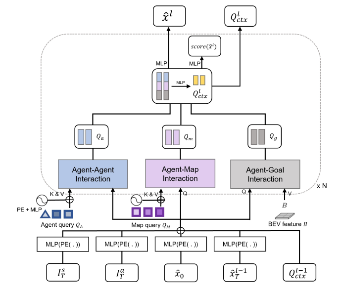
*図4.MotionFormerの構成図。N個のエージェント間、エージェントとマップ間、エージェントとゴール地点間のインタラクショントランスフォーマーが積み重ねられている。エージェント間およびエージェントとマップ間のインタラクションモジュールは、標準的なトランスフォーマーデコーダ層で構築されている。エージェントとゴール地点間のインタラクションモジュールは、変形可能なクロスアテンションモジュール [^109] 上に構築されている。*

- $I_s^T$：シーン中心のアンカーの終点
- $I_a^T$：クラスタ化されたエージェント中心のアンカーの終点
- $\hat{x}_0$：エージェントの現在位置
- $\hat{x}_{l-1}^T$：前の層で予測されたゴール地点
- $Q_{l-1}^{ctx}$：前の層からのクエリコンテキスト。

私たちのMotionFormerは、$I_T^a$、$I_T^s$、$\hat{x}_0$、$\hat{x}_T^{l-1} \in R^{\mathcal{K} \times 2}$を受け取り、クエリ位置を埋め込み、$Q_{ctx}^{l-1}$をクエリコンテキストとして受け取る。具体的には、k-meansアルゴリズムによって、すべてのエージェントのトレーニングデータの中でアンカーをクラスタリングし、$K=6$に設定する。これは、出力モダリティと互換性がある。シーン中心の事前知識を埋め込むために、アンカー$I_a^T$は、各エージェントの現在の位置と方向角に応じてグローバル座標系に回転および平行移動され、$I_T^s$と表記される（式(12)参照）。

```math
I_{i,T}^s = R_i I_a^T + T_i
\tag{12}
```

ここで、$i$はエージェントのインデックスであり、簡潔さのために省略される。粗い予測から細かい予測へのパラダイムを促進するために、前の層で予測されたゴール地点$\hat{x}_T^{l-1}$も採用する。同時に、エージェントの現在位置はモダリティ全体にわたってブロードキャストされ、$\hat{x}_0$と表記される。次に、MLPと正弦波位置埋め込みを各事前位置情報に適用し、それらをクエリ位置$Q_{pos} \in R^{K \times D}$として要約する。これは、クエリコンテキスト$Q_{ctx}$と同じ形状を持つ。$Q_{pos}$と$Q_{ctx}$は、モーションクエリを構築するために一緒に使用される。MotionFormer全体を通して、$D$を256に設定する。

図4に示すように、私たちのMotionFormerは、エージェント間、エージェントとマップ間、およびエージェントとゴール地点間のインタラクションモジュールという3つの主要なトランスフォーマーブロックで構成されている。エージェント間およびエージェントとマップ間のインタラクションモジュールは、標準的なトランスフォーマーデコーダ層で構築されており、マルチヘッド自己注意（MHSA）層とマルチヘッドクロスアテンション（MHCA）層、フィードフォワードネットワーク（FFN）、およびそれらの間のいくつかの残差接続と正規化層で構成されている [^8]。エージェントクエリ$Q_A$とマップクエリ$Q_M$に加えて、正弦波位置埋め込みとそれに続くMLP層を用いて、これらのクエリに位置埋め込みを追加する。

エージェントとゴール地点間のインタラクションモジュールは、変形可能なクロスアテンションモジュール [^109] 上に構築されており、以前に予測された軌道（$R_i \hat{x}_{i,T}^{l-1} + T_i$）からのゴール地点が参照点として採用されている（図5参照）。具体的には、サンプリングされた点の数を軌道ごとに4に設定し、エージェントごとに6つの軌道を設定する。各インタラクションモジュールの出力特徴量は連結され、MLP層によって次元$D=256$に投影される。

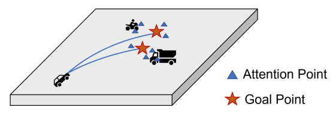
*図5.エージェントとゴール地点のインタラクションモジュールの図解。BEVの視覚的特徴量は、各エージェントのゴール地点付近で変形可能なクロスアテンションを用いてサンプリングされる。*

次に、ガウス混合モデルを使用して、各エージェントの軌道を構築する。ここで、$\hat{x}_l \in R^{\mathcal{K} \times T \times 5}$である。UniADでは、予測時間地平線$T$を12（6秒）に設定する。最後の次元の最初の2つ（つまり、$x$と$y$）のみを最終的な出力軌道として使用することに注意する。さらに、各モダリティのスコアも予測される（$\text{score}(\hat{x}_l) \in R^\mathcal{K}$）。全体のモジュールを$N$回積み重ね、$N$は実際には3に設定される。

#### E.4 Occupancy Prediction

上流モジュールからのBEV特徴量が与えられると、まず畳み込み層を用いて/4にダウンサンプリングして効率的な多段階予測を行い、提案するOccFormerに渡す。OccFormerは図6に示すように$T_o$個の連続するブロックで構成されており、$T_o=5$は時間的地平線（現在と将来のフレームを含む）であり、各ブロックは特定のフレームの占有を生成する責任がある。

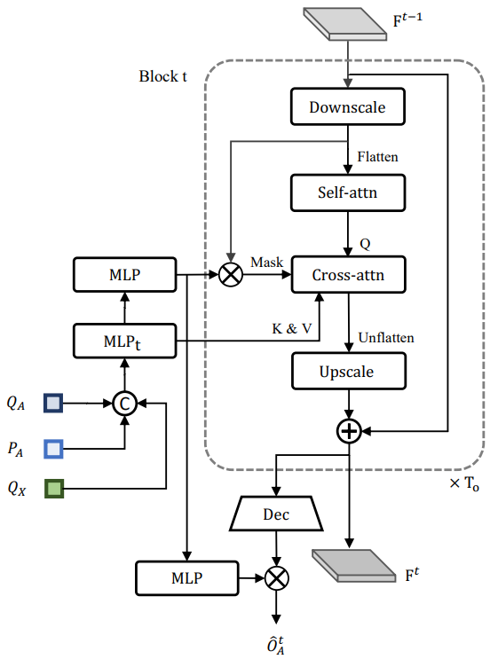
*図6.OccFormerの構造。$T_o$個の連続するブロックで構成されており、$T_o$は時間的地平線（現在と将来のフレームを含む）であり、各ブロックは特定のフレームの占有を生成する責任がある。上流のトラッククエリ$Q_A$、エージェント位置$P_A$、およびモーションクエリ$Q_X$からエンコードされた、密集したシーン特徴量とスパースなエージェント特徴量の両方を組み込み、将来のシーン表現にエージェントレベルの知識を注入する。各ブロックの最後で、エージェントレベルの特徴量とデコードされた密集特徴量の間の行列積によって、インスタンスレベルの占有$\hat{O}_A^t$を形成する。*

従来の研究とは異なり、提案手法は将来の表現を展開する際に、密集したシーン特徴量とスパースなエージェント特徴量の両方を組み込む。密集したシーン特徴量は、最後のブロックの出力（または現在のフレームの観測特徴量）から得られ、さらに畳み込み層によって/8にダウンスケールされて、ピクセルとエージェントの相互作用のための計算を削減する。スパースなエージェント特徴量は、トラッククエリ$Q_A$、エージェント位置$P_A$、およびモーションクエリ$Q_X$の連結から導出され、時間的感受性のために時間特異的なMLPに渡される。

ピクセルレベルの自己注意を実行して、急速に変化するシーンで必要な長期的な依存関係をモデル化し、シーンとエージェントの統合を実行して、シーンの各ピクセルを対応するエージェントに関連付ける。エージェントとピクセル間の位置合わせを強化するために、クロスアテンションをマスク特徴量とダウンスケールされたシーン特徴量の間の行列積によって生成されるアテンションマスクで制限する。ここで、マスク特徴量は、エージェント特徴量をMLPでエンコードすることによって生成される。

次に、アテンションを受けた密集特徴量を入力$F_{t-1}$（/4）と同じ解像度にアップサンプリングし、$F_{t-1}$に残差接続として加算して安定性を確保する。結果として得られる特徴量$F_t$は、次のブロックと、元のBEV解像度（/1）で占有を予測するための畳み込みデコーダの両方に送信される。マスク特徴量を再利用し、別のMLPに渡して占有特徴量を形成し、インスタンスレベルの占有は、占有特徴量とデコードされた密集特徴量$F_{dec}^t$（/1）の間の行列積によって生成される。

MLP層（マスク特徴量用）、MLP層（占有特徴量用）、および畳み込みデコーダは、すべての$T_o$ブロックで共有されるが、他のコンポーネントは各ブロックで独立している。OccFormerでは、すべての密集特徴量とエージェント特徴量の次元は256である。

#### E.5 Planning

図7に示すように、PlannerはTrackingとMotion Forecastingモジュールから生成されたエゴ車両クエリを受け取る。これは、それぞれ青い三角形と黄色の長方形で表されている。これら2つのクエリは、コマンド埋め込みとともに、MLP層でエンコードされた後、モダリティ次元にわたって最大プーリング層で処理され、最も顕著なモーダル特徴が選択され、集約される。

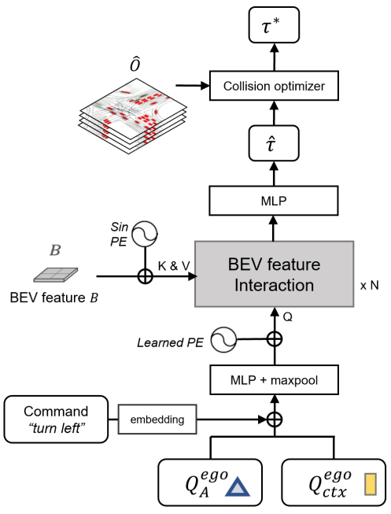
*図7.Plannerの構造。$Q_A^{ego}$と$Q_{ctx}^{ego}$は、それぞれトラッキングモジュールとモーション予測モジュールからのエゴ車両クエリである。高レベルのコマンドとともに、これらはMLP層でエンコードされた後、モダリティ次元にわたってMaxプーリング層で処理され、最も顕著なモーダル特徴が選択され、集約される。BEV特徴量インタラクションモジュールは、標準的なトランスフォーマーデコーダ層で構築されており、$N$層にわたって積み重ねられている。*

位置情報を埋め込むために、学習された位置埋め込みを計画クエリに融合し、正弦波位置埋め込みをBEV特徴量に融合する。次に、MLP層を用いて計画軌道を回帰し、$\hat{\tau} \in R^{T_p \times 2}$と表記する。ここで、$T_p = 6$（3秒）に設定する。

最後に、衝突回避のための衝突最適化器を考案した。これは、予測された占有$\hat{O}$と軌道$\hat{\tau}$を入力として受け取り、本文の式(10)に従って処理を行う。$d=5$、$\sigma=1.0$、$\lambda_{coord}=1.0$、$\lambda_{obs}=5.0$に設定した。

#### E.6 学習の詳細

UniADを2つの段階に分けてトレーニング（Joint Learning）することで、より安定した学習が可能となることがわかった。

##### 第1段階

第一段階では、TrackingとOnline Mappingを含むPerceptionタスクを事前トレーニングして、認識予測を安定させる。具体的には、対応する事前学習済みのBEVFormer [^55] の重みを、画像バックボーン、FPN、BEVエンコーダ、および検出デコーダ（オブジェクトクエリ埋め込みを除く）にロードして、収束を早める（追加のエゴ車両クエリのため）。画像バックボーンでの勾配逆伝播を停止してメモリコストを削減し、以下のようにトラッキングとオンライン・マッピング損失を用いてUniADを6エポックトレーニングした:

$$L_1 = L_{track} + L_{map} \tag{13}$$

##### 第2段階

第2段階では、画像バックボーンを凍結したまま、BEVエンコーダ（画像ビューからBEVへのビュー変換に使用）も凍結して、さらに下流モジュールでのメモリ消費を削減する。UniADは、トラッキング、マッピング、モーション予測、占有予測、計画を含むすべてのタスク損失を用いて20エポック（主要論文の各種アブレーション研究では、効率のために8エポック）トレーニングされる。

$$L_2 = L_{track} + L_{map} + L_{motion} + L_{occ} + L_{plan} \tag{14}$$

$L_1$と$L_2$の各項の詳細な損失とハイパーパラメータは、以下に個別に説明する。両段階におけるトラッキングとBEV特徴量集約 [^55] のための各トレーニングシーケンス（各ステップ）の長さは5（アブレーション研究では効率のために3）である。

###### Detection&Tracking loss

BEVFormer [^55] に従い、各ペア結果に対してハンガリー損失を採用する。これは、クラスラベルに対するFocal損失 [^61] と3Dボックスのローカリゼーションに対する$l_1$損失の線形結合である。マッチング戦略に関しては、新生クエリからの候補は二部グラフマッチングによってグラウンドトゥルースオブジェクトとペアになり、トラッククエリからの予測は前のフレームから割り当てられたグラウンドトゥルースインデックスを継承する。具体的には、

$$L_{track} = \lambda_{focal}L_{focal} + \lambda_{l_1}L_{l_1}$$

ここで、$\lambda_{focal} = 2$、$\lambda_{l_1} = 0.25$である。

###### Online Mapping loss

[^56] に従い、レーン、ディバイダ、輪郭に対するシング損失、および走行可能領域に対するスタフ損失を含む。Focal損失は分類に、$L_1$損失はシングバウンディングボックスに、Dice損失とGIoU損失 [^80] はセグメンテーションに用いられる。詳細には、

$$L_{map} = \lambda_{focal}L_{focal} + \lambda_{l_1}L_{l_1} + \lambda_{giou}L_{giou} + \lambda_{dice}L_{dice}$$

ここで、$\lambda_{focal} = \lambda_{giou} = \lambda_{dice} = 2$、$\lambda_{l_1} = 0.25$である。

###### Motion Forecasting loss

先行研究の多くと同様に、多峰性の軌道をガウス混合としてモデル化し、マルチパス損失 [^12], [^90] を使用する。これは、分類スコア損失$L_{cls}$と負の対数尤度損失項$L_{nll}$を含み、$\lambda$は対応する重みを表す。

$$L_{motion} = \lambda_{cls}L_{cls} + \lambda_{reg}L_{nll}$$

ここで、$\lambda_{cls} = \lambda_{reg} = 0.5$である。軌道の時間的滑らかさを確保するために、各タイムステップでエージェントの速度を予測し、それを時間にわたって積算して最終的な軌道を得る [^41]。

###### Occupancy Prediction loss

インスタンスレベルの占有予測の出力は、各エージェントのバイナリセグメンテーションであるため、占有損失としてバイナリクロスエントロピーとDice損失 [^67] を採用する。具体的には、

$$L_{occ} = \lambda_{bce}L_{bce} + \lambda_{dice}L_{dice}$$

ここで、$\lambda_{bce} = 5$、$\lambda_{dice} = 1$である。さらに、ピクセルとエージェントの相互作用モジュールにおけるアテンションマスクは、粗い予測と見なすことができるため、同じ形式の補助的な占有損失を用いてそれを監視する。

###### Planning loss

計画において最も重要なのは安全性である。したがって、単純な模倣$l_2$損失に加えて、計画軌道を障害物から遠ざけるための衝突損失を採用する。

$$L_{col}(\hat{\tau}, \delta) = \sum_{i,t} \text{IoU}(\text{box}(\hat{\tau}_t, w + \delta, l + \delta), b_{i,t}) \tag{15}$$

$$L_{plan} = \lambda_{imi}|\hat{\tau}, \tilde{\tau}|^2 + \lambda_{col} \sum_{(\omega, \delta)} \omega L_{col}(\hat{\tau}, \delta) \tag{16}$$

ここで、$\lambda_{imi} = 1$、$\lambda_{col} = 2.5$であり、$(\omega, \delta)$は追加の安全距離を考慮した重みと値のペアであり、$\text{box}(\hat{\tau}_t, w + \delta, l + \delta)$はタイムスタンプ$t$における自車両のバウンディングボックスを表し、より大きな安全距離を保持するためにサイズが拡大されている。また、$b_{i,t}$はシーン内で予測された各エージェントを示す。実際には、$(\omega, \delta)$を$(1.0, 0.0)$、$(0.4, 0.5)$、$(0.1, 1.0)$に設定する。

### F. 実験

#### F.1 プロトコル

BEVFormer [^55] のほとんどの基本的なトレーニング設定を、2つの段階の両方でバッチサイズ1、学習率$2 \times 10^{-4}$、バックボーンの学習率乗数0.1、重み減衰$1 \times 10^{-2}$のAdamWオプティマイザ [^65] でトレーニングする。BEVのデフォルトサイズは200×200で、X軸とY軸の両方で[-51.2m, 51.2m]の範囲をカバーし、間隔は0.512mである。特徴次元に関連するハイパーパラメータの詳細は表11に示されている。実験は16台のNVIDIA Tesla A100 GPUで行われた。

#### F.2 評価指標

##### Multi-Object Trackingの評価指標

標準的な評価プロトコルに従い、nuScenesデータセットにおけるUniADの3D追跡性能を評価するために、AMOTA（Average Multi-object Tracking Accuracy）、AMOTP（Average Multi-object Tracking Precision）、リコール、およびIDS（IDスイッチ）を使用する。AMOTAとAMOTPは、すべてのリコールにわたってMOTA（Multi-object Tracking Accuracy）とMOTP（Multi-object Tracking Precision）の値を積分することによって計算される。

$$\text{AMOTA} = \frac{1}{n-1} \sum_{r \in \{\frac{1}{n-1}, \frac{2}{n-1}, ..., 1\}} \text{MOTA}_r \tag{17}$$

$$\text{MOTA}_r = \max(0, 1 - \frac{\text{FP}_r + \text{FN}_r + \text{IDS}_r - (1-r)\text{GT}}{r\text{GT}}) \tag{18}$$

ここで、$\text{FP}_r$、$\text{FN}_r$、および$\text{IDS}_r$は、それぞれ対応するリコール$r$で計算された偽陽性、偽陰性、およびIDスイッチの数を表す。GTは、このフレーム内のグラウンドトゥルースオブジェクトの数を表す。

AMOTPは次のように定義できる。

$$\text{AMOTP} = \frac{1}{n-1} \sum_{r \in \{\frac{1}{n-1}, \frac{2}{n-1}, ..., 1\}} \frac{\sum_{i,t} d_{i,t}}{\text{TP}_r} \tag{19}$$

ここで、$d_{i,t}$は、タイムスタンプ$t$におけるマッチしたトラック$i$の位置誤差（x軸とy軸）を表し、$\text{TP}_r$は、対応するリコール$r$における真陽性の数を表す。

##### Online Mappingの評価指標

Online Mappingタスクでは、レーン、境界、歩行者横断歩道、走行可能領域の4つのカテゴリがある。ネットワークの出力とグラウンドトゥルースマップの間の各クラスに対する交差オーバー・ユニオン（IoU）指標を計算する。

##### Motion Forecastingの評価指標

一方では、標準的なモーション予測プロトコルに従って、minADE（最小平均変位誤差）、minFDE（最小最終変位誤差）、およびMR（ミス率）を含む従来の指標を採用する。先行研究 [^57], [^66], [^75] と同様に、これらの指標はマッチした真陽性（TP）内でのみ計算され、すべての実験でマッチング閾値を1.0mに設定する。MRについては、ミスFDE閾値を2.0mに設定する。

他方では、最近提案されたエンドツーエンド指標、つまりEPA（エンドツーエンド予測精度） [^30] とminFDE-AP [^75] も採用する。EPAについては、公平な比較のためにViP3D [^30] と同じ設定を使用する。minFDE-APについては、簡略化のために、グラウンドトゥルースを複数のビン（静的、線形、非線形に移動するサブカテゴリ）に分けない。具体的には、オブジェクトの認識位置とそのmin-FDEが距離閾値（それぞれ1.0mと2.0m）内にある場合にのみ、平均精度（AP）計算のための真陽性（TP）としてカウントされる。先行研究と同様に、車、トラック、建設車両、バス、トレーラー、オートバイ、自転車を車両カテゴリとして統合し、実験で提供されるすべてのモーション予測指標は車両カテゴリで評価される。

##### Occupancy Predictionの評価指標

Occupancy Predictionの品質を、 [^35], [^105] に従って、全体のシーンとインスタンスレベルの両方で評価する。具体的には、IoUはインスタンスに依存しない全体のシーンのカテゴリセグメンテーションを測定する。一方、Video Panoptic Quality（VPQ） [^48] は、各インスタンスの存在と時間経過に伴う一貫性を考慮する。VPQ指標は次のように計算される。

$$\text{VPQ} = \sum_{t=0}^{H} \frac{\sum_{(p_t,q_t) \in \text{TP}_t} \text{IoU}(p_t, q_t)}{|\text{TP}_t| + \frac{1}{2}|\text{FP}_t| + \frac{1}{2}|\text{FN}_t|} \tag{20}$$

ここで、$H$は将来の地平線であり、 [^35], [^105] と同様に$H=4$（現在のタイムスタンプを含む$T_o=5$となる）に設定し、2Hzで2.0秒の連続データをカバーする。$\text{TP}_t$、$\text{FP}_t$、および$\text{FN}_t$は、それぞれタイムスタンプ$t$における真陽性、偽陽性、および偽陰性の集合である。両方の指標は、エゴ車両周辺の2つの異なるBEV範囲、近距離（“-n.”）で30m×30m、遠距離（“-f.”）で100m×100mで評価される。現在のステップ（$t=0$）と将来の4ステップの結果を両方の指標で一緒に評価する。

##### Planningの評価指標

ST-P3 [^38] と同じ指標、つまりさまざまなタイムスタンプでのL2誤差と衝突率を採用する。

#### F.3 モデルの複雑さと計算コスト

UniADモデルの複雑さ（パラメータ数）とNvidia Tesla A100 GPU上での実行時間を測定した。その結果は表13に示されている。タスクのデコーダ部分は特定の数のパラメータを追加するが、BEVFormer 検出器（ID. 1）と比較して、計算の複雑さは主にエンコーダ部分に起因する。最近の BEVerse [^105] との比較も提供されている。UniAD はより多くのタスクを有し、優れた性能を達成し、さらに低い FLOPs を示しており、追加の計算コストに対する十分な余裕があることを示している。

| ID | Det. | Track | Map | Motion | Occ. | Plan | #Params | FLOPs | FPS |
|----|------|-------|-----|--------|------|------|----------|-------|-----|
| 0  | [105] | ✓    | ✓   |        |      |      | 102.5M   | 1921G | -   |
| 1  | ✓    |       |     |        |      |      | 65.9M    | 1324G | 4.2 |
| 2  | ✓    | ✓    |     |        |      |      | 68.2M    | 1326G | 2.7 |
| 3  | ✓    | ✓    | ✓   |        |      |      | 95.8M    | 1520G | 2.2 |
| 4  | ✓    | ✓    | ✓   | ✓      |      |      | 108.6M   | 1535G | 2.1 |
| 5  | ✓    | ✓    | ✓   | ✓      | ✓    |      | 122.5M   | 1701G | 2.0 |
| 6  | ✓    | ✓    | ✓   | ✓      | ✓    | ✓    | 125.0M   | 1709G | 1.8 |

#### F.4 モデルのスケーリング

表12に示すように、異なるモデルスケールで3つのUniADバリエーションを提供する。画像ビュー特徴抽出のために選択された画像バックボーンは、UniAD-S、UniAD-B、UniAD-Lそれぞれについて、ResNet50 [^32]、ResNet-101、VoVNet 2-99 [^51]である。モデルスケール（画像エンコーダ）は主にBEV特徴の品質に影響するため、より大きなバックボーンでは知覚スコアが向上し、さらに予測と計画のパフォーマンスが向上することが観察できる。

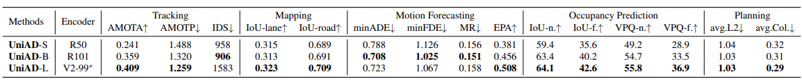
*表12.3種類のUniADの比較。pre-trained with extra depth data[^73]*

#### F.5. 定性的分析

##### アテンションマスクの可視化

内部メカニズムを調査し、説明可能性を示すために、プランナー内のクロスアテンションモジュールのアテンションマスクを可視化する。図8に示すように、予測されたトラッキング境界ボックス、計画された軌道、および地上真実のHDマップが参照のためにレンダリングされ、アテンションマスクがその上に重ねて表示される。左から右へ、時間的なシーケンスで2つの連続するフレームを表示するが、ナビゲーションコマンドは異なる。計画された軌道はコマンドに応じて大きく変化することが観察できる。また、目標レーンおよび自車両に譲歩している重要なエージェントに多くの注意が払われている。

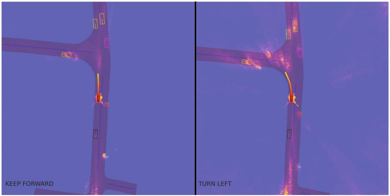
*図8.ナビゲーションコマンドとアテンションマスク可視化の有効性。ここでは、ナビゲーションコマンドに従ってどのように注意が払われるかを示す。計画モジュールのBEVインタラクションモジュールからのアテンションマスク、予測されたトラッキング境界ボックス、および計画された軌道をレンダリングする。ナビゲーションコマンドは左下に表示され、HDマップは参照用にのみレンダリングされる。左から右へ、時間的なシーケンスで2つの連続するフレームを表示するが、ナビゲーションコマンドは異なる。計画された軌道はコマンドに応じて大きく変化することが観察できる。また、目標レーンおよび自車両に譲歩している重要なエージェントに多くの注意が払われている。*

##### 異なるシナリオの可視化

より多くのシナリオ、都市部を巡航するシナリオ（図9）、重要なケース（図10）、および障害物回避シナリオ（図11）についての可視化を提供する。計画指向設計の有望な証拠が図12に示されており、前段のモジュールで不正確な結果が発生した場合でも、後段のタスクは依然として回復できる。同様に、サラウンドビュー画像、BEV、およびプランナーからのアテンションマスクで、すべてのタスクの結果を表示する。デモビデオも参照のために提供されている。

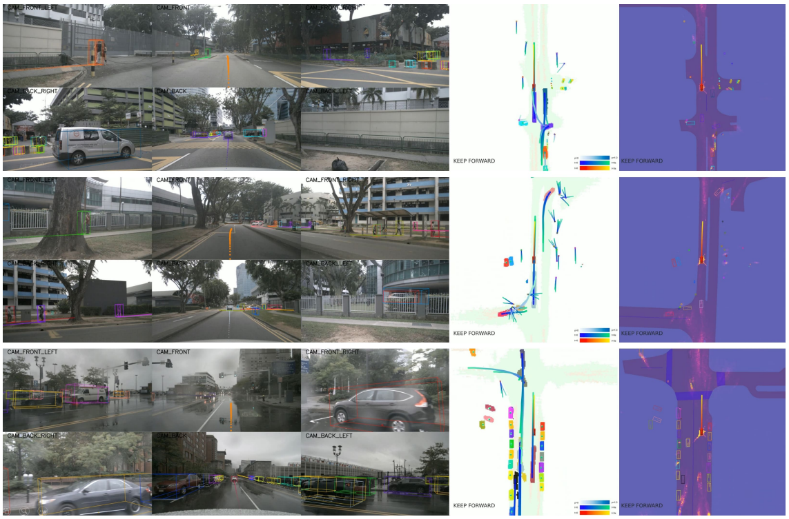
*図9.都市部巡航時の可視化。UniADは、高品質で解釈可能な知覚および予測結果を生成し、安全な操作を行うことができる。最初の3列は6つのカメラビューを示し、最後の2列はそれぞれ予測結果と計画モジュールからのアテンションマスクを示す。各エージェントは一意の色で表されている。モーション予測からの上位1および上位3の軌道のみが、画像ビューおよびBEVでの可視化のためにそれぞれ選択されている。*

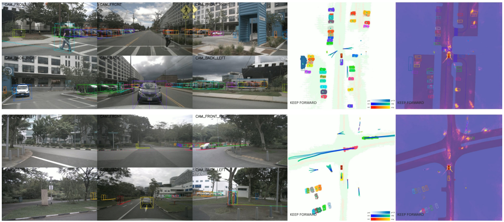
*図10.重要なケースの可視化。ここでは、2つの重要なケースを示す。最初のシナリオ（上）では、自車両が道路を横断する2人の歩行者に譲歩している様子が示され、2番目のシナリオ（下）では、自車両が交差点付近で保護されていない状態で直進するつもりで、高速で走行してくる車に譲歩している様子が示されている。最も重要なエージェント、つまり歩行者や高速で走行する車両、および意図した目的地に多くの注意が払われていることが観察できる。*

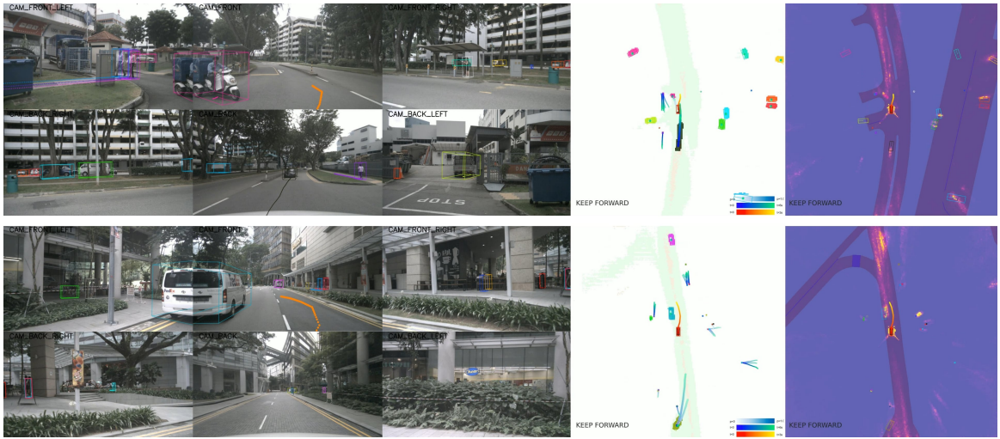
*図11.障害物回避の可視化。この2つのシナリオでは、自車両は注意深く車線を変更して障害物を回避している。*

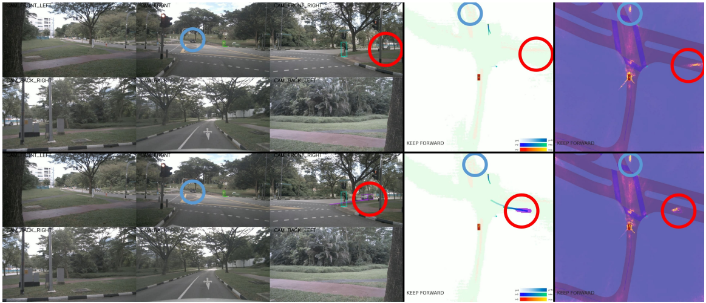
*図12.Perceptionの失敗からの回復。ここでは、前段のモジュールで不正確な結果が発生しているにもかかわらず、後段のタスクが依然として回復できる興味深いケースを示す。上段と下段は、同じシナリオの2つの連続するフレームを表している。赤い円内の車両は、交差点に向かって遠方から高速で走行してきている。トラッキングモジュールは最初はそれを見逃しているが、後続のフレームでは捉えていることが観察できる。青い円は交通に譲歩している静止車を示しており、両方のフレームで見逃されている。興味深いことに、両方の車両は、前のモジュールで見逃されているにもかかわらず、プランナーのアテンションマスクに強い反応を示している。つまり、プランナーは依然として、見逃されているものの重要なエージェントに注意を払っていることを意味し、これは以前の断片化され統一されていない運転システムでは実現できなかったものであり、UniADの堅牢性を示している。*

##### 失敗ケース

自律運転アルゴリズムがその弱点を理解し、将来の作業を導くためには、失敗ケースは不可欠である。ここでは、UniADのいくつかの失敗ケースを示す。UniADの失敗ケースは主に、すべてのモジュールが影響を受ける、ロングテールシナリオ（発生率の低いシナリオ）でのものであり、図13および図14に示されている。

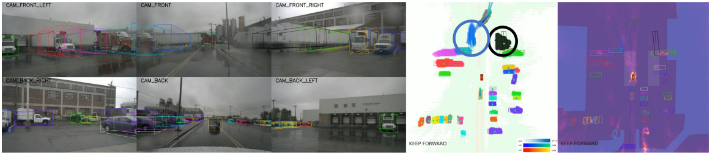
*図13.失敗ケース1。ここでは、ロングテールシナリオにおける失敗を示す。白いコンテナを積んだ大型トレーラーが道路全体を占拠している。トラッキングモジュールが、前のトレーラーの正確なサイズや、道路脇の車両の進行方向角を検出できないことが分かる。*

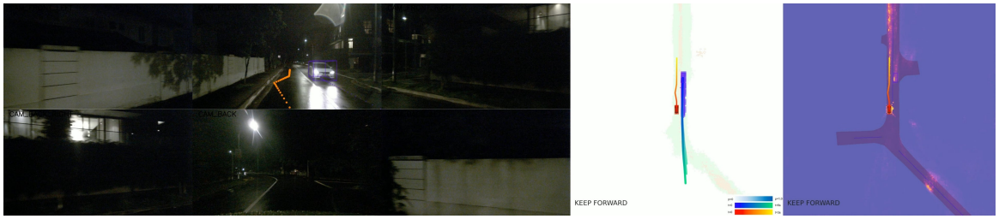
*図14.失敗ケース2。このケースでは、プランナーは狭い通りの進入車に対して過度に慎重になっている。暗い環境は、自律運転における重要なテールケースの1つである。衝突損失の重みを小さくし、境界に関するより多くの制約を適用することで、問題を緩和できる可能性がある。*

## References

[^1]:Adil Kaan Akan and Fatma G¨uney. StretchBEV: Stretching future instance prediction spatially and temporally. In ECCV, 2022. 7, 14
[^2]:Mayank Bansal, Alex Krizhevsky, and Abhijit Ogale. Chauffeurnet: Learning to drive by imitating the best and synthesizing the worst. arXiv preprint arXiv:1812.03079, 2018. 15
[^3]:Hans Georg Bock and Karl-Josef Plitt. A multiple shooting algorithm for direct solution of optimal control problems. IFAC Proceedings Volumes, 1984. 4, 5
[^4]:Mariusz Bojarski, Davide Del Testa, Daniel Dworakowski, Bernhard Firner, Beat Flepp, Prasoon Goyal, Lawrence D Jackel, Mathew Monfort, Urs Muller, Jiakai Zhang, Xin Zhang, Jake Zhao, and Zieba Karol. End to end learning for self-driving cars. arXiv preprint arXiv:1604.07316, 2016. 15
[^5]:Thibault Buhet, ´Emilie Wirbel, and Xavier Perrotton. PLOP: Probabilistic polynomial objects trajectory planning for autonomous driving. In CoRL, 2020. 15
[^6]:Holger Caesar, Varun Bankiti, Alex H Lang, Sourabh Vora, Venice Erin Liong, Qiang Xu, Anush Krishnan, Yu Pan, Giancarlo Baldan, and Oscar Beijbom. nuscenes: A multimodal dataset for autonomous driving. In CVPR, 2020. 6
[^7]:Holger Caesar, Juraj Kabzan, Kok Seang Tan, Whye Kit Fong, Eric Wolff, Alex Lang, Luke Fletcher, Oscar Beijbom, and Sammy Omari. nuplan: A closed-loop mlbased planning benchmark for autonomous vehicles. arXiv preprint arXiv:2106.11810, 2021. 4
[^8]:Nicolas Carion, Francisco Massa, Gabriel Synnaeve, Nicolas Usunier, Alexander Kirillov, and Sergey Zagoruyko. End-to-end object detection with transformers. In ECCV, 2020. 3, 5, 14, 15, 17
[^9]:Sergio Casas, Cole Gulino, Renjie Liao, and Raquel Urtasun. Spagnn: Spatially-aware graph neural networks for relational behavior forecasting from sensor data. In ICRA, 2020. 14
[^10]:Sergio Casas, Wenjie Luo, and Raquel Urtasun. Intentnet: Learning to predict intention from raw sensor data. In CoRL, 2018. 14
[^11]:Sergio Casas, Abbas Sadat, and Raquel Urtasun. Mp3: A unified model to map, perceive, predict and plan. In CVPR, 2021. 2, 5, 14, 15
[^12]:Yuning Chai, Benjamin Sapp, Mayank Bansal, and Dragomir Anguelov. Multipath: Multiple probabilistic anchor trajectory hypotheses for behavior prediction. In CoRL, 2020. 15, 19
[^13]:Raphael Chekroun, Marin Toromanoff, Sascha Hornauer, and Fabien Moutarde. GRI: General reinforced imitation and its application to vision-based autonomous driving. arXiv preprint 2111.08575, 2021. 15
[^14]:Dian Chen, Vladlen Koltun, and Philipp Kr¨ahenb¨uhl. Learning to drive from a world on rails. In ICCV, 2021. 2, 15
[^15]:Dian Chen and Philipp Kr¨ahenb¨uhl. Learning from all vehicles. In CVPR, 2022. 1, 2, 15
[^16]:Dian Chen, Brady Zhou, Vladlen Koltun, and Philipp Kr¨ahenb¨uhl. Learning by cheating. In CoRL, 2020. 2, 15
[^17]:Bowen Cheng, Ishan Misra, Alexander G. Schwing, Alexander Kirillov, and Rohit Girdhar. Masked-attention mask transformer for universal image segmentation. In CVPR, 2022. 5
[^18]:Bowen Cheng, Alex Schwing, and Alexander Kirillov. Perpixel classification is not all you need for semantic segmentation. In NeurIPS, 2021. 5
[^19]:Kashyap Chitta, Aditya Prakash, and Andreas Geiger. NEAT: Neural attention fields for end-to-end autonomous driving. In ICCV, 2021. 2, 15
[^20]:Kashyap Chitta, Aditya Prakash, Bernhard Jaeger, Zehao Yu, Katrin Renz, and Andreas Geiger. Transfuser: Imitation with transformer-based sensor fusion for autonomous driving. IEEE TPAMI, 2022. 1, 15
[^21]:Felipe Codevilla, Matthias M¨uller, Antonio L´opez, Vladlen Koltun, and Alexey Dosovitskiy. End-to-end driving via conditional imitation learning. In ICRA, 2018. 2, 15
[^22]:Felipe Codevilla, Eder Santana, Antonio M L´opez, and Adrien Gaidon. Exploring the limitations of behavior cloning for autonomous driving. In ICCV, 2019. 2, 15
[^23]:Michael Crawshaw. Multi-task learning with deep neural networks: A survey. arXiv preprint arXiv:2009.09796, 2020. 2
[^24]:Alexander Cui, Sergio Casas, Abbas Sadat, Renjie Liao, and Raquel Urtasun. Lookout: Diverse multi-future prediction and planning for self-driving. In ICCV, 2021. 15
[^25]:Nemanja Djuric, Henggang Cui, Zhaoen Su, Shangxuan Wu, Huahua Wang, Fang-Chieh Chou, Luisa San Martin, Song Feng, Rui Hu, Yang Xu, Alyssa Dayan, Sidney Zhang, Brian C. Becker, Gregory P. Meyer, Carlos VallespiGonzalez, and Carl K. Wellington. Multixnet: Multiclass multistage multimodal motion prediction. In IV, 2021. 14
[^26]:Alexey Dosovitskiy, German Ros, Felipe Codevilla, Antonio Lopez, and Vladlen Koltun. CARLA: An open urban driving simulator. In CoRL, 2017. 2
[^27]:Scott Ettinger, Shuyang Cheng, Benjamin Caine, Chenxi Liu, Hang Zhao, Sabeek Pradhan, Yuning Chai, Ben Sapp, Charles R Qi, Yin Zhou, Zoey Yang, Aur´elien Chouard, Pei Sun, Jiquan Ngiam, Vijay Vasudevan, Alexander McCauley, Jonathon Shlens, and Dragomir Anguelov. Large scale interactive motion forecasting for autonomous driving: The waymo open motion dataset. In ICCV, 2021. 13
[^28]:Sudeep Fadadu, Shreyash Pandey, Darshan Hegde, Yi Shi, Fang-Chieh Chou, Nemanja Djuric, and Carlos VallespiGonzalez. Multi-view fusion of sensor data for improved perception and prediction in autonomous driving. In WACV, 2022. 14
[^29]:Jiyang Gao, Chen Sun, Hang Zhao, Yi Shen, Dragomir Anguelov, Congcong Li, and Cordelia Schmid. Vectornet: Encoding hd maps and agent dynamics from vectorized representation. In CVPR, 2020. 14
[^30]:Junru Gu, Chenxu Hu, Tianyuan Zhang, Xuanyao Chen, Yilun Wang, Yue Wang, and Hang Zhao. ViP3D: End-toend visual trajectory prediction via 3d agent queries. In CVPR, 2023. 2, 6, 7, 14, 20 9
[^31]:Chunrui Han, Jianjian Sun, Zheng Ge, Jinrong Yang, Runpei Dong, Hongyu Zhou, Weixin Mao, Yuang Peng, and Xiangyu Zhang. Exploring recurrent long-term temporal fusion for multi-view 3d perception. arXiv preprint arXiv:2303.05970, 2023. 2
[^32]:Kaiming He, Xiangyu Zhang, Shaoqing Ren, and Jian Sun. Deep residual learning for image recognition. In CVPR, 2016. 21
[^33]:Noureldin Hendy, Cooper Sloan, Feng Tian, Pengfei Duan, Nick Charchut, Yuesong Xie, Chuang Wang, and James Philbin. Fishing net: Future inference of semantic heatmaps in grids. arXiv preprint arXiv:2006.09917, 2020. 14
[^34]:Anthony Hu, Gianluca Corrado, Nicolas Griffiths, Zak Murez, Corina Gurau, Hudson Yeo, Alex Kendall, Roberto Cipolla, and Jamie Shotton. Model-based imitation learning for urban driving. In NeurIPS, 2022. 15
[^35]:Anthony Hu, Zak Murez, Nikhil Mohan, Sof´ıa Dudas, Jeffrey Hawke, Vijay Badrinarayanan, Roberto Cipolla, and Alex Kendall. FIERY: Future instance prediction in bird’seye view from surround monocular cameras. In ICCV, 2021. 4, 7, 14, 20
[^36]:Hou-Ning Hu, Yung-Hsu Yang, Tobias Fischer, Trevor Darrell, Fisher Yu, and Min Sun. Monocular quasi-dense 3d object tracking. IEEE TPAMI, 2022. 7
[^37]:Peiyun Hu, Aaron Huang, John Dolan, David Held, and Deva Ramanan. Safe local motion planning with selfsupervised freespace forecasting. In CVPR, 2021. 7, 8, 15
[^38]:Shengchao Hu, Li Chen, Penghao Wu, Hongyang Li, Junchi Yan, and Dacheng Tao. ST-P3: End-to-end visionbased autonomous driving via spatial-temporal feature learning. In ECCV, 2022. 2, 4, 5, 7, 8, 14, 15, 20
[^39]:Zhiyu Huang, Haochen Liu, Jingda Wu, and Chen Lv. Differentiable integrated motion prediction and planning with learnable cost function for autonomous driving. arXiv preprint arXiv:2207.10422, 2022. 15
[^40]:Boris Ivanovic, Amine Elhafsi, Guy Rosman, Adrien Gaidon, and Marco Pavone. MATS: An interpretable trajectory forecasting representation for planning and control. In CoRL, 2021. 15
[^41]:Xiaosong Jia, Li Chen, Penghao Wu, Jia Zeng, Junchi Yan, Hongyang Li, and Yu Qiao. Towards capturing the temporal dynamics for trajectory prediction: a coarse-to-fine approach. In CoRL, 2022. 14, 19
[^42]:Xiaosong Jia, Liting Sun, Masayoshi Tomizuka, and Wei Zhan. Ide-net: Interactive driving event and pattern extraction from human data. IEEE RA-L, 2021. 14
[^43]:Xiaosong Jia, Liting Sun, Hang Zhao, Masayoshi Tomizuka, and Wei Zhan. Multi-agent trajectory prediction by combining egocentric and allocentric views. In CoRL, 2021. 3
[^44]:Xiaosong Jia, Penghao Wu, Li Chen, Hongyang Li, Yu Liu, and Junchi Yan. HDGT: Heterogeneous driving graph transformer for multi-agent trajectory prediction via scene encoding. arXiv preprint arXiv:2205.09753, 2022. 3
[^45]:Alexey Kamenev, Lirui Wang, Ollin Boer Bohan, Ishwar Kulkarni, Bilal Kartal, Artem Molchanov, Stan Birchfield, David Nist´er, and Nikolai Smolyanskiy. Predictionnet: Real-time joint probabilistic traffic prediction for planning, control, and simulation. In ICRA, 2022. 15
[^46]:Alex Kendall, Jeffrey Hawke, David Janz, Przemyslaw Mazur, Daniele Reda, John-Mark Allen, Vinh-Dieu Lam, Alex Bewley, and Amar Shah. Learning to drive in a day. In ICRA, 2019. 15
[^47]:Tarasha Khurana, Peiyun Hu, Achal Dave, Jason Ziglar, David Held, and Deva Ramanan. Differentiable raycasting for self-supervised occupancy forecasting. In ECCV, 2022. 7, 15
[^48]:Dahun Kim, Sanghyun Woo, Joon-Young Lee, and In So Kweon. Video panoptic segmentation. In CVPR, 2020. 20
[^49]:Jinkyu Kim, Reza Mahjourian, Scott Ettinger, Mayank Bansal, Brandyn White, Ben Sapp, and Dragomir Anguelov. Stopnet: Scalable trajectory and occupancy prediction for urban autonomous driving. arXiv preprint arXiv:2206.00991, 2022. 3
[^50]:Alexander Kirillov, Kaiming He, Ross Girshick, Carsten Rother, and Piotr Doll´ar. Panoptic segmentation. In CVPR, 2019. 3
[^51]:Youngwan Lee, Joong-won Hwang, Sangrok Lee, Yuseok Bae, and Jongyoul Park. An energy and gpu-computation efficient backbone network for real-time object detection. In CVPR Workshop, 2019. 21
[^52]:Feng Li, Hao Zhang, Shilong Liu, Lei Zhang, Lionel M Ni, and Heung-Yeung Shum. Mask dino: Towards a unified transformer-based framework for object detection and segmentation. In CVPR, 2023. 5
[^53]:Lingyun Luke Li, Bin Yang, Ming Liang, Wenyuan Zeng, Mengye Ren, Sean Segal, and Raquel Urtasun. End-to-end contextual perception and prediction with interaction transformer. In IROS, 2020. 14
[^54]:Yanwei Li, Yilun Chen, Xiaojuan Qi, Zeming Li, Jian Sun, and Jiaya Jia. Unifying voxel-based representation with transformer for 3d object detection. In NeurIPS, 2022. 14
[^55]:Zhiqi Li, Wenhai Wang, Hongyang Li, Enze Xie, Chonghao Sima, Tong Lu, Qiao Yu, and Jifeng Dai. BEVFormer: Learning bird’s-eye-view representation from multi-camera images via spatiotemporal transformers. In ECCV, 2022. 2, 7, 15, 18, 19, 21
[^56]:Zhiqi Li, Wenhai Wang, Enze Xie, Zhiding Yu, Anima Anandkumar, Jose M Alvarez, Ping Luo, and Tong Lu. Panoptic segformer: Delving deeper into panoptic segmentation with transformers. In CVPR, 2022. 3, 5, 15, 17, 19
[^57]:Ming Liang, Bin Yang, Wenyuan Zeng, Yun Chen, Rui Hu, Sergio Casas, and Raquel Urtasun. Pnpnet: End-to-end perception and prediction with tracking in the loop. In CVPR, 2020. 1, 2, 7, 14, 20
[^58]:Tingting Liang, Hongwei Xie, Kaicheng Yu, Zhongyu Xia, Zhiwei Lin, Yongtao Wang, Tao Tang, Bing Wang, and Zhi Tang. BEVFusion: A simple and robust lidar-camera fusion framework. In NeurIPS, 2022. 2
[^59]:Xiaodan Liang, Tairui Wang, Luona Yang, and Eric Xing. Cirl: Controllable imitative reinforcement learning for vision-based self-driving. In ECCV, 2018. 15 10
[^60]:Xiwen Liang, Yangxin Wu, Jianhua Han, Hang Xu, Chunjing Xu, and Xiaodan Liang. Effective adaptation in multi-task co-training for unified autonomous driving. In NeurIPS, 2022. 1
[^61]:Tsung-Yi Lin, Priya Goyal, Ross Girshick, Kaiming He, and Piotr Doll´ar. Focal loss for dense object detection. In ICCV, 2017. 19
[^62]:Jerry Liu, Wenyuan Zeng, Raquel Urtasun, and Ersin Yumer. Deep structured reactive planning. In ICRA, 2021. 15
[^63]:Yicheng Liu, Jinghuai Zhang, Liangji Fang, Qinhong Jiang, and Bolei Zhou. Multimodal motion prediction with stacked transformers. In CVPR, 2021. 3
[^64]:Zhijian Liu, Haotian Tang, Alexander Amini, Xingyu Yang, Huizi Mao, Daniela Rus, and Song Han. BEVFusion: Multi-task multi-sensor fusion with unified bird’s-eye view representation. In ICRA, 2023. 2, 14
[^65]:Ilya Loshchilov and Frank Hutter. Decoupled weight decay regularization. In ICLR, 2018. 20
[^66]:Wenjie Luo, Bin Yang, and Raquel Urtasun. Fast and furious: Real time end-to-end 3d detection, tracking and motion forecasting with a single convolutional net. In CVPR, 2018. 1, 14, 20
[^67]:Fausto Milletari, Nassir Navab, and Seyed-Ahmad Ahmadi. V-net: Fully convolutional neural networks for volumetric medical image segmentation. In 3DV, 2016. 19
[^68]:[Mobileye. Mobileye under the hood.](https://www.mobileye.com/ces-2022/), 2022. 1, 2
[^69]:Nigamaa Nayakanti, Rami Al-Rfou, Aurick Zhou, Kratarth Goel, Khaled S Refaat, and Benjamin Sapp. Wayformer: Motion forecasting via simple & efficient attention networks. arXiv preprint arXiv:2207.05844, 2022. 3
[^70]:Jiquan Ngiam, Benjamin Caine, Vijay Vasudevan, Zhengdong Zhang, Hao-Tien Lewis Chiang, Jeffrey Ling, Rebecca Roelofs, Alex Bewley, Chenxi Liu, Ashish Venugopal, David Weiss, Ben Sapp, Zhifeng Chen, and Jonathon Shlens. Scene transformer: A unified multi-task model for behavior prediction and planning. In ICLR, 2022. 3, 15
[^71]:[Nvidia. NVIDIA DRIVE End-to-End Solutions for Autonomous Vehicles.](https://developer.nvidia.com/drive), 2022. 1, 2
[^72]:Bowen Pan, Jiankai Sun, Ho Yin Tiga Leung, Alex Andonian, and Bolei Zhou. Cross-view semantic segmentation for sensing surroundings. IEEE RA-L, 2020. 7
[^73]:Dennis Park, Rares Ambrus, Vitor Guizilini, Jie Li, and Adrien Gaidon. Is pseudo-lidar needed for monocular 3d object detection? In ICCV, 2021. 21
[^74]:Jinhyung Park, Chenfeng Xu, Shijia Yang, Kurt Keutzer, Kris Kitani, Masayoshi Tomizuka, and Wei Zhan. Time will tell: New outlooks and a baseline for temporal multiview 3d object detection. arXiv preprint arXiv:2210.02443, 2022. 2
[^75]:Neehar Peri, Jonathon Luiten, Mengtian Li, Aljoˇsa Oˇsep, Laura Leal-Taix´e, and Deva Ramanan. Forecasting from lidar via future object detection. In CVPR, 2022. 14, 20
[^76]:Jonah Philion and Sanja Fidler. Lift, splat, shoot: Encoding images from arbitrary camera rigs by implicitly unprojecting to 3d. In ECCV, 2020. 7
[^77]:Dean A Pomerleau. Alvinn: An autonomous land vehicle in a neural network. In NeurIPS, 1988. 15
[^78]:Aditya Prakash, Kashyap Chitta, and Andreas Geiger. Multi-modal fusion transformer for end-to-end autonomous driving. In CVPR, 2021. 2, 15
[^79]:Scott Reed, Konrad Zolna, Emilio Parisotto, Sergio Gomez Colmenarejo, Alexander Novikov, Gabriel Barth-Maron, Mai Gimenez, Yury Sulsky, Jackie Kay, Jost Tobias Springenberg, Tom Eccles, Jake Bruce, Ali Razavi, Ashley Edwards, Nicolas Heess, Yutian Chen, Raia Hadsell, Oriol Vinyals, Mahyar Bordbar, and Nando de Freitas. A generalist agent. arXiv preprint arXiv:2205.06175, 2022. 1
[^80]:Hamid Rezatofighi, Nathan Tsoi, JunYoung Gwak, Amir Sadeghian, Ian Reid, and Silvio Savarese. Generalized intersection over union: A metric and a loss for bounding box regression. In CVPR, 2019. 19
[^81]:Nicholas Rhinehart, Rowan McAllister, Kris Kitani, and Sergey Levine. PRECOG: Prediction conditioned on goals in visual multi-agent settings. In ICCV, 2019. 15
[^82]:Abbas Sadat, Sergio Casas, Mengye Ren, Xinyu Wu, Pranaab Dhawan, and Raquel Urtasun. Perceive, predict, and plan: Safe motion planning through interpretable semantic representations. In ECCV, 2020. 1, 2, 14, 15
[^83]:Hao Shao, Letian Wang, Ruobing Chen, Hongsheng Li, and Yu Liu. Safety-enhanced autonomous driving using interpretable sensor fusion transformer. In CoRL, 2022. 15
[^84]:Shaoshuai Shi, Li Jiang, Dengxin Dai, and Bernt Schiele. Motion transformer with global intention localization and local movement refinement. In NeurIPS, 2022. 3
[^85]:Yining Shi, Jingyan Shen, Yifan Sun, Yunlong Wang, Jiaxin Li, Shiqi Sun, Kun Jiang, and Diange Yang. Srcn3d: Sparse r-cnn 3d surround-view camera object detection and tracking for autonomous driving. arXiv preprint arXiv:2206.14451, 2022. 14
[^86]:Haoran Song, Wenchao Ding, Yuxuan Chen, Shaojie Shen, Michael Yu Wang, and Qifeng Chen. Pip: Planninginformed trajectory prediction for autonomous driving. In ECCV, 2020. 15
[^87]:[Tesla. Tesla AI Day.](https://www.youtube.com/watch?v=ODSJsviD_SU), 2022. 2
[^88]:Sebastian Thrun and Arno B¨ucken. Integrating grid-based and topological maps for mobile robot navigation. In AAAI, 1996. 14
[^89]:Marin Toromanoff, Emilie Wirbel, and Fabien Moutarde. End-to-end model-free reinforcement learning for urban driving using implicit affordances. In CVPR, 2020. 15
[^90]:Balakrishnan Varadarajan, Ahmed Hefny, Avikalp Srivastava, Khaled S Refaat, Nigamaa Nayakanti, Andre Cornman, Kan Chen, Bertrand Douillard, Chi Pang Lam, Dragomir Anguelov, and Benjamin Sapp. Multipath++: Efficient information fusion and trajectory aggregation for behavior prediction. arXiv preprint arXiv:2111.14973, 2021. 19
[^91]:Ashish Vaswani, Noam Shazeer, Niki Parmar, Jakob Uszkoreit, Llion Jones, Aidan N Gomez, Łukasz Kaiser, and Illia Polosukhin. Attention is all you need. In NeurIPS, 2017. 4 11
[^92]:Peng Wang, An Yang, Rui Men, Junyang Lin, Shuai Bai, Zhikang Li, Jianxin Ma, Chang Zhou, Jingren Zhou, and Hongxia Yang. Ofa: Unifying architectures, tasks, and modalities through a simple sequence-to-sequence learning framework. In ICML, 2022. 1
[^93]:Qitai Wang, Yuntao Chen, Ziqi Pang, Naiyan Wang, and Zhaoxiang Zhang. Immortal tracker: Tracklet never dies. arXiv preprint arXiv:2111.13672, 2021. 6, 7
[^94]:Bob Wei, Mengye Ren, Wenyuan Zeng, Ming Liang, Bin Yang, and Raquel Urtasun. Perceive, attend, and drive: Learning spatial attention for safe self-driving. In ICRA, 2021. 15
[^95]:Penghao Wu, Li Chen, Hongyang Li, Xiaosong Jia, Junchi Yan, and Yu Qiao. Policy pre-training for autonomous driving via self-supervised geometric modeling. In ICLR, 2023. 2
[^96]:Pengxiang Wu, Siheng Chen, and Dimitris N Metaxas. Motionnet: Joint perception and motion prediction for autonomous driving based on bird’s eye view maps. In CVPR, 2020. 14
[^97]:Penghao Wu, Xiaosong Jia, Li Chen, Junchi Yan, Hongyang Li, and Yu Qiao. Trajectory-guided control prediction for end-to-end autonomous driving: A simple yet strong baseline. In NeurIPS, 2022. 2, 15
[^98]:Jinrong Yang, En Yu, Zeming Li, Xiaoping Li, and Wenbing Tao. Quality matters: Embracing quality clues for robust 3d multi-object tracking. arXiv preprint arXiv:2208.10976, 2022. 14
[^99]:Ye Yuan, Xinshuo Weng, Yanglan Ou, and Kris M Kitani. Agentformer: Agent-aware transformers for sociotemporal multi-agent forecasting. In ICCV, 2021. 3
[^100]:Fangao Zeng, Bin Dong, Tiancai Wang, Xiangyu Zhang, and Yichen Wei. Motr: End-to-end multiple-object tracking with transformer. In ECCV, 2021. 3, 15
[^101]:Wenyuan Zeng, Wenjie Luo, Simon Suo, Abbas Sadat, Bin Yang, Sergio Casas, and Raquel Urtasun. End-to-end interpretable neural motion planner. In CVPR, 2019. 1, 2, 7, 14, 15
[^102]:Wenyuan Zeng, Shenlong Wang, Renjie Liao, Yun Chen, Bin Yang, and Raquel Urtasun. Dsdnet: Deep structured self-driving network. In ECCV, 2020. 15
[^103]:Jimuyang Zhang and Eshed Ohn-Bar. Learning by watching. In CVPR, 2021. 15
[^104]:Tianyuan Zhang, Xuanyao Chen, Yue Wang, Yilun Wang, and Hang Zhao. MUTR3D: A Multi-camera Tracking Framework via 3D-to-2D Queries. In CVPR Workshop, 2022. 3, 6, 7, 14
[^105]:Yunpeng Zhang, Zheng Zhu, Wenzhao Zheng, Junjie Huang, Guan Huang, Jie Zhou, and Jiwen Lu. BEVerse: Unified perception and prediction in birds-eye-view for vision-centric autonomous driving. arXiv preprint arXiv:2205.09743, 2022. 1, 2, 4, 7, 14, 20, 21
[^106]:Zhejun Zhang, Alexander Liniger, Dengxin Dai, Fisher Yu, and Luc Van Gool. End-to-end urban driving by imitating a reinforcement learning coach. In ICCV, 2021. 2, 15
[^107]:Hang Zhao, Jiyang Gao, Tian Lan, Chen Sun, Benjamin Sapp, Balakrishnan Varadarajan, Yue Shen, Yi Shen, Yuning Chai, Cordelia Schmid, Congcong Li, and Dragomir Anguelov. TNT: Target-driven trajectory prediction. In CoRL, 2020. 14
[^108]:Jinguo Zhu, Xizhou Zhu, Wenhai Wang, Xiaohua Wang, Hongsheng Li, Xiaogang Wang, and Jifeng Dai. Uniperceiver-moe: Learning sparse generalist models with conditional moes. In NeurIPS, 2022. 1
[^109]:Xizhou Zhu, Weijie Su, Lewei Lu, Bin Li, Xiaogang Wang, and Jifeng Dai. Deformable detr: Deformable transformers for end-to-end object detection. In ICLR, 2020. 3, 4, 15, 17
