# nuScenes

[nuScenes: A multimodal dataset for autonomous driving](https://arxiv.org/abs/1903.11027)の和訳

## Abstract

自動運転車技術の実用化において、物体の堅牢な検出と追跡が不可欠である。画像ベースのベンチマークデータセットは、環境中のエージェントの検出、追跡、セグメンテーションといったコンピュータビジョンタスクの発展を牽引してきた。しかし、ほとんどの自動運転車は、カメラとLiDARやレーダーなどの範囲センサーの組み合わせを搭載している。検出および追跡のための機械学習手法がますます普及する中で、範囲センサーのデータと画像を両方含むデータセットを使ってこれらの手法を訓練・評価する必要が生じている。本論文では、nuTonomy scenes（nuScenes）を提示する。これは、6台のカメラ、5台のレーダー、1台のLiDARを備え、360度の全周視野を実現した、初めての完全な自動運転センサーユニットを搭載したデータセットである。nuScenesは、1000のシーンから構成され、各シーンは20秒間で、23のクラスと8つの属性に対して3次元バウンディングボックスが完全にアノテーションされている。KITTIデータセットと比較して、アノテーションの数は7倍、画像の数は100倍以上である。我々は、3次元検出と追跡のための新しいメトリクスを定義した。また、LiDARおよび画像ベースの検出と追跡のためのベースラインも提供し、データセットの詳細な分析を行った。データ、開発キットおよびその他の情報はオンラインで公開されている。

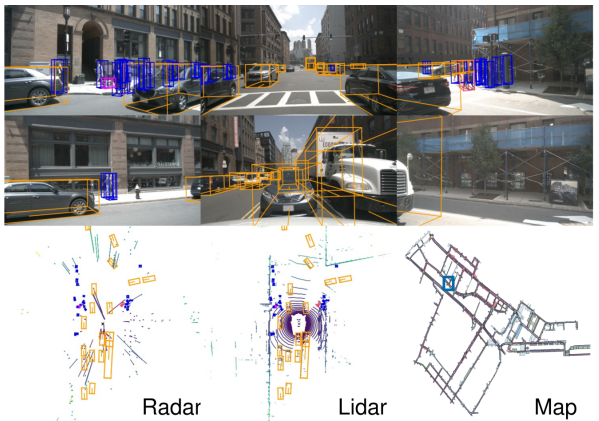
*図1. nuScenesデータセットのワンシーン。6つの異なるカメラビュー、Lidarおよびレーダーデータ、および人手によるセマンティックマップが表示されています。下部には、人手によるシーンの説明が表示されています。*

## 1. Introduction

自律運転は都市の景観を大きく変え、人命を救う可能性があります [^78] 。安全なナビゲーションの重要な部分は、車両周辺の環境におけるエージェントの検出と追跡です。これを実現するために、現代の自動運転車は、高度な検出および追跡アルゴリズムとともに複数のセンサーを搭載しています。このようなアルゴリズムはますます機械学習に依存しており、ベンチマークデータセットの必要性が高まっています。この目的のための画像データセットは多数存在しますが（表1）、自律運転知覚システムの構築に関連する課題の全セットを示すマルチモーダルデータセットは不足しています。私たちはこのギャップを埋めるためにnuScenesデータセットを公開しました[^2]。

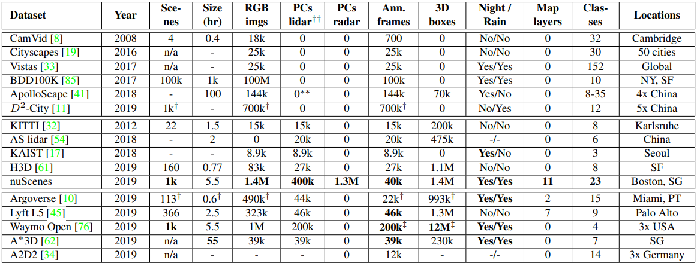
*表1.自動運転データセットの比較。この表の上部は距離データを含まないデータセットを示しています。中部と下部は、このデータセットの初期リリース時およびその後にリリースされた距離データを含むデータセット（出版物ではなく）を示しています。距離データを含むデータセットの中で、各列の最良のエントリを示すために太字のハイライトを使用しています。少なくとも車、歩行者、自転車のアノテーションを提供するデータセットのみがこの比較に含まれています。（†）直方体でアノテーションされたシーンのみの数値を報告しています。（‡）現在のWaymo OpenデータセットのサイズはnuScenesに匹敵しますが、アノテーションの頻度は5倍高いです。（††）各Lidarから収集されたLidar点群の数。（**）[^41]は静的な深度マップを提供しています。（-）は情報が提供されていないことを示しています。SG：シンガポール、NY：ニューヨーク、SF：サンフランシスコ、PT：ピッツバーグ、AS：ApolloScape。*

マルチモーダルデータセットは特に重要です。なぜなら、センサーの種類は補完的であり、単一のセンサーでは十分ではないからです。カメラはエッジ、色、照明の正確な測定を可能にし、画像平面上での分類と位置特定を可能にします。しかし、画像からの3D位置特定は困難です [^13], [^12], [^57], [^80], [^69], [^66], [^73]。一方、Lidar点群はセマンティック情報が少ないですが、3Dでの位置特定は非常に正確です [^51]。さらに、Lidarの反射率は重要な特徴です [^40], [^51]。しかし、Lidarデータはまばらであり、範囲は通常50-150mに限定されます。レーダーセンサーは200-300mの範囲を達成し、ドップラー効果によって物体の速度を測定します。しかし、レーダーの戻り値はLidarよりもさらにまばらであり、位置特定の精度も低くなります。レーダーは何十年も使用されてきましたが [^1], [^3]、レーダーデータを提供する自動運転データセットは存在しないと考えています。

3種類のセンサタイプは、困難な状況での異なる障害モードを持っているため、エージェントの検出と追跡にはセンサーデータの共同処理が不可欠です。文献[^46]は、マルチモーダルセンサー構成は単なる補完ではなく、妨害、故障、不利な条件、ブラインドスポットに対する冗長性を提供することを示唆しています。カメラとLidarに基づく融合手法を提案する研究は数多くありますが [^48], [^14], [^64], [^52], [^81], [^75], [^29]、PointPillars[^51]は、既存の融合ベースの手法と同等の性能を発揮するLidarのみの手法を示しました。これは、マルチモーダル測定を原理的に組み合わせるためのさらなる研究が必要であることを示唆しています。

深層学習手法を訓練するには、高品質なデータアノテーションが必要です。ほとんどのデータセットは、2Dのセマンティックアノテーションをボックスまたはマスク（クラスまたはインスタンス）として提供します [^8], [^19], [^33], [^85], [^55]。nuScenesの初期リリース時には、3Dボックスを使用してオブジェクトにアノテーションを付けたデータセットはわずかでした [^32], [^41], [^61]が、フルセンサーセットは提供していませんでした。nuScenesのリリース後、フルセンサーセットを含むデータセットがいくつかあります（表1）。しかし、私たちの知る限り、歩行者の姿勢や車両の状態などの属性アノテーションを提供する3Dデータセットは他にありません。既存の自動運転（AV）データセットと車両は、特定の運用設計ドメインに焦点を当てています。「複雑で、混雑しており、未知の環境」への一般化に関するさらなる研究が必要です [^36]。したがって、検出方法が異なる国、照明（昼間と夜間）、運転方向、道路標示、植生、降水量、および以前に見られなかったオブジェクトタイプにどのように一般化するかを研究する必要があります。セマンティックマップを使用したコンテキスト知識も、シーン理解のための重要な事前知識です [^82], [^2], [^35]。たとえば、道路上には車があると予想されますが、歩道や建物の中にはないと予想されます。 [^45], [^10]を除いて、ほとんどのAVデータセットはセマンティックマップを提供していません。

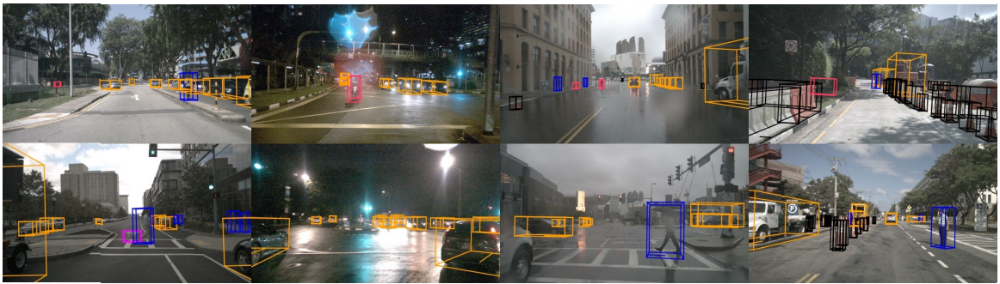
*図2.nuScenesデータセットに含まれる環境の例。晴天時（列1）、夜間（列2）、雨天時（列3）、および建設現場（列4）で収集されたフロントカメラの画像。*

### 1.1. Contributions

マルチモーダル3D検出の課題の複雑さと、現在の自動運転（AV）データセットの限界から、全ての視覚および距離センサーにわたる360°のカバレッジを持つ大規模なマルチモーダルデータセットは、地図情報とともに多様な状況から収集され、AVシーン理解の研究をさらに促進するでしょう。nuScenesはまさにそれを実現しており、これが本研究の主な貢献です。nuScenesは、データ量と複雑さの点で大きな飛躍を遂げており（表1）、全センサーセットからの360°のセンサーカバレッジを提供する最初のデータセットです。また、公道での使用が承認されたAVを使用してキャプチャされた最初のAVデータセットであり、レーダーデータを含んでいます。さらに、夜間および雨天時のデータを含み、オブジェクトクラスと位置に加えてオブジェクト属性とシーンの説明を含む最初のマルチモーダルデータセットです。 [^84]と同様に、nuScenesはAVのための包括的なシーン理解ベンチマークです。さまざまな条件下でのオブジェクト検出、追跡、行動モデリングなどの複数のタスクに関する研究を可能にします。

私たちの2番目の貢献は、自動運転（AV）アプリケーションを対象とした新しい検出および追跡指標です。3Dオブジェクト検出器と追跡器をベースラインとして訓練し、複数のLidarスイープを使用してオブジェクト検出を強化する新しいアプローチを含めています。また、nuScenesオブジェクト検出および追跡チャレンジの結果を提示し、分析します。

3番目に、業界全体での標準化のために、開発キット、評価コード、分類法、アノテーターの指示、およびデータベーススキーマを公開します。最近、Lyft L5[^45]データセットは、異なるデータセット間の互換性を実現するためにこの形式を採用しました。nuScenesデータはCC BY-NC-SA 4.0ライセンスの下で公開されており、誰でも非商用研究目的でこのデータセットを使用できます。すべてのデータ、コード、および情報はオンラインで公開されています[^3]。

リリース以来、nuScenesはAVコミュニティから強い関心を集めています [^90], [^70], [^50], [^91], [^9], [^5], [^68], [^28], [^49], [^86], [^89]。いくつかの研究では、自然言語オブジェクト参照 [^22] と高レベルのシーン理解 [^74] のための新しいアノテーションを導入するために私たちのデータセットを拡張しました。検出チャレンジにより、Lidarベースおよびカメラベースの検出研究 [^90], [^70] が可能になり、初期リリース時の最先端技術 [^51], [^69] をそれぞれ40％および81％改善しました（表4）。nuScenesは、3Dオブジェクト検出 [^83], [^60]、マルチエージェント予測 [^9], [^68]、歩行者ローカリゼーション [^5]、天気の強化 [^37]、および移動点群予測 [^27] に使用されています。依然としてレーダーデータを提供する唯一のアノテーション付きAVデータセットであるnuScenesは、研究者がレーダーとセンサー融合をオブジェクト検出に活用することを促しています [^27], [^42], [^72]。

### 1.2. 関連するデータセット

過去10年間に、自動運転車（AV）のシーン理解研究において大きな役割を果たすいくつかの運転データセットが公開されてきました。ほとんどのデータセットは、RGBカメラ画像の2Dアノテーション（ボックス、マスク）に焦点を当てています。CamVid[^8]、Cityscapes[^19]、Mapillary Vistas[^33]、D2-City[^11]、BDD100k[^85]、ApolloScape[^41]は、セグメンテーションマスクを含むデータセットを次々と公開してきました。Vistas、D2-City、BDD100kには、さまざまな天候や照明条件で撮影された画像も含まれています。他のデータセットは、画像上の歩行者アノテーションに特化しています [^20], [^25], [^79], [^24], [^88], [^23], [^58]。RGB画像のキャプチャとアノテーションの容易さにより、これらの大規模な画像のみのデータセットの公開が可能になりました。

一方、通常、画像、距離センサーデータ（Lidar、レーダー）、GPS/IMUデータで構成されるマルチモーダルデータセットは、複数のセンサーの統合、同期、キャリブレーションの困難さにより、収集とアノテーションに費用がかかります。KITTI[^32]は、Lidarセンサーからの高密度の点群と、フロントカメラのステレオ画像およびGPS/IMUデータを提供する先駆的なマルチモーダルデータセットです。22のシーンにわたって20万個の3Dボックスを提供し、3Dオブジェクト検出の最先端技術の進歩に貢献しました。最近のH3Dデータセット[^61]は、1.1M個の3Dボックスが27kフレームにわたってアノテーションされた160の混雑したシーンを含んでいます。KITTIとは異なり、オブジェクトは正面視野に存在する場合にのみアノテーションされるのではなく、全360°の視野でアノテーションされています。KAISTマルチスペクトルデータセット[^17]は、RGBおよびサーマルカメラ、RGBステレオ、3D Lidar、GPS/IMUで構成されるマルチモーダルデータセットです。夜間データを提供していますが、データセットのサイズは限られており、アノテーションは2Dです。その他の注目すべきマルチモーダルデータセットには、運転行動ラベルを提供する [^15]、場所のカテゴリラベルを提供する [^43]、およびセマンティックラベルのない生データを提供する [^6], [^55] などがあります。

nuScenesの初期リリース後、 [^76], [^10], [^62], [^34], [^45] が独自の大規模AVデータセットを公開しました（表1）。これらのデータセットの中で、Waymo Openデータセット[^76]のみが、アノテーション頻度が高い（10Hz対2Hz）ため、より多くのアノテーションを提供しています。A*3Dは、55時間のデータから39kフレームを選択してアノテーションする別のアプローチを採用しています。Lyft L5データセット[^45]はnuScenesと最も似ています。nuScenesデータベーススキーマを使用してリリースされたため、nuScenes開発キットを使用して解析できます。

## 2. nuScenesデータセット

ここでは、どのようにドライブを計画し、車両を設定し、興味深いシーンを選択し、データセットにアノテーションを付け、第三者のプライバシーを保護するかについて説明します。

### 運転環境

私たちは、交通量が多く、運転状況が非常に困難なことで知られるボストン（SeaportとSouth Boston）とシンガポール（One North、Holland Village、Queenstown）の2つの都市で運転します。植生、建物、車両、道路標示、右側通行と左側通行の違いなど、場所ごとの多様性を重視しています。膨大なトレーニングデータから、手動で84件のログ（平均時速16kmで242kmを走行した15時間の運転データ）を選択します。運転ルートは、さまざまな場所（都市部、住宅地、自然、工業地帯）、時間帯（昼と夜）、天候（晴れ、雨、曇り）を網羅するように慎重に選択されています。

### 車両の設定

ボストンとシンガポールで運転するために、同一のセンサー配置を持つ2台のルノー・ズーイー・スーパーミニ電気自動車を使用します。センサーの配置については図4を、センサーの詳細については表2を参照してください。フロントカメラとサイドカメラの視野角（FOV）は70°で、55°ずつオフセットしています。リアカメラのFOVは110°です。

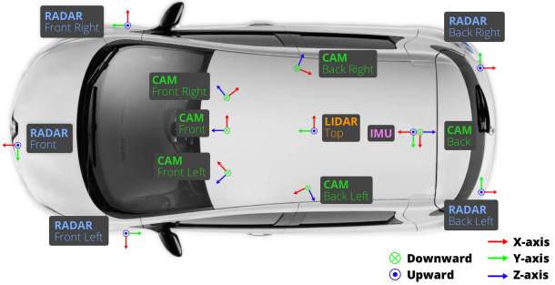
*図4.nuScenesデータ取得車両のセンサ構成。*

| Sensor | Details |
| --- | --- |
| 6x Camera | RGB, 12Hz capture frequency, 1/1.8” CMOS sensor, 1600 × 900 resolution, auto exposure, JPEG compressed |
| 1x Lidar | Spinning, 32 beams, 20Hz capture frequency, 360° horizontal FOV, −30° to 10° vertical FOV, ≤ 70m range, ±2cm accuracy, up to 1.4M points per second |
| 5x Radar | ≤ 250m range, 77GHz, FMCW, 13Hz capture frequency, ±0.1km/h vel. accuracy |
| GPS & IMU | GPS, IMU, AHRS. 0.2° heading, 0.1° roll/pitch, 20mm RTK positioning, 1000Hz update rate |

### センサーの同期

Lidarとカメラ間のクロスモダリティデータの位置合わせを良好にするために、カメラの露光はトップLidarがカメラのFOVの中心を横切ってスイープするときにトリガーされます。画像のタイムスタンプは露光トリガーの時間であり、Lidarスキャンのタイムスタンプは現在のLidarフレームの完全な回転が達成されたときの時間です。カメラの露光時間はほぼ瞬時であるため、この方法は一般的に良好なデータの位置合わせをもたらします[^5]。以下に説明する位置特定アルゴリズムを使用して、モーション補償を実行します。

### 位置特定

既存のデータセットのほとんどは、GPSとIMUに基づいて車両の位置を提供しています [^32], [^41], [^19], [^61]。このような位置特定システムは、KITTIデータセット [^32], [^7] で見られるように、GPSの停止に対して脆弱です。私たちは密集した都市部で運用しているため、この問題はさらに深刻です。車両を正確に位置特定するために、オフラインステップでLidar点の詳細な高精細（HD）マップを作成します。データ収集中に、Lidarとオドメトリー情報からのモンテカルロ位置特定スキームを使用します [^18]。この方法は非常に堅牢で、位置特定誤差は10cm以下を達成します。ロボット工学の研究を促進するために、 [^65] と同様に、生のCANバスデータ（速度、加速度、トルク、ステアリング角、ホイール速度など）も提供します。

### マップ

関連するエリアの高精度な人手によるセマンティックマップを提供しています。元のラスタ化されたマップは、解像度10ピクセル/メートルで道路と歩道のみを含んでいます。ベクトル化されたマップの拡張により、図3に示すように、11のセマンティッククラスに関する情報が提供され、元のリリース以降に公開された他のデータセットのセマンティックマップ [^10], [^45] よりも豊富になっています。すべてのタスクの強い事前知識として、位置特定とセマンティックマップの使用を推奨しています。

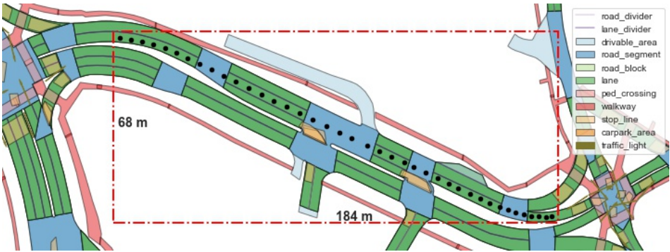
*図3.nuScenesのセマンティックマップ。11のセマンティックレイヤーが異なる色で表示されています。自車の経路を示すために、scene-0121の各キーフレームの自車の姿勢を黒い球体でプロットしています。*

最後に、障害物がないと仮定した場合に自動運転車が辿るべき理想的な経路であるベースラインバルートを提供します。このルートは、実行可能なルートの探索空間を減らすことで問題を単純化するため、軌道予測 [^68] に役立つ可能性があります。

### シーンの選択

未処理のセンサーデータを収集した後、20秒ずつの1000の興味深いシーンを手動で選択します。このようなシーンには、交通量が多い状況（例：交差点、建設現場）、まれなクラス（例：救急車、動物）、潜在的に危険な交通状況（例：歩行者が横断、誤った行動）、マニューバ（例：車線変更、右折、停止）など、自動運転車にとって困難な状況が含まれます。また、空間的なカバレッジ、異なるシーンタイプ、さまざまな天候や照明条件の多様性を促進するために、いくつかのシーンを選択します。専門のアノテーターが、各シーンのテキストによる説明またはキャプションを記述します（例：「交差点で待機中、歩道上の歩行者、自転車の横断、歩行者が横断、右折、駐車中の車、雨」）。

### データのアノテーション

シーンを選択した後、2Hzでキーフレーム（画像、Lidar、レーダー）をサンプリングします。23のオブジェクトクラスのそれぞれを、すべてのキーフレームで、セマンティックカテゴリ、属性（可視性、アクティビティ、ポーズ）、x、y、z、幅、長さ、高さ、ヨー角でモデル化された直方体でアノテーションします。少なくとも1つのLidarまたはレーダーポイントでカバーされている場合、シーン全体でオブジェクトを連続的にアノテーションします。専門のアノテーターと複数の検証ステップを使用することで、高精度なアノテーションを実現しています。また、セクション4.2で示すように、追跡、予測、オブジェクト検出に重要な中間センサーフレームも公開しています。カメラ、レーダー、Lidarのキャプチャ周波数がそれぞれ12Hz、13Hz、20Hzであるため、当社のデータセットはユニークです。Waymo Openデータセットのみが、同様の高いキャプチャ周波数である10Hzを提供しています。

### アノテーションの統計

私たちのデータセットには、さまざまな車両、歩行者の種類、移動手段、その他のオブジェクトを含む23のカテゴリがあります（図8-SM）。さまざまなクラスのジオメトリと頻度の統計を示します（図9-SM）。キーフレームごとに、平均して7人の歩行者と20台の車両があります。さらに、4つの異なるシーンの場所（ボストン：55％、SG-OneNorth：21.5％、SG-Queenstown：13.5％、SG-HollandVillage：10％）から40,000のキーフレームが取得され、さまざまな天候と照明条件（雨：19.4％、夜：11.6％）が含まれています。nuScenesの細かいクラス分類により、データセットはクラス間の大きな不均衡を示し、最も少ないクラスと最も一般的なクラスのアノテーションの比率は1：10,000です（KITTIでは1：36）。これは、コミュニティがこのロングテール問題をより深く探求することを促します。図5は、すべてのシーンにわたる空間的なカバレッジを示しています。ほとんどのデータが交差点から取得されていることがわかります。図10-ＳＭは、車のアノテーションがさまざまな距離で表示され、自車から最大80m離れていることを示しています。ボックスの向きもさまざまで、駐車中の車や同じ車線内の車があるため、車については垂直角と水平角の数が最も多いと予想されます。各ボックスアノテーション内のLidarとレーダーポイントの統計は、図14-SMに示されています。アノテーションされたオブジェクトは、半径距離80mでも最大100個のLidar点を含み、3mでは最大12,000個のLidar点を含みます。同時に、10mでは最大40個のレーダー反射が含まれ、50mでは10個のレーダー反射が含まれます。レーダーの範囲は最大200mで、Lidarの範囲をはるかに超えています。

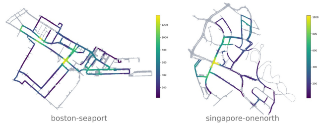
*図5.2つのnuScenesデータ取得場所における空間的なデータカバレッジ。色は、すべてのシーンにわたって100mの半径内に自車の姿勢を持つキーフレームの数を示しています。*

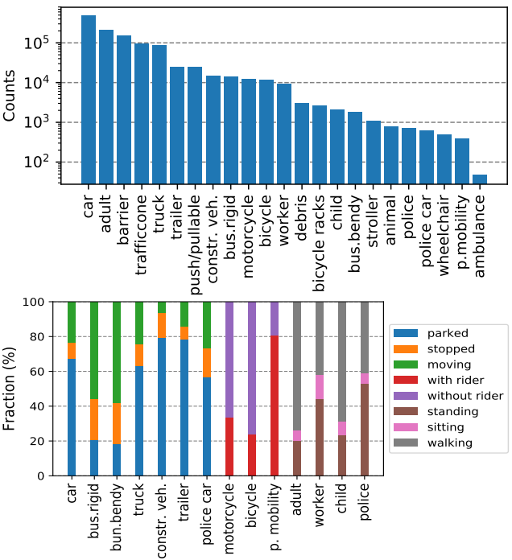
*図8.上：カテゴリごとのアノテーションの数。下：選択されたカテゴリの属性分布。私たちのデータセットでは、車と成人が最も頻繁なカテゴリであり、救急車が最も少ないカテゴリです。属性のプロットでも、いくつかの予想されるパターンが示されています。すなわち、建設車両はほとんど動いていない、歩行者はほとんど座っていない、一方バスは頻繁に動いている、などです。*

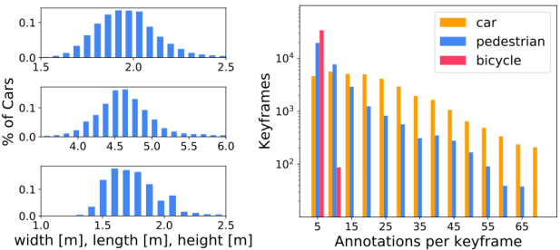
*図9. 左：車のバウンディングボックスのサイズ分布。右：各キーフレームにおける車、歩行者、自転車のカテゴリ数。*

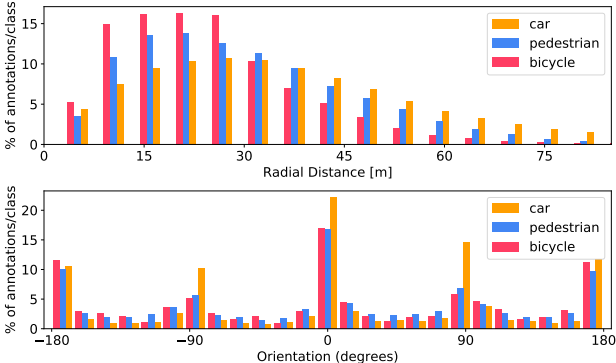
*図10.上：自車から物体までの半径距離。下：ボックス座標系におけるボックスの向き。*

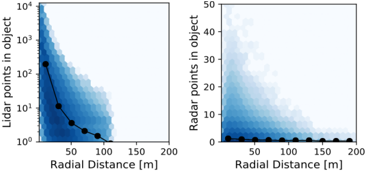
*図14.ボックスアノテーション内のLidarおよびRadarポイントの数の六角形ビン対数スケール密度プロット。黒線は、ego-vehicleからの所定の距離における平均ポイント数を示しています。*

## 3. タスクとメトリクス

nuScenesのマルチモーダルな性質は、検出、追跡、予測、位置特定など、多数のタスクをサポートします。ここでは、検出と追跡のタスクとメトリクスについて説明します。検出タスクは、時刻tのオブジェクトに対して、 $[t - 0.5, t]$ 秒間のセンサーデータのみを使用して動作するように定義します。一方、追跡タスクは、 $[0, t]$ の間のデータで動作します。

### 3.1. 検出

nuScenesの検出タスクでは、3Dバウンディングボックス、属性（例：座っているか立っているか）、速度を使用して10個のオブジェクトクラスを検出する必要があります。10個のクラスは、nuScenesでアノテーションされた23個のクラスのサブセットです（表5-SM）。

#### Average Precision（AP）

一般的な評価指標としてAverage Precision（AP）メトリック [^32], [^26] を使用しますが、2D中心距離dを地面上で閾値処理することで一致を定義します。これは、検出をオブジェクトのサイズと向きから切り離すため、および、小さな歩行者や自転車などの小さなオブジェクトが、わずかな並進誤差で検出された場合にIOUが0になるためです（図7）。これは、位置特定誤差が大きい視覚のみの方法 [^69] の性能を比較することを困難にします。次に、再現率と精度が10％を超える精度再現率曲線の下の正規化された面積としてAPを計算します。再現率または精度が10％未満の操作点は、低い精度と再現率の領域で一般的に見られるノイズの影響を最小限に抑えるために削除されます。この領域で操作点が達成されない場合、そのクラスのAPは0に設定されます。次に、一致閾値 $D = {0.5, 1, 2, 4}$ メートルとクラスCのセットにわたって平均化します。

```math
mAP = \frac{1}{|C||D|} \sum_{c∈C} \sum_{d∈D} AP_{c,d} \tag{1}
```

#### True Positive（TP）

APに加えて、各予測に対して、グラウンドトゥルースボックスと一致したTrue Positiveメトリクス（TPメトリクス）を測定します。すべてのTPメトリクスは、一致中にd = 2mの中心距離を使用して計算され、すべて正のスカラーとして設計されています。提案されたメトリクスでは、TPメトリクスはすべてネイティブ単位（以下を参照）であり、結果を簡単に解釈および比較できます。マッチングとスコアリングはクラスごとに独立して行われ、各メトリクスは10％を超える再現率レベルでの累積平均の平均です。特定のクラスで10％の再現率が達成されない場合、そのクラスに対するすべてのTPエラーは1に設定されます。次のTPエラーが定義されています。

- 平均並進誤差（ATE）は、2Dでのユークリッド中心距離（単位：メートル）です。
- 平均スケール誤差（ASE）は、向きと並進を揃えた後の3DのIntersection over Union（IOU）です（1 - IOU）。
- 平均方向誤差（AOE）は、予測とグラウンドトゥルースの間の最小のヨー角差（ラジアン）です。バリア以外のすべての角度は、360°の周期で測定されますが、バリアの場合は180°の周期で測定されます。
- 平均速度誤差（AVE）は、2Dでの速度差のL2ノルムとしての絶対速度誤差（m/s）です。
- 平均属性誤差（AAE）は、属性分類精度の1からの引き算（1 - 精度）として定義されます。

各TPメトリクスに対して、すべてのクラスにわたって平均TPメトリクス（mTP）を計算します。

```math
mTP = \frac{1}{|C|} \sum_{c∈C} TP_c \tag{2}
```

これらのメトリクスが適切に定義されていないクラスについては測定を省略します。具体的には、コーンとバリアについてはAVEを省略します（静止しているため）。コーンについてはAOEを省略します（明確な向きがないため）。コーンとバリアについてはAAEを省略します（これらのクラスには属性が定義されていないため）。

#### nuScenes検出スコア

IOUの閾値を持つmAPは、オブジェクト検出のための最も一般的な指標である[^32], [^19], [^21]。しかし、この指標はnuScenes検出タスクの速度や属性推定などのすべての側面を捉えることはできない。さらに、位置、サイズ、方向の推定を結合する。ApolloScape[^41]の3D車両インスタンスチャレンジでは、各誤差タイプとリコール閾値を定義することでこれらを切り離している。これにより、10×3の閾値となり、このアプローチは複雑で恣意的で直感的ではない。我々は代わりに、異なる誤差タイプをスカラースコアに統合することを提案する：nuScenes検出スコア（NDS）。

```math
NDS = \frac{1}{10} [5 mAP + \sum_{mTP\in TP} (1 - \min(1, mTP))] \tag{3}
```

ここで、 $mAP$ は平均精度（1）、 $TP$ は5つの平均真陽性指標（2）の集合である。NDSの半分は検出性能に基づき、残りの半分はボックスの位置、サイズ、方向、属性、速度の品質を定量化する。 $mAVE$ 、 $mAOE$ 、 $mATE$ は1より大きくなる可能性があるため、(3)では各指標を0と1の間で制限する。

### 3.2. トラッキング

本節では、トラッキングタスクの設定と指標について述べる。トラッキングタスクの焦点は、シーンチェンジにおける全ての検出されたオブジェクトを追跡することである。3.1節で定義された全ての検出クラスが使用されるが、静的クラスであるバリア、工事車両、交通コーンは除かれる。

#### AMOTAおよびAMOTP

WengとKitani[^77]は、KITTI[^32]における3D MOTベンチマークと同様のものを提案した。彼らは、従来の指標では予測の信頼度を考慮していないことを指摘している。したがって、Average Multi Object Tracking Accuracy（AMOTA）とAverage Multi Object Tracking Precision（AMOTP）を開発し、MOTAとMOTPを全てのリコール閾値で平均化している。KITTIとnuScenesのリーダーボードを検出とトラッキングで比較すると、nuScenesは大幅に難しいことがわかる。nuScenesの難しさのため、従来のMOTA指標はしばしばゼロとなる。新たな指標 $sMOTA_r$ [^77]では、MOTAはそれぞれのリコールに対して調整するための項によって増強される。

```math
sMOTA_r = \max\bigg(0, 1 - \frac{IDS_r + FP_r + FN_r - (1-r)P}{rP}\bigg)
```

これは、 $sMOTA_r$ の値が全ての $[0, 1]$ 範囲に渡ることを保証するためである。我々は、リコール範囲 $[0.1, 1]$ （リコール値はRと表記される）で40点の補間を行う。結果として得られる $sAMOTA$ 指標は、トラッキングタスクの主要指標である。

```math
sAMOTA = \frac{1}{|R|} \sum_{r\in R} sMOTA_r
```

### 従来の指標

我々は、MOTAやMOTP[^4]、フレームあたりの誤警報、主に追跡された軌跡、主に失われた軌跡、偽陽性、偽陰性、アイデンティティスイッチ、トラック断片化などの従来のトラッキング指標も使用する。[^77]と同様に、我々は全てのリコール閾値を試し、最高の $sMOTA_r$ を達成する閾値を使用する。

### TIDおよびLGD

さらに、我々は2つの新しい指標を考案した：トラック初期化時間（TID）と最長ギャップ時間（LGD）である。一部のトラッカーは、過去のセンサ読み取りの固定ウィンドウを必要とするか、または良好な初期化なしでは性能が低下する。TIDは、トラック開始からオブジェクトが最初に検出されるまでの時間を測定する。LGDは、トラック内の検出ギャップの最長時間を計算する。オブジェクトが追跡されない場合、トラック全体の持続時間をTIDおよびLGDとして割り当てる。両方の指標について、全トラックの平均を計算する。これらの指標は、自動運転車（AV）に関連している。なぜなら、多くの短期間のトラック断片化は、オブジェクトを見逃すことよりも許容される可能性があるためである。数秒間オブジェクトを見逃すことはより深刻な問題となるからだ。

## 4. 実験

本節では、nuScenesデータセットにおけるオブジェクト検出と追跡の実験を行い、その特性を分析し、将来の研究の方向性を提案する。

### 4.1. ベースライン

我々は、検出と追跡のための異なるモダリティを持つ複数のベースラインを提示する。

#### LiDAR検出ベースライン

nuScenesにおける主要アルゴリズムの性能を示すために、LiDARのみの3Dオブジェクト検出器であるPointPillars[^51]を訓練する。我々は、nuScenesで利用可能な時間データを利用して、LiDARスイープを蓄積し、より豊かな点群として入力する。すべてのクラスに対して単一のネットワークを訓練した。ネットワークは、各3Dボックスの追加回帰ターゲットとして速度も学習するように変更された。ボックス属性は、訓練データの各クラスの最も一般的な属性に設定された。

#### 画像検出ベースライン

画像のみの3Dオブジェクト検出を調べるために、Orthographic Feature Transform（OFT）[^69]メソッドを再実装する。すべてのクラスに対して単一のOFTネットワークを使用した。元のOFTを変更してSSD検出ヘッドを使用し、KITTIでの公表された結果と一致することを確認した。ネットワークは、1つの画像から入力を受け取り、6つのカメラからの全360°予測を非最大抑制（NMS）を使用して結合する。ボックスの速度はゼロに設定され、属性は訓練データの各クラスの最も一般的な属性に設定された。

#### 検出チャレンジ結果

2019年のnuScenes検出チャレンジの最上位の提出結果を比較します。すべての提出の中で、Megvii [^90]が最高のパフォーマンスを示しました。これは、疎な3D畳み込みを持つ、クラスバランスのとれたマルチヘッドネットワークです。画像のみの提出の中で、MonoDIS [^70]が最高であり、画像ベースラインや一部のレーザーレーダーベースの手法を大きく上回りました。これは、新しい2Dと3D検出損失の非絡み合いを使用しています。上位の手法はすべて、重要度サンプリングを実行しており、クラス不均衡問題への対処の重要性を示しています。

#### 追跡ベースライン

複数の追跡ベースラインを、カメラおよびレーザーレーダーデータから提示します。検出チャレンジから、最高のパフォーマンスを示したレーザーレーダー手法（Megvii [^90]）、推論時の最速の報告手法（PointPillars [^51]）、および最高のパフォーマンスを示したカメラ手法（MonoDIS [^70]）を選択します。各手法からの検出を使用して、WengとKitani [^77]で説明されている追跡アプローチを使用してベースラインを設定します。これらの手法のそれぞれについて、train、val、test分割の検出および追跡結果を提供して、より体系的な研究を促進します。2019年のnuScenes追跡チャレンジの結果については、補足資料を参照してください。

### 4.2. 分析

ここでは、セクション4.1で提示された手法の特性、およびデータセットとマッチング関数を分析します。

#### 大規模なベンチマークデータセットの必要性

nuScenesの貢献の1つはデータセットのサイズであり、特にKITTI（表1）と比較した場合の増加です。ここでは、より大きなデータセットサイズの利点を調べます。PointPillars [^51]、OFT [^69]、および追加の画像ベースラインであるSSD+3Dを、さまざまな量のトレーニングデータでトレーニングします。SSD+3Dは、MonoDIS [^70]と同じ3Dパラメータ化を持ちますが、単一ステージ設計 [^53] を使用します。このアブレーション研究では、トレーニング時間を短縮するために、PointPillarsを6倍少ないエポック数でトレーニングし、1サイクルのオプティマイザスケジュール [^71] を使用します。主な発見は、データ量に応じてメソッドの順序が変化することです（図6）。特に、PointPillarsは、KITTIと同等のデータ量ではSSD+3Dと同様のパフォーマンスを示しますが、より多くのデータを使用すると、PointPillarsの方が優れていることが明らかです。これは、複雑なアルゴリズムの完全な潜在能力は、より大きくより多様なトレーニングセットでのみ検証できることを示唆しています。同様の結論が [^56], [^59] によって到達されており、 [^59] は、KITTIのリーダーボードは実際のアルゴリズムではなく、データ拡張メソッドを反映していることを示唆しています。

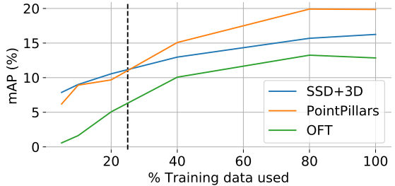
*図6.トレーニングデータ量 vs. nuScenesのvalセットにおける平均平均精度（mAP）。黒の破線は、KITTI [^32]のトレーニングデータ量に対応しています。*

#### マッチング関数の重要性

KITTIで使用されているIOUマッチングと、提案されている2mの中心距離マッチングを使用した場合の、公開されている手法（表4）のパフォーマンスを比較します。予想どおり、IOUマッチングを使用すると、歩行者や自転車などの小さな物体は0 APを超えることができず、順序付けが不可能になります（図7）。対照的に、中心距離マッチングでは、MonoDISが明確な勝者となります。車のクラスでは影響は小さくなりますが、この場合もMonoDISとOFTの差を解決するのは困難です。

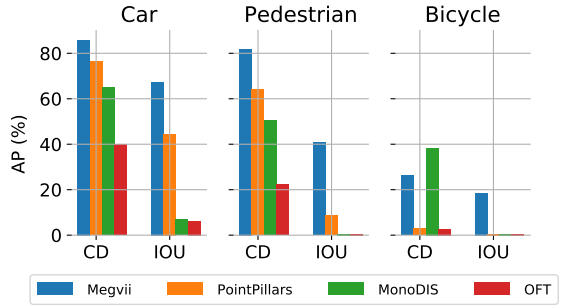
*図7.APとBoxのマッチング方法の関係。CD: センター距離。IOU: インタセクションオーバーユニオン。KITTI [^32] に従って、車に対してIOU = 0.7、歩行者と自転車に対してIOU = 0.5を使用します。セクション3.1のTPメトリクスではCD = 2mを使用します。*

マッチング関数は、レーザーレーダーと画像ベースの手法のバランスも変化させます。実際、中心距離マッチングを使用すると、自転車のクラスでは、両方のレーザーレーダーベースの手法よりもMonoDISを優先するように順序が切り替わります（図7）。自転車の薄い構造により、レーザーレーダーでの検出が困難になるため、これは理にかなっています。したがって、中心距離マッチングは、レーザーレーダーベースの手法とともに画像ベースの手法をランク付けするのに適していると結論付けられます。

#### 複数のレーザーレーダースイープによるパフォーマンス向上

評価プロトコル（セクション3.1）によれば、検出判断を行うために使用できる以前のデータは0.5秒までです。これは、レーザーレーダーが20Hzでサンプリングされるため、10個の以前のレーザーレーダースイープに相当します。PointPillarsベースラインに複数のポイントクラウドを組み込む簡単な方法を考案し、パフォーマンスへの影響を調査します。蓄積は、すべてのポイントクラウドをキーフレームの座標系に移動し、各ポイントにキーフレームからの時間差（秒単位）を示すスカラー時間スタンプを付加することで実装されます。エンコーダーは、時間差をレーザーレーダーポイントの追加のデコレータとして含めます。より豊富なポイントクラウドの利点に加えて、これにより、時間情報も提供され、ネットワークのローカリゼーションに役立ち、速度予測が可能になります。1、5、10回のレーザーレーダースイープを使用した実験の結果、検出と速度推定の両方が、レーザーレーダースイープの数の増加とともに改善されることが示されましたが、収益率は逓減していました（表3）。

| レーザーレーダースイープ | 事前学習 | NDS (%) | mAP (%) | mAVE (m/s) |
| --- | --- | --- | --- | --- |
| 1 | KITTI | 31.8 | 21.9 | 1.21 |
| 5 | KITTI | 42.9 | 27.7 | 0.34 |
| 10 | KITTI | 44.8 | 28.8 | 0.30 |
| 10 | ImageNet | 44.9 | 28.9 | 0.31 |
| 10 | なし | 44.2 | 27.6 | 0.33 |

*表3. PointPillars [^51]の検証セットにおける検出性能。より多くのLiDARスイープを使用することで、性能が大幅に向上し、ImageNetを使用した事前学習がKITTIと同等の性能であることがわかる。*

#### どのセンサーが最も重要か？

自動運転車（AV）にとって、最高の検出性能を達成するために必要なセンサーはどれかというのは重要な問題である。ここでは、主要なLiDARと画像検出器の性能を比較する。これらのモダリティに焦点を当てるのは、文献に競争力のあるレーダーのみの手法が存在せず、PointPillarsをレーダーデータで使用した予備研究でも有望な結果が得られなかったためである。高速で軽量なLiDAR検出器であるPointPillarsと、最先端の画像検出器であるMonoDISを比較する（表4）。2つの手法は、類似のmAP（30.5% vs. 30.4%）を達成したが、PointPillarsはより高いNDS（45.3% vs. 38.4%）を達成した。近年の単眼視覚からの3D推定の利点を考えると、mAPが近いことは注目に値する。しかし、前述のように、IOUベースのマッチング関数を使用すると、差はより大きくなるだろう。

クラスごとの性能は、表7-SMに記載されている。PointPillarsは、最も一般的な2つのクラス、車（68.4% vs. 47.8% AP）と歩行者（59.7% vs. 37.0% AP）でより強力であった。一方、MonoDISは、自転車（24.5% vs. 1.1% AP）やコーン（48.7% vs. 30.8% AP）などの小規模なクラスでより強力であった。これは、1）自転車は薄い物体であり、通常LiDARの反射が少ない、2）交通コーンは画像では検出しやすいが、LiDARの点群では小さくて見落とされやすい、3）MonoDISは、希少クラスを強化するために、トレーニング中に重要度サンプリングを適用した、などの理由による。検出性能は似ているにもかかわらず、NDSがMonoDISで低かったのはなぜだろうか？主な理由は、平均並進誤差（52cm vs. 74cm）と速度誤差（1.55m/s vs. 0.32m/s）であり、どちらも予想通りである。MonoDISは、平均IOUが74% vs. 71%と、スケール誤差も大きかったが、差は小さく、画像のみの手法が外観からサイズを推測する能力が高いことを示唆している。

| Method | NDS (%) | mAP (%) | mATE (m) | mASE (1-iou) | mAOE (rad) | mAVE (m/s) | mAAE (1-acc) |
| --- | --- | --- | --- | --- | --- | --- | --- |
| OFT [^69]† | 21.2 | 12.6 | 0.82 | 0.36 | 0.85 | 1.73 | 0.48 |
| SSD+3D† | 26.8 | 16.4 | 0.90 | 0.33 | 0.62 | 1.31 | 0.29 |
| MDIS [^70]† | 38.4 | 30.4 | 0.74 | 0.26 | 0.55 | 1.55 | 0.13 |
| PP [^51] | 45.3 | 30.5 | 0.52 | 0.29 | 0.50 | 0.32 | 0.37 |
| Megvii [^90] | 63.3 | 52.8 | 0.30 | 0.25 | 0.38 | 0.25 | 0.14 |

*表4. nuScenesのテストセットにおける物体検出結果。PointPillars、OFT、SSD+3Dは本論文で提供されるベースラインであり、他の手法はnuScenes検出チャレンジのリーダーボードにおけるトップの提出手法である。 (†) は単眼カメラ画像のみを入力として使用する。他の手法は全てLiDARを使用する。PP: PointPillars、MDIS: MonoDIS。*

#### 事前学習の重要性

LiDARベースラインを使用して、nuScenesで検出器をトレーニングする際の事前学習の重要性を調べる。事前学習なしとは、[^38]のように一様分布を使用して重みをランダムに初期化することを意味する。ImageNet [^21]の事前学習[^47]では、バックボーンは最初に画像を正確に分類するようにトレーニングされている。KITTI [^32]の事前学習では、バックボーンはLiDARの点群で3Dボックスを予測するようにトレーニングされている。興味深いことに、KITTIで事前学習されたネットワークはより早く収束したが、ネットワークの最終的な性能は、異なる事前学習間でわずかにしか変化しなかった（表3）。1つの説明として、KITTIはドメインが近いものの、サイズが十分ではない可能性がある。

#### 検出性能の向上は追跡性能の向上につながる

WengとKitani [^77] は、KITTIで強力な検出結果を用いて最先端の3D追跡結果を達成するシンプルなベースラインを提示した。ここでは、第4.1節で提示した画像とLiDARのベースラインを用いて、nuScenesでの検出性能の向上が追跡性能の向上を意味するかどうかを分析する。Megvii、PointPillars、MonoDISは、検証セットでそれぞれ17.9％、3.5％、4.5％のsAMOTAと、1.50m、1.69m、1.79mのAMOTPを達成した。表4のmAPとNDSの検出結果と比較すると、ランキングは類似している。ほとんどの指標で性能は相関しているが、MonoDISは最も短いLGDと最も多いトラック断片化数を示している。これは、性能は低いものの、画像ベースの手法は物体を見失う期間が短いことを示唆している可能性がある。

## 5. 結論

本論文では、nuScenesデータセット、検出および追跡タスク、評価指標、ベースライン、および結果を紹介する。これは、公道でのテストが承認された自動運転車（AV）から収集された最初のデータセットであり、360°の全方向をカバーするセンサスイート（LiDAR、画像、レーダー）を備えている。nuScenesは、これまでに公開されたデータセットの中で最大の3Dボックスアノテーションのコレクションを有している。AVのための3D物体検出に関する研究を促進するために、検出性能のすべての側面のバランスをとる新しい検出指標を導入した。nuScenes上で、最先端のLiDARおよび画像物体検出器と追跡器の新しい適応を示す。将来の作業では、画像レベルおよびポイントレベルの意味ラベルを追加し、軌道予測のためのベンチマークを実施する予定である[^63]。

## 謝辞

nuScenesデータセットはScale.aiによってアノテートされ、Alexandr WangとDave Morseの支援に感謝する。また、nuTonomyのSun Li、Serene Chen、Karen Ngoにはデータの検査と品質管理を、Bassam HelouとThomas RoddickにはOFTベースラインの結果を、Sergi WidjajaとKiwoo Shinにはチュートリアルを、EvalAIのDeshraj YadavとRishabh JainにはnuScenesチャレンジの準備をしていただき、感謝している。

## Appendix

### A.nuScenesデータセット

このセクションでは、nuScenesデータセット、センサー較正、プライバシー保護アプローチ、データ形式、クラスマッピング、およびアノテーション統計に関する詳細情報を提供します。

#### センサー較正

高品質のマルチセンサーデータセットを実現するには、センサーの固有および外在パラメータの慎重な較正が必要です。これらの較正パラメータは、6か月にわたるデータ収集期間中に週に約2回更新されます。ここでは、データ収集プラットフォームのセンサー較正を実行して、高品質のマルチモーダルデータセットを実現する方法について説明します。具体的には、すべてのセンサーの外在パラメータと固有パラメータを慎重に較正します。各センサーの外在座標は、egoフレーム（後車軸の中点）を基準として表します。以下に、最も関連性の高いステップを示します。

- **Lidar外在パラメータ**: レーザーライナーを使用して、Lidarのegoフレームに対する相対位置を正確に測定します。
- **カメラ外在パラメータ**: カメラとLidarセンサーの前に立方体形状の較正ターゲットを配置します。較正ターゲットは、既知のパターンを持つ3つの直交平面で構成されています。パターンを検出した後、較正ターゲットの平面を揃えることで、カメラからLidarへの変換行列を計算します。上記で計算したLidarからegoフレームへの変換を考慮して、カメラからegoフレームへの変換を計算します。
- **レーダー外在パラメータ**: レーダーを水平位置に取り付けます。次に、公共の道路を走行してレーダー測定値を収集します。移動物体のレーダー反射をフィルタリングした後、総当たりアプローチを使用して、静止物体の補正範囲率を最小化するようにヨー角を較正します。
- **カメラ内在較正**: 既知のパターンのセットを持つ較正ターゲットボードを使用して、カメラの内在パラメータと歪みパラメータを推測します。

#### プライバシー保護

第三者のプライバシーを保護することが最優先事項です。140万枚の画像に対して手動で顔とナンバープレートにラベルを付けることは非常にコストがかかるため、最先端の物体検出技術を使用します。具体的には、ナンバープレートの検出には、Cityscapes[^19]で学習したResNet-101[^39]バックボーンを持つFaster R-CNN[^67]を使用します。顔検出には、[^87]を使用します。分類閾値を極めて高い再現率を達成するように設定します（[^31]と同様）。既知の歩行者と車両のボックスの再投影と重なる予測を削除することで精度を向上させます。最終的に、予測されたボックスを使用して画像内の顔とナンバープレートをぼかします。

#### データ形式

ほとんどの既存のデータセット[^32], [^61], [^41]とは異なり、アノテーションとメタデータ（例：ローカリゼーション、タイムスタンプ、較正データ）をリレーショナルデータベースに存储します。これにより、冗長性がなくなり、効率的なアクセスが可能になります。nuScenes devkit、分類体系、およびアノテーション手順はオンラインで入手できます。

#### クラスマッピング

nuScenesデータセットには、23のクラスに対するアノテーションが含まれています。これらの一部はほんの数個のアノテーションしかないため、類似したクラスをマージし、10000未満のアノテーションを持つクラスを削除します。これにより、検出タスク用に10のクラスが生成されます。これらのうち、主に静止している3つのクラスを追跡タスク用に省略します。表5-SMに、検出クラスと追跡クラス、および一般的なnuScenesデータセットでの対応するクラスを示します。

| General nuScenes class | Detection class | Tracking class |
| --- | --- | --- |
| animal | void | void |
| debris | void | void |
| pushable pullable | void | void |
| bicycle rack | void | void |
| ambulance | void | void |
| police | void | void |
| barrier | barrier | void |
| bicycle | bicycle | bicycle |
| bus.bendy | bus | bus |
| bus.rigid | bus | bus |
| car | car | car |
| construction | construction vehicle | void |
| motorcycle | motorcycle | motorcycle |
| adult | pedestrian | pedestrian |
| child | pedestrian | pedestrian |
| construction worker | pedestrian | pedestrian |
| police officer | pedestrian | pedestrian |
| personal mobility | void | void |
| stroller | void | void |
| wheelchair | void | void |
| trafficcone | traffic cone | void |
| trailer | trailer | trailer |
| truck | truck | truck |

*表5. nuScenesの一般クラスから検出および追跡チャレンジで使用されるクラスへのマッピング。一般nuScenesクラスのほとんどの接頭辞は省略しているため、簡潔に表記している。*

#### アノテーション統計

nuScenesのアノテーションに関するさらなる統計情報を提示します。絶対速度は図11-SMに示されています。移動中の車、歩行者、自転車のカテゴリーの平均速度はそれぞれ6.6、1.3、4 m/sです。データは都市部で収集されたものであり、これら3つのカテゴリーの速度範囲は妥当であることに注意してください。

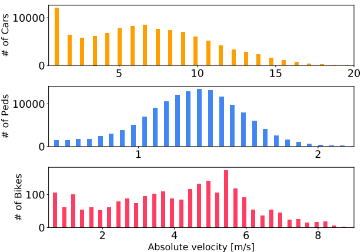
*図11.絶対速度。0.5m/s以上の速度で動いている物体のみを表示しています。*

車、歩行者、自転車の各カテゴリについて、ego-vehicle周辺のボックスアノテーションの分布を、図12-SMに示すような極座標範囲密度マップで分析します。ここでは、発生ビンは対数スケールになっています。一般的に、アノテーションはego-vehicleの周囲に均等に分布しています。また、アノテーションはego-vehicleに近いほど密度が高くなっています。ただし、歩行者と自転車のアノテーションは100mを超える範囲では少なくなっています。また、車のカテゴリはego-vehicleの前方と後方で密度が高くなっていることがわかります。これは、ほとんどの車両がego-vehicleと同じ車線を走行しているためです。

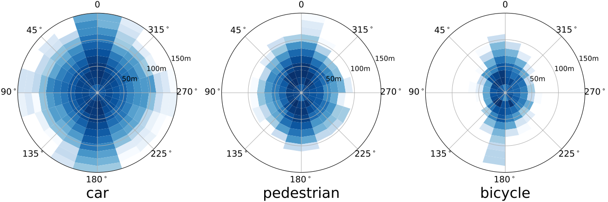
*図12.ボックスアノテーションの極座標対数スケール密度マップ。ここでは、半径軸はego-vehicleからの距離（メートル）、極軸はego-vehicleに対するヨー角です。ビンが暗いほど、その領域のボックスアノテーションが多いことを示しています。ここでは、すべてのマップについて、半径距離150mまでの密度のみを表示していますが、車の場合は200mまでのアノテーションがあります。*

セクション2では、六角形ビン密度プロットを通じて、すべてのカテゴリのボックス内のLidarポイントの数について説明しましたが、ここでは図13-SMに示すように、各カテゴリのLidarポイントの数を示します。同様に、発生ビンは対数スケールになっています。図からわかるように、歩行者や自転車と比較して、車のボックスアノテーション内には、ego-vehicleからのさまざまな距離でより多くのLidarポイントが見つかっています。これは、車が他の2つのカテゴリよりも大きな反射面を持つため、Lidarポイントがセンサーに反射される数が増えるため予想される結果です。

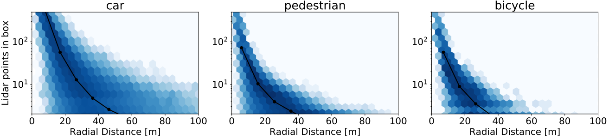
*図13.カテゴリ別（車、歩行者、自転車）に層別化された、ボックスアノテーション内のLidarポイントの数の六角形ビン対数スケール密度プロット。*

#### シーン再構築

nuScenesは、正確なLidarベースのローカリゼーションアルゴリズムを使用しています（セクション2）。しかし、地上真値のローカリゼーションデータがなく、一般的にシーン内でループクロージャを実行できないため、ローカリゼーションの品質を定量化することは困難です。ローカリゼーションを定性的に分析するために、約800個のポイントクラウドをグローバル座標で登録することで、シーン全体の統合ポイントクラウドを計算します。ego-vehicleに対応するポイントを除去し、各ポイントに、そのポイントが再投影される最も近いカメラピクセルの平均色値を割り当てます。シーン再構築の結果は図15に示されており、正確な同期とローカリゼーションを示しています。

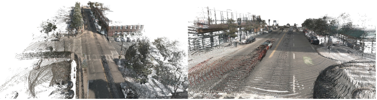
*図15.Lidarポイントとカメラ画像に基づくサンプルシーン再構築。カメラデータのピクセル色に基づいて色を割り当てた画像平面にLidarポイントを投影します。*

### B. 実装の詳細

ここでは、Lidarと画像に基づく3D物体検出のベースラインのトレーニングに関する追加の詳細を提供します。

#### PointPillarsの実装の詳細

すべての実験で、PointPillars[^51]ネットワークは、0.25メートルのピラーxy解像度と、xおよびyの範囲が $[-50, 50]$ メートルを使用してトレーニングされました。最大ピラー数とバッチサイズは、Lidarスイープの数に応じて変化しました。1、5、10回のスイープの場合、最大ピラー数をそれぞれ10000、22000、30000に設定し、バッチサイズを64、64、48に設定しました。すべての実験は750エポックでトレーニングされました。初期学習率は $10^{-3}$ に設定され、600エポック目と700エポック目に10分の1に減らされました。蓄積されたポイントクラウド内に1つ以上のLidarポイントを持つ地上真値のアノテーションのみが、ポジティブなトレーニング例として使用されました。自転車置き場内の自転車は個別にアノテーションされていないため、評価指標では自転車置き場は無視されます。そのため、トレーニング中に自転車置き場内のすべてのLidarポイントをフィルタリングしました。

### OFTの実装の詳細

各カメラについて、Orthographic Feature Transform[^69]（OFT）ベースラインは、各カメラのフレーム内のボクセルグリッド上でトレーニングされました。横方向の範囲は $[-40, 40]$ メートル、縦方向の範囲は $[0.1, 50.1]$ メートル、垂直方向の範囲は $(-3, 1)$ メートルです。

車のegoフレーム座標系の原点から50メートル以内のアノテーションのみでトレーニングしました。また、nuScenesデータセットの「visibility」属性を使用して、可視性が40%未満のアノテーションもフィルタリングしました。ネットワークは、学習率 $2 \times 10^{-3}$ で60エポックトレーニングされ、ネットワークの重みにはランダム初期化を使用しました（ImageNetによる事前学習は行っていません）。

| Method | Singapore | Rain | Night |
| --- | --- | --- | --- |
| OFT [^69] † | 6% | 10% | 55% |
| MDIS [^70] † | 8% | -3% | 58% |
| PP [^51] | 1% | 6% | 36% |

*表6. nuScenes検証セットのサブセットで評価された物体検出性能の低下。性能は、検証セット全体での評価と比較したmAPの相対的な低下として報告されています。3つの物体検出手法について、シンガポールデータ、雨データ、夜間データでの性能を評価しています。ResNet34[^39]のバックボーンと異なるトレーニングプロトコルが使用されているため、MDISの結果はこの作業の他のセクションと直接比較できないことに注意してください。（†）は、単眼カメラ画像のみを入力として使用します。PPはLidarのみを使用します。*

### C. 実験

このセクションでは、nuScenesに関するより詳細な結果分析を示します。雨および夜間データでの性能、クラスごとの性能、およびセマンティックマップフィルタリングについて調べます。また、トラッキングチャレンジの結果も分析します。

#### 雨および夜間データでの性能

セクション2で説明したように、nuScenesには2つの国からのデータ、および雨および夜間データが含まれています。データセットの分割（トレーニング、検証、テスト）は、これらの基準に関して同じデータ分布に従います。表6では、検証セットの関連するサブセットで3つの物体検出ベースラインの性能を分析しています。全体の検証セット（アメリカとシンガポール）と比較して、シンガポールのデータではわずかな性能低下が見られ、特に視覚ベースの手法で顕著です。これは、異なる国での物体の外観の違いや、ラベルの分布の違いによるものと考えられます。雨のデータについては、平均してわずかな性能低下が見られ、OFTとPPの性能は低下し、MDISの性能はわずかに向上しています。その理由の1つとして、nuScenesデータセットでは、降雨の有無に関係なく、フロントガラスに雨滴があるシーンをすべて雨とアノテーションしていることが挙げられます。最後に、夜間データでは、Lidarベースの手法で36%、視覚ベースの手法で55%と58%という大幅な性能低下が見られます。これは、視覚ベースの手法が照明の悪さの影響をより受けやすいことを示している可能性があります。また、夜間のシーンでは物体が非常に少なく、可視性の悪い物体をアノテーションすることがより困難であることにも留意してください。データのアノテーションには、セクション2で説明したように、カメラとLidarデータの両方を使用することが不可欠です。

#### クラスごとの分析

PointPillars[^51]のクラスごとの性能を表7-SM（上）と図17-SMに示します。ネットワークは、最も一般的な2つのカテゴリである車と歩行者で全体的に最高の性能を示しました。最も性能が悪かったカテゴリは自転車と建設車両であり、これらは最もまれな2つのカテゴリであり、追加の課題も呈しています。建設車両は、そのサイズと形状の大きなバリエーションにより、ユニークな課題を呈しています。車と歩行者の並進誤差は似ていますが、歩行者の向き誤差（21°）は車の向き誤差（11°）よりも大きくなっています。車の向き誤差が小さいのは、歩行者に比べて車の前面と側面のプロファイルの違いが大きいため予想通りです。車両の速度推定は有望であり（たとえば、車のクラスでは0.24 m/sのAVE）、都市部での典型的な車両速度が10〜15 m/sであることを考えると、これは優れた結果です。

- **PointPillars**

| Class | AP | ATE | ASE | AOE | AVE | AAE |
| --- | --- | --- | --- | --- | --- | --- |
| Barrier | 38.9 | 0.71 | 0.30 | 0.08 | N/A | N/A |
| Bicycle | 1.1 | 0.31 | 0.32 | 0.54 | 0.43 | 0.68 |
| Bus | 28.2 | 0.56 | 0.20 | 0.25 | 0.42 | 0.34 |
| Car | 68.4 | 0.28 | 0.16 | 0.20 | 0.24 | 0.36 |
| Constr. Veh. | 4.1 | 0.89 | 0.49 | 1.26 | 0.11 | 0.15 |
| Motorcycle | 27.4 | 0.36 | 0.29 | 0.79 | 0.63 | 0.64 |
| Pedestrian | 59.7 | 0.28 | 0.31 | 0.37 | 0.25 | 0.16 |
| Traffic Cone | 30.8 | 0.40 | 0.39 | N/A | N/A | N/A |
| Trailer | 23.4 | 0.89 | 0.20 | 0.83 | 0.20 | 0.21 |
| Truck | 23.0 | 0.49 | 0.23 | 0.18 | 0.25 | 0.41 |
| Mean | 30.5 | 0.52 | 0.29 | 0.50 | 0.32 | 0.37 |

- **MonoDIS**

| Class | AP | ATE | ASE | AOE | AVE | AAE |
| --- | --- | --- | --- | --- | --- | --- |
| Barrier | 51.1 | 0.53 | 0.29 | 0.15 | N/A | N/A |
| Bicycle | 24.5 | 0.71 | 0.30 | 1.04 | 0.93 | 0.01 |
| Bus | 18.8 | 0.84 | 0.19 | 0.12 | 2.86 | 0.30 |
| Car | 47.8 | 0.61 | 0.15 | 0.07 | 1.78 | 0.12 |
| Constr. Veh. | 7.4 | 1.03 | 0.39 | 0.89 | 0.38 | 0.15 |
| Motorcycle | 29.0 | 0.66 | 0.24 | 0.51 | 3.15 | 0.02 |
| Pedestrian | 37.0 | 0.70 | 0.31 | 1.27 | 0.89 | 0.18 |
| Traffic Cone | 48.7 | 0.50 | 0.36 | N/A | N/A | N/A |
| Trailer | 17.6 | 1.03 | 0.20 | 0.78 | 0.64 | 0.15 |
| Truck | 22.0 | 0.78 | 0.20 | 0.08 | 1.80 | 0.14 |
| Mean | 30.4 | 0.74 | 0.26 | 0.55 | 1.55 | 0.13 |

*表7. PointPillars[^51]（上）とMonoDIS[^70]（下）のクラスごとの検出性能。AP: 平均精度（%）、ATE: 平均並進誤差（m）、ASE: 平均スケール誤差（1-IOU）、AOE: 平均向き誤差（rad）、AVE: 平均速度誤差（m/s）、AAE: 平均属性誤差（1-精度）、N/A: 該当なし。nuScenes検出スコア（NDS）= 45.3%（PointPillars）と38.4%（MonoDIS）。*

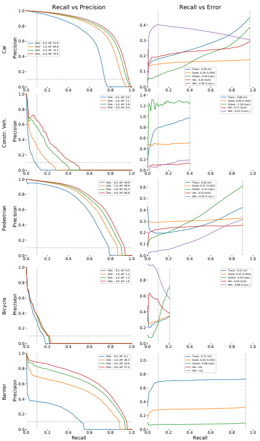
*図17. nuScenesテストセットにおけるPointPillarsのクラスごとの結果（検出リーダーボードから取得）。*

#### セマンティックマップフィルタリング

セクション4.2および表7-SMでは、PointPillarsのベースラインが自転車クラスでわずか1%のAPしか達成していないことを示しています。しかし、予測とグラウンドトゥルースの両方をフィルタリングして、セマンティックマップ上のボックスのみを含めるようにすると、APは30%に増加します。この観察結果は、図16-SMに示されており、グラウンドトゥルースとセマンティックマップの間の距離が異なる場合のAPをプロットしています。図からわかるように、マッチしたグラウンドトゥルースがセマンティックマップから遠くなるにつれて、APは低下します。これは、セマンティックマップから離れた自転車は、駐車して遮蔽され、可視性が低い傾向があるためと考えられます。

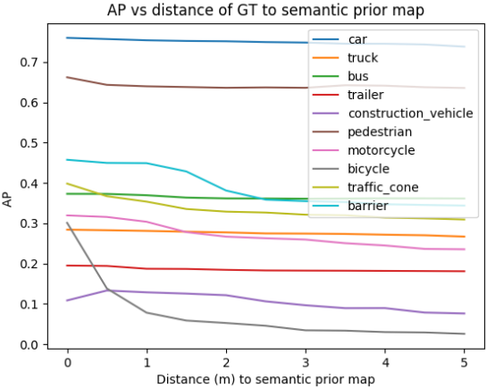
*図16. PointPillars[^51]の検出性能とセマンティック事前マップの位置の関係（検証セット）。最良のLidarネットワーク（ImageNet事前学習付きの10回のLidarスイープ）について、予測とグラウンドトゥルースのアノテーションは、セマンティック事前マップからの所定の距離内にある場合にのみ含まれています。*

#### トラッキングチャレンジの結果

表8に、2019年のnuScenesトラッキングチャレンジの結果を示します。Stan[^16]は、マハラノビス距離をマッチングに使用し、最強のベースラインを大きく上回り（+40%sAMOTA）、nuScenesトラッキングベンチマークで新たな最先端技術を確立しました。予想通り、単眼カメラ画像のみを使用する2つの手法（CeViとMDIS）は低性能でした。セクション4と同様に、MDISのLGDとCeOpのAMOTPを除いて、指標は高度に相関していることが観察されました。すべての手法がトラッキングバイディテクションアプローチを使用していることに注意してください。CeOpとCeViを除いて、すべての手法はカルマンフィルタ[^44]を使用しています。

| Method | sAMOTA | AMOTP | sMOTA | MOTA | MOTP | TID | LGD |
| --- | --- | --- | --- | --- | --- | --- | --- |
| Stan [^16] | 55.0 | 0.80 | 76.8 | 45.9 | 0.35 | 0.96 | 1.38 |
| VVte | 37.1 | 1.11 | 68.4 | 30.8 | 0.41 | 0.94 | 1.58 |
| Megvii [^90] | 15.1 | 1.50 | 55.2 | 15.4 | 0.40 | 1.97 | 3.74 |
| CeOp | 10.8 | 0.99 | 26.7 | 8.5 | 0.35 | 1.72 | 3.18 |
| CeVi † | 4.6 | 1.54 | 23.1 | 4.3 | 0.75 | 2.06 | 3.82 |
| PP [^51] | 2.9 | 1.70 | 24.3 | 4.5 | 0.82 | 4.57 | 5.93 |
| MDIS [^70] † | 1.8 | 1.79 | 9.1 | 2.0 | 0.90 | 1.41 | 3.35 |

*表8. 2019 nuScenesトラッキングチャレンジの結果。Stan、VVte、Megvii、CeOp、CeVi、PP、MDISは、各手法の略称です。（†）は単眼カメラ画像のみを入力として使用します。CeOpはLidarとカメラを使用します。他の手法はLidarのみを使用します。sAMOTA: 平均マルチオブジェクトトラッキング精度、AMOTP: 平均マルチオブジェクトトラッキング精度、sMOTA: スケールされたMOTA、MOTA: マルチオブジェクトトラッキング精度、MOTP: マルチオブジェクトトラッキング精度、TID: トラック初期化時間、LGD: 最長ギャップ時間。*

## References

[^1] Giancarlo Alessandretti, Alberto Broggi, and Pietro Cerri. Vehicle and guard rail detection using radar and vision data fusion. IEEE Transactions on Intelligent Transportation Systems, 2007. 1
[^2] Dan Barnes, Will Maddern, and Ingmar Posner. Exploiting 3d semantic scene priors for online traffic light interpretation. In IVS, 2015. 2
[^3] Klaus Bengler, Klaus Dietmayer, Berthold Farber, Markus Maurer, Christoph Stiller, and Hermann Winner. Three decades of driver assistance systems: Review and future perspectives. ITSM, 2014. 1
[^4] Keni Bernardin, Alexander Elbs, and Rainer Stiefelhagen. Multiple object tracking performance metrics and evaluation in a smart room environment. In ECCV Workshop on Visual Surveillance, 2006. 6
[^5] Lorenzo Bertoni, Sven Kreiss, and Alexandre Alahi. Monoloco: Monocular 3d pedestrian localization and uncertainty estimation. In ICCV, 2019. 2
[^6] Jos´e-Luis Blanco-Claraco, Francisco- ´Angel Moreno-Dueas, and Javier Gonz´alez-Jim´enez. The M´alaga urban dataset: High-rate stereo and lidar in a realistic urban scenario. IJRR, 2014. 3
[^7] Martin Brossard, Axel Barrau, and Silv`ere Bonnabel. AIIMU Dead-Reckoning. arXiv preprint arXiv:1904.06064, 2019. 4
[^8] Gabriel J. Brostow, Jamie Shotton, Julien Fauqueur, and Roberto Cipolla. Segmentation and recognition using structure from motion point clouds. In ECCV, 2008. 2, 3
[^9] Sergio Casas, Cole Gulino, Renjie Liao, and Raquel Urtasun. Spatially-aware graph neural networks for relational behavior forecasting from sensor data. arXiv preprint arXiv:1910.08233, 2019. 2
[^10] Ming-Fang Chang, John W Lambert, Patsorn Sangkloy, Jagjeet Singh, Slawomir Bak, Andrew Hartnett, De Wang, Peter Carr, Simon Lucey, Deva Ramanan, and James Hays. Argoverse: 3d tracking and forecasting with rich maps. In CVPR, 2019. 2, 3, 4
[^11] Z. Che, G. Li, T. Li, B. Jiang, X. Shi, X. Zhang, Y. Lu, G. Wu, Y. Liu, and J. Ye. D2-City: A large-scale dashcam video dataset of diverse traffic scenarios. arXiv:1904.01975, 2019. 3
[^12] Xiaozhi Chen, Kaustav Kundu, Yukun Zhu, Andrew G Berneshawi, Huimin Ma, Sanja Fidler, and Raquel Urtasun. 3d object proposals for accurate object class detection. In NIPS, 2015. 1
[^13] Xiaozhi Chen, Laustav Kundu, Ziyu Zhang, Huimin Ma, Sanja Fidler, and Raquel Urtasun. Monocular 3d object detection for autonomous driving. In CVPR, 2016. 1
[^14] Xiaozhi Chen, Huimin Ma, Ji Wan, Bo Li, and Tian Xia. Multi-view 3d object detection network for autonomous driving. In CVPR, 2017. 2
[^15] Yiping Chen, Jingkang Wang, Jonathan Li, Cewu Lu, Zhipeng Luo, Han Xue, and Cheng Wang. Lidar-video driving dataset: Learning driving policies effectively. In CVPR, 2018. 3
[^16] Hsu-kuang Chiu, Antonio Prioletti, Jie Li, and Jeannette Bohg. Probabilistic 3d multi-object tracking for autonomous driving. arXiv preprint arXiv:2001.05673, 2020. 16
[^17] Yukyung Choi, Namil Kim, Soonmin Hwang, Kibaek Park, Jae Shin Yoon, Kyounghwan An, and In So Kweon. KAIST multi-spectral day/night data set for autonomous and assisted driving. IEEE Transactions on Intelligent Transportation Systems, 2017. 3
[^18] Z. J. Chong, B. Qin, T. Bandyopadhyay, M. H. Ang, E. Frazzoli, and D. Rus. Synthetic 2d lidar for precise vehicle localization in 3d urban environment. In ICRA, 2013. 4
[^19] Marius Cordts, Mohamed Omran, Sebastian Ramos, Timo Rehfeld, Markus Enzweiler, Rodrigo Benenson, Uwe Franke, Stefan Roth, and Bernt Schiele. The Cityscapes dataset for semantic urban scene understanding. In CVPR, 2016. 2, 3, 4, 6, 12
[^20] Navneet Dalal and Bill Triggs. Histograms of oriented gradients for human detection. In CVPR, 2005. 3
[^21] Jia Deng, Wei Dong, Richard Socher, Li-Jia Li, Kai Li, and Li Fei-Fei. ImageNet: A large-scale hierarchical image database. In CVPR, 2009. 6, 8
[^22] Thierry Deruyttere, Simon Vandenhende, Dusan Grujicic, Luc Van Gool, and Marie-Francine Moens. Talk2car: Taking control of your self-driving car. arXiv preprint arXiv:1909.10838, 2019. 2
[^23] Piotr Doll´ar, Christian Wojek, Bernt Schiele, and Pietro Perona. Pedestrian detection: An evaluation of the state of the art. PAMI, 2012. 3
[^24] Markus Enzweiler and Dariu M. Gavrila. Monocular pedestrian detection: Survey and experiments. PAMI, 2009. 3
[^25] Andreas Ess, Bastian Leibe, Konrad Schindler, and Luc Van Gool. A mobile vision system for robust multi-person tracking. In CVPR, 2008. 3
[^26] Mark Everingham, Luc Van Gool, Christopher K. I. Williams, John Winn, and Andrew Zisserman. The pascal visual object classes (VOC) challenge. International Journal of Computer Vision, 2010. 5
[^27] Hehe Fan and Yi Yang. PointRNN: Point recurrent neural network for moving point cloud processing. arXiv preprint arXiv:1910.08287, 2019. 2
[^28] Di Feng, Christian Haase-Schuetz, Lars Rosenbaum, Heinz Hertlein, Fabian Duffhauss, Claudius Glaeser, Werner Wiesbeck, and Klaus Dietmayer. Deep multi-modal object detection and semantic segmentation for autonomous driving: Datasets, methods, and challenges. arXiv preprint arXiv:1902.07830, 2019. 2
[^29] D. Feng, C. Haase-Schuetz, L. Rosenbaum, H. Hertlein, C. Glaeser, F. Timm, W. Wiesbeck, and K. Dietmayer. Deep multi-modal object detection and semantic segmentation for autonomous driving: Datasets, methods, and challenges. arXiv:1902.07830, 2019. 2
[^30] EvalAI: Towards Better Evaluation Systems for AI Agents. D. yadav and r. jain and h. agrawal and p. chattopadhyay and t. singh and a. jain and s. b. singh and s. lee and d. batra. arXiv:1902.03570, 2019. 9
[^31] Andrea Frome, German Cheung, Ahmad Abdulkader, Marco Zennaro, Bo Wu, Alessandro Bissacco, Hartwig Adam,  Hartmut Neven, and Luc Vincent. Large-scale privacy protection in google street view. In ICCV, 2009. 12
[^32] Andreas Geiger, Philip Lenz, and Raquel Urtasun. Are we ready for autonomous driving? the KITTI vision benchmark suite. In CVPR, 2012. 2, 3, 4, 5, 6, 7, 8, 12
[^33] Neuhold Gerhard, Tobias Ollmann, Samuel Rota Bulo, and Peter Kontschieder. The Mapillary Vistas dataset for semantic understanding of street scenes. In ICCV, 2017. 2, 3
[^34] Jakob Geyer, Yohannes Kassahun, Mentar Mahmudi, Xavier Ricou, Rupesh Durgesh, Andrew S. Chung, Lorenz Hauswald, Viet Hoang Pham, Maximilian Mhlegg, Sebastian Dorn, Tiffany Fernandez, Martin Jnicke, Sudesh Mirashi, Chiragkumar Savani, Martin Sturm, Oleksandr Vorobiov, and Peter Schuberth. A2D2: AEV autonomous driving dataset. http://www.a2d2.audi, 2019. 3
[^35] Hugo Grimmett, Mathias Buerki, Lina Paz, Pedro Pinies, Paul Furgale, Ingmar Posner, and Paul Newman. Integrating metric and semantic maps for vision-only automated parking. In ICRA, 2015. 2
[^36] Junyao Guo, Unmesh Kurup, and Mohak Shah. Is it safe to drive? an overview of factors, challenges, and datasets for driveability assessment in autonomous driving. arXiv:1811.11277, 2018. 2
[^37] Shirsendu Sukanta Halder, Jean-Francois Lalonde, and Raoul de Charette. Physics-based rendering for improving robustness to rain. In ICCV, 2019. 2
[^38] Kaiming He, Xiangyu Zhang, Shaoqing Ren, and Jian Sun. Delving deep into rectifiers: Surpassing human-level performance on imagenet classification. In ICCV, 2015. 8
[^39] Kaiming He, Xiangyu Zhang, Shaoqing Ren, and Jian Sun. Deep residual learning for image recognition. In CVPR, 2016. 12, 15
[^40] Namdar Homayounfar, Wei-Chiu Ma, Shrinidhi Kowshika Lakshmikanth, and Raquel Urtasun. Hierarchical recurrent attention networks for structured online maps. In CVPR, 2018. 1
[^41] Xinyu Huang, Peng Wang, Xinjing Cheng, Dingfu Zhou, Qichuan Geng, and Ruigang Yang. The apolloscape open dataset for autonomous driving and its application. arXiv:1803.06184, 2018. 2, 3, 4, 6, 12
[^42] Vijay John and Seiichi Mita. Rvnet: Deep sensor fusion of monocular camera and radar for image-based obstacle detection in challenging environments, 2019. 2
[^43] Hojung Jung, Yuki Oto, Oscar M. Mozos, Yumi Iwashita, and Ryo Kurazume. Multi-modal panoramic 3d outdoor datasets for place categorization. In IROS, 2016. 3
[^44] Rudolph Emil Kalman. A new approach to linear filtering and prediction problems. Transactions of the ASME–Journal of Basic Engineering, 82(Series D):35–45, 1960. 16
[^45] R. Kesten, M. Usman, J. Houston, T. Pandya, K. Nadhamuni, A. Ferreira, M. Yuan, B. Low, A. Jain, P. Ondruska, S. Omari, S. Shah, A. Kulkarni, A. Kazakova, C. Tao, L. Platinsky, W. Jiang, and V. Shet. Lyft Level 5 AV Dataset 2019. https://level5.lyft.com/dataset/, 2019. 2, 3, 4
[^46] Jaekyum Kim, Jaehyung Choi, Yechol Kim, Junho Koh, Chung Choo Chung, and Jun Won Choi. Robust camera lidar sensor fusion via deep gated information fusion network. In IVS, 2018. 1
[^47] Alex Krizhevsky, Ilya Sutskever, and Geoffrey E Hinton. Imagenet classification with deep convolutional neural networks. In NIPS, 2012. 8
[^48] Jason Ku, Melissa Mozifian, Jungwook Lee, Ali Harakeh, and Steven Waslander. Joint 3d proposal generation and object detection from view aggregation. In IROS, 2018. 2
[^49] Charles- ´Eric No¨el Laflamme, Franc¸ois Pomerleau, and Philippe Gigu`ere. Driving datasets literature review. arXiv preprint arXiv:1910.11968, 2019. 2
[^50] Nitheesh Lakshminarayana. Large scale multimodal data capture, evaluation and maintenance framework for autonomous driving datasets. In ICCVW, 2019. 2
[^51] Alex H. Lang, Sourabh Vora, Holger Caesar, Lubing Zhou, Jiong Yang, and Oscar Beijbom. Pointpillars: Fast encoders for object detection from point clouds. In CVPR, 2019. 1, 2, 6, 7, 8, 14, 15, 16
[^52] Ming Liang, Bin Yang, Shenlong Wang, and Raquel Urtasun. Deep continuous fusion for multi-sensor 3d object detection. In ECCV, 2018. 2
[^53] Wei Liu, Dragomir Anguelov, Dumitru Erhan, Christian Szegedy, Scott Reed, Cheng-Yang Fu, and Alexander C Berg. SSD: Single shot multibox detector. In ECCV, 2016. 7
[^54] Yuexin Ma, Xinge Zhu, Sibo Zhang, Ruigang Yang, Wenping Wang, and Dinesh Manocha. Trafficpredict: Trajectory prediction for heterogeneous traffic-agents http: //apolloscape.auto/tracking.html. In AAAI, 2019. 3
[^55] Will Maddern, Geoffrey Pascoe, Chris Linegar, and Paul Newman. 1 year, 1000 km: The oxford robotcar dataset. IJRR, 2017. 2, 3
[^56] Gregory P Meyer, Ankit Laddha, Eric Kee, Carlos VallespiGonzalez, and Carl K Wellington. Lasernet: An efficient probabilistic 3d object detector for autonomous driving. In CVPR, 2019. 7
[^57] Arsalan Mousavian, Dragomir Anguelov, John Flynn, and Jana Kosecka. 3d bounding box estimation using deep learning and geometry. In CVPR, 2017. 1
[^58] Luk Neumann, Michelle Karg, Shanshan Zhang, Christian Scharfenberger, Eric Piegert, Sarah Mistr, Olga Prokofyeva, Robert Thiel, Andrea Vedaldi, Andrew Zisserman, and Bernt Schiele. Nightowls: A pedestrians at night dataset. In ACCV, 2018. 3
[^59] Jiquan Ngiam, Benjamin Caine, Wei Han, Brandon Yang, Yuning Chai, Pei Sun, Yin Zhou, Xi Yi, Ouais Alsharif, Patrick Nguyen, Zhifeng Chen, Jonathon Shlens, and Vijay Vasudevan. Starnet: Targeted computation for object detection in point clouds. arXiv preprint arXiv:1908.11069, 2019. 7
[^60] Farzan Erlik Nowruzi, Prince Kapoor, Dhanvin Kolhatkar, Fahed Al Hassanat, Robert Laganiere, and Julien Rebut. How much real data do we actually need: Analyzing object detection performance using synthetic and real data. In ICML Workshop on AI for Autonomous Driving, 2019. 2
[^61] Abhishek Patil, Srikanth Malla, Haiming Gang, and Yi-Ting Chen. The H3D dataset for full-surround 3d multi-object detection and tracking in crowded urban scenes. In ICRA, 2019. 2, 3, 4, 12
[^62] Quang-Hieu Pham, Pierre Sevestre, Ramanpreet Singh Pahwa, Huijing Zhan, Chun Ho Pang, Yuda Chen, Armin Mustafa, Vijay Chandrasekhar, and Jie Lin. A*3D Dataset: Towards autonomous driving in challenging environments. arXiv:1909.07541, 2019. 3
[^63] Tung Phan-Minh, Elena Corina Grigore, Freddy A. Boulton, Oscar Beijbom, and Eric M. Wolff. Covernet: Multimodal behavior prediction using trajectory sets. In CVPR, 2020. 8
[^64] Charles R Qi, Wei Liu, Chenxia Wu, Hao Su, and Leonidas J. Guibas. Frustum pointnets for 3d object detection from RGB-D data. In CVPR, 2018. 2
[^65] Vasili Ramanishka, Yi-Ting Chen, Teruhisa Misu, and Kate Saenko. Toward driving scene understanding: A dataset for learning driver behavior and causal reasoning. In CVPR, 2018. 4
[^66] Akshay Rangesh and Mohan M. Trivedi. Ground plane polling for 6dof pose estimation of objects on the road. In arXiv:1811.06666, 2018. 1
[^67] Shaoqing Ren, Kaiming He, Ross Girshick, and Jian Sun. Faster R-CNN: Towards real-time object detection with region proposal networks. In NIPS, 2015. 12
[^68] Nicholas Rhinehart, Rowan McAllister, Kris M. Kitani, and Sergey Levine. PRECOG: Predictions conditioned on goals in visual multi-agent scenarios. In ICCV, 2019. 2, 4
[^69] Thomas Roddick, Alex Kendall, and Roberto Cipolla. Orthographic feature transform for monocular 3d object detection. In BMVC, 2019. 1, 2, 5, 6, 7, 8, 14, 15
[^70] Andrea Simonelli, Samuel Rota Bulo, Lorenzo Porzi, Manuel Lopez-Antequera, and Peter Kontschieder. Disentangling monocular 3d object detection. ICCV, 2019. 2, 7, 8, 15, 16
[^71] Leslie N. Smith. A disciplined approach to neural network hyper-parameters: Part 1 – learning rate, batch size, momentum, and weight decay. arXiv preprint arXiv:1803.09820, 2018. 7
[^72] Sourabh Vora, Alex H Lang, Bassam Helou, and Oscar Beijbom. Pointpainting: Sequential fusion for 3d object detection. In CVPR, 2020. 2
[^73] Yan Wang, Wei-Lun Chao, Divyansh Garg, Bharath Hariharan, Mark Campbell, and Kilian Q. Weinberger. Pseudo-lidar from visual depth estimation: Bridging the gap in 3d object detection for autonomous driving. In CVPR, 2019. 1
[^74] Ziyan Wang, Buyu Liu, Samuel Schulter, and Manmohan Chandraker. Dataset for high-level 3d scene understanding of complex road scenes in the top-view. In CVPRW, 2019. 2
[^75] Zining Wang, Wei Zhan, and Masayoshi Tomizuka. Fusing bird’s eye view lidar point cloud and front view camera image for 3d object detection. In IVS, 2018. 2
[^76] Waymo. Waymo Open Dataset: An autonomous driving dataset, 2019. 3
[^77] Xinshuo Weng and Kris Kitani. A baseline for 3d multiobject tracking. arXiv preprint arXiv:1907.03961, 2019. 6, 7, 8, 16
[^78] L. Woensel and G. Archer. Ten technologies which could change our lives. European Parlimentary Research Service, 2015. 1
[^79] Christian Wojek, Stefan Walk, and Bernt Schiele. Multi-cue onboard pedestrian detection. In CVPR, 2009. 3
[^80] Bin Xu and Zhenzhong Chen. Multi-level fusion based 3d object detection from monocular images. In CVPR, 2018. 1
[^81] Danfei Xu, Dragomir Anguelov, and Ashesh Jain. Pointfusion: Deep sensor fusion for 3d bounding box estimation. In CVPR, 2018. 2
[^82] Bin Yang, Ming Liang, and Raquel Urtasun. HDNET: Exploiting HD maps for 3d object detection. In CoRL, 2018. 2
[^83] Yangyang Ye, Chi Zhang, Xiaoli Hao, Houjin Chen, and Zhaoxiang Zhang. SARPNET: Shape attention regional proposal network for lidar-based 3d object detection. Neurocomputing, 2019. 2
[^84] Senthil Yogamani, Ciar´an Hughes, Jonathan Horgan, Ganesh Sistu, Padraig Varley, Derek O’Dea, Michal Uric´ar, Stefan Milz, Martin Simon, Karl Amende, et al. Woodscape: A multi-task, multi-camera fisheye dataset for autonomous driving. In ICCV, 2019. 2
[^85] Fisher Yu, Wenqi Xian, Yingying Chen, Fangchen Liu, Mike Liao, Vashisht Madhavan, and Trevor Darrell. BDD100K: A diverse driving video database with scalable annotation tooling. arXiv:1805.04687, 2018. 2, 3
[^86] Ekim Yurtsever, Jacob Lambert, Alexander Carballo, and Kazuya Takeda. A survey of autonomous driving: Common practices and emerging technologies. arXiv preprint arXiv:1906.05113, 2019. 2
[^87] Kaipeng Zhang, Zhanpeng Zhang, Zhifeng Li, and Yu Qiao. Joint face detection and alignment using multitask cascaded convolutional networks. SPL, 23(10), 2016. 12
[^88] Shanshan Zhang, Rodrigo Benenson, and Bernt Schiele. Citypersons: A diverse dataset for pedestrian detection. In CVPR, 2017. 3
[^89] Hao Zhou and Jorge Laval. Longitudinal motion planning for autonomous vehicles and its impact on congestion: A survey. arXiv preprint arXiv:1910.06070, 2019. 2
[^90] Benjin Zhu, Zhengkai Jiang, Xiangxin Zhou, Zeming Li, and Gang Yu. Class-balanced grouping and sampling for point cloud 3d object detection. arXiv:1908.09492, 2019. 2, 7, 8, 16
[^91] Jing Zhu and Yi Fang. Learning object-specific distance from a monocular image. In ICCV, 2019. 2
