# DETR: End-to-End Object Detection with Transformers

[DETR: End-to-End Object Detection with Transformers](https://arxiv.org/abs/2005.12872)の和訳

著者: Nicolas Carion, Francisco Massa?, Gabriel Synnaeve, Nicolas Usunier,
Alexander Kirillov, and Sergey Zagoruyko

## Abstract

我々は、物体検出を直接的なセット予測問題と見なす新しい手法を提案する。我々のアプローチは検出パイプラインを合理化し、非最大値抑制（non-maximum suppression）手順や、タスクに関する事前知識を明示的にエンコードするアンカー生成のような、多くの手作業で設計されたコンポーネントの必要性を効果的に排除する。DEtection TRansformerまたはDETRと呼ばれる新しいフレームワークの主な構成要素は、二部マッチングを介して一意の予測を強制するセットベースのグローバル損失と、Transformerエンコーダ・デコーダアーキテクチャである。学習されたオブジェクトクエリの固定された小さなセットが与えられると、DETRはオブジェクトの関係とグローバルな画像コンテキストについて推論し、最終的な予測セットを直接並列に出力する。この新しいモデルは概念的にシンプルであり、他の多くの現代の検出器とは異なり、専用のライブラリを必要としない。DETRは、困難なCOCO物体検出データセットにおいて、十分に確立され高度に最適化されたFaster R-CNNのベースラインと同等の精度および実行時パフォーマンスを実証する。さらに、DETRは統一された方法でパノプティックセグメンテーションを生成するように簡単に一般化できる。我々は、それが競合するベースラインを大幅に上回ることを示す。訓練コードと事前訓練済みモデルは https://github.com/facebookresearch/detr で入手可能である。

## 1 Introduction

物体検出の目標は、各関心オブジェクトのバウンディングボックスとカテゴリラベルのセットを予測することである。現代の検出器はこのセット予測タスクに間接的に取り組んでおり、多数の提案 [^37], [^5]、アンカー [^23]、またはウィンドウの中心 [^53], [^46] に対するサロゲート（代替）回帰および分類問題を定義している。それらのパフォーマンスは、ほぼ重複した予測を折りたたむための後処理ステップ、アンカーセットの設計、およびターゲットボックスをアンカーに割り当てるヒューリスティクス [^52] によって大きな影響を受ける。これらのパイプラインを簡素化するために、我々はサロゲートタスクをバイパスする直接的なセット予測アプローチを提案する。このエンドツーエンドの哲学は、機械翻訳や音声認識などの複雑な構造化予測タスクにおいて大きな進歩をもたらしたが、物体検出においてはまだである。過去の試み [^43], [^16], [^4], [^39] は、他の形式の事前知識を追加しているか、困難なベンチマークにおいて強力なベースラインと競争力があることを証明できていない。本論文はこのギャップを埋めることを目的としている。

図1: DETRは、一般的なCNNとTransformerアーキテクチャを組み合わせることで、最終的な検出セットを直接（並列に）予測する。訓練中、二部マッチングは予測をグラウンドトゥルースのボックスと一意に割り当てる。一致しない予測は「オブジェクトなし」クラス（ $\emptyset$ ）の予測を生み出すべきである。

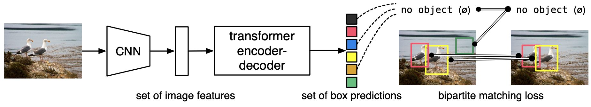

我々は、物体検出を直接的なセット予測問題と見なすことで、訓練パイプラインを合理化する。系列予測のための一般的なアーキテクチャであるTransformer [^47] に基づくエンコーダ・デコーダアーキテクチャを採用する。系列内の要素間のすべてのペアワイズ相互作用を明示的にモデル化するTransformerの自己注意（self-attention）メカニズムは、重複する予測の削除など、セット予測の特定の制約に対してこれらのアーキテクチャを特に適したものにする。

我々のDEtection TRansformer（DETR、図1を参照）は、すべてのオブジェクトを一度に予測し、予測されたオブジェクトとグラウンドトゥルースのオブジェクトの間で二部マッチング（bipartite matching）を実行するセット損失関数を用いてエンドツーエンドで訓練される。DETRは、空間アンカーや非最大値抑制（NMS）のように事前知識をエンコードする複数の手作業で設計されたコンポーネントを削除することで、検出パイプラインを簡素化する。既存のほとんどの検出手法とは異なり、DETRはカスタマイズされたレイヤーを必要としないため、標準的なCNNおよびTransformerクラスを含む任意のフレームワークで簡単に再現できる[^1]。

直接セット予測に関する以前の多くの研究と比較して、DETRの主な特徴は、二部マッチング損失と（非自己回帰的な）並列デコーディングを備えたTransformerの結合である [^29], [^12], [^10], [^8]。対照的に、以前の研究はRNNを用いた自己回帰的デコーディングに焦点を当てていた [^43], [^41], [^30], [^36], [^42]。我々のマッチング損失関数は、予測をグラウンドトゥルースのオブジェクトに一意に割り当て、予測されたオブジェクトの順列に対して不変であるため、それらを並列に出力することができる。

我々は、最も人気のある物体検出データセットの一つであるCOCO [^24] において、非常に競争力のあるFaster R-CNNベースライン [^37] と比較してDETRを評価する。Faster R-CNNは多くの設計の反復を経ており、最初の発表以来その性能は大きく向上している。我々の実験は、我々の新しいモデルが同等の性能を達成することを示している。より正確には、DETRは大きなオブジェクトに対して有意に優れた性能を示し、この結果はおそらくTransformerの非局所的な計算によって可能になったものである。しかしながら、小さなオブジェクトに対しては低い性能となる。我々は、今後の研究が、FPN [^22] の開発がFaster R-CNNに対して行ったのと同じ方法で、この側面を改善することを期待している。

DETRの訓練設定は、複数の点で標準的な物体検出器とは異なる。新しいモデルは超長期の訓練スケジュールを必要とし、Transformerの補助デコーディング損失の恩恵を受ける。我々は、実証された性能にとってどのコンポーネントが重要であるかを徹底的に探求する。
DETRの設計理念は、より複雑なタスクへ簡単に拡張できる。実験において、事前に訓練されたDETRの上に訓練されたシンプルなセグメンテーションヘッドが、近年人気を集めている挑戦的なピクセルレベルの認識タスクであるパノプティックセグメンテーション（Panoptic Segmentation）[^19] において、競争力のあるベースラインを上回ることを示す。

## 2 Related work

我々の研究は、いくつかの領域における先行研究に基づいている：セット予測のための二部マッチング損失、Transformerに基づくエンコーダ・デコーダアーキテクチャ、並列デコーディング、そして物体検出手法である。

### 2.1 Set Prediction

セットを直接予測するための標準的なディープラーニングモデルは存在しない。基本的なセット予測タスクはマルチラベル分類（コンピュータビジョンの文脈における参照としては例えば [^40], [^33] を参照）であるが、そのベースラインアプローチであるone-vs-restは、要素間に根本的な構造がある（すなわち、ほぼ同一のボックスが存在する）検出のような問題には適用できない。これらのタスクにおける最初の困難は、ほぼ重複するものを避けることである。現在のほとんどの検出器は、この問題に対処するために非最大値抑制（NMS）などの後処理を使用しているが、直接セット予測は後処理が不要である。それらは、冗長性を避けるためにすべての予測された要素間の相互作用をモデル化するグローバルな推論スキームを必要とする。固定サイズのセット予測の場合、密な全結合ネットワーク（dense fully connected networks）[^9] で十分であるが、コストがかかる。一般的なアプローチは、リカレントニューラルネットワーク [^48] のような自己回帰系列モデルを使用することである。すべての場合において、損失関数は予測の順列によって不変であるべきである。通常の解決策は、ハンガリアンアルゴリズム [^20] に基づく損失を設計し、グラウンドトゥルースと予測の間の二部マッチングを見つけることである。これにより順列の不変性が強制され、各ターゲット要素が固有のマッチを持つことが保証される。我々は二部マッチング損失のアプローチに従う。しかし、ほとんどの先行研究とは対照的に、我々は自己回帰モデルから離れ、並列デコーディングを備えたTransformerを使用し、これについては後述する。

### 2.2 Transformers and Parallel Decoding

TransformerはVaswaniら [^47] によって、機械翻訳のための新しい注意ベースのビルディングブロックとして導入された。注意メカニズム（Attention mechanisms）[^2] は、入力系列全体から情報を集約するニューラルネットワークレイヤーである。Transformerは自己注意（self-attention）レイヤーを導入し、これはNon-Local Neural Networks [^49] と同様に、系列の各要素をスキャンし、系列全体からの情報を集約して更新する。注意ベースのモデルの主な利点の一つは、そのグローバルな計算と完璧な記憶であり、これにより長い系列においてはRNNよりも適している。Transformerは現在、自然言語処理、音声処理、コンピュータビジョンにおける多くの問題でRNNを置き換えつつある [^8], [^27], [^45], [^34], [^31]。

Transformerは最初、初期のsequence-to-sequenceモデル [^44] に従って自己回帰モデルで使用され、出力トークンを一つずつ生成していた。しかし、法外な推論コスト（出力の長さに比例し、バッチ処理が難しい）が、オーディオ [^29]、機械翻訳 [^12], [^10]、単語表現学習 [^8]、そして最近では音声認識 [^6] の領域において、並列系列生成の開発につながった。我々も、計算コストとセット予測に必要なグローバルな計算を実行する能力との間の適切なトレードオフのために、Transformerと並列デコーディングを組み合わせる。

### 2.3 Object detection

現代の物体検出手法のほとんどは、いくつかの初期推測に対して相対的な予測を行う。2段階検出器 [^37], [^5] は提案（proposals）に関してボックスを予測し、一方で1段階手法はアンカー [^23] または可能なオブジェクト中心のグリッド [^53], [^46] に関して予測を行う。最近の研究 [^52] は、これらのシステムの最終的な性能が、これらの初期推測が設定される正確な方法に大きく依存することを実証している。我々のモデルでは、この手作業のプロセスを取り除き、アンカーではなく入力画像に対する絶対的なボックス予測を用いて検出のセットを直接予測することで、検出プロセスを合理化することができる。

**Set-based loss.** いくつかの物体検出器 [^9], [^25], [^35] は二部マッチング損失を使用した。しかし、これらの初期のディープラーニングモデルでは、異なる予測間の関係は畳み込み層または全結合層のみでモデル化されており、手作業で設計されたNMS後処理がそれらのパフォーマンスを向上させることができた。より最近の検出器 [^37], [^23], [^53] は、グラウンドトゥルースと予測の間に非一意の割り当てルールを使用し、NMSと併用している。
学習可能なNMS手法 [^16], [^4] やリレーションネットワーク [^17] は、注意メカニズムを用いて異なる予測間の関係を明示的にモデル化する。直接セット損失を使用するため、後処理のステップは不要である。しかし、これらの手法は、検出間の関係を効率的にモデル化するために、提案ボックスの座標のような追加の手作業のコンテキスト特徴量を採用しているのに対し、我々はモデルにエンコードされる事前知識を削減する解決策を探している。

**Recurrent detectors.** 我々のアプローチに最も近いのは、物体検出 [^43] およびインスタンスセグメンテーション [^41], [^30], [^36], [^42] のためのエンドツーエンドのセット予測である。我々と同様に、彼らはバウンディングボックスのセットを直接生成するために、CNNの活性化に基づくエンコーダ・デコーダアーキテクチャと二部マッチング損失を使用している。しかし、これらのアプローチは小さなデータセットでのみ評価されており、現代のベースラインとは比較されていない。特に、これらは自己回帰モデル（より正確にはRNN）に基づいているため、並列デコーディングを備えた最新のTransformerを活用していない。

## 3 The DETR model

検出における直接セット予測には2つの要素が不可欠である：(1) 予測されたボックスとグラウンドトゥルースボックスの間の一意なマッチングを強制するセット予測損失、(2) オブジェクトのセットを（単一のパスで）予測し、それらの関係をモデル化するアーキテクチャ。図2で我々のアーキテクチャを詳細に説明する。

### 3.1 Object detection set prediction loss

DETRは、デコーダを1回通過することで、固定サイズの $N$ 個の予測セットを推論する。ここで $N$ は、画像内の一般的なオブジェクトの数よりも大幅に大きく設定される。訓練における主な困難の一つは、グラウンドトゥルースに対して予測されたオブジェクト（クラス、位置、サイズ）をスコアリングすることである。我々の損失は、予測されたオブジェクトとグラウンドトゥルースオブジェクトの間で最適な二部マッチングを生成し、その後オブジェクト固有の（バウンディングボックスの）損失を最適化する。

 $y$ をグラウンドトゥルースのオブジェクトのセットとし、 $\hat{y} = \{\hat{y}_i\}_{i=1}^N$ を $N$ 個の予測のセットとする。 $N$ が画像内のオブジェクトの数よりも大きいと仮定し、 $y$ も $\emptyset$ （オブジェクトなし）でパディングされたサイズ $N$ のセットと見なす。これら2つのセット間の二部マッチングを見つけるために、我々は最も低いコストを持つ $N$ 要素の順列 $\sigma \in \mathfrak{S}_N$ を探索する：

```math
\hat{\sigma} = \arg \min_{\sigma \in \mathfrak{S}_N} \sum_{i}^N \mathcal{L}_{\text{match}}(y_i, \hat{y}_{\sigma(i)}),
```
ここで、 $\mathcal{L}_{\text{match}}(y_i, \hat{y}_{\sigma(i)})$ はグラウンドトゥルース $y_i$ とインデックス $\sigma(i)$ を持つ予測との間のペアワイズマッチングコストである。この最適な割り当ては、先行研究（例：[^43]）に従い、ハンガリアンアルゴリズムを用いて効率的に計算される。

マッチングコストは、クラス予測と予測されたボックスとグラウンドトゥルースボックスの類似性の両方を考慮に入れる。グラウンドトゥルースセットの各要素 $i$ は、 $y_i = (c_i, b_i)$ と見なすことができる。ここで、 $c_i$ はターゲットのクラスラベル（ $\emptyset$ の場合もある）であり、 $b_i \in^4$ は画像サイズに対するグラウンドトゥルースのボックス中心座標と、その高さおよび幅を定義するベクトルである。インデックス $\sigma(i)$ の予測について、クラス $c_i$ の確率を $\hat{p}_{\sigma(i)}(c_i)$ と定義し、予測されたボックスを $\hat{b}_{\sigma(i)}$ とする。これらの表記を用いて、 $\mathcal{L}_{\text{match}}(y_i, \hat{y}_{\sigma(i)})$ を次のように定義する。

```math
- \mathbb{1}_{\{c_i \neq \emptyset\}} \hat{p}_{\sigma(i)}(c_i) + \mathbb{1}_{\{c_i \neq \emptyset\}} \mathcal{L}_{\text{box}}(b_i, \hat{b}_{\sigma(i)}).
```

マッチングを見つけるこの手順は、現代の検出器において提案 [^37] またはアンカー [^22] をグラウンドトゥルースオブジェクトにマッチングさせるために使用されるヒューリスティックな割り当てルールと同じ役割を果たす。主な違いは、重複なしの直接セット予測のために一対一のマッチングを見つける必要がある点である。

第2のステップは、前のステップでマッチングされたすべてのペアに対して損失関数（ハンガリアン損失）を計算することである。我々は、一般的な物体検出器の損失と同様に、クラス予測の負の対数尤度と後述するボックス損失の線形結合として損失を定義する：

```math
\mathcal{L}_{\text{Hungarian}}(y, \hat{y}) = \sum_{i=1}^N \left[ -\log \hat{p}_{\hat{\sigma}(i)}(c_i) + \mathbb{1}_{\{c_i \neq \emptyset\}} \mathcal{L}_{\text{box}}(b_i, \hat{b}_{\hat{\sigma}(i)}) \right],
```
ここで $\hat{\sigma}$ は最初のステップ(1)で計算された最適な割り当てである。実用上、我々はクラスの不均衡を考慮して、 $c_i = \emptyset$ の場合の対数確率の項の重みを10分の1に下げる。これは、Faster R-CNNの訓練手順がサブサンプリングによって正/負の提案のバランスをとる方法と類似している [^37]。オブジェクトと $\emptyset$ の間のマッチングコストは予測に依存しないため、その場合コストは定数であることに注意。マッチングコストにおいては、対数確率の代わりに確率 $\hat{p}_{\hat{\sigma}(i)}(c_i)$ を使用する。これによりクラス予測項が $\mathcal{L}_{\text{box}}(\cdot, \cdot)$ （後述）と比較可能になり、我々はより良い実証的パフォーマンスを観察した。

**Bounding box loss.** マッチングコストとハンガリアン損失の第2の部分は、バウンディングボックスをスコアリングする $\mathcal{L}_{\text{box}}(\cdot)$ である。いくつかの初期の推測に関する $\Delta$ としてボックス予測を行う多くの検出器とは異なり、我々は直接ボックス予測を行う。このようなアプローチは実装を簡素化する一方で、損失の相対的なスケーリングに関する問題を引き起こす。最も一般的に使用される $\ell_1$ 損失は、相対誤差が類似していても、小さなボックスと大きなボックスで異なるスケールを持つ。この問題を軽減するために、我々は $\ell_1$ 損失と、スケール不変である一般化IoU（Generalized IoU）損失 [^38] $\mathcal{L}_{\text{iou}}(\cdot, \cdot)$ の線形結合を使用する。全体として、我々のボックス損失 $\mathcal{L}_{\text{box}}(b_i, \hat{b}_{\sigma(i)})$ は次のように定義される。

```math
\lambda_{\text{iou}}\mathcal{L}_{\text{iou}}(b_i, \hat{b}_{\sigma(i)}) + \lambda_{\text{L1}}||b_i - \hat{b}_{\sigma(i)}||_1
```
ここで $\lambda_{\text{iou}}, \lambda_{\text{L1}} \in \mathbb{R}$ はハイパーパラメータである。これら2つの損失は、バッチ内のオブジェクトの数で正規化される。

### 3.2 DETR architecture
全体的なDETRのアーキテクチャは驚くほどシンプルで、図2に描かれている。それは3つの主要なコンポーネントを含んでおり、以下で説明する：コンパクトな特徴表現を抽出するためのCNNバックボーン、エンコーダ・デコーダTransformer、そして最終的な検出予測を行うシンプルなフィードフォワードネットワーク（FFN）である。

多くの現代の検出器とは異なり、DETRは、一般的なCNNバックボーンとTransformerアーキテクチャの実装を提供する任意のディープラーニングフレームワークにおいて、わずか数百行で実装できる。DETRの推論コードは、PyTorch [^32] で50行未満で実装できる。我々のアプローチのシンプルさが、検出コミュニティに新しい研究者を惹きつけることを我々は望んでいる。

**Backbone.** 初期画像 $x_{\text{img}} \in \mathbb{R}^{3 \times H_0 \times W_0}$ （3つのカラーチャネルを持つ[^2]）から出発し、従来のCNNバックボーンが低解像度の活性化マップ $f \in \mathbb{R}^{C \times H \times W}$ を生成する。我々が使用する典型的な値は、 $C = 2048$ および $H,W = \frac{H_0}{32}, \frac{W_0}{32}$ である。

**Transformer encoder.** まず、1x1の畳み込みが、高レベルのアクティベーションマップ $f$ のチャネル次元を $C$ からより小さな次元 $d$ へと減らし、新しい特徴マップ $z_0 \in \mathbb{R}^{d \times H \times W}$ を作成する。エンコーダは入力として系列を想定しているため、 $z_0$ の空間次元を1次元に折りたたみ、 $d \times HW$ の特徴マップとする。各エンコーダレイヤーは標準的なアーキテクチャを持ち、マルチヘッドの自己注意（self-attention）モジュールとフィードフォワードネットワーク（FFN）で構成される。Transformerアーキテクチャは順列不変であるため、我々はそれを各アテンションレイヤーの入力に追加される固定された位置エンコーディング（positional encodings）[^31], [^3] で補完する。アーキテクチャの詳細な定義は、[^47] で記述されたものに従い、補足資料（supplementary material）に譲る。

図2: DETRは従来のCNNバックボーンを用いて、入力画像の2D表現を学習する。モデルはそれを平坦化し、Transformerエンコーダに渡す前に位置エンコーディングで補完する。次に、Transformerデコーダが、我々がオブジェクトクエリ（object queries）と呼ぶ少数の固定された学習済み位置埋め込みを入力として受け取り、さらにエンコーダの出力に注意を向ける。デコーダの各出力埋め込みを、検出（クラスとバウンディングボックス）または「オブジェクトなし」クラスのいずれかを予測する共有のフィードフォワードネットワーク（FFN）に渡す。

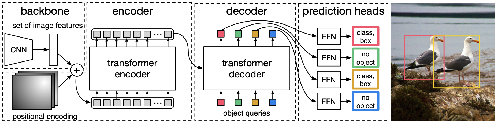

**Transformer decoder.** デコーダはTransformerの標準的なアーキテクチャに従い、マルチヘッドの自己注意およびエンコーダ・デコーダ注意メカニズムを使用して、サイズ $d$ の $N$ 個の埋め込みを変換する。オリジナルのTransformerとの違いは、我々のモデルが各デコーダレイヤーで $N$ 個のオブジェクトを並列にデコードすることである。一方、Vaswaniら [^47] は出力系列を一度に1要素ずつ予測する自己回帰モデルを使用している。概念に不慣れな読者は補足資料を参照されたい。デコーダも順列不変であるため、異なる結果を生成するには $N$ 個の入力埋め込みが異なる必要がある。これらの入力埋め込みは、オブジェクトクエリと呼ぶ学習された位置エンコーディングであり、エンコーダと同様に、それらを各アテンションレイヤーの入力に追加する。 $N$ 個のオブジェクトクエリは、デコーダによって出力埋め込みに変換される。それらはその後、フィードフォワードネットワーク（次のサブセクションで説明）によって独立してボックス座標とクラスラベルにデコードされ、 $N$ 個の最終予測が得られる。これらの埋め込みに対する自己注意およびエンコーダ・デコーダ注意を使用して、モデルは画像全体をコンテキストとして使用しながら、すべてのオブジェクト間のペアワイズな関係を利用してそれらをグローバルに推論する。

**Prediction feed-forward networks (FFNs).** 最終的な予測は、ReLU活性化関数と隠れ次元 $d$ を持つ3層のパーセプトロンと、1つの線形射影層によって計算される。FFNは入力画像に対するボックスの正規化された中心座標、高さ、および幅を予測し、線形層はソフトマックス関数を使用してクラスラベルを予測する。画像内の実際の関心オブジェクトの数よりも通常はるかに大きい固定サイズの $N$ 個のバウンディングボックスのセットを予測するため、スロット内にオブジェクトが検出されないことを表す追加の特別なクラスラベル $\emptyset$ が使用される。このクラスは、標準的な物体検出アプローチにおける「バックグラウンド（背景）」クラスと同様の役割を果たす。

**Auxiliary decoding losses.** 我々は、特にモデルが各クラスの正しい数のオブジェクトを出力するのを助けるために、訓練中のデコーダで補助損失（auxiliary losses）[^1] を使用することが役立つことを見出した。我々は各デコーダレイヤーの後に予測FFNとハンガリアン損失を追加する。すべての予測FFNはパラメータを共有する。我々は、異なるデコーダレイヤーから予測FFNへの入力を正規化するために、追加の共有レイヤー正規化（layer-norm）を使用する。

## 4 Experiments
我々は、COCOの定量評価においてDETRがFaster R-CNNと比較して競争力のある結果を達成することを示す。次に、アーキテクチャと損失の詳細なアブレーション（切除）調査を提供し、洞察と定性的な結果を示す。最後に、DETRが汎用性があり拡張可能なモデルであることを示すために、固定されたDETRモデルの上に小さな拡張部分のみを訓練し、パノプティックセグメンテーションの結果を提示する。実験を再現するためのコードと事前訓練済みモデルを https://github.com/facebookresearch/detr で提供する。

**Dataset.** 我々はCOCO 2017の検出およびパノプティックセグメンテーションデータセット [^24], [^18] で実験を行い、これには118kの訓練画像と5kの検証画像が含まれている。各画像にはバウンディングボックスとパノプティックセグメンテーションがアノテーションされている。画像あたり平均7つのインスタンスがあり、訓練セット内の単一の画像では最大63のインスタンスがあり、同じ画像上に小さなものから大きなものまで及んでいる。特に指定がない場合、我々は複数の閾値での積分メトリクスであるAPをbbox APとして報告する。Faster R-CNNとの比較では最後の訓練エポックでの検証APを報告し、アブレーションでは最後の10エポックからの検証結果の中央値を報告する。

**Technical details.** 我々はAdamW [^26] でDETRを訓練し、初期のTransformerの学習率を $10^{-4}$ 、バックボーンの学習率を $10^{-5}$ 、重み減衰を $10^{-4}$ に設定する。すべてのTransformerの重みはXavier初期化 [^11] で初期化され、バックボーンはバッチ正規化層が凍結されたtorchvisionからのImageNet事前訓練済みResNetモデル [^15] である。我々は2つの異なるバックボーン：ResNet-50とResNet-101を用いた結果を報告する。対応するモデルはそれぞれDETRとDETR-R101と呼ばれる。[^21] に従い、バックボーンの最後のステージにダイレーションを追加し、このステージの最初の畳み込みからストライドを削除することによって、特徴の解像度も向上させる。対応するモデルはそれぞれDETR-DC5およびDETR-DC5-R101（dilated C5 stage）と呼ばれる。この変更により解像度が2倍になり、小さなオブジェクトに対する性能が向上するが、エンコーダの自己注意におけるコストが16倍になり、全体で計算コストが2倍に増加するという代償を伴う。これらのモデルとFaster R-CNNのFLOPsの完全な比較は表1に示されている。

我々はスケール拡張を使用し、入力画像の最短辺が少なくとも480ピクセル、最大800ピクセルになり、最長辺が最大1333ピクセルになるようにリサイズする [^50]。エンコーダの自己注意を通じてグローバルな関係を学習するのを助けるために、訓練中にランダムクロップ拡張も適用し、パフォーマンスを約1 AP向上させる。具体的には、訓練画像は確率0.5でランダムな長方形のパッチにクロップされ、その後再び800-1333にリサイズされる。Transformerはデフォルトのドロップアウト0.1で訓練される。推論時、いくつかのスロットは空のクラスを予測する。APを最適化するために、これらのスロットの予測を2番目にスコアの高いクラスで上書きし、対応する信頼度を使用する。これにより、空のスロットをフィルタリングする場合と比較してAPが2ポイント向上する。その他の訓練ハイパーパラメータはセクションA.4に記載されている。我々のアブレーション実験では、1エポックがすべての訓練画像を1回通過することを意味する、200エポック後に学習率を10分の1に下げる300エポックの訓練スケジュールを使用する。ベースラインモデルを16台のV100 GPUで300エポック訓練するには3日かかり、GPUあたり4画像（つまり合計バッチサイズは64）である。Faster R-CNNと比較するために使用されるより長いスケジュールでは、400エポック後に学習率を下げて500エポック訓練する。このスケジュールは、短いスケジュールと比較して1.5 AP追加する。

### 4.1 Comparison with Faster R-CNN

Transformerは通常、AdamまたはAdagradオプティマイザを用いて、非常に長い訓練スケジュールとドロップアウトで訓練され、これはDETRにも当てはまる。しかし、Faster R-CNNは最小限のデータ拡張でSGDを用いて訓練されており、Adamやドロップアウトの成功例は我々は把握していない。これらの違いにもかかわらず、我々はFaster R-CNNのベースラインをより強力にしようと試みた。DETRと揃えるために、ボックス損失に一般化IoU [^38] を追加し、結果を向上させることが知られているのと同じランダムクロップ拡張と長時間の訓練を追加する [^13]。結果は表1に示されている。上段では、3xスケジュールで訓練されたモデルについて、Detectron2 Model Zoo [^50] からのFaster R-CNNの結果を示す。中段では、同じモデルであるが、9xスケジュール（109エポック）と説明された拡張機能で訓練された結果（「+」付き）を示しており、合計で1-2 AP追加されている。表1の最後のセクションでは、複数のDETRモデルの結果を示す。パラメータ数を比較可能にするために、幅256、8つのアテンションヘッドを持つ6つのTransformer（エンコーダ）と6つのデコーダ層からなるモデルを選択する。FPNを用いたFaster R-CNNと同様に、このモデルは41.3Mのパラメータを持ち、そのうち23.5MはResNet-50、17.8MはTransformerにある。Faster R-CNNもDETRも、より長い訓練でさらに向上する可能性が高いが、我々はDETRが同じパラメータ数でFaster R-CNNと競争力を持つことができ、COCO検証サブセットで42 APを達成すると結論付けることができる。DETRがこれを達成する方法は、 $\text{AP}_L$ を向上させる（+7.8）ことであるが、モデルは依然として $\text{AP}_S$ で遅れをとっている（-5.5）ことに注意。同じパラメータ数と同じようなFLOP数を持つDETR-DC5は、より高いAPを持つが、 $\text{AP}_S$ でもまだ大きく遅れをとっている。ResNet-101バックボーンを持つFaster R-CNNとDETRも同様の結果を示している。

表1: COCO検証セットにおけるResNet-50およびResNet-101バックボーンでのFaster R-CNNとの比較。上段はDetectron2 [^50] におけるFaster R-CNNモデルの結果を示し、中段はGIoU [^38]、ランダムクロップのテスト時拡張、および長い9x訓練スケジュールを用いたFaster R-CNNモデルの結果を示す。DETRモデルは、大きくチューニングされたFaster R-CNNのベースラインと同等の結果を達成し、 $\text{AP}_S$ は低いが $\text{AP}_L$ は大幅に向上している。FLOPSとFPSを測定するためにtorchscript化されたFaster R-CNNとDETRモデルを使用する。名前にR101が含まれない結果はResNet-50に対応する。

| Model | GFLOPS/FPS | #params | AP | AP50 | AP75 | APS | APM | APL |
| --- | --- | --- | --- | --- | --- | --- | --- | --- |
| Faster RCNN-DC5 | 320/16 | 166M | 39.0 | 60.5 | 42.3 | 21.4 | 43.5 | 52.5 |
| Faster RCNN-FPN | 180/26 | 42M | 40.2 | 61.0 | 43.8 | 24.2 | 43.5 | 52.0 |
| Faster RCNN-R101-FPN | 246/20 | 60M | 42.0 | 62.5 | 45.9 | 25.2 | 45.6 | 54.6 |
| Faster RCNN-DC5+ | 320/16 | 166M | 41.1 | 61.4 | 44.3 | 22.9 | 45.9 | 55.0 |
| Faster RCNN-FPN+ | 180/26 | 42M | 42.0 | 62.1 | 45.5 | 26.6 | 45.4 | 53.4 |
| Faster RCNN-R101-FPN+ | 246/20 | 60M | 44.0 | 63.9 | 47.8 | 27.2 | 48.1 | 56.0 |
| DETR | 86/28 | 41M | 42.0 | 62.4 | 44.2 | 20.5 | 45.8 | 61.1 |
| DETR-DC5 | 187/12 | 41M | 43.3 | 63.1 | 45.9 | 22.5 | 47.3 | 61.1 |
| DETR-R101 | 152/20 | 60M | 43.5 | 63.8 | 46.4 | 21.9 | 48.0 | 61.8 |
| DETR-DC5-R101 | 253/10 | 60M | 44.9 | 64.7 | 47.7 | 23.7 | 49.5 | 62.3 |

### 4.2 Ablations

Transformerデコーダ内の注意メカニズムは、異なる検出の特徴表現間の関係をモデル化する重要なコンポーネントである。我々のアブレーション分析では、アーキテクチャや損失の他のコンポーネントが最終的なパフォーマンスにどのように影響するかを探求する。この調査のために、6つのエンコーダ、6つのデコーダレイヤー、幅256を持つResNet-50ベースのDETRモデルを選択する。このモデルは41.3Mのパラメータを持ち、それぞれ短いスケジュールと長いスケジュールで40.6および42.0 APを達成し、同じバックボーンのFaster R-CNN-FPNと同様に28 FPSで実行される。

**Number of encoder layers.** 我々はエンコーダレイヤーの数を変更することによって、グローバルな画像レベルの自己注意の重要性を評価する（表2）。エンコーダレイヤーがない場合、全体的なAPは3.9ポイント低下し、大きなオブジェクトではさらに大きな6.0 APの低下が見られる。我々は、グローバルなシーン推論を使用することによって、エンコーダがオブジェクトを分離するために重要であるという仮説を立てる。図3において、訓練されたモデルの最後のエンコーダレイヤーの注意マップを視覚化し、画像内のいくつかの点に焦点を当てる。エンコーダはすでにインスタンスを分離しているようであり、これがおそらくデコーダにおけるオブジェクトの抽出とローカリゼーションを簡素化している。

表2: エンコーダのサイズの効果。各行はエンコーダ層の数が異なり、デコーダ層の数が固定されたモデルに対応する。エンコーダ層の数が増えるにつれて性能は徐々に向上する。

| #layers | GFLOPS/FPS | #params | AP | AP50 | APS | APM | APL |
| --- | --- | --- | --- | --- | --- | --- | --- |
| 0 | 76/28 | 33.4M | 36.7 | 57.4 | 16.8 | 39.6 | 54.2 |
| 3 | 81/25 | 37.4M | 40.1 | 60.6 | 18.5 | 43.8 | 58.6 |
| 6 | 86/23 | 41.3M | 40.6 | 61.6 | 19.9 | 44.3 | 60.2 |
| 12 | 95/20 | 49.2M | 41.6 | 62.1 | 19.8 | 44.9 | 61.9 |

**Number of decoder layers.** 我々は各デコーディング層の後に補助損失を適用しているため（セクション3.2を参照）、予測FFNは設計により各デコーダ層の出力からオブジェクトを予測するように訓練される。我々は、デコーディングの各段階で予測されるオブジェクトを評価することによって、各デコーダ層の重要性を分析する（図4）。APとAP50の両方がすべての層の後に向上し、最初の層と最後の層の間で合計で+8.2/9.5 APという非常に大きな向上が見られる。セットベースの損失を持つため、DETRは設計上NMSを必要としない。これを確認するために、各デコーダの後の出力に対して、デフォルトのパラメータ [^50] を用いて標準的なNMS手順を実行する。NMSは最初のデコーダからの予測のパフォーマンスを向上させる。これは、Transformerの単一のデコーディングレイヤーでは出力要素間の相互相関を計算できず、したがって同じオブジェクトに対して複数の予測を行う傾向があるという事実によって説明できる。2番目以降の層では、活性化に対する自己注意メカニズムにより、モデルは重複する予測を抑制することができる。我々は、深さが増すにつれてNMSがもたらす改善が減少することを観察した。最後の層では、NMSが真陽性（TP）の予測を誤って削除するため、APに小さな損失が見られる。

図3: 参照点のセットに対するエンコーダの自己注意。エンコーダは個々のインスタンスを分離することができる。予測は検証セット画像上でベースラインDETRモデルで行われた。

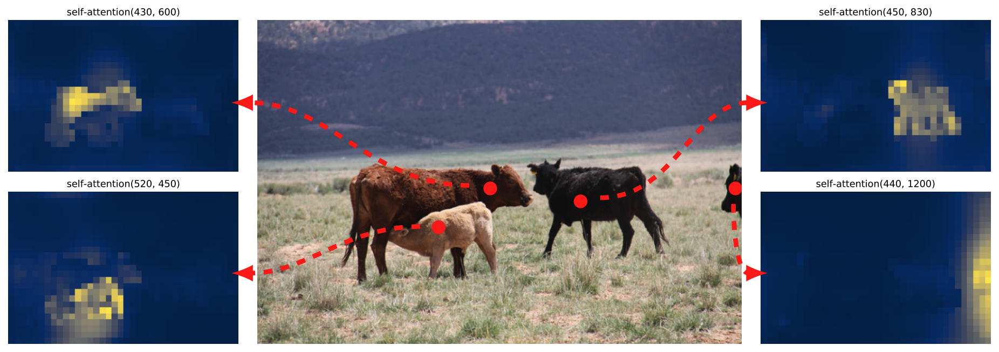

図4: 各デコーダ層の後のAPおよびAP50のパフォーマンス。単一の長いスケジュールのベースラインモデルが評価される。DETRは設計上NMSを必要とせず、これはこの図によって検証される。NMSは最後の層でAPを低下させTP予測を削除するが、最初のデコーダ層ではAPを向上させて二重予測を削除し（最初の層では通信がないため）、AP50をわずかに向上させる。

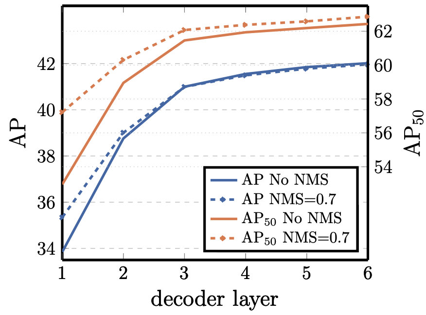

エンコーダの注意を視覚化するのと同様に、我々は図6でデコーダの注意を視覚化し、予測された各オブジェクトの注意マップを異なる色で色付けする。我々は、デコーダの注意がかなり局所的であることを観察し、これは主に頭や脚などのオブジェクトの端に注意を向けていることを意味する。我々は、エンコーダがグローバルな注意を介してインスタンスを分離した後、デコーダはクラスとオブジェクトの境界を抽出するために端に注意を向けるだけで済むと仮説を立てている。

**Importance of FFN.** Transformer内のFFNは $1 \times 1$ の畳み込み層と見なすことができ、これによりエンコーダはアテンション拡張畳み込みネットワーク（attention augmented convolutional networks）[^3] に類似したものになる。我々はこれを完全に取り除き、Transformerレイヤーにはアテンションのみを残すことを試みる。ネットワークのパラメータ数を41.3Mから28.7Mに減らし、Transformerに10.8Mのみを残すことで、パフォーマンスは2.3 AP低下する。したがって、良い結果を達成するためにはFFNが重要であると結論付ける。

**Importance of positional encodings.** 我々のモデルには2種類の位置エンコーディングがある：空間位置エンコーディングと出力位置エンコーディング（オブジェクトクエリ）である。我々は固定および学習済みエンコーディングのさまざまな組み合わせを実験し、結果は表3に示されている。出力位置エンコーディングは必須であり削除することはできないため、デコーダ入力で一度渡すか、すべてのデコーダアテンションレイヤーでクエリに追加するかのいずれかを実験する。最初の実験では、空間位置エンコーディングを完全に取り除き、出力位置エンコーディングを入力で渡す。興味深いことに、モデルは依然として32 AP以上を達成し、ベースラインに対して7.8 APの低下となる。次に、元のTransformer [^47] と同様に、固定された正弦（sine）空間位置エンコーディングと出力エンコーディングを入力で一度渡し、これが位置エンコーディングをアテンションに直接渡す場合と比較して1.4 APの低下をもたらすことを発見する。アテンションに渡された学習済み空間エンコーディングも同様の結果をもたらす。驚くべきことに、エンコーダに空間エンコーディングを全く渡さない場合、1.3 APというわずかなAP低下しか生じないことがわかった。我々がエンコーディングをアテンションに渡す場合、それらはすべての層にわたって共有され、出力エンコーディング（オブジェクトクエリ）は常に学習される。

図5: 稀なクラスに対する分布外への一般化。訓練セット内のどの画像にも13頭以上のキリンは存在しないが、DETRは同じクラスの24以上のインスタンスに難なく一般化する。

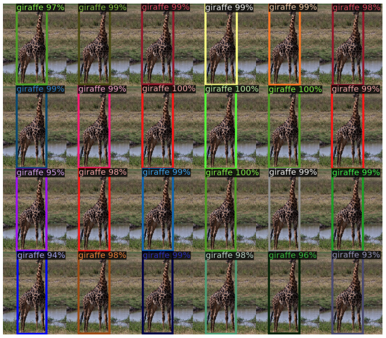

図6: 予測された各オブジェクトに対するデコーダの注意の視覚化（画像はCOCO検証セットより）。予測はDETR-DC5モデルで行われた。注意スコアは異なるオブジェクトに対して異なる色でコーディングされている。デコーダは通常、脚や頭などのオブジェクトの端に注意を向ける。カラーでの閲覧を推奨する。

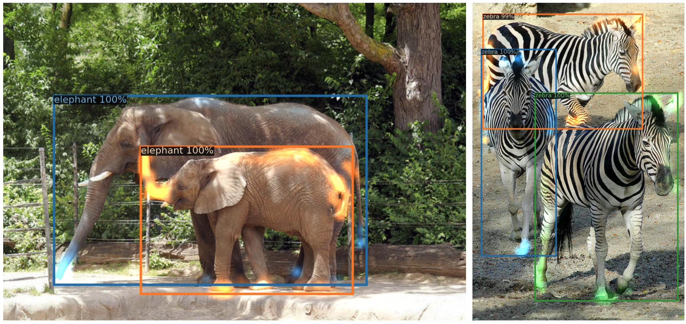

表3: ベースライン（最後の行）と比較した異なる位置エンコーディングの結果。ベースラインは、エンコーダとデコーダの両方ですべてのアテンションレイヤーに渡される固定の正弦位置エンコーディングを持つ。学習済み埋め込みはすべての層間で共有される。空間位置エンコーディングを使用しないとAPが大幅に低下する。興味深いことに、それらをデコーダにのみ渡すと、わずかなAPの低下しかもたらさない。これらのモデルはすべて学習済み出力位置エンコーディングを使用している。

| spatial pos. enc. | output pos. enc. | encoder | decoder | decoder | AP | $\Delta$ | AP50 | $\Delta$ |
| --- | --- | --- | --- | --- | --- | --- | --- | --- |
| none | none | learned at input | | | 32.8 | -7.8 | 55.2 | -6.5 |
| sine at input | sine at input | learned at input | | | 39.2 | -1.4 | 60.0 | -1.6 |
| learned at attn. | learned at attn. | learned at attn. | | | 39.6 | -1.0 | 60.7 | -0.9 |
| none | sine at attn. | learned at attn. | | | 39.3 | -1.3 | 60.3 | -1.4 |
| sine at attn. | sine at attn. | learned at attn. | | | 40.6 | - | 61.6 | - |

表4: APに対する損失のコンポーネントの効果。我々は $\ell_1$ 損失とGIoU損失をオフにして2つのモデルを訓練し、 $\ell_1$ はそれ単独では悪い結果をもたらすが、GIoUと組み合わせることで $\text{AP}_M$ と $\text{AP}_L$ を向上させることを観察した。我々のベースライン（最後の行）は両方の損失を組み合わせている。

| class | $\ell_1$ | GIoU | AP | $\Delta$ | AP50 | $\Delta$ | APS | APM | APL |
| --- | --- | --- | --- | --- | --- | --- | --- | --- | --- |
| X | X | | 35.8 | -4.8 | 57.3 | -4.4 | 13.7 | 39.8 | 57.9 |
| X | | X | 39.9 | -0.7 | 61.6 | 0 | 19.9 | 43.2 | 57.9 |
| X | X | X | 40.6 | - | 61.6 | - | 19.9 | 44.3 | 60.2 |

結合損失を持つベースラインに対して0.7 APしか失わず、モデルの性能の大部分を担っている。GIoUなしで $\ell_1$ を使用すると貧弱な結果を示す。我々は、異なる損失の単純なアブレーション（毎回同じ重み付けを使用する）のみを研究したが、それらを組み合わせる他の手段は異なる結果を達成するかもしれない。

図7: DETRデコーダの合計 $N = 100$ の予測スロットのうち20個について、COCO 2017 検証セットのすべての画像に対するすべてのボックス予測の視覚化。各ボックス予測は、各画像サイズによって正規化された1×1の正方形内の中心座標を持つ点として表される。点は色分けされており、緑色は小さなボックス、赤色は大きな水平方向のボックス、青色は大きな垂直方向のボックスに対応する。我々は、各スロットが複数の動作モードを備え、特定の領域とボックスサイズに特化するように学習することを観察する。ほぼすべてのスロットが、COCOデータセットで一般的な画像全体の大きなボックスを予測するモードを持っていることに注目する。

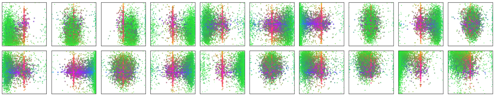

### 4.3 Analysis
**Decoder output slot analysis** 図7では、COCO 2017検証セットのすべての画像に対して、異なるスロットによって予測されたボックスを視覚化している。DETRは各クエリスロットごとに異なる特化を学習する。我々は、各スロットが異なる領域とボックスサイズに焦点を当てた複数の動作モードを持っていることを観察する。特に、すべてのスロットは画像全体にわたるボックスを予測するためのモードを持っている（プロットの中央に並んだ赤い点として見える）。我々は、これがCOCOにおけるオブジェクトの分布に関連していると仮説を立てている。

**Generalization to unseen numbers of instances.** COCOのいくつかのクラスは、同じ画像内に同じクラスの多くのインスタンスが存在することで十分に表現されていない。例えば、訓練セットには13頭以上のキリンがいる画像はない。DETRの一般化能力を検証するために、我々は合成画像を作成する（図5を参照）。我々のモデルは画像上の24頭のキリンすべてを見つけることができ、これは明らかに分布外である。この実験は、各オブジェクトクエリに強いクラス特化が存在しないことを確認するものである。

### 4.4 DETR for panoptic segmentation
パノプティックセグメンテーション（Panoptic segmentation）[^19] は最近、コンピュータビジョンコミュニティから多くの関心を集めている。Faster R-CNN [^37] からMask R-CNN [^14] への拡張と同様に、DETRはデコーダ出力の最上部にマスクヘッドを追加することで自然に拡張できる。このセクションでは、stuffクラスとthingクラスを統一された方法で扱うことにより、そのようなヘッドを使用してパノプティックセグメンテーション [^19] を生成できることを実証する。我々は、80のthingsカテゴリに加えて53のstuffカテゴリを持つCOCOデータセットのパノプティックアノテーションで実験を行う。

我々はDETRを訓練して、同じレシピを用いてCOCOのstuffクラスとthingsクラスの両方の周りのボックスを予測する。ハンガリアンマッチングはボックス間の距離を用いて計算されるため、訓練が可能になるためにはボックスの予測が必要である。また、予測された各ボックスに対してバイナリマスクを予測するマスクヘッドを追加する（図8を参照）。これは、各オブジェクトに対するTransformerデコーダの出力を入力として受け取り、エンコーダの出力にわたるこの埋め込みのマルチヘッド（ $M$ ヘッドを持つ）注意スコアを計算し、小さな解像度でオブジェクトごとに $M$ 個のアテンションヒートマップを生成する。最終的な予測を行い解像度を上げるために、FPNに似たアーキテクチャが使用される。アーキテクチャの詳細は補足で説明する。マスクの最終解像度はストライド4を持ち、各マスクはDICE/F-1損失 [^28] とFocal損失 [^23] を使用して独立して監督される。

マスクヘッドは、一緒に（jointly）訓練することも、あるいは2段階のプロセスで訓練することもできる。後者の場合、ボックスのためだけにDETRを訓練し、その後すべての重みを凍結してマスクヘッドだけを25エポック訓練する。実験的に、これら2つのアプローチは同様の結果をもたらすため、我々は総実行時間（wall-clock time）の訓練が短くなる後者の方法を使用した結果を報告する。

図8: パノプティックヘッドの図解。検出された各オブジェクトに対してバイナリマスクが並列に生成され、その後ピクセル単位のargmaxを用いてマスクがマージされる。

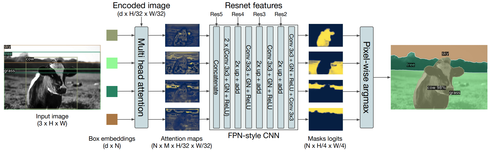

図9: DETR-R101によって生成されたパノプティックセグメンテーションの定性的な結果。DETRはthingsとstuffに対して統一された方法で整列したマスク予測を生成する。

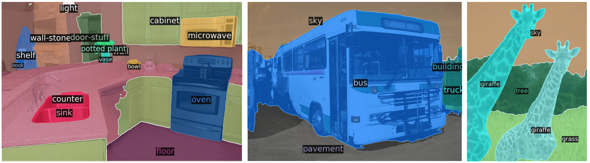

表5: COCO検証データセットにおける最先端手法UPSNet [^51] および Panoptic FPN [^18] との比較。我々は、公平な比較のために、DETRと同じデータ拡張を用いて18xスケジュールでPanopticFPNを再訓練した。UPSNetは1xスケジュールを使用し、UPSNet-Mはマルチスケールのテスト時拡張を備えたバージョンである。

| Model | Backbone | PQ | SQ | RQ | PQth | SQth | RQth | PQst | SQst | RQst | AP |
| --- | --- | --- | --- | --- | --- | --- | --- | --- | --- | --- | --- |
| PanopticFPN++ | R50 | 42.4 | 79.3 | 51.6 | 49.2 | 82.4 | 58.8 | 32.3 | 74.8 | 40.6 | 37.7 |
| UPSnet | R50 | 42.5 | 78.0 | 52.5 | 48.6 | 79.4 | 59.6 | 33.4 | 75.9 | 41.7 | 34.3 |
| UPSnet-M | R50 | 43.0 | 79.1 | 52.8 | 48.9 | 79.7 | 59.7 | 34.1 | 78.2 | 42.3 | 34.3 |
| PanopticFPN++ | R101 | 44.1 | 79.5 | 53.3 | 51.0 | 83.2 | 60.6 | 33.6 | 74.0 | 42.1 | 39.7 |
| DETR | R50 | 43.4 | 79.3 | 53.8 | 48.2 | 79.8 | 59.5 | 36.3 | 78.5 | 45.3 | 31.1 |
| DETR-DC5 | R50 | 44.6 | 79.8 | 55.0 | 49.4 | 80.5 | 60.6 | 37.3 | 78.7 | 46.5 | 31.9 |
| DETR-R101 | R101 | 45.1 | 79.9 | 55.5 | 50.5 | 80.9 | 61.7 | 37.0 | 78.5 | 46.0 | 33.0 |

最終的なパノプティックセグメンテーションを予測するために、各ピクセルでのマスクスコアに対してargmaxを使用し、結果として得られるマスクに対応するカテゴリを割り当てる。この手順は、最終的なマスクに重複がないことを保証し、したがってDETRは異なるマスクを整列させるためによく使用されるヒューリスティック [^19] を必要としない。

**Training details.** 我々は、DETR、DETR-DC5、およびDETR-R101モデルを訓練し、バウンディングボックス検出のレシピに従って、COCOデータセットのstuffクラスとthingsクラスの周りのボックスを予測する。新しいマスクヘッドは25エポック訓練される（詳細は補足を参照）。推論中、我々はまず信頼度が85%未満の検出を除外し、次にピクセル単位のargmaxを計算して各ピクセルがどのマスクに属するかを決定する。その後、同じstuffカテゴリの異なるマスク予測を一つにまとめ、空のもの（4ピクセル未満）を除外する。

**Main results.** 定性的な結果は図9に示されている。表5では、thingsとstuffを別々に扱ういくつかの確立された手法と、我々の統一されたパノプティックセグメンテーションアプローチを比較している。我々はパノプティック品質（Panoptic Quality: PQ）と、things（PQth）およびstuff（PQst）の内訳を報告する。また、（我々の場合、ピクセル単位のargmaxを取る前の）パノプティックの後処理を行う前の（thingsクラスで計算された）マスクAPも報告する。DETRがCOCO-val 2017において、公開されている結果だけでなく、我々の強力なPanopticFPNベースライン（公平な比較のためにDETRと同じデータ拡張で訓練されたもの）を上回ることを示す。結果の内訳は、DETRがstuffクラスで特に優れていることを示しており、エンコーダの注意によって可能になるグローバルな推論がこの結果の重要な要素であると我々は仮説を立てている。thingsクラスについては、マスクAPの計算においてベースラインと比較して最大8 mAPの深刻な不足があるにもかかわらず、DETRは競争力のあるPQthを獲得している。我々はまた、COCOデータセットのテストセットで我々の手法を評価し、46 PQを得た。我々のアプローチが、今後の研究においてパノプティックセグメンテーションのための完全に統一されたモデルの探求を刺激することを我々は望んでいる。

## 5 Conclusion
我々は、直接セット予測のためのTransformerと二部マッチング損失に基づく物体検出システムの新しい設計であるDETRを提案した[^52]。このアプローチは、困難なCOCOデータセットにおいて、最適化されたFaster R-CNNのベースラインと同等の結果を達成する[^52]。DETRは実装が簡単であり、パノプティックセグメンテーションへ簡単に拡張できる柔軟なアーキテクチャを持ち、競争力のある結果を示す[^52]。さらに、おそらく自己注意（self-attention）によって実行されるグローバル情報の処理のおかげで、大きなオブジェクトに対してFaster R-CNNよりも有意に優れた性能を達成する[^52]。

検出器のこの新しい設計は、特に小さなオブジェクトに対する訓練、最適化、および性能に関する新たな課題も伴う[^53]。現在の検出器は同様の問題に対処するために数年の改善を必要としたが、我々は今後の研究がDETRのためにこれらの問題にうまく対処することを期待している[^53]。

## 6 Acknowledgements
Sainbayar Sukhbaatar、Piotr Bojanowski、Natalia Neverova、David Lopez-Paz、Guillaume Lample、Danielle Rothermel、Kaiming He、Ross Girshick、Xinlei Chen、そしてFacebook AI Research Parisチーム全体のディスカッションとアドバイスに感謝する[^53]。彼らなしではこの研究は不可能であった[^53]。

## References

[^1]: Al-Rfou, R., Choe, D., Constant, N., Guo, M., Jones, L.: Character-level language modeling with deeper self-attention. In: AAAI Conference on Artificial Intelligence (2019)
[^2]: Bahdanau, D., Cho, K., Bengio, Y.: Neural machine translation by jointly learning to align and translate. In: ICLR (2015)
[^3]: Bello, I., Zoph, B., Vaswani, A., Shlens, J., Le, Q.V.: Attention augmented convolutional networks. In: ICCV (2019)
[^4]: Bodla, N., Singh, B., Chellappa, R., Davis, L.S.: Soft-NMS improving object detection with one line of code. In: ICCV (2017)
[^5]: Cai, Z., Vasconcelos, N.: Cascade R-CNN: High quality object detection and instance segmentation. PAMI (2019)
[^6]: Chan, W., Saharia, C., Hinton, G., Norouzi, M., Jaitly, N.: Imputer: Sequence modelling via imputation and dynamic programming. arXiv:2002.08926 (2020)
[^7]: Cordonnier, J.B., Loukas, A., Jaggi, M.: On the relationship between self-attention and convolutional layers. In: ICLR (2020)
[^8]: Devlin, J., Chang, M.W., Lee, K., Toutanova, K.: BERT: Pre-training of deep bidirectional transformers for language understanding. In: NAACL-HLT (2019)
[^9]: Erhan, D., Szegedy, C., Toshev, A., Anguelov, D.: Scalable object detection using deep neural networks. In: CVPR (2014)
[^10]: Ghazvininejad, M., Levy, O., Liu, Y., Zettlemoyer, L.: Mask-predict: Parallel decoding of conditional masked language models. arXiv:1904.09324 (2019)
[^11]: Glorot, X., Bengio, Y.: Understanding the difficulty of training deep feedforward neural networks. In: AISTATS (2010)
[^12]: Gu, J., Bradbury, J., Xiong, C., Li, V.O., Socher, R.: Non-autoregressive neural machine translation. In: ICLR (2018)
[^13]: He, K., Girshick, R., Dollár, P.: Rethinking imagenet pre-training. In: ICCV (2019)
[^14]: He, K., Gkioxari, G., Dollár, P., Girshick, R.B.: Mask R-CNN. In: ICCV (2017)
[^15]: He, K., Zhang, X., Ren, S., Sun, J.: Deep residual learning for image recognition. In: CVPR (2016)
[^16]: Hosang, J.H., Benenson, R., Schiele, B.: Learning non-maximum suppression. In: CVPR (2017)
[^17]: Hu, H., Gu, J., Zhang, Z., Dai, J., Wei, Y.: Relation networks for object detection. In: CVPR (2018)
[^18]: Kirillov, A., Girshick, R., He, K., Dollár, P.: Panoptic feature pyramid networks. In: CVPR (2019)
[^19]: Kirillov, A., He, K., Girshick, R., Rother, C., Dollar, P.: Panoptic segmentation. In: CVPR (2019)
[^20]: Kuhn, H.W.: The hungarian method for the assignment problem (1955)
[^21]: Li, Y., Qi, H., Dai, J., Ji, X., Wei, Y.: Fully convolutional instance-aware semantic segmentation. In: CVPR (2017)
[^22]: Lin, T.Y., Dollár, P., Girshick, R., He, K., Hariharan, B., Belongie, S.: Feature pyramid networks for object detection. In: CVPR (2017)
[^23]: Lin, T.Y., Goyal, P., Girshick, R.B., He, K., Dollár, P.: Focal loss for dense object detection. In: ICCV (2017)
[^24]: Lin, T.Y., Maire, M., Belongie, S., Hays, J., Perona, P., Ramanan, D., Dollár, P., Zitnick, C.L.: Microsoft COCO: Common objects in context. In: ECCV (2014)
[^25]: Liu, W., Anguelov, D., Erhan, D., Szegedy, C., Reed, S.E., Fu, C.Y., Berg, A.C.: Ssd: Single shot multibox detector. In: ECCV (2016)
[^26]: Loshchilov, I., Hutter, F.: Decoupled weight decay regularization. In: ICLR (2017)
[^27]: Lüscher, C., Beck, E., Irie, K., Kitza, M., Michel, W., Zeyer, A., Schlüter, R., Ney, H.: Rwth asr systems for librispeech: Hybrid vs attention - w/o data augmentation. arXiv:1905.03072 (2019)
[^28]: Milletari, F., Navab, N., Ahmadi, S.A.: V-net: Fully convolutional neural networks for volumetric medical image segmentation. In: 3DV (2016)
[^29]: Oord, A.v.d., Li, Y., Babuschkin, I., Simonyan, K., Vinyals, O., Kavukcuoglu, K., Driessche, G.v.d., Lockhart, E., Cobo, L.C., Stimberg, F., et al.: Parallel wavenet: Fast high-fidelity speech synthesis. arXiv:1711.10433 (2017)
[^30]: Park, E., Berg, A.C.: Learning to decompose for object detection and instance segmentation. arXiv:1511.06449 (2015)
[^31]: Parmar, N., Vaswani, A., Uszkoreit, J., Kaiser, L., Shazeer, N., Ku, A., Tran, D.: Image transformer. In: ICML (2018)
[^32]: Paszke, A., Gross, S., Massa, F., Lerer, A., Bradbury, J., Chanan, G., Killeen, T., Lin, Z., Gimelshein, N., Antiga, L., Desmaison, A., Kopf, A., Yang, E., DeVito, Z., Raison, M., Tejani, A., Chilamkurthy, S., Steiner, B., Fang, L., Bai, J., Chintala, S.: Pytorch: An imperative style, high-performance deep learning library. In: NeurIPS (2019)
[^33]: Pineda, L., Salvador, A., Drozdzal, M., Romero, A.: Elucidating image-to-set prediction: An analysis of models, losses and datasets. arXiv:1904.05709 (2019)
[^34]: Radford, A., Wu, J., Child, R., Luan, D., Amodei, D., Sutskever, I.: Language models are unsupervised multitask learners (2019)
[^35]: Redmon, J., Divvala, S., Girshick, R., Farhadi, A.: You only look once: Unified, real-time object detection. In: CVPR (2016)
[^36]: Ren, M., Zemel, R.S.: End-to-end instance segmentation with recurrent attention. In: CVPR (2017)
[^37]: Ren, S., He, K., Girshick, R.B., Sun, J.: Faster R-CNN: Towards real-time object detection with region proposal networks. PAMI (2015)
[^38]: Rezatofighi, H., Tsoi, N., Gwak, J., Sadeghian, A., Reid, I., Savarese, S.: Generalized intersection over union. In: CVPR (2019)
[^39]: Rezatofighi, S.H., Kaskman, R., Motlagh, F.T., Shi, Q., Cremers, D., Leal-Taixé, L., Reid, I.: Deep perm-set net: Learn to predict sets with unknown permutation and cardinality using deep neural networks. arXiv:1805.00613 (2018)
[^40]: Rezatofighi, S.H., Milan, A., Abbasnejad, E., Dick, A., Reid, I., Kaskman, R., Cremers, D., Leal-Taix, l.: Deepsetnet: Predicting sets with deep neural networks. In: ICCV (2017)
[^41]: Romera-Paredes, B., Torr, P.H.S.: Recurrent instance segmentation. In: ECCV (2015)
[^42]: Salvador, A., Bellver, M., Baradad, M., Marqués, F., Torres, J., Giró, X.: Recurrent neural networks for semantic instance segmentation. arXiv:1712.00617 (2017)
[^43]: Stewart, R.J., Andriluka, M., Ng, A.Y.: End-to-end people detection in crowded scenes. In: CVPR (2015)
[^44]: Sutskever, I., Vinyals, O., Le, Q.V.: Sequence to sequence learning with neural networks. In: NeurIPS (2014)
[^45]: Synnaeve, G., Xu, Q., Kahn, J., Grave, E., Likhomanenko, T., Pratap, V., Sriram, A., Liptchinsky, V., Collobert, R.: End-to-end ASR: from supervised to semi-supervised learning with modern architectures. arXiv:1911.08460 (2019)
[^46]: Tian, Z., Shen, C., Chen, H., He, T.: FCOS: Fully convolutional one-stage object detection. In: ICCV (2019)
[^47]: Vaswani, A., Shazeer, N., Parmar, N., Uszkoreit, J., Jones, L., Gomez, A.N., Kaiser, L., Polosukhin, I.: Attention is all you need. In: NeurIPS (2017)
[^48]: Vinyals, O., Bengio, S., Kudlur, M.: Order matters: Sequence to sequence for sets. In: ICLR (2016)
[^49]: Wang, X., Girshick, R.B., Gupta, A., He, K.: Non-local neural networks. In: CVPR (2018)
[^50]: Wu, Y., Kirillov, A., Massa, F., Lo, W.Y., Girshick, R.: Detectron2. https://github.com/facebookresearch/detectron2 (2019)
[^51]: Xiong, Y., Liao, R., Zhao, H., Hu, R., Bai, M., Yumer, E., Urtasun, R.: Upsnet: A unified panoptic segmentation network. In: CVPR (2019)
[^52]: Zhang, S., Chi, C., Yao, Y., Lei, Z., Li, S.Z.: Bridging the gap between anchor-based and anchor-free detection via adaptive training sample selection. arXiv:1912.02424 (2019)
[^53]: Zhou, X., Wang, D., Krähenbühl, P.: Objects as points. arXiv:1904.07850 (2019)

# A Appendix
## A.1 Preliminaries: Multi-head attention layers
我々のモデルはTransformerアーキテクチャに基づいているため、網羅性のために我々が使用する注意（attention）メカニズムの一般的な形式をここで再確認する[^67]。注意メカニズムは [^47] に従うが、位置エンコーディングの詳細（式8を参照）については [^7] に従う[^67]。

**Multi-head** 次元 $d$ の $M$ 個のヘッドを持つマルチヘッド注意（multi-head attention）の一般的な形式は、以下のシグネチャを持つ関数である（ $d' = d/M$ を使用し、下括弧で行列/テンソルのサイズを示す）[^67]：

```math
\text{mh-attn} : \underbrace{X_q}_{d \times N_q}, \underbrace{X_{kv}}_{d \times N_{kv}}, \underbrace{T}_{M \times 3 \times d' \times d}, \underbrace{L}_{d \times d} \mapsto \underbrace{\tilde{X}_q}_{d \times N_q} \quad (3)
```

ここで、 $X_q$ は長さ $N_q$ のクエリ系列、 $X_{kv}$ は長さ $N_{kv}$ のキー・バリュー系列（説明を簡単にするため、同じチャネル数 $d$ を持つとする）、 $T$ はクエリ、キー、およびバリューの埋め込みを計算するための重みテンソル、 $L$ は射影行列である[^68]。

出力はクエリ系列と同じサイズである[^69]。詳細を述べる前に語彙を固定しておくと、マルチヘッド自己注意（multi-head self-attention: mh-s-attn）は $X_q = X_{kv}$ の特殊なケースである。すなわち、

```math
\text{mh-s-attn}(X, T, L) = \text{mh-attn}(X, X, T, L). \quad (4)
```

マルチヘッド注意は、単純に $M$ 個の単一の注意ヘッドの連結と、それに続く $L$ による射影である[^69]。一般的な慣行 [^47] では、残差接続（residual connections）、ドロップアウト（dropout）、およびレイヤー正規化（layer normalization）を使用する[^69]。言い換えれば、 $\tilde{X}_q = \text{mh-attn}(X_q, X_{kv}, T, L)$ とし、 $\bar{X}^{(q)}$ を注意ヘッドの連結とすると、次のようになる[^69]。

```math
X'_q = [\text{attn}(X_q, X_{kv}, T_1); ...; \text{attn}(X_q, X_{kv}, T_M)] \quad (5)
```

```math
\tilde{X}_q = \text{layernorm}(X_q + \text{dropout}(L X'_q)), \quad (6)
```

ここで $[;]$ はチャネル軸における連結を表す[^69]。

**Single head** 重みテンソル $T' \in \mathbb{R}^{3 \times d' \times d}$ を持つ注意ヘッドは $\text{attn}(X_q, X_{kv}, T')$ と表記され、追加の位置エンコーディング $P_q \in \mathbb{R}^{d \times N_q}$ と $P_{kv} \in \mathbb{R}^{d \times N_{kv}}$ に依存する[^69], [^70]。それは、クエリとキーの位置エンコーディングを加算した後に、いわゆるクエリ、キー、およびバリューの埋め込みを計算することから始まる [^7]:

```math
[Q; K; V] = [T'_1(X_q + P_q); T'_2(X_{kv} + P_{kv}); T'_3 X_{kv}] \quad (7)
```

ここで $T'$ は $T'_1, T'_2, T'_3$ の連結である[^70]。次に、クエリとキーの間の内積のソフトマックスに基づいて注意の重み $\alpha$ が計算され、クエリ系列の各要素がキー・バリュー系列のすべての要素に注意を向けるようにする（ $i$ はクエリのインデックス、 $j$ はキー・バリューのインデックスである）[^70]：

```math
\alpha_{i,j} = \frac{e^{\frac{1}{\sqrt{d'}} Q_i^\top K_j}}{Z_i} \quad \text{where} \quad Z_i = \sum_{j=1}^{N_{kv}} e^{\frac{1}{\sqrt{d'}} Q_i^\top K_j}. \quad (8)
```

我々の場合、位置エンコーディングは学習されるか固定されるかのいずれかであるが、特定のクエリ/キー・バリュー系列に対してすべての注意レイヤーで共有されるため、注意のパラメータとして明示的に記述しない[^71]。それらの正確な値に関する詳細は、エンコーダとデコーダを説明する際に提供する[^71]。最終出力は、注意の重みによって重み付けされたバリューの集約である[^71]。 $i$ 番目の行は次のように与えられる： $\text{attn}_i(X_q, X_{kv}, T') = \sum_{j=1}^{N_{kv}} \alpha_{i,j} V_j$ [^71]。

**Feed-forward network (FFN) layers** オリジナルのTransformerは、マルチヘッド注意と、事実上の多層1x1畳み込みであるいわゆるFFNレイヤーを交互に配置しており [^47]、我々の場合これらは $Md$ 個の入力および出力チャネルを持つ[^72]。我々が検討するFFNは、ReLU活性化関数を伴う2層の1x1畳み込みで構成されている[^72]。式6と同様に、2つの層の後には残差接続/ドロップアウト/レイヤー正規化も存在する[^72]。

## A.2 Losses
完全を期すために、我々のアプローチで使用される損失について詳細に提示する[^72]。すべての損失は、バッチ内のオブジェクトの数によって正規化される[^72]。分散学習においては特別な注意が必要である。各GPUはサブバッチを受け取るため、一般的なサブバッチはGPU間でバランスが取れていないことから、ローカルバッチ内のオブジェクト数による正規化では不十分である[^72]。代わりに、すべてのサブバッチにおけるオブジェクトの総数によって正規化することが重要である[^72]。

**Box loss** [^41], [^36] と同様に、我々は損失においてIntersection over Unionのソフトバージョンを使用し、同時に $\hat{b}_i$ に対する $\ell_1$ 損失を使用する[^73]：

```math
\mathcal{L}_{\text{box}}(b_{\sigma(i)}, \hat{b}_i) = \lambda_{\text{iou}}\mathcal{L}_{\text{iou}}(b_{\sigma(i)}, \hat{b}_i) + \lambda_{\text{L1}}||b_{\sigma(i)} - \hat{b}_i||_1 , \quad (9)
```

ここで $\lambda_{\text{iou}}, \lambda_{\text{L1}} \in \mathbb{R}$ はハイパーパラメータであり、 $\mathcal{L}_{\text{iou}}(\cdot)$ は一般化IoU（Generalized IoU）[^38] である[^73]：

```math
\mathcal{L}_{\text{iou}}(b_{\sigma(i)}, \hat{b}_i) = 1 - \left( \frac{|b_{\sigma(i)} \cap \hat{b}_i|}{|b_{\sigma(i)} \cup \hat{b}_i|} - \frac{|B(b_{\sigma(i)}, \hat{b}_i) \setminus b_{\sigma(i)} \cup \hat{b}_i|}{|B(b_{\sigma(i)}, \hat{b}_i)|} \right) . \quad (10)
```

$|\cdot|$ は「面積」を意味し、ボックスの座標の和集合および積集合はボックス自体の略記として使用される[^73]。和集合や積集合の面積は、 $b_{\sigma(i)}$ と $\hat{b}_i$ の線形関数の最小値/最大値（min/max）によって計算され、これにより損失は確率的勾配に対して十分に振る舞いが良くなる[^73]。 $B(b_{\sigma(i)}, \hat{b}_i)$ は $b_{\sigma(i)}$ と $\hat{b}_i$ を包含する最大のボックスを意味する（ $B$ に関わる面積も、ボックスの座標の線形関数の最小値/最大値に基づいて計算される）[^74]。

**DICE/F-1 loss [^28]** DICE係数はIntersection over Unionと密接に関連している[^74]。モデルの生の予測マスクロジットを $\hat{m}$ とし、バイナリのターゲットマスクを $m$ とすると、損失は次のように定義される[^74]：

```math
\mathcal{L}_{\text{DICE}}(m, \hat{m}) = 1 - \frac{2m\sigma(\hat{m}) + 1}{\sigma(\hat{m}) + m + 1} \quad (11)
```

ここで $\sigma$ はシグモイド関数である[^74]。この損失はオブジェクトの数によって正規化される[^74]。

## A.3 Detailed architecture
位置エンコーディングがすべての注意レイヤーに渡される、DETRで使用されるTransformerの詳細な説明は図10に示されている[^75]。CNNバックボーンからの画像特徴量は、すべてのマルチヘッド自己注意レイヤーでクエリとキーに追加される空間位置エンコーディングとともにTransformerエンコーダを通過する[^75]。次に、デコーダはクエリ（最初はゼロに設定される）、出力位置エンコーディング（オブジェクトクエリ）、およびエンコーダのメモリを受け取り、複数のマルチヘッド自己注意とデコーダ・エンコーダ注意を介して、予測されたクラスラベルとバウンディングボックスの最終的なセットを生成する[^75]。最初のデコーダレイヤーにおける最初の自己注意レイヤーはスキップすることができる[^75]。

図10: DETRのTransformerのアーキテクチャ。詳細はセクションA.3を参照。

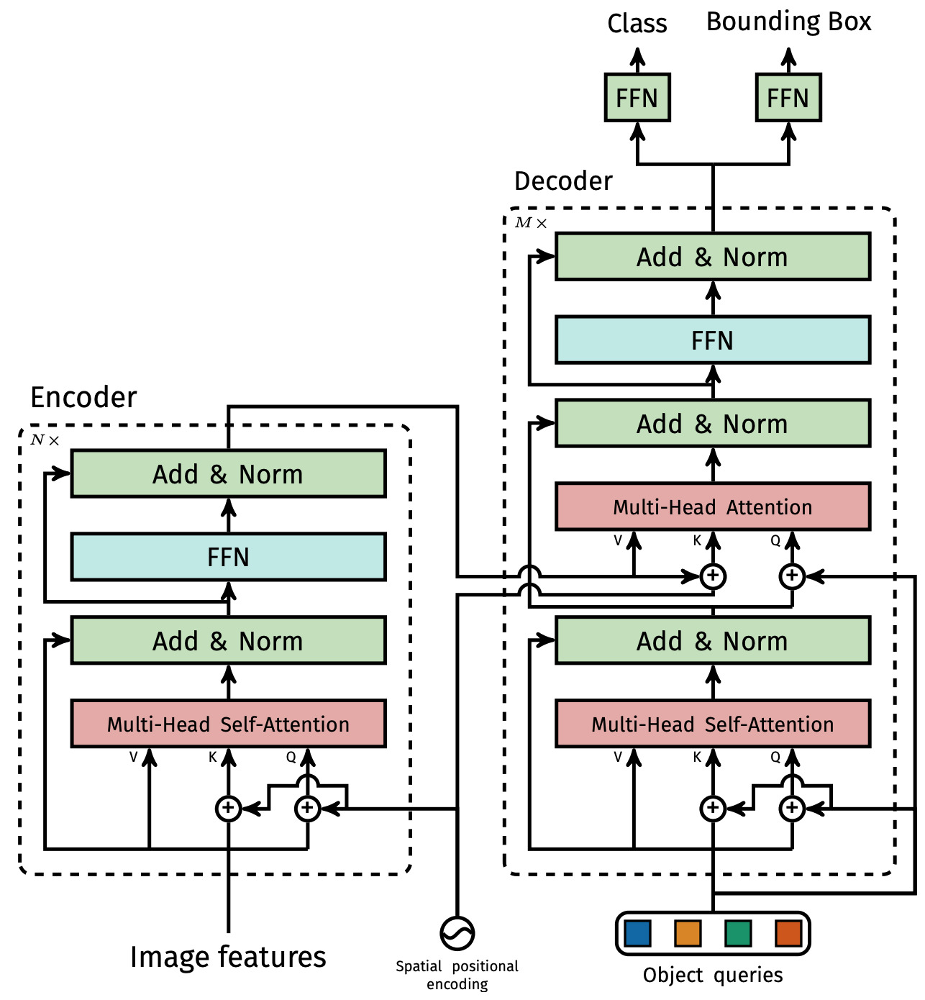

**Computational complexity** エンコーダ内の各自己注意は $\mathcal{O}(d^2HW + d(HW)^2)$ の計算量を持つ[^76]。 $\mathcal{O}(d'd)$ は単一のクエリ/キー/バリューの埋め込みを計算するコストであり（かつ $Md' = d$ ）、一方 $\mathcal{O}(d'(HW)^2)$ は1つのヘッドの注意の重みを計算するコストである[^76]。その他の計算は無視できる[^76]。デコーダにおいて、各自己注意は $\mathcal{O}(d^2N + dN^2)$ であり、エンコーダとデコーダの間の交差注意（cross-attention）は $\mathcal{O}(d^2(N + HW) + dNHW)$ であるが、実際には $N \ll HW$ であるためエンコーダよりもはるかに低い計算量となる[^76]。

**FLOPS computation** Faster R-CNNのFLOPSは画像内の提案数に依存することを考慮し、我々はCOCO 2017検証セットにおける最初の100画像の平均FLOPS数を報告する[^77]。我々はDetectron2 [^50] のツール `flop_count_operators` を使用してFLOPSを計算する[^77]。Detectron2のモデルに対しては変更なしでこれを使用し、DETRのモデルについてはバッチ行列乗算（bmm）を考慮するようにこれを拡張する[^77]。

## A.4 Training hyperparameters
我々は重み減衰（weight decay）の処理が改善されたAdamW [^26] を用いて、それを $10^{-4}$ に設定してDETRを訓練する[^77]。また、最大勾配ノルムを $0.1$ とした勾配クリッピングも適用する[^77]。バックボーンとTransformerはわずかに異なって扱われるため、次に両方の詳細について説明する[^77]。

**Backbone** TorchvisionからImageNetで事前訓練されたバックボーンResNet-50をインポートし、最後の分類レイヤーを破棄する[^78]。物体検出で広く採用されている慣行に従い、バックボーンのバッチ正規化の重みと統計量は訓練中に凍結される[^78]。我々は $10^{-5}$ の学習率を使用してバックボーンをファインチューニングする[^78]。バックボーンの学習率をネットワークの残りの部分よりもおおよそ1桁小さくすることが、特に最初の数エポックにおいて訓練を安定させるために重要であることを我々は観察した[^78]。

**Transformer** 我々はTransformerを $10^{-4}$ の学習率で訓練する[^79]。レイヤー正規化の前のすべてのマルチヘッド注意およびFFNの後に、 $0.1$ の加法的なドロップアウト（additive dropout）が適用される[^79]。重みはXavier初期化を用いてランダムに初期化される[^79]。

**Losses** バウンディングボックス回帰のために、それぞれ $\lambda_{\text{L1}} = 5$ と $\lambda_{\text{iou}} = 2$ の重みを持つ $\ell_1$ 損失とGIoU損失の線形結合を使用する[^79]。すべてのモデルは $N = 100$ のデコーダクエリスロットで訓練された[^79]。

**Baseline** 我々の強化されたFaster-RCNN+ベースラインは、バウンディングボックス回帰のために標準的な $\ell_1$ 損失とともにGIoU [^38] 損失を使用する[^79]。損失のための最適な重みを見つけるためにグリッドサーチを実行し、最終的なモデルは、ボックスおよび提案の回帰タスクに対してそれぞれ20と1の重みを持つGIoU損失のみを使用する[^79]。ベースラインについて、我々はDETRで使用されたのと同じデータ拡張を採用し、9xスケジュール（約109エポック）で訓練する[^79]。その他のすべての設定は、Detectron2モデルズー [^50] にある同じモデルと同一である[^79]。

**Spatial positional encoding** エンコーダのアクティベーションは、画像特徴量の対応する空間位置と関連付けられる[^80]。我々のモデルでは、これらの空間位置を表現するために固定された絶対的エンコーディングを使用する[^80]。オリジナルのTransformer [^47] のエンコーディングを2Dの場合に一般化したもの [^31] を採用する[^80]。具体的には、各埋め込みの両方の空間座標に対して、異なる周波数を持つ $d/2$ 個の正弦（sine）関数と余弦（cosine）関数を独立して使用する[^80]。その後、それらを連結して最終的な $d$ チャネルの位置エンコーディングを取得する[^80]。

## A.5 Additional results
DETR-R101モデルのパノプティック予測に関するいくつかの追加の定性的な結果が図11に示されている[^81]。

図11: パノプティック予測の比較。左から右へ：グラウンドトゥルース、ResNet 101を用いたPanopticFPN、ResNet 101を用いたDETR。(a) オブジェクトが重なっている失敗例。PanopticFPNは1機の飛行機を完全に見逃しているが、DETRはそれらのうち3機を正確にセグメント化できていない。(b) Thingsのマスクはフル解像度で予測され、PanopticFPNよりもシャープな境界を可能にする。

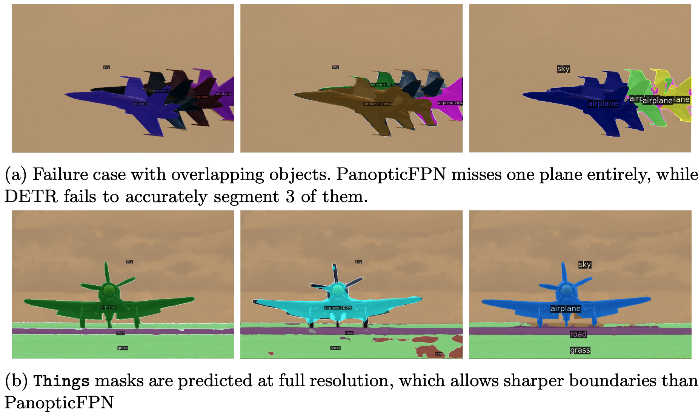

**Increasing the number of instances** 設計上、DETRはそれが持つクエリスロット（我々の実験では100）よりも多くのオブジェクトを予測することはできない[^81]。このセクションでは、この限界に近づいた際のDETRの振る舞いを分析する[^81]。我々は与えられたクラスの標準的な正方形の画像を選択し、それを10x10のグリッド上で繰り返し、モデルによって見逃されたインスタンスの割合を計算する[^81]。100未満のインスタンスでモデルをテストするために、セルの一部をランダムにマスクする[^81]。これにより、見えている数がいくつであっても、オブジェクトの絶対サイズは同じであることが保証される[^81]。マスキングのランダム性を考慮するために、異なるマスクで実験を100回繰り返す[^81]。結果は図12に示されている[^81]。クラス間で振る舞いは類似しており、最大50のインスタンスが見えている場合はモデルはすべてのインスタンスを検出するが、その後飽和し始め、ますます多くのインスタンスを見逃すようになる[^81]。注目すべきことに、画像に100すべてのインスタンスが含まれている場合、モデルは平均して30しか検出せず、これはすべてが検出される50のインスタンスのみが画像に含まれている場合よりも少ない[^81]。モデルのこの直感に反する振る舞いはおそらく、画像と検出が訓練分布から大きく外れているためである[^81]。

図12: 画像内にいくつ存在するかによってDETRが見逃した様々なクラスのインスタンス数の分析。我々は平均と標準偏差を報告する。インスタンスの数が100に近づくにつれて、DETRは飽和し始め、ますます多くのオブジェクトを見逃すようになる。

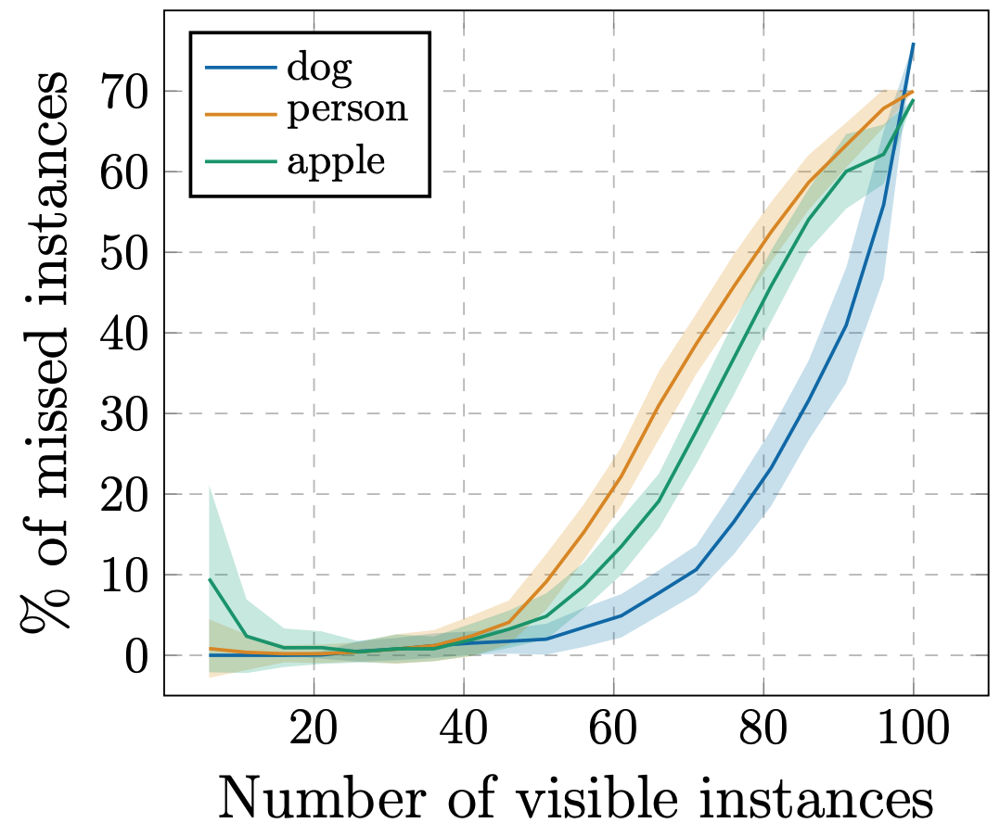

## A.6 PyTorch inference code
このアプローチのシンプルさを実証するために、リスト1にPyTorchおよびTorchvisionライブラリを用いた推論コードを含める[^82]。コードはPython 3.6+、PyTorch 1.4、およびTorchvision 0.5で動作する[^82]。バッチ処理をサポートしていないため、推論用、またはGPUごとに1つの画像を用いるDistributedDataParallelでの訓練用にのみ適していることに注意[^82]。また、明確さのために、このコードではエンコーダにおいて固定された位置エンコーディングの代わりに学習済みの位置エンコーディングを使用しており、位置エンコーディングは各Transformerレイヤーではなく入力のみに追加されていることに注意[^82]。これらの変更を行うにはPyTorchのTransformerの実装を超える必要があり、それが可読性を妨げるからである[^82]。実験を再現するための完全なコードは、カンファレンスの前に公開される予定である[^82]。

```python
import torch
from torch import nn
from torchvision.models import resnet50

class DETR(nn.Module):

    def __init__(self, num_classes, hidden_dim, nheads,
                 num_encoder_layers, num_decoder_layers):
        super().__init__()
        # We take only convolutional layers from ResNet-50 model
        self.backbone = nn.Sequential(*list(resnet50(pretrained=True).children())[:-2])
        self.conv = nn.Conv2d(2048, hidden_dim, 1)
        self.transformer = nn.Transformer(hidden_dim, nheads,
                                          num_encoder_layers, num_decoder_layers)
        self.linear_class = nn.Linear(hidden_dim, num_classes + 1)
        self.linear_bbox = nn.Linear(hidden_dim, 4)
        self.query_pos = nn.Parameter(torch.rand(100, hidden_dim))
        self.row_embed = nn.Parameter(torch.rand(50, hidden_dim // 2))
        self.col_embed = nn.Parameter(torch.rand(50, hidden_dim // 2))

    def forward(self, inputs):
        x = self.backbone(inputs)
        h = self.conv(x)
        H, W = h.shape[-2:]
        pos = torch.cat([
            self.col_embed[:W].unsqueeze(0).repeat(H, 1, 1),
            self.row_embed[:H].unsqueeze(1).repeat(1, W, 1),
        ], dim=-1).flatten(0, 1).unsqueeze(1)
        h = self.transformer(pos + h.flatten(2).permute(2, 0, 1),
                             self.query_pos.unsqueeze(1))
        return self.linear_class(h), self.linear_bbox(h).sigmoid()

detr = DETR(num_classes=91, hidden_dim=256, nheads=8, num_encoder_layers=6, num_decoder_layers=6)
detr.eval()
inputs = torch.randn(1, 3, 800, 1200)
logits, bboxes = detr(inputs)
```

リスト1: DETRのPyTorch推論コード。明確さのために、エンコーダにおいて固定された位置エンコーディングの代わりに学習済みの位置エンコーディングを使用しており、位置エンコーディングは各Transformerレイヤーではなく入力のみに追加されている。これらの変更を行うにはPyTorchのTransformerの実装を超える必要があり、可読性を妨げるからである。実験を再現するための完全なコードは、カンファレンスの前に公開される予定である。
