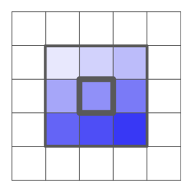
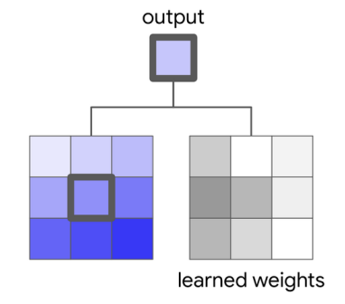
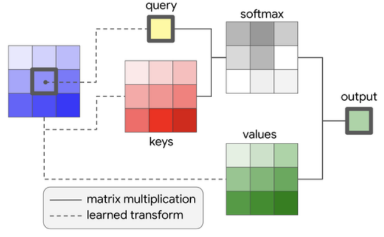
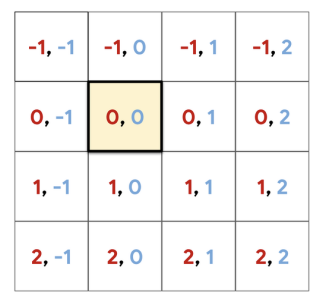
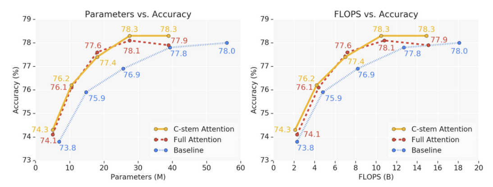

# Stand-Alone Self-Attention in Vision Models

Prajit Ramachandran∗ Niki Parmar∗ Ashish Vaswani∗
Irwan Bello Anselm Levskaya† Jonathon Shlens
Google Research, Brain Team {prajit, nikip, avaswani}@google.com

## Abstract

畳み込みは現代のコンピュータビジョンシステムの基本的な構成要素である。近年のアプローチでは、長距離の依存関係を捉えるために畳み込みを超えることが主張されている。これらの取り組みは、多くの視覚タスクで性能を向上させるために、自己注意（self-attention）や非局所平均（non-local means）といったコンテンツベースの相互作用で畳み込みモデルを拡張することに焦点を当てている。そこで生じる自然な疑問は、注意機構（attention）が単なる畳み込みの上の拡張としてではなく、視覚モデルの独立した（スタンドアロンな）プリミティブになり得るかどうかである。純粋な自己注意視覚モデルを開発およびテストする中で、自己注意が実際に効果的なスタンドアロンの層になり得ることを検証する。ResNetモデルに適用されている空間的畳み込みのすべてのインスタンスを、ある形式の自己注意に置き換えるという単純な手順により、ImageNet分類においてベースラインを上回りつつ、FLOPSを12%、パラメータ数を29%削減した完全な自己注意モデルが生成される。COCO物体検出において、純粋な自己注意モデルはベースラインのRetinaNetのmAPに匹敵しつつ、FLOPSを39%、パラメータ数を34%削減する。詳細なアブレーション研究により、自己注意は後半の層で使用された場合に特に効果的であることが示される。これらの結果は、スタンドアロンな自己注意が視覚研究者のツールボックスにおける重要な追加要素であることを確立する。

## 1 Introduction

デジタル画像処理は、ピクセル化された画像に畳み込み的に適用される手作りの線形フィルタが、多様なアプリケーションに役立つかもしれないという認識から生じた[^1]。デジタル画像処理の成功や生物学的考慮[^2], [^3] は、画像上の表現を学習するためのパラメータ効率の良いアーキテクチャを提供するために、ニューラルネットワークの初期の研究者たちに畳み込み表現を利用するよう促した[^4], [^5]。
大規模データセット[^6] と計算リソース[^7] の出現により、畳み込みニューラルネットワーク（CNN）は多くのコンピュータビジョンアプリケーションのバックボーンとなった[^8], [^9], [^10]。ディープラーニングの分野は、今度は画像認識[^11], [^12], [^13], [^14], [^15], [^16]、物体検出[^17], [^18], [^19]、画像セグメンテーション[^20], [^21], [^22] の性能を向上させるためのCNNのアーキテクチャ設計に大きくシフトした。畳み込みの並進等変性の性質は、画像操作の構成要素としてそれを採用する強い動機を提供してきた[^23], [^24]。しかしながら、大きな受容野に対するスケーリング特性が悪いため、畳み込みにおいて長距離の相互作用を捉えることは困難である。

長距離の相互作用の問題は、配列モデリングにおいて注意機構を用いることで取り組まれてきた。注意機構は言語モデリング[^25], [^26]、音声認識[^27], [^28]、ニューラルキャプショニング[^29] などのタスクで豊かな成功を収めている。最近では、注意モジュールが識別的コンピュータビジョンモデルに採用され、従来のCNNの性能を押し上げている。最も顕著なのは、Squeeze-Exciteと呼ばれるチャネルベースの注意メカニズムであり、CNNチャネルのスケールを選択的に変調するために適用できる[^30], [^31]。同様に、空間を意識した注意メカニズムは、物体検出[^32] や画像分類[^33], [^34], [^35] を改善するためのコンテキスト情報を提供し、CNNアーキテクチャを拡張するために使用されてきた。これらの研究は、既存の畳み込みモデルへのアドオンとしてグローバルな注意層を使用している。このグローバルな形式は入力のすべての空間的位置に注意を向けるため、元の画像の大幅なダウンサンプリングを通常必要とする小さな入力への使用に限定される。

本研究では、コンテンツベースの相互作用が畳み込みへの拡張として機能するのではなく、視覚モデルの主要なプリミティブとして機能できるかという問いを立てる。この目的のために、小さな入力と大きな入力の両方に使用できる単純な局所的自己注意層を開発する。我々はこのスタンドアロンな注意層を活用して、画像分類と物体検出の両方で畳み込みベースラインを上回りつつ、パラメータと計算効率の高い完全な注意ベースの視覚モデルを構築する。さらに、スタンドアロンな注意をよりよく理解するために、多数のアブレーションを実施する。我々はこの結果が、視覚モデルを改善するメカニズムとしてコンテンツベースの相互作用を探求することに焦点を当てた、新たな研究の方向性を促進することを期待している。

## 2 Background

### 2.1 Convolutions

畳み込みニューラルネットワーク（CNN）は、特定の層内で局所的な相関構造を学習するようネットワークを促すため、通常、小さな近傍（すなわちカーネルサイズ）で用いられる。高さ  $h$  、幅  $w$  、入力チャネル  $d_{in}$  を持つ入力  $x \in \mathbb{R}^{h \times w \times d_{in}}$  が与えられたとき、ピクセル  $x_{ij}$  の周りの局所近傍  $\mathcal{N}_k$  が空間的広がり  $k$  で抽出され、形状が  $k \times k \times d_{in}$  の領域が得られる（図1参照）。
学習された重み行列  $W \in \mathbb{R}^{k \times k \times d_{out} \times d_{in}}$  が与えられたとき、位置  $ij$  の出力  $y_{ij} \in \mathbb{R}^{d_{out}}$  は、入力値の深さ方向の行列積の積を空間的に合計することによって定義される。

```math
y_{ij} = \sum_{a,b \in \mathcal{N}_k(i,j)} W_{i-a, j-b} x_{ab}
```

ここで  $\mathcal{N}_k(i, j) = \{(a, b) \mid |a - i| \le k/2, |b - j| \le k/2\}$  である（図2参照）。重要なのは、CNNは重み共有を採用しており、すべてのピクセル位置  $ij$  に対して出力を生成するために  $W$  が再利用される点である。重み共有は学習された表現に並進等変性を強制し、結果として畳み込みのパラメータ数を入力サイズから切り離す。

図1: 空間的広がり  $k = 3$  の  $i = 3, j = 3$  (1始まり) 周辺の局所ウィンドウの例。



図2:  $3 \times 3$  畳み込みの例。出力は、局所ウィンドウと学習された重みとの内積である。



テキスト音声合成[^36] や生成シーケンスモデル[^37], [^38] など、幅広い機械学習アプリケーションが畳み込みを活用して競争力のある結果を達成してきた。いくつかの取り組みは、モデルの予測性能や計算効率を向上させるために畳み込みを再定式化している。特に、深さ単位分離可能畳み込み（depthwise-separable convolutions）は、空間とチャネルの相互作用の低ランク分解を提供する[^39], [^40], [^41]。そのような分解により、モバイルおよびエッジコンピューティングデバイスへの最新のCNNの導入が可能になった[^42], [^43]。同様に、並進等変性の緩和が、様々な視覚アプリケーション向けの局所結合ネットワークで探求されている[^44]。

### 2.2 Self-Attention

注意機構は、可変長のソース文からの情報をコンテンツベースで要約できるようにするため、ニューラルシーケンス変換モデルのエンコーダ・デコーダ向けに[^45] によって導入された。コンテキスト内の重要な領域に注目することを学習する注意機構の能力は、複数のモダリティにおけるニューラル変換モデルの重要な要素となっている[^26], [^29], [^27]。表現学習の主要なメカニズムとして注意機構を使用することは、再帰（recurrence）を完全に自己注意に置き換えた[^25] の後にディープラーニングで広く採用されるようになった。自己注意は、複数のコンテキストにまたがるのではなく、単一のコンテキストに適用される注意として定義される（言い換えると、このセクションで後述するように、クエリ、キー、バリューはすべて同じコンテキストから抽出される）。長距離の相互作用を直接モデル化できる自己注意の能力と、最新のハードウェアの強みを活かしたその並列化可能性は、様々なタスクにおける最先端のモデルをもたらした[^46], [^47], [^48], [^49], [^50], [^51]。

畳み込みモデルを自己注意で拡張するという新たなテーマは、いくつかの視覚タスクで利益をもたらしている。[^32] は、自己注意が非局所平均[^52] のインスタンス化であることを示し、動画分類と物体検出でのゲインを達成するためにそれを使用している。[^53] も画像分類での改善を示し、非局所平均の変種を用いて動画の行動認識タスクで最先端の結果を達成している。同時に、[^33] も、グローバルな自己注意特徴を用いて畳み込み特徴を拡張することにより、物体検出と画像分類で大きなゲインを見ている。本論文は、畳み込みを取り除き、ネットワーク全体に局所的な自己注意を採用することにより、[^33] を超えたものである。別の並行研究[^35] も、モデル全体で使用される新しいコンテンツベースの層を提案することにより、同様の考え方を探求している。このアプローチは、視覚モデル全体で使用するために既存の形式の自己注意を直接活用することに焦点を当てた我々のアプローチと相補的である。

ここで、空間的畳み込みを置き換え、完全な注意ベースのモデルを構築するために使用できる、スタンドアロンな自己注意層について説明する。この注意層は、先行研究で探求された革新を再利用することでシンプルさに焦点を当てて開発されており、斬新な注意形式の開発は今後の研究に委ねる。
畳み込みと同様に、ピクセル  $x_{ij} \in \mathbb{R}^{d_{in}}$  が与えられたとき、まず  $x_{ij}$  を中心とした空間的広がり  $k$  の位置  $ab \in \mathcal{N}_k(i, j)$  にあるピクセルの局所領域を抽出し、これをメモリブロックと呼ぶ。この局所注意の形式は、すべてのピクセル間でグローバルな（すなわち、all-to-allの）注意を実行してきた、視覚における注意機構を探求する先行研究とは異なる[^32], [^33]。グローバルな注意は計算コストが高いため、入力に大幅な空間的ダウンサンプリングが適用された後にのみ使用でき、完全な注意モデルのすべての層での使用は妨げられる。

ピクセル出力  $y_{ij} \in \mathbb{R}^{d_{out}}$  を計算するためのシングルヘッドの注意は、次のように計算される（図3参照）。

```math
y_{ij} = \sum_{a,b \in \mathcal{N}_k(i,j)} \text{softmax}_{ab}(q_{ij}^\top k_{ab}) v_{ab}
```

ここで、クエリ  $q_{ij} = W_Q x_{ij}$  、キー  $k_{ab} = W_K x_{ab}$  、およびバリュー  $v_{ab} = W_V x_{ab}$  は、位置  $ij$  のピクセルと近傍ピクセルの線形変換である。  $\text{softmax}_{ab}$  は、  $ij$  の近傍で計算されたすべてのロジットに適用されるソフトマックスを示す。  $W_Q, W_K, W_V \in \mathbb{R}^{d_{out} \times d_{in}}$  はすべて学習可能な変換である。局所的自己注意は畳み込み（式1）と同様に近傍の空間情報を集約するが、その集約は、コンテンツの相互作用によってパラメータ化された混合重み  $(\text{softmax}_{ab}(\cdot))$  を持つバリューベクトルの凸結合を用いて行われる。この計算はすべてのピクセル  $ij$  に対して繰り返される。実際には、入力の複数の異なる表現を学習するために複数のアテンションヘッドが使用される。これは、ピクセル特徴  $x_{ij}$  を深さ方向に  $N$  個のグループ  $x_{ij}^n \in \mathbb{R}^{d_{in}/N}$  に分割し、各ヘッドで異なる変換  $W_Q^n, W_K^n, W_V^n \in \mathbb{R}^{d_{out}/N \times d_{in}/N}$  を用いて、各グループで個別に上記のようにシングルヘッドの注意を計算し、出力表現を連結して最終出力  $y_{ij} \in \mathbb{R}^{d_{out}}$  にすることによって機能する。

図3: 空間的広がり  $k = 3$  に対する局所的な注意層の例。



図4: 相対距離の計算例。相対距離はハイライトされたピクセルの位置を基準にして計算される。距離の形式は行オフセット、列オフセットである。



現在の枠組みでは、注意機構に位置情報がエンコードされていないため、置換等変（permutation equivariant）となり、視覚タスクに対する表現力が制限される。画像内のピクセルの絶対位置  $(i, j)$  に基づく正弦波埋め込みを使用することもできるが[^25]、初期の実験では相対位置埋め込み[^51], [^46] を使用する方が精度が大幅に向上することが示唆された。代わりに、2D相対位置埋め込みを用いた注意機構である相対注意（relative attention）を使用する。相対注意は、  $ij$  と各位置  $ab \in \mathcal{N}_k(i, j)$  との相対距離を定義することから始まる。相対距離は次元を超えて分解されるため、各要素  $ab \in \mathcal{N}_k(i, j)$  は2つの距離：行オフセット  $a - i$  と列オフセット  $b - j$  を受け取る（図4参照）。行オフセットと列オフセットは、それぞれ次元が  $\frac{1}{2} d_{out}$  である埋め込み  $r_{a-i}$  と  $r_{b-j}$  に関連付けられている。行オフセットと列オフセットの埋め込みは連結されて  $r_{a-i, b-j}$  を形成する。この空間的相対注意は次のように定義される。

```math
y_{ij} = \sum_{a,b \in \mathcal{N}_k(i,j)} \text{softmax}_{ab}(q_{ij}^\top k_{ab} + q_{ij}^\top r_{a-i,b-j}) v_{ab}
```

したがって、クエリと  $\mathcal{N}_k(i, j)$  内の要素との類似度を測定するロジットは、要素のコンテンツと、クエリからの要素の相対距離の両方によって変調される。相対位置情報を注入することにより、自己注意も畳み込みと同様に並進等変性を享受することに注意されたい。

注意機構のパラメータ数は空間的広がりの大きさに依存しないのに対し、畳み込みのパラメータ数は空間的広がりに対して二次関数的に増加する。注意機構の計算コストも、典型的な  $d_{in}$  と  $d_{out}$  の値では、畳み込みに比べて空間的広がりに対してよりゆっくりと増加する。例えば、  $d_{in} = d_{out} = 128$  の場合、  $k = 3$  の畳み込み層は  $k = 19$  の注意層と同じ計算コストを持つ。

### 3 Fully Attentional Vision Models

局所注意層をプリミティブとして与えられたとき、問題はどのようにして完全な注意ベースのアーキテクチャを構築するかである。これは2つのステップで達成される。

### 3.1 Replacing Spatial Convolutions

空間的畳み込みは、空間的広がり  $k > 1$  の畳み込みとして定義される。この定義は1×1の畳み込みを除外している。これは、各ピクセルに独立して適用される標準的な全結合層と見なすことができる[^3]。本研究では、完全な注意視覚モデルを作成する単純な戦略を探求する。既存の畳み込みアーキテクチャを採用し、空間的畳み込みのすべてのインスタンスを注意層に置き換える。空間的なダウンサンプリングが必要な場合は常に、注意層の後にストライド2の2×2平均プーリングが続く。

[^3]: 多くの深層学習ライブラリは、内部的に1×1畳み込みを単純な行列積に変換する。

本研究では、この変換をResNet系のアーキテクチャ[^15] に適用する。ResNetの核となる構成要素は、1×1のダウンプロジェクション畳み込み、3×3の空間的畳み込み、および1×1のアッププロジェクション畳み込みの構造を持つボトルネックブロックであり、その後にブロックの入力とブロックの最後の畳み込みの出力との間に残差接続が続く。ボトルネックブロックは複数回繰り返されてResNetを形成し、1つのボトルネックブロックの出力が次のボトルネックブロックの入力となる。提案される変換は、3×3の空間的畳み込みを式3で定義される自己注意層に置き換える。層の数や空間的ダウンサンプリングが適用されるタイミングなど、他のすべての構造は保持される。この変換戦略は単純だが、おそらく最適ではない。アーキテクチャ探索[^54] のように注意機構をコアコンポーネントとしてアーキテクチャを作り上げることは、より良いアーキテクチャを導き出す可能性を秘めている。

### 3.2 Replacing the Convolutional Stem

時々「ステム（stem）」と呼ばれるCNNの初期層は、エッジなどの局所的な特徴を学習する上で重要な役割を果たし、後段の層はこれらを用いて全体的なオブジェクトを識別する。入力画像が大きいため、ステムは通常コアブロックとは異なり、空間的ダウンサンプリングを伴う軽量な操作に焦点を当てている[^11], [^15]。例えば、ResNetでは、ステムはストライド2の7×7畳み込みの後にストライド2の3×3最大プーリングが続く構成である。
ステム層では、コンテンツは個々には情報を持たず、空間的に強く相関しているRGBピクセルで構成されている。この性質により、自己注意のようなコンテンツベースのメカニズムにとってエッジ検出器のような有用な特徴を学習することが困難になる。我々の初期の実験では、式3で記述された自己注意形式をステムに使用すると、ResNetの畳み込みステムを使用した場合に比べて性能が劣ることが確認されている。

畳み込みの距離ベースの重みパラメータ化により、より上位の層に必要なエッジ検出器やその他の局所的特徴を簡単に学習できる。畳み込みと自己注意の間のギャップを埋めつつ、計算量を大幅に増やさないために、空間的に変化する線形変換を通じて点単位の1×1畳み込み  $(W_V)$  に距離ベースの情報を注入する。新しいバリュー変換は  $\tilde{v}_{ab} = (\sum_m p(a, b, m) W_V^m) x_{ab}$  であり、ここで複数のバリュー行列  $W_V^m$  は、近傍内のピクセルの位置の関数である要素  $p(a, b, m)$  の凸結合を通じて結合される。位置依存の要素は畳み込みに似ており、近傍のピクセル位置に依存するスカラーの重みを学習する。その後、ステムは空間を意識したバリュー特徴を持つ注意層に続き、最大プーリングで構成される。簡単のため、注意機構の受容野は最大プーリングウィンドウと整列させる。  $p(a, b, m)$  の正確な定式化に関する詳細は付録に示す。

## 4 Experiments

### 4.1 ImageNet Classification

**Setup** 128万枚の学習画像と5万枚のテスト画像を含むImageNet分類タスク[^55] で実験を行う。注意モデルを作成するために、ResNet-50[^15] モデルの各ボトルネックブロック内から空間的畳み込み層を自己注意層に置き換える、セクション3.1で説明した手順が使用される。マルチヘッド自己注意層は、空間的広がり  $k = 7$  と8つのアテンションヘッドを使用する。上記で説明した位置を意識したアテンションステムが使用される。ステムは、元の画像の各4×4空間ブロック内で自己注意を実行し、その後にバッチ正規化と4×4最大プーリング操作が続く。正確なハイパーパラメータは付録に記載されている。

異なる計算予算を持つこれらのモデルの挙動を研究するために、幅または深さによってモデルをスケーリングする。幅のスケーリングでは、基本幅に特定の係数をすべての層に乗算する。深さのスケーリングでは、各レイヤーグループから特定の数のレイヤーを削除する。同じ空間次元で動作する複数のレイヤーを持つ4つのレイヤーグループがある。グループは空間的ダウンサンプリングによって区切られている。38層と26層のモデルは、50層のモデルと比較して、各レイヤーグループからそれぞれ1層と2層を削除する。

**Results** 表1と図5は、畳み込みベースラインと比較した完全な注意バリアントの結果を示している。ResNet-50のベースラインと比較して、完全な注意バリアントは、浮動小数点演算（FLOPS）[^4] を12%、パラメータを29%削減しつつ、分類精度を  $0.5\%$  向上させている。さらに、この性能向上は、深さと幅のスケーリングによって生成されたほとんどのモデルバリエーション全体で一貫している。

[^4]: 一部の先行研究では、FLOPを1つのアトミックな乗算と加算と定義しているが、ここでは乗算と加算を2 FLOPSとして扱う。これが報告された数における2倍の不一致を引き起こす。

表1: 異なる深さを持つResNetネットワークのImageNet分類結果。ベースラインは標準のResNet、Conv-stem + Attentionはステムに空間的畳み込みを使用し、それ以外すべてに注意を使用、Full Attentionはステムを含むすべてに注意を使用している。注意モデルは、すべての深さにわたってベースラインを上回りつつ、FLOPSを12%、パラメータを29%削減している。

| | ResNet-26 FLOPS (B) | ResNet-26 Params (M) | ResNet-26 Acc. (%) | ResNet-38 FLOPS (B) | ResNet-38 Params (M) | ResNet-38 Acc. (%) | ResNet-50 FLOPS (B) | ResNet-50 Params (M) | ResNet-50 Acc. (%) |
|---|---|---|---|---|---|---|---|---|---|
| Baseline | 4.7 | 13.7 | 74.5 | 6.5 | 19.6 | 76.2 | 8.2 | 25.6 | 76.9 |
| Conv-stem + Attention | 4.5 | 10.3 | 75.8 | 5.7 | 14.1 | 77.1 | 7.0 | 18.0 | 77.4 |
| Full Attention | 4.7 | 10.3 | 74.8 | 6.0 | 14.1 | 76.9 | 7.2 | 18.0 | 77.6 |

図5: ResNet-50のさまざまなネットワーク幅にわたる、ImageNet分類におけるパラメータおよびFLOPSと精度の比較。注意モデルは、ベースラインの精度を向上させつつ、パラメータとFLOPSが少ない。



### 4.2 COCO Object Detection

**Setup** このセクションでは、RetinaNetアーキテクチャ[^18] を使用して、COCO物体検出タスク[^56] で注意モデルを評価する。RetinaNetは、バックボーンの画像分類ネットワークに続いて、Feature Pyramid Network (FPN)[^57] と、検出ヘッドと呼ばれる2つの出力ネットワークから構成される物体検出モデルである。バックボーンおよび/またはFPNと検出ヘッドを完全に注意ベースにする実験を行う。バックボーンモデルは、セクション4.1で説明したのと同じモデルである。FPNと検出ヘッドをどのように完全に注意ベースにするかの詳細は付録に記載されている。

**Results** 表2は物体検出の結果を示している。RetinaNetの注意ベースのバックボーンを使用すると、畳み込みバックボーンを使用したmAPに匹敵するが、パラメータは22%少ない。さらに、バックボーン、FPN、検出ヘッドを含むモデルのすべての部分にわたって注意を採用すると、ベースラインのRetinaNetのmAPに匹敵しつつ、パラメータを34%、FLOPSを39%削減する。これらの結果は、複数の視覚タスクにわたるスタンドアロンの注意機構の有効性を示している。

表2: RetinaNetによるCOCOデータセットでの物体検出[^18]。平均適合率（mAP）は、3つの異なるIoU値と3つの異なるオブジェクトサイズ（小、中、大）について報告されている。完全に注意ベースのモデルは、ベースラインと同様のmAPを達成しつつ、FLOPSを最大39%、パラメータを34%削減している。

| Detection Heads + FPN | Backbone | FLOPS (B) | Params (M) | mAP_coco / 50 / 75 | mAP_s / m / l |
|---|---|---|---|---|---|
| Convolution | Baseline | 182 | 33.4 | 36.5 / 54.3 / 39.0 | 18.3 / 40.6 / 51.7 |
| Convolution | Conv-stem + Attention | 173 | 25.9 | 36.8 / 54.6 / 39.3 | 18.4 / 41.1 / 51.7 |
| Convolution | Full Attention | 173 | 25.9 | 36.2 / 54.0 / 38.7 | 17.5 / 40.3 / 51.7 |
| Attention | Conv-stem + Attention | 111 | 22.0 | 36.6 / 54.3 / 39.1 | 19.0 / 40.7 / 51.1 |
| Attention | Full Attention | 110 | 22.0 | 36.6 / 54.5 / 39.2 | 18.5 / 40.6 / 51.6 |

### 4.3 Where is stand-alone attention most useful?

完全に注意ベースのモデルの印象的な性能は、スタンドアロンな注意機構が視覚モデルの実行可能なプリミティブであることを検証している。このセクションでは、スタンドアロンな注意機構から最も恩恵を受けるネットワークの部分を研究する。

**Stem** まず、アテンションステムの性能とResNetで使用されている畳み込みステムの性能を比較する。他のすべての空間的畳み込みは、スタンドアロンな注意機構に置き換えられる。表1と表2および図5は、ImageNet分類とCOCO物体検出の結果を示している。分類タスクにおいて、畳み込みステムは一貫してアテンションステムと同等以上の性能を示す。物体検出において、検出ヘッドとFPNも畳み込みである場合は畳み込みステムの方が性能が良いが、ネットワークの残りの部分全体が完全な注意ベースである場合は同等の性能を示す。これらの結果は、ステムで使用された場合、畳み込みが一貫して良好に機能することを示唆している。

**Full network** 次に、畳み込みステムを持つResNetのさまざまなレイヤーグループにおいて、畳み込みとスタンドアロンな注意機構を使用する実験を行う。表3は、最も性能の高いモデルが、初期のグループで畳み込みを使用し、後期のグループで注意機構を使用していることを示している。これらのモデルは、FLOPSとパラメータの点で、完全な注意ベースのモデルとも類似している。対照的に、初期のグループで注意機構が使用され、後期のグループで畳み込みが使用されると、パラメータ数が大幅に増加するにもかかわらず、性能が低下する。これは、畳み込みが低レベルの特徴をよりよく捉えるのに対し、スタンドアロンの注意層がグローバルな情報をよりよく統合する可能性を示唆している。

表3: どのレイヤーグループがどのプリミティブを使用するかを変更した結果。精度は検証セットで計算されている。最高の性能を発揮するモデルは、初期のグループに畳み込みを使用し、後期のグループに注意機構を使用する。

| Conv Groups | Attention Groups | FLOPS (B) | Params (M) | Top-1 Acc. (%) |
|---|---|---|---|---|
| - | 1, 2, 3, 4 | 7.0 | 18.0 | 80.2 |
| 1 | 2, 3, 4 | 7.3 | 18.1 | 80.7 |
| 1, 2 | 3, 4 | 7.5 | 18.5 | 80.7 |
| 1, 2, 3 | 4 | 8.0 | 20.8 | 80.2 |
| 1, 2, 3, 4 | - | 8.2 | 25.6 | 79.5 |
| 2, 3, 4 | 1 | 7.9 | 25.5 | 79.7 |
| 3, 4 | 1, 2 | 7.8 | 25.0 | 79.6 |
| 4 | 1, 2, 3 | 7.2 | 22.7 | 79.9 |

これらを総合すると、視覚研究者は畳み込みとスタンドアロンな注意機構の比較優位性を組み合わせたアーキテクチャの設計戦略を開発することに焦点を当てるべきであることが示唆される。

### 4.4 Which components are important in attention?

このセクションでは、局所注意層のさまざまな構成要素の寄与を理解するために設計されたアブレーションを提示する。特に明記しない限り、アブレーションにおけるすべての注意モデルは畳み込みステムを使用する。

#### 4.4.1 Effect of spatial extent of self-attention

空間的広がり  $k$  の値は、各ピクセルが注意を向けることができる領域のサイズを制御する。表4は、空間的広がりを変化させることによる影響を研究している。  $k=3$  のような小さな  $k$  を使用することは性能に大きな悪影響を及ぼすが、より大きな  $k$  を使用することによる改善は  $k=11$  付近で頭打ちになる。正確な頭打ちの値は、特徴量サイズや使用されるアテンションヘッドの数などの特定のハイパーパラメータの設定に依存する可能性が高い。

表4: 空間的広がり  $k$  の変更。パラメータ数はすべてのバリエーションで一定である。小さな  $k$  はパフォーマンスが悪いが、より大きな  $k$  の改善は頭打ちになる。

| Spatial Extent (k x k) | FLOPS (B) | Top-1 Acc. (%) |
|---|---|---|
| 3x3 | 6.6 | 76.4 |
| 5x5 | 6.7 | 77.2 |
| 7x7 | 7.0 | 77.4 |
| 9x9 | 7.3 | 77.7 |
| 11x11 | 7.7 | 77.6 |

#### 4.4.2 Importance of positional information

表5は、使用できるさまざまな種類の位置エンコーディングをアブレーションしている：位置エンコーディングなし、ピクセルの絶対位置に依存する正弦波エンコーディング[^25]、および相対位置エンコーディング。何らかの概念の位置エンコーディングを使用することは、何も使用しないことよりも有益であるが、位置エンコーディングの種類も重要である。相対位置エンコーディングは、絶対エンコーディングよりも2%良いパフォーマンスを示す。さらに、表6は、注意機構におけるコンテンツと相対距離の相互作用  $(q^\top r)$  の重要な役割を示している。コンテンツとコンテンツの相互作用  $(q^\top k)$  を削除し、コンテンツと相対距離の相互作用だけを使用しても、精度は  $0.5\%$  低下するだけである。位置情報の重要性は、今後の研究において、位置情報の異なるパラメータ化や使用法を探求することで注意機構を改善できる可能性を示唆している。

表5: 注意機構の位置エンコーディングの種類を変更した場合の影響。精度は検証セットで計算されている。相対エンコーディングは他の戦略を大幅に上回る。

| Positional Encoding Type | FLOPS (B) | Params (M) | Top-1 Acc. (%) |
|---|---|---|---|
| none | 6.9 | 18.0 | 77.6 |
| absolute | 6.9 | 18.0 | 78.2 |
| relative | 7.0 | 18.0 | 80.2 |

表6: 注意機構の  $q^\top k$  相互作用を削除した影響。  $q^\top r$  相互作用のみを使用した場合、精度は  $0.5\%$  低下するのみである。

| Attention Type | FLOPS (B) | Params (M) | Top-1 Acc. (%) |
|---|---|---|---|
| q^T r | 6.1 | 16.7 | 76.9 |
| q^T k + q^T r | 7.0 | 18.0 | 77.4 |

#### 4.4.3 Importance of spatially-aware attention stem

表7は、ステムでのスタンドアロンな注意機構の使用と、セクション3.2で提案された空間を意識したバリューを持つアテンションステムの使用を比較している。提案されたアテンションステムは、同程度のFLOPSを持つにもかかわらず、スタンドアロンな注意機構を  $1.4\%$  上回っており、ステムで使用するための注意機構の変更の有用性を検証している。さらに、セクション3.2で提案された点単位の変換の空間を意識した混合ではなく、空間的畳み込みをバリューに適用すると、より多くのFLOPSが発生し、わずかに性能が低下する。今後の研究では、ステムで使用される空間を意識した注意機構と、ネットワークのメイン幹で使用される注意機構とを統合することに焦点を当てることができる。

表7: アテンションステムの形式のアブレーション。空間を意識したバリューの注意機構は、スタンドアロンな注意機構や、空間的畳み込みによって生成されたバリューの両方を上回る。

| Attention Stem Type | FLOPS (B) | Top-1 Acc. (%) |
|---|---|---|
| stand-alone | 7.1 | 76.2 |
| spatial convolution for values | 7.4 | 77.2 |
| spatially aware values | 7.2 | 77.6 |

#### 5 Discussion

本研究において、我々はコンテンツベースの相互作用が実際に視覚モデルの主要なプリミティブとして機能できることを検証した。提案されたスタンドアロンの局所自己注意層に基づく完全に注意ベースのネットワークは、対応する畳み込みベースラインよりも少ないパラメータと浮動小数点演算を必要としながら、ImageNet分類タスクとCOCO物体検出タスクにおいて競争力のある予測性能を達成する。さらに、アブレーションにより、注意機構はネットワークの後半部分で特に効果的であることが示されている。

これらのネットワークの性能を改善する機会はいくつかあると我々は見ている。第一に、幾何学的形状を捉えるためのより良い方法を開発することによって注意メカニズムを改善できるかもしれない[^58], [^59]。第二に、画像分類と物体検出に採用されたアーキテクチャは、畳み込みプリミティブのために設計されたモデル[^13], [^19] に単純な変換を適用することによって開発された。設計探索空間における構成要素として注意層を持つアーキテクチャを具体的に探索することによって、改善を達成できる可能性がある[^31], [^16], [^21], [^60]。最後に、低レベルの特徴を捉えることができる新しい注意形式を提案する追加の研究により、ネットワークの初期層で注意機構を効果的にできる可能性がある[^61], [^62]。

注意ベースのアーキテクチャのトレーニング効率と計算要件は従来の畳み込みよりも有利であるが、結果として得られるネットワークのウォールクロックタイム（実測時間）は遅くなる。この不一致の理由は、さまざまなハードウェアアクセラレータで利用可能な最適化されたカーネルが不足しているためである。原則として、この分野が注意機構は実行可能な道であると見なす程度に応じて、それに応じてトレーニングと推論のウォールクロックタイムを大幅にスピードアップできる可能性がある。

本研究は主に、視覚タスクに対するその長所を確立するためにコンテンツベースの相互作用に焦点を当てているが、将来的には、それぞれの固有の利点を最適に組み合わせるために、畳み込みと自己注意を統合したいと考えている。主要なコンピュータビジョンタスクにおけるコンテンツベースの相互作用の成功を考慮すると、将来の研究では、セマンティックセグメンテーション[^63]、インスタンスセグメンテーション[^64]、キーポイント検出[^65]、人物姿勢推定[^66], [^67]、および現在畳み込みニューラルネットワークで対処されているその他のタスクなど、他の視覚タスクに注意機構をどのように適用できるかを探求することが期待される。

## Acknowledgments
有意義な議論と実装の支援をしてくれたBlake Hechtman, Justin Gilmer, Pieter-jan Kindermans, Quoc Le, Samy Bengio, Shibo Wang、ならびにサポートと支援をしてくれたGoogle Brainチーム全体に感謝する。

## A Appendix

### A.1 Attention Stem**
このセクションでは、まず標準的な自己注意層について説明し、続いてアテンションステムにおける空間を意識した混合（spatially-aware mixtures）について説明する。

入力  $x_{ij} \in \mathbb{R}^{d_{in}}$  に対して、標準的なシングルヘッドの自己注意層を次のように定義する。

```math
q_{ij} = W_Q x_{ij}
```
```math
k_{ij} = W_K x_{ij}
```
```math
v_{ij} = W_V x_{ij}
```
```math
y_{ij} = \sum_{a,b \in \mathcal{N}_k(i,j)} \text{softmax}_{ab}(q_{ij}^\top k_{ab}) v_{ab}
```

ここで、  $W_Q, W_K, W_V \in \mathbb{R}^{d_{out} \times d_{in}}$  であり、近傍  $\mathcal{N}_k(i, j) = \{(a, b) \mid |a - i| \le k/2, |b - j| \le k/2\}$  によって、中間的なピクセルごとのクエリ、キー、バリュー  $q_{ij}, k_{ij}, v_{ij} \in \mathbb{R}^{d_{out}}$  および最終出力  $y_{ij} \in \mathbb{R}^{d_{out}}$  が得られる。

アテンションステムは、点単位のバリュー  $v_{ij}$  を空間を意識した線形変換に置き換える。簡単のため、クエリ、キー、バリューの受容野を4×4の最大プーリングの受容野と整列させる。次に、距離を意識したバリュー特徴を注入するために、複数のバリュー行列  $W_V^m$  の凸結合を使用し、その結合の重みはプーリングウィンドウ内のバリューの絶対位置の関数とする。この関数形式は式9で定義されており、絶対埋め込みと混合埋め込み  $\nu_m$  との間のロジットを計算する。

```math
v_{ab} = \left(\sum_m p(a, b, m) W_V^m \right) x_{ab}
```
```math
p(a, b, m) = \text{softmax}_m \left( (\text{emb}_{row}(a) + \text{emb}_{col}(b))^\top \nu_m \right)
```

ここで、  $\text{emb}_{row}(a)$  と  $\text{emb}_{col}(b)$  はプーリングウィンドウに整列した行と列の埋め込みであり、  $\nu_m$  は混合ごとの埋め込みである。得られた  $p_{ab}^m$  は、混合ステム層の4つのアテンションヘッド全体で共有される。

### A.2 ImageNet Training Details
チューニングには、トレーニングセットの4%のランダムなサブセットを含む検証セットを使用する。トレーニングは、ネステロフの加速勾配法[^68], [^69] を用いて130エポック行い、学習率は  $1.6$  とし、10エポックの間線形にウォームアップした後、コサイン減衰[^70] させる。合計4096のバッチサイズを128個のCloud TPUv3コアに分散させる[^71]。このセットアップでは、減衰率  $0.9999$  のバッチ正規化[^40] と、トレーニング可能なパラメータに重み  $0.9999$  の指数移動平均[^72], [^73] を使用する。

### A.3 Object Detection Training Details
完全に注意ベースの物体検出アーキテクチャは、セクション4.1で詳述した完全に注意ベースの分類モデルをバックボーンネットワークとして使用する。アーキテクチャの残りの部分は、元のRetinaNetアーキテクチャの3×3畳み込みを、同じ幅（  $d_{out} = 256$  ）の自己注意層に置き換えることによって得られる。ストライドされた畳み込みを置き換える際には、ストライド2の2×2平均プーリングを追加で適用する。分類と回帰のヘッドはすべてのレベルにわたって重みを共有し、元のRetinaNetアーキテクチャ[^18] と同様に、それらの  $W_V$  行列は標準偏差  $0.01$  の正規分布からランダムに初期化される。最後に、アテンションヘッドを混合するために、分類とボックス回帰ヘッドの最後に点単位の畳み込みを追加する。すべての自己注意層は、画像分類の実験と同様に、空間的広がり  $k = 7$  と8つのヘッドを使用する。

我々は[^18], [^33] と同様のトレーニングセットアップに従う。すべてのネットワークはバッチサイズ64で150エポックトレーニングされる。学習率は1エポックの間0から0.12まで線形にウォームアップされ、その後コサインスケジュールを使用して減衰される。トレーニング中はマルチスケールジッターを適用し、最大寸法640にクロップし、50%の確率で画像を水平方向にランダムに反転させる。

## References

[^1]: R. C. Gonzalez, R. E. Woods, et al., “Digital image processing [m],” Publishing house of electronics industry, vol. 141, no. 7, 2002.
[^2]: K. Fukushima, “Neocognitron: A self-organizing neural network model for a mechanism of pattern recognition unaffected by shift in position,” Biological cybernetics, vol. 36, no. 4, pp. 193–202, 1980.
[^3]: K. Fukushima, “Neocognitron: A hierarchical neural network capable of visual pattern recogni-tion,” Neural networks, vol. 1, no. 2, pp. 119–130, 1988.
[^4]: Y. LeCun, B. Boser, J. S. Denker, D. Henderson, R. E. Howard, W. Hubbard, and L. D. Jackel, “Backpropagation applied to handwritten zip code recognition,” Neural computation, vol. 1, no. 4, pp. 541–551, 1989.
[^5]: Y. LeCun, L. Bottou, Y. Bengio, and P. Haffner, “Gradient-based learning applied to document recognition,” Proceedings of the IEEE, 1998.
[^6]: J. Deng, W. Dong, R. Socher, L.-J. Li, K. Li, and L. Fei-Fei, “Imagenet: A large-scale hierarchical image database,” in IEEE Conference on Computer Vision and Pattern Recognition, IEEE, 2009.
[^7]: J. Nickolls and W. J. Dally, “The gpu computing era,” IEEE micro, vol. 30, no. 2, pp. 56–69, 2010.
[^8]: A. Krizhevsky, “Learning multiple layers of features from tiny images,” tech. rep., University of Toronto, 2009.
[^9]: A. Krizhevsky, I. Sutskever, and G. E. Hinton, “Imagenet classification with deep convolutional neural networks,” in Advances in Neural Information Processing System, 2012.
[^10]: Y. LeCun, Y. Bengio, and G. Hinton, “Deep learning,” nature, vol. 521, no. 7553, p. 436, 2015.
[^11]: C. Szegedy, W. Liu, Y. Jia, P. Sermanet, S. Reed, D. Anguelov, D. Erhan, V. Vanhoucke, and A. Rabinovich, “Going deeper with convolutions,” in IEEE Conference on Computer Vision and Pattern Recognition, 2015.
[^12]: C. Szegedy, V. Vanhoucke, S. Ioffe, J. Shlens, and Z. Wojna, “Rethinking the Inception architec-ture for computer vision,” in IEEE Conference on Computer Vision and Pattern Recognition, 2016.
[^13]: K. He, X. Zhang, S. Ren, and J. Sun, “Identity mappings in deep residual networks,” in European Conference on Computer Vision, 2016.
[^14]: S. Xie, R. Girshick, P. Dollár, Z. Tu, and K. He, “Aggregated residual transformations for deep neural networks,” in Proceedings of the IEEE Conference on Computer Vision and Pattern Recognition, 2017.
[^15]: K. He, X. Zhang, S. Ren, and J. Sun, “Deep residual learning for image recognition,” in IEEE Conference on Computer Vision and Pattern Recognition, 2016.
[^16]: B. Zoph, V. Vasudevan, J. Shlens, and Q. V. Le, “Learning transferable architectures for scalable image recognition,” in Proceedings of the IEEE conference on computer vision and pattern recognition, pp. 8697–8710, 2018.
[^17]: T.-Y. Lin, P. Dollár, R. Girshick, K. He, B. Hariharan, and S. Belongie, “Feature pyramid networks for object detection,” in Proceedings of the IEEE Conference on Computer Vision and Pattern Recognition, 2017.
[^18]: T.-Y. Lin, P. Goyal, R. Girshick, K. He, and P. Dollár, “Focal loss for dense object detection,” in Proceedings of the IEEE international conference on computer vision, pp. 2980–2988, 2017.
[^19]: S. Ren, K. He, R. Girshick, and J. Sun, “Faster R-CNN: Towards real-time object detection with region proposal networks,” in Advances in Neural Information Processing Systems, pp. 91–99, 2015.
[^20]: L.-C. Chen, G. Papandreou, I. Kokkinos, K. Murphy, and A. L. Yuille, “Deeplab: Semantic image segmentation with deep convolutional nets, atrous convolution, and fully connected crfs,” IEEE transactions on pattern analysis and machine intelligence, vol. 40, no. 4, pp. 834–848, 2018.
[^21]: L.-C. Chen, M. Collins, Y. Zhu, G. Papandreou, B. Zoph, F. Schroff, H. Adam, and J. Shlens, “Searching for efficient multi-scale architectures for dense image prediction,” in Advances in Neural Information Processing Systems, pp. 8713–8724, 2018.
[^22]: K. He, G. Gkioxari, P. Dollár, and R. Girshick, “Mask r-cnn,” in Proceedings of the IEEE international conference on computer vision, pp. 2961–2969, 2017.
[^23]: E. P. Simoncelli and B. A. Olshausen, “Natural image statistics and neural representation,” Annual review of neuroscience, vol. 24, no. 1, pp. 1193–1216, 2001.
[^24]: D. L. Ruderman and W. Bialek, “Statistics of natural images: Scaling in the woods,” in Advances in neural information processing systems, pp. 551–558, 1994.
[^25]: A. Vaswani, N. Shazeer, N. Parmar, J. Uszkoreit, L. Jones, A. N. Gomez, Ł. Kaiser, and I. Polosukhin, “Attention is all you need,” in Advances in Neural Information Processing Systems, pp. 5998–6008, 2017.
[^26]: Y. Wu, M. Schuster, Z. Chen, Q. V. Le, M. Norouzi, W. Macherey, M. Krikun, Y. Cao, Q. Gao, K. Macherey, et al., “Google’s neural machine translation system: Bridging the gap between human and machine translation,” arXiv preprint arXiv:1609.08144, 2016.
[^27]: J. K. Chorowski, D. Bahdanau, D. Serdyuk, K. Cho, and Y. Bengio, “Attention-based models for speech recognition,” in Advances in neural information processing systems, pp. 577–585, 2015.
[^28]: W. Chan, N. Jaitly, Q. Le, and O. Vinyals, “Listen, attend and spell: A neural network for large vocabulary conversational speech recognition,” in 2016 IEEE International Conference on Acoustics, Speech and Signal Processing (ICASSP), pp. 4960–4964, IEEE, 2016.
[^29]: K. Xu, J. Ba, R. Kiros, K. Cho, A. Courville, R. Salakhudinov, R. Zemel, and Y. Bengio, “Show, attend and tell: Neural image caption generation with visual attention,” in International conference on machine learning, pp. 2048–2057, 2015.
[^30]: J. Hu, L. Shen, and G. Sun, “Squeeze-and-excitation networks,” in Proceedings of the IEEE Conference on Computer Vision and Pattern Recognition, 2018.
[^31]: M. Tan, B. Chen, R. Pang, V. Vasudevan, and Q. V. Le, “Mnasnet: Platform-aware neural architecture search for mobile,” in Proceedings of the IEEE Conference on Computer Vision and Pattern Recognition, 2018.
[^32]: X. Wang, R. Girshick, A. Gupta, and K. He, “Non-local neural networks,” in Proceedings of the IEEE Conference on Computer Vision and Pattern Recognition, pp. 7794–7803, 2018.
[^33]: I. Bello, B. Zoph, A. Vaswani, J. Shlens, and Q. V. Le, “Attention augmented convolutional networks,” CoRR, vol. abs/1904.09925, 2019.
[^34]: J. Hu, L. Shen, S. Albanie, G. Sun, and A. Vedaldi, “Gather-excite: Exploiting feature context in convolutional neural networks,” in Advances in Neural Information Processing Systems, pp. 9423–9433, 2018.
[^35]: H. Hu, Z. Zhang, Z. Xie, and S. Lin, “Local relation networks for image recognition,” arXiv preprint arXiv:1904.11491, 2019.
[^36]: A. v. d. Oord, S. Dieleman, H. Zen, K. Simonyan, O. Vinyals, A. Graves, N. Kalchbrenner, A. Senior, and K. Kavukcuoglu, “Wavenet: A generative model for raw audio,” arXiv preprint arXiv:1609.03499, 2016.
[^37]: T. Salimans, A. Karpathy, X. Chen, and D. P. Kingma, “PixelCNN++: Improving the Pix-elCNN with discretized logistic mixture likelihood and other modifications,” arXiv preprint arXiv:1701.05517, 2017.
[^38]: J. Gehring, M. Auli, D. Grangier, D. Yarats, and Y. N. Dauphin, “Convolutional sequence to sequence learning,” CoRR, vol. abs/1705.03122, 2017.
[^39]: L. Sifre and S. Mallat, “Rigid-motion scattering for image classification,” PhD thesis, Ph. D. thesis, vol. 1, p. 3, 2014.
[^40]: S. Ioffe and C. Szegedy, “Batch normalization: Accelerating deep network training by reducing internal covariate shift,” in International Conference on Learning Representations, 2015.
[^41]: F. Chollet, “Xception: Deep learning with depthwise separable convolutions,” in Proceedings of the IEEE Conference on Computer Vision and Pattern Recognition, 2017.
[^42]: A. G. Howard, M. Zhu, B. Chen, D. Kalenichenko, W. Wang, T. Weyand, M. Andreetto, and H. Adam, “Mobilenets: Efficient convolutional neural networks for mobile vision applications,” arXiv preprint arXiv:1704.04861, 2017.
[^43]: M. Sandler, A. Howard, M. Zhu, A. Zhmoginov, and L.-C. Chen, “Mobilenetv2: Inverted residuals and linear bottlenecks,” in Proceedings of the IEEE Conference on Computer Vision and Pattern Recognition, pp. 4510–4520, 2018.
[^44]: S. Bartunov, A. Santoro, B. Richards, L. Marris, G. E. Hinton, and T. Lillicrap, “Assessing the scalability of biologically-motivated deep learning algorithms and architectures,” in Advances in Neural Information Processing Systems, pp. 9368–9378, 2018.
[^45]: D. Bahdanau, K. Cho, and Y. Bengio, “Neural machine translation by jointly learning to align and translate,” in International Conference on Learning Representations, 2015.
[^46]: C.-Z. A. Huang, A. Vaswani, J. Uszkoreit, N. Shazeer, C. Hawthorne, A. M. Dai, M. D. Hoffman, and D. Eck, “Music transformer,” in Advances in Neural Processing Systems, 2018.
[^47]: A. Radford, J. Wu, R. Child, D. Luan, D. Amodei, and I. Sutskever, “Language models are unsupervised multitask learners,” OpenAI Blog, vol. 1, p. 8, 2019.
[^48]: J. Devlin, M. Chang, K. Lee, and K. Toutanova, “BERT: pre-training of deep bidirectional transformers for language understanding,” CoRR, vol. abs/1810.04805, 2018.
[^49]: N. Parmar, A. Vaswani, J. Uszkoreit, Ł. Kaiser, N. Shazeer, A. Ku, and D. Tran, “Image transformer,” in International Conference on Machine Learning, 2018.
[^50]: N. Shazeer, Y. Cheng, N. Parmar, D. Tran, A. Vaswani, P. Koanantakool, P. Hawkins, H. Lee, M. Hong, C. Young, R. Sepassi, and B. A. Hechtman, “Mesh-tensorflow: Deep learning for supercomputers,” CoRR, vol. abs/1811.02084, 2018.
[^51]: P. Shaw, J. Uszkoreit, and A. Vaswani, “Self-attention with relative position representations,” arXiv preprint arXiv:1803.02155, 2018.
[^52]: A. Buades, B. Coll, and J.-M. Morel, “A non-local algorithm for image denoising,” in Pro-ceedings of the 2005 IEEE Computer Society Conference on Computer Vision and Pattern Recognition (CVPR’05) - Volume 2 - Volume 02, CVPR ’05, (Washington, DC, USA), pp. 60–65, IEEE Computer Society, 2005.
[^53]: Y. Chen, Y. Kalantidis, J. Li, S. Yan, and J. Feng, “Aˆ 2-nets: Double attention networks,” in Advances in Neural Information Processing Systems, pp. 352–361, 2018.
[^54]: B. Zoph and Q. V. Le, “Neural architecture search with reinforcement learning,” in International Conference on Learning Representations, 2017.
[^55]: O. Russakovsky, J. Deng, H. Su, J. Krause, S. Satheesh, S. Ma, Z. Huang, A. Karpathy, A. Khosla, M. S. Bernstein, A. C. Berg, and F. Li, “Imagenet large scale visual recognition challenge,” CoRR, vol. abs/1409.0575, 2014.
[^56]: T.-Y. Lin, M. Maire, S. Belongie, J. Hays, P. Perona, D. Ramanan, P. Dollár, and C. L. Zitnick, “Microsoft coco: Common objects in context,” in European Conference on Computer Vision, pp. 740–755, Springer, 2014.
[^57]: T.-Y. Lin, P. Dollár, R. Girshick, K. He, B. Hariharan, and S. Belongie, “Feature pyramid networks for object detection,” in Proceedings of the IEEE Conference on Computer Vision and Pattern Recognition, pp. 2117–2125, 2017.
[^58]: T. S. Cohen, M. Geiger, J. Köhler, and M. Welling, “Spherical cnns,” arXiv preprint arXiv:1801.10130, 2018.
[^59]: T. S. Cohen, M. Weiler, B. Kicanaoglu, and M. Welling, “Gauge equivariant convolutional networks and the icosahedral cnn,” arXiv preprint arXiv:1902.04615, 2019.
[^60]: G. Ghiasi, T.-Y. Lin, R. Pang, and Q. V. Le, “Nas-fpn: Learning scalable feature pyramid architecture for object detection,” arXiv preprint arXiv:1904.07392, 2019.
[^61]: F. Wu, A. Fan, A. Baevski, Y. N. Dauphin, and M. Auli, “Pay less attention with lightweight and dynamic convolutions,” arXiv preprint arXiv:1901.10430, 2019.
[^62]: X. Zhu, D. Cheng, Z. Zhang, S. Lin, and J. Dai, “An empirical study of spatial attention mechanisms in deep networks,” arXiv preprint arXiv:1904.05873, 2019.
[^63]: L.-C. Chen, G. Papandreou, I. Kokkinos, K. Murphy, and A. L. Yuille, “Deeplab: Semantic image segmentation with deep convolutional nets, atrous convolution, and fully connected crfs,” IEEE transactions on pattern analysis and machine intelligence, vol. 40, no. 4, pp. 834–848, 2017.
[^64]: L.-C. Chen, A. Hermans, G. Papandreou, F. Schroff, P. Wang, and H. Adam, “Masklab: Instance segmentation by refining object detection with semantic and direction features,” in Proceedings of the IEEE Conference on Computer Vision and Pattern Recognition, pp. 4013–4022, 2018.
[^65]: D. DeTone, T. Malisiewicz, and A. Rabinovich, “Superpoint: Self-supervised interest point detection and description,” in Proceedings of the IEEE Conference on Computer Vision and Pattern Recognition Workshops, pp. 224–236, 2018.
[^66]: A. Toshev and C. Szegedy, “Deeppose: Human pose estimation via deep neural networks,” in Proceedings of the IEEE conference on computer vision and pattern recognition, pp. 1653–1660, 2014.
[^67]: A. Newell, K. Yang, and J. Deng, “Stacked hourglass networks for human pose estimation,” in European Conference on Computer Vision, pp. 483–499, Springer, 2016.
[^68]: Y. E. NESTEROV, “A method for solving the convex programming problem with convergence rate  ` $o(1/k2)$ `,” Dokl. Akad. Nauk SSSR, vol. 269, pp. 543–547, 1983.
[^69]: I. Sutskever, J. Martens, G. Dahl, and G. Hinton, “On the importance of initialization and momentum in deep learning,” in International Conference on Machine Learning, 2013.
[^70]: I. Loshchilov and F. Hutter, “SGDR: Stochastic gradient descent with warm restarts,” arXiv preprint arXiv:1608.03983, 2016.
[^71]: N. P. Jouppi, C. Young, N. Patil, D. Patterson, G. Agrawal, R. Bajwa, S. Bates, S. Bhatia, N. Boden, A. Borchers, R. Boyle, P.-l. Cantin, C. Chao, C. Clark, J. Coriell, M. Daley, M. Dau, J. Dean, B. Gelb, T. V. Ghaemmaghami, R. Gottipati, W. Gulland, R. Hagmann, C. R. Ho, D. Hogberg, J. Hu, R. Hundt, D. Hurt, J. Ibarz, A. Jaffey, A. Jaworski, A. Kaplan, H. Khaitan, D. Killebrew, A. Koch, N. Kumar, S. Lacy, J. Laudon, J. Law, D. Le, C. Leary, Z. Liu, K. Lucke, A. Lundin, G. MacKean, A. Maggiore, M. Mahony, K. Miller, R. Nagarajan, R. Narayanaswami, R. Ni, K. Nix, T. Norrie, M. Omernick, N. Penukonda, A. Phelps, J. Ross, M. Ross, A. Salek, E. Samadiani, C. Severn, G. Sizikov, M. Snelham, J. Souter, D. Steinberg, A. Swing, M. Tan, G. Thorson, B. Tian, H. Toma, E. Tuttle, V. Vasudevan, R. Walter, W. Wang, E. Wilcox, and D. H. Yoon, “In-datacenter performance analysis of a tensor processing unit,” SIGARCH Comput. Archit. News, vol. 45, pp. 1–12, June 2017.
[^72]: B. Polyak and A. Juditsky, “Acceleration of stochastic approximation by averaging,” SIAM Journal on Control and Optimization, vol. 30, no. 4, pp. 838–855, 1992.
[^73]: C. Szegedy, W. Liu, Y. Jia, P. Sermanet, S. Reed, D. Anguelov, D. Erhan, V. Vanhoucke, and A. Rabinovich, “Going deeper with convolutions,” in Computer Vision and Pattern Recognition (CVPR), 2015.
