# AN IMAGE IS WORTH 16X16 WORDS: TRANSFORMERS FOR IMAGE RECOGNITION AT SCALE

[AN IMAGE IS WORTH 16X16 WORDS: TRANSFORMERS FOR IMAGE RECOGNITION AT SCALE](https://arxiv.org/abs/2010.11929)の和訳

著者: Alexey Dosovitskiy∗,†, Lucas Beyer∗, Alexander Kolesnikov∗, Dirk Weissenborn∗, Xiaohua Zhai∗, Thomas Unterthiner, Mostafa Dehghani, Matthias Minderer, Georg Heigold, Sylvain Gelly, Jakob Uszkoreit, Neil Houlsby∗,† ∗同等の技術的貢献, †同等のアドバイジング Google Research, Brain Team {adosovitskiy, neilhoulsby}@google.com

### ABSTRACT

Transformerアーキテクチャは自然言語処理タスクにおけるデファクトスタンダードとなっている一方で、コンピュータビジョンへの応用は依然として限定的である。

ビジョンにおいて、アテンションは畳み込みネットワークと組み合わせて適用されるか、畳み込みネットワークの全体的な構造を維持しつつ特定のコンポーネントを置き換えるために使用されるかのいずれかである。

我々は、このようなCNNへの依存は必要なく、画像のパッチのシーケンスに直接適用された純粋なTransformerが、画像分類タスクにおいて非常に良好なパフォーマンスを発揮できることを示す。

大量のデータで事前学習され、複数の中規模または小規模の画像認識ベンチマーク（ImageNet、CIFAR-100、VTABなど）に転移された場合、Vision Transformer（ViT）は、学習に必要な計算リソースを大幅に削減しつつ、最先端の畳み込みネットワークと比較して優れた結果を達成する。[^finetuning]

## 1 INTRODUCTION

自己アテンションベースのアーキテクチャ、特にトランスフォーマー [^47] は、自然言語処理（NLP）において選ばれるモデルとなっている。主流のアプローチは、大規模なテキストコーパスで事前学習を行い、その後より小規模なタスク固有のデータセットでファインチューニングを行うことである [^14]。トランスフォーマーの計算効率とスケーラビリティのおかげで、1000億を超えるパラメータを持つ前例のないサイズのモデルを学習することが可能になっている [^6], [^29]。モデルとデータセットが成長するにつれて、性能が飽和する兆候はまだ見られない。

しかし、コンピュータビジョンにおいては、畳み込みアーキテクチャが依然として支配的である [^28], [^27], [^16]。NLPの成功に触発され、複数の研究がCNNライクなアーキテクチャと自己アテンションの組み合わせを試みており [^51], [^7]、一部は畳み込みを完全に置き換えている [^41], [^48]。後者のモデルは理論的には効率的であるが、特化したアテンションパターンを使用しているため、現代のハードウェアアクセラレータ上ではまだ効果的にスケールされていない。したがって、大規模画像認識においては、古典的なResNetライクなアーキテクチャが依然として最先端である [^33], [^55], [^25]。

NLPにおけるトランスフォーマーのスケーリングの成功に触発され、我々は可能な限り少ない変更で、標準的なトランスフォーマーを画像に直接適用する実験を行った。これを行うために、我々は画像をパッチに分割し、これらのパッチの線形埋め込みのシーケンスをトランスフォーマーへの入力として提供する。画像パッチはNLPアプリケーションにおけるトークン（単語）と同じように扱われる。我々は画像分類において教師あり手法でモデルを学習する。

強力な正則化なしでImageNetなどの中規模データセットで学習された場合、これらのモデルは同程度のサイズのResNetを数パーセント下回る控えめな精度をもたらす。この一見落胆させるような結果は予想されるかもしれない：トランスフォーマーは、並進等変性や局所性など、CNNに固有の帰納的バイアスの一部を欠いており、したがって不十分な量のデータで学習された場合にはうまく汎化しない。

しかし、モデルがより大規模なデータセット（1400万〜3億枚の画像）で学習された場合、状況は変化する。我々は、大規模な学習が帰納的バイアスに勝ることを見出した。我々のVision Transformer (ViT) は、十分な規模で事前学習され、より少ないデータポイントを持つタスクに転移された場合に優れた結果を達成する。公開されているImageNet-21kデータセットまたは社内のJFT-300Mデータセットで事前学習された場合、ViTは複数の画像認識ベンチマークにおいて最先端に近づくか、それを打ち破る。特に、最良のモデルはImageNetで $ 88.55% $、ImageNet-ReaLで $ 90.72% $、CIFAR-100で $ 94.55% $、そして19のタスクからなるVTABスイートで $ 77.63% $ の精度に達する。

## 2 RELATED WORK

トランスフォーマーは機械翻訳のためにVaswaniら [^47] によって提案され、それ以来多くのNLPタスクにおいて最先端の手法となっている。大規模なトランスフォーマーベースのモデルは、多くの場合、大規模なコーパスで事前学習され、その後手元のタスクのためにファインチューニングされる：BERT [^14] はノイズ除去自己教師あり事前学習タスクを使用する一方で、GPT系統の作業は事前学習タスクとして言語モデリングを使用する [^39], [^40], [^6]。

自己アテンションを画像に素朴に適用すると、各ピクセルが他のすべてのピクセルにアテンションを向ける必要がある。ピクセル数の二次関数的なコストがかかるため、これは現実的な入力サイズにはスケールしない。したがって、画像処理の文脈でトランスフォーマーを適用するために、過去にいくつかの中似が試みられてきた。Parmarら [^36] は、グローバルにではなく、各クエリピクセルに対して局所的な近傍のみに自己アテンションを適用した。そのような局所的マルチヘッド内積自己アテンションブロックは、畳み込みを完全に置き換えることができる [^20], [^41], [^58]。別の系統の作業では、Sparse Transformers [^11] が画像に適用可能にするために、グローバル自己アテンションへのスケーラブルな近似を採用している。アテンションをスケールさせる別の方法は、様々なサイズのブロックで適用することであり [^52]、極端な場合には個々の軸に沿ってのみ適用される [^18], [^48]。これらの特化したアテンションアーキテクチャの多くはコンピュータビジョンタスクにおいて有望な結果を示しているが、ハードウェアアクセラレータ上で効率的に実装するためには複雑なエンジニアリングを必要とする。

我々のものに最も関連しているのは、入力画像からサイズ 2 × 2 のパッチを抽出し、その上に完全な自己アテンションを適用するCordonnierら [^12] のモデルである。このモデルはViTに非常に似ているが、我々の研究はさらに進んで、大規模な事前学習がバニラトランスフォーマーを最先端のCNNと競争力のある（あるいはそれ以上に優れた）ものにすることを示す。さらに、Cordonnierら [^12] は 2 × 2 ピクセルという小さなパッチサイズを使用しており、このモデルは低解像度画像にのみ適用可能であるが、我々は中解像度画像も扱う。

畳み込みニューラルネットワーク（CNN）と自己アテンションの形式を組み合わせることにも多くの関心が寄せられている。例えば、画像分類のために特徴マップを拡張したり [^4]、自己アテンションを使用してCNNの出力をさらに処理したりする。後者の例としては、物体検出 [^19], [^7]、ビデオ処理 [^51], [^43]、画像分類 [^53]、教師なし物体発見 [^31]、または統合されたテキストとビジョンのタスク [^10], [^32], [^30] などがある。

最近の関連モデルとして他に画像 GPT (iGPT) [^8] があり、これは画像の解像度と色空間を削減した後に画像ピクセルにトランスフォーマーを適用する。このモデルは生成モデルとして教師なしの形式で学習され、得られた表現はその後、分類性能のためにファインチューニングされたり線形プローブされたりすることができ、ImageNetで最大 72% の精度を達成している。

我々の研究は、標準的なImageNetデータセットよりも大規模なスケールで画像認識を探求する増加しつつある論文のコレクションに加わるものである。追加のデータソースの使用により、標準的なベンチマークで最先端の結果を達成することが可能になる [^33], [^44], [^55]。さらに、Sunら [^42] はCNNの性能がデータセットのサイズにどうスケールするかを研究し、Kolesnikovら [^25] と Djolongaら [^15] は、ImageNet-21kやJFT-300Mのような大規模データセットからのCNNの転移学習の経験的探求を行っている。我々もこれら後者の2つのデータセットに焦点を当てるが、先行研究で使用されているResNetベースのモデルの代わりにトランスフォーマーを学習する。

図1: モデルの概要。我々は画像を固定サイズのパッチに分割し、それぞれを線形埋め込みし、位置埋め込みを追加して、結果として得られたベクトルのシーケンスを標準的なTransformerエンコーダに供給する。分類を実行するために、シーケンスに追加の学習可能な「クラストークン」を追加する標準的なアプローチを使用する。TransformerエンコーダのイラストはVaswaniら [^47] に着想を得ている。

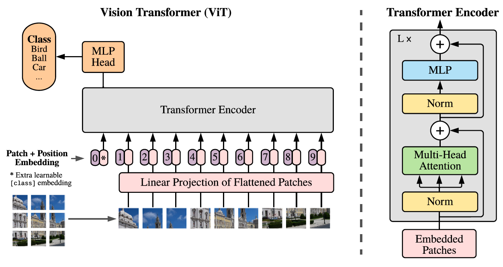

## 3 METHOD

モデルの設計においては、元のトランスフォーマー [^47] にできる限り忠実に従う。この意図的にシンプルなセットアップの利点は、スケーラブルなNLPトランスフォーマーアーキテクチャ（およびその効率的な実装）をほぼそのまま（out of the box）使用できることである。

### 3.1 Visiont Transformer (ViT)

モデルの概要は図1に描かれている。標準的なトランスフォーマーは、1次元のトークン埋め込みのシーケンスを入力として受け取る。2次元画像を扱うために、我々は画像 $ \mathbf{x} \in \mathbb{R}^{H \times W \times C} $ を、平坦化された2Dパッチのシーケンス $ \mathbf{x}_p \in \mathbb{R}^{N \times (P^2 \cdot C)}$ に変形する。ここで、 $(H, W)$ は元画像の解像度、 $C$ はチャネル数、 $(P, P)$ は各画像パッチの解像度、そして $ N = HW/P^2 $ は結果として得られるパッチ数であり、これはトランスフォーマーの有効な入力シーケンス長としても機能する。トランスフォーマーはすべてのレイヤーを通して一定の潜在ベクトルサイズ $ D $ を使用するため、パッチを平坦化し、学習可能な線形射影によって $ D $ 次元にマッピングする（式1）。この射影の出力をパッチ埋め込みと呼ぶ。

BERTの [class] トークンと同様に、埋め込まれたパッチのシーケンスの先頭に学習可能な埋め込みを付加し（ $ \mathbf{z}_0^0 = \mathbf{x}_{\text{class}} $ ）、Transformerエンコーダの出力におけるその状態（ $\mathbf{z}_L^0 $）が画像表現 $ \mathbf{y} $ として機能する（式4）。事前学習とファインチューニングの両方において、分類ヘッドが $ \mathbf{z}_L^0 $ に取り付けられる。分類ヘッドは、事前学習時には1つの隠れ層を持つMLPによって、ファインチューニング時には単一の線形層によって実装される。

位置情報を保持するために、パッチ埋め込みに位置埋め込みが加算される。我々は標準的な学習可能な1D位置埋め込みを使用する。なぜなら、より高度な2D対応の位置埋め込みを使用しても有意な性能向上は観察されなかったからである（付録D.4）。結果として得られる埋め込みベクトルのシーケンスは、エンコーダへの入力として機能する。

Transformerエンコーダ [^47] は、マルチヘッド自己アテンション（MSA、付録Aを参照）とMLPブロックの交互のレイヤーで構成される（式2、3）。LayerNorm (LN) はすべてのブロックの前に適用され、残差接続はすべてのブロックの後に適用される [^50], [^3]。MLPは、GELU非線形性を持つ2つのレイヤーを含んでいる。

$$\mathbf{z}_0 = [\mathbf{x}_{\text{class}}; \mathbf{x}_p^1\mathbf{E}; \mathbf{x}_p^2\mathbf{E}; \dots ; \mathbf{x}_p^N\mathbf{E}] + \mathbf{E}_{\text{pos}}, \quad \mathbf{E} \in \mathbb{R}^{(P^2 \cdot C) \times D}, \mathbf{E}_{\text{pos}} \in \mathbb{R}^{(N+1) \times D} \quad (1)$$

$$\mathbf{z}'_{\ell} = \text{MSA}(\text{LN}(\mathbf{z}_{\ell-1})) + \mathbf{z}_{\ell-1}, \quad \ell = 1 \dots L \quad (2)$$

$$\mathbf{z}_{\ell} = \text{MLP}(\text{LN}(\mathbf{z}'_{\ell})) + \mathbf{z}'_{\ell}, \quad \ell = 1 \dots L \quad (3)$$

$$\mathbf{y} = \text{LN}(\mathbf{z}_L^0) \quad (4)$$

#### 帰納的バイアス

Vision TransformerはCNNよりも画像固有の帰納的バイアスがはるかに少ないことに注意されたい。CNNにおいては、局所性、2次元の近傍構造、および並進等変性がモデル全体の各レイヤーに組み込まれている。ViTでは、MLPレイヤーのみが局所的かつ並進等変性を持ち、一方で自己アテンションレイヤーはグローバルである。2次元の近傍構造は非常に控えめに使用される：モデルの最初で画像をパッチに分割する際と、ファインチューニング時に異なる解像度の画像に対して位置埋め込みを調整する際（後述）である。それ以外では、初期化時の位置埋め込みはパッチの2D位置に関する情報を一切持たず、パッチ間のすべての空間的関係はゼロから学習されなければならない。

#### ハイブリッドアーキテクチャ

生の画像パッチの代替として、入力シーケンスをCNNの特徴マップから形成することができる [^28]。このハイブリッドモデルにおいて、パッチ埋め込み射影 $ \mathbf{E} $（式1）は、CNN特徴マップから抽出されたパッチに適用される。特殊なケースとして、パッチが空間サイズ 1x1 を持つことがあり、これは入力シーケンスが単純に特徴マップの空間次元を平坦化し、トランスフォーマーの次元に射影することによって得られることを意味する。分類用の入力埋め込みと位置埋め込みは、上記のように追加される。

### 3.2 ファインチューニングとより高い解像度

典型的には、我々はViTを大規模なデータセットで事前学習し、（より小規模な）下流タスクにファインチューニングする。このために、事前学習済みの予測ヘッドを取り外し、ゼロ初期化された $ D \times K $ のフィードフォワード層を接続する。ここで $ K $ は下流タスクのクラス数である。事前学習よりも高い解像度でファインチューニングすることはしばしば有益である [^44], [^25]。より高解像度の画像を入力する場合、我々はパッチサイズを同じに保ち、その結果、有効なシーケンス長が長くなる。Vision Transformerは（メモリの制約の範囲内で）任意のシーケンス長を処理できるが、事前学習された位置埋め込みはもはや意味を持たなくなる可能性がある。したがって、我々は元の画像における位置に基づいて、事前学習された位置埋め込みの2次元補間を実行する。この解像度調整とパッチ抽出が、画像の2次元構造に関する帰納的バイアスがVision Transformerに手動で注入される唯一のポイントであることに注意されたい。

## 4 EXPERIMENTS

我々は、ResNet、Vision Transformer（ViT）、およびハイブリッドモデルの表現学習能力を評価する。各モデルのデータ要件を理解するために、様々なサイズのデータセットで事前学習を行い、多くのベンチマークタスクを評価する。モデルの事前学習の計算コストを考慮すると、ViTは非常に良好に機能し、より低い事前学習コストでほとんどの認識ベンチマークにおいて最先端（state of the art）を達成している。最後に、自己教師あり学習を用いた小規模な実験を行い、自己教師ありViTが将来に向けて有望であることを示す。

### 4.1 セットアップ

#### データセット

モデルのスケーラビリティを探索するために、1,000クラス・130万画像のILSVRC-2012 ImageNetデータセット（以下、ImageNetと呼ぶ）、そのスーパーセットであり21,000クラス・1,400万画像を持つImageNet-21k [^13]、および18,000クラス・3億300万の高解像度画像を持つJFT [^42] を使用する。[^25] に従い、下流タスクのテストセットに対して事前学習データセットの重複排除（de-duplicate）を行う。これらのデータセットで学習したモデルを、いくつかのベンチマークタスクに転移する：元の検証ラベルおよびクリーンアップされたReaLラベル [^5] を用いたImageNet、CIFAR-10/100 [^26]、Oxford-IIIT Pets [^35]、およびOxford Flowers-102 [^34] である。これらのデータセットについて、前処理は [^25] に従う。

表1: Vision Transformerモデルのバリエーションの詳細。

| Model | Layers | Hidden size $ D $ | MLP size | Heads | Params |
| :--- | :--- | :--- | :--- | :--- | :--- |
| ViT-Base | 12 | 768 | 3072 | 12 | 86M |
| ViT-Large | 24 | 1024 | 4096 | 16 | 307M |
| ViT-Huge | 32 | 1280 | 5120 | 16 | 632M |

また、19のタスクからなるVTAB分類スイート [^57] での評価も行う。VTABは、タスクあたり1,000個の学習サンプルを使用して、多様なタスクへの低データ転移を評価する。タスクは3つのグループに分けられる：Natural（前述のようなPets、CIFARなどのタスク）、Specialized（医療や衛星画像）、およびStructured（位置特定など、幾何学的な理解を必要とするタスク）である。

#### モデルのバリエーション

表1にまとめるように、ViTの構成はBERT [^14] で使用されたものをベースにしている。「Base」および「Large」モデルはBERTから直接採用しており、さらに大きな「Huge」モデルを追加している。以下では、モデルサイズと入力パッチサイズを示すために簡潔な表記を用いる：例えば、ViT-L/16は、16×16の入力パッチサイズを持つ「Large」バリアントを意味する。Transformerのシーケンス長はパッチサイズの2乗に反比例するため、パッチサイズが小さいモデルほど計算コストが高くなることに注意されたい。

ベースラインのCNNにはResNet [^16] を使用するが、バッチ正規化層 [^23] をグループ正規化 [^54] に置き換え、標準化畳み込み [^38] を使用した。これらの変更は転移を改善し [^25]、我々はこの変更されたモデルを「ResNet (BiT)」と表記する。ハイブリッドモデルの場合、1「ピクセル」のパッチサイズで中間特徴マップをViTに入力する。異なるシーケンス長で実験するために、我々は (i) 通常のResNet50のステージ4の出力を取るか、(ii) ステージ4を削除し、同じ数の層をステージ3に配置し（総層数は維持）、この拡張されたステージ3の出力を取る。オプション(ii)は、4倍のシーケンス長をもたらし、より計算コストの高いViTモデルとなる。

#### 学習とファインチューニング

ResNetを含むすべてのモデルを、 $ \beta_1 = 0.9 $ 、 $ \beta_2 = 0.999 $ のAdam [^24]、バッチサイズ4096を用いて学習し、高い重み減衰 $ 0.1 $ を適用する。これはすべてのモデルの転移に有用であることがわかった（付録D.1では、一般的な慣行とは対照的に、我々の設定ではResNetに対してAdamがSGDよりもわずかに良く機能することを示している）。線形な学習率のウォームアップと減衰を使用する。詳細は付録B.1を参照されたい。ファインチューニングには、すべてのモデルでモメンタム付きのSGD、バッチサイズ512を使用する。付録B.1.1を参照されたい。表2のImageNetの結果については、より高い解像度（ViT-L/16では512、ViT-H/14では518）でファインチューニングし、係数 $ 0.9999 $ の平均化 [^37] も使用した [^41], [^49]。

#### 評価指標

下流データセットでの結果は、few-shot精度またはファインチューニング精度のいずれかで報告する。ファインチューニング精度は、それぞれのデータセットでファインチューニングした後の各モデルの性能を捉える。few-shot精度は、学習画像のサブセットの（凍結された）表現を $ \{-1, 1\}^K $ のターゲットベクトルにマッピングする正規化最小二乗回帰問題を解くことによって得られる。この定式化により、閉形式で厳密解を復元できる。我々は主にファインチューニング性能に焦点を当てているが、ファインチューニングのコストが高すぎる場合には、高速なオンザフライ評価のために線形few-shot精度を使用することもある。

### 4.2 最先端技術との比較

我々はまず、我々の最大のモデルであるViT-H/14とViT-L/16を、文献にある最先端のCNNと比較する。最初の比較対象は、大規模なResNetを用いて教師あり転移学習を行うBig Transfer (BiT) [^25] である。2つ目は、ImageNetとラベルが削除されたJFT-300Mを用いて半教師あり学習で訓練された大規模なEfficientNetであるNoisy Student [^55] である。現在、ImageNetではNoisy Studentが、ここで報告されている他のデータセットではBiT-Lが最先端である。すべてのモデルはTPUv3ハードウェア上で学習されており、我々は各モデルの事前学習にかかったTPUv3コア日数（TPUv3-core-days）を報告する。すなわち、学習に使用されたTPU v3コア数（チップあたり2コア）と学習時間（日数）を掛けたものである。

表2: 一般的な画像分類ベンチマークにおける最先端技術との比較。3回のファインチューニング実行にわたって平均された精度の平均値と標準偏差を報告する。JFT-300Mデータセットで事前学習されたVision Transformerモデルは、事前学習にかかる計算リソースが大幅に少ないにもかかわらず、すべてのデータセットにおいてResNetベースのベースラインを上回っている。より小規模な公開データセットImageNet-21kで事前学習されたViTも良好に機能する。 $ \ast $ [^45] で報告されたわずかに改善された $ 88.5\% $ の結果。

| | Ours-JFT (ViT-H/14) | Ours-JFT (ViT-L/16) | Ours-I21k (ViT-L/16) | BiT-L (ResNet152x4) | Noisy Student (EfficientNet-L2) |
| :--- | :--- | :--- | :--- | :--- | :--- |
| ImageNet | $ 88.55 \pm 0.04 $ | $ 87.76 \pm 0.03 $ | $ 85.30 \pm 0.02 $ | $ 87.54 \pm 0.02 $ | $ 88.4/88.5^\ast $ |
| ImageNet ReaL | $ 90.72 \pm 0.05 $ | $ 90.54 \pm 0.03 $ | $ 88.62 \pm 0.05 $ | $ 90.54 $ | $ 90.55 $ |
| CIFAR-10 | $ 99.50 \pm 0.06 $ | $ 99.42 \pm 0.03 $ | $ 99.15 \pm 0.03 $ | $ 99.37 \pm 0.06 $ | - |
| CIFAR-100 | $ 94.55 \pm 0.04 $ | $ 93.90 \pm 0.05 $ | $ 93.25 \pm 0.05 $ | $ 93.51 \pm 0.08 $ | - |
| Oxford-IIIT Pets | $ 97.56 \pm 0.03 $ | $ 97.32 \pm 0.11 $ | $ 94.67 \pm 0.15 $ | $ 96.62 \pm 0.23 $ | - |
| Oxford Flowers-102 | $ 99.68 \pm 0.02 $ | $ 99.74 \pm 0.00 $ | $ 99.61 \pm 0.02 $ | $ 99.63 \pm 0.03 $ | - |
| VTAB (19 tasks) | $ 77.63 \pm 0.23 $ | $ 76.28 \pm 0.46 $ | $ 72.72 \pm 0.21 $ | $ 76.29 \pm 1.70 $ | - |
| TPUv3-core-days | $ 2.5k $ | $ 0.68k $ | $ 0.23k $ | $ 9.9k $ | $ 12.3k $ |

表2に結果を示す。JFT-300Mで事前学習されたより小さなViT-L/16モデルは、学習に必要な計算リソースが大幅に少ないにもかかわらず、すべてのタスクにおいて（同じデータセットで事前学習された）BiT-Lを上回っている。より大きなモデルであるViT-H/14は、特により困難なデータセット（ImageNet、CIFAR-100、およびVTABスイート）において性能をさらに向上させている。興味深いことに、このモデルの事前学習にかかる計算量は、以前の最先端の手法よりも依然として大幅に少ない。ただし、事前学習の効率はアーキテクチャの選択だけでなく、学習スケジュール、オプティマイザ、重み減衰などの他のパラメータによっても影響を受ける可能性があることに留意されたい。異なるアーキテクチャの性能対計算量の対照実験についてはセクション4.4で提供する。最後に、公開されているImageNet-21kデータセットで事前学習されたViT-L/16モデルも、ほとんどのデータセットで良好に機能する一方で、事前学習にかかるリソースはさらに少なく、8コアの標準的なクラウドTPUv3を使用して約30日で学習することができた。

図2: Natural、Specialized、StructuredのタスクグループにおけるVTAB性能の内訳。

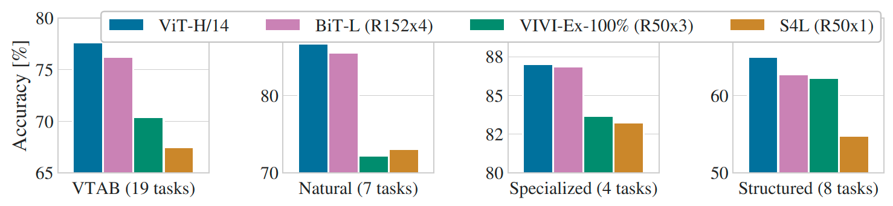

図2は、VTABタスクをそれぞれのグループに分解し、このベンチマークにおける以前のSOTAメソッドと比較している。比較対象は、BiT、ImageNetとYoutubeで協調学習されたResNetであるVIVI [^46]、およびImageNet上での教師あり＋半教師あり学習であるS4L [^56] である。ViT-H/14は、NaturalタスクとStructuredタスクの両方において、BiT-R152x4およびその他の手法を上回っている。Specializedタスクでは、上位2つのモデルの性能は類似している。

### 4.3 事前学習データの要件

Vision Transformerは、大規模なJFT-300Mデータセットで事前学習された場合に良好に機能する。ResNetよりも視覚に対する帰納的バイアスが少ないため、データセットのサイズはどの程度重要だろうか？我々は2つのシリーズの実験を行う。

第一に、ImageNet、ImageNet-21k、およびJFT-300Mと、サイズが増加するデータセットでViTモデルを事前学習する。より小さなデータセットでの性能を向上させるために、3つの基本的な正則化パラメータ（重み減衰、ドロップアウト、およびラベルスムージング）を最適化する。図3は、ImageNetにファインチューニングした後の結果を示している（他のデータセットでの結果は表5に示されている）[^imagenet_finetuning]。最も小さいデータセットであるImageNetで事前学習した場合、（適度な）正則化にもかかわらず、ViT-LargeモデルはViT-Baseモデルと比較して性能が劣る。ImageNet-21kでの事前学習では、それらの性能は類似している。JFT-300Mを用いて初めて、より大きなモデルの恩恵を十分に受けることができる。図3は、異なるサイズのBiTモデルがカバーする性能領域も示している。ImageNetではBiT CNNがViTを上回るが、より大きなデータセットではViTが追い抜く。

図3: ImageNetへの転移。小規模なデータセットで事前学習された場合、大規模なViTモデルはBiT ResNet（網掛け領域）よりも性能が劣るが、より大規模なデータセットで事前学習された場合には真価を発揮する。同様に、データセットが大きくなるにつれて、より大きなViTのバリアントが小さなものを追い抜く。

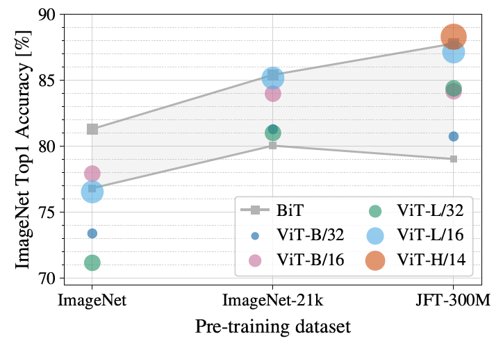

図4: ImageNetにおける線形few-shot評価と事前学習サイズの関係。小規模な事前学習データセットではResNetの方が良い性能を示すが、大規模な事前学習でより良い性能を示すViTよりも早くプラトーに達する。ViT-bは、すべての隠れ次元を半分にしたViT-Bである。

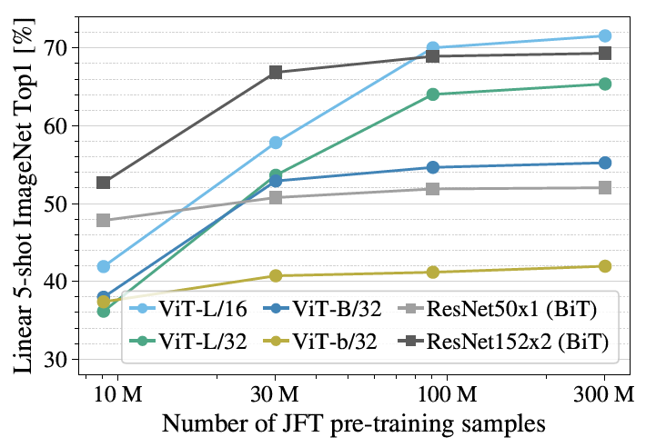

図5: 異なるアーキテクチャ（Vision Transformer、ResNet、ハイブリッド）における性能と事前学習の計算量の関係。同じ計算予算において、一般的にVision TransformerはResNetを上回る。小規模なモデルサイズではハイブリッドが純粋なTransformerよりも改善を示すが、モデルが大きくなるとその差は消失する。

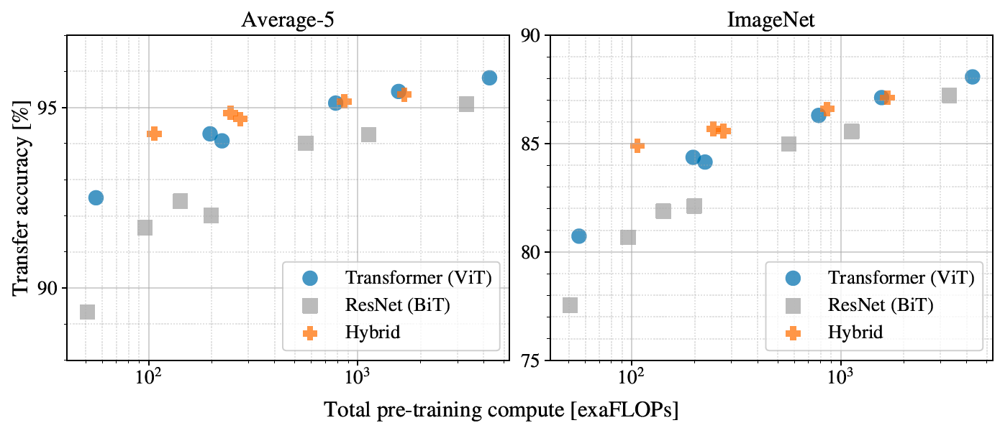

第二に、フルサイズのJFT-300Mデータセットだけでなく、900万、3,000万、および9,000万のランダムなサブセットでモデルを訓練する。より小さなサブセットに対しては追加の正則化を行わず、すべての設定で同じハイパーパラメータを使用する。このようにして、正則化の効果ではなく、モデルの固有の性質を評価する。ただし、早期終了を使用し、学習中に達成された最良の検証精度を報告する。計算を節約するために、完全なファインチューニング精度の代わりにfew-shot線形精度を報告する。図4に結果を示す。小規模なデータセットでは、同等の計算コストを持つResNetよりもVision Transformerの方がより過学習する。例えば、ViT-B/32はResNet50よりもわずかに高速であり、900万のサブセットでははるかに性能が劣るが、9,000万以上のサブセットでは優れている。ResNet152x2とViT-L/16についても同様である。この結果は、畳み込みによる帰納的バイアスは小規模なデータセットには有用であるが、大規模なデータセットの場合は、関連するパターンをデータから直接学習するだけで十分であり、有益でさえあるという直感を強化するものである。

全体として、ImageNetでのfew-shotの結果（図4）やVTABでの低データの結果（表2）は、非常に低データでの転移において有望であると思われる。ViTのfew-shot特性のさらなる分析は、今後の刺激的な研究方向である。

### 4.4 スケーリングの検討

我々は、JFT-300Mからの転移性能を評価することにより、異なるモデルの対照的なスケーリング検討を行う。この設定では、データサイズがモデルの性能のボトルネックになることはなく、各モデルの性能と事前学習コストの関係を評価する。モデルセットには以下が含まれる：7エポック事前学習された7つのResNet（R50x1、R50x2、R101x1、R152x1、R152x2）および14エポック事前学習されたR152x2とR200x3。7エポック事前学習された6つのVision Transformer（ViT-B/32、B/16、L/32、L/16）および14エポック事前学習されたL/16とH/14。そして、7エポック事前学習された5つのハイブリッド（R50+ViT-B/32、B/16、L/32、L/16）および14エポック事前学習されたR50+ViT-L/16（ハイブリッドの場合、モデル名の最後にある数字はパッチサイズではなく、ResNetバックボーンにおける総ダウンサンプリング比を表す）。

図5に、総事前学習計算量に対する転移性能を示す（計算コストの詳細は付録D.5を参照）。モデルごとの詳細な結果は付録の表6に提供されている。いくつかのパターンが観察できる。第一に、Vision Transformerは性能対計算量のトレードオフにおいてResNetを圧倒している。ViTは、同じ性能（5つのデータセットの平均）を達成するために、およそ $ 2 \sim 4 $ 倍少ない計算量しか使用しない。第二に、小さな計算予算ではハイブリッドがViTをわずかに上回るが、より大きなモデルではその差は消失する。畳み込みによる局所的な特徴処理がどのサイズのViTにも役立つと期待されるかもしれないため、この結果はやや驚くべきものである。第三に、Vision Transformerは試された範囲内では飽和していないように見え、今後のスケーリングの取り組みへの動機付けとなる。

### 4.5 Vision Transformerの内部調査

図6: 出力トークンから入力空間へのアテンションの代表的な例。詳細は付録D.7を参照。

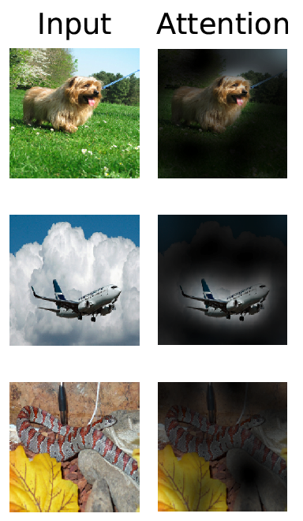

Vision Transformerが画像データをどのように処理するかを理解し始めるために、その内部表現を分析する。Vision Transformerの最初の層は、平坦化されたパッチを低次元の空間に線形投影する（式1）。図7（左）は、学習された埋め込みフィルタの主要な主成分を示している。これらの成分は、各パッチ内の微細構造の低次元表現のための妥当な基底関数に似ている。

投影後、学習された位置埋め込みがパッチ表現に加算される。図7（中央）は、モデルが位置埋め込みの類似性によって画像内の距離をエンコードすることを学習していることを示している。すなわち、物理的に近いパッチほどより類似した位置埋め込みを持つ傾向がある。さらに、行と列の構造が現れており、同じ行・列にあるパッチは類似した埋め込みを持っている。最後に、より大きなグリッドでは正弦波のような構造が明らかになることもある（付録D）。位置埋め込みが2Dの画像トポロジーを表現することを学習するという事実は、手作業で設計された2D対応の埋め込みのバリアントが性能向上をもたらさない理由を説明している（付録D.4）。

自己注意機構により、ViTは最下層からでも画像全体にわたって情報を統合することができる。我々は、ネットワークがこの能力をどの程度利用しているかを調査する。具体的には、アテンションの重みに基づいて、情報が統合される画像空間内の平均距離を計算する（図7、右）。この「アテンション距離」はCNNにおける受容野のサイズに類似している。我々は、最下層においてすでにあるヘッドが画像の大部分に注意を向けていることを発見し、情報をグローバルに統合する能力が実際にモデルによって使用されていることを示している。他のアテンションヘッドは、低層では一貫してアテンション距離が短い。この非常に局所的なアテンションは、Transformerの前にResNetを適用するハイブリッドモデルではあまり顕著ではないため（図7、右）、CNNにおける初期の畳み込み層と同様の機能を果たしている可能性があることが示唆される。さらに、アテンション距離はネットワークの深さとともに増加する。全体として、我々はモデルが分類において意味的に関連する画像領域に注意を向けていることを発見した（図6）。

図7: 左：ViT-L/32のRGB値の初期線形埋め込みのフィルタ。中央：ViT-L/32の位置埋め込みの類似性。タイルは、示された行と列を持つパッチの位置埋め込みと、他のすべてのパッチの位置埋め込みとの間のコサイン類似度を示している。右：ヘッドおよびネットワークの深さごとのアテンド領域のサイズ。各ドットは、1つの層にある16のヘッドの1つについて、画像全体での平均アテンション距離を示している。詳細は付録D.7を参照。

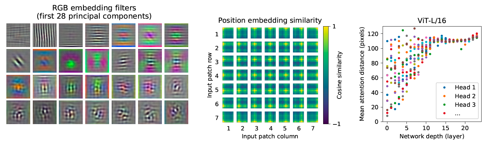

### 4.6 自己教師あり学習

TransformerはNLPタスクにおいて印象的な性能を示している。しかし、その成功の多くは、優れたスケーラビリティだけでなく、大規模な自己教師あり事前学習 [^14], [^39] にも由来している。我々は、BERTで使用されているマスク化言語モデリングタスクを模倣した、自己教師あり学習のためのマスク化パッチ予測に関する予備的な探索も行う。自己教師あり事前学習により、より小規模なViT-B/16モデルはImageNetで $ 79.9\% $ の精度を達成した。これはスクラッチからの学習と比較して $ 2\% $ の有意な改善であるが、教師あり事前学習にはまだ $ 4\% $ 及ばない。付録B.1.2にさらなる詳細が含まれている。対照的事前学習 [^8], [^17], [^2], [^22] の探索は今後の課題とする。

---

## 5 CONCLUSION

我々はTransformerの画像認識への直接的な適用を探求した。
コンピュータビジョンで自己アテンションを使用した先行研究とは異なり、我々は初期のパッチ抽出ステップを除いて、画像特有の帰納的バイアスをアーキテクチャに導入しない。
代わりに、画像をパッチのシーケンスとして解釈し、NLPで使用されるような標準的なTransformerエンコーダでそれを処理する。
このシンプルでスケーラブルな戦略は、大規模なデータセットでの事前学習と組み合わせると驚くほどうまく機能する。
したがって、Vision Transformerは多くの画像分類データセットで最先端と一致するかそれを超える一方で、事前学習のコストは比較的安価である。
これらの初期の結果は有望であるが、多くの課題が残っている。
1つは、ViTを検出やセグメンテーションなどの他のコンピュータビジョンタスクに適用することである。
Carionらの結果[^7]と合わせて、我々の結果はこのアプローチの有望性を示している。
もう1つの課題は、自己教師あり事前学習法の探求を続けることである。
我々の初期の実験は自己教師あり事前学習からの改善を示しているが、自己教師ありと大規模な教師あり事前学習の間には依然として大きなギャップがある。
最後に、ViTのさらなるスケーリングはパフォーマンスの向上につながる可能性が高い。

## 謝辞

この研究はベルリン、チューリッヒ、アムステルダムで実施された。

Googleの多くの同僚の助けに感謝する。特に、インフラストラクチャとコードのオープンソースリリースに関する重要な支援についてAndreas Steinerに感謝する。
大規模学習インフラストラクチャに関する支援についてJoan PuigcerverとMaxim Neumannに感謝する。
有益な議論について、Dmitry Lepikhin、Aravindh Mahendran、Daniel Keysers、Mario Lučić、Noam Shazeer、Ashish Vaswani、Colin Raffelに感謝する。

## References

[^1]: Samira Abnar and Willem Zuidema. Quantifying attention flow in transformers. In ACL, 2020.
[^2]: Philip Bachman, R Devon Hjelm, and William Buchwalter. Learning representations by maximizing mutual information across views. In NeurIPS, 2019.
[^3]: Alexei Baevski and Michael Auli. Adaptive input representations for neural language modeling. In ICLR, 2019.
[^4]: I. Bello, B. Zoph, Q. Le, A. Vaswani, and J. Shlens. Attention augmented convolutional networks. In ICCV, 2019.
[^5]: Lucas Beyer, Olivier J. Hénaff, Alexander Kolesnikov, Xiaohua Zhai, and Aäron van den Oord. Are we done with imagenet? arXiv, 2020.
[^6]: Tom B Brown, Benjamin Mann, Nick Ryder, Melanie Subbiah, Jared Kaplan, Prafulla Dhariwal, Arvind Neelakantan, Pranav Shyam, Girish Sastry, Amanda Askell, et al. Language models are few-shot learners. arXiv, 2020. 
[^7]: Nicolas Carion, Francisco Massa, Gabriel Synnaeve, Nicolas Usunier, Alexander Kirillov, and Sergey Zagoruyko. End-to-end object detection with transformers. In ECCV, 2020. 
[^8]: Mark Chen, Alec Radford, Rewon Child, Jeff Wu, and Heewoo Jun. Generative pretraining from pixels. In ICML, 2020a. 
[^9]: Ting Chen, Simon Kornblith, Mohammad Norouzi, and Geoffrey E. Hinton. A simple framework for contrastive learning of visual representations. In ICML, 2020b. 
[^10]: Yen-Chun Chen, Linjie Li, Licheng Yu, Ahmed El Kholy, Faisal Ahmed, Zhe Gan, Yu Cheng, and Jingjing Liu. UNITER: UNiversal Image-TExt Representation Learning. In ECCV, 2020c. 
[^11]: Rewon Child, Scott Gray, Alec Radford, and Ilya Sutskever. Generating long sequences with sparse transformers. arXiv, 2019. 
[^12]: Jean-Baptiste Cordonnier, Andreas Loukas, and Martin Jaggi. On the relationship between self-attention and convolutional layers. In ICLR, 2020. 
[^13]: J. Deng, W. Dong, R. Socher, L. Li, Kai Li, and Li Fei-Fei. Imagenet: A large-scale hierarchical image database. In CVPR, 2009. 
[^14]: Jacob Devlin, Ming-Wei Chang, Kenton Lee, and Kristina Toutanova. BERT: Pre-training of deep bidirectional transformers for language understanding. In NAACL, 2019. 
[^15]: Josip Djolonga, Jessica Yung, Michael Tschannen, Rob Romijnders, Lucas Beyer, Alexander Kolesnikov, Joan Puigcerver, Matthias Minderer, Alexander D’Amour, Dan Moldovan, Sylvan Gelly, Neil Houlsby, Xiaohua Zhai, and Mario Lucic. On robustness and transferability of convolutional neural networks. arXiv, 2020. 
[^16]: Kaiming He, Xiangyu Zhang, Shaoqing Ren, and Jian Sun. Deep residual learning for image recognition. In CVPR, 2016. 
[^17]: Kaiming He, Haoqi Fan, Yuxin Wu, Saining Xie, and Ross Girshick. Momentum contrast for unsupervised visual representation learning. In CVPR, 2020.
[^18]: Jonathan Ho, Nal Kalchbrenner, Dirk Weissenborn, and Tim Salimans. Axial attention in multidimensional transformers. arXiv, 2019.
[^19]: Han Hu, Jiayuan Gu, Zheng Zhang, Jifeng Dai, and Yichen Wei. Relation networks for object detection. In CVPR, 2018. 
[^20]: Han Hu, Zheng Zhang, Zhenda Xie, and Stephen Lin. Local relation networks for image recognition. In ICCV, 2019. 
[^21]: Zilong Huang, Xinggang Wang, Yunchao Wei, Lichao Huang, Humphrey Shi, Wenyu Liu, and Thomas S. Huang. Ccnet: Criss-cross attention for semantic segmentation. In ICCV, 2020. 
[^22]: Olivier J. Hénaff, Aravind Srinivas, Jeffrey De Fauw, Ali Razavi, Carl Doersch, S. M. Ali Eslami, and Aaron van den Oord. Data-efficient image recognition with contrastive predictive coding. In ICML, 2020. 
[^23]: Sergey Ioffe and Christian Szegedy. Batch normalization: Accelerating deep network training by reducing internal covariate shift. 2015. 
[^24]: Diederik P. Kingma and Jimmy Ba. Adam: A method for stochastic optimization. In ICLR, 2015. 
[^25]: Alexander Kolesnikov, Lucas Beyer, Xiaohua Zhai, Joan Puigcerver, Jessica Yung, Sylvain Gelly, and Neil Houlsby. Big transfer (BiT): General visual representation learning. In ECCV, 2020. 
[^26]: Alex Krizhevsky. Learning multiple layers of features from tiny images. Technical report, 2009.
[^27]: Alex Krizhevsky, Ilya Sutskever, and Geoffrey E. Hinton. Imagenet classification with deep convolutional neural networks. In NIPS, 2012.
[^28]: Y. LeCun, B. Boser, J. Denker, D. Henderson, R. Howard, W. Hubbard, and L. Jackel. Backpropagation applied to handwritten zip code recognition. Neural Computation, 1:541–551, 1989.
[^29]: Dmitry Lepikhin, HyoukJoong Lee, Yuanzhong Xu, Dehao Chen, Orhan Firat, Yanping Huang, Maxim Krikun, Noam Shazeer, and Zhifeng Chen. Gshard: Scaling giant models with conditional computation and automatic sharding. arXiv, 2020. 
[^30]: Liunian Harold Li, Mark Yatskar, Da Yin, Cho-Jui Hsieh, and Kai-Wei Chang. VisualBERT: A Simple and Performant Baseline for Vision and Language. In Arxiv, 2019. 
[^31]: Francesco Locatello, Dirk Weissenborn, Thomas Unterthiner, Aravindh Mahendran, Georg Heigold, Jakob Uszkoreit, Alexey Dosovitskiy, and Thomas Kipf. Object-centric learning with slot attention. arXiv, 2020. 
[^32]: Jiasen Lu, Dhruv Batra, Devi Parikh, and Stefan Lee. ViLBERT: Pretraining Task-Agnostic Visiolinguistic Representations for Vision-and-Language Tasks. In NeurIPS. 2019. 
[^33]: Dhruv Mahajan, Ross Girshick, Vignesh Ramanathan, Kaiming He, Manohar Paluri, Yixuan Li, Ashwin Bharambe, and Laurens van der Maaten. Exploring the limits of weakly supervised pretraining. In ECCV, 2018.
[^34]: M. Nilsback and A. Zisserman. Automated flower classification over a large number of classes. In ICVGIP, 2008. 
[^35]: Omkar M. Parkhi, Andrea Vedaldi, Andrew Zisserman, and C. V. Jawahar. Cats and dogs. In CVPR, 2012. 
[^36]: Niki Parmar, Ashish Vaswani, Jakob Uszkoreit, Lukasz Kaiser, Noam Shazeer, Alexander Ku, and Dustin Tran. Image transformer. In ICML, 2018. 
[^37]: B. T. Polyak and A. B. Juditsky. Acceleration of stochastic approximation by averaging. SIAM Journal on Control and Optimization, 30(4):838–855, 1992. 
[^38]: Siyuan Qiao, Huiyu Wang, Chenxi Liu, Wei Shen, and Alan Yuille. Weight standardization. arXiv preprint arXiv:1903.10520, 2019. 
[^39]: Alec Radford, Karthik Narasimhan, Tim Salimans, and Ilya Sutskever. Improving language understanding with unsupervised learning. Technical Report, 2018. 
[^40]: Alec Radford, Jeff Wu, Rewon Child, David Luan, Dario Amodei, and Ilya Sutskever. Language models are unsupervised multitask learners. Technical Report, 2019. 
[^41]: Prajit Ramachandran, Niki Parmar, Ashish Vaswani, Irwan Bello, Anselm Levskaya, and Jon Shlens. Stand-alone self-attention in vision models. In NeurIPS, 2019. 
[^42]: Chen Sun, Abhinav Shrivastava, Saurabh Singh, and Abhinav Gupta. Revisiting unreasonable effectiveness of data in deep learning era. In ICCV, 2017. 
[^43]: Chen Sun, Austin Myers, Carl Vondrick, Kevin Murphy, and Cordelia Schmid. Videobert: A joint model for video and language representation learning. In ICCV, 2019. 
[^44]: Hugo Touvron, Andrea Vedaldi, Matthijs Douze, and Herve Jegou. Fixing the train-test resolution discrepancy. In NeurIPS. 2019. 
[^45]: Hugo Touvron, Andrea Vedaldi, Matthijs Douze, and Herve Jegou. Fixing the train-test resolution discrepancy: Fixefficientnet. arXiv preprint arXiv:2003.08237, 2020. 
[^46]: Michael Tschannen, Josip Djolonga, Marvin Ritter, Aravindh Mahendran, Neil Houlsby, Sylvain Gelly, and Mario Lucic. Self-supervised learning of video-induced visual invariances. In Proceedings of the IEEE/CVF Conference on Computer Vision and Pattern Recognition (CVPR), June 2020. 
[^47]: Ashish Vaswani, Noam Shazeer, Niki Parmar, Jakob Uszkoreit, Llion Jones, Aidan N Gomez, Łukasz Kaiser, and Illia Polosukhin. Attention is all you need. In NIPS, 2017. 
[^48]: Huiyu Wang, Yukun Zhu, Bradley Green, Hartwig Adam, Alan Yuille, and Liang-Chieh Chen. Axial-deeplab: Stand-alone axial-attention for panoptic segmentation. In ECCV, 2020a. 
[^49]: Huiyu Wang, Yukun Zhu, Bradley Green, Hartwig Adam, Alan Yuille, and Liang-Chieh Chen. Axial-deeplab: Stand-alone axial-attention for panoptic segmentation. arXiv preprint arXiv:2003.07853, 2020b. 
[^50]: Qiang Wang, Bei Li, Tong Xiao, Jingbo Zhu, Changliang Li, Derek F. Wong, and Lidia S. Chao. Learning deep transformer models for machine translation. In ACL, 2019. 
[^51]: Xiaolong Wang, Ross Girshick, Abhinav Gupta, and Kaiming He. Non-local neural networks. In CVPR, 2018. 
[^52]: Dirk Weissenborn, Oscar Täckström, and Jakob Uszkoreit. Scaling autoregressive video models. In ICLR, 2019. 
[^53]: Bichen Wu, Chenfeng Xu, Xiaoliang Dai, Alvin Wan, Peizhao Zhang, Masayoshi Tomizuka, Kurt Keutzer, and Peter Vajda. Visual transformers: Token-based image representation and processing for computer vision. arxiv, 2020. 
[^54]: Yuxin Wu and Kaiming He. Group normalization. In ECCV, 2018. 
[^55]: Qizhe Xie, Minh-Thang Luong, Eduard Hovy, and Quoc V. Le. Self-training with noisy student improves imagenet classification. In CVPR, 2020. 
[^56]: Xiaohua Zhai, Avital Oliver, Alexander Kolesnikov, and Lucas Beyer. S4L: Self-Supervised Semi-Supervised Learning. In ICCV, 2019a. 
[^57]: Xiaohua Zhai, Joan Puigcerver, Alexander Kolesnikov, Pierre Ruyssen, Carlos Riquelme, Mario Lucic, Josip Djolonga, Andre Susano Pinto, Maxim Neumann, Alexey Dosovitskiy, et al. A large-scale study of representation learning with the visual task adaptation benchmark. arXiv preprint arXiv:1910.04867, 2019b. 
[^58]: Hengshuang Zhao, Jiaya Jia, and Vladlen Koltun. Exploring self-attention for image recognition. In CVPR, 2020.

[^finetuning]: ファインチューニング用コードと事前学習済みモデルは https://github.com/google-research/vision_transformer で入手可能である。

[^imagenet_finetuning]: ImageNetで事前学習されたモデルもファインチューニングされるが、再びImageNetで行われることに注意されたい。これは、ファインチューニング中に解像度を上げることで性能が向上するためである。

[^axial_resnet]: 原文脚注: 我々の実装は https://github.com/csrhddlam/axial-deeplab にあるオープンソースのPyTorch実装に基づいている。我々の実験では、精度の点で (Wang et al., 2020b) で報告されたスコアを再現したが、我々の実装はオープンソースの実装と同様にTPU上では非常に遅い。そのため、大規模な広範な実験にそれを使用することはできなかった。これらは、注意深く最適化された実装によって可能になるかもしれない。

## APPENDIX

### A マルチヘッド自己注意機構 (MULTIHEAD SELF-ATTENTION)

標準的なqkv自己注意機構（SA, [^1]）は、ニューラルアーキテクチャの一般的な構成要素である。入力シーケンス $z \in \mathbb{R}^{N \times D}$ の各要素について、シーケンス内のすべての値 $v$ の加重和を計算する。アテンションの重み $A_{ij}$ は、シーケンスの2つの要素とそれらに対応するクエリ $q_i$ およびキー $k_j$ の表現間のペアワイズな類似度に基づく。

```math
[q, k, v] = z U_{qkv} \quad U_{qkv} \in \mathbb{R}^{D \times 3D_h}, \quad (5)
```
```math
A = \text{softmax}(qk^\top / \sqrt{D_h}) \quad A \in \mathbb{R}^{N \times N}, \quad (6)
```
```math
\text{SA}(z) = Av. \quad (7)
```

マルチヘッド自己注意機構（MSA）はSAの拡張であり、 $k$ 個の自己注意操作（「ヘッド」と呼ばれる）を並列に実行し、それらを連結した出力を投影する。 $k$ を変更した際に計算量とパラメータ数を一定に保つため、 $D_h$ （式5）は通常 $D/k$ に設定される。

```math
\text{MSA}(z) = [\text{SA}_1(z); \text{SA}_2(z); \dots; \text{SA}_k(z)] U_{msa} \quad U_{msa} \in \mathbb{R}^{k \cdot D_h \times D} \quad (8)
```

### B 実験の詳細

#### B.1 学習

表3に、異なるモデルに対する学習セットアップをまとめる。ImageNetでスクラッチからモデルを学習させる場合、強力な正則化が鍵となることがわかった。ドロップアウトを使用する場合、qkvの投影を除くすべての全結合層の直後、およびパッチ埋め込みに位置埋め込みを加算した直後に適用する。ハイブリッドモデルは、対応するViTモデルと全く同じセットアップで学習される。最後に、すべての学習は解像度224で行われる。

表3: 学習のためのハイパーパラメータ。すべてのモデルはバッチサイズ4096、10kステップの学習率ウォームアップで学習される。ImageNetについては、さらにグローバルノルム1での勾配クリッピングを適用することが有益であることがわかった。学習解像度は224である。

| Models | Dataset | Epochs | Base LR | LR decay | Weight decay | Dropout |
| :--- | :--- | :--- | :--- | :--- | :--- | :--- |
| ViT-B/{16,32} | JFT-300M | 7 | 8 · 10−4 | linear | 0.1 | 0.0 |
| ViT-L/32 | JFT-300M | 7 | 6 · 10−4 | linear | 0.1 | 0.0 |
| ViT-L/16 | JFT-300M | 7/14 | 4 · 10−4 | linear | 0.1 | 0.0 |
| ViT-H/14 | JFT-300M | 14 | 3 · 10−4 | linear | 0.1 | 0.0 |
| R50x{1,2} | JFT-300M | 7 | 10−3 | linear | 0.1 | 0.0 |
| R101x1 | JFT-300M | 7 | 8 · 10−4 | linear | 0.1 | 0.0 |
| R152x{1,2} | JFT-300M | 7 | 6 · 10−4 | linear | 0.1 | 0.0 |
| R50+ViT-B/{16,32} | JFT-300M | 7 | 8 · 10−4 | linear | 0.1 | 0.0 |
| R50+ViT-L/32 | JFT-300M | 7 | 2 · 10−4 | linear | 0.1 | 0.0 |
| R50+ViT-L/16 | JFT-300M | 7/14 | 4 · 10−4 | linear | 0.1 | 0.0 |
| ViT-B/{16,32} | ImageNet-21k | 90 | 10−3 | linear | 0.03 | 0.1 |
| ViT-L/{16,32} | ImageNet-21k | 30/90 | 10−3 | linear | 0.03 | 0.1 |
| ViT-∗ | ImageNet | 300 | 3 · 10−3 | cosine | 0.3 | 0.1 |

##### B.1.1 ファインチューニング

我々はすべてのViTモデルを、モメンタム0.9のSGDを使用してファインチューニングする。学習率に関して小規模なグリッドサーチを行う（表4の学習率の範囲を参照）。その際、学習セットから小さなサブスプリット（PetsとFlowersは10%、CIFARは2%、ImageNetは1%）を開発セットとして使用し、残りのデータで学習を行う。最終的な結果を得るためには、学習セット全体で学習し、それぞれのテストデータで評価する。ResNetとハイブリッドモデルのファインチューニングには、ImageNetの場合にのみ学習率のスイープに別の値 $0.06$ を追加する以外は、全く同じセットアップを使用する。さらに、ResNetについては [^25] のセットアップも実行し、この実行と我々のスイープの中で最高の結果を選択する。最後に、特に言及がない限り、すべてのファインチューニング実験は解像度384で実行される（学習時とは異なる解像度でファインチューニングを実行することは一般的な慣行である [^25]）。

ViTモデルを別のデータセットに転移する場合、ヘッド全体（2つの線形層）を削除し、ターゲットデータセットが要求するクラス数を出力する、ゼロ初期化された単一の線形層に置き換える。これは、単に最後の層を再初期化するよりも少しロバストであることがわかった。

VTABについては [^25] のプロトコルに従い、すべてのタスクで同じハイパーパラメータ設定を使用する。学習率 $0.01$ を使用し、2500ステップ学習する（表4）。この設定は、2つの学習率と2つのスケジュールについての小さなスイープを実行し、200サンプルの検証セットで最も高いVTABスコアを持つ設定を選択することによって決定した。前処理は [^25] で使用されているものに従うが、タスク固有の入力解像度は使用しない。代わりに、Vision Transformerはすべてのタスクにおいて高解像度（384×384）から最も恩恵を受けることがわかった。

表4: ファインチューニングのためのハイパーパラメータ。すべてのモデルは、コサイン学習率減衰、バッチサイズ512、重み減衰なし、グローバルノルム1での勾配クリッピングを用いてファインチューニングされる。特に言及がない限り、ファインチューニングの解像度は384である。

| Dataset | Steps | Base LR |
| :--- | :--- | :--- |
| ImageNet | 20 000 | {0.003, 0.01, 0.03, 0.06} |
| CIFAR100 | 10 000 | {0.001, 0.003, 0.01, 0.03} |
| CIFAR10 | 10 000 | {0.001, 0.003, 0.01, 0.03} |
| Oxford-IIIT Pets | 500 | {0.001, 0.003, 0.01, 0.03} |
| Oxford Flowers-102 | 500 | {0.001, 0.003, 0.01, 0.03} |
| VTAB (19 tasks) | 2 500 | 0.01 |

##### B.1.2 自己教師あり学習

我々は、自己教師あり学習の予備的な実験として、マスク化パッチ予測の目的関数を採用する。そのために、パッチ埋め込みの50%を破損させる。具体的には、その埋め込みを学習可能な `[mask]` 埋め込みに置き換えるか（80%）、ランダムな別のパッチ埋め込みに置き換えるか（10%）、あるいはそのまま維持する（10%）。このセットアップは、言語に対して [^2] が使用したものと非常に似ている。最後に、それぞれのパッチ表現を用いて、破損したすべてのパッチの3ビットの平均色（すなわち、合計512色）を予測する。

我々は自己教師ありモデルを、JFT上でバッチサイズ4096を用いて100万ステップ（約14エポック）学習させた。ベース学習率 $2 \cdot 10^{-4}$ 、10kステップのウォームアップ、コサイン学習率減衰を持つAdamを使用する。事前学習の予測ターゲットとして、以下の設定を試した：1) 平均の3ビット色のみを予測する（すなわち、512色から1つを予測）、2) 16×16のパッチを4×4にダウンスケールしたバージョンの3ビット色を並列に予測する（すなわち、512色から16個を予測）、3) L2を用いたフルパッチの回帰（すなわち、3つのRGBチャネルに対する256個の回帰）。驚くべきことに、L2はわずかに劣っていたものの、すべてが非常によく機能することがわかった。最も優れたfew-shot性能を示したオプション1) の最終結果のみを報告する。また、[^14] で使用されている15%の破損率も実験したが、我々のfew-shot指標での結果はわずかに悪かった。

最後に、我々のマスク化パッチ予測のインスタンス化は、ImageNet分類において同様の性能向上をもたらすために、それほど膨大な事前学習やJFTのような巨大なデータセットを必要としないことを強調しておきたい。すなわち、10万回の事前学習ステップ以降は下流性能における収穫逓減が観察され、ImageNetで事前学習した場合にも同様の向上が見られる。

### C 追加の結果

論文で提示された図に対応する詳細な結果を報告する。表5は論文の図3に対応し、サイズが増加するデータセット（ImageNet、ImageNet-21k、およびJFT-300M）で事前学習された様々なViTモデルの転移性能を示している。表6は論文の図5に対応し、様々なサイズのViT、ResNet、およびハイブリッドモデルの転移性能と、それらの事前学習にかかる推定計算コストを示している。

表5: ImageNet、ImageNet-21k、またはJFT300Mで事前学習した場合の、様々なデータセットにおけるVision TransformerのTop1精度（%）。これらの値は本文中の図3に対応する。モデルは384の解像度でファインチューニングされている。なお、ImageNetの結果は、表2の結果を達成するために使用された追加技術（Polyak平均化および解像度512の画像）なしで計算されていることに注意されたい。

| | | ViT-B/16 | ViT-B/32 | ViT-L/16 | ViT-L/32 | ViT-H/14 |
| :--- | :--- | :--- | :--- | :--- | :--- | :--- |
| ImageNet | CIFAR-10 | 98.13 | 97.77 | 97.86 | 97.94 | - |
| | CIFAR-100 | 87.13 | 86.31 | 86.35 | 87.07 | - |
| | ImageNet | 77.91 | 73.38 | 76.53 | 71.16 | - |
| | ImageNet ReaL | 83.57 | 79.56 | 82.19 | 77.83 | - |
| | Oxford Flowers-102 | 89.49 | 85.43 | 89.66 | 86.36 | - |
| | Oxford-IIIT-Pets | 93.81 | 92.04 | 93.64 | 91.35 | - |
| ImageNet-21k | CIFAR-10 | 98.95 | 98.79 | 99.16 | 99.13 | 99.27 |
| | CIFAR-100 | 91.67 | 91.97 | 93.44 | 93.04 | 93.82 |
| | ImageNet | 83.97 | 81.28 | 85.15 | 80.99 | 85.13 |
| | ImageNet ReaL | 88.35 | 86.63 | 88.40 | 85.65 | 88.70 |
| | Oxford Flowers-102 | 99.38 | 99.11 | 99.61 | 99.19 | 99.51 |
| | Oxford-IIIT-Pets | 94.43 | 93.02 | 94.73 | 93.09 | 94.82 |
| JFT-300M | CIFAR-10 | 99.00 | 98.61 | 99.38 | 99.19 | 99.50 |
| | CIFAR-100 | 91.87 | 90.49 | 94.04 | 92.52 | 94.55 |
| | ImageNet | 84.15 | 80.73 | 87.12 | 84.37 | 88.04 |
| | ImageNet ReaL | 88.85 | 86.27 | 89.99 | 88.28 | 90.33 |
| | Oxford Flowers-102 | 99.56 | 99.27 | 99.56 | 99.45 | 99.68 |
| | Oxford-IIIT-Pets | 95.80 | 93.40 | 97.11 | 95.83 | 97.56 |

表6: モデルのスケーリング実験の詳細な結果。これらは本文中の図5に対応する。いくつかのデータセットでの転移精度と、事前学習の計算量（exaFLOPs）を示す。

| name | Epochs | ImageNet | ImageNet ReaL | CIFAR-10 | CIFAR-100 | Pets | Flowers | exaFLOPs |
| :--- | :--- | :--- | :--- | :--- | :--- | :--- | :--- | :--- |
| ViT-B/32 | 7 | 80.73 | 86.27 | 98.61 | 90.49 | 93.40 | 99.27 | 55 |
| ViT-B/16 | 7 | 84.15 | 88.85 | 99.00 | 91.87 | 95.80 | 99.56 | 224 |
| ViT-L/32 | 7 | 84.37 | 88.28 | 99.19 | 92.52 | 95.83 | 99.45 | 196 |
| ViT-L/16 | 7 | 86.30 | 89.43 | 99.38 | 93.46 | 96.81 | 99.66 | 783 |
| ViT-L/16 | 14 | 87.12 | 89.99 | 99.38 | 94.04 | 97.11 | 99.56 | 1567 |
| ViT-H/14 | 14 | 88.08 | 90.36 | 99.50 | 94.71 | 97.11 | 99.71 | 4262 |
| ResNet50x1 | 7 | 77.54 | 84.56 | 97.67 | 86.07 | 91.11 | 94.26 | 50 |
| ResNet50x2 | 7 | 82.12 | 87.94 | 98.29 | 89.20 | 93.43 | 97.02 | 199 |
| ResNet101x1 | 7 | 80.67 | 87.07 | 98.48 | 89.17 | 94.08 | 95.95 | 96 |
| ResNet152x1 | 7 | 81.88 | 87.96 | 98.82 | 90.22 | 94.17 | 96.94 | 141 |
| ResNet152x2 | 7 | 84.97 | 89.69 | 99.06 | 92.05 | 95.37 | 98.62 | 563 |
| ResNet152x2 | 14 | 85.56 | 89.89 | 99.24 | 91.92 | 95.75 | 98.75 | 1126 |
| ResNet200x3 | 14 | 87.22 | 90.15 | 99.34 | 93.53 | 96.32 | 99.04 | 3306 |
| R50x1+ViT-B/32 | 7 | 84.90 | 89.15 | 99.01 | 92.24 | 95.75 | 99.46 | 106 |
| R50x1+ViT-B/16 | 7 | 85.58 | 89.65 | 99.14 | 92.63 | 96.65 | 99.40 | 274 |
| R50x1+ViT-L/32 | 7 | 85.68 | 89.04 | 99.24 | 92.93 | 96.97 | 99.43 | 246 |
| R50x1+ViT-L/16 | 7 | 86.60 | 89.72 | 99.18 | 93.64 | 97.03 | 99.40 | 859 |
| R50x1+ViT-L/16 | 14 | 87.12 | 89.76 | 99.31 | 93.89 | 97.36 | 99.11 | 1668 |

### D 追加の分析

#### D.1 ResNetにおけるSGD対Adam

ResNetは通常SGDで学習され、オプティマイザとしてAdamを使用するのは極めて異例である。ここでは、この選択の動機となった実験を示す。すなわち、JFT上でSGDとAdamを用いて事前学習された2つのResNet（50x1と152x2）のファインチューニング性能を比較する。SGDについては、[^25] で推奨されているハイパーパラメータを使用する。結果を表7に示す。Adamによる事前学習は、ほとんどのデータセットで、また平均的に、SGDによる事前学習を上回っている。これは、JFTでのResNetの事前学習に使用するオプティマイザとしてAdamを選択することを正当化するものである。なお、我々は30エポックではなく7エポックしか事前学習を行っていないため、絶対的な数値は [^25] で報告されているものより低いことに注意されたい。

表7: AdamおよびSGDで事前学習されたResNetモデルのファインチューニング。

| Dataset | ResNet50 (Adam) | ResNet50 (SGD) | ResNet152x2 (Adam) | ResNet152x2 (SGD) |
| :--- | :--- | :--- | :--- | :--- |
| ImageNet | $ 77.54 $ | $ 78.24 $ | $ 84.97 $ | $ 84.37 $ |
| CIFAR10 | $ 97.67 $ | $ 97.46 $ | $ 99.06 $ | $ 99.07 $ |
| CIFAR100 | $ 86.07 $ | $ 85.17 $ | $ 92.05 $ | $ 91.06 $ |
| Oxford-IIIT Pets | $ 91.11 $ | $ 91.00 $ | $ 95.37 $ | $ 94.79 $ |
| Oxford Flowers-102 | $ 94.26 $ | $ 92.06 $ | $ 98.62 $ | $ 99.32 $ |
| Average | $ 89.33 $ | $ 88.79 $ | $ 94.01 $ | $ 93.72 $ |

#### D.2 Transformerの形状

我々は、非常に大規模なモデルへのスケーリングに最も適した次元を調べるために、Transformerアーキテクチャの様々な次元をスケーリングするアブレーション実験を行った。図8は、様々な構成に対するImageNetでの5-shot性能を示している。すべての構成は、8層、 $D = 1024$ 、 $D_{MLP} = 2048$ 、パッチサイズ32のViTモデルをベースにしており、すべての線の交点となっている。深さ（depth）をスケーリングすると最大の改善がもたらされ、これは64層まで明確に確認できる。しかし、16層以降はすでに収穫逓減が見られる。興味深いことに、ネットワークの幅（width）をスケーリングした際の変化が最も小さく見える。パッチサイズを小さくして有効なシーケンス長を増やすと、パラメータを増やすことなく驚くほど堅牢な改善が見られる。これらの結果は、パラメータ数よりも計算量の方が性能の良い予測因子となる可能性があり、スケーリングを行う場合は幅よりも深さを重視すべきであることを示唆している。全体として、すべての次元を比例的にスケーリングすることが、堅牢な改善をもたらすことがわかった。

図8: Vision Transformerの異なるモデル次元のスケーリング。

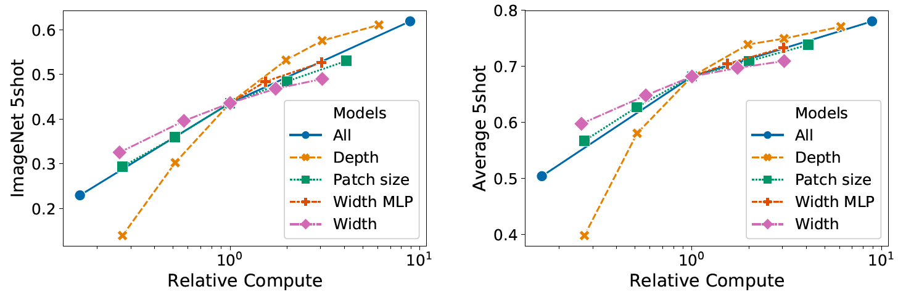

#### D.3 ヘッドのタイプとクラストークン

元のTransformerモデルに可能な限り近づけるため、我々は追加の `[class]` トークンを利用し、これを画像表現として採用した。このトークンの出力は、単一の隠れ層に非線形性としてtanhを持つ小さな多層パーセプトロン（MLP）を介して、クラス予測へと変換される。

この設計はテキスト向けのTransformerモデルから受け継いだものであり、論文全体を通して使用している。画像パッチの埋め込みのみを使用し、それらをグローバル平均プーリング（GAP）して線形分類器にかける（ResNetの最終特徴マップと全く同じようにする）という最初の試みは、非常に低い性能に終わった。しかし、これは追加のトークンがないことやGAP操作が原因ではないことがわかった。そうではなく、性能差は完全に異なる学習率を必要とすることによって説明される（図9を参照）。

図9: クラストークン分類器とグローバル平均プーリング分類器の比較。両方とも同様にうまく機能するが、異なる学習率を必要とする。

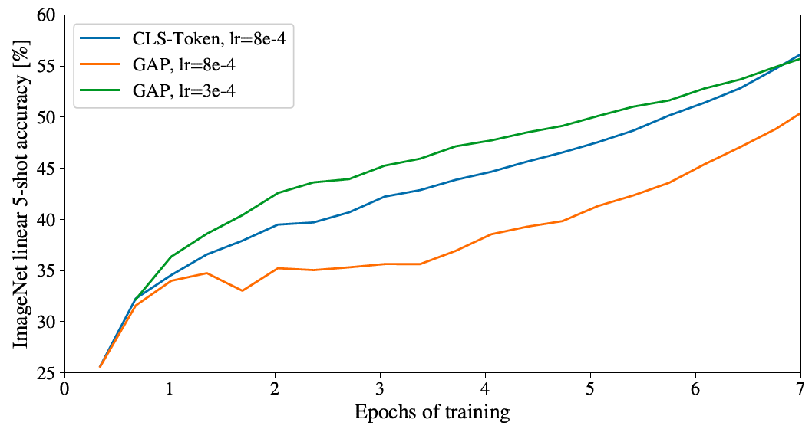

#### D.4 位置埋め込み

我々は、位置埋め込みを用いて空間情報をエンコードする様々な方法についてアブレーション実験を行った。以下のケースを試した。
*   位置情報を提供しない: 入力をパッチの「バッグ（bag）」と見なす。
*   1次元の位置埋め込み: 入力をラスタ順（左上から右下へ）のパッチシーケンスと見なす（本論文の他のすべての実験でのデフォルト）。
*   2次元の位置埋め込み: 入力を2次元のパッチのグリッドと見なす。この場合、それぞれの軸に対してX-埋め込みとY-埋め込みという2セットの埋め込み（各サイズ $D/2$ ）が学習される。そして、入力におけるパッチの座標に基づいてX埋め込みとY埋め込みを連結し、そのパッチの最終的な位置埋め込みを得る。
*   相対的位置埋め込み: パッチの絶対的な位置ではなく、パッチ間の相対的な距離を用いて空間情報をエンコードする。そのために、1次元の相対アテンション（Relative Attention）を使用し、すべての可能なパッチのペア間の相対距離を定義する。したがって、与えられたすべてのペア（一方はクエリ、もう一方はアテンション機構におけるキー/値）に対してオフセット $p_q - p_k$ を持ち、各オフセットに埋め込みが関連付けられる。その後、元のクエリ（クエリのコンテンツ）を使用しつつ、相対位置埋め込みをキーとして使用して追加のアテンションを実行する。そして、この相対アテンションからのロジットをバイアス項として使用し、ソフトマックスを適用する前にメインのアテンション（コンテンツベースのアテンション）のロジットに加算する。

空間情報をエンコードする様々な方法に加えて、この情報を我々のモデルに組み込む様々な方法も試した。1次元および2次元の位置埋め込みについては、以下の3つのケースを試した：(1) モデルのステムの直後、入力をTransformerエンコーダに供給する前に位置埋め込みを入力に加算する（本論文の他のすべての実験でのデフォルト）、(2) 各層の最初で位置埋め込みを学習して入力に加算する、(3) 各層の最初で学習済みの位置埋め込みを入力に加算する（層間で共有される）。

表8: ImageNet 5-shot linearで評価した、ViT-B/16モデルでの位置埋め込みに関するアブレーション研究の結果。

| Pos. Emb. | Default/Stem | Every Layer | Every Layer-Shared |
| :--- | :--- | :--- | :--- |
| No Pos. Emb. | 0.61382 | N/A | N/A |
| 1-D Pos. Emb. | 0.64206 | 0.63964 | 0.64292 |
| 2-D Pos. Emb. | 0.64001 | 0.64046 | 0.64022 |
| Rel. Pos. Emb. | 0.64032 | N/A | N/A |

表8に、ViT-B/16モデルにおけるこのアブレーション実験の結果をまとめる。見てわかるように、位置埋め込みを持たないモデルと位置埋め込みを持つモデルとの間には性能に大きな差があるが、位置情報をエンコードする様々な方法の間にはほとんど、あるいは全く差がない。我々のTransformerエンコーダはピクセルレベルではなくパッチレベルの入力で動作するため、空間情報をどのようにエンコードするかという違いはそれほど重要ではないと推測している。より正確には、パッチレベルの入力では空間次元が元のピクセルレベルの入力よりもはるかに小さく（例えば 224×224 ではなく 14×14）、この解像度において空間的関係を表現する学習は、これらの様々な位置エンコーディング戦略において等しく容易なのである。そうは言っても、ネットワークによって学習される位置埋め込みの類似性の特定のパターンは、学習のハイパーパラメータに依存する（図10）。

図10: 異なるハイパーパラメータで学習されたモデルの位置埋め込み。

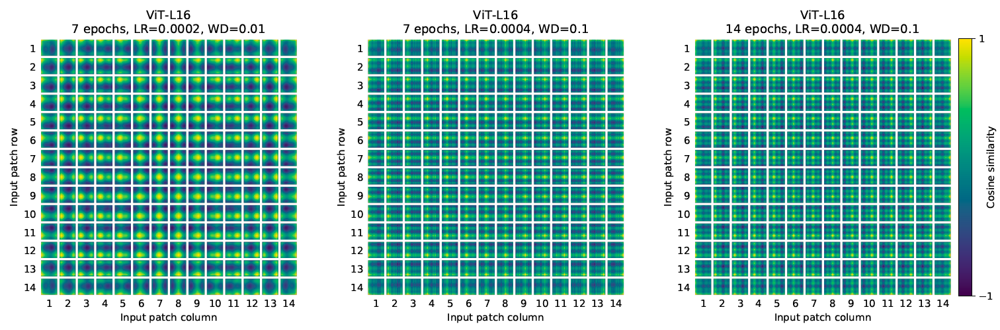

#### D.5 経験的な計算コスト

我々は、ハードウェア上でのアーキテクチャの実際の実行速度にも関心がある。レーン幅やキャッシュサイズなどの詳細により、理論的なFLOPsでは常にうまく予測できるとは限らないためである。この目的のために、我々はTPUv3アクセラレータ上で、主要な関心対象のモデルの推論速度のタイミングを計測した。推論とバックプロパゲーションの速度の差は、モデルに依存しない定数係数である。

図12（左）は、様々な入力サイズにおいて、1つのコアが1秒間に処理できる画像数を示している。各点は、様々なバッチサイズにわたって測定されたピーク性能を指す。見てわかるように、画像サイズに対するViTの理論的な2乗のスケーリングは、最大の解像度における最大のモデルでようやく現れ始めている。

図12: 左：様々な入力サイズにわたる様々なアーキテクチャの実際の実行時間の計測。ViTモデルは、同等のResNetと同等の速度を持っている。右：様々な入力サイズにわたる様々なアーキテクチャを用いた、デバイスに収まるコアごとの最大バッチサイズ。ViTモデルは明らかにメモリ効率が高い。

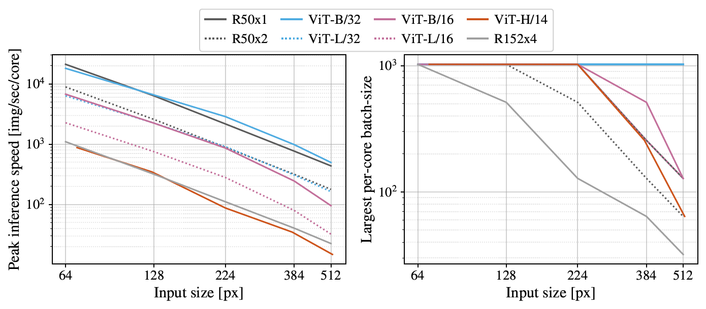

#### D.6 Axial Attention

Axial Attention（軸アテンション） [^58], [^18] は、多次元テンソルとして構成された大規模な入力に対して自己注意を実行するための、シンプルだが効果的な手法である。Axial Attentionの一般的なアイデアは、入力の平坦化されたバージョンに1次元のアテンションを適用するのではなく、入力テンソルの単一の軸に沿ってそれぞれアテンション操作を実行することである。Axial Attentionでは、各アテンションが特定の軸に沿って情報を混合する一方で、他の軸に沿った情報は独立に保つ。この路線に沿って、[^49] は ResNet50におけるカーネルサイズ 3×3 のすべての畳み込みを、相対位置エンコーディングによって拡張されたAxial Self-Attention（すなわち、行と列のアテンション）に置き換えた AxialResNet モデルを提案した。我々はベースラインモデルとしてAxialResNetを実装した [^axial_resnet] 。

さらに、我々はViTを修正し、1次元のパッチシーケンスの代わりに2次元形状の入力を処理するようにし、Axial Transformerブロックを組み込んだ。ここでは、自己注意の後にMLPを配置するのではなく、行自己注意（row-self-attention）とそれに続くMLP、そして列自己注意（column-self-attention）とそれに続くMLPという構成になっている。

図13は、JFTデータセットで事前学習された場合の、ImageNet 5-shot linear における Axial ResNet、Axial-ViT-B/32、および Axial-ViT-B/16 の性能を、FLOPs数および推論時間（1秒あたりの画像数）の観点から事前学習の計算量に対して提示している。見てわかるように、Axial-ViT-B/32 と Axial-ViT-B/16 の両方が性能の点で対応する ViT-B よりも優れているが、それはより多くの計算コストを犠牲にしている。これは、Axial-ViTモデルでは、グローバルな自己注意を持つ各Transformerブロックが、行と列の自己注意を持つ2つのAxial Transformerブロックに置き換えられており、自己注意が機能するシーケンス長はAxialのケースの方が小さいものの、Axial-ViTブロックごとに余分なMLPが存在するためである。AxialResNetについては、精度/計算量のトレードオフの観点からは妥当に見えるが（図13、左）、ナイーブな実装はTPU上で極めて遅い（図13、右）。

図13: FLOPs数（左）および推論時間（右）の観点からの速度に対する、ImageNet 5-shot linear におけるtop-1精度という点でのAxial-Attentionベースのモデルの性能。

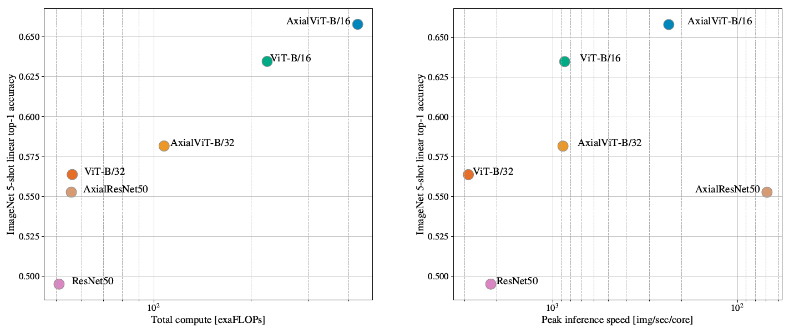

#### D.7 アテンション距離

ViTが画像全体の情報を統合するために自己注意をどのように使用しているかを理解するために、我々は様々な層でのアテンションの重みが及ぶ平均距離を分析した（図11）。この「アテンション距離」はCNNにおける受容野のサイズに類似している。平均アテンション距離は下位層のヘッド間で大きく変動し、一部のヘッドは画像の大部分に注意を向ける一方で、他のヘッドはクエリの場所、あるいはその近くの小さな領域に注意を向ける。深さが増すにつれて、すべてのヘッドでアテンション距離が長くなる。ネットワークの後半では、ほとんどのヘッドがトークン全体にわたって広く注意を向ける。

図11: ヘッドおよびネットワークの深さごとのアテンド領域のサイズ。アテンション距離は、128枚のサンプル画像について、アテンションの重みで重み付けされたクエリピクセルと他のすべてのピクセルとの間の距離を平均することによって計算された。各ドットは、1つの層にある16のヘッドの1つについて、画像全体での平均アテンション距離を示している。画像の幅は224ピクセルである。

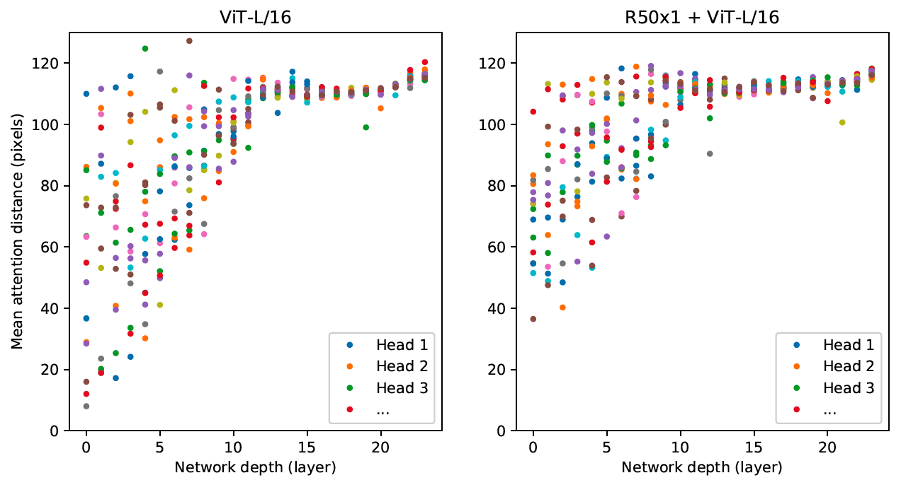

#### D.8 アテンションマップ

出力トークンから入力空間へのアテンションのマップ（図6および14）を計算するために、我々はAttention Rollout [^1] を使用した。簡単に言うと、ViT-L/16のすべてのアテンションヘッドにわたってアテンションの重みを平均し、次にすべての層の重み行列を再帰的に掛け合わせた。これにより、すべての層を通じてトークン全体でアテンションが混合されることを考慮に入れている。

図14: 図6と同様の、さらなるアテンションマップの例（ランダム選択）。

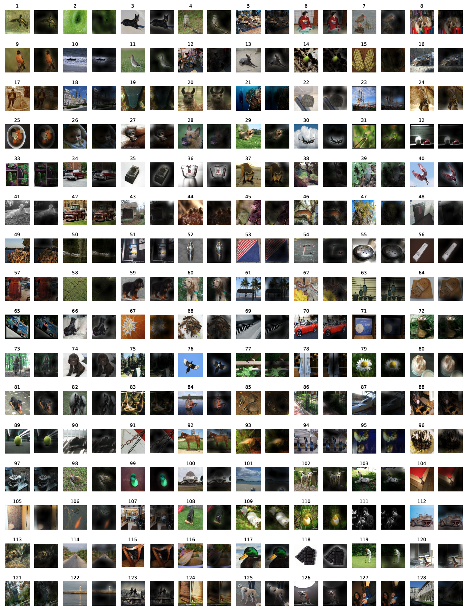

#### D.9 ObjectNetの結果

我々はまた、[^25] の評価セットアップに従い、ObjectNetベンチマークで我々の主力モデルであるViT-H/14を評価し、top-5精度82.1%、top-1精度61.7%という結果を得た。

#### D.10 VTABの内訳

表9は、各VTAB-1kタスクで達成されたスコアを示している。

表9: VTAB-1kタスクごとの性能の内訳。

| | Caltech101 | CIFAR-100 | DTD | Flowers102 | Pets | Sun397 | SVHN | Camelyon | EuroSAT | Resisc45 | Retinopathy | Clevr-Count | Clevr-Dist | DMLab | dSpr-Loc | dSpr-Ori | KITTI-Dist | sNORB-Azim | sNORB-Elev | Mean |
| :--- | :--- | :--- | :--- | :--- | :--- | :--- | :--- | :--- | :--- | :--- | :--- | :--- | :--- | :--- | :--- | :--- | :--- | :--- | :--- | :--- |
| ViT-H/14 (JFT) | 95.3 | 85.5 | 75.2 | 99.7 | 97.2 | 65.0 | 88.9 | 83.3 | 96.7 | 91.4 | 76.6 | 91.7 | 63.8 | 53.1 | 79.4 | 63.3 | 84.5 | 33.2 | 51.2 | 77.6 |
| ViT-L/16 (JFT) | 95.4 | 81.9 | 74.3 | 99.7 | 96.7 | 63.5 | 87.4 | 83.6 | 96.5 | 89.7 | 77.1 | 86.4 | 63.1 | 49.7 | 74.5 | 60.5 | 82.2 | 36.2 | 51.1 | 76.3 |
| ViT-L/16 (I21k) | 90.8 | 84.1 | 74.1 | 99.3 | 92.7 | 61.0 | 80.9 | 82.5 | 95.6 | 85.2 | 75.3 | 70.3 | 56.1 | 41.9 | 74.7 | 64.9 | 79.9 | 30.5 | 41.7 | 72.7 |
