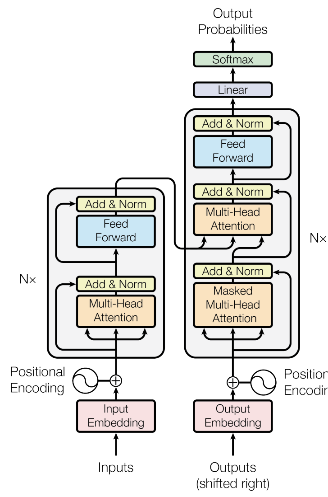
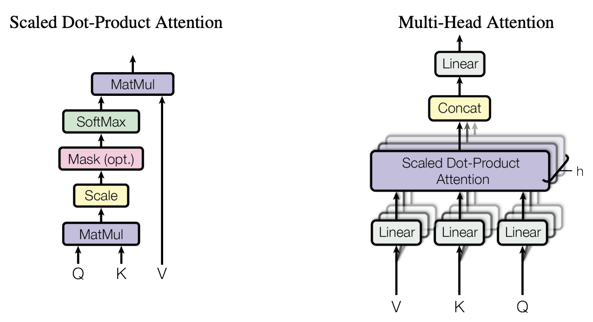
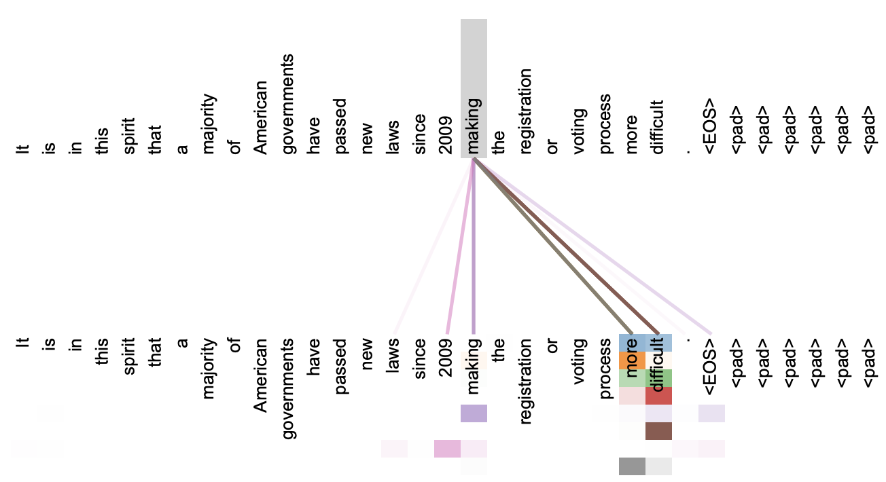
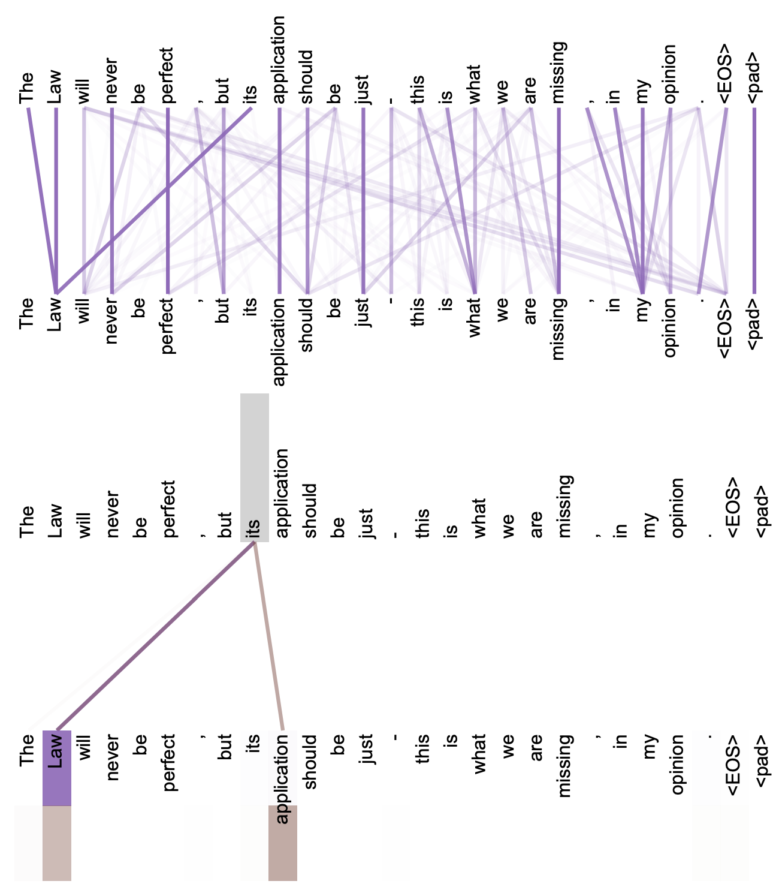
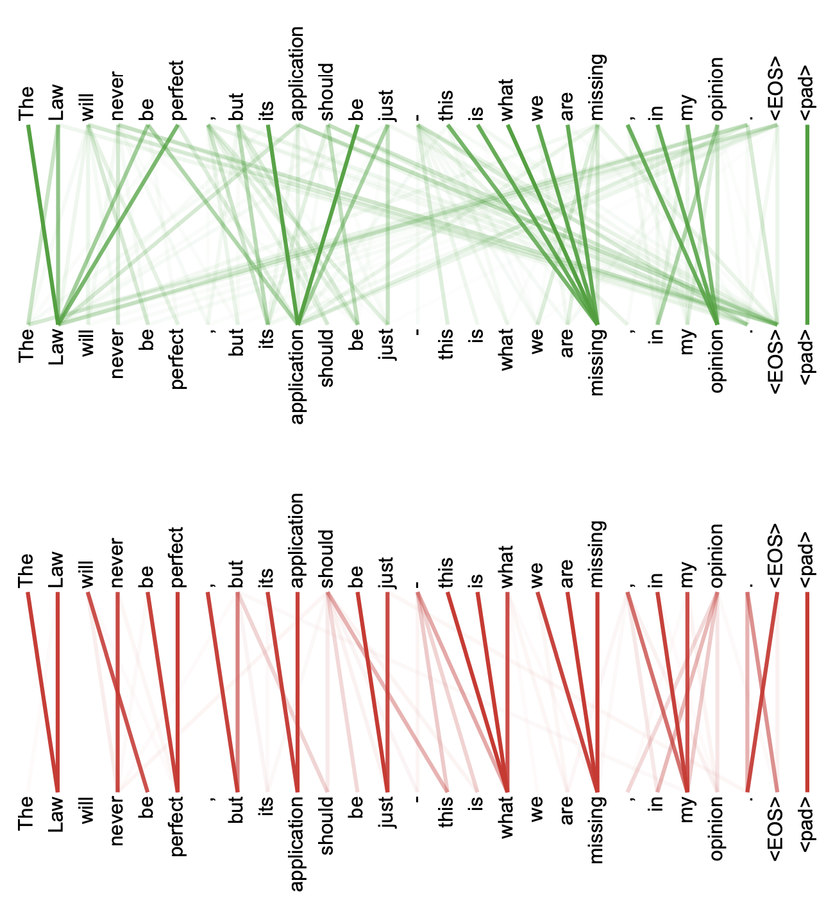

# Attention Is All You Need

[Attention Is All You Need](https://arxiv.org/pdf/1706.03762)

## 概要

主要な系列変換モデル（sequence transduction models）は、エンコーダとデコーダを含む複雑な再帰的ニューラルネットワーク（RNN）または畳み込みニューラルネットワーク（CNN）に基づいています。最高の性能を発揮するモデルもまた、エンコーダとデコーダをattention（注意）メカニズムによって接続しています。我々は、再帰や畳み込みを完全に排除し、attentionメカニズムのみに基づいた新しいシンプルなネットワークアーキテクチャ、Transformerを提案します。2つの機械翻訳タスクでの実験において、これらのモデルは品質において優れているだけでなく、より並列化が可能であり、学習に必要な時間が大幅に少ないことが示されました。WMT 2014 英独翻訳タスクにおいて、我々のモデルは28.4 BLEUを達成し、アンサンブルを含む既存の最良の結果を2 BLEU以上向上させました。WMT 2014 英仏翻訳タスクにおいては、我々のモデルは8つのGPUで3.5日間の学習を行った後、新たなシングルモデルのSOTA（state-of-the-art）となるBLEUスコア41.8を確立しました。これは文献における最良のモデルの学習コストのほんの一部です。また、英語の構成素解析（constituency parsing）に適用することで、大規模な学習データおよび限られた学習データの両方において、Transformerが他のタスクにもうまく一般化することを示します。

## 1 はじめに

再帰的ニューラルネットワーク（RNN）、特にLSTM [^13] およびGated Recurrent Neural Networks [^7] は、言語モデリングや機械翻訳 [^35], [^2], [^5] などの系列モデリングおよび変換問題における最先端のアプローチとして確固たる地位を築いています。それ以来、再帰的言語モデルとエンコーダ・デコーダアーキテクチャの限界を押し広げるための数多くの努力が続けられてきました [^38], [^24], [^15]。

再帰モデルは通常、入力および出力系列のシンボル位置に沿って計算を因数分解します。位置を計算時間のステップに合わせることで、前の隠れ状態 $h_{t-1}$ と位置 $t$ の入力の関数として、隠れ状態の列 $h_t$ を生成します。この本質的にシーケンシャルな性質は、学習サンプル内での並列化を妨げます。メモリの制約によりサンプル間のバッチ処理が制限されるため、これは系列の長さが長くなるほど決定的となります。最近の研究では、因数分解のトリック [^21] や条件付き計算 [^32] を通じて計算効率の大幅な改善が達成され、後者の場合はモデルの性能も向上しました。しかし、シーケンシャルな計算という根本的な制約は残っています。

Attentionメカニズムは、様々なタスクにおける説得力のある系列モデリングおよび変換モデルの不可欠な要素となっており、入力または出力系列における距離に関係なく依存関係をモデル化することを可能にしています [^2], [^19]。しかし、少数のケース [^27] を除き、そのようなattentionメカニズムは再帰的ネットワークと組み合わせて使用されています。

本研究では、再帰を回避し、代わりに入力と出力の間の大域的な依存関係を引き出すためにattentionメカニズムのみに依存するモデルアーキテクチャ、Transformerを提案します。Transformerは、大幅な並列化を可能にし、8つのP100 GPUでわずか12時間の学習を行った後、翻訳品質において新たなSOTAに到達することができます。

## 2 背景

シーケンシャルな計算を削減するという目標は、Extended Neural GPU [^16]、ByteNet [^18]、およびConvS2S [^9] の基礎ともなっています。これらはすべて、基本的な構成要素として畳み込みニューラルネットワーク（CNN）を使用し、すべての入力および出力位置の隠れ表現を並列に計算します。これらのモデルでは、任意の2つの入力または出力位置からの信号を関連付けるために必要な操作の数は、位置間の距離に応じて増大します。ConvS2Sでは線形に、ByteNetでは対数的に増大します。これにより、離れた位置間の依存関係を学習することがより困難になります [^12]。Transformerでは、これは定数回の操作に削減されますが、attentionによる重み付き位置の平均化のために有効解像度が低下するという代償を伴います。この影響については、セクション3.2で説明するMulti-Head Attentionによって対処します。

Self-attention（自己注意）、時にはintra-attentionと呼ばれるものは、単一の系列の異なる位置を関連付けて、その系列の表現を計算するattentionメカニズムです。Self-attentionは、読解（reading comprehension）、抽象的要約（abstractive summarization）、テキスト含意（textual entailment）、およびタスクに依存しない文表現の学習など、様々なタスクで成功裏に使用されています [^4], [^27], [^28], [^22]。

End-to-endメモリネットワークは、系列にアライメントされた再帰ではなく、再帰的なattentionメカニズムに基づいており、単純な言語の質問応答や言語モデリングタスクで良好に機能することが示されています [^34]。

しかし、我々の知る限り、Transformerは、系列にアライメントされたRNNや畳み込みを使用せずに、入力と出力の表現を計算するためにSelf-attentionのみに依存する最初の変換モデルです。以下のセクションでは、Transformerについて説明し、Self-attentionの動機付けを行い、[^17], [^18] や [^9] などのモデルに対するその利点を議論します。

## 3 モデルアーキテクチャ

最も競争力のあるニューラル系列変換モデルは、エンコーダ・デコーダ構造を持っています [^5], [^2], [^35]。ここで、エンコーダはシンボル表現の入力系列 $(x_1, ..., x_n)$ を連続表現の系列 $z = (z_1, ..., z_n)$ にマッピングします。$z$ が与えられると、デコーダはシンボルの出力系列 $(y_1, ..., y_m)$ を一度に1要素ずつ生成します。各ステップにおいて、モデルは自己回帰的（auto-regressive） [^10] であり、次を生成する際に追加の入力として以前に生成されたシンボルを消費します。

図1：Transformer - モデルアーキテクチャ。
Transformerはこの全体的なアーキテクチャに従い、図1の左半分と右半分にそれぞれ示されているように、エンコーダとデコーダの両方に積み重ねられたSelf-attentionとポイントワイズな全結合層を使用します。



### 3.1 エンコーダとデコーダのスタック

**エンコーダ:** エンコーダは $N = 6$ 個の同一の層のスタックで構成されています。各層には2つのサブレイヤーがあります。1つ目はMulti-Head Self-Attentionメカニズムであり、2つ目は単純な位置ごとの全結合フィードフォワードネットワークです。我々は、2つのサブレイヤーのそれぞれの周りに残差接続（residual connection） [^11] を採用し、その後に層正規化（layer normalization） [^1] を行います。つまり、各サブレイヤーの出力は $LayerNorm(x + Sublayer(x))$ です。ここで $Sublayer(x)$ はサブレイヤー自体によって実装される関数です。これらの残差接続を容易にするために、モデル内のすべてのサブレイヤーおよび埋め込み層は、次元 $d_{model} = 512$ の出力を生成します。

**デコーダ:** デコーダもまた $N = 6$ 個の同一の層のスタックで構成されています。各エンコーダ層にある2つのサブレイヤーに加えて、デコーダはエンコーダスタックの出力に対してMulti-Head Attentionを実行する3つ目のサブレイヤーを挿入します。エンコーダと同様に、各サブレイヤーの周りに残差接続を採用し、その後に層正規化を行います。また、デコーダスタック内のSelf-attentionサブレイヤーを変更して、位置がそれ以降の位置にattendしないようにします。このマスキングは、出力埋め込みが1位置オフセットされている事実と組み合わされ、位置 $i$ の予測が $i$ より小さい位置にある既知の出力のみに依存できることを保証します。

### 3.2 Attention

Attention関数は、クエリ（Query）と一組のキー（Key）・バリュー（Value）のペアを出力にマッピングするものとして記述できます。ここで、クエリ、キー、バリュー、および出力はすべてベクトルです。出力はバリューの加重和として計算され、各バリューに割り当てられる重みは、クエリと対応するキーとの互換性関数によって計算されます。

図2：(左) Scaled Dot-Product Attention。(右) Multi-Head Attentionは、並列に実行されるいくつかのattention層で構成されています。



#### 3.2.1 Scaled Dot-Product Attention

我々は、我々の特定のattentionを「Scaled Dot-Product Attention（スケーリングされたドット積注意）」（図2）と呼びます。入力は、次元 $d_k$ のクエリとキー、および次元 $d_v$ のバリューで構成されます。我々はクエリとすべてのキーとのドット積を計算し、それぞれを $\sqrt{d_k}$ で割り、バリューに対する重みを得るためにsoftmax関数を適用します。

実際には、一連のクエリに対するattention関数を同時に計算し、行列 $Q$ にまとめます。キーとバリューも同様に行列 $K$ と $V$ にまとめられます。我々は出力の行列を次のように計算します：

```math
Attention(Q, K, V) = \text{softmax}\left(\frac{QK^T}{\sqrt{d_k}}\right)V \quad (1)
```

最も一般的に使用される2つのattention関数は、加法注意（additive attention） [^2] とドット積（乗法）注意（dot-product (multiplicative) attention）です。ドット積注意は、スケーリング係数 $\frac{1}{\sqrt{d_k}}$ を除いて我々のアルゴリズムと同一です。加法注意は、単一の隠れ層を持つフィードフォワードネットワークを使用して互換性関数を計算します。2つは理論的な複雑さにおいては似ていますが、ドット積注意は高度に最適化された行列乗算コードを使用して実装できるため、実際にははるかに高速でスペース効率が良いです。

$d_k$ の値が小さい場合、2つのメカニズムは同様に機能しますが、$d_k$ の値が大きい場合、スケーリングなしのドット積注意は加法注意よりも性能が劣ります [^3]。我々は、$d_k$ の値が大きい場合、ドット積の大きさが大きくなり、softmax関数を勾配が極めて小さい領域に押しやると推測しています[^4]。この効果を打ち消すために、ドット積を $\frac{1}{\sqrt{d_k}}$ でスケーリングします。

[^4]: ドット積が大きくなる理由を説明するために、$q$ と $k$ の成分が平均0、分散1の独立した確率変数であると仮定します。すると、それらのドット積 $q \cdot k = \sum_{i=1}^{d_k} q_i k_i$ は、平均0、分散 $d_k$ を持ちます。

#### 3.2.2 Multi-Head Attention

$d_{model}$ 次元のキー、バリュー、クエリで単一のattention関数を実行する代わりに、クエリ、キー、バリューをそれぞれ $d_k, d_k, d_v$ 次元へと、異なる学習された線形射影で $h$ 回線形射影することが有益であるとわかりました。これらの射影されたクエリ、キー、バリューの各バージョンに対して、並列にattention関数を実行し、$d_v$ 次元の出力バリューを生成します。これらは連結され、再一次射影されて最終的なバリューとなります（図2参照）。

Multi-Head Attentionにより、モデルは異なる位置にある異なる表現部分空間からの情報に共同でattendすることが可能になります。単一のattentionヘッドでは、平均化によってこれが抑制されます。

```math
\text{MultiHead}(Q, K, V) = \text{Concat}(\text{head}_1, ..., \text{head}_h)W^O \\
\text{where } \text{head}_i = \text{Attention}(QW_i^Q, KW_i^K, VW_i^V)
```

ここで、射影はパラメータ行列 $W_i^Q \in \mathbb{R}^{d_{model} \times d_k}$、$W_i^K \in \mathbb{R}^{d_{model} \times d_k}$、$W_i^V \in \mathbb{R}^{d_{model} \times d_v}$、および $W^O \in \mathbb{R}^{hd_v \times d_{model}}$ です。

本研究では、$h = 8$ 個の並列attention層、つまりヘッドを採用します。これらのそれぞれについて、$d_k = d_v = d_{model}/h = 64$ を使用します。各ヘッドの次元が削減されているため、総計算コストはフル次元のシングルヘッドattentionと同様です。

#### 3.2.3 我々のモデルにおけるAttentionの適用

Transformerは、Multi-Head Attentionを3つの異なる方法で使用します：

*   「エンコーダ・デコーダattention」層では、クエリは前のデコーダ層から来ており、メモリキーとバリューはエンコーダの出力から来ています。これにより、デコーダのすべての位置が入力系列のすべての位置にattendできるようになります。これは、[^38], [^2], [^9] などのsequence-to-sequenceモデルにおける典型的なエンコーダ・デコーダattentionメカニズムを模倣しています。
*   エンコーダにはSelf-attention層が含まれています。Self-attention層では、すべてのキー、バリュー、クエリは同じ場所、この場合はエンコーダの前の層の出力から来ます。エンコーダの各位置は、エンコーダの前の層のすべての位置にattendできます。
*   同様に、デコーダ内のSelf-attention層は、デコーダの各位置が、その位置を含むそれまでのデコーダ内のすべての位置にattendすることを可能にします。自己回帰特性を維持するために、デコーダ内の左方向への情報の流れを防ぐ必要があります。これは、不正な接続に対応するsoftmaxの入力のすべての値をマスクアウト（$-\infty$ に設定）することによって、Scaled Dot-Product Attentionの内部で実装されます。図2を参照してください。

### 3.3 Position-wise Feed-Forward Networks

Attentionサブレイヤーに加えて、エンコーダとデコーダの各層には、各位置に個別に同一に適用される全結合フィードフォワードネットワークが含まれています。これは、間にReLU活性化を挟んだ2つの線形変換で構成されています。

```math
FFN(x) = \max(0, xW_1 + b_1)W_2 + b_2 \quad (2)
```

線形変換は異なる位置で同じですが、層ごとに異なるパラメータを使用します。これを説明する別の方法は、カーネルサイズ1の2つの畳み込みです。入力と出力の次元は $d_{model} = 512$ であり、内部層の次元は $d_{ff} = 2048$ です。

### 3.4 埋め込みとSoftmax

他の系列変換モデルと同様に、学習された埋め込みを使用して、入力トークンと出力トークンを次元 $d_{model}$ のベクトルに変換します。また、通常の学習された線形変換とsoftmax関数を使用して、デコーダ出力を予測された次のトークンの確率に変換します。我々のモデルでは、2つの埋め込み層とsoftmax前の線形変換の間で同じ重み行列を共有しています（[^30] と同様）。埋め込み層では、それらの重みに $\sqrt{d_{model}}$ を乗算します。

### 3.5 位置エンコーディング (Positional Encoding)

我々のモデルには再帰も畳み込みも含まれていないため、モデルが系列の順序を利用できるようにするには、系列内のトークンの相対的または絶対的な位置に関する情報を注入する必要があります。この目的のために、エンコーダとデコーダのスタックの最下部にある入力埋め込みに「位置エンコーディング」を追加します。位置エンコーディングは埋め込みと同じ次元 $d_{model}$ を持っているため、2つを加算することができます。位置エンコーディングには、学習されたものや固定されたものなど、多くの選択肢があります [^9]。

本研究では、異なる周波数の正弦関数と余弦関数を使用します：

```math
PE_{(pos, 2i)} = \sin(pos / 10000^{2i/d_{model}})
```
```math
PE_{(pos, 2i+1)} = \cos(pos / 10000^{2i/d_{model}})
```

ここで $pos$ は位置、$i$ は次元です。つまり、位置エンコーディングの各次元は正弦波に対応します。波長は $2\pi$ から $10000 \cdot 2\pi$ までの幾何級数を形成します。我々がこの関数を選んだのは、任意の固定オフセット $k$ に対して、$PE_{pos+k}$ が $PE_{pos}$ の線形関数として表現できるため、モデルが相対位置によるattentionを容易に学習できるだろうと仮説を立てたからです。

また、代わりに学習された位置埋め込み [^9] を使用する実験も行いましたが、2つのバージョンがほぼ同一の結果を生み出すことがわかりました（表3の行(E)を参照）。我々が正弦波バージョンを選んだのは、モデルが学習中に遭遇したものよりも長い系列長に対して外挿できる可能性があるためです。

## 4 なぜSelf-Attentionなのか

このセクションでは、Self-attention層の様々な側面を、典型的な系列変換エンコーダまたはデコーダの隠れ層など、ある可変長シンボル表現の系列 $(x_1, ..., x_n)$ を別の等しい長さの系列 $(z_1, ..., z_n)$（ここで $x_i, z_i \in \mathbb{R}^d$）にマッピングするために一般的に使用される再帰的層および畳み込み層と比較します。Self-attentionの使用を動機付けるために、我々は3つの要望を考慮します。

1つ目は、層ごとの総計算複雑性です。もう1つは、必要とされるシーケンシャルな操作の最小数によって測定される、並列化可能な計算量です。

3つ目は、ネットワーク内の長距離依存関係間のパスの長さです。長距離依存関係の学習は、多くの系列変換タスクにおける重要な課題です。そのような依存関係を学習する能力に影響を与える重要な要因の1つは、順方向および逆方向の信号がネットワーク内を通過しなければならないパスの長さです。入力系列と出力系列の位置の任意の組み合わせ間のこれらのパスが短いほど、長距離依存関係を学習しやすくなります [^12]。したがって、異なる層タイプで構成されたネットワークにおける任意の2つの入力および出力位置間の最大パス長も比較します。

表1：層タイプごとの最大パス長、層ごとの複雑性、およびシーケンシャルな操作の最小数。$n$ は系列長、$d$ は表現次元、$k$ は畳み込みのカーネルサイズ、$r$ は制限付きSelf-attentionにおける近傍サイズです。

| Layer Type | Complexity per Layer | Sequential Operations | Maximum Path Length |
| :--- | :--- | :--- | :--- |
| Self-Attention | $O(n^2 \cdot d)$ | $O(1)$ | $O(1)$ |
| Recurrent | $O(n \cdot d^2)$ | $O(n)$ | $O(n)$ |
| Convolutional | $O(k \cdot n \cdot d^2)$ | $O(1)$ | $O(\log_k(n))$ |
| Self-Attention (restricted) | $O(r \cdot n \cdot d)$ | $O(1)$ | $O(n/r)$ |

表1に示されているように、Self-attention層はすべての位置を定数回のシーケンシャルに実行される操作で接続しますが、再帰的層は $O(n)$ 回のシーケンシャルな操作を必要とします。計算複雑性の点では、系列長 $n$ が表現次元 $d$ よりも小さい場合、Self-attention層は再帰的層よりも高速です。これは、word-piece [^38] やbyte-pair [^31] 表現など、機械翻訳の最先端モデルで使用される文表現では最も頻繁にあるケースです。非常に長い系列を含むタスクの計算性能を向上させるために、Self-attentionは、それぞれの出力位置を中心とした入力系列内のサイズ $r$ の近傍のみを考慮するように制限することができます。これにより、最大パス長は $O(n/r)$ に増加します。我々はこのアプローチについて、今後の研究でさらに調査する予定です。

カーネル幅 $k < n$ の単一の畳み込み層は、すべての入力と出力位置のペアを接続しません。そうするには、連続したカーネルの場合は $O(n/k)$ 個の畳み込み層のスタック、拡張畳み込み（dilated convolutions） [^18] の場合は $O(\log_k(n))$ 個のスタックが必要となり、ネットワーク内の任意の2つの位置間の最長パスの長さが増加します。畳み込み層は一般に、再帰的層よりも $k$ 倍高価です。しかし、Separable convolutions [^6] は、複雑性を $O(k \cdot n \cdot d + n \cdot d^2)$ に大幅に削減します。それでも、$k = n$ の場合、Separable convolutionの複雑性は、我々がモデルで採用しているアプローチであるSelf-attention層とポイントワイズ・フィードフォワード層の組み合わせと等しくなります。

副次的な利点として、Self-attentionはより解釈可能なモデルを生み出す可能性があります。我々はモデルからのattention分布を検査し、付録で例を提示し議論します。個々のattentionヘッドが異なるタスクを実行することを明確に学習するだけでなく、多くは文の構文的および意味的構造に関連する動作を示すように見えます。

## 5 学習

このセクションでは、我々のモデルの学習体制について説明します。

### 5.1 学習データとバッチ処理

我々は、約450万の文ペアからなる標準的なWMT 2014 英独データセットで学習を行いました。文は、約37000トークンの共有ソース-ターゲット語彙を持つbyte-pair encoding [^3] を使用してエンコードされました。英仏については、3600万文からなる大幅に大きなWMT 2014 英仏データセットを使用し、トークンを32000のword-piece語彙 [^38] に分割しました。文ペアは、近似的な系列長によってバッチ化されました。各学習バッチには、約25000のソース・トークンと25000のターゲット・トークンを含む一連の文ペアが含まれていました。

### 5.2 ハードウェアとスケジュール

我々は、8つのNVIDIA P100 GPUを搭載した1台のマシンでモデルを学習しました。論文全体で説明されているハイパーパラメータを使用したベースモデルの場合、各学習ステップには約0.4秒かかりました。ベースモデルは合計100,000ステップ、つまり12時間学習させました。ビッグモデル（表3の最下行に記載）の場合、ステップ時間は1.0秒でした。ビッグモデルは300,000ステップ（3.5日）学習させました。

### 5.3 オプティマイザ

我々は、$\beta_1 = 0.9, \beta_2 = 0.98$ および $\epsilon = 10^{-9}$ のAdamオプティマイザ [^20] を使用しました。学習率は、以下の式に従って学習の経過とともに変化させました：

```math
lrate = d_{model}^{-0.5} \cdot \min(step\_num^{-0.5}, step\_num \cdot warmup\_steps^{-1.5}) \quad (3)
```

これは、最初の $warmup\_steps$ 学習ステップでは学習率を線形に増加させ、その後はステップ数の逆平方根に比例して減少させることに対応します。我々は $warmup\_steps = 4000$ を使用しました。

### 5.4 正則化

学習中、以下の3種類の正則化を採用しました：

**Residual Dropout** 各サブレイヤーの出力がサブレイヤーの入力に加算され正規化される前に、ドロップアウト [^33] を適用します。さらに、エンコーダとデコーダの両方のスタックにおいて、埋め込みと位置エンコーディングの和にドロップアウトを適用します。ベースモデルでは、$P_{drop} = 0.1$ のレートを使用します。

**Label Smoothing** 学習中、値 $\epsilon_{ls} = 0.1$ のラベルスムージング [^36] を採用しました。これは、モデルがより不確実になることを学習するため、perplexity（当惑度）を悪化させますが、精度とBLEUスコアを向上させます。

## 6 結果

### 6.1 機械翻訳

WMT 2014 英独翻訳タスクにおいて、ビッグTransformerモデル（表2のTransformer (big)）は、以前に報告された最良のモデル（アンサンブルを含む）を $2.0$ BLEU以上上回り、新たなSOTAのBLEUスコア $28.4$ を確立しました。このモデルの構成は表3の最下行に記載されています。学習は8つのP100 GPUで $3.5$ 日かかりました。我々のベースモデルでさえ、以前に公開されたすべてのモデルとアンサンブルを凌駕しており、競合するどのモデルの学習コストのほんの一部で済んでいます。

WMT 2014 英仏翻訳タスクにおいて、我々のビッグモデルはBLEUスコア $41.0$ を達成し、以前のSOTAモデルの学習コストの $1/4$ 未満で、以前に公開されたすべてのシングルモデルを上回りました。英仏用に学習されたTransformer (big) モデルは、$P_{drop} = 0.1$ ではなく $0.3$ のドロップアウト率を使用しました。

ベースモデルについては、10分間隔で書き出された最後の5つのチェックポイントを平均して得られた単一のモデルを使用しました。ビッグモデルについては、最後の20のチェックポイントを平均しました。我々はビームサイズ4、長さペナルティ $\alpha = 0.6$ のビームサーチを使用しました [^38]。これらのハイパーパラメータは、開発セットでの実験後に選択されました。推論中の最大出力長を入力長 + 50に設定しましたが、可能な場合は早期に終了させます [^38]。

表2：Transformerは、英独および英仏のnewstest2014テストにおいて、以前のSOTAモデルよりも優れたBLEUスコアを、学習コストのほんの一部で達成しました。

| Model | BLEU (EN-DE) | BLEU (EN-FR) | Training Cost (FLOPs) EN-DE | Training Cost (FLOPs) EN-FR |
| :--- | :--- | :--- | :--- | :--- |
| ByteNet [^18] | 23.75 | | | |
| Deep-Att + PosUnk [^39] | | 39.2 | | $1.0 \cdot 10^{20}$ |
| GNMT + RL [^38] | 24.6 | 39.92 | $2.3 \cdot 10^{19}$ | $1.4 \cdot 10^{20}$ |
| ConvS2S [^9] | 25.16 | 40.46 | $9.6 \cdot 10^{18}$ | $1.5 \cdot 10^{20}$ |
| MoE [^32] | 26.03 | 40.56 | $2.0 \cdot 10^{19}$ | $1.2 \cdot 10^{20}$ |
| Deep-Att + PosUnk Ensemble [^39] | | 40.4 | | $8.0 \cdot 10^{20}$ |
| GNMT + RL Ensemble [^38] | 26.30 | 41.16 | $1.8 \cdot 10^{20}$ | $1.1 \cdot 10^{21}$ |
| ConvS2S Ensemble [^9] | 26.36 | 41.29 | $7.7 \cdot 10^{19}$ | $1.2 \cdot 10^{21}$ |
| Transformer (base model) | 27.3 | 38.1 | $3.3 \cdot 10^{18}$ | |
| Transformer (big) | 28.4 | 41.8 | $2.3 \cdot 10^{19}$ | |

表2は我々の結果を要約し、翻訳品質と学習コストを文献の他のモデルアーキテクチャと比較しています。我々は、学習時間、使用されたGPUの数、および各GPUの持続的な単精度浮動小数点容量の推定値 [^5] を乗算することにより、モデルの学習に使用された浮動小数点演算の数を推定しています。

[^5]: K80、K40、M40、P100に対してそれぞれ2.8、3.7、6.0、9.5 TFLOPSの値を使用しました。

### 6.2 モデルのバリエーション

Transformerの異なるコンポーネントの重要性を評価するために、ベースモデルを様々な方法で変更し、開発セットnewstest2013での英独翻訳の性能変化を測定しました。前のセクションで説明したようにビームサーチを使用しましたが、チェックポイントの平均化は行いませんでした。これらの結果を表3に示します。

表3：Transformerアーキテクチャのバリエーション。記載されていない値はベースモデルと同一です。すべてのメトリクスは英独翻訳開発セットnewstest2013でのものです。記載されているperplexityは、我々のbyte-pair encodingによるword-pieceごとのものであり、単語ごとのperplexityと比較すべきではありません。

| | $N$ | $d_{model}$ | $d_{ff}$ | $h$ | $d_k$ | $d_v$ | $P_{drop}$ | $\epsilon_{ls}$ | train steps | PPL (dev) | BLEU (dev) | params $\times 10^6$ |
| :--- | :--- | :--- | :--- | :--- | :--- | :--- | :--- | :--- | :--- | :--- | :--- | :--- |
| base | 6 | 512 | 2048 | 8 | 64 | 64 | 0.1 | 0.1 | 100K | 4.92 | 25.8 | 65 |
| (A) | | | | 1 | 512 | 512 | | | | 5.29 | 24.9 | |
| | | | | 4 | 128 | 128 | | | | 5.00 | 25.5 | |
| | | | | 16 | 32 | 32 | | | | 4.91 | 25.8 | |
| | | | | 32 | 16 | 16 | | | | 5.01 | 25.4 | |
| (B) | | | | | 16 | | | | | 5.16 | 25.1 | 58 |
| | | | | | 32 | | | | | 5.01 | 25.4 | 60 |
| (C) | 2 | | | | | | | | | 6.11 | 23.7 | 36 |
| | 4 | | | | | | | | | 5.19 | 25.3 | 50 |
| | 8 | | | | | | | | | 4.88 | 25.5 | 80 |
| | | 256 | | | 32 | 32 | | | | 5.75 | 24.5 | 28 |
| | | 1024 | | | 128 | 128 | | | | 4.66 | 26.0 | 168 |
| | | | 1024 | | | | | | | 5.12 | 25.4 | 53 |
| | | | 4096 | | | | | | | 4.75 | 26.2 | 90 |
| (D) | | | | | | | 0.0 | | | 5.77 | 24.6 | |
| | | | | | | | 0.2 | | | 4.95 | 25.5 | |
| | | | | | | | | 0.0 | | 4.67 | 25.3 | |
| | | | | | | | | 0.2 | | 5.47 | 25.7 | |
| (E) | positional embedding instead of sinusoids | | | | | | | | | 4.92 | 25.7 | |
| big | 6 | 1024 | 4096 | 16 | | 0.3 | | 300K | 4.33 | 26.4 | 213 |

表3の行(A)では、セクション3.2.2で説明したように、計算量を一定に保ちながら、attentionヘッドの数とattentionキーおよびバリューの次元を変化させています。シングルヘッドattentionは最良の設定よりも0.9 BLEU悪いですが、ヘッド数が多すぎても品質は低下します。

表3の行(B)では、attentionキーのサイズ $d_k$ を小さくするとモデルの品質が損なわれることが観察されます。これは、互換性を決定することが容易ではなく、ドット積よりも洗練された互換性関数が有益である可能性を示唆しています。さらに行(C)と(D)で、予想通り、より大きなモデルの方が優れており、ドロップアウトが過学習を避けるのに非常に役立つことが観察されます。行(E)では、正弦波位置エンコーディングを学習された位置埋め込み [^9] に置き換えていますが、ベースモデルとほぼ同一の結果が観察されます。

### 6.3 英語構成素解析 (English Constituency Parsing)

Transformerが他のタスクに一般化できるかを評価するために、英語の構成素解析に関する実験を行いました。このタスクは特定の課題を提示します：出力は強力な構造的制約の対象となり、入力よりも大幅に長くなります。さらに、RNN sequence-to-sequenceモデルは、小規模データの領域ではSOTAの結果を達成できていません [^37]。

我々は、Wall Street Journal (WSJ) のPenn Treebank部分 [^25]、約4万の学習文で、$d_{model} = 1024$ の4層Transformerを学習させました。また、約1700万文を持つ高信頼性およびBerkleyParserコーパスを使用した半教師あり設定でも学習させました [^37]。WSJのみの設定では16Kトークンの語彙を、半教師あり設定では32Kトークンの語彙を使用しました。

我々は、セクション22の開発セットにおいて、ドロップアウト（attentionとresidualの両方、セクション5.4）、学習率、およびビームサイズを選択するために少数の実験を行っただけで、他のすべてのパラメータは英独ベース翻訳モデルから変更しませんでした。推論中、最大出力長を入力長 + 300に増やしました。WSJのみの設定と半教師あり設定の両方で、ビームサイズ21と $\alpha = 0.3$ を使用しました。

表4の結果は、タスク固有のチューニングが不足しているにもかかわらず、我々のモデルが驚くほど良好に機能し、Recurrent Neural Network Grammar [^8] を除いて以前に報告されたすべてのモデルよりも良い結果をもたらすことを示しています。

表4：Transformerは英語の構成素解析によく一般化する（結果はWSJのセクション23のもの）

| Parser | Training | WSJ 23 F1 |
| :--- | :--- | :--- |
| Vinyals & Kaiser el al. (2014) [^37] | WSJ only, discriminative | 88.3 |
| Petrov et al. (2006) [^29] | WSJ only, discriminative | 90.4 |
| Zhu et al. (2013) [^40] | WSJ only, discriminative | 90.4 |
| Dyer et al. (2016) [^8] | WSJ only, discriminative | 91.7 |
| Transformer (4 layers) | WSJ only, discriminative | 91.3 |
| Zhu et al. (2013) [^40] | semi-supervised | 91.3 |
| Huang & Harper (2009) [^14] | semi-supervised | 91.3 |
| McClosky et al. (2006) [^26] | semi-supervised | 92.1 |
| Vinyals & Kaiser el al. (2014) [^37] | semi-supervised | 92.1 |
| Transformer (4 layers) | semi-supervised | 92.7 |
| Luong et al. (2015) [^23] | multi-task | 93.0 |
| Dyer et al. (2016) [^8] | generative | 93.3 |

RNN sequence-to-sequenceモデル [^37] とは対照的に、Transformerは4万文のWSJ学習セットのみで学習した場合でも、BerkeleyParser [^29] を上回っています。

## 7 結論

本研究では、エンコーダ・デコーダアーキテクチャで最も一般的に使用される再帰的層をMulti-Head Self-Attentionに置き換えた、完全にattentionに基づく最初の系列変換モデルであるTransformerを提示しました。

翻訳タスクにおいて、Transformerは再帰的層または畳み込み層に基づくアーキテクチャよりも大幅に高速に学習させることができます。WMT 2014 英独およびWMT 2014 英仏翻訳タスクの両方で、我々は新しいSOTAを達成しました。前者のタスクでは、我々の最良のモデルは、以前に報告されたすべてのアンサンブルさえも凌駕しています。

我々はattentionベースのモデルの将来に期待しており、それらを他のタスクに適用することを計画しています。我々はTransformerをテキスト以外の入力および出力モダリティを含む問題に拡張し、画像、音声、ビデオなどの大きな入力および出力を効率的に処理するための局所的で制限されたattentionメカニズムを調査する予定です。生成をよりシーケンシャルでなくすることも、我々のもう一つの研究目標です。

我々がモデルの学習と評価に使用したコードは https://github.com/tensorflow/tensor2tensor で入手可能です。

**謝辞** Nal KalchbrennerとStephan Gouwsの有益なコメント、修正、インスピレーションに感謝します。

**参考文献**

[^1]: Jimmy Lei Ba, Jamie Ryan Kiros, and Geoffrey E Hinton. Layer normalization. arXiv preprint arXiv:1607.06450, 2016.
[^2]: Dzmitry Bahdanau, Kyunghyun Cho, and Yoshua Bengio. Neural machine translation by jointly learning to align and translate. CoRR, abs/1409.0473, 2014.
[^3]: Denny Britz, Anna Goldie, Minh-Thang Luong, and Quoc V. Le. Massive exploration of neural machine translation architectures. CoRR, abs/1703.03906, 2017.
[^4]: Jianpeng Cheng, Li Dong, and Mirella Lapata. Long short-term memory-networks for machine reading. arXiv preprint arXiv:1601.06733, 2016.
[^5]: Kyunghyun Cho, Bart van Merrienboer, Caglar Gulcehre, Fethi Bougares, Holger Schwenk, and Yoshua Bengio. Learning phrase representations using rnn encoder-decoder for statistical machine translation. CoRR, abs/1406.1078, 2014.
[^6]: Francois Chollet. Xception: Deep learning with depthwise separable convolutions. arXiv preprint arXiv:1610.02357, 2016.
[^7]: Junyoung Chung, Çaglar Gülçehre, Kyunghyun Cho, and Yoshua Bengio. Empirical evaluation of gated recurrent neural networks on sequence modeling. CoRR, abs/1412.3555, 2014.
[^8]: Chris Dyer, Adhiguna Kuncoro, Miguel Ballesteros, and Noah A. Smith. Recurrent neural network grammars. In Proc. of NAACL, 2016.
[^9]: Jonas Gehring, Michael Auli, David Grangier, Denis Yarats, and Yann N. Dauphin. Convolutional sequence to sequence learning. arXiv preprint arXiv:1705.03122v2, 2017.
[^10]: Alex Graves. Generating sequences with recurrent neural networks. arXiv preprint arXiv:1308.0850, 2013.
[^11]: Kaiming He, Xiangyu Zhang, Shaoqing Ren, and Jian Sun. Deep residual learning for image recognition. In Proceedings of the IEEE Conference on Computer Vision and Pattern Recognition, pages 770–778, 2016.
[^12]: Sepp Hochreiter, Yoshua Bengio, Paolo Frasconi, and Jürgen Schmidhuber. Gradient flow in recurrent nets: the difficulty of learning long-term dependencies, 2001.
[^13]: Sepp Hochreiter and Jürgen Schmidhuber. Long short-term memory. Neural computation, 9(8):1735–1780, 1997.
[^14]: Zhongqiang Huang and Mary Harper. Self-training PCFG grammars with latent annotations across languages. In Proceedings of the 2009 Conference on Empirical Methods in Natural Language Processing, pages 832–841. ACL, August 2009.
[^15]: Rafal Jozefowicz, Oriol Vinyals, Mike Schuster, Noam Shazeer, and Yonghui Wu. Exploring the limits of language modeling. arXiv preprint arXiv:1602.02410, 2016.
[^16]: Łukasz Kaiser and Samy Bengio. Can active memory replace attention? In Advances in Neural Information Processing Systems, (NIPS), 2016.
[^17]: Łukasz Kaiser and Ilya Sutskever. Neural GPUs learn algorithms. In International Conference on Learning Representations (ICLR), 2016.
[^18]: Nal Kalchbrenner, Lasse Espeholt, Karen Simonyan, Aaron van den Oord, Alex Graves, and Koray Kavukcuoglu. Neural machine translation in linear time. arXiv preprint arXiv:1610.10099v2, 2017.
[^19]: Yoon Kim, Carl Denton, Luong Hoang, and Alexander M. Rush. Structured attention networks. In International Conference on Learning Representations, 2017.
[^20]: Diederik Kingma and Jimmy Ba. Adam: A method for stochastic optimization. In ICLR, 2015.
[^21]: Oleksii Kuchaiev and Boris Ginsburg. Factorization tricks for LSTM networks. arXiv preprint arXiv:1703.10722, 2017.
[^22]: Zhouhan Lin, Minwei Feng, Cicero Nogueira dos Santos, Mo Yu, Bing Xiang, Bowen Zhou, and Yoshua Bengio. A structured self-attentive sentence embedding. arXiv preprint arXiv:1703.03130, 2017.
[^23]: Minh-Thang Luong, Quoc V. Le, Ilya Sutskever, Oriol Vinyals, and Lukasz Kaiser. Multi-task sequence to sequence learning. arXiv preprint arXiv:1511.06114, 2015.
[^24]: Minh-Thang Luong, Hieu Pham, and Christopher D Manning. Effective approaches to attention-based neural machine translation. arXiv preprint arXiv:1508.04025, 2015.
[^25]: Mitchell P Marcus, Mary Ann Marcinkiewicz, and Beatrice Santorini. Building a large annotated corpus of english: The penn treebank. Computational linguistics, 19(2):313–330, 1993.
[^26]: David McClosky, Eugene Charniak, and Mark Johnson. Effective self-training for parsing. In Proceedings of the Human Language Technology Conference of the NAACL, Main Conference, pages 152–159. ACL, June 2006.
[^27]: Ankur Parikh, Oscar Täckström, Dipanjan Das, and Jakob Uszkoreit. A decomposable attention model. In Empirical Methods in Natural Language Processing, 2016.
[^28]: Romain Paulus, Caiming Xiong, and Richard Socher. A deep reinforced model for abstractive summarization. arXiv preprint arXiv:1705.04304, 2017.
[^29]: Slav Petrov, Leon Barrett, Romain Thibaux, and Dan Klein. Learning accurate, compact, and interpretable tree annotation. In Proceedings of the 21st International Conference on Computational Linguistics and 44th Annual Meeting of the ACL, pages 433–440. ACL, July 2006.
[^30]: Ofir Press and Lior Wolf. Using the output embedding to improve language models. arXiv preprint arXiv:1608.05859, 2016.
[^31]: Rico Sennrich, Barry Haddow, and Alexandra Birch. Neural machine translation of rare words with subword units. arXiv preprint arXiv:1508.07909, 2015.
[^32]: Noam Shazeer, Azalia Mirhoseini, Krzysztof Maziarz, Andy Davis, Quoc Le, Geoffrey Hinton, and Jeff Dean. Outrageously large neural networks: The sparsely-gated mixture-of-experts layer. arXiv preprint arXiv:1701.06538, 2017.
[^33]: Nitish Srivastava, Geoffrey E Hinton, Alex Krizhevsky, Ilya Sutskever, and Ruslan Salakhutdinov. Dropout: a simple way to prevent neural networks from overfitting. Journal of Machine Learning Research, 15(1):1929–1958, 2014.
[^34]: Sainbayar Sukhbaatar, Arthur Szlam, Jason Weston, and Rob Fergus. End-to-end memory networks. In C. Cortes, N. D. Lawrence, D. D. Lee, M. Sugiyama, and R. Garnett, editors, Advances in Neural Information Processing Systems 28, pages 2440–2448. Curran Associates, Inc., 2015.
[^35]: Ilya Sutskever, Oriol Vinyals, and Quoc VV Le. Sequence to sequence learning with neural networks. In Advances in Neural Information Processing Systems, pages 3104–3112, 2014.
[^36]: Christian Szegedy, Vincent Vanhoucke, Sergey Ioffe, Jonathon Shlens, and Zbigniew Wojna. Rethinking the inception architecture for computer vision. CoRR, abs/1512.00567, 2015.
[^37]: Vinyals & Kaiser, Koo, Petrov, Sutskever, and Hinton. Grammar as a foreign language. In Advances in Neural Information Processing Systems, 2015.
[^38]: Yonghui Wu, Mike Schuster, Zhifeng Chen, Quoc V Le, Mohammad Norouzi, Wolfgang Macherey, Maxim Krikun, Yuan Cao, Qin Gao, Klaus Macherey, et al. Google’s neural machine translation system: Bridging the gap between human and machine translation. arXiv preprint arXiv:1609.08144, 2016.
[^39]: Jie Zhou, Ying Cao, Xuguang Wang, Peng Li, and Wei Xu. Deep recurrent models with fast-forward connections for neural machine translation. CoRR, abs/1606.04199, 2016.
[^40]: Muhua Zhu, Yue Zhang, Wenliang Chen, Min Zhang, and Jingbo Zhu. Fast and accurate shift-reduce constituent parsing. In Proceedings of the 51st Annual Meeting of the ACL (Volume 1: Long Papers), pages 434–443. ACL, August 2013.

図3：レイヤー6の5番目のエンコーダSelf-attentionにおける、長距離依存関係を追跡するattentionメカニズムの例。attentionヘッドの多くは、動詞 'making' の遠い依存関係にattendし、'making...more difficult' というフレーズを完成させています。ここでは 'making' という単語に対するattentionのみを示しています。異なる色は異なるヘッドを表します。カラーでの閲覧を推奨します。



図4：同じくレイヤー6の5番目にある、照応解決（anaphora resolution）に関与していると思われる2つのattentionヘッド。上：ヘッド5の完全なattention。下：attentionヘッド5と6の 'its' という単語のみからの分離されたattention。この単語に対するattentionが非常に鋭いことに注意してください。



図5：attentionヘッドの多くは、文の構造に関連していると思われる動作を示します。上記に2つの例を示します。これらはレイヤー6の5番目のエンコーダSelf-attentionからの2つの異なるヘッドのものです。ヘッドが異なるタスクを実行することを明確に学習しました。


