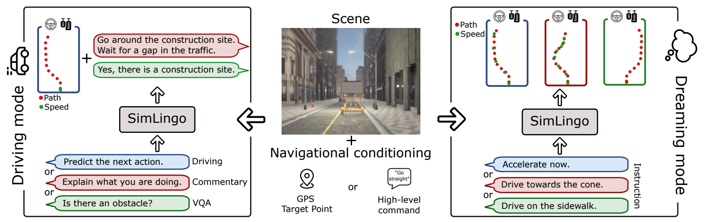
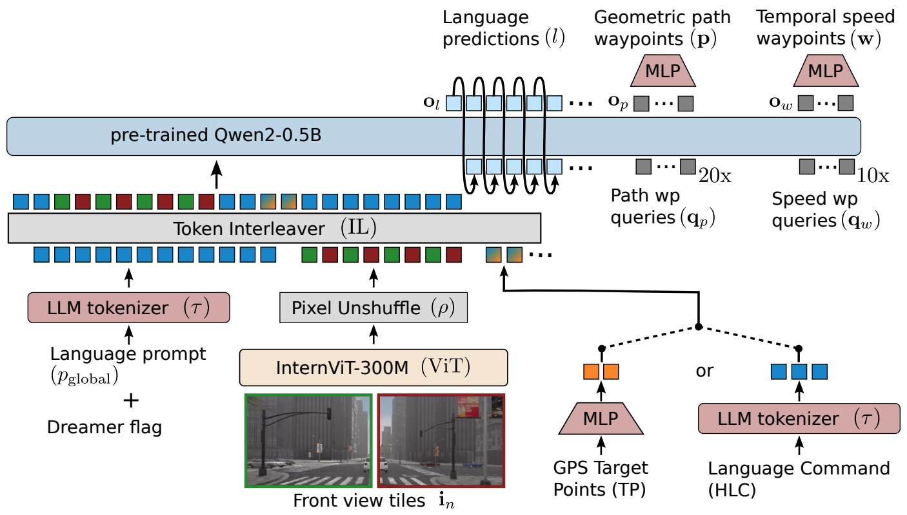
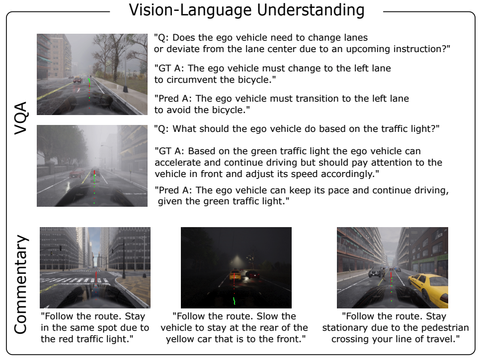
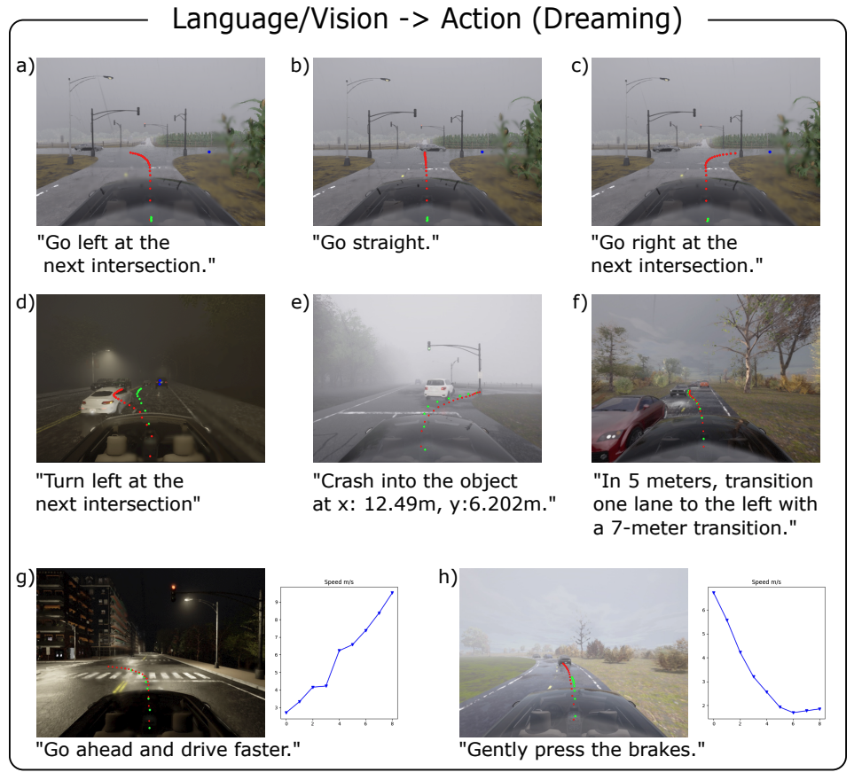
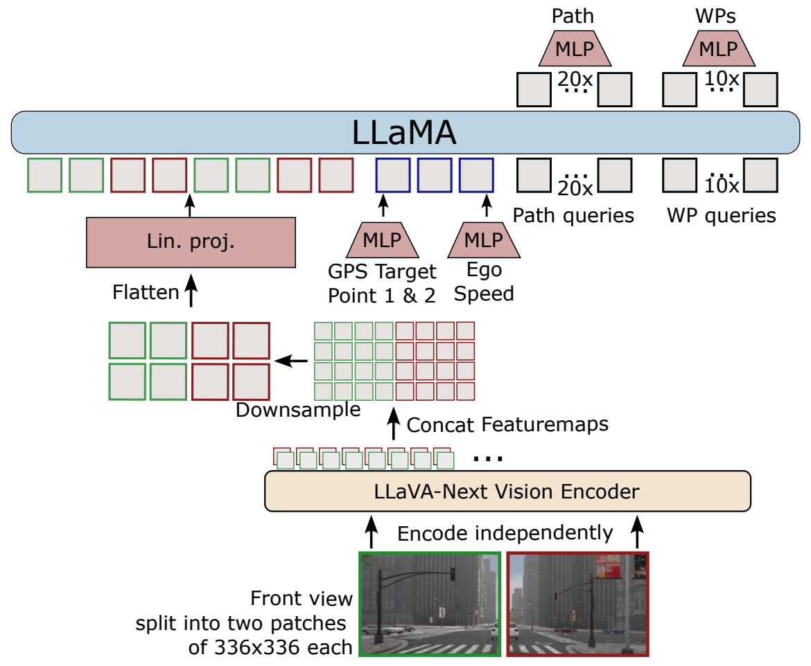
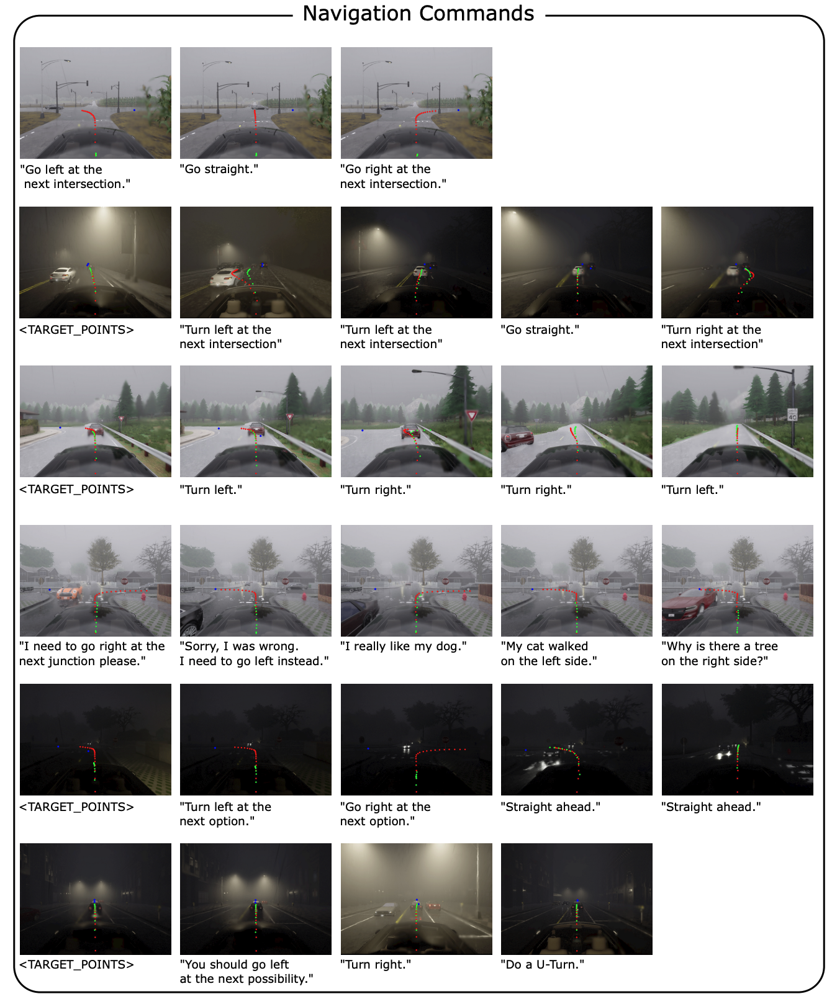
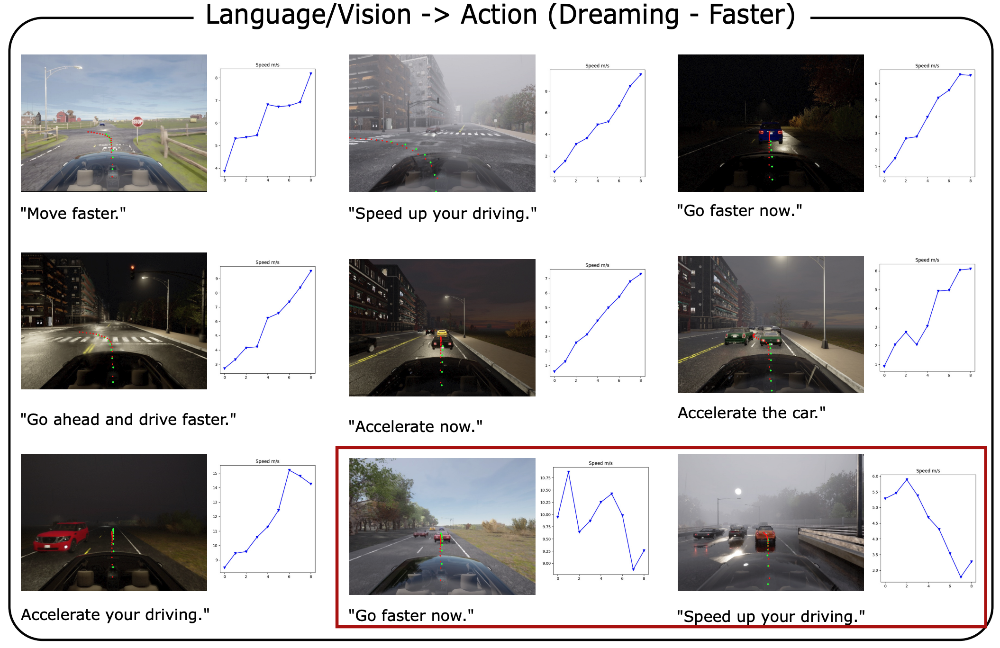
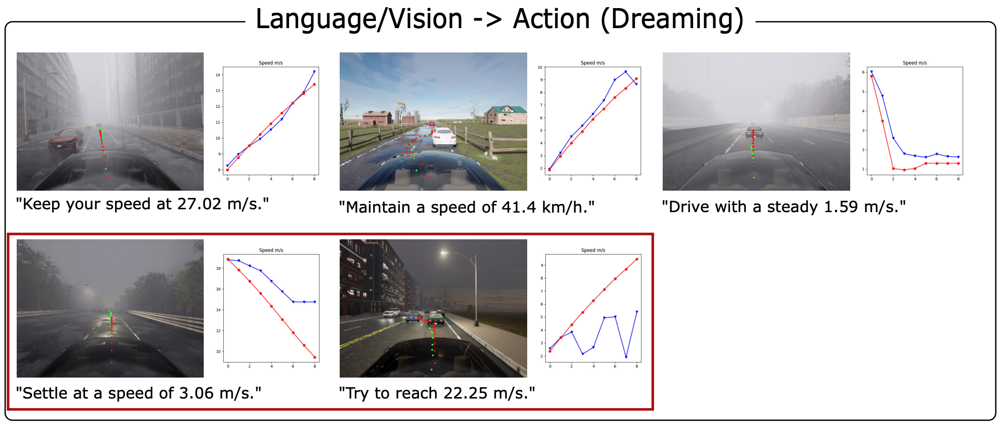
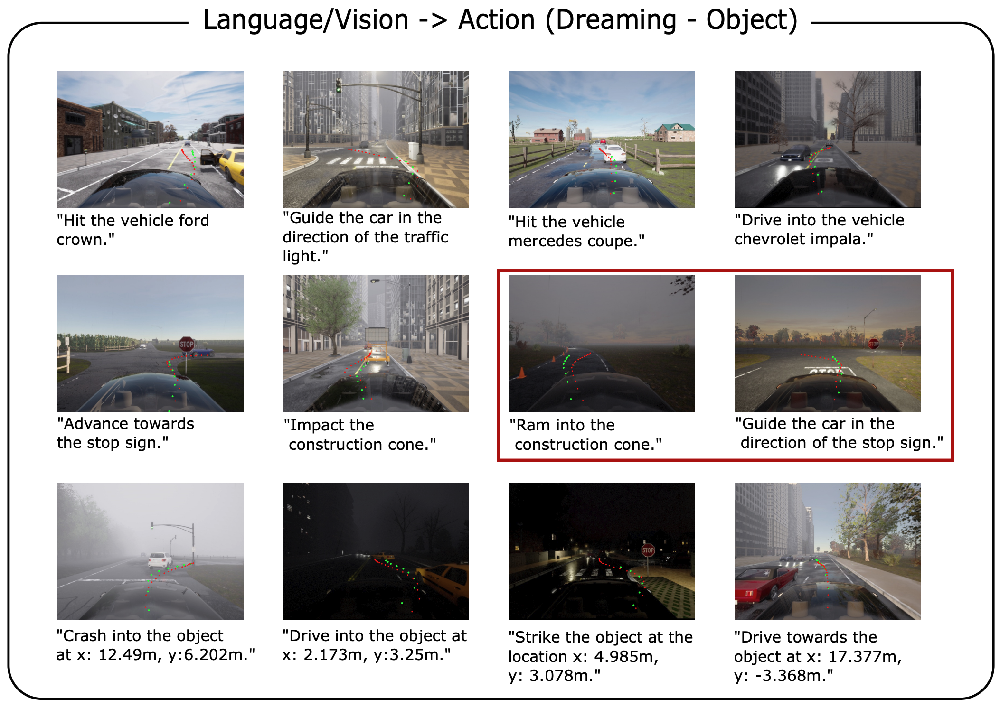
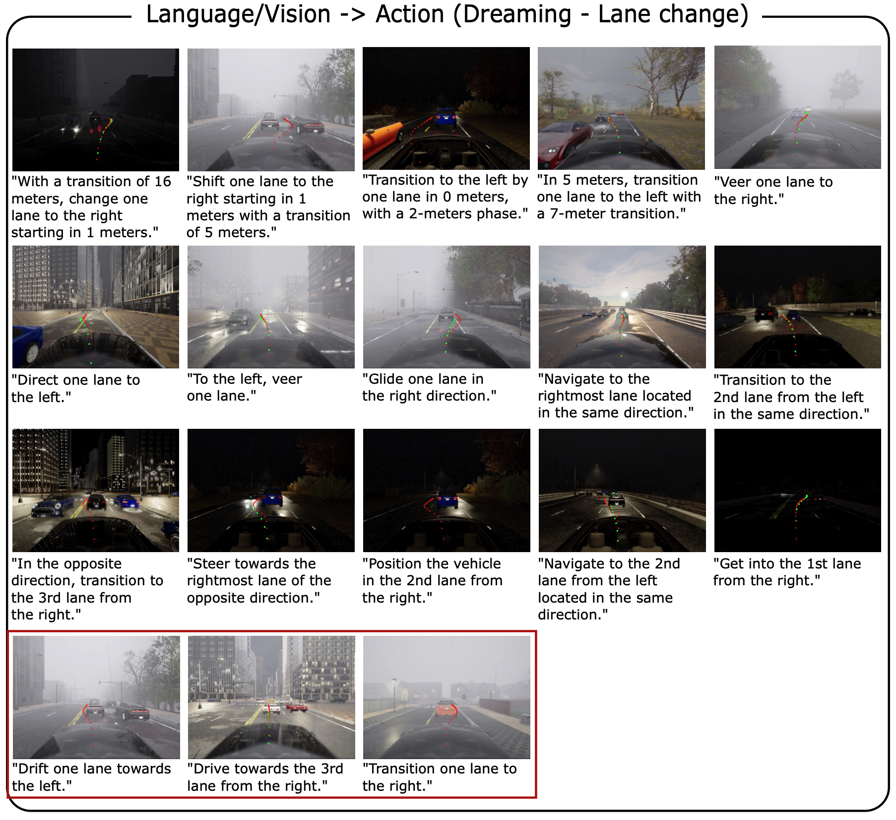

# SimLingo: 言語と行動のアライメントを伴う視覚のみの閉ループ自動運転

Katrin Renz1,2,3*, Long Chen1, Elahe Arani1, Oleg Sinavski1
1 Wayve 2 University of Tübingen 3 Tübingen AI Center

*Wayveでのインターン中の仕事。チャレンジの技術レポート（予備版）: https://arxiv.org/abs/2406.10165

## Abstract
大規模言語モデル（LLMs）を自動運転に統合することは、汎化性と説明可能性の向上の期待から大きな注目を集めている。しかし、既存の手法は運転または視覚言語理解のいずれかに焦点を当てていることが多く、高い運転性能と広範な言語理解の両方を達成することは依然として困難である。さらに、視覚言語理解に取り組むための支配的なアプローチは、視覚的質問応答（VQA）を使用することである。しかし、自動運転においては、これが行動空間とアライメントされている場合にのみ有用である。そうでない場合、モデルの回答はその行動と矛盾する可能性がある。したがって、我々は（1）閉ループ運転、（2）視覚言語理解、および（3）言語-行動のアライメントの3つの異なるタスクを処理できるモデルを提案する。我々のモデルであるSimLingoは、視覚言語モデル（VLM）に基づいており、LiDARのような高価なセンサーを除外し、カメラのみを使用して動作する。SimLingoは、Bench2Driveベンチマーク上の広く使用されているCARLAシミュレータで最先端のパフォーマンスを獲得し、CARLAチャレンジ2024で優勝したエントリである。さらに、高い運転性能を維持しながら、さまざまな言語関連タスクで強力な結果を達成している。

図1. 概要: SimLingoは自動運転、視覚言語理解、言語-行動アライメントのタスクを統合する視覚-言語-行動モデルである。公式CARLA Leaderboard 2.0およびBench2Driveにおいて、カメラ画像のみを使用して最先端である。言語と行動のアライメントを改善するための指示追従の一形態であるAction Dreamingのタスクを紹介する。



## 1. Introduction
近年、視覚言語モデル（VLMs） [^12], [^36], [^37], [^58] は、世界に関する幅広い知識を持ち、未知のプロンプトに汎化する能力を実証している。これらの能力を自動運転システムに組み込むことは、多様で稀なシナリオにおける堅牢性を高め、よりスムーズな人間と機械の相互作用を可能にする可能性を秘めている。視覚駆動ロボット工学の分野では、モデルが未知の環境を理解して適応し、自然言語のコマンドに従うのが得意であるため、事前学習済みの視覚言語モデル（VLMs）を活用してパフォーマンスを向上させ始めている [^7], [^32], [^69] 。エンドツーエンドの自動運転においても、運転モデルへのVLMの導入が注目を集めている [^3], [^25], [^53] 。VLMは、計画のパフォーマンスを向上させたり [^51], [^66] 、運転シーンに合わせた視覚的質問応答（VQA）の形で視覚言語機能を可能にするために使用されている [^44], [^45] 。VQAは、シーンを把握し、自身の振る舞いに対するオブジェクトの重要性を理解するモデルの能力をテストするための有望な方法である。しかし、この理解を言語空間でのみ評価する場合、それは実際の運転の決定から完全に切り離される可能性がある（例えば、モデルは赤信号を見ていると主張するが、行動は加速を示しているなど）。我々は、言語の手がかりに応じてモデルの行動が適応する、アライメントされた言語インタラクションのみが、真の言語理解の因果的証拠を提供できると主張する。言語理解と運転行動をアライメントさせるというこの課題に対処するために、我々はAction Dreamingを提案する。これは、危険な指示を実行することなく、言語入力が行動にどのように影響するかを評価するための新しいデータセットおよびベンチマークである。既存のエキスパートデータに基づいて事後的に指示-行動のペアを生成する場合、視覚的な手がかりのみから行動を推論することができる。したがって、モデルは言語の指示に注意を払う必要がない。その結果、言語と行動の間に不整合が生じる。これに対処するために、我々は、与えられた状態に対して複数の可能な未来をシミュレートする新しいデータ収集手法を提案する。我々は、同じ視覚的コンテキストに対する多様な指示-行動ペアのセットで訓練およびテストを行い、モデルが指示に確実に従うようにする。2つ目の主な焦点は運転性能である。VLMを運転と組み合わせる多くの研究は、過度に単純化された環境（例：HighwayEnv） [^14], [^15], [^41], [^61] 、または開ループの設定（例：NuScenesの計画） [^25], [^43], [^53], [^55] のいずれかでそのパフォーマンスを評価している。我々は、挑戦的な閉ループのベンチマークで我々のモデルを厳密にテストする。
貢献。(1) CARLAシミュレータ内の公式CARLA Leaderboard 2.0およびローカルベンチマークBench2Driveにおいて最先端の運転性能を達成するVLMベースの運転モデル。(2) 安全でない行動を実行することなく、言語と行動理解のつながりを評価するためのベンチマークと、指示-行動のペアを収集するための方法論を伴う新しいタスク（Action Dreaming）。(3) 良好な運転性能を達成するだけでなく、同じモデル内に言語に関連するいくつかのタスクを含めるジェネラリストモデル。

## 2. Related Work
End-to-end autonomous driving.
模倣学習（IL） [^8], [^26], [^49], [^62] に基づくエンドツーエンドの学習は、CARLA Leaderboard (LB) 1.0 [^1] の最先端の手法の支配的なアプローチである。CARLA Leaderboard 2.0 [^2] の導入により、運転タスクは根本的に困難になった。これは、LB 1.0の主要な手法の1つ（TransFuser）を新しいLB 2.0にゼロショットで適用することで示され、運転スコアが大幅に低下する（66.32から0.58へ）。ほとんどの最先端のエンドツーエンドの手法は、補助的な出力を組み込んでおり、LiDARと組み合わせたカメラのような複数のセンサーに依存している [^8], [^13], [^26], [^49], [^50] 。しかし、業界のプレーヤー [^3], [^54] が示すように、カメラファーストのモデルの展開への関心が高まっており、DriveCoT [^59] やTCP [^62] のような学術研究は、カメラ画像のみを使用することで競争力のある結果を示している。我々はこのアプローチに従い、LIDARのような高価なセンサーを除外する。
Language models for driving.
ほとんどの最先端の運転モデルは、ドメイン固有のアーキテクチャを導入している [^13], [^24], [^26] 。しかし、最近の大規模言語モデルと視覚言語モデルの進歩に伴い、それらの汎用アーキテクチャが運転システムに統合されている。LLM-Driver [^10] 、DriveGPT4 [^63] 、DriveLM [^53] などのマルチモーダルLLMベースの運転フレームワークは、運転のために異なるモダリティからの入力を持つ基盤モデルを利用する。GPT-Driver [^42] とLanguageMPC [^48] は、テキストを使用したモーションプランナーとしてChatGPTを微調整する。知識駆動型アプローチ [^15], [^61] も、常識的な知識に基づいて意思決定を行うために採用されている。しかし、これらの研究のほとんどは、NuScenesのような開ループ設定、またはHighwayEnv [^14], [^15], [^41], [^61] のような簡略化された運転環境における定性分析を通じて主に評価されている。FED [^66] は、学習中にフィードバックを提供するために言語を使用することにより、閉ループ運転にVLMを使用する。LMDrive [^51] は、限られた人間からの指示セットに従うことができるエンドツーエンドの閉ループ運転モデルを提案している。しかし、一般的に使用される運転ベンチマークで評価した場合、最先端の運転モデル [^34] には遠く及ばない。DriveMLM [^60] も指示に従うことを含むが、我々のものとは異なり、市販のモーションプランナーを使用しており、エンドツーエンドの訓練はされていない。
いくつかの研究は、視覚的質問応答（VQA）を通じて、言語理解を自動運転システムに統合している。しかし、多くのアプローチは、その評価を開ループの設定 [^25], [^39], [^53] に制限しているか、行動予測を全く伴わない [^40], [^44], [^45] 。これまでのところ、閉ループのベンチマーク [^23], [^31], [^43] でテストした場合、開ループのモデルははるかに遅れをとっている。開ループの結果が閉ループに転移するという証拠はなく、アブレーションや主張は信頼できないものとなっている [^27] 。これは、このギャップを埋めるためには、訓練、アーキテクチャ、制御、およびデータ構成に大きな変更が必要であることを強調している。さらに、特に指示と行動のアライメントを見るとき、指示に従う能力の体系的な評価が根本的に不足している。

## 3. Method
### 3.1. Task overview
Driving.
運転の目的は、CARLA [^18] 自動運転シミュレータにおいて、予め定められた中間地点を通過しながら、指定されたマップ上の指定された目的地に到達することである。マップには、高速道路、市街地の通り、住宅街、田舎の環境など、多様な環境が含まれており、これらはすべて、晴天の日中、日没、雨、霧、夜間のシナリオなど、さまざまな気象条件下でナビゲートされなければならない。その過程で、エージェントは、歩行者の横断への遭遇、駐車場の出口のナビゲート、保護されていない方向指示のない交差点での右左折の実行、進行中の交通への合流、建設現場の通過、開いたドアのある車両の回避など、さまざまな複雑なシナリオの密集した発生を管理しなければならない。
Vision-Language Understanding.
さらに、モデルは、自然言語での現在の決定と行動の記述（Commentary）や、シミュレートされた運転シーンに関する質問への回答（VQA）など、多様な言語タスクのセットを解決する必要がある。Commentaryのタスクは、「自車両は次に何をすべきか、またその理由は何か？」という質問に答える。回答は、経路（例：車線変更、オブジェクトの回避）と速度、およびその両方の理由に言及する。さらに、我々は推論中の最終的なモデルにおいて、デフォルトでCommentaryを実行する。これは、最終的な運転モデルが思考の連鎖（Chain-of-Thought）設定で機能することを意味し、最初に言語空間で行動と理由が予測され、次に生成されたコメントを条件として行動が予測される。
Action Dreaming.
第3のタスクは、視覚言語理解と、それを行動空間とアライメントさせる能力を組み合わせたものである。我々は、速度の変更、車線変更、特定のオブジェクトに向けた運転、または他のナビゲーションの変更を含む、多種多様な指示をモデルに課す。これには、通常の運転中に発生する可能性のある一般的な指示だけでなく、現実世界では決して実行されるべきではないが、モデルの多様な指示に対する理解を示す分布外の指示（例：オブジェクトへの衝突）も含まれる。これは、モデルの言語能力が行動空間とアライメントされているかどうかをテストする。我々はそれらの行動を実行したくないので、これをAction Dreamingモードと呼ぶ。我々はモデルに言語の指示を与え、モデルは対応する行動を予測する必要がある。

図2. SimLingoアーキテクチャ。画像、ナビゲーション条件、および言語プロンプトをエンコードする。高解像度画像をエンコードするために、それらをタイルに分割し、448x448の解像度で事前学習された画像エンコーダを再利用するためにそれぞれを独立してエンコードする。すべての埋め込みはLLMによって処理され、LoRAでファインチューニングして言語と行動を予測する。行動出力は、横方向の制御を改善するために、時間的な速度ウェイポイントと幾何学的な経路ウェイポイントの両方を持つ解きほぐされた（disentangled）表現を利用する。



### 3.2. Datasets
Driving.
我々は、CARLAシミュレータでのデータ収集に、特権的なルールベースのエキスパートPDM-lite [^6], [^53] を利用する。データ収集のために、シナリオを伴うルートの3つのセットを使用する：(1) TransFuser [^13] のTown 1-10の学習ルートで、Leaderboard 2.0をサポートするように変換したもの。(2) 公式CARLA LB 2.0のTown 12およびTown 13のルートを、単一のシナリオを中心としたより短いセグメントに分割し、自明なデータ（例：危険なイベントなしで直進する）を減らし、 [^13], [^35] で提案されているようにデータ管理を簡素化する。(3) LB 2.0の導入に伴い、ナビゲーションのターゲットポイント間の最大距離が50メートルから200メートルに増加した。1つのシナリオを持つルートは、この距離内に収まることが多く、次のターゲットポイントが200メートル後ではなくルートの終点（つまり200メートル未満）にあるため、分布のシフトを引き起こす。したがって、我々はルートごとに3つのシナリオを特徴とする、より長いルートのセットを採用する。シナリオタイプのバランスを確保するために、シナリオあたりのルート数を調整し（つまり、稀なシナリオを持つルートをアップサンプリングする）、ランダムな気象拡張を適用し、シナリオが生成される距離を±10%変更する。全体として、4 fpsで310万サンプルを収集する。
Vision-Language Understanding.
視覚言語理解データについては、DriveLM [^53] のヒューリスティクスを適用して、運転データセット用のVQAラベルを生成する。学習にはTown 12を、評価にはTown 13を使用する。Commentaryタスクについては、このタスクはDriveLMラベルの一部ではないため、新しいラベルを生成する。同様に、我々はデータ収集時に特権情報を使用し、説明を生成するためにルールベースのエキスパートのロジックを使用する。より正確には、エキスパートのインテリジェントドライバーモデル（IDM） [^56] から取得した先行オブジェクトや、オブジェクトを避けるための経路変更に関する情報を使用する。さらに、停止状態からの発進や同じ速度での運転の継続などの運転意図を区別するために、自車両のウェイポイントに基づくヒューリスティクスを使用する。
Action Dreaming.
言語を行動空間とアライメントさせるために、指示と行動がペアになったデータが必要である。事後的な指示生成のためにエキスパートによって実行された実際の行動のみに依存すると、利用可能な視覚情報から完全に推論できるラベルが得られるため、言語の指示を処理する必要がなくなる。この制限に対処するために、同じ視覚的コンテキストに対して複数の代替の指示と行動のペアを生成することで、モデルに指示を聞くことを強制する。元のデータセットについては、他の車両の位置や速度など、シミュレータの状態の網羅的ではない部分を保存する。我々は他のアクターに対して「ワールド・オン・レール」の仮定 [^9] （つまり、他のすべての動的エージェントは固定された経路上にあり、元のシミュレーションの再生と同様に、環境の変化に反応しないものとして扱われる）を利用し、キネマティック自転車モデルを使用して自車両のダイナミクスを近似する。これにより、行動を実行する必要なしに、自車両の異なる可能な将来の軌道をシミュレートし、他のエージェントとの衝突チェックを実行できる。このデータセットには、車線変更（歩道や駐車車線への移動を含む）、速度調整、特定のオブジェクト（例：トラフィックコーン、標識、車両）に向かって運転して衝突を引き起こす可能性のあるもの、一時停止標識や停止線のような特定の道路標示を越えることなど、いくつかの種類の新しい軌道が組み込まれている。各代替の指示-行動のペアについて、この行動が実行しても安全かどうかのフラグと、行動が実行可能かどうかを説明する言語ラベル、および不可能な場合はその理由も用意している。学習にはTown 12を、検証にはTown 13を使用する。データ収集とラベル付け手順の詳細については、Appendix Aを参照。

### 3.3. Architecture
SimLingoは、追加の入力モダリティと出力ヘッドを備えたInternVL-2アーキテクチャ [^20] の上に構築されている。図2にSimLingoアーキテクチャの概要を示す。

Input Representation.
SimLingoはカメラ画像を使用して環境をナビゲートする。我々はカメラ画像  $I \in R^{H \times W}$ 、次の2つのGPSターゲットポイントTPの形式、または高レベルの言語コマンドHLC（例：「左に曲がる」）の形式でのナビゲーション情報、および自車両の速度  $v$ を入力する。さらに、現在のタスクに関する情報を含むタスクプロンプトを入力する。我々は4つのタスクプロンプト  $p_{task}$ を区別する：(1) 言語予測なしの運転：「ウェイポイントを予測しなさい（Predict the waypoints.）」(2) Commentary + Driving：「自車両は次に何をすべきか？（What should the ego do next?）」(3) VQA + Driving：「Q:  $<question>?$ 」(4) Action Dreaming：「 $<Dreamer flag> <instruction>.$ 」  $<Dreamer flag>$ については、2つのモードを区別する：アクティブ化された場合、モデルは指示にアライメントされた行動を予測する必要があり、非アクティブ化された場合、モデルは安全でない指示を拒否する必要がある。すべての入力情報は、グローバルLLMプロンプト  $p_{global}$ の一部であり、次のような構造を持つ：「 <image features $e_I$>\n Current speed: <v> m/s. Command: <nav. features $e_{nav}$>. <task prompt $p_{task}$>. 」  $<$ と  $>$ の間のすべての部分は、対応する特徴埋め込みに置き換えられる。

Output Representation.
出力は行動と言語の2つのモダリティで構成される。任意の言語予測  $l$ については、標準的な自己回帰トークン予測を使用する。行動表現については、解きほぐされた（disentangled）表現を使用する。(1) 時間的な速度ウェイポイント  $\boldsymbol{w} \in R^{N_w \times 2}$ は、0.25秒ごとに1つの座標を持つ  $N_w$ 個の将来の座標である。これは、将来の特定の時間における自車両の位置を表す。また、(2) 幾何学的な経路ウェイポイント  $\boldsymbol{p} \in R^{N_p \times 2}$ を予測する。これは、1メートルごとに1つの座標を持つ  $N_p$ 個の将来の座標である。これは、そこに到達するまでの時間とは無関係に、自車両の将来の位置を表す。時間的なウェイポイント  $\boldsymbol{w}$ からターゲット速度を取得し、幾何学的なウェイポイント  $\boldsymbol{p}$ からターゲット角度を取得する。その後、2つのPIDコントローラーを使用して、ステアリング角度と加速度を取得する。ステアリングと速度の両方に時間的なウェイポイントのみを使用すると、特に旋回中や障害物を避けて曲がる際にステアリングの問題につながることに気づいた。経路ウェイポイントを使用することで、車両が静止しているときでも経路を予測するため、より密な監視が可能になり、ステアリングの動作が向上する。より効率的な行動予測を可能にするために、自己回帰的ではなく1回のフォワードパスですべての行動埋め込みを予測する。このために、学習可能なクエリトークン  $\boldsymbol{q}_p$ と  $\boldsymbol{q}_w$ を入力する。出力特徴量  $[\boldsymbol{o}_p, \boldsymbol{o}_w]$ の上にあるMLPがウェイポイントの差分を生成する。これらの差分の累積和から、最終的なウェイポイント  $\boldsymbol{p}$ と  $\boldsymbol{w}$ が得られる。
Vision-Language-Action Model.
我々は、SimLingoのメインアーキテクチャとして、Mini-InternVLファミリー [^20] からInternVL2-1Bを使用する。InternVL2ファミリー [^11], [^12], [^20] は最先端のパフォーマンスに到達する一方で、1Bパラメータモデルから始まる最も幅広いモデルサイズを提供する。InternVL2-1Bモデルは、視覚エンコーダとしてInternViT-300M-448px (ViT)、言語モデル(LLM)としてQwen2-0.5B-Instruct [^64] で構成されている。
Variable high-resolution image encoding.
高解像度の画像を処理することは、詳細な画像理解にとって重要である。特に自動運転の場合、大きな交差点での信号機などの重要な情報が、数ピクセルでしか見えないことがある。ほとんどのVLMは、336x336（一部は448x448）の解像度で事前学習されたCLIP事前学習済み視覚エンコーダに基づいている。動的およびより高い解像度を処理できるようにするために、入力画像  $I \in R^{H \times W}$ を  $N_I$ 個の448x448ピクセルタイル  $i_n \in R^{448 \times 448}$ に分割し、各タイルの特徴を個別に抽出する。この方法は、最新のVLMで一般的に使用されている [^12], [^37] 。LLMの二次計算量の性質による計算のオーバーヘッドを減らすために、InternVL2はピクセルアンシャッフル技術 [^52] （ $\rho$ ）を使用して、トークンの数を4分の1にダウンサンプリングする。その後、各448×448タイルは256個の視覚トークンで表される。以下のように視覚的特徴量を取得する。
```math
e_I = \rho([ViT(i_n)]_{n=0}^{N_I}) \in R^{(N_I * 256) \times D}
```
埋め込みサイズは  $D$ である。本研究では、 $N_I = 2$ を使用し、結果として512個の視覚トークンが得られる。
Driving specific inputs.
ナビゲーション情報は、GPS位置（TP）の形式のターゲットポイントとして、または言語コマンド（HLC）として提示される。ターゲットポイントを使用する場合、MLPで位置をエンコードして2つのナビゲーション埋め込み  $e_{nav} \in R^{2 \times D}$ を取得する。言語コマンドを使用する場合は、LLMの標準トークナイザーを使用して埋め込み  $e_{nav} \in R^{N_{HLC} \times D}$ を取得する。ここで、 $N_{HLC}$ はナビゲーションコマンドを表すトークンの数に等しい。学習中、我々は2つの入力モダリティをランダムに切り替える。グローバルLLMプロンプトの一部として、自然言語での速度  $v$ を使用する。
Language input.
すべての言語部分について、LLMの元のトークナイザーを使用してトークン埋め込み  $e_L$ を取得する。
Token interleaver.
各入力モダリティをエンコードした後、トークンインターリーバー（IL）は  $p_{global}$ のプレースホルダートークン  $<$ と  $>$ を対応する埋め込みに置き換え、入力埋め込みシーケンスを取得する。
```math
e_{LLM} = IL(e_L, e_I, e_{nav}).
```
このインターリーブされたトークンシーケンスは、その後、事前学習済みのLLMに入力される。
Large language model.
入力埋め込みと行動クエリが与えられると、LLMは言語と行動の出力特徴量を生成する。
```math
[o_l, o_p, o_w] = LLM([e_{LLM}, q_w, q_p]) .
```
最初に、タスクプロンプトに対する答えを表す言語予測を自己回帰的に生成する。次に、追加の1回のフォワードパスで、経路とウェイポイントからなる行動を生成する。我々は経路とウェイポイントにsmooth-L1損失を使用し、予測された言語トークンに交差エントロピー損失を使用する。

### 3.4. Training
Dataset mixtures.
行動ラベルは、(1) エキスパートの軌道と (2) ドリーム軌道（安全なものと安全でないもの）の2つに区別される。学習中、我々はそれぞれから50/50でサンプリングする。エキスパート軌道については、追加の言語監視のために以下の3つのオプションのいずれかを行う：(1) VQA、(2) Commentary、(3) 言語なし。我々は50%でVQA予測をサンプリングし、35%でCommentary予測をサンプリングし、7.5%でプロンプト内でCommentaryを提供し、7.5%はいかなる言語も監視しない。ドリーム軌道については、Dreamerフラグをアクティブにした状態で50%、非アクティブにした状態で50%学習させ、非アクティブの場合、モデルは指示が実行可能かどうかを判断し、安全でないものを拒否する必要がある。
Data buckets.
運転の大部分は、真っ直ぐで何事もないセグメントを伴う。興味深いシナリオの収集を最大化するために、我々は多様で挑戦的な状況にデータ収集を集中させる。しかし、ある程度の割合の簡単で何事もないデータは避けられない。この問題に対処するために、特定の興味深いサンプルを含むデータバケットを作成し、各バケットに確率を割り当てる。学習中、データセット全体ではなく、これらのバケットからサンプリングする。このアプローチにより、エポックごとのサンプル数が650,000に減少する。バケットタイプの詳細はAppendix B.2にある。

## 4. Experiments
本セクションでは、まず使用したベンチマークと指標の概要（セクション4.1）および実装の詳細（セクション4.2）から始める。次に、定量的および定性的な結果（セクション4.3）を示す。

### 4.1. Benchmarks and Metrics
指標の詳細な説明については、Appendix B.4を参照。
Leaderboard 2.0.
我々は、さまざまな気象条件下のシークレットルートを持つCARLAシミュレータの公式テストサーバーを使用する [^2] 。公式のCARLA指標であるDriving Score (DS)、Route Completion (RC)、およびInfraction Score (IS)を報告する。Driving Scoreは、現在のパフォーマンス範囲にあるモデルが違反による非線形なスコアの低下により、ルートをより多く完了したことで罰せられるように計算される。その欠点についてのより詳細な議論はAppendix B.4にある。
Bench2Drive.
ローカルでの評価には、およそ150mのTown01〜Town15と異なる天候の220ルートを使用するCARLAバージョン0.9.15に基づくBench2Drive Benchmark [^30] を使用する。driving score、success rate、efficiency、comfortnessを含む公式の指標を使用する。これらの短いルートは、より高い運転スコアを得るのを容易にするため、範囲はLeaderboardの数値とは比較できない。
DriveLM-hard (VQA) and Commentary.
学習中は保持している検証ラベルとしてTown 13の追加のCommentaryラベルを収集するために、DriveLM [^53] を使用してVQAデータを生成し、セクション3.2で説明したアノテーションスキームを使用する。DriveLMとは異なり、我々はデータセット全体からランダムにサンプリングするのではなく、回答タイプごとに均等に10個の例をサンプリングする、より難しい検証セットを構築するため、稀な回答が大幅にアンダーサンプリングされる。我々のVQA検証セットには330の異なる回答タイプが含まれ、Commentaryの検証セットには190が含まれている。我々はGPTおよびSPICE指標を使用する。
Action Dreaming.
言語空間におけるシーン固有の知識を理解する能力だけでなく、これを行動空間と結びつける能力も評価するために、Action Dreamingの評価を導入する。モデルは指示という形で言語入力を受け取り、対応する行動がどのようになるかを想像する必要がある。この検証には、Dreamerデータセット（セクション3.2で説明）のTown 13を使用する。指示は以下のクラスのいずれかである：Slow down、Speed up、Reach Target Speed、Lane Change、Object centric。我々は開ループで評価し、指標としてSuccess Rateを使用する。各クラスに対して、成功を定義する独自のルールを使用する。

### 4.2. Implementation Details
SimLingo.
最適化は、重み減衰0.1、学習率3e-5のAdamWオプティマイザー [^38] を使用し、再起動なしのコサインアニーリングスケジュールで実行される。学習効率とメモリ使用量を最適化するためにDeepSpeed v2を使用する。効果的であることが示されているように [^17] 、すべての線形層にLoRA [^22] を適用してファインチューニングするLLMを除き、すべてのコンポーネントを完全にファインチューニングする。TF++ [^26] と同じデータ拡張手法を適用するが、より積極的なシフトと回転の拡張（シフト: 1.5m、回転: 20度）を行う。モデルは、8xA100 80GB GPUでバッチサイズ12を用いて14エポック学習され、24時間かかる。追加のデータを追加した後のL2-Lossでの学習中の不安定性のため、SmoothL1-Lossに変更した。推論中、我々はデフォルトでCommentaryを使用する。これは、最終的な運転モデルがChain-of-Thought設定で機能することを意味し、最初に言語空間で行動と理由が予測され、次に生成されたコメントを条件として行動が予測される。
Baseline - SimLingo-BASE.
我々は、計算リソースに制約のある環境において、運転固有の設計選択をテストし、公式Leaderboard 2.0で評価するのにより適した軽量なベースライン運転モデルを提供する。SimLingoとの違いの詳細なリストはAppendix B.3にあるが、主な違いは、言語サポートがなく、最初から学習されたLLaMAアーキテクチャに基づくより小さなTransformer（50Mパラメータ）を使用することである。
2024年6月にLeaderboardが一時的に閉鎖されたため、最終的なSimLingoをLeaderboardに提出することはできず（SimLingo-BASEは閉鎖前に提出された）、ローカルベンチマーク（Bench2Drive）での閉ループのパフォーマンスを比較することを選択した。Leaderboardモデルについては、指標セクションで説明したDSの性質に対抗するために、推論中に早期停止を適用する。交差点の真ん中で停止するのを防ぐために、移動距離を追跡し、指定された距離の後にステアリング角度がゼロに近いときに運転を停止する。
Baseline - TCP-traj w/o distillation.
Bench2Drive [^30] ベンチマーク上の既存のすべてのメソッドは、Think2Drive [^35] エキスパートによって収集されたデータセットで学習されている。我々はオープンソースのエキスパートであるPDM-lite [^53] を使用しているため、評価における公平性を高めるために、PDM-liteによって収集された我々のデータセット構成を使用して、蒸留なしのTCP-trajを再学習させる。最高速度や加速度などの運転挙動はエキスパート間で異なるため、閉ループで評価する際には、これらの変化を考慮するようにコントローラも調整する。エキスパートの特徴量はPDM-liteや現実世界では利用できないため、エキスパート特徴量の蒸留に依存しない最良の従来手法として、蒸留なしのTCP-trajを選択する。

図3. VQAとCommentaryの定性的な結果。VQAについては、2つの例のシーンについての質問、正解の回答、予測された回答を示す。どちらの質問も、数ピクセルでしか見えない遠くのオブジェクトに関するものであるが、それでもモデルは正しい回答を生成する。



図4. Pose Dreamingの定性的な結果。多様な状況と指示に対する予測された行動を示す。モデルは経路と速度に関連する指示に正常に適応できる。凡例：赤：経路ウェイポイント、緑：速度ウェイポイント、青いグラフ：m/s単位の速度。



### 4.3. Results
Driving performance on the CARLA Leaderboard 2.0.
表1に公式のLeaderboardの結果を示す。軽量モデルであるSimLingo-BASEにより、Sensorトラックにおいて従来の最高精度（CaRINA hybrid [^47] ）を4.6倍、最良の並行研究（TF++ [^68] ）を33%上回った。
Ablation study:
我々の出力表現の影響を示すために、解きほぐされた（disentangled）経路+速度ウェイポイントと、一般的に使用されるもつれた（entangled）ウェイポイント表現を比較する。運転スコアが39.9%増加し、静的オブジェクトとの衝突がゼロに減少したことが観察された。さらに、視覚エンコーダを分析し、Clipの事前学習なしのViTおよびImageNet [^16] で事前学習されたResnet-34 [^21] （同じ学習予算を使用）と比較する。ゼロから学習したViTは0.45のDSしか得られず、Clip事前学習の当然の能力を示している [^46] 。Resnetは、我々の6.87と比較して2.71の運転スコアをもたらす。また、我々の知る限り、我々のモデルはカメラ画像のみで動作するLeaderboard上で唯一のモデルであることも注目に値する（注：メソッドレポートのないLeaderboardのエントリは含めていない）。出力表現、早期停止、およびLeaderboardの分散に関するアブレーションの詳細は、Appendix Cに示されている。

表1. Leaderboard 2.0の結果。SimLingo-BASEは、公式Leaderboard 2.0で最先端のパフォーマンスを達成している。凡例：L：Lidar、C：カメラ、R：レーダー、M：マップ、priv：特権的、O：物体検出（3D位置と姿勢）、I：インスタンスセグメンテーション、S：セマンティックセグメンテーション、D：深度、B：BEVセマンティクス。*一貫性を保つため、我々のモデルの名称をCarLLaVAからSimLingo-BASEに変更した。

| Method | Sensors | Aux. Labels | DS $\uparrow$ | RC $\uparrow$ | IS $\uparrow$ |
| --- | --- | --- | --- | --- | --- |
| Map | | | | | |
| CaRINA mod.[^47] | L,C,M | O | 1.14 | 3.65 | 0.46 |
| Kyber-E2E[^19] | L,C,R,M | I, O | 5.47 | 15.89 | 0.34 |
| TF++[^68] | L,C | S, D, O, B | 5.56 | 11.82 | 0.47 |
| SimLingo-BASE* | C | - | 6.25 | 18.89 | 0.36 |
| Sensor | | | | | |
| Zero-shot TF++[^26] | L,C | S, D, O, B | 0.58 | 8.53 | 0.38 |
| CaRINA hybrid[^47] | L,C | I, O | 1.23 | 9.56 | 0.31 |
| TF++[^68] | L,C | S, D, O, B | 5.18 | 11.34 | 0.48 |
| SimLingo-BASE* | C | - | 6.87 | 18.08 | 0.42 |

表2. Bench2Driveにおける閉ループ結果。我々のモデルSimLingo-BASEとフルモデルSimLingoの両方が、以前の最高精度を大差で上回っている。SimLingoは、いくつかの言語関連機能を含みつつ、純粋な運転モデルであるSimLingo-BASEと同じ運転性能を維持できることを強調する。

| Method | Expert | DS $\uparrow$ | Success Rate(%) $\uparrow$ | Efficiency $\uparrow$ | Comfortness $\uparrow$ |
| --- | --- | --- | --- | --- | --- |
| w/ dist. | | | | | |
| TCP [^62] | Think2Drive | 40.70 | 15.00 | 54.26 | 47.80 |
| TCP-ctrl | Think2Drive | 30.47 | 7.27 | 55.97 | 51.51 |
| TCP-traj | Think2Drive | 59.90 | 30.00 | 76.54 | 18.08 |
| ThinkTwice [^29] | Think2Drive | 62.44 | 31.23 | 69.33 | 16.22 |
| DriveAdapter [^28] | Think2Drive | 64.22 | 33.08 | 70.22 | 16.01 |
| w/o dist. | | | | | |
| AD-MLP [^65] | Think2Drive | 18.05 | 0.00 | 48.45 | 22.63 |
| UniAD-Tiny [^24] | Think2Drive | 40.73 | 13.18 | 123.92 | 47.04 |
| UniAD-Base [^24] | Think2Drive | 45.81 | 16.36 | 129.21 | 43.58 |
| VAD [^31] | Think2Drive | 42.35 | 15.00 | 157.94 | 46.01 |
| TCP-traj w/o distillation | Think2Drive | 49.30 | 20.45 | 78.78 | 22.96 |
| our dataset composition | PDM-lite | 45.65 | 18.57 | 74.84 | 51.58 |
| + with tuned controller | PDM-lite | 63.45 | 37.79 | 228.46 | 30.76 |
| SimLingo-BASE (LB2.0 model) | PDM-lite | 85.94 | 66.82 | 244.18 | 25.49 |
| SimLingo | PDM-lite | 85.07±0.95 | 67.27±2.11 | 259.23±5.59 | 33.67±5.72 |

Driving performance on Bench2Drive.
表2はローカルベンチマークBench2Drive [^30] （数値はBench2Drive Githubリポジトリの最新バージョンから取得）の結果を示している。このベンチマーク上の既存の研究は、Think2Driveエキスパート [^35] で収集されたデータで訓練されている。しかし、このエキスパートはオープンソースではないため、言語アノテーションを取得するために必要なデータを収集することができない。この理由から、保存されたラベルを我々のラベル作成用に変更できるオープンソースのエキスパートであるPDM-liteを使用する。公平な比較を提供し、異なるデータセットに起因するパフォーマンスの向上を切り離すために、我々のデータセット構成と我々のデータセット用に調整されたコントローラを使用した蒸留なしのTCP-trajの結果を提供する。これら2つの変更により、パフォーマンスは49.30 DSから63.45 DSに向上する。これは、データセットがパフォーマンスの向上に貢献しているが、最先端のパフォーマンスを得るためには我々の追加の進歩が不可欠であることを示している。運転指標（DSとSR）を見ると、SimLingoと、Leaderboardに使用したものと同一のモデルであるSimLingo-BASEは、以前のすべての手法を大差で上回っている。すべてのSimLingoモデルについて、学習の分散を平均化するために3つのシードを学習する。快適性（comfortness）の指標においてのみ、以前の研究が部分的に優れているが、これはおそらく我々の手法のより速い運転速度によるものである。Vision-Language-Actionモデル（SimLingo）は、幅広い言語機能を備えつつ、純粋な運転モデル（SimLingo-BASE）の運転性能を維持することができる。

表3. 言語能力。DriveLMと我々のCommentaryベンチマークのバランスの取れた評価分割での結果を示す。SimLingoは、我々がゼロショットで評価したInternVL2モデルを上回っている。

| Model | DriveLM-VQA | | Commentary | |
| --- | --- | --- | --- | --- |
| | GPT $\uparrow$ | SPICE $\uparrow$ | GPT $\uparrow$ | SPICE $\uparrow$ |
| InternVL2-1B | 33.08 | 30.55 | 14.95 | 7.60 |
| InternVL2-2B | 31.22 | 44.40 | 20.53 | 9.04 |
| InternVL2-4B | 27.11 | 43.51 | 24.75 | 8.12 |
| SimLingo-1B | 58.48 | 56.77 | 78.94 | 38.04 |

Language understanding - VQA & Commentary.
表3にDriveLM-hardおよびCommentaryベンチマークの結果を示す。ベースラインの比較を提供するためにMini-InternVL2モデルを使用する。しかし、SimLingoがシミュレートされた視覚的な分布内データで訓練されているのに対し、InternVL2はゼロショットでテストされていることを強調しておく。ベースラインモデルは、信号機や一時停止標識の識別などの基本的な質問は正解するが、より複雑で運転に特化した質問には苦労する。さらに、DriveLMでのみ微調整されたバージョン（InternVL2-1B-DriveLM）と比較する。この特化モデルは63.85のGPTスコアを獲得し、これはいくつかの異なるタスクを実行できる我々のモデルよりもわずかに優れているに過ぎない。図3およびAppendix Dに定性的な例を示す。モデルは特に学習中に出現頻度の低い回答タイプに苦労していることが分かり、これらの回答タイプを持つ運転サンプルをさらに収集するか、学習中にオーバーサンプリングすることがパフォーマンスのさらなる向上に役立つ可能性を示唆している。

表4. ナビゲーションコマンドに従う。SimLingoは、ナビゲーション条件（GPSターゲットポイント対言語コマンド）に関係なく強力な運転結果を獲得し、指示に従う能力を示している。

| | DS $\uparrow$ | SR(%) $\uparrow$ |
| --- | --- | --- |
| GPS target point (TP) | 85.07±0.95 | 67.27±2.11 |
| Language command (HLC) | 86.08±1.76 | 65.78±3.90 |

Following navigational commands.
基本的なナビゲーションコマンドに従うモデルの能力を示すために、GPSターゲットポイントのナビゲーション条件付けを用いたSimLingoと、言語コマンド（HLC）を使用する同じモデル（つまり「右に曲がる」などの言語指示）を比較する。表4は、HLCのみを使用することで、TPを使用した場合の結果の分散内に収まる運転パフォーマンスに達することを示している。これにより、より人間に近い条件付けが可能になるが、ターゲットポイントの位置を通じた回復というショートカット [^26] が我々の設定では不要であることも示している。

表5. Action Dreaming。Dreamingフラグをアクティブにした場合、SimLingoは、CARLAシミュレータからネイティブにサポートされているコマンドのみで訓練されたモデルと比較して、幅広い指示に従うことができる。

| Metric | SR(%) $\uparrow$ | | | | | |
| --- | --- | --- | --- | --- | --- | --- |
| Category | Faster | Slower | Target Speed | Lane Change | Objects | Avg. |
| w/o Dreamdata | 56.45 | 22.58 | 19.35 | 3.23 | 20.97 | 24.52 |
| SimLingo | 92.45 | 84.91 | 86.79 | 83.02 | 58.49 | 81.13 |

Action Dreaming.
言語理解を行動空間とアライメントさせる一般的な能力について、我々はAction Dreamingデータセットで評価する。表5は、各カテゴリーに対するAction Dreaming評価のSuccess Rateを示している。Dreamingデータで学習させたモデルと、CARLAシミュレータから提供された指示のみで学習させたベースラインを比較する。合成的に生成された指示-行動ペアでの学習により、大きな改善が見られる（28.22から72.96 SR）。図4は、Pose Dreamingモードの定性的な例を示している。最初の行（a-c）では、同じシーンに対するナビゲーションの変更を示している。これは、モデルが視覚的な手がかりに過剰適合するのではなく、言語に注意を払っていることを示している。a）とd）では、左折という同じ指示を異なる状況で使用しており、モデルが状況に応じて応答を正常に適応できることを示している。シーンa）では交差点の直前であるため、モデルは赤い経路ウェイポイントで示されるように左折を正しく予測している。対照的に、シーンd）では交差点から離れた複数車線の道路にいるため、左折することは左折の準備をして左車線に移動し、交差点が現れたときに左折を実行することを意味する。失敗例を含むその他の例はAppendix Dで見ることができる。

表6. 異なる学習混合物に対するBench2Driveの閉ループ結果。純粋な視覚言語タスク（CommentaryおよびVQA）は純粋な運転性能には影響しない（最後の行）。しかし、Action Dreamingの学習を含めると、運転がわずかに向上する。

| Comm | VQA | Dream | Bench2Drive | |
| --- | --- | --- | --- | --- |
| | | | DS $\uparrow$ | SR(%) $\uparrow$ |
| SimLingo | ✓ | ✓ | ✓ | 85.07±0.95 | 67.27±2.11 |
| | ✓ | ✓ | - | 84.41±1.38 | 64.85±2.24 |
| | ✓ | - | - | 84.55±0.42 | 65.00±0.64 |
| | - | - | - | 84.67±1.52 | 64.70±3.22 |

Training mixture.
我々は、言語機能を持たないベースの運転モデルに対して、フルSimLingoモデルから追加された各言語タスクをアブレーションする。表6は、純粋な運転モデルのパフォーマンス（4行目）と、（アライメントされていない）言語理解を持つモデルのパフォーマンス（2行目と3行目）が類似していることを示している。したがって、我々の実験では、アライメントされていない言語タスクが運転に与える肯定的または否定的な影響は見られていない。しかし、Action Dreamingデータを学習の混合物に追加すると、Bench2Driveベンチマークでの運転パフォーマンスがわずかに向上する。

## 5. Conclusion and Limitations
我々はSimLingoを提案する。これは、公式CARLA Leaderboard 2.0およびBench2Driveにおいて最先端の結果を達成しつつ、言語理解を実証するVLMベースの自動運転モデルである。我々は運転におけるCommentaryとVQAでの言語性能を測定し、ファインチューニング後には、基盤となる汎用VLM（InternVL2）が特化した運転ドメインにおいて優れることができることを示している。この視覚言語理解を行動空間とアライメントさせるために、我々はAction Dreamingのタスクを導入し、多種多様な言語指示に対する行動の予測において、モデルが高い成功率を示すことを実証している。

**Limitations.**
我々の研究のいくつかの限界を認識している。技術的および組織的な理由（Leaderboardが2024年6月に閉鎖されたため）から、公式CARLA Leaderboard 2.0においてテストできたのはSimLingo-BASEのみであり、完全なSimLingoモデルはテストできておらず、これは今後の課題として残している。しかし、ローカルのBench2Driveベンチマークにおいて、SimLingoおよびSimLingo-BASEの閉ループ運転性能を厳密に確認した。また、Chain-of-Thought (CoT) （すなわち、中間のコメントを条件として運転行動を予測すること）を使用しているが、統計的に有意な運転の改善はまだ観察されていない（Appendix C.3）。その利点を活用するためには、CoTに特化した適切なデータと学習レシピが必要であるという仮説を立てている。最後に、我々は運転と言語理解をシミュレーション内でのみ実行している。現実世界の運転モデルにVLMを追加することで推論の遅延が増加することは認識しているが、より小さなVLMの進歩やエンジニアリングの努力（ [^3], [^4] など）によって、VLMを車上でリアルタイムにテストできるようになると信じている。

**Acknowledgements.**
Wayve Lingoチーム全体、Ana-Maria Marcu、Jan Hünermann、Benoit Hanotte、Alice Karnsund、およびJamie Shottonの有益な議論と校正に感謝する。また、Kashyap Chitta、Julian Zimmerlin、Jens Beißwenger、Bernhard Jäger、Andreas Geigerの貴重な議論とエキスパートに関する支援にも感謝する。K. Renzを支援してくれたInternational Max Planck Research School for Intelligent Systems (IMPRS-IS) に感謝する。

## References
[^1]: Carla autonomous driving leaderboard. https://leaderboard.carla.org/#leaderboard-10, 2020.
[^2]: Carla autonomous driving leaderboard 2.0. https://leaderboard.carla.org/, 2023.
[^3]: Lingo-2: Driving with natural language. https://wayve.ai/thinking/lingo-2-driving-with-language/, 2024.
[^4]: Lambda: The nuro driver’s real time. https://medium.com/nuro/lambda-the-nuro-drivers-real-time-language-reasoning-model-7c3567b2d7b4, 2024.
[^5]: Peter Anderson, Basura Fernando, Mark Johnson, and Stephen Gould. Spice: Semantic propositional image caption evaluation. In ECCV, 2016.
[^6]: Jens Beißwenger. Pdm-lite: A rule-based planner for carla leaderboard 2.0. Technical report, University of Tübingen, 2024.
[^7]: Kevin Black, Noah Brown, Danny Driess, Adnan Esmail, Michael Equi, Chelsea Finn, Niccolo Fusai, Lachy Groom, Karol Hausman, Brian Ichter, Szymon Jakubczak, Tim Jones, Liyiming Ke, Sergey Levine, Adrian Li-Bell, Mohith Mothukuri, Suraj Nair, Karl Pertsch, Lucy Xiaoyang Shi, James Tanner, Quan Vuong, Anna Walling, Haohuan Wang, and Ury Zhilinsky.  $\pi0$ : A vision-language-action flow model for general robot control. arXiv preprint arXiv:2410.24164, 2024.
[^8]: Dian Chen and Philipp Krähenbühl. Learning from all vehicles. In CVPR, 2022.
[^9]: Dian Chen, Vladlen Koltun, and Philipp Krähenbühl. Learning to drive from a world on rails. In ICCV, 2021.
[^10]: Long Chen, Oleg Sinavski, Jan Hünermann, Alice Karnsund, Andrew James Willmott, Danny Birch, Daniel Maund, and Jamie Shotton. Driving with LLMs: fusing object-level vector modality for explainable autonomous driving. In ICRA, 2023.
[^11]: Zhe Chen, Weiyun Wang, Hao Tian, Shenglong Ye, Zhangwei Gao, Erfei Cui, Wenwen Tong, Kongzhi Hu, Jiapeng Luo, Zheng Ma, et al. How far are we to gpt-4v? closing the gap to commercial multimodal models with open-source suites. Science China Information Sciences, 2024.
[^12]: Zhe Chen, Jiannan Wu, Wenhai Wang, Weijie Su, Guo Chen, Sen Xing, Muyan Zhong, Qinglong Zhang, Xizhou Zhu, Lewei Lu, Bin Li, Ping Luo, Tong Lu, Yu Qiao, and Jifeng Dai. Internvl: Scaling up vision foundation models and aligning for generic visual-linguistic tasks. In CVPR, 2024.
[^13]: Kashyap Chitta, Aditya Prakash, Bernhard Jaeger, Zehao Yu, Katrin Renz, and Andreas Geiger. Transfuser: Imitation with transformer-based sensor fusion for autonomous driving. IEEE T-PAMI, 2023.
[^14]: Can Cui, Yunsheng Ma, Xu Cao, Wenqian Ye, and Ziran Wang. Receive, reason, and react: Drive as you say with large language models in autonomous vehicles. ITS Magazine, 2024.
[^15]: Fu Daocheng, Li Xin, Wen Licheng, Dou Min, Cai Pinlong, Shi Botian, and Qiao Yu. Drive like a human: Rethinking autonomous driving with large language models. In WACV Workshops, 2024.
[^16]: Jia Deng, Wei Dong, Richard Socher, Li jia Li, Kai Li, and Li Fei-fei. Imagenet: A large-scale hierarchical image database. In CVPR, 2009.
[^17]: Tim Dettmers, Artidoro Pagnoni, Ari Holtzman, and Luke Zettlemoyer. Qlora: Efficient finetuning of quantized llms. 2023.
[^18]: Alexey Dosovitskiy, German Ros, Felipe Codevilla, Antonio Lopez, and Vladlen Koltun. Carla: An open urban driving simulator, 2017.
[^19]: Mohammed Elmahgiubi, Fazel Arasteh, Wang Zhitao, Yang Zhou, Yuanxin Zhong, Hamidreza Mirkhani, Weize Zhang, Zhan Qu, Zizhao Huang, and Kasra Rezaee. Kyber-e2e submission to cvpr’s carla autonomous driving challenge.
[^20]: Zhangwei Gao, Zhe Chen, Erfei Cui, Yiming Ren, Weiyun Wang, Jinguo Zhu, Hao Tian, Shenglong Ye, Junjun He, Xizhou Zhu, et al. Mini-internvl: a flexible-transfer pocket multimodal model with 5% parameters and 90% performance. Visual Intelligence, 2024.
[^21]: Kaiming He, Xiangyu Zhang, Shaoqing Ren, and Jian Sun. Deep residual learning for image recognition. In CVPR, 2016.
[^22]: Edward J. Hu, Yelong Shen, Phillip Wallis, Zeyuan Allen-Zhu, Yuanzhi Li, Shean Wang, Lu Wang, and Weizhu Chen. LoRA: Low-rank adaptation of large language models. In CoRL, 2021.
[^23]: Shengchao Hu, Li Chen, Penghao Wu, Hongyang Li, Junchi Yan, and Dacheng Tao. St-p3: End-to-end vision-based autonomous driving via spatial-temporal feature learning. In ECCV, 2022.
[^24]: Yihan Hu, Jiazhi Yang, Li Chen, Keyu Li, Chonghao Sima, Xizhou Zhu, Siqi Chai, Senyao Du, Tianwei Lin, et al. Planning-oriented autonomous driving. In CVPR, 2023.
[^25]: Jyh-Jing Hwang, Runsheng Xu, Hubert Lin, Wei-Chih Hung, Jingwei Ji, Kristy Choi, Di Huang, Tong He, Paul Covington, Benjamin Sapp, Yin Zhou, James Guo, Dragomir Anguelov, and Mingxing Tan. Emma: End-to-end multimodal model for autonomous driving. arXiv preprint arXiv:2410.23262, 2024.
[^26]: Bernhard Jaeger, Kashyap Chitta, and Andreas Geiger. Hidden biases of end-to-end driving models. In ICCV, 2023.
[^27]: Bernhard Jaeger, Kashyap Chitta, Daniel Dauner, Katrin Renz, and Andreas Geiger. Common Mistakes in Benchmarking Autonomous Driving. https://github.com/autonomousvision/carla_garage/blob/leaderboard_2/docs/common_mistakes_in_benchmarking_ad.md, 2024.
[^28]: Xiaosong Jia, Yulu Gao, Li Chen, Junchi Yan, Patrick Langechuan Liu, and Hongyang Li. DriveAdapter: breaking the coupling barrier of perception and planning in end-to-end autonomous driving. In ICCV, 2023.
[^29]: Xiaosong Jia, Penghao Wu, Li Chen, Jiangwei Xie, Conghui He, Junchi Yan, and Hongyang Li. Think twice before driving: Towards scalable decoders for end-to-end autonomous driving. In CVPR, 2023.
[^30]: Xiaosong Jia, Zhenjie Yang, Qifeng Li, Zhiyuan Zhang, and Junchi Yan. Bench2drive: Towards multi-ability benchmarking of closed-loop end-to-end autonomous driving. In NeurIPS Datasets and Benchmarks, 2024.
[^31]: Bo Jiang, Shaoyu Chen, Qing Xu, Bencheng Liao, Jiajie Chen, Helong Zhou, Qian Zhang, Wenyu Liu, Chang Huang, and Xinggang Wang. Vad: Vectorized scene representation for efficient autonomous driving. In ICCV, 2023.
[^32]: Moo Jin Kim, Karl Pertsch, Siddharth Karamcheti, Ted Xiao, Ashwin Balakrishna, Suraj Nair, Rafael Rafailov, Ethan Foster, Grace Lam, Pannag Sanketi, Quan Vuong, Thomas Kollar, Benjamin Burchfiel, Russ Tedrake, Dorsa Sadigh, Sergey Levine, Percy Liang, and Chelsea Finn. Openvla: An open-source vision-language-action model. In CoRL, 2024.
[^33]: Alon Lavie and Abhaya Agarwal. METEOR: An automatic metric for MT evaluation with high levels of correlation with human judgments. In ACL Workshop, 2007.
[^34]: Changwen Li, Joseph Sifakis, Rongjie Yan, and Jian Zhang. A comprehensive evaluation of four end-to-end ai autopilots using cctest and the carla leaderboard. arXiv preprint arXiv:2501.12090, 2025.
[^35]: Qifeng Li, Xiaosong Jia, Shaobo Wang, and Junchi Yan. Think2drive: Efficient reinforcement learning by thinking in latent world model for quasi-realistic autonomous driving (in carla-v2). In ECCV, 2024.
[^36]: Haotian Liu, Chunyuan Li, Qingyang Wu, and Yong Jae Lee. Visual instruction tuning. In NeurIPS, 2023.
[^37]: Haotian Liu, Chunyuan Li, Yuheng Li, Bo Li, Yuanhan Zhang, Sheng Shen, and Yong Jae Lee. Llava-next: Improved reasoning, ocr, and world knowledge, 2024.
[^38]: Ilya Loshchilov and Frank Hutter. Decoupled weight decay regularization. In ICLR, 2019.
[^39]: Yuhang Lu, Yichen Yao, Jiadong Tu, Jiangnan Shao, Yuexin Ma, and Xinge Zhu. Can LVLMs obtain a drivers license? a benchmark towards reliable AGI for autonomous driving. arXiv, 2409.02914, 2024.
[^40]: Yunsheng Ma, Amr Abdelraouf, Rohit Gupta, Ziran Wang, and Kyungtae Han. Video token sparsification for efficient multimodal LLMs in autonomous driving. arXiv, 2409.11182, 2024.
[^41]: Yunsheng Ma, Can Cui, Xu Cao, Wenqian Ye, Peiran Liu, Juanwu Lu, Amr Abdelraouf, Rohit Gupta, Kyungtae Han, Aniket Bera, James M. Rehg, and Ziran Wang. LaMPilot: an open benchmark dataset for autonomous driving with language model programs. In CVPR, 2024.
[^42]: Jiageng Mao, Yuxi Qian, Hang Zhao, and Yue Wang. GPT-Driver: Learning to drive with gpt. In NIPS Workshops, 2023.
[^43]: Jiageng Mao, Junjie Ye, Yuxi Qian, Marco Pavone, and Yue Wang. A language agent for autonomous driving. In COLM, 2024.
[^44]: Ana-Maria Marcu, Long Chen, Jan Hünermann, Alice Karnsund, Benoit Hanotte, Prajwal Chidananda, Saurabh Nair, Vijay Badrinarayanan, Alex Kendall, Jamie Shotton, Elahe Arani, and Oleg Sinavski. LingoQA: video question answering for autonomous driving. In ECCV, 2024.
[^45]: Tianwen Qian, Jingjing Chen, Linhai Zhuo, Yang Jiao, and Yu-Gang Jiang. NuScenes-QA: A multi-modal visual question answering benchmark for autonomous driving scenario. In AAAI, 2024.
[^46]: Alec Radford, Jong Wook Kim, Chris Hallacy, Aditya Ramesh, Gabriel Goh, Sandhini Agarwal, Girish Sastry, Amanda Askell, Pamela Mishkin, Jack Clark, et al. Learning transferable visual models from natural language supervision. arXiv.org, 2103.00020, 2021.
[^47]: Luis Alberto Rosero, Iago Pachˆeco Gomes, Ana Huaman Reyna, Victor Hugo Sillerico Justo, Vinicius Gustierrez Neves, Denis Fernando Wolf, and Fernando Santos Osorio. A hybrid autonomous driving navigation architecture for the 2024 carla autonomous driving challenge.
[^48]: Hao Sha, Yao Mu, Yuxuan Jiang, Li Chen, Chenfeng Xu, Ping Luo, Shengbo Eben Li, Masayoshi Tomizuka, Wei Zhan, and Mingyu Ding. LanguageMPC: Large language models as decision makers for autonomous driving. arXiv preprint arXiv:2310.03026, 2023.
[^49]: Hao Shao, Letian Wang, RuoBing Chen, Hongsheng Li, and Yu Liu. Safety-enhanced autonomous driving using interpretable sensor fusion transformer. In CoRL, 2022.
[^50]: Hao Shao, Letian Wang, Ruobing Chen, Steven L. Waslander, Hongsheng Li, and Yu Liu. Reasonnet: End-to-end driving with temporal and global reasoning. In CVPR, 2023.
[^51]: Hao Shao, Yuxuan Hu, Letian Wang, Steven L. Waslander, Yu Liu, and Hongsheng Li. Lmdrive: Closed-loop end-to-end driving with large language models. In CVPR, 2024.
[^52]: Wenzhe Shi, Jose Caballero, Ferenc Huszar, Johannes Totz, Andrew P. Aitken, Rob Bishop, Daniel Rueckert, and Zehan Wang. Real-time single image and video super-resolution using an efficient sub-pixel convolutional neural network. In CVPR, 2016.
[^53]: Chonghao Sima, Katrin Renz, Kashyap Chitta, Li Chen, Zhang Hanxue, Chengen Xie, Jens Beißwenger, Ping Luo, Andreas Geiger, and Hongyang Li. DriveLM: driving with graph visual question answering. In ECCV, 2024.
[^54]: Tesla. Tesla autopilot. https://www.tesla.com/autopilot, 2014. Online: accessed 18-October-2019.
[^55]: Xiaoyu Tian, Junru Gu, Bailin Li, Yicheng Liu, Yang Wang, Zhiyong Zhao, Kun Zhan, Peng Jia, Xianpeng Lang, and Hang Zhao. DriveVLM: the convergence of autonomous driving and large vision-language models. In CoRL, 2024.
[^56]: Martin Treiber, Ansgar Hennecke, and Dirk Helbing. Congested traffic states in empirical observations and microscopic simulations. Physical Review E, 62(2):1805–1824, 2000.
[^57]: Ramakrishna Vedantam, C Lawrence Zitnick, and Devi Parikh. Cider: Consensus-based image description evaluation. In CVPR, 2015.
[^58]: Peng Wang, Shuai Bai, Sinan Tan, Shijie Wang, Zhihao Fan, Jinze Bai, Keqin Chen, Xuejing Liu, Jialin Wang, Wenbin Ge, Yang Fan, Kai Dang, Mengfei Du, Xuancheng Ren, Rui Men, Dayiheng Liu, Chang Zhou, Jingren Zhou, and Junyang Lin. Qwen2-vl: Enhancing vision-language model’s perception of the world at any resolution. arXiv preprint arXiv:2409.12191, 2024.
[^59]: Tianqi Wang, Enze Xie, Ruihang Chu, Zhenguo Li, and Ping Luo. DriveCoT: integrating chain-of-thought reasoning with end-to-end driving. arXiv, 2403.16996, 2024.
[^60]: Wenhai Wang, Jiangwei Xie, ChuanYang Hu, Haoming Zou, Jianan Fan, Wenwen Tong, Yang Wen, Silei Wu, Hanming Deng, Zhiqi Li, Hao Tian, Lewei Lu, Xizhou Zhu, Xiaogang Wang, Yu Qiao, and Jifeng Dai. DriveMLM: aligning multi-modal large language models with behavioral planning states for autonomous driving. arXiv, 2312.09245, 2023.
[^61]: Licheng Wen, Daocheng Fu, Xin Li, Xinyu Cai, Tao MA, Pinlong Cai, Min Dou, Botian Shi, Liang He, and Yu Qiao. DiLu: a knowledge-driven approach to autonomous driving with large language models. In ICLR, 2024.
[^62]: Peng Wu, Xiaosong Jia, Li Chen, Junchi Yan, Hongyang Li, and Yu Qiao. Trajectory-guided control prediction for end-to-end autonomous driving: A simple yet strong baseline. In NeurIPS, 2022.
[^63]: Zhenhua Xu, Yujia Zhang, Enze Xie, Zhen Zhao, Yong Guo, Kenneth KY Wong, Zhenguo Li, and Hengshuang Zhao. DriveGPT4: Interpretable end-to-end autonomous driving via large language model. In RA-L, 2023.
[^64]: An Yang, Baosong Yang, Binyuan Hui, Bo Zheng, Bowen Yu, Chang Zhou, Chengpeng Li, Chengyuan Li, Dayiheng Liu, Fei Huang, Guanting Dong, Haoran Wei, Huan Lin, Jialong Tang, Jialin Wang, Jian Yang, Jianhong Tu, Jianwei Zhang, Jianxin Ma, Jin Xu, Jingren Zhou, Jinze Bai, Jinzheng He, Junyang Lin, Kai Dang, Keming Lu, Keqin Chen, Kexin Yang, Mei Li, Mingfeng Xue, Na Ni, Pei Zhang, Peng Wang, Ru Peng, Rui Men, Ruize Gao, Runji Lin, Shijie Wang, Shuai Bai, Sinan Tan, Tianhang Zhu, Tianhao Li, Tianyu Liu, Wenbin Ge, Xiaodong Deng, Xiaohuan Zhou, Xingzhang Ren, Xinyu Zhang, Xipin Wei, Xuancheng Ren, Yang Fan, Yang Yao, Yichang Zhang, Yu Wan, Yunfei Chu, Yuqiong Liu, Zeyu Cui, Zhenru Zhang, and Zhihao Fan. Qwen2 technical report. arXiv preprint arXiv:2407.10671, 2024.
[^65]: Jiang-Tian Zhai, Ze Feng, Jihao Du, Yongqiang Mao, Jiang-Jiang Liu, Zichang Tan, Yifu Zhang, Xiaoqing Ye, and Jingdong Wang. Rethinking the open-loop evaluation of end-to-end autonomous driving in nuscenes. arXiv preprint arXiv:2305.10430, 2023.
[^66]: Jimuyang Zhang, Zanming Huang, Arijit Ray, and Eshed Ohn-Bar. Feedback-guided autonomous driving. In CVPR, 2024.
[^67]: Julian Zimmerlin. Tackling carla leaderboard 2.0 with end-to-end imitation learning. Technical report, University of Tübingen, 2024.
[^68]: Julian Zimmerlin, Jens Beißwenger, Bernhard Jaeger, Andreas Geiger, and Kashyap Chitta. Hidden biases of end-to-end driving datasets. In CVPR Workshops, 2024.
[^69]: Brianna Zitkovich, Tianhe Yu, Sichun Xu, Peng Xu, Ted Xiao, Fei Xia, Jialin Wu, Paul Wohlhart, Stefan Welker, et al. RT-2: Vision-language-action models transfer web knowledge to robotic control. In CoRL, 2023.

## Appendix

### A. Datasets
収集したデータセットの詳細な説明と、言語関連データセットごとのラベル生成方法を提供する。

#### A.1. Driving dataset - Scenarios
各Townにおいて、異なるシナリオを含むデータを収集する。詳細は以下の通りである（説明は https://leaderboard.carla.org/scenarios/ から引用）：

*   Control Loss without Previous Action: 自車両は悪路条件によりコントロールを失い、回復しなければならない。
*   Unprotected Left Turn at Intersection with On-coming Traffic: 自車両は交差点で保護されていない左折を行う（信号あり・なしの両方の交差点で発生し得る）。
*   Right Turn at Intersection with Crossing Traffic: 自車両は交差する交通に道を譲りながら交差点で右折する（信号あり・なし交差点）。
*   Crossing Negotiation at Unsignalized Intersection: 自車両は他の車両と交渉しながら信号のない交差点を走行する。交差点に先に進入した車両が優先権を持つと想定される。
*   Crossing Traffic Running a Red Light at an Intersection: 自車両が交差点を直進している間に、交差する車両が赤信号を無視する（信号あり・なし交差点）。
*   Crossing with Oncoming Bicycles: 自車両は交差点を横断する自転車に道を譲りながら交差点で曲がらなければならない。
*   Highway Merge from On-Ramp: 自車両は高速道路の移動中の交通に合流する。
*   Highway Cut-In from On-Ramp: オンランプから自車両の車線に車両が合流してくる。自車両は衝突を避けるために減速、ブレーキ、または車線変更を行わなければならない。
*   Static Cut-In: 停止している交通の列から別の車両が自車線に割り込んでくる。自車両は衝突を避けるために減速、ブレーキ、または車線変更を行わなければならない。
*   Highway Exit: 高速道路を降りるために、自車両は移動中の交通の車線を横断する必要がある。
*   Yield to Emergency Vehicle: 緊急車両が後方から接近している。自車両は安全に通過できるようにスペースを空けなければならない。
*   Obstacle in Lane - Same Direction: 障害物（例：工事区間、事故、または駐車車両）が自車線を塞いでいる。自車両は障害物を迂回するために、同じ方向に移動する交通の車線へ変更しなければならない。
*   Obstacle in Lane - Opposite Direction: 障害物（例：工事区間、事故、または駐車車両）が自車線を塞いでいる。自車両は障害物を迂回するために、対向する方向に移動する交通の車線へ変更しなければならない。
*   Door obstacle: 自車両は、車線に向かってドアが開いている駐車車両を避けなければならない。
*   Slow moving hazard at lane edge: ゆっくりと動く危険物（例：自転車）が自車線を部分的に塞いでいる。自車両はブレーキをかけるか、慎重に危険物を迂回しなければならない（同じまたは対向方向の交通のある車線での迂回）。
*   Vehicle invading lane on bend: カーブで、対向車が障害物を避けるために自車線に侵入してくる。自車両は対向車を安全にやり過ごすために、ブレーキをかけるか道路の脇に移動しなければならない。
*   Longitudinal control after leading vehicle’s brake: 自車両の前の先行車が障害物を避けるために急ブレーキをかける。自車両は衝突を防ぐために緊急ブレーキまたは回避行動を実行しなければならない。
*   Obstacle avoidance without prior action: 自車両は道路上で予期せぬ障害物やエンティティに遭遇する。自車両は緊急ブレーキまたは回避行動を実行しなければならない。
*   Pedestrian emerging from behind parked vehicle: 歩行者が突然駐車車両の後ろから現れ、車線に進入する。自車両は歩行者との衝突を避けるためにブレーキをかけるか回避行動を取らなければならない。
*   Obstacle avoidance with prior action - pedestrian or bicycle: 曲がっている最中に、自車両は道路を横断する歩行者や自転車、または道路上の停止車両などの障害物に遭遇し、緊急ブレーキまたは回避行動を実行しなければならない。
*   Parking Cut-in: 駐車車両が縦列駐車スペースから出て自車両の経路上に進入してくる。自車両は駐車車両が交通に合流できるように減速しなければならない。
*   Parking Exit: 自車両は縦列駐車スペースから出て、移動中の交通に合流しなければならない。

#### A.2. VQA - DriveLM
VQAデータについては、DriveLM-Carla [^53] のデータ生成手法を使用する。新しい運転データセットを生成するため、元のデータセットを使用する代わりに、我々のデータセット用の質問と回答を抽出する。学習セットについては、Town 12の100万フレームに対して合計2,800万のQAペアを生成する。評価セットについては、DriveLMのキーフレーム抽出を使用して、より興味深く冗長性の少ないフレームで評価を行う。さらに、データセット内の各回答タイプに対して同数のサンプルを取得するように、検証セットのバランスを取る。

ラベルはヒューリスティックベースの手順で自動生成されるため、QAは同じ文構造と表現に従う。特定のフレーズへの過剰適合を避けるために、データ拡張を取り入れる。このため、我々はGPT-4にプロンプトを与えて各質問と回答に対して20個の代替文を生成させ、データ読み込み時にそれらからサンプリングする。

#### A.3. Commentary
データ収集時に保存するシミュレータ状態のサブセットに基づいて、Commentaryタスク用の言語ラベルを生成する。Commentaryラベルの構造は以下の通りである。最初の文は、正当な理由とともに経路に応じた行動を説明する（例：現在の車線にとどまる、障害物を迂回するために車線変更を行う）。それに続いて、速度に関連する行動（例：加速する、速度を維持する、停止する）の説明と、その理由（例：歩行者のため、前の車両に続くため、一時停止標識に近づくため）が続く。以下に、Commentaryラベルの各部分を取得する手順を詳述する。

**Route action.** デフォルトの記述は「経路に従う（Follow the route.）」である。特別な場合にのみ記述を変更する。このため、与えられたフレームでシナリオがアクティブであるかどうかを確認し、シナリオタイプを取得する。元の経路の中央車線からの逸脱を必要とするシナリオ（例：車線内の障害物、車線に侵入する車両、ドアの障害物）の場合にのみ、デフォルトの記述を変更する。シナリオに対する相対的な位置によって自車両の行動が異なるため、シミュレータの情報から相対的な位置関係を抽出する。これらの位置は3つのフェーズにグループ化される：（1）車線逸脱前、（2）逸脱中、および（3）逸脱終了。
逸脱前については、シナリオタイプを区別し、それぞれに対して以下のようなテンプレート文を使用する。
*   Overtake the bikes on your lane. (自車線の自転車を追い越す。)
*   Go around the vehicle with the open door. (ドアが開いている車両を迂回する。)
*   Give way to the emergency vehicle. (緊急車両に道を譲る。)
*   Go around the accident in your lane. (自車線の事故を迂回する。)
*   Go around the construction site. (工事区間を迂回する。)
*   Move slightly to the right to circumvent the oncoming cars entering your lane because of the construction cones. (工事用コーンのために自車線に進入してくる対向車を避けるため、わずかに右へ移動する。)

逸脱中（During the deviation）は、自車両がすでに車線を変更したフェーズを説明する。（1）のテンプレートを再利用するが、テンプレートの前に「～するために現在の車線にとどまる（Stay on your current lane to）」を追加する（例：自車線の自転車を追い越すために現在の車線にとどまる（Stay on your current lane to overtake the bikes on your lane.））。
逸脱終了（End of the deviation）は、自車両が元の車線に戻る必要があるフェーズである。我々のモデルは前方カメラのみに基づいているため、障害物やシナリオの種類がもはや見えないことが多いため、一般的な文（すなわち、「障害物を避けた後、元の経路に戻る（Return to your original route after avoiding the obstacle.）」）を使用する。このテンプレートは、マルチビュー入力をサポートするモデルであれば簡単に変更できる。

**Speed action.** 現在の速度、エキスパートの決定に基づく目標速度、および現在の制限速度に基づいて、自車両の行動の高レベルな説明を生成する。以下のタイプを区別する：
*   Remain stopped (停止したままにする)
*   Come to a stop now (今すぐ停止する)
*   Maintain your current speed (現在の速度を維持する)
*   Maintain the reduced speed (減速した速度を維持する)
*   Increase your speed (速度を上げる)
*   Slow down (減速する)

経路行動の記述に使用されるシナリオ（つまり、エキスパートが経路から逸脱する必要がある場合）については、異なる文のテンプレートを使用する。これは、自車両が逸脱前にあり、停止しており、次の2秒間停止し続ける状況にのみ当てはまる。この場合、「車線変更する前に交通の切れ目を待つ（Wait for a gap in the traffic before changing lanes）」というテンプレートを使用する。

**Speed Reason.** 次に、エキスパートアルゴリズムの基礎となっているInteligent-Driver-Model（IDM）の特徴を活用する。IDMは先行するオブジェクトを特定し、先行するオブジェクトまでの距離に基づいて自車両の最適な目標速度を計算する。先行するオブジェクトには、他の車両や歩行者などの動的オブジェクトと、信号機、一時停止標識、工事区間などの静的オブジェクトが含まれる。これにより、データセット内の任意のサンプルに対して、どのオブジェクトが与えられた目標速度の主な理由であり、したがって速度行動の主な理由であるかが分かる。先行するオブジェクトの種類に基づいて、オブジェクトの言語的説明を構築する。車両の場合、これは車両の色、種類（例：SUV、パトカー）、および自車両に対する大まかな位置（例：右前方）で構成される。静的オブジェクトの場合、それはオブジェクトの名前（例：信号機）であり、オブジェクトが状態を持つ場合はそれも含まれる（例：赤信号）。歩行者の場合、子供と大人を区別する。先行するオブジェクトの種類と速度行動に基づいて、以下のような異なる文を構築する：
*   since you’ve already stopped at the stop sign (一時停止標識ですでに停止しているため)
*   to avoid a collision with the [object description] ([オブジェクトの説明]との衝突を避けるため)
*   due to the pedestrian crossing in front of you (前方を横断する歩行者のため)
*   to remain behind the red SUV that is slowing down because of a red traffic light. (赤信号のために減速している赤いSUVの後ろにとどまるため。)
*   to reach the target speed (目標速度に到達するため)
*   because the traffic light is green (信号が青であるため)

交差点の直前である場合、交差点内の他の車両の位置関係に関する別の通知ラベルを追加する。これにより、モデルは交差点に進入するのが安全かどうかを推論する必要がある。交差点に近い各車両の位置と進行方向を収集し、以下の文のいずれかに基づいて状況を要約する：
*   the other vehicles are stopped at the junction and the junction is clear (他の車両は交差点で停止しており、交差点はクリアである)
*   the other vehicles are stopped at the junction and the vehicle in the junction is moving away (他の車両は交差点で停止しており、交差点内の車両は離れつつある)
*   pay attention to the vehicles coming towards the junction (交差点に向かってくる車両に注意する)
*   pay attention to the vehicle in the junction (交差点内の車両に注意する)

#### A.4. Action Dreamer
代替の自車両軌道を生成し、衝突回避と交通ルールの遵守の観点からその実現可能性を評価するために、収集したデータセットに基づくオフラインの非反応的なシミュレーションを構築する。この目的のために、我々はPDM-liteエキスパートアルゴリズムのPIDコントローラと組み合わせたキネマティック自転車モデル（Kinematic Bicycle Model）を利用する。Action Dreamerシミュレーションのコア機能はego forecasting（自車両の予測）であり、各タイムステップでの自車両の行動に基づいて将来の自車両の姿勢を予測する。これらの自車両の行動を生成するアプローチはいくつかあり、変更を加えることで代替軌道を取得することができる。
別のアプローチでは、PIDコントローラを使用して、事前に定義された経路ウェイポイントと目標速度に基づいて行動を計算する。この場合、横方向PIDコントローラはステアリング角度を生成し、縦方向PIDコントローラは望ましい目標速度に基づいて加速およびブレーキの値を決定する。これらの行動を使用して、キネマティック自転車モデルは次の車両姿勢を計算する。このプロセスは複数のタイムステップにわたって反復的に展開（unroll）でき、完全な軌道を導き出すことができる。
まず、保存されたデータセットからシミュレータの現在の状態を取得する。各動的オブジェクトについて、次の10タイムステップの状態も取得する。これにより、各オブジェクトの非反応的な軌道を取得し、自車両との衝突チェックを実行できる。デフォルトとして、自車両のグラウンドトゥルースの行動を使用する。さらに、エキスパートの経路プランナーによって提供される10 cm間隔のウェイポイントを含むグラウンドトゥルースの経路を、従うべきデフォルトのルートとして使用する。次に、これらのデフォルト値を変更して、objects (collision)（オブジェクト（衝突））、faster（より速く）、slower（より遅く）、target speed（目標速度）、およびlane changes（車線変更）の各モードの代替軌道を取得する。
以下の手順では、我々が持つ様々なモードのそれぞれについて、ego forecasting手法に必要な情報（例：行動、望ましい速度で更新された経路、またはその両方の組み合わせ）をどのように取得するかを説明する。

*   **Objects (Collision) Mode（オブジェクト（衝突）モード）:** すべての動的および静的オブジェクトをフィルタリングし、自車両の経路から半径15メートル以内で、自車両から少なくとも3メートル前方に位置するものだけを残す。各オブジェクトについて、その位置、自車両との距離、および自車両が（現在の速度において）与えられた将来のタイムステップ内にそのオブジェクトに到達できるかどうかを計算する。遠すぎて到達できないオブジェクトは破棄される。到達可能なオブジェクトについては、必要な時間で自車両がオブジェクトの位置に正確に到達するために必要な目標速度を計算する。経路については、ルートのウェイポイントを調整してターゲットのオブジェクトの位置と交差するようにする。この変更されたルートは、計算された目標速度とともに、ego forecastingプロセスに渡される。
*   **Faster Mode（高速モード）:** ステアリングには元の経路と行動を使用するが、加速度は50%を超えるランダムな値に設定する。
*   **Slower Mode（減速モード）:** 高速モードと同様だが、加速度をゼロに設定し、ブレーキを作動させる。
*   **Random Target Speed（ランダムな目標速度）:** 0〜35 m/sのランダムな目標速度を割り当て、これをデフォルトの経路とともにforecasting手法に直接渡す。
*   **Lane Changes（車線変更）:** 車両がすでに車線変更を行っているか、交差点にいるフレームを除外する。可能なオプションの数を取得するために、同じ方向と対向方向の両方における車線の数と種類（例：走行車線、駐車車線、または歩道）の情報を抽出する。各オプションについて、指定された車線に到達するようにデフォルトの経路を変更する。車線変更の開始距離と移行フェーズの長さをランダム化する。これらのパラメータは現在の自車両の速度によって条件付けられる。

### B. Implementation details

#### B.1. Hyperparameter
表7に、SimLingoの学習に使用するハイパーパラメータを示す。

表7. SimLingoを学習するためのハイパーパラメータの選択。

| | |
| --- | --- |
| Epochs | 14 |
| Learning Rate | 3e-5 |
| Batch Size | 96 |
| Optimizer | AdamW |
| Weight decay | 0.1 |
| Betas | (0.9, 0.999) |
| LR schduler | One cycle cosine |
| Warmup steps | 5% of total steps |
| LoRA alpha | 64 |
| LoRA r | 32 |
| LoRA dropout | 0.1 |

#### B.2. Training buckets
運転の大部分は、真っ直ぐで何事もないセグメントを伴う。データ収集時に興味深いシナリオの収集を最大化するために、我々は多様で挑戦的な状況を捉えることに焦点を当てる。しかし、ある程度の割合の簡単で何事もないデータは避けられない。データセット全体でモデルを学習させたところ、危険のない直進運転は初期のエポックで効果的に学習されることが分かり、その結果、モデルがこれらの興味の引かれないサンプルで学習を続けるため、後のエポックで計算の無駄が生じた。この問題に対処するために、我々は興味深いサンプルのみを含むデータバケットを作成し、学習中にはデータセット全体ではなくこれらのバケットからサンプリングを行う。
我々は以下のものを使用する：（1）異なる量の加速と減速のための5つのバケット。そのうち1つは停止からの発進に特化しており、-1から1の間の加速度を持つサンプルは除外する。（2）ステアリング用の2つのバケット。直進するサンプルは除外する。（3）さまざまな方向から来る車両を含む車両危険用の3つのバケット。（4）一時停止標識、赤信号、歩行者の危険それぞれに対して1つずつのバケット。（5）障害物を迂回するための1つのバケット。（6）Leaderboard 1.0モデルで一般的に使用される「古い」Town（Town 01-10）用の1つのバケット、および（7）直進などの何事もないデータを少量保持するためにデータセット全体からサンプリングする1つのバケット。

#### B.3. SimLingo vs. SimLingo-BASE
ベースモデルであるSimLingo-BASEは、運転固有の設計選択を研究するための軽量モデルとして設計された。言語機能を追加するにあたり、追加された要件に合わせるためにいくつかの設定も変更した。CARLA Leaderboardの閉鎖および計算オーバーヘッドのため、SimLingo-BASEの実験を新しい設定で繰り返さなかったことに留意されたい。主張と結果は引き続き有効であると信じている。図5はSimLingo-BASEのアーキテクチャを示している。SimLingo-BASEとSimLingoの正確な違いを以下に詳述する。

図5. SimLingo-BASEのアーキテクチャ。画像は2つに分割され、各分割は独立してエンコードされた後、連結、ダウンサンプリング、および射影されてから、LLaMAアーキテクチャに基づくTransformerデコーダに入力される。出力はSimLingoと同じ出力表現を利用する。



1.  **エポック数:** SimLingo-BASEは30エポック学習される。SimLingoについては、エポック数を14に減らした。
2.  **画像エンコーダ:** SimLingo-BASEはLLaVA VLMでデフォルトとして使用されるClip-ViTを使用する。SimLingoはInternVL2-1Bの元の画像エンコーダを使用する。どちらの場合も、完全なファインチューニングを行う。
3.  **言語モデル:** SimLingo-BASEはゼロから学習するLLaMAアーキテクチャに基づく50MパラメータのTransformerデコーダを使用する。SimLingoはInternVL2-1Bモデルのデフォルトの事前学習済みLLMを使用し、LoRAでファインチューニングする。
4.  **損失関数:** SimLingo-BASEはL2-Lossを使用する。追加のAction Dreamingデータを追加した後、L2-Lossでの学習中に不安定性が観察されたため、SmoothL1-Lossに変更した。

#### B.4. Metric descriptions

**Leaderboard 2.0.**
Leaderboardは公式のCARLA指標であるDriving Score、Route Completion、およびInfraction Scoreを使用する。各指標はルートごとに独立して計算される。すべてのルートが完了した後、すべてのルートにわたる指標の算術平均をとることにより最終的な指標が導き出される。グローバル値を使用して計算された全体的なDriving Scoreは、手法をランク付けするための主要な指標である。
**Driving Score.** 主な評価基準は次のように表されるDriving Scoreである：
```math
DS_i = RC_i \cdot IS_i
```
ここで、 $RC_i$ は $i$ 番目の完了したルートの割合を表し、 $IS_i$ はルート中に発生した違反を考慮したペナルティ係数である。
**Route Completion.** この指標は、エージェントによって正常に完了されたルートの割合をパーセンテージで定量化したものである。
**Infraction Penalty.** 違反によるペナルティ $IS_i$ は、すべての違反の積として計算される：
```math
IS_i = \prod_{j=1}^{N_I} (p_j)^{\#infractions_j}
```
ここで、 $p_j$ は合計 $N_I$ 種類の違反タイプのうち、 $j$ 番目のタイプの違反に対するペナルティ係数を表し、以下で指定する。 $\#infractions_j$ はこの違反が発生した回数である。
計算は基本スコア1.0から始まり、違反のたびに減少する。違反は重大度によって分類され、それぞれにDriving Scoreを減少させるペナルティ係数が関連付けられている。主な違反は以下の通りである：
*   Collisions with pedestrians:  $p_j = 0.50.$ (歩行者との衝突)
*   Collisions with vehicles:  $p_j = 0.60.$ (車両との衝突)
*   Collisions with static objects:  $p_j = 0.65.$ (静的オブジェクトとの衝突)
*   Running a red light:  $p_j = 0.70.$ (赤信号無視)
*   Ignoring a stop sign:  $p_j = 0.80.$ (一時停止標識無視)
*   Failure to yield to emergency vehicles:  $p_j = 0.7.$ (緊急車両への道譲り違反)
*   Failure to maintain minimum speed: Up to  $p_j = 0.7.$ (最低速度の維持違反)
*   Off-road driving: Reduces route completion score proportionally. (オフロード走行: Route Completionスコアを比例して減少させる)

以下のイベントのいずれかかが発生した場合、ルートは即座に停止される：
*   Route deviation (more than 30 meters off route). (ルートからの逸脱（ルートから30メートル以上）)
*   Blocked agent (more than 180 simulation seconds without action). (エージェントのブロック（行動なしで180シミュレーション秒以上）)
*   Communication timeout (more than 60 seconds). (通信タイムアウト（60秒以上）)
*   Route timeout (exceeding allowed simulation time). (ルートタイムアウト（許容されるシミュレーション時間を超過）)

**Leaderboard 2.0 metric discussion.**
Driving Scoreは、ルート全体を完了しない方が有利になり得る方法で計算されている。これは、ルートのセグメント中に発生した違反が、ルートを継続することから得られる潜在的な利益よりもDriving Scoreを減少させる場合に当てはまる。この場合、さらなるペナルティを避けるために早期に停止することが、全体としてより高いDriving Scoreにつながる。このトレードオフは長いルートでのみ発生する。このトレードオフの数学的記述、詳細な議論、およびより良い指標計算の提案については、 [^67] を参照されたい。

**Bench2Drive.**
**Driving Score.** Driving ScoreはLeaderboard 2.0と同様に計算される。元のDriving Scoreとの唯一の違いは、「最低速度の維持違反（Failure to maintain minimum speed）」というペナルティが無視されることである。運転速度を考慮するために、ベンチマークの著者らは「Efficiency（効率性）」指標を導入した。Bench2Driveは短いルートを使用するため、議論されたトレードオフはこのベンチマークでは発生しない。
**Success Rate.** Success Rate（成功率）は、（最低速度のペナルティを無視して）違反なしで完了したルートのパーセンテージを測定する。
**Efficiency.** Efficiency（効率性）は自車両の速度と周囲の俳優（actor）の速度の比率を使用する。Leaderboard 1.0では低速に対するペナルティがなかったため、ほとんどのモデルが非常に低い速度を使用しており、これにより運転と他の動的な俳優への反応がはるかに簡単になっていた。この効率性の指標が高いほどモデルの運転速度が速くなり、運転タスクはより困難になる。
**Comfortness.** Comfortness（快適性）の指標は、ジャークの大きさ、横方向および縦方向の加速度、ヨー加速度、縦方向のジャーク、およびヨーレートを考慮する。ルート全体にわたる自車両の測定値の平均が以下のしきい値に収まる場合、成功として扱われる。
*   Jerk Magnitude: Maximum absolute magnitude of jerk is  $8.37 m/s^3.$ (ジャークの大きさ: ジャークの最大絶対値は  $8.37 m/s^3.$ )
*   Lateral Acceleration: Maximum absolute lateral acceleration is  $4.89 m/s^2.$ (横方向加速度: 最大絶対横方向加速度は  $4.89 m/s^2.$ )
*   Longitudinal Acceleration: (縦方向加速度:)
    – Maximum longitudinal acceleration is  $2.40 m/s^2.$ (最大縦方向加速度は  $2.40 m/s^2.$ )
    – Minimum longitudinal acceleration is  $-4.05 m/s^2.$ (最小縦方向加速度は  $-4.05 m/s^2.$ )
*   Yaw Acceleration: Maximum absolute yaw acceleration is  $1.93$ rad/s $^2$ . (ヨー加速度: 最大絶対ヨー加速度は  $1.93$ rad/s $^2$ .)
*   Longitudinal Jerk: Maximum absolute longitudinal jerk is  $4.13 m/s^3.$ (縦方向ジャーク: 最大絶対縦方向ジャークは  $4.13 m/s^3.$ )
*   Yaw Rate: Maximum absolute yaw rate is  $0.95$ rad/s. (ヨーレート: 最大絶対ヨーレートは  $0.95$ rad/s.)

しきい値はBench2Driveリポジトリから取得された。

**Vision-Language Understanding.**
VQAおよびCommentaryのタスクについては、指標としてSPICE [^5] とDriveLMのGPT Score [^53] を使用する。SPICEは画像キャプション付けに使用される指標であり、Cider [^57] やMeteor [^33] のような他の自動言語指標よりも人間の判断との相関が高い。GPT Scoreは、2つの小さな変更を加えたDriveLMの実装に基づいている。評価セットが異なるため彼らの数値と直接比較することはできなかったが、それらの変更が導き出される結論に影響を与えることはないはずである。1つ目の変更は、GPT-3.5の代わりにGPT-4（gpt-4o-2024-08-06）を使用することである。さらに、この方がより正確であることがわかったため、プロンプトに「文構造ではなくコンテンツの類似性のみを評価してください。コンテンツが完全に異なる場合は0で評価してください。（Just rate the similarity of the content not the sentence structure. If the content is completely different rate with 0.）」を追加する。

**Action Dreaming.**
Action Dreamingの評価については、指標としてSuccess Rate（成功率）を使用する。各カテゴリには独自の成功の定義があり、それを以下に詳述する：
*   **Slow down（減速）:** 予測された速度ウェイポイントの各ウェイポイントに対して目標速度を計算する。これらの目標速度は、将来のタイムステップの目標速度を表す。線形回帰を行って傾き（slope）を取得する。成功は、傾きが  $-0.05 * v$ より小さいことと定義される。ここで  $v$ は現在の自車両の速度である。
*   **Speed up（加速）:** 減速と同じ計算だが、 $slope > 0.05 * v$ を使用する。
*   **Target Speed（目標速度）:** ウェイポイントの予測範囲内で目標速度に到達できるかどうかはわからないため、目標速度と直接比較するのではなく、予測をグラウンドトゥルースの行動と比較する。成功を定義する2つのルールを使用する。第1に、最後の2つのウェイポイントから推測された予測目標速度が、指示された目標速度の20%の範囲内にある場合。第2に、最後の2つのウェイポイントから推測された予測目標速度が、グラウンドトゥルースの速度ウェイポイントの最後の2つのウェイポイントの速度の20%の範囲内にある場合。これは、車両の加速度制限により、指示された目標速度とは異なる可能性がある。
*   **Lane Change（車線変更）:** 予測された経路ウェイポイントの最終ウェイポイントを、グラウンドトゥルースのdreamer経路とグラウンドトゥルースのexpert経路のウェイポイントと比較する。予測された最終位置が、expertの最終位置よりもdreamerの最終位置に近い場合、車線変更は成功したと定義する。
*   **Objects (Collisions)（オブジェクト（衝突））:** これは、特定のオブジェクトに向かって運転する、または衝突するタスクを説明する。まず経路を確認する。expertの軌道とグラウンドトゥルースのdreamerの軌道の経路が異なる場合（平均変位誤差 Average Displacement Error  $ADE > 1.0$ ）、予測された経路がexpertの経路よりもグラウンドトゥルースのdreamerの経路に近い場合（ $ADE_{pred2expert} > ADE_{pred2dreamer}$ ）、成功とみなす。dreamerの経路がexpertの経路とほぼ同じ場合（ $ADE < 1.0$ ）、指示は正しい速度予測に関するものである（例：指示が「動的オブジェクトに向かって運転する」である場合、経路だけでなく速度を正しく取得することが重要である）。成功は、 $ADE_{pred2dreamer} < 1.0$ であり、平均予測速度がグラウンドトゥルースのdreamerの速度の30%以内であることと定義される。

### C. Quantitative Results

#### C.1. Ablations on CARLA Leaderboard 2.0
SimLingo-BASEに関する追加結果を提供する。
**Output representation.** 表9aは、異なる出力表現におけるLeaderboardのDSを比較している。追加の経路予測の目的は横方向の制御の改善であるため、主に不十分なステアリングが原因で発生する静的レイアウトとの衝突も報告する。解きほぐされた（disentangled）表現を使用することで、レイアウトとの衝突を0.68から0に減らすことができ、追加の経路予測の強みが示された。

表9. SimLingo-BASEのさまざまな部分のアブレーション。解きほぐされた（disentangled）出力表現の優位性と、早期停止の適切なしきい値の大きな影響を示している。すべての数値は公式Leaderboard 2.0のスコアである。

表9a. Output.

| | DS  $ \uparrow $ | Stat  $ \downarrow $ |
| --- | --- | --- |
| WPs | 3.21 | 0.68 |
| +Path | 4.49 | 0.0 |

**Vision-Language and CLIP pretraining.** 視覚エンコーダの事前学習をアブレーションし、同じモデルをゼロから学習させる。表9bの「w/o pretr.」は、良好な運転性能には事前学習の段階が不可欠であることを示している（長時間の学習で性能をさらに向上させることはできるが、事前学習済みモデルの性能に到達する可能性は低い）。さらに、ImageNetで事前学習された広く使用されているResnet-34との比較も示す。低下したパフォーマンス（2.71対6.87 DS）は、より大きなViTとインターネットスケールの画像言語事前学習の重要性を示している。

表9b. Vision encoder.

| | DS  $ \uparrow $ |
| --- | --- |
| Clip ViT | 6.87 |
| w/o pretr. | 0.45 |
| Resnet-34 | 2.71 |

**Early stopping.** 指標セクションで説明したように、長いルートでのDSは最適ではなく、ルート全体を完了しないモデルが有利になる。ルートとシナリオの密度は秘密であるため、完全なトレードオフを計算することは容易ではなく、早期停止のしきい値をアブレーションする（ただし、予想されるDSの大まかな関数は計算可能であり、我々はそれを使用して大まかな範囲を求めた）。表9cは、与えられた移動距離（メートル）に対するLeaderboardのDSを示している。このハイパーパラメータは最終スコアに大きな影響を与える。

表9c. Early stopping.

| | DS  $ \uparrow $ |
| --- | --- |
| 1300 | 3.93 |
| 1800 | 4.49 |
| 2100 | 6.87 |
| 2400 | 6.35 |

**Leaderboard variance.** 我々は、評価の分散を見積もるため、早期停止のしきい値を2100および2400としたベースモデルSimLingo-BASEをLeaderboardに3回提出した。2100のモデルについては、6.9、5.5、5.3のスコアを獲得し、平均DSは5.9、標準偏差は0.87となった。2400のしきい値を持つベースモデルは、6.4、6.3、4.8のスコアを獲得し、平均5.83、標準偏差0.90となった。

#### C.2. Bench2Drive Multi-Ability Results
表8にBench2DriveのMulti-Ability指標を示す。本編の調査結果と一致して、SimLingoは既存の研究を上回っている。特に合流（Merging）、追い越し（Overtaking）、緊急ブレーキ（Emergency Brake）、および交通標識（Traffic Sign）の能力において、パフォーマンスが大幅に向上している。道を譲る（Give way）ことは依然として困難である。

表8. Bench2DriveのMulti-Ability結果。すべての能力で既存の手法を上回り、平均で25パーセントポイント改善している。

| Method | Ability (%)  $ \uparrow $ | Merging | Overtaking | Emergency Brake | Give Way | Traffic Sign | Mean |
| --- | --- | --- | --- | --- | --- | --- | --- |
| w/ dist. | | | | | | | |
| TCP [^62] | | 16.18 | 20.00 | 20.00 | 10.00 | 6.99 | 14.63 |
| TCP-ctrl | | 10.29 | 4.44 | 10.00 | 10.00 | 6.45 | 8.23 |
| TCP-traj | | 8.89 | 24.29 | 51.67 | 40.00 | 46.28 | 28.51 |
| ThinkTwice [^29] | | 27.38 | 18.42 | 35.82 | 50.00 | 54.23 | 37.17 |
| DriveAdapter [^28] | | 28.82 | 26.38 | 48.76 | 50.00 | 56.43 | 42.08 |
| w/o dist. | | | | | | | |
| AD-MLP [^65] | | 0.00 | 0.00 | 0.00 | 0.00 | 4.35 | 0.87 |
| UniAD-Tiny [^24] | | 8.89 | 9.33 | 20.00 | 20.00 | 15.43 | 14.73 |
| UniAD-Base [^24] | | 14.10 | 17.78 | 21.67 | 10.00 | 14.21 | 15.55 |
| VAD [^31] | | 8.11 | 24.44 | 18.64 | 20.00 | 19.15 | 18.07 |
| TCP-traj w/o distillation | | 17.14 | 6.67 | 40.00 | 50.00 | 28.72 | 28.51 |
| SimLingo-BASE (LB2.0 model) | | 60.00 | 60.00 | 78.33 | 50.00 | 77.89 | 65.25 |
| SimLingo | | 54.01±2.63 | 57.04±3.40 | 88.33±3.34 | 53.33±5.77 | 82.45±4.73 | 67.03±2.12 |

#### C.3. Chain-of-Thought Inference Mode
表10で、SimLingoのChain-of-Thought（CoT）推論モードをアブレーションする。CommentaryタスクをCoTとして使用した場合に小さな改善が見られたため、これをデフォルトモードとして使用することに決定した。しかし、CoTなしでもパフォーマンスはそれほど低下しないため、特に推論速度が重要な場合には、CoTなしでモデルを使用することも実行可能な選択肢である。

表10. 推論モード。推論中にChain-of-Thought（CoT）を使用したSimLingoと使用しなかった場合のBench2Drive結果。CoTを使用すると小さな改善が見られる。

| Bench2Drive | DS  $ \uparrow $ | SR(%)  $ \uparrow $ |
| --- | --- | --- |
| w/o CoT | 84.41±1.76 | 64.84±2.42 |
| with CoT | 85.07±0.95 | 67.27±2.11 |

### D. Qualitative Results
図6に、異なるナビゲーションコマンドのより定性的な結果を提供する。赤い点は予測された経路ウェイポイントであり、緑は予測された速度ウェイポイントである。各行は、ナビゲーションコマンドを変更しながら閉ループの走行からキャプチャしたものである。2行目は、モデルが特定のコマンドを与えられたときに、異なる状況をどのようにうまく区別し、行動を適応させることができるかを示している。車両は右車線からスタートする。「左折（Turn left...）」の指示を与えると、モデルは左車線への車線変更を開始する。この車線変更を終えた後、コマンドが依然として「左折（Turn left...）」であっても、この車線にとどまる。つまり、モデルはさまざまな車線の意味を推論すること、対向車線に入ることは禁止されていること、そして「左折」が常に90度の方向転換を意味するわけではないことを学習している。
3行目では、右へ行く車線のない交差点で「右折（Turn right）」という誤解を招く指示でモデルにプロンプトを出す。3番目と4番目の画像は、モデルがわずかに混乱していることを示しているが、閉ループで展開（unroll）すると、車は依然として直進し、道路上にとどまる。4行目では、分布外のコマンドを示す。「私の犬が本当に好きです（I really like my dog）」のように意味をなさないコマンドを使用した場合でも、モデルは有効な経路を選択できる。
「なぜ右側に木があるのですか？（Why is there a tree on the right side?）」というコマンドを使用した場合、モデルは依然として左折を選択し、これは、left（左）やright（右）のような単一の単語に過剰適合するだけでなく、文脈も考慮に入れていることを示している。「Uターンする（Do a U-Turn）」というコマンドの最後の画像は、モデルが学習中に見たことのない概念には従うことができないことを示している。
図7、図9、図10、および図11は、異なるDreamerモードの定性的な結果を示している。ほとんどの場合、それがエキスパートの運転行動（例：赤信号で加速するなど）に明らかに反している場合でも、モデルは指示に正しく従う。また、赤いボックスでモデルが指示を無視したいくつかの失敗例も含めている。

図6. ナビゲーションコマンド。様々な分布内および分布外のコマンドに対する閉ループの結果を示す。赤: 経路ウェイポイント、緑: 速度ウェイポイント。



図7. Dreamerモード - Faster（より速く）。青で予測された速度曲線（速度ウェイポイントから推論）を示す。赤い枠内は、モデルがコマンドに正しく従っていない例である。赤: 経路ウェイポイント、緑: 速度ウェイポイント。



図9. Dreamerモード - Target speed（目標速度）。赤い線プロットでグラウンドトゥルースの速度曲線を示し、青で予測されたもの（速度ウェイポイントから推論）を示す。赤い枠内は、モデルがコマンドに正しく従っていない例である。赤: 経路ウェイポイント、緑: 速度ウェイポイント。



図10. Dreamerモード - Object (Collision)（オブジェクト（衝突））。赤い枠内は、モデルがdreamerモードのコマンドに正しく従っていない例である。赤: 経路ウェイポイント、緑: 速度ウェイポイント。



図11. Dreamerモード - lane changes（車線変更）。赤い枠内は、モデルがdreamerモードのコマンドに正しく従っていない例である。赤: 経路ウェイポイント、緑: 速度ウェイポイント。


