提供されたルールの通り、ソースドキュメントのAbstractから7章（VII. DISCUSSION, LIMITATIONS, AND FUTURE WORK）までをMarkdown形式で和訳しました。

# $\pi_0$: A Vision-Language-Action Flow Model for General Robot Control

Physical Intelligence Kevin Black, Noah Brown, Danny Driess, Adnan Esmail, Michael Equi, Chelsea Finn, Niccolo Fusai, Lachy Groom, Karol Hausman, Brian Ichter, Szymon Jakubczak, Tim Jones, Liyiming Ke, Sergey Levine, Adrian Li-Bell, Mohith Mothukuri, Suraj Nair, Karl Pertsch, Lucy Xiaoyang Shi, James Tanner, Quan Vuong, Anna Walling, Haohuan Wang, Ury Zhilinsky

**Abstract**—ロボット学習は、柔軟で汎用的、かつ器用なロボットシステムの可能性を最大限に引き出すだけでなく、人工知能における最も深い疑問のいくつかに対処するという途方もない可能性を秘めている。しかし、現実世界で効果的なシステムに必要なレベルの汎用性にロボット学習を引き上げるには、データ、汎化能力、堅牢性の面で大きな障害に直面する。本論文では、汎用ロボット方策（すなわち、ロボット基盤モデル）がこれらの課題にどのように対処できるか、そして複雑で高度に器用なタスクのための効果的な汎用ロボット方策をどのように設計できるかを議論する。我々は、事前学習済みの視覚言語モデル（VLM）の上に構築され、インターネット規模の意味的知識を継承する新しいフロー・マッチング（flow matching）アーキテクチャを提案する。次に、単腕ロボット、双腕ロボット、モバイルマニピュレータを含む複数の器用なロボットプラットフォームからの大規模で多様なデータセットでこのモデルをどのように学習できるかを議論する。事前学習後にゼロショットでタスクを実行する能力、人間や高レベルのVLM方策からの言語指示に従う能力、およびファインチューニングを通じて新しいスキルを獲得する能力の観点からモデルを評価する。我々の結果は、洗濯物折り、テーブルの片付け、箱の組み立てなど、多岐にわたるタスクをカバーしている。

Fig. 1: 我々の汎用ロボット方策は、事前学習済みの視覚言語モデル（VLM）バックボーンと、さまざまな器用な操作タスクを含む多様なクロスエンボディメント（cross-embodiment）データセットを使用する。このモデルは、フロー・マッチングを介して連続的な行動を生成する個別の行動エキスパート（action expert）を追加することでロボット制御に適応され、正確で流暢な操作スキルを可能にする。その後、モデルはゼロショット制御のためにプロンプトを与えるか、高品質なデータでファインチューニングを行って、複数の洗濯物を畳んだり箱を組み立てたりするような複雑なマルチステージのタスクを可能にすることができる。

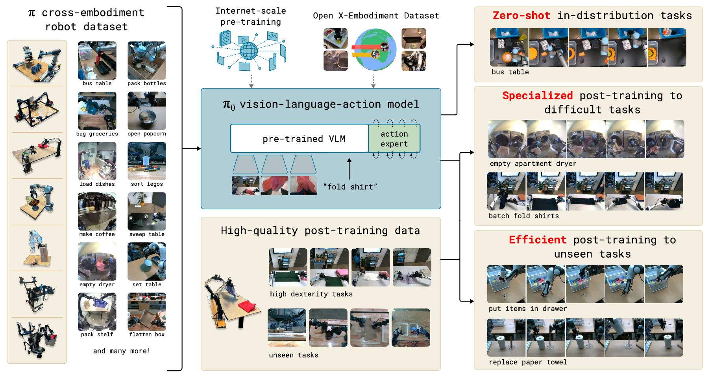

Fig. 2: $\pi_0$ はモバイルマニピュレータを制御して洗濯物を畳む。我々のモデルは、7つの異なるロボット構成と68のタスクからの多様なデータで事前学習され、その後、ゼロショットで使用するか、複雑な下流タスクへとファインチューニングすることができる。この洗濯物折り方策の場合、乾燥機から洗濯物を取り出し、カゴに詰め、カゴを折りたたみテーブルに運び、各衣類を畳む。

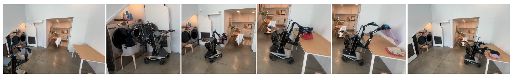

## I. INTRODUCTION

> 「人間は、おむつを替え、侵略を計画し、豚を解体し、船を操舵し、建物を設計し、ソネットを書き、会計の帳尻を合わせ、壁を築き、骨を接ぎ、死に行く者を慰め、命令を受け、命令を下し、協力し、単独で行動し、方程式を解き、新しい問題を分析し、肥料をまき、コンピュータをプログラムし、美味しい食事を作り、効率よく戦い、勇敢に死ぬことができなければならない。専門化は昆虫のためのものだ。」
> — Robert A. Heinlein, *Time Enough for Love*

AIシステムは、タンパク質の立体構造予測 [^21] のように人間の精神では到達不可能な複雑な問題を解決する高度に専門化されたシステムから、テキストプロンプトに基づいて本物そっくりの高解像度画像や動画を生成できるシステム [^40] まで、あらゆる形や規模で存在する。しかし、人間の知能が機械の知能を最も凌駕している軸は汎用性、すなわち、多様な物理的環境に位置づけられた多様なタスクを解決しつつ、環境の制約、言語のコマンド、予期せぬ摂動に知的に対応する能力である。この種の汎用性に向けたAIにおける最も具体的な進歩は、大規模言語モデルおよび視覚言語モデルに見ることができる [^1], [^48] 。これらのシステムは、ウェブからの大規模で非常に多様な画像やテキストのコーパスで事前学習され、その後、望ましい行動や応答のパターンを引き出すことを目的とした、より慎重にキュレーションされたデータセットを使用してファインチューニング（「アライメント」）される。このような手法は、幅広い指示追従と問題解決能力を示すことが示されているが [^53], [^27] 、それらは人間のように真に物理的な世界に位置づけられているわけではなく、物理的な相互作用の理解は完全に抽象的な記述に基づいている。このような手法が、人間が持つような物理的に位置づけられた汎用性を示すAIシステムに向けた具体的な進歩を遂げるためには、物理的に位置づけられたデータ、すなわち具現化されたロボットエージェントからのデータでそれらを学習させる必要がある。

さまざまなロボットの行動を実行するように指示できる柔軟で汎用的なモデルは、実用的に大きな影響を持つだけでなく、データへのアクセス性、汎化、堅牢性など、今日のロボット学習が直面している最も困難な課題のいくつかを解決する可能性がある。自然言語 [^1] やコンピュータビジョン [^39] においては、多様なマルチタスクデータで事前学習された汎用的な基盤モデルは、狭く調整され専門化されたソリューションよりも優れたパフォーマンスを示す傾向がある。たとえば、写真から鳥を認識することが目的の場合、鳥の認識データのみで学習するよりも、さまざまな画像とテキストの関連付けについて事前学習した上で、鳥の認識タスクに対してファインチューニングやプロンプトを行う方がおそらく効率的である。同様に、効果的な専門化されたロボットシステムのためには、まず非常に多様なロボットデータで事前学習を行い、その後、望ましいタスクに対してファインチューニングやプロンプトを行う方が効果的であることがわかるかもしれない。これは、汎用モデルには他のタスク、他のロボット、あるいはロボット以外の情報源からのデータを含め、より多くのデータ源が利用可能であるため、データ不足の課題を解決できる。また、多様なデータは観測と行動をより広くカバーし、狭く専門化されたデータには存在しないかもしれないさまざまなシーン、修正、および回復行動を提供するため、堅牢性と汎化の課題を解決する可能性がある。したがって、ロボット学習に大規模な事前学習アプローチを採用することは、実用的な学習ベースのロボットを実現すると同時に人工知能における最も深い問題への理解を深めつつ、この分野の多くの課題に対処できる可能性を秘めている。

しかし、そのような汎用ロボット方策（すなわち、ロボット基盤モデル）の開発には、いくつかの大きな課題が伴う。第一に、大規模な事前学習の恩恵は小規模では得られないことが多いため、このような研究は非常に大きなスケールで行われなければならない [^54] 。第二に、多様なデータソースを効果的に活用できると同時に、複雑な物理的シーンと相互作用するために必要な複雑で微妙な行動を表現できる適切なモデルアーキテクチャを開発する必要がある。第三に、適切な学習レシピが必要である。自然言語処理（NLP）やコンピュータビジョンにおける大規模モデルの最近の進歩の多くは、事前学習および事後学習（post-training）のデータをキュレーションするための繊細な戦略に大きく依存しているため、これが最も重要な要素と言えるかもしれない [^35] 。

本論文では、我々が $\pi_0$ と呼ぶプロトタイプモデルと学習フレームワークを提示する。これは、これら3つのボトルネックのそれぞれにどのように対処できるかを示している。図1に我々のモデルとシステムを示す。多様なデータソースを組み込むために、インターネット規模の経験を取り込むための事前学習済み視覚言語モデル（VLM）を活用することから始める。モデルをVLMベースにすることで、言語モデルや視覚言語モデルの一般知識、意味推論、問題解決能力を受け継ぐ。次に、モデルをさらに学習させてロボットの行動を組み込み、視覚・言語・行動（VLA）モデルにする [^7] 。多様なロボットデータソースを活用可能にするために、多くのロボットタイプのデータを同じモデルに統合するクロスエンボディメント（cross-embodiment）学習を採用する [^10] 。これらの異なるロボットタイプは、単腕および双腕のシステム、さらにはモバイルマニピュレータなど、異なる構成空間と行動表現を持っている。さらに、高度に器用で複雑な物理タスクを実行可能にするために、複雑な連続的な行動分布を表現するためにフロー・マッチング（拡散の変種） [^28], [^32] を用いた行動チャンキング（action chunking）アーキテクチャ [^57] を使用する。これにより、洗濯物を畳むなどの器用なタスクに対して、最大50 Hzの周波数でロボットを制御することが可能になる（図1を参照）。フロー・マッチングをVLMと組み合わせるために、我々は標準的なVLMにフローベースの出力を追加する新しい行動エキスパートを使用する。

言語モデルと同様に、モデルのアーキテクチャは我々の手法の一部にすぎない。複雑なタスクを柔軟かつ堅牢に実行するためには、適切な学習レシピが必要である。我々のレシピは、エクサスケールの言語および画像・言語モデル [^1], [^48] で一般的に見られる事前学習／事後学習の分離を反映している。すなわち、モデルはまず非常に大規模で多様なコーパスで事前学習され、その後、望ましい行動のパターン（我々の場合、器用さ、効率性、堅牢性）を引き出すために、より狭く、より慎重にキュレーションされたデータでファインチューニングされる。直感的に言えば、高品質なデータだけで学習させても、モデルは失敗から回復する方法を学べない。なぜなら、高品質なデータには失敗がほとんど含まれていないからである。質の低い事前学習データだけで学習させても、モデルは効率的かつ堅牢に行動することを学べない。両方を組み合わせることで、望ましい行動が得られる。つまり、モデルは可能な限り高品質なデータと同様に行動しようと試みるが、失敗した場合には展開できる回復や修正のレパートリーを持っているのである。

本研究の貢献は、VLMの事前学習とフロー・マッチングに基づいた新しい汎用ロボット方策のアーキテクチャと、そのようなロボット基盤モデルのための事前学習／事後学習レシピの経験的調査である。我々は、言語コマンドによるゼロショット制御、下流タスクへのファインチューニング、そして複雑で時間的に延長されたタスクを実行するための中間言語コマンドを出力する高レベルのセマンティック方策との組み合わせについて、我々のモデルを評価する。我々のモデルとシステムは最近の研究で提示されたさまざまなアイデアを活用しているが、要素の組み合わせは斬新であり、経験的評価は過去に実証されたロボット基盤モデルを大幅に超えるレベルの器用さと汎用性を示している。我々は、10,000時間以上のロボットデータでの事前学習と、洗濯物折り（図2を参照）、テーブルの片付け、電子レンジへの食器の投入、卵のカートンへの積み重ね、箱の組み立て、食料品の袋詰めなど、さまざまな器用なタスクへのファインチューニングを行うことで、アプローチを評価する。

## II. RELATED WORK

我々の研究は、大規模なロボット学習やマルチモーダル言語モデルに関する最近の提案手法に基づいている。我々の研究は、ロボット制御のためにファインチューニングされた事前学習済みVLMを使用する、最近提案された視覚・言語・行動（VLA）モデルと最も密接に関連している [^7], [^24], [^55] 。このようなモデルは、自己回帰的な離散化を用いて、テキストトークンと類似した方法で行動を表現する。対照的に、我々のモデルは、拡散 [^20], [^46] の一種であるフロー・マッチング [^32], [^28] を通じて行動を生成するようにVLMをファインチューニングする斬新な設計を採用している。これにより、高頻度の行動チャンク [^57] （最大50 Hz）と高度に器用なタスクを扱うことができ、これらが従来の自己回帰的なVLAにとって大きな課題であったことを示す。これは、行動生成のための拡散モデルに関する最近のいくつかの研究と類似している [^9], [^60] 。これらの研究とは対照的に、我々のモデルは事前学習済みのVLMバックボーンを使用している [^5] 。我々の貢献はまた、根本的に統合的であり、モデルのアーキテクチャ自体だけでなく、事前学習レシピ、事前学習および事後学習フェーズ、幅広い実世界での実験を含む、ロボット基盤モデルのフレームワークに焦点を当てている。

ロボット制御の分野外でも、事前学習済みの言語モデルと拡散を組み合わせた多くのモデルが提案されており [^40], [^41], [^14] 、特に拡散と自己回帰的な大規模言語モデルをハイブリッド化したモデルがある [^19], [^29], [^59] 。そのようなモデルは通常、画像生成に関心を持っているが、我々の行動生成モデルはこれまでに提案されたいくつかの概念に基づいている。Zhouら [^59] と同様に、我々はデコーダのみのTransformerの標準的な交差エントロピー損失の代わりに、個々のシーケンス要素に適用される拡散スタイル（フロー・マッチング）の損失を介してモデルを学習する。Liuら [^29] と同様に、我々は拡散に対応するトークンに別の重みのセットを使用する。これらの概念をVLAモデルに組み込むことで、我々の知る限り、器用な制御のための高頻度の行動チャンクを生成する初のフロー・マッチングVLAを導入する。

我々の研究はまた、大規模ロボット学習に関する豊富な先行研究にも基づいている。この分野の初期の研究では、自己教師ありデータ収集や自律的なデータ収集がしばしば利用され [^26], [^22], [^8] 、把持 [^18], [^37] や押し出し [^56] といった単純なタスクのための扱いやすいデータソースを提供したが、より器用な行動の複雑さは欠けていた。最近では、ロボット制御のために、幅広い汎化を可能にする高品質なデータセットが多数収集されているが [^23], [^10], [^52], [^33], [^34], [^43], [^13], [^6] 、これらは通常、オブジェクトの移動や初歩的な家具の操作（例：引き出しを開ける）といったより単純なタスク向けである [^31], [^15] 。より器用なタスクは小規模で研究されており、通常は10回から100回程度の学習軌跡（10時間以下に相当）で行われている [^57] 。我々の目的の一つは複雑で器用な行動を研究することであるため、約10,000時間のデモンストレーションを含むはるかに大規模なデータセットを利用し、さらにオープンソースのOXEデータセット [^10] で補完する。我々の知る限り、これはロボットデータ量において群を抜いて最大規模のロボット学習実験である。この規模において、我々はより洗練された事前学習／事後学習のレシピが非常に効果的であることを示す。大規模言語モデルで用いられるレシピと同様に、事前学習フェーズによってモデルに幅広い知識の基盤が与えられ、その後、事後学習フェーズでより高品質にキュレーションされたデータを用いて調整され、望ましい行動を達成する。

我々が示すタスクの複雑さは、先行研究を大幅に超えている。靴紐を結ぶ [^58] やエビを調理する [^17] などの、より複雑で器用な行動を示す最近の研究もあるが、我々のフレームワークは、物理的な器用さと組み合わせの複雑さの両方を組み合わせた行動に対して、時には数十分の長さにおよぶ非常に長いタスクを学習できることを示す。たとえば、我々の洗濯物折りタスクでは、任意の構成から始まるさまざまな衣類を操作し、複数のアイテムを連続して折りたたむことが求められる。テーブルの片付けタスクでは、未知のオブジェクト（ゴミか食器か）のクラスを判別する必要がある。我々は、単一のクロスエンボディメントモデルがこれらのタスクのベースモデルとして使用できることを示す。我々の知る限り、我々の研究はエンドツーエンドのロボット学習文献において最も長い器用なタスクを実証している。

## III. OVERVIEW

我々のモデルと学習手順の概要を図3に示す。我々の学習フレームワークでは、まず、我々自身の器用な操作データセット（セクション V-C）とOXEデータセット全体 [^10] を重み付けして組み合わせた事前学習の混合データを作成する。我々のデータセットは7つの異なるロボット構成と68の異なるタスクで収集されたものであり、OXEデータセットには22のロボットからのデータが含まれている。事前学習フェーズ（セクション V-A）では、タスク名とセグメントのアノテーション（通常は約2秒の長さのサブ軌跡に対するきめ細かいラベル）を組み合わせた多様な言語ラベルも使用する。事前学習フェーズの目的は、幅広く適用可能な一般的な物理的能力を示すベースモデルを訓練することであるが、必ずしも単一のタスクで高いパフォーマンスを発揮するように特化させることではない。このベースモデルは言語コマンドに従い、基本的な熟練度でさまざまなタスクを実行できる。複雑で器用なタスクの場合、我々は次に事後学習手順（セクション V-A）を採用し、高品質のキュレーションされたデータを使用してモデルを特定の下流タスクに適応させる。我々は、中規模以下のデータ量での効率的な事後学習と、洗濯物折りやモバイルマニピュレーションなどの複雑なタスクのための大規模データセットを用いた高品質な事後学習の両方を研究する。

セクション IVで説明する我々のモデルは、PaliGemma視覚言語モデル [^5] に基づいており、これを我々のデータ混合でさらに学習させる。ベースのPaliGemma VLMを $\pi_0$ に変えるために、フロー・マッチング [^32], [^28] を用いて連続的な行動分布を生成する行動出力を追加する。この設計について次のセクションで詳細に説明する。なお、利便性とその比較的小さなサイズ（リアルタイム制御に有用）からPaliGemmaを使用しているが、我々のフレームワークは任意の事前学習済みベースVLMと互換性がある。

Fig. 3: 我々のフレームワークの概要。我々自身の器用な操作データセットとオープンソースデータの両方で構成される事前学習混合データから始める。この混合物を使用して、我々のフロー・マッチングVLAモデルを学習する。このモデルは、より大規模なVLMバックボーンと、ロボットの状態と行動を処理するためのより小規模な行動エキスパートで構成される。VLMバックボーンの重みはPaliGemma [^5] から初期化され、大規模なインターネットの事前学習から学習された表現を提供する。得られた $\pi_0$ モデルは、さまざまなタスクを達成するために、異なる行動空間を持つ複数のロボットエンボディメントを制御するために使用できる。

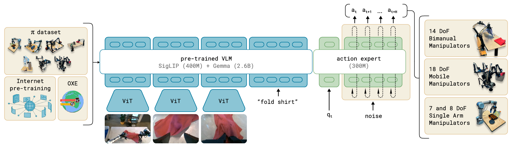

## IV. THE $\pi_0$ MODEL

図3に示されている $\pi_0$ モデルは、主に言語モデルのTransformerバックボーンで構成されている。標準的な遅延融合（late fusion）VLMのレシピ [^3], [^11], [^30] に従い、画像エンコーダがロボットの画像観測を言語トークンと同じ埋め込み空間に埋め込む。さらに、このバックボーンにロボット固有の入力および出力、すなわち固有受容状態（proprioceptive state）とロボットの行動を追加する。 $\pi_0$ は、連続的な行動の分布をモデル化するために条件付きフロー・マッチング [^28], [^32] を使用する。フロー・マッチングは、モデルに高精度かつマルチモーダルなモデリング能力を提供し、高周波数の器用なタスクに特に適している。我々のアーキテクチャはTransfusion [^59] にインスパイアされている。これは、連続的な出力に対応するトークン（注1）をフロー・マッチングの損失で監督し、離散的な出力に対応するトークンを交差エントロピー損失で監督するという複数の目的関数を用いて単一のTransformerを学習するものである。Transfusionを基礎として、ロボット固有の（行動と状態の）トークンに別の重みのセットを使用することでパフォーマンスが向上することを我々は見出した。この設計は、2つの混合要素を持つMixture of Experts (MoE) [^45], [^25], [^12], [^16] に類似しており、最初の要素は画像とテキストの入力に使用され、2番目の要素はロボット固有の入力と出力に使用される。この2番目の重みのセットを「行動エキスパート（action expert）」と呼ぶ。

形式的には、我々はデータ分布 $p(A_t|o_t)$ をモデル化したい。ここで、 $A_t = [a_t, a_{t+1}, \dots, a_{t+H-1}]$ は未来の行動からなる行動チャンクであり（我々のタスクでは $H = 50$ を使用）、 $o_t$ は観測である。観測は、複数のRGB画像、言語コマンド、ロボットの固有受容状態から構成され、 $o_t = [I_{1t}, \dots, I_{nt}, \ell_t, q_t]$ となる。ここで、 $I_{it}$ は $i$ 番目の画像（ロボットあたり2つまたは3つの画像）、 $\ell_t$ は言語トークンのシーケンス、 $q_t$ は関節角度のベクトルである。画像 $I_{it}$ と状態 $q_t$ は対応するエンコーダを介してエンコードされ、線形射影層を通じて言語トークンと同じ埋め込み空間に射影される。

行動チャンク $A_t$ 内の各行動 $a'_{t}$ について、対応する行動トークンがあり、これを行動エキスパートに入力する。学習中、我々は条件付きフロー・マッチングの損失 [^28], [^32] を用いてこれらの行動トークンを監督する：
```math
\mathcal{L}_\tau(\theta) = \mathbb{E}_{p(A_t|o_t), q(A^\tau_t|A_t)} \|v_\theta(A^\tau_t, o_t) - u(A^\tau_t|A_t)\|^2,
```
ここで下付き文字はロボットのタイムステップを示し、上付き文字はフロー・マッチングのタイムステップを示し、 $\tau \in$ である。高解像度の画像合成 [^14] や動画合成 [^38] における最近の研究は、フロー・マッチングが $q(A^\tau_t|A_t) = \mathcal{N}(\tau A_t, (1-\tau)I)$ で与えられる単純な線形ガウス（または最適輸送）確率経路 [^28] と組み合わされた場合に強力な実証的パフォーマンスを達成できることを示している。実際には、ネットワークはランダムノイズ $\epsilon \sim \mathcal{N}(0, I)$ をサンプリングし、「ノイズの乗った行動」 $A^\tau_t = \tau A_t + (1-\tau)\epsilon$ を計算し、そしてネットワークの出力 $v_\theta(A^\tau_t, o_t)$ がノイズ除去ベクトル場 $u(A^\tau_t|A_t) = \epsilon - A_t$ に一致するように学習される。行動エキスパートは完全な双方向アテンションマスクを使用するため、すべての行動トークンが互いにアテンションを向ける。学習中、我々はより低い（よりノイズの多い）タイムステップを強調するベータ分布からフロー・マッチングのタイムステップ $\tau$ をサンプリングする。詳細については付録Bを参照されたい。

推論時には、ランダムノイズ $A^0_t \sim \mathcal{N}(0, I)$ から始めて、学習済みのベクトル場を $\tau=0$ から $\tau=1$ まで積分することによって行動を生成する。我々は前進オイラー積分則を使用する：
```math
A^{\tau+\delta}_t = A^\tau_t + \delta v_\theta(A^\tau_t, o_t),
```
ここで $\delta$ は積分のステップサイズである。我々の実験では10回の積分ステップ（ $\delta = 0.1$ に相当）を使用する。プレフィックス $o_t$ に対応するアテンションのキーとバリューをキャッシュし、各積分ステップにおいて行動トークンに対応するサフィックスのみを再計算することで、推論を効率的に実装できることに注意されたい。モデルの各部分の推論時間を含め、推論手順に関する詳細を付録Dに記載する。

原理的には我々のモデルはゼロから初期化するか任意のVLMバックボーンからファインチューニングすることができるが、実際にはPaliGemma [^5] をベースモデルとして使用する。PaliGemmaはオープンソースの30億パラメータVLMであり、サイズとパフォーマンスの便利なトレードオフを提供する。行動エキスパート（ゼロから初期化される）に3億パラメータを追加し、合計33億パラメータとする。付録Bにモデルアーキテクチャの完全な説明を提供する。

**非VLMベースラインモデル。** 我々のメインのVLAモデルに加えて、アブレーション実験のためにVLM初期化を使用しない同様のベースラインモデルも学習させた。 $\pi_0\text{-small}$ と呼ぶこのモデルは4.7億パラメータであり、VLM初期化を使用せず、VLM初期化なしで我々のデータで学習させるために役立つことがわかったいくつかの小さな違いがある（付録Cに要約）。このモデルは、VLMの事前学習を取り入れることの利点を評価するための比較に使用される。

## V. DATA COLLECTION AND TRAINING RECIPE

幅広い能力を持つロボット基盤モデルには、表現力豊かで強力なアーキテクチャだけでなく、適切なデータセット、そしてさらに重要なことに、適切な学習レシピが必要である。LLMの学習が通常、事前学習フェーズと事後学習フェーズに分かれているのと同様に、我々はモデルにマルチステージの学習手順を採用する。事前学習フェーズの目的は、モデルを多様なタスクにさらし、幅広く適用可能で一般的な物理的能力を獲得できるようにすることである。一方、事後学習フェーズの目的は、目標とする下流タスクを巧みかつ流暢に実行する能力をモデルに提供することである。このため、事前学習データセットと事後学習データセットの要件は異なる。事前学習データセットは可能な限り多くのタスクをカバーすべきであり、さらに各タスク内で行動の多様性をカバーすべきである。代わりに、事後学習データセットは効果的なタスク実行に寄与する行動をカバーすべきであり、それは一貫した流暢な戦略を示すべきである。直感的に言えば、多様な（しかし質の低い）事前学習データは、高品質な事後学習データには現れないかもしれないミスからの回復や非常に多様な状況に対処することを可能にする一方で、事後学習データはモデルにタスクを上手に実行する方法を教える。

Fig. 4: 我々のデータセットの概要：事前学習混合データは、OXE [^10] のサブセットと $\pi$ データセットで構成される。我々は、OXE Magic Soup [^24] と呼ばれるOXEのサブセットを使用する。左の図は、事前学習混合データにおけるさまざまなデータセットの重みを示している。右の図は、ステップ数で測定したそれらの相対的なサイズを示している。

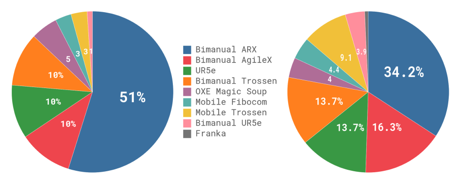

### A. Pre-training and post-training
図4に事前学習混合データの概要を示す。各学習サンプルは1つのタイムステップ、すなわちタプル $(o_t, A_t)$ に対応するため、この議論ではタイムステップ単位でデータを定量化する。学習混合データの $9.1\%$ はオープンソースのデータセットで構成されており、これにはOXE [^10], Bridge v2 [^52], および DROID [^23] が含まれる。これらのデータセット内のロボットとタスクは通常1つまたは2つのカメラを持ち、2から10 Hzの間の低周波数制御を使用する。しかし、これらのデータセットは広範囲のオブジェクトと環境をカバーしている。器用でより複雑なタスクを学習するために、我々自身のデータセットから9億300万タイムステップのデータも使用する。そのうち1億600万ステップが単腕ロボット、7億9700万ステップが双腕ロボットからのものである。このデータには68のタスクがあり、各タスクは複雑な行動で構成されている。例えば、「片付け（bussing）」タスクには、多種多様な皿、コップ、カトラリーを片付け箱に入れ、多種多様なゴミをゴミ箱に入れることが含まれる。このタスクの定義は、名詞と動詞の任意の組み合わせ（例：「コップを拾う」対「皿を拾う」）を別個のタスクとする従来の定義とは大きく異なる点に注意されたい。したがって、我々のデータセットにおける行動の実際の範囲は、この「タスク」の数が暗示するよりもはるかに広い。セクションV-Cで我々のデータセットに含まれる特定のロボットとタスクについてより詳しく議論する。

データセットはサイズにおいて多少不均衡であるため（例えば、より難しい洗濯物折りタスクが過剰に表現されている）、各タスクとロボットの組み合わせに $n^{0.43}$ （ $n$ はその組み合わせのサンプル数）で重み付けを行い、過剰に表現されている組み合わせを低く重み付けする。構成ベクトル $q_t$ と行動ベクトル $a_t$ は常に、データセット内で最大のロボットの次元数（我々の場合、2つの6自由度アーム、2つのグリッパー、モバイルベース、そして垂直駆動胴体を収容するために18）を持つ。より低次元の構成空間と行動空間を持つロボットについては、構成ベクトルと行動ベクトルをゼロパディングする。3つ未満のカメラを持つロボットについては、欠落している画像スロットもマスクする。

事後学習フェーズでは、小規模なタスク固有のデータセットを使用してモデルをファインチューニングし、特定の下流アプリケーションに特化させる。前述のように、我々の「タスク」の定義はかなり広範であり、例えば「片付け」タスクは多種多様なオブジェクトを操作することを要求する。異なるタスクは全く異なるデータセットを必要とし、最も単純なタスクでは5時間だけで済むが、最も複雑なタスクでは100時間以上のデータを使用する。

### B. Language and high-level policies

テーブルの片付けのように、意味的推論と高レベルの戦略を必要とするより複雑なタスクは、「テーブルを片付ける」という高レベルのタスクを「ナプキンを拾う」や「ナプキンをゴミ箱に捨てる」といったより直接的なサブタスクに分解する高レベルの方策の恩恵も受けることができる。我々のモデルは言語入力を処理するように学習されているため、SayCan [^2] のようなLLM/VLMプランニング手法に類似した方法で、高レベルのVLMを使用してこれらの意味的推論を行うことができる。我々は、セクションVIで議論するように、いくつかの実験タスクにおける高レベルの戦略において我々のモデルを支援するために、このような高レベルの方策を使用する。

### C. Robot system details

我々の器用な操作データセットには、7つの異なるロボット構成と68のタスクが含まれている。これらのプラットフォームを図5に要約し、以下で説明する：

Fig. 5: 実験で使用されたロボット。これには、6自由度および7自由度のアームを持つ単腕および双腕のマニピュレータ、ならびにホロノミックおよび非ホロノミックなモバイルマニピュレータが含まれる。 $\pi_0$ はこれらすべてのプラットフォームで共同して学習される。

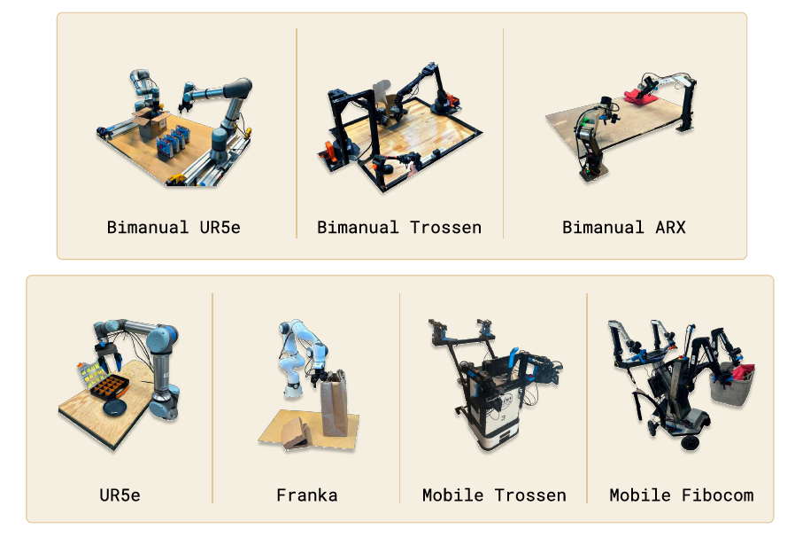

- **UR5e.** 平行ジョーグリッパーを備えたアームで、手首に取り付けられたカメラと肩越しカメラがあり、合計2つのカメラ画像と7次元の構成・行動空間を持つ。
- **Bimanual UR5e.** 2つのUR5eセットアップで、合計3つのカメラ画像と14次元の構成・行動空間を持つ。
- **Franka.** Frankaセットアップは2つのカメラと8次元の構成・行動空間を持つ。
- **Bimanual Trossen.** このセットアップはALOHAセットアップ [^4], [^57] に基づく構成で2つの6自由度Trossen ViperXアームを持ち、2つの手首カメラとベースカメラ、そして14次元の構成・行動空間を持つ。
- **Bimanual ARX & bimanual AgileX.** このセットアップは2つの6自由度アームを使用し、ARXまたはAgileXのいずれかのアームをサポートする。3つのカメラ（手首2つとベース1つ）と14次元の構成・行動空間を持つ。これは2つの別個のプラットフォームを包含するが、運動学的な特性が類似しているためまとめて分類する。
- **Mobile Trossen & mobile ARX.** このセットアップはMobile ALOHA [^57] プラットフォームに基づいており、モバイルベース上に2つの6自由度アーム（ARXアームまたはTrossen ViperXアーム）を持つ。非ホロノミックなベースは行動の次元を2つ追加し、14次元の構成空間と16次元の行動空間となる。2つの手首カメラとベースカメラがある。これは2つの別個のプラットフォームを包含するが、運動学的な特性が類似しているためまとめて分類する。
- **Mobile Fibocom.** ホロノミックベース上に2つの6自由度ARXアーム。ベースは行動の次元を3つ追加し（並進2つと回転1つ）、14次元の構成空間と17次元の行動空間となる。

図4に各ロボットのデータセットの割合を要約している。

## VI. EXPERIMENTAL EVALUATION

我々の実験的評価は、事前学習済みのベースモデルを代替のモデル設計と比較するゼロショット評価実験と、困難な下流タスクでモデルを評価し、器用な操作のために提案された他の手法と比較する詳細なファインチューニング実験とで構成される。我々は以下の研究課題を検討する：
- 事前学習データに存在するさまざまなタスクで事前学習を行った後、 $\pi_0$ はどれくらいよく機能するか？我々はこの質問を調べるために、他のロボット基盤モデルと比較しながら $\pi_0$ を直接評価する。
- $\pi_0$ は言語コマンドにどれくらいよく従うか？これらの実験では、言語コマンドに従うパフォーマンスを評価するために、 $\pi_0$ をVLM初期化なしの我々のモデルの小型版である $\pi_0\text{-small}$ と比較する。我々は人間から提供されたコマンドと、セクションV-Bで議論したような高レベルVLM方策によって指定されたコマンドの両方で評価する。
- $\pi_0$ は器用な操作タスクに対処するために提案された手法とどう比較されるか？これらの実験では、事前学習済みの初期化から我々のモデルをファインチューニングするか、タスク固有のデータでゼロから学習させることができる下流タスクを研究し、器用な操作のために提案された従来の手法と比較する。我々のアーキテクチャと事前学習手順の両方の利点を評価することを目指す。
- $\pi_0$ は複雑なマルチステージのタスクに適応できるか？最後の実験セットでは、洗濯物を畳んだりテーブルを片付けたりするような特に複雑なタスクに $\pi_0$ をファインチューニングする。これらのタスクは完了するまでに5〜20分かかる。一部のタスクには高レベル方策からのガイダンスが必要である。

Fig. 6: ゼロショット評価タスク：我々のベースモデルを評価するために、事前学習後に5つのタスクで実行する。シャツを畳む、片付け（易）、片付け（難）、食料品の袋詰め、およびトースターからトーストを取り出すタスクである。タスクは、器用な操作、マルチステージの行動、および意味的認識の組み合わせを必要とする。

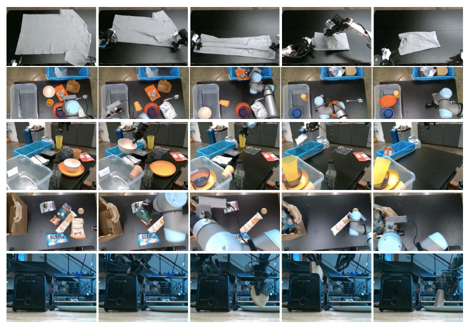

### A. Evaluating the base model

最初の実験セットでは、事前学習後のモデルをファインチューニングなしのフルミックスで評価し、ベースモデルがさまざまなタスクをどの程度うまく実行できるかを評価する。文献にある他のロボット基盤モデルと比較する：VLAと、同じ事前学習ミックスでゼロから学習されたより小さなモデルの両方である。図6に視覚化された以下のタスクで評価し、各タスクは言語コマンドを介して同じベースモデルに指示される。
- **Shirt folding（シャツを畳む）:** ロボットは平らに置かれたTシャツを畳まなければならない。
- **Bussing easy（片付け・易）:** ロボットはテーブルをきれいにし、ゴミをゴミ箱に、食器を食器入れに入れなければならない。スコアは正しい入れ物に置かれたオブジェクトの数を示す。
- **Bussing hard（片付け・難）:** より難しいバージョンの片付けタスクであり、より多くのオブジェクトや、ゴミの上に意図的に置かれたカトラリー、事前学習データセットにない一部のオブジェクトなど、より困難な構成を持つ。
- **Grocery bagging（食料品の袋詰め）:** ロボットはポテトチップス、マシュマロ、キャットフードなどのすべての食料品を袋詰めしなければならない。
- **Toast out of toaster（トースターからトーストを取り出す）:** ロボットはトースターからトーストを取り外す。

過去のモデルでこの規模で動作できるものは非常に少ないため、これらの実験の比較を提供することは困難である。我々は、OXEデータセット [^10] で元々学習された70億パラメータのVLAモデルであるOpenVLA [^24] と比較する。我々はフルミックスでOpenVLAを学習させる。行動のチャンキングや高周波制御をサポートしていないOpenVLAにとって、これは非常に難しいミックスである。我々はまた、より小さな9300万パラメータのモデルであるOcto [^50] とも比較する。OctoはVLAではないが、行動を生成するために拡散プロセスを使用しており、我々のフロー・マッチングVLAとの比較の良いポイントを提供する。我々もOctoを我々のモデルと同じミックスで学習させる。時間の制約のため、OpenVLAとOctoをフルモデルと同じエポック数で学習させることができなかった。したがって、我々はまた、ベースラインに提供されたステップ数（OpenVLAには16万、Octoには32万）以下の16万ステップ（メインモデルの70万ステップに対して）しか学習されていない我々のモデルの「計算パリティ（compute parity）」バージョンとも比較する。さらに、UR5eのタスクでより強力なベースラインを提供することを期待して、クロスエンボディメント学習なしでUR5eデータのみにファインチューニングしたOpenVLAモデルのバージョンも含める。最後に、セクションIVで説明した $\pi_0\text{-small}$ モデルとの比較を含める。これは、VLMの事前学習を持たない我々のモデルの縮小版と見なすことができる。

Fig. 7: ゼロショット評価の結果：全70万ステップで学習させた $\pi_0$ 、ベースラインモデルと更新回数を合わせた16万ステップで学習させたバージョン、 $\pi_0\text{-small}$ 、および3つのベースライン（我々の全データで学習させたOpenVLAとOcto、そしてUR5eタスクでのみ学習させたOpenVLA）を評価する。すべてのタスクと比較において、我々のモデルの「パリティ」バージョンでさえすべてのベースラインを上回り、我々のフルバージョンモデルは大きな差で最高の結果を達成している。

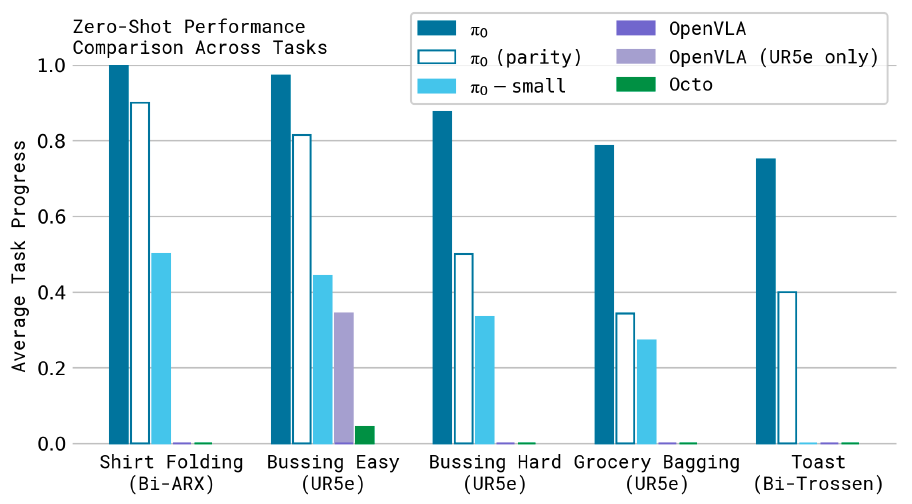

評価指標は、タスクおよび手法ごとに10エピソードで平均した正規化スコアを使用し、エピソードは完全な成功に対して1.0のスコアを受け取り、部分的な成功に対しては小数スコアを受け取る。例えば、片付けのスコアは、適切な入れ物に正しく置かれたオブジェクトの割合である。付録Eでスコアリングの基準を説明する。図7に示された結果は、 $\pi_0$ がすべてのゼロショットタスクにおいて群を抜いて最良の結果を達成し、シャツ折りや簡単な片付けタスクではほぼ完璧な成功率を示し、すべてのベースラインに対して大きな改善を見せていることを示している。わずか16万ステップしか学習されていない $\pi_0$ の「パリティ」バージョンでも、すべてのベースラインを上回り、 $\pi_0\text{-small}$ でさえOpenVLAとOctoを上回っている。OpenVLAは、その自己回帰的な離散化アーキテクチャが行動チャンクをサポートしていないため、これらのタスクに苦労している。UR5eのみのOpenVLAモデルはより良く機能するが、それでも $\pi_0$ のパフォーマンスには遠く及ばない。Octoは行動チャンクをサポートしているが、比較的限られた表現能力しか持たない。この比較は、大規模で表現力豊かなアーキテクチャと、フロー・マッチングや拡散を介して複雑な分布をモデル化する能力を組み合わせることの重要性を示している。さらに、 $\pi_0\text{-small}$ との比較は、VLMの事前学習を取り入れることの重要性を示している。残念ながら、この最後の比較を公平に行うことは難しい。 $\pi_0\text{-small}$ はより少ないパラメータを使用するが、大規模なモデルは事前学習なしでは使用が困難であるためである。全体として、これらの実験は $\pi_0$ が、従来のモデルよりもはるかに優れたパフォーマンスでさまざまなタスクを効果的に実行する能力を備えた、強力な事前学習済みモデルを提供することを示している。

### B. Following language commands

次の実験セットでは、ベースとなる $\pi_0$ モデルを一連の評価ドメインで言語コマンドに従うようにファインチューニングする。このファインチューニングされた $\pi_0$ モデルと、前のセクションで最も強力なベースラインであることがわかった、セクションIVで説明した $\pi_0\text{-small}$ モデルとを比較する。 $\pi_0\text{-small}$ はVLM初期化を使用しないことを思い出してほしい。したがって、この実験は、VLMの事前学習が我々のモデルの言語指示に従う能力をどれだけ向上させるかを測定することを目的としている。なお、 $\pi_0\text{-small}$ はかなり小さいモデルでもある。残念ながら、VLM初期化は過剰適合（overfitting）なしにはるかに大規模なモデルを学習することを現実的なものにする役割と、言語指示追従を改善する役割の両方を果たしているため、この交絡因子（confounder）を取り除くことは難しい。それでも、この実験が $\pi_0$ の言語能力を明らかにする一助となることを期待している。各タスクの言語指示は、拾うべきオブジェクトとそれらのオブジェクトを置く場所で構成され、約2秒の長さの言語ラベル付きセグメントが伴う。各完全なタスクは、多数のそのようなセグメントで構成される。この評価におけるタスクは以下の通りである。
- **Bussing（片付け）:** ロボットはテーブルをきれいにし、食器とカトラリーを箱に入れ、ゴミをゴミ箱に入れなければならない。
- **Table setting（テーブルセッティング）:** ロボットはランチョンマット、食器、銀食器、ナプキン、コップなど、テーブルをセッティングするためのアイテムを箱から取り出し、言語の指示に従ってそれらを調整しなければならない。
- **Grocery bagging（食料品の袋詰め）:** ロボットはコーヒー豆の袋、大麦の袋、マシュマロの袋、海苔、アーモンド、スパゲッティ、缶詰などの食料品を袋に詰めなければならない。

Fig. 8: 言語評価におけるタスク。我々はモデルを3つの異なる言語条件付きタスクで評価し、それぞれが一連の中間言語コマンドに従うことを要求する。これらのタスクには、皿を箱に入れゴミをゴミ箱に入れるテーブルの片付け（上）、箱からアイテムを取り出してテーブルをセットするテーブルセッティング（中）、そして買い物袋の詰め込み（下）が含まれる。

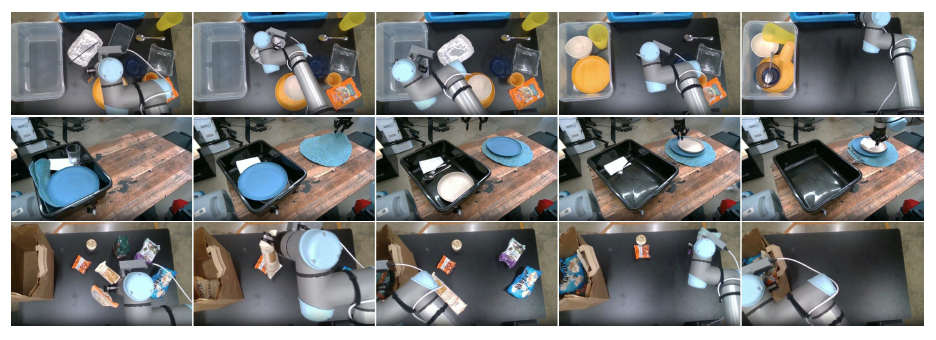

Fig. 9: 言語評価。全体的なタスクコマンド（例：「食料品を袋に詰める」）のみを受け取る我々の方策の「フラット（flat）」バージョン $\text{-flat}$ と、人間の専門家 $\text{-human}$ または高レベルVLM方策 $\text{-HL}$ から中間コマンドを受け取る方法とを比較する。また、「エキスパート」条件下での我々のモデルと小型の非VLMバリアントである $\pi_0$ と $\pi_0\text{-small}$ を、言語追従精度の観点から比較する。結果は、 $\pi_0$ が人間の専門家による中間言語コマンドから大きく改善され、より程度は小さいが自律的な高レベル方策からも改善されることを示している。重要なことに、 $\pi_0\text{-small}$ の言語追従パフォーマンスが低いため、高レベルのエキスパートを追加しても利益を得られない。

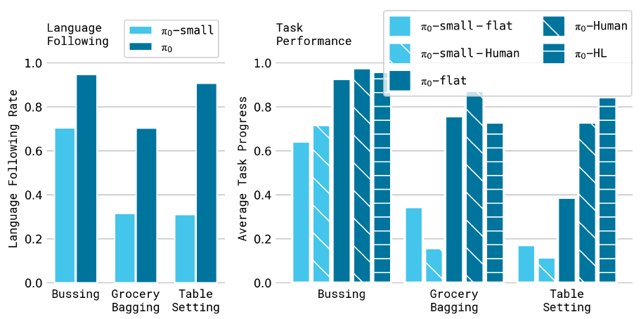

図8に言語条件付きタスクを示し、評価結果を提示する。我々は5つの異なる条件を評価する。 $\pi_0\text{-flat}$ （および $\pi_0\text{-small-flat}$ ）は、中間言語コマンドなしで、全体的なタスクの記述（例：「食料品を袋に詰める」）だけでモデルに直接指示することに対応する。 $\pi_0\text{-human}$ （および $\pi_0\text{-small-human}$ ）は、専門家の人間のユーザーからステップごとの中間コマンド（例：どのオブジェクトを選び、どこに配置するか）を提供する。これらの条件は、各モデルがより詳細な言語コマンドに従う能力を評価する。これらの中間コマンドはタスクの実行方法に関する重要な情報を提供するが、モデルはその恩恵を受けるためにそれらのコマンドを理解し、従うことができなければならない。最後に、 $\pi_0\text{-HL}$ はセクションV-Bで議論したように、高レベルVLMによって提供される高レベルコマンドで $\pi_0$ を評価する。この条件も、人間の専門家なしの自律的なものである。

タスクごとに10回の試行を平均した図9の結果は、 $\pi_0$ の言語追従精度が $\pi_0\text{-small}$ のそれよりも有意に優れていることを示している。これは、より大規模な事前学習済みVLMでの初期化による大幅な改善を示唆している。この能力は、専門家の人間によるガイダンス $(\pi_0\text{-human})$ と高レベルのモデルによるガイダンス $(\pi_0\text{-HL})$ におけるパフォーマンスの向上に直結している。結果は、我々のモデルの言語追従能力が、高レベルなガイダンスを伴う複雑なタスクでの優れた自律的パフォーマンスに直接結びついていることを示している。

### C. Learning new dexterous tasks

次の実験セットでは、事前学習データとは大きく異なり、完全に新しい行動を必要とする新しいタスクでモデルを評価する。これらの評価では、新しいタスクごとにさまざまな量のデータを使用してモデルをファインチューニングする。各タスクは新しいものであるが、事前学習データ内のタスクとどの程度異なるかに応じてタスクを「階層（tiers）」に分ける。図10に示すタスクは以下の通りである。
- **UR5e stack bowls（UR5eでボウルを重ねる）.** このタスクは4つの異なるサイズのボウルを重ねることを要求する。このタスクは事前学習データの片付けタスクのように食器を把持して移動させることを必要とするため、「易しい」階層に分類する。学習データにはさまざまなボウルが含まれており、評価では見たことのあるボウルと見たことのないボウルの組み合わせを使用する。
- **Towel folding（タオルを畳む）.** このタスクはタオルを畳むことを要求する。これは事前学習に存在するシャツを畳むことに似ているため、「易しい」階層に分類する。
- **Tupperware in microwave（電子レンジにタッパーを入れる）.** このタスクは電子レンジを開け、プラスチックの容器を中に入れ、閉めることを要求する。容器にはさまざまな形と色があり、評価では見たことのある容器と見たことのない容器の組み合わせを使用する。容器の操作は事前学習データに似ているが、電子レンジは事前学習には見られない。
- **Paper towel replacement（ペーパータオルの交換）.** このタスクは古いダンボール製のペーパータオルの芯をホルダーから外し、新しいペーパータオルのロールと交換することを要求する。このようなアイテムは事前学習に見られないため、これを「難しい」と見なす。
- **Franka items in drawer（Frankaでアイテムを引き出しに入れる）.** このタスクは引き出しを開け、アイテムを引き出しに詰め込み、閉めることを要求する。事前学習にFrankaロボットを用いた類似のタスクがないため、これを「難しい」と見なす。

Fig. 10: ファインチューニング評価タスク：事前学習で見られるタスクとは異なるさまざまな下流タスクにモデルをファインチューニングする。我々のタスクは、事前学習に最も類似したタスク（ボウルを重ねる、タオルを畳む）、未知の新しい要素を導入するタスク（電子レンジ）、新しい動作と新しいタイプのオブジェクトを必要とするタスク（Frankaでの引き出しへのアイテム収納とペーパータオルの交換）など、事前学習からの類似性の範囲を代表している。

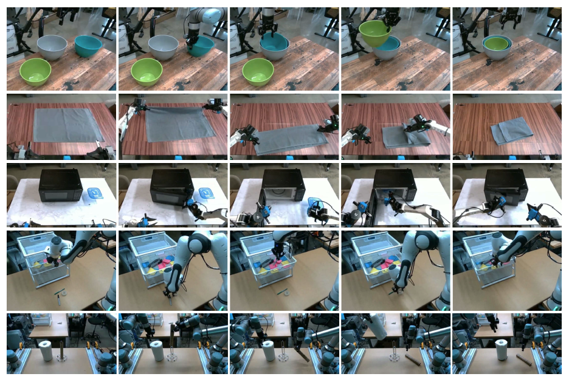

ファインチューニング後の我々のモデルを、事前学習とファインチューニングのレシピを採用しているOpenVLA [^24] およびOcto [^50] と比較する。我々の目的は（アーキテクチャではなく）特定のモデルを評価することであるため、OXE [^10] で学習されたこれらのモデルの公開されている事前学習済みチェックポイントを使用し、それらを各タスクにファインチューニングする。我々はまた、より小規模なデータセットから器用なタスクを学習するために特別に設計されたACT [^57] およびDiffusion Policy [^9] とも比較する。ACTとDiffusion Policyはファインチューニング用データセットのみで学習されるが、そのサイズはACTとDiffusion Policyの実験で使用された個別のデータセットのサイズと類似している [^9], [^57] 。 $\pi_0$ については、事前学習済みのベースモデルからファインチューニングを行う場合と、ゼロから学習を行う場合の両方で評価する。この比較は、 $\pi_0$ アーキテクチャと事前学習手順のそれぞれの利点を評価することを目的としている。我々は、VLM初期化を伴う $\pi_0$ アーキテクチャが個々のタスクに対してすでにより強力な出発点を提供するはずであり、一方で事前学習手順がそのパフォーマンスを、特により小規模なファインチューニングデータセットでさらに向上させるはずであると仮説を立てている。

Fig. 11: さまざまな量のデータによるファインチューニング。 $\pi_0$ は少量のデータでもいくつかのより簡単なタスクを学習でき、事前学習済みモデルはゼロから学習されたモデルよりも大きな改善を達成することが多い。

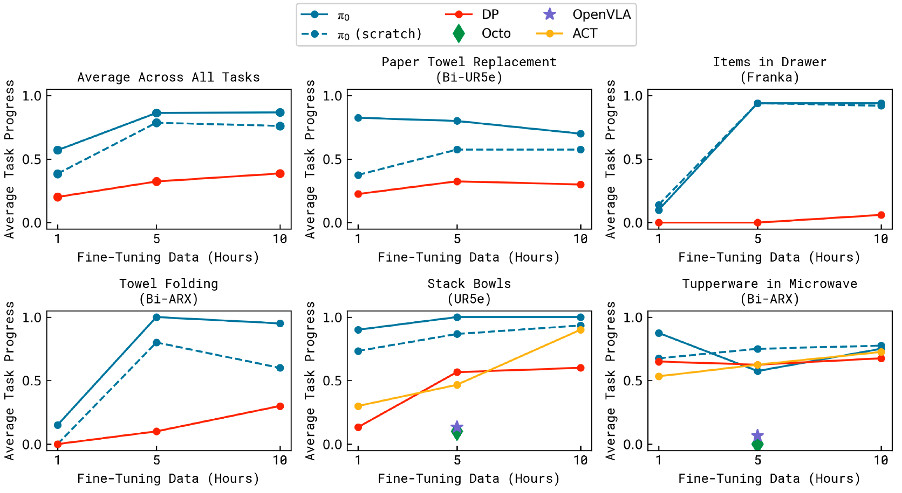

図11に、各タスクごとにさまざまな量のファインチューニングデータを使用した場合の、さまざまな手法の全タスクにわたるパフォーマンス（タスクごとに10回の試行を平均）を示す。ボウルを重ねるタスクと電子レンジにタッパーを入れるタスクには、すべてのベースラインを含める。OpenVLAとOctoのパフォーマンスは著しく低いため、実世界で非常に多くのモデルを評価する時間的コストを考慮して、これらは1つのデータセットサイズでのみ実行する。結果は、 $\pi_0$ が一般に他の手法を上回ることを示している。興味深いことに、最も強力な従来モデルはターゲットタスクで完全にゼロから学習されたものであり、これはこれらの領域で事前学習を活用することが従来のアプローチにとって大きな課題となっていることを示唆している。タッパーのタスクにおける $\pi_0$ の5時間の方策はベースラインと同様のパフォーマンスを示すが、1時間バージョンは有意に優れている。予想通り、事前学習は事前学習データにより類似したタスクに対してより大きな改善をもたらすが、事前学習済みモデルは頻繁に非事前学習モデルより優れており、時には2倍も優れていることがある。

### D. Mastering complex multi-stage tasks

我々の最後の実験セットでは、ファインチューニングと言語の組み合わせを通じて、一連の挑戦的なマルチステージタスクに取り組む。これらのタスクのいくつかについては、事前学習にデータが存在するが、習熟に達するにはファインチューニングが必要である。いくつかのタスクについては、事前学習にデータが存在しない。図12に示すこの評価におけるタスクは以下の通りである。
- **Laundry folding（洗濯物折り）:** このタスクは、静置された（モバイルではない）双腕システムが衣類を畳むことを要求する。衣類はカゴの中でランダムにくしゃくしゃになった状態で始まり、目的はアイテムを取り出し、畳み、そして既に畳まれたアイテムの山の上に置くことである。くしゃくしゃになった洗濯物のランダムな初期構成は、方策が任意の構成に汎化する必要があるため、大きな課題を提示する。このタスクは事前学習に存在する。
- **Mobile laundry（モバイル洗濯物折り）:** ここでは、図5のFibocomモバイルロボットが、方向と移動を制御しながら、同様の課題の多くに直面しつつ洗濯物を畳まなければならない。このタスクは事前学習に存在する。
- **Mobile dryer（モバイル乾燥機）:** ここでは、Fibocomモバイルロボットが乾燥機から洗濯物を取り出し、カゴに入れなければならない。このタスクは事前学習に存在する。
- **Table bussing（テーブルの片付け）:** このタスクは、雑然としたシーンにある多様な未知のオブジェクトでテーブルを片付けることを要求し、我々のゼロショット評価のベンチマークよりもはるかに大きな課題を提示する。方策はさまざまな形やサイズの未知のオブジェクトに汎化し、大きな皿を拾うためにグリッパーをひねる、グラスのような薄くて繊細なアイテムを慎重に把持するといった複雑で器用な動作を実行しなければならない。ロボットは密集した雑然さを処理し、さまざまな行動をインテリジェントに順序付けなければならない。たとえば、皿の上のゴミをきれいにするには、まず皿を拾い、その中身を振ってゴミ箱に入れ、次に皿を入れ物に置かなければならない。このタスクは事前学習に存在しない。
- **Box building（箱の組み立て）:** ロボットは平らな状態から始まるダンボール箱を組み立てなければならない。このタスクは多くの大きな課題を提示する：箱を正しい方向に曲げる必要があり、ロボットは箱の一部を押しさえながら他の部分を折り、両腕さらにはテーブルの表面を使って折りたたみ動作中の支えにしなければならない。ロボットはいくつかの折りをやり直す必要が生じるかもしれず、反応的でインテリジェントな戦略が要求される。このタスクは事前学習データに存在しない。
- **To-go box（持ち帰り用ボックス）:** このタスクは、皿から持ち帰り用ボックスにいくつかの食品アイテムを移動することを要求し、アイテムがはみ出さないようにボックスに詰め込み、その後両腕でボックスを閉める必要がある。このタスクは事前学習データに存在しない。
- **Packing eggs（卵のパッキング）:** ロボットはボウルから6個の卵を取り出して卵のカートンに詰め、その後カートンを閉めなければならない。卵はボウルの中の姿勢に適した方法で把持され、カートンの開いているスロットに配置されなければならない。卵の形状、滑りやすさ、慎重な配置の必要性が課題となる。ボックスを閉めるには両腕を使用する必要がある。このタスクは事前学習データに存在しない。

Fig. 12: 幅広い複雑かつ時間的に延長されたタスクを評価する。これには以下のものが含まれる：静置型 (a) またはモバイル型 (b) のロボットでカゴから洗濯物を畳む、実際のランチテーブルを片付ける (c)、箱を組み立てる (d)、卵をカートンに詰める (e)、そして食べ物を持ち帰り用ボックスに詰める (f)。これらのタスクは、把持、積み重ね、折りたたみ、平坦化などの何十もの個別の行動を組み合わせること、多種多様なオブジェクトの構成への汎化、および変形するオブジェクトや柔軟なダンボールなどの複雑な物理的特性を必要とする。

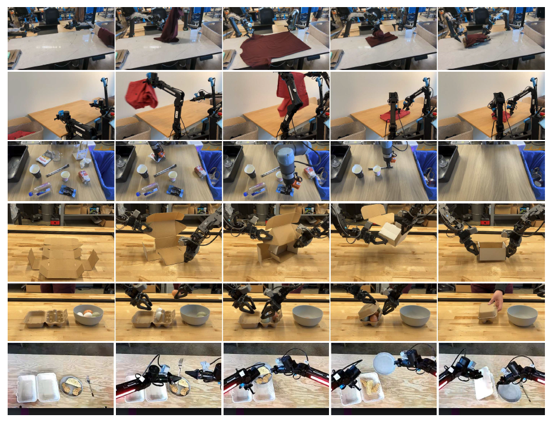

Fig. 13: 複雑なタスクにおける10回の試行の平均スコアによる事後学習の結果。完全な事前学習済みの $\pi_0$ モデルは、すべてのタスクにわたって最高スコアの50%以上を達成し、通常はアブレーションを上回り、特に最も困難なタスクで顕著な改善が見られる。

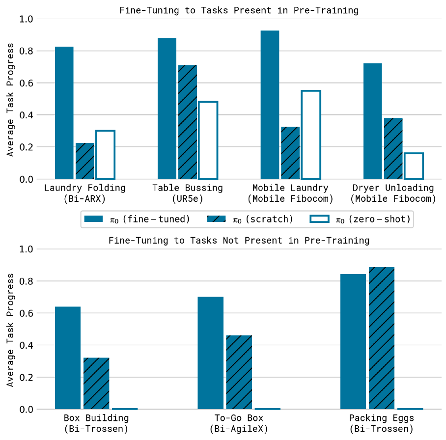

タスクごとに10回の試行で平均したスコアを示す結果を図13に提示する。スコアリングの基準は付録Eにある。1.0のスコアは完璧な実行を表し、部分的なスコアは部分的に完了したタスクに対応する（例：0.5はオブジェクトの半分が正しく片付けられたことを示す）。これらのタスクは非常に難しく、他の手法で解決することはできなかった。したがって、これらのタスクを用いて我々のアプローチのアブレーションを比較し、事前学習およびファインチューニング後の $\pi_0$ 、事前学習のみのゼロショット評価（「zero-shot」）、事前学習なしのファインチューニングデータのみの学習（「scratch」）を評価する。結果は、 $\pi_0$ がこれらのタスクの多くを解決できることを示しており、我々の完全な事前学習およびファインチューニングレシピが全体で最も優れたパフォーマンスを発揮している。これらのより難しいタスクの多くは、事前学習済みモデルを使用することで非常に大きな改善を示しており、事前学習がより難しいタスクで特に有用であることを示している。 $\pi_0$ の絶対的なパフォーマンスはタスク間で異なるが、これはおそらくタスクの難易度の違いと、タスクが事前学習にどの程度表現されているかの違いによるものである。我々は読者に対し、これらのタスクとその複雑さについてより完全な印象を得るために、付属のウェブサイトにあるタスクの動画を視聴することをお勧めする。学習済み方策によるこのような挑戦的なタスクでのこのレベルの自律的パフォーマンスは、器用なロボット操作における新しい最先端（state of the art）を代表していると我々は信じている。

## VII. DISCUSSION, LIMITATIONS, AND FUTURE WORK

我々は、非常に多様なデータでの事前学習と、その後のゼロショット評価または複雑な下流タスクへのファインチューニングからなる、 $\pi_0$ と呼ぶロボット基盤モデルを学習するためのフレームワークを提示した。我々の経験的評価は、器用さ、汎化、および時間的に延長されたマルチステージの行動を組み合わせたタスクを研究する。我々のモデルは、インターネット規模の視覚言語モデル（VLM）の事前学習と、複雑な高周波数の行動チャンクを表現するためのフロー・マッチングを組み込んでいる。我々の事前学習混合データは、OXE [^10]、DROID [^23]、および Bridge [^52] から以前に収集された大量のロボット操作データに加えて、7つの異なるロボット構成と68のタスクからの10,000時間の器用な操作データで構成されている。我々の知る限り、これはロボット操作モデルに使用された事前学習混合データの中で最大のものである。我々のファインチューニング実験には20以上のタスクが含まれており、我々のモデルが従来のVLAモデル [^24] や器用な操作のために特別に設計されたモデル [^57], [^9] を含むさまざまなベースラインを上回ることを示している。我々はまた、事後学習レシピが、任意の初期構成から複数の衣類を畳むことや箱を組み立てることなど、非常に複雑なタスクをどのように可能にするかを検証する。

我々のフレームワークは、大規模言語モデルに採用されている学習手順と大まかに似ている。これは通常、Webからスクレイピングされた非常に大規模なデータセットでベースモデルを事前学習し、その後モデルが指示に従いユーザーのコマンドを実行できるようにするためにモデルを「調整（align）」することを目的とした事後学習手順が続く。このようなモデルにおける「知識」のほとんどは事前学習フェーズで獲得され、事後学習フェーズはモデルがその知識をどのように活用してユーザーのコマンドを達成すべきかをモデルに伝える役割を果たすことが一般的に認識されている。我々の実験は、ロボット基盤モデルでも類似の現象が起こる可能性があることを示唆している。事前学習済みモデルはある程度のゼロショット能力を持っているが、洗濯物折りのような複雑なタスクには高品質なデータによるファインチューニングが必要である。この高品質なデータだけで学習させると、ミスから確実に回復できない脆いモデルになり、一方で事前学習済みモデルをゼロショットで実行すると、事後学習データで実証された流暢な戦略を常に示すとは限らない。

我々の結果が、汎用的で幅広く適用可能なロボット基盤モデルに向けた足がかりとなることを願っている。我々の実験は、そのようなモデルが近いうちに現実のものとなる可能性を示唆しているが、いくつかの限界と今後の研究の余地が十分にある。第一に、我々の実験は、事前学習データセットがどのように構成されるべきかについての包括的な理解をまだ提供していない。利用可能なすべてのデータを組み合わせたが、どのようなタイプのデータを追加するのがより役立つか、またそれらをどのように重み付けすべきかを理解することは依然として未解決の問題である。我々の評価におけるすべてのタスクが確実に行えるわけではなく、ほぼ完璧なパフォーマンスを達成するためにどれだけの、どのような種類のデータが必要かを予測する方法は依然として不明である。最後に、非常に多様なデータを、特に異なるタスクや異なるロボットから組み合わせた場合に、どれだけの正の転移（positive transfer）があるかはまだわからない。我々の結果は、普遍的な事前学習済みロボット基盤モデルが現実のものになるかもしれないことを示唆しているが、この普遍性が自動運転、ナビゲーション、脚式移動（legged locomotion）といった大きく異なる領域にまで及ぶかどうかを理解することは、今後の研究に委ねられている。

ご指定のルールに従い、ソースの "References" セクションをMarkdown形式で出力します。

[^1]: Josh Achiam, Steven Adler, Sandhini Agarwal, Lama Ahmad, Ilge Akkaya, Florencia Leoni Aleman, Diogo Almeida, Janko Altenschmidt, Sam Altman, Shyamal Anadkat, et al. Gpt-4 technical report. arXiv preprint arXiv:2303.08774, 2023.
[^2]: Michael Ahn, Anthony Brohan, Noah Brown, Yevgen Chebotar, Omar Cortes, Byron David, Chelsea Finn, Chuyuan Fu, Keerthana Gopalakrishnan, Karol Hausman, et al. Do as i can, not as i say: Grounding language in robotic affordances. arXiv preprint arXiv:2204.01691, 2022.
[^3]: Jean-Baptiste Alayrac, Jeff Donahue, Pauline Luc, Antoine Miech, Iain Barr, Yana Hasson, Karel Lenc, Arthur Mensch, Katherine Millican, Malcolm Reynolds, et al. Flamingo: a visual language model for few-shot learning. Advances in neural information processing systems, 35: 23716–23736, 2022.
[^4]: Jorge Aldaco, Travis Armstrong, Robert Baruch, Jeff Bingham, Sanky Chan, Kenneth Draper, Debidatta Dwibedi, Chelsea Finn, Pete Florence, Spencer Goodrich, et al. Aloha 2: An enhanced low-cost hardware for bimanual teleoperation. arXiv preprint arXiv:2405.02292, 2024.
[^5]: Lucas Beyer, Andreas Steiner, André Susano Pinto, Alexander Kolesnikov, Xiao Wang, Daniel Salz, Maxim Neumann, Ibrahim Alabdulmohsin, Michael Tschannen, Emanuele Bugliarello, et al. Paligemma: A versatile 3b vlm for transfer. arXiv preprint arXiv:2407.07726, 2024.
[^6]: Homanga Bharadhwaj, Jay Vakil, Mohit Sharma, Abhinav Gupta, Shubham Tulsiani, and Vikash Kumar. RoboAgent: Generalization and efficiency in robot manipulation via semantic augmentations and action chunking. In 2024 IEEE International Conference on Robotics and Automation (ICRA), pages 4788–4795. IEEE, 2024.
[^7]: Anthony Brohan, Noah Brown, Justice Carbajal, Yevgen Chebotar, Xi Chen, Krzysztof Choromanski, Tianli Ding, Danny Driess, Avinava Dubey, Chelsea Finn, Pete Florence, Chuyuan Fu, Montse Gonzalez Arenas, Keerthana Gopalakrishnan, Kehang Han, Karol Hausman, Alexander Herzog, Jasmine Hsu, Brian Ichter, Alex Irpan, Nikhil Joshi, Ryan Julian, Dmitry Kalashnikov, Yuheng Kuang, Isabel Leal, Lisa Lee, Tsang-Wei Edward Lee, Sergey Levine, Yao Lu, Henryk Michalewski, Igor Mordatch, Karl Pertsch, Kanishka Rao, Krista Reymann, Michael Ryoo, Grecia Salazar, Pannag Sanketi, Pierre Sermanet, Jaspiar Singh, Anikait Singh, Radu Soricut, Huong Tran, Vincent Vanhoucke, Quan Vuong, Ayzaan Wahid, Stefan Welker, Paul Wohlhart, Jialin Wu, Fei Xia, Ted Xiao, Peng Xu, Sichun Xu, Tianhe Yu, and Brianna Zitkovich. Rt-2: Vision-language-action models transfer web knowledge to robotic control. arXiv preprint arXiv:2307.15818, 2023.
[^8]: Serkan Cabi, Sergio Gómez Colmenarejo, Alexander Novikov, Ksenia Konyushkova, Scott Reed, Rae Jeong, Konrad Zolna, Yusuf Aytar, David Budden, Mel Vecerik, et al. Scaling data-driven robotics with reward sketching and batch reinforcement learning. arXiv preprint arXiv:1909.12200, 2019.
[^9]: Cheng Chi, Zhenjia Xu, Siyuan Feng, Eric Cousineau, Yilun Du, Benjamin Burchfiel, Russ Tedrake, and Shuran Song. Diffusion policy: Visuomotor policy learning via action diffusion. The International Journal of Robotics Research, page 02783649241273668, 2023.
[^10]: OX-Embodiment Collaboration, A Padalkar, A Pooley, A Jain, A Bewley, A Herzog, A Irpan, A Khazatsky, A Rai, A Singh, et al. Open X-Embodiment: Robotic learning datasets and RT-X models. arXiv preprint arXiv:2310.08864, 1(2), 2023.
[^11]: Danny Driess, Fei Xia, Mehdi SM Sajjadi, Corey Lynch, Aakanksha Chowdhery, Brian Ichter, Ayzaan Wahid, Jonathan Tompson, Quan Vuong, Tianhe Yu, et al. Palm-e: An embodied multimodal language model. arXiv preprint arXiv:2303.03378, 2023.
[^12]: Nan Du, Yanping Huang, Andrew M Dai, Simon Tong, Dmitry Lepikhin, Yuanzhong Xu, Maxim Krikun, Yanqi Zhou, Adams Wei Yu, Orhan Firat, et al. Glam: Efficient scaling of language models with mixture-of-experts. In International Conference on Machine Learning, pages 5547–5569. PMLR, 2022.
[^13]: Frederik Ebert, Yanlai Yang, Karl Schmeckpeper, Bernadette Bucher, Georgios Georgakis, Kostas Daniilidis, Chelsea Finn, and Sergey Levine. Bridge data: Boosting generalization of robotic skills with cross-domain datasets. arXiv preprint arXiv:2109.13396, 2021.
[^14]: Patrick Esser, Sumith Kulal, Andreas Blattmann, Rahim Entezari, Jonas Müller, Harry Saini, Yam Levi, Dominik Lorenz, Axel Sauer, Frederic Boesel, et al. Scaling rectified flow transformers for high-resolution image synthesis. In Forty-first International Conference on Machine Learning, 2024.
[^15]: Haritheja Etukuru, Norihito Naka, Zijin Hu, Seung-jae Lee, Julian Mehu, Aaron Edsinger, Chris Paxton, Soumith Chintala, Lerrel Pinto, and Nur Muhammad Mahi Shafiullah. Robot utility models: General policies for zero-shot deployment in new environments. arXiv preprint arXiv:2409.05865, 2024.
[^16]: William Fedus, Barret Zoph, and Noam Shazeer. Switch transformers: Scaling to trillion parameter models with simple and efficient sparsity. Journal of Machine Learning Research, 23(120):1–39, 2022.
[^17]: Zipeng Fu, Tony Z. Zhao, and Chelsea Finn. Mobile aloha: Learning bimanual mobile manipulation with low-cost whole-body teleoperation. In Conference on Robot Learning (CoRL), 2024.
[^18]: Abhinav Gupta, Adithyavairavan Murali, Dhiraj Prakashchand Gandhi, and Lerrel Pinto. Robot learning in homes: Improving generalization and reducing dataset bias. Advances in neural information processing systems, 31, 2018.
[^19]: Wanggui He, Siming Fu, Mushui Liu, Xierui Wang, Wenyi Xiao, Fangxun Shu, Yi Wang, Lei Zhang, Zhelun Yu, Haoyuan Li, et al. Mars: Mixture of auto-regressive models for fine-grained text-to-image synthesis. arXiv preprint arXiv:2407.07614, 2024.
[^20]: Jonathan Ho, Ajay Jain, and Pieter Abbeel. Denoising diffusion probabilistic models. Advances in neural information processing systems, 33:6840–6851, 2020.
[^21]: John Jumper, Richard Evans, Alexander Pritzel, Tim Green, Michael Figurnov, Olaf Ronneberger, Kathryn Tunyasuvunakool, Russ Bates, Augustin Žı́dek, Anna Potapenko, et al. Highly accurate protein structure prediction with alphafold. Nature, 596(7873):583–589, 2021.
[^22]: Dmitry Kalashnikov, Alex Irpan, Peter Pastor, Julian Ibarz, Alexander Herzog, Eric Jang, Deirdre Quillen, Ethan Holly, Mrinal Kalakrishnan, Vincent Vanhoucke, et al. Scalable deep reinforcement learning for vision-based robotic manipulation. In Conference on robot learning, pages 651–673. PMLR, 2018.
[^23]: Alexander Khazatsky, Karl Pertsch, Suraj Nair, Ashwin Balakrishna, Sudeep Dasari, Siddharth Karamcheti, Soroush Nasiriany, Mohan Kumar Srirama, Lawrence Yunliang Chen, Kirsty Ellis, et al. DROID: A large-scale in-the-wild robot manipulation dataset. arXiv preprint arXiv:2403.12945, 2024.
[^24]: Moo Jin Kim, Karl Pertsch, Siddharth Karamcheti, Ted Xiao, Ashwin Balakrishna, Suraj Nair, Rafael Rafailov, Ethan Foster, Grace Lam, Pannag Sanketi, et al. Openvla: An open-source vision-language-action model. arXiv preprint arXiv:2406.09246, 2024.
[^25]: Dmitry Lepikhin, HyoukJoong Lee, Yuanzhong Xu, Dehao Chen, Orhan Firat, Yanping Huang, Maxim Krikun, Noam Shazeer, and Zhifeng Chen. Gshard: Scaling giant models with conditional computation and automatic sharding. arXiv preprint arXiv:2006.16668, 2020.
[^26]: Sergey Levine, Peter Pastor, Alex Krizhevsky, Julian Ibarz, and Deirdre Quillen. Learning hand-eye coordination for robotic grasping with deep learning and large-scale data collection. The International journal of robotics research, 37(4-5):421–436, 2018.
[^27]: Yujia Li, David Choi, Junyoung Chung, Nate Kushman, Julian Schrittwieser, Rémi Leblond, Tom Eccles, James Keeling, Felix Gimeno, Agustin Dal Lago, Thomas Hubert, Peter Choy, Cyprien de Masson d’Autume, Igor Babuschkin, Xinyun Chen, Po-Sen Huang, Johannes Welbl, Sven Gowal, Alexey Cherepanov, James Molloy, Daniel J. Mankowitz, Esme Sutherland Robson, Pushmeet Kohli, Nando de Freitas, Koray Kavukcuoglu, and Oriol Vinyals. Competition-level code generation with alphacode. Science, 378(6624):1092–1097, 2022.
[^28]: Yaron Lipman, Ricky TQ Chen, Heli Ben-Hamu, Maximilian Nickel, and Matt Le. Flow matching for generative modeling. arXiv preprint arXiv:2210.02747, 2022.
[^29]: Bingchen Liu, Ehsan Akhgari, Alexander Visheratin, Aleks Kamko, Linmiao Xu, Shivam Shrirao, Joao Souza, Suhail Doshi, and Daiqing Li. Playground v3: Improving text-to-image alignment with deep-fusion large language models. arXiv preprint arXiv:2409.10695, 2024.
[^30]: Haotian Liu, Chunyuan Li, Qingyang Wu, and Yong Jae Lee. Visual instruction tuning. Advances in neural information processing systems, 36, 2024.
[^31]: Peiqi Liu, Yaswanth Orru, Jay Vakil, Chris Paxton, Nur Muhammad Mahi Shafiullah, and Lerrel Pinto. Ok-robot: What really matters in integrating open-knowledge models for robotics. arXiv preprint arXiv:2401.12202, 2024.
[^32]: Qiang Liu. Rectified flow: A marginal preserving approach to optimal transport. arXiv preprint arXiv:2209.14577, 2022.
[^33]: Ajay Mandlekar, Yuke Zhu, Animesh Garg, Jonathan Booher, Max Spero, Albert Tung, Julian Gao, John Emmons, Anchit Gupta, Emre Orbay, et al. RoboTurk: A crowdsourcing platform for robotic skill learning through imitation. In Conference on Robot Learning, pages 879–893. PMLR, 2018.
[^34]: Ajay Mandlekar, Soroush Nasiriany, Bowen Wen, Iretiayo Akinola, Yashraj Narang, Linxi Fan, Yuke Zhu, and Dieter Fox. MimicGen: A data generation system for scalable robot learning using human demonstrations. arXiv preprint arXiv:2310.17596, 2023.
[^35]: Long Ouyang, Jeffrey Wu, Xu Jiang, Diogo Almeida, Carroll Wainwright, Pamela Mishkin, Chong Zhang, Sandhini Agarwal, Katarina Slama, Alex Ray, et al. Training language models to follow instructions with human feedback. Advances in neural information processing systems, 35:27730–27744, 2022.
[^36]: William Peebles and Saining Xie. Scalable diffusion models with transformers. In Proceedings of the IEEE/CVF International Conference on Computer Vision, pages 4195–4205, 2023.
[^37]: Lerrel Pinto and Abhinav Gupta. Supersizing self-supervision: Learning to grasp from 50k tries and 700 robot hours. In 2016 IEEE international conference on robotics and automation (ICRA), pages 3406–3413. IEEE, 2016.
[^38]: Adam Polyak, Amit Zohar, Andrew Brown, Andros Tjandra, Animesh Sinha, Ann Lee, Apoorv Vyas, Bowen Shi, Chih-Yao Ma, Ching-Yao Chuang, et al. Movie gen: A cast of media foundation models. arXiv preprint arXiv:2410.13720, 2024.
[^39]: Alec Radford, Jong Wook Kim, Chris Hallacy, Aditya Ramesh, Gabriel Goh, Sandhini Agarwal, Girish Sastry, Amanda Askell, Pamela Mishkin, Jack Clark, et al. Learning transferable visual models from natural language supervision. In International conference on machine learning, pages 8748–8763. PMLR, 2021.
[^40]: Robin Rombach, Andreas Blattmann, Dominik Lorenz, Patrick Esser, and Björn Ommer. High-resolution image synthesis with latent diffusion models. In Proceedings of the IEEE/CVF conference on computer vision and pattern recognition, pages 10684–10695, 2022.
[^41]: Chitwan Saharia, William Chan, Saurabh Saxena, Lala Li, Jay Whang, Emily L Denton, Kamyar Ghasemipour, Raphael Gontijo Lopes, Burcu Karagol Ayan, Tim Salimans, et al. Photorealistic text-to-image diffusion models with deep language understanding. Advances in neural information processing systems, 35:36479–36494, 2022.
[^42]: V Sanh. Distilbert, a distilled version of bert: Smaller, faster, cheaper and lighter. arXiv preprint arXiv:1910.01108, 2019.
[^43]: Nur Muhammad Mahi Shafiullah, Anant Rai, Haritheja Etukuru, Yiqian Liu, Ishan Misra, Soumith Chintala, and Lerrel Pinto. On bringing robots home. arXiv preprint arXiv:2311.16098, 2023.
[^44]: Noam Shazeer. Fast transformer decoding: One write-head is all you need. arXiv preprint arXiv:1911.02150, 2019.
[^45]: Noam Shazeer, Azalia Mirhoseini, Krzysztof Maziarz, Andy Davis, Quoc Le, Geoffrey Hinton, and Jeff Dean. Outrageously large neural networks: The sparsely-gated mixture-of-experts layer. arXiv preprint arXiv:1701.06538, 2017.
[^46]: Jascha Sohl-Dickstein, Eric Weiss, Niru Maheswaranathan, and Surya Ganguli. Deep unsupervised learning using nonequilibrium thermodynamics. In International conference on machine learning, pages 2256–2265. PMLR, 2015.
[^47]: Andreas Steiner, Alexander Kolesnikov, Xiaohua Zhai, Ross Wightman, Jakob Uszkoreit, and Lucas Beyer. How to train your vit? data, augmentation, and regularization in vision transformers. arXiv preprint arXiv:2106.10270, 2021.
[^48]: Gemini Team, Rohan Anil, Sebastian Borgeaud, Jean-Baptiste Alayrac, Jiahui Yu, Radu Soricut, Johan Schalkwyk, Andrew M Dai, Anja Hauth, Katie Millican, et al. Gemini: a family of highly capable multimodal models. arXiv preprint arXiv:2312.11805, 2023.
[^49]: Gemma Team, Thomas Mesnard, Cassidy Hardin, Robert Dadashi, Surya Bhupatiraju, Shreya Pathak, Laurent Sifre, Morgane Rivière, Mihir Sanjay Kale, Juliette Love, et al. Gemma: Open models based on gemini research and technology. arXiv preprint arXiv:2403.08295, 2024.
[^50]: Octo Model Team, Dibya Ghosh, Homer Walke, Karl Pertsch, Kevin Black, Oier Mees, Sudeep Dasari, Joey Hejna, Tobias Kreiman, Charles Xu, et al. Octo: An open-source generalist robot policy. arXiv preprint arXiv:2405.12213, 2024.
[^51]: Ashish Vaswani, Noam Shazeer, Niki Parmar, Jakob Uszkoreit, Llion Jones, Aidan N Gomez, Ł ukasz Kaiser, and Illia Polosukhin. Attention is all you need. In Advances in Neural Information Processing Systems, volume 30, 2017.
[^52]: Homer Rich Walke, Kevin Black, Tony Z Zhao, Quan Vuong, Chongyi Zheng, Philippe Hansen-Estruch, Andre Wang He, Vivek Myers, Moo Jin Kim, Max Du, et al. BridgeData v2: A dataset for robot learning at scale. In Conference on Robot Learning, pages 1723– 1736. PMLR, 2023.
[^53]: Jason Wei, Maarten Bosma, Vincent Y Zhao, Kelvin Guu, Adams Wei Yu, Brian Lester, Nan Du, Andrew M Dai, and Quoc V Le. Finetuned language models are zero-shot learners. arXiv preprint arXiv:2109.01652, 2021.
[^54]: Jason Wei, Yi Tay, Rishi Bommasani, Colin Raffel, Barret Zoph, Sebastian Borgeaud, Dani Yogatama, Maarten Bosma, Denny Zhou, Donald Metzler, et al. Emergent abilities of large language models. arXiv preprint arXiv:2206.07682, 2022.
[^55]: Junjie Wen, Yichen Zhu, Jinming Li, Minjie Zhu, Kun Wu, Zhiyuan Xu, Ning Liu, Ran Cheng, Chaomin Shen, Yaxin Peng, Feifei Feng, and Jian Tang. Tinyvla: Towards fast, data-efficient vision-language-action models for robotic manipulation. arXiv preprint arXiv:2409.12514, 2024.
[^56]: Kuan-Ting Yu, Maria Bauza, Nima Fazeli, and Alberto Rodriguez. More than a million ways to be pushed. a high-fidelity experimental dataset of planar pushing. In 2016 IEEE/RSJ international conference on intelligent robots and systems (IROS), pages 30–37. IEEE, 2016.
[^57]: Tony Z Zhao, Vikash Kumar, Sergey Levine, and Chelsea Finn. Learning fine-grained bimanual manipulation with low-cost hardware. arXiv preprint arXiv:2304.13705, 2023.
[^58]: Tony Z Zhao, Jonathan Tompson, Danny Driess, Pete Florence, Kamyar Ghasemipour, Chelsea Finn, and Ayzaan Wahid. Aloha unleashed: A simple recipe for robot dexterity. arXiv preprint arXiv:2410.13126, 2024.
[^59]: Chunting Zhou, Lili Yu, Arun Babu, Kushal Tirumala, Michihiro Yasunaga, Leonid Shamis, Jacob Kahn, Xuezhe Ma, Luke Zettlemoyer, and Omer Levy. Transfusion: Predict the next token and diffuse images with one multi-modal model. arXiv preprint arXiv:2408.11039, 2024.
[^60]: Minjie Zhu, Yichen Zhu, Jinming Li, Junjie Wen, Zhiyuan Xu, Ning Liu, Ran Cheng, Chaomin Shen, Yaxin Peng, Feifei Feng, et al. Scaling diffusion policy in transformer to 1 billion parameters for robotic manipulation. arXiv preprint arXiv:2409.14411, 2024.

## APPENDIX

### A. Contributions
著者は以下の分野に貢献した（アルファベット順）：
データ：Noah Brown, Michael Equi, Chelsea Finn, Niccolo Fusai, Lachy Groom, Liyiming Ke, Suraj Nair, Lucy Shi, Anna Walling。
評価実験：Chelsea Finn, Michael Equi, Brian Ichter, Liyiming Ke, Adrian Li-Bell, Suraj Nair, Karl Pertsch, Lucy Shi。
モデル設計：Kevin Black, Brian Ichter, Sergey Levine, Karl Pertsch, Lucy Shi, Quan Vuong。
事後学習：Chelsea Finn, Michael Equi, Liyiming Ke, Adrian Li-Bell, Suraj Nair, Lucy Shi。
事前学習：Kevin Black, Danny Driess, Brian Ichter, Sergey Levine, Karl Pertsch, Lucy Shi, Quan Vuong。
ロボットハードウェア：Noah Brown, Adnan Esmail, Chelsea Finn, Tim Jones, Mohith Mothukuri。
ロボットソフトウェア：Karol Hausman, Szymon Jakubczak, Sergey Levine, James Tanner, Haohuan Wang。
学習インフラストラクチャ：Kevin Black, Michael Equi, Sergey Levine, Adrian Li-Bell, Suraj Nair, Quan Vuong, Haohuan Wang, Ury Zhilinsky。
執筆と図版：Kevin Black, Chelsea Finn, Lachy Groom, Karol Hausman, Brian Ichter, Sergey Levine, Quan Vuong。

### B. Model Architecture Details
本節では、モデルアーキテクチャの完全な説明を提供する。我々はPaliGemma VLM [^5] の設計に従うが、以下の違いがある：（1）状態ベクトル $q_t$ および行動ベクトル $A_t = [a_t, \dots, a_{t+H-1}]$ を含む、ロボティクス固有のトークンのための追加の入出力射影、（2）フロー・マッチングのタイムステップ情報 $\tau$ を組み込むための追加のMLP、および（3）行動エキスパートのための2つ目のより小さな重みのセット。

**追加の入力と出力。** 標準的なPaliGemmaアーキテクチャは、画像のシーケンス $[I_{1t}, \dots, I_{nt}]$ に続いて言語プロンプト $\ell_t$ を受け取る。我々は、ロボットの固有受容状態のための入力 $q_t$ を追加し、これは線形射影を用いてTransformerの埋め込み次元にマッピングされる。入力トークンの最後のセットは、ノイズの乗った行動チャンク $A^\tau_t = [a^\tau_t, \dots, a^\tau_{t+H-1}]$ に対応し、トークンの数は行動ホライズン（我々のタスクでは $H = 50$ ）に等しい。我々は、 $H$ 個のノイズの乗った行動に対応するTransformerの出力のみを使用し、これらは線形射影を用いて $v_\theta(A^\tau_t, o_t)$ にデコードされる。

**フロー・マッチングのタイムステップの組み込み。** ノイズの乗った行動チャンク $A^\tau_t$ は、フロー・マッチングのタイムステップ $\tau$ も組み込むMLPを用いてTransformerの埋め込み次元にマッピングされる。各ノイズの乗った行動 $a^{\prime\tau}_t$ について、Transformerに入力される対応する埋め込みの式は $W_3 \cdot \text{swish}(W_2 \cdot \text{concat}(W_1 \cdot a^{\prime\tau}_t, \phi(\tau)))$ である。ここで、 $\phi: \mathbb{R} \to \mathbb{R}^w$ は正弦波位置エンコーディング関数 [^51] 、 $W_1 \in \mathbb{R}^{w \times d}$ 、 $W_2 \in \mathbb{R}^{w \times 2w}$ 、 $W_3 \in \mathbb{R}^{w \times w}$ 、 $d$ は行動の次元、 $w$ は行動エキスパートの埋め込み次元（または幅）である。

**アテンションマスク。** $\pi_0$ は3つのブロックを持つブロックワイズ因果的アテンションマスク（blockwise causal attention mask）を使用する： $[I_{1t}, \dots, I_{nt}, \ell_t]$ 、 $[q_t]$ 、および $[a^\tau_t, \dots, a^\tau_{t+H-1}]$ 。各ブロック内には完全な双方向アテンションがあるが、各ブロックのトークンは未来のブロックのトークンにアテンションを向けることはできない。最初のブロックにはPaliGemmaのVLM事前学習からの入力モダリティが含まれており、事前学習からの分布のシフトを最小限に抑えるために、未来のブロック（新しい入力を含む）にアテンションを向けることが防がれている。ロボットの状態 $q_t$ は、各フロー・マッチングの積分ステップで変化しないため独自のブロックとなっており、最後のブロックにアテンションを向けることを防ぐことで、サンプリング中に対応するキーとバリューをキャッシュできるようにしている。最後のブロックはノイズの乗った行動 $A^\tau_t$ に対応し、入力シーケンス全体にアテンションを向けることができる。

**行動エキスパート。** $\pi_0$ は、2つの重みのセット（エキスパートとも呼ばれる [^45] ）を持つ単一のTransformerとして実装され、各トークンはいずれかのエキスパートにルーティングされる。重みはTransformerのセルフアテンション層を通してのみ相互作用する。画像と言語プロンプト $[I_{1t}, \dots, I_{nt}, \ell_t]$ はより大きなVLMバックボーンにルーティングされ、これはPaliGemmaから初期化される。VLMの事前学習で見られなかった入力 $[q_t, A^\tau_t]$ は行動エキスパートにルーティングされる。PaliGemmaはGemma 2B [^49] 言語モデルに基づいており、これはマルチクエリアテンション [^44] と {width=2048, depth=18, mlp_dim=16384, num_heads=18, num_kv_heads=1, head_dim=256} の構成を使用する。エキスパートはセルフアテンション層でのみ相互作用するため、幅（width）とMLPの次元（mlp_dim）はエキスパート間で必ずしも一致させる必要はない。推論（行動エキスパートの複数回のフォワードパスが必要）を高速化するために、行動エキスパートを {width=1024, mlp_dim=4096} にダウンスケールし、その結果パラメータ数は約3億（300M）となる。

**フロー・マッチングのタイムステップのサンプリング。** 元のフロー・マッチングの論文 [^28], [^32] では、フロー・マッチングのタイムステップを一様分布 $\tau \sim U(0, 1)$ からサンプリングしている。Esserら [^14] は代わりに、中間のタイムステップを強調するロジット正規分布からサンプリングすることを提案している。著者らは、高いタイムステップ（低いノイズレベル）ではモデルは恒等関数を学習するだけでよく、低いタイムステップ（高いノイズレベル）ではモデルはデータ分布の平均を学習するだけでよいと仮定している。しかし、我々は行動予測のタスクは高解像度画像合成とは微妙に異なると仮説を立てている。テキストラベルを条件として平均的な画像を予測することは比較的容易かもしれないが、ロボットの観測を条件として平均的な行動を予測すること（すなわち $E[A_t|o_t]$ の学習）ははるかに困難な問題である。なぜなら、観測 $o_t$ はテキストラベルが画像の分布を制約するよりもはるかに強く、可能な行動の分布を制約するべきという意味で非常に情報量が多いためである。結果として、我々は低いタイムステップ（高いノイズレベル）を強調するタイムステップサンプリング分布を設計した。さらに、積分ステップ $\delta$ が $1-s$ より大きい限り必要ないため、与えられた閾値 $s$ より上のタイムステップは全くサンプリングされない。分布は $p(\tau) = \text{Beta}(\frac{s-\tau}{s}; 1.5, 1)$ で与えられ、図14に視覚化されている。我々の実験では $s = 0.999$ を使用し、これにより $\delta > 1/1000$ 、すなわち最大1,000の積分ステップが許容される。

Fig. 14: フロー・マッチングのタイムステップのサンプリング分布。我々はより低いタイムステップ（よりノイズの多い行動に対応）を強調するシフトされたベータ分布から $\tau$ をサンプリングし、カットオフ値 $s$ を超えるタイムステップは全くサンプリングしない。我々の実験では $s = 0.999$ を使用する。

### C. Non-VLM Baseline Architecture
我々のベースラインアーキテクチャ $\pi_0\text{-small}$ はVLMバックボーンに基づいていない。したがって、VLM事前学習の利点を評価するためにこれを使用する。我々の大規模なデータセットに適合するよう十分に表現力を持たせつつ、ゼロから学習させた場合でも良好なパフォーマンスを提供するように設計している。このモデルは約4.7億パラメータを持ち、我々のメインモデルと以下の点で異なる：（1）言語モデルのバックボーンを使用しないため、言語コマンド $\ell_t$ の言語トークンをエンコードするためにDistilBERT [^42] を使用する。（2）メインモデルがデコーダのみのMixture of Experts [^45] に似ているのに対し、行動エキスパートは従来のエンコーダ・デコーダTransformer [^51] のように観測エンコーダの出力に対してクロスアテンションを行う。（3）画像はより小さな事前学習済みViTエンコーダ（具体的には、Steinerら [^47] のR26-S-32 ResNet-ViTハイブリッド）でエンコードされる。（4）ViT画像エンコーダは重みを共有しない。（5）観測をエンコードするTransformerバックボーン（ViT画像エンコーダの後にある）はインターネットのデータで事前学習されていない。（6）行動エキスパートはGemmaアーキテクチャの代わりにDiTアーキテクチャ [^36] を使用するため、AdaLN-Zero層を用いてフロー・マッチングのタイムステップ $\tau$ を組み込む。これ以外は、モデルは概ね似ている：どちらも事前学習済みViT画像エンコーダを使用し、どちらも観測エンコーダと行動エキスパートに別々の重みを使用し、どちらも同じ観測フォーマットを受け取り、どちらも行動チャンクを予測するために10ステップのフロー・マッチングを実行する。

### D. Inference
我々のモデルは、観測 $o_t = [I_{1t}, \dots, I_{nt}, \ell_t, q_t]$ とノイズの乗った行動 $A^\tau_t$ を受け取り、次のフロー・マッチングステップを得るために積分される必要のあるベクトル場 $v^\tau_t$ を出力することを思い出してほしい。新しい行動チャンク $A_t$ を予測するたびに、各画像 $[I_{1t}, \dots, I_{nt}]$ をエンコードし、 $o_t$ に対応するトークンでフォワードパスを実行し、その後10ステップのフロー・マッチングを実行する必要がある。各ステップでは $A^\tau_t$ に対応するトークンでフォワードパスを実行する必要がある（ $o_t$ に対応するキーとバリューはキャッシュされる）。表Iは、3つのカメラ画像を使用した場合のこの操作の計算時間をまとめている。操作はNVIDIA GeForce RTX 4090 コンシューマ向けGPUで測定された。モバイルロボットの場合、推論はWiFi接続を介してオフボードで行われ、わずかなネットワークレイテンシが追加された。さらなる最適化、量子化、およびその他の改善により、推論時間はさらに短縮される可能性がある。

Table I: NVIDIA GeForce RTX 4090 GPUでの我々のモデルの推論時間。

| model part | inference time |
| :--- | :--- |
| image encoders | 14 ms |
| observation forward pass | 32 ms |
| x10 action forward pass (flow) | 27 ms |
| network latency (if off-board) | 13 ms |
| total on-board inference | 73 ms |
| total off-board inference | 86 ms |

モデルは $H$ ステップの行動チャンク全体を一度に生成するため、再び推論を実行する必要が生じる前に最大 $H$ 個の行動を実行できる。ただし、これよりも頻繁に推論を実行したり、さまざまな集約戦略を使用して異なる推論呼び出しからの行動を組み合わせたりすることもある。初期には時間的アンサンブリング（temporal ensembling） [^57] を試したが、方策のパフォーマンスを低下させることがわかったため、行動を集約せずに行動チャンクをオープンループで実行することを選択した。20HzのUR5eおよびFrankaロボットについては0.8秒ごとに（16回の行動を実行した後）、50Hzで動作するその他のすべてのロボットについては0.5秒ごとに（25回の行動を実行した後）推論を実行する。

### E. Evaluation Details
各タスクについて、タスクの進捗を測定するスコアリングの基準（rubric）を設計し、定量的な結果にこれを使用する。各タスクの基準を以下に説明する。

**A. Evaluating the base model**
- **Shirt folding:** シャツを畳むタスクは成功または失敗として記録される。各シャツ折り評価は、シャツをテーブルに平らに置くことから始める。成功とは、袖を折り込み、シャツの長さに沿って半分に折る（half-fold）ことを完了した状態と定義される。我々の評価には4枚の小さなTシャツと1枚の中くらいのTシャツが含まれる。各アイテムについて2回の評価を行い、最大15,000ステップ、または約5分間実行する。
- **Bussing easy:** このタスクは7点満点でスコアリングされる。テーブルには7つの異なるオブジェクトがあり、正しく分類されたオブジェクト1つにつき1点が与えられる。
- **Bussing hard:** このタスクは12点満点でスコアリングされる。テーブルには12の異なるオブジェクトがあり、正しく分類されたオブジェクト1つにつき1点が与えられる。このタスクのバージョンには、ゴミの上に置かれた箸など、特に難しい設定が含まれている。
- **Grocery bagging:** このタスクは7点満点でスコアリングされる。7つの食料品それぞれについて、それを袋に入れると1点が与えられる。
- **Toast out of toaster:** このタスクは4点満点でスコアリングされる。トースト1枚につき、トースターから取り出すと1点、皿の上に置くとさらに1点が与えられる。

**B. Language instruction following.**
方策は、各オブジェクトを正しく再配置したか、および指示に従ったかに基づいてスコアリングされる。
- **Bussing:** ロボットは正しいオブジェクトを拾い、それらをそれぞれ正しい入れ物に入れるというコマンドに従わなければならない。ロボットは合計12のオブジェクトを受け取り、1エピソードで約30の指示を受け取る。
- **Table setting:** ロボットはすべての食器、カトラリー、ナプキンを配置し、言語の指定に従って調整を行う。ロボットは合計7つのオブジェクトを受け取り、1エピソードで約20の指示を受け取る。
- **Grocery bagging:** ロボットは正しいアイテム（コーヒー豆の袋、大麦の袋、マシュマロの袋、猫用缶詰、スパゲッティ、海苔の袋、アーモンドの袋の中から）を拾い、それらを紙袋に詰めなければならない。ロボットは合計7つのオブジェクトを受け取り、1エピソードで約14の指示を受け取る。

**C. Learning new dexterous tasks**
- **Stack bowls:** このタスクは3点満点でスコアリングされる。より大きなボウルの中に重ねられた2つのボウルそれぞれに1点、最終的な仕上がりのきちんとした状態（neatness）に1点。
- **Towel folding:** このタスクは3点満点でスコアリングされる。タオルの最初の半折りに1点、2回目の半折りに1点、最終的な仕上がりのきちんとした状態に1点。
- **Tupperware in microwave:** このタスクは4点満点でスコアリングされる。電子レンジを開けることに1点、タッパーを拾うことに1点、タッパーを電子レンジに入れることに1点、電子レンジを閉めることに1点。
- **Paper towel replacement:** このタスクは4点満点でスコアリングされる。古いロールを把持することに1点が与えられ、それを取り外すことにもう1点が与えられる。その後、新しいペーパータオルのロールを把持することに1点が与えられ、それをディスペンサーに配置することに最後の1点が与えられる。
- **Items in drawer:** このタスクは5点満点でスコアリングされる。引き出しを開けることに1点、把持して引き出しに配置された3つのアイテムそれぞれに1点、引き出しを閉めることに1点。

**D. Mastering complex multi-stage tasks**
- **Laundry folding:** このタスクは4点満点でスコアリングされる。我々の評価には5つのアイテムが含まれており、サイズM、L、XLの3枚のシャツと、サイズ28と36の2枚のショートパンツである。各アイテムについて2回の試行を行い、評価対象のアイテムは洗濯カゴの中でランダムにくしゃくしゃになった状態から始まる（一方で、以前に評価されたアイテムは畳まれた状態の山から始まる）。カゴからアイテムを取り出し、テーブルの上に置くことで1点が与えられる。シャツやショートパンツを平らにすることで別の1点が与えられる。シャツやショートパンツを畳むことで3点目が与えられる。最後に、アイテムをテーブルの隅に置くか（それが評価される最初のアイテムの場合）、または既存の畳まれた服の山に重ねることで最後の1点が与えられる。各評価は最大15,000ステップ、または約5分間実行される。
- **Mobile laundry:** この評価は洗濯物折りと同じプロトコルに従う。3枚のシャツのサイズはM、M、XLであり、ショートパンツのサイズは32Wと31Wである。
- **Table bussing:** このタスクは12点満点でスコアリングされる。テーブルには12の異なるオブジェクトがあり、正しく分類されたオブジェクト1つにつき1点が与えられる。このタスクのバージョンには、ゴミの上に置かれた箸など、特に難しい設定が含まれている。
- **Box building:** このタスクは5点満点でスコアリングされる。タスクを開始するために箱を正しく拾うことに1点が与えられる。フラップを閉じることができるように箱を半分に折ることに1点が与えられる。右のフラップを閉じることに1点が与えられる。左のフラップを閉じることに1点が与えられる。最後の1点は、最終的な成果物をきれいに中央に配置することに与えられる。
- **Packing eggs:** このタスクは7点満点でスコアリングされる。カートンの正しいスロットに配置された卵それぞれに1点、蓋を閉めることに1点。
- **Packing food:** このタスクは5点満点でスコアリングされる。食べ物の皿を拾うことに1点、持ち帰り用ボックスに配置された3つの食べ物アイテムそれぞれに1点、持ち帰り用ボックスを閉めることに1点。
- **Dryer unloading:** このタスクでは、ロボットが洗濯カゴを持って乾燥機に近づき、服をカゴに下ろすことが含まれる。この評価は5点満点でスコアリングされ、乾燥機に適切に近づくことに1点が与えられる。洗濯カゴをスツールの上に置くことに別の1点。乾燥機を開けることに3点目。すべての服をカゴに入れることに4点目、そして乾燥機を閉めることに5点目が与えられる。我々は、乾燥機の中でランダムな構成で始まる3枚のシャツと2枚のショートパンツを使用して評価を行う。
