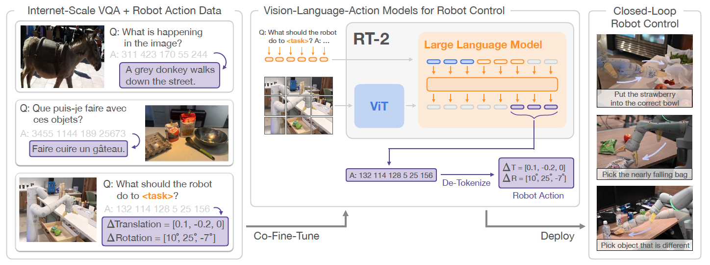
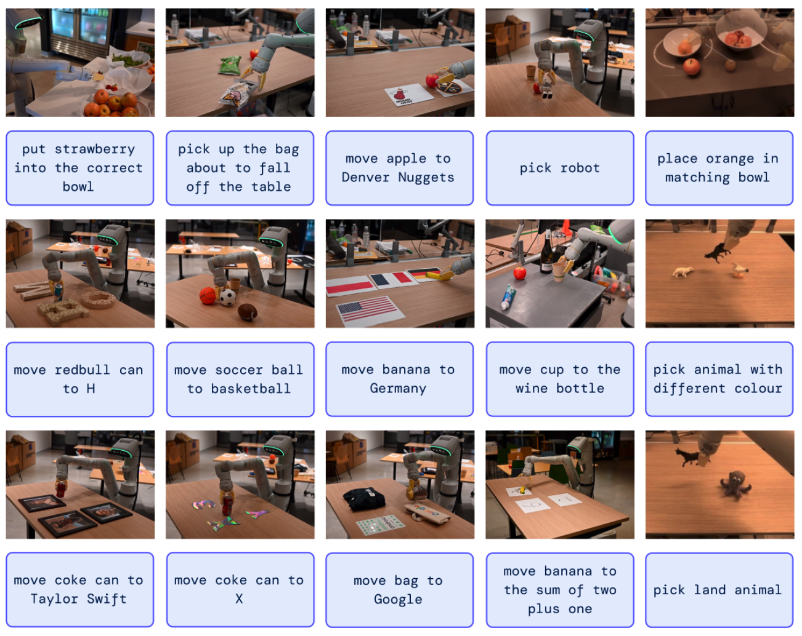
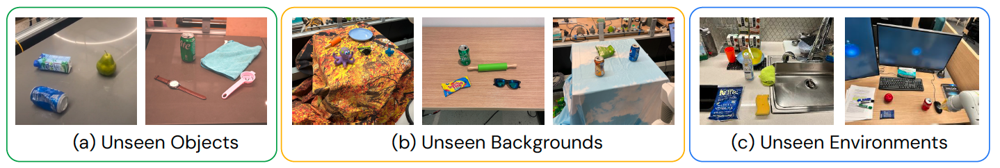
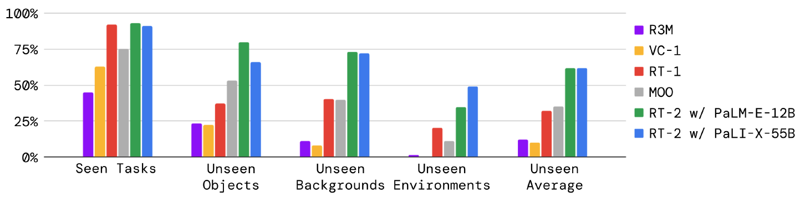
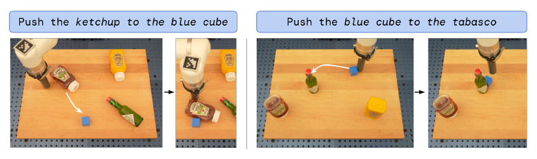
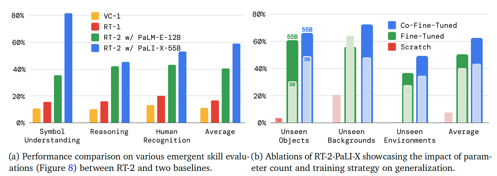
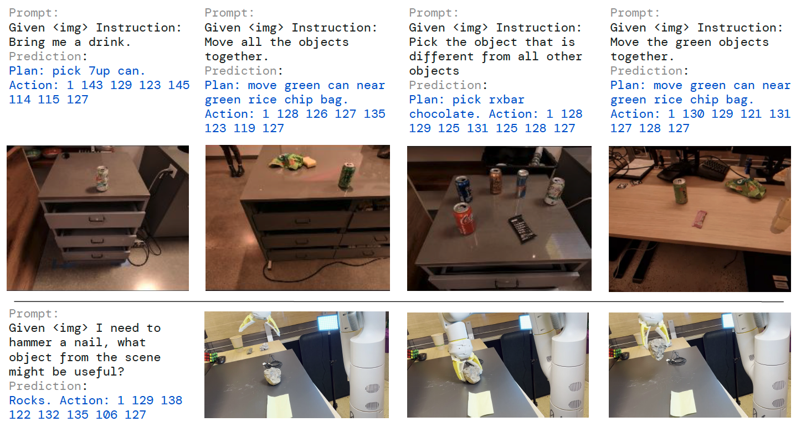
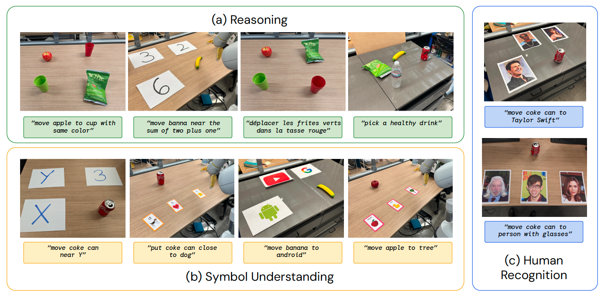
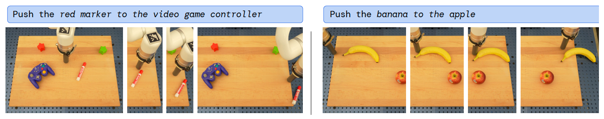
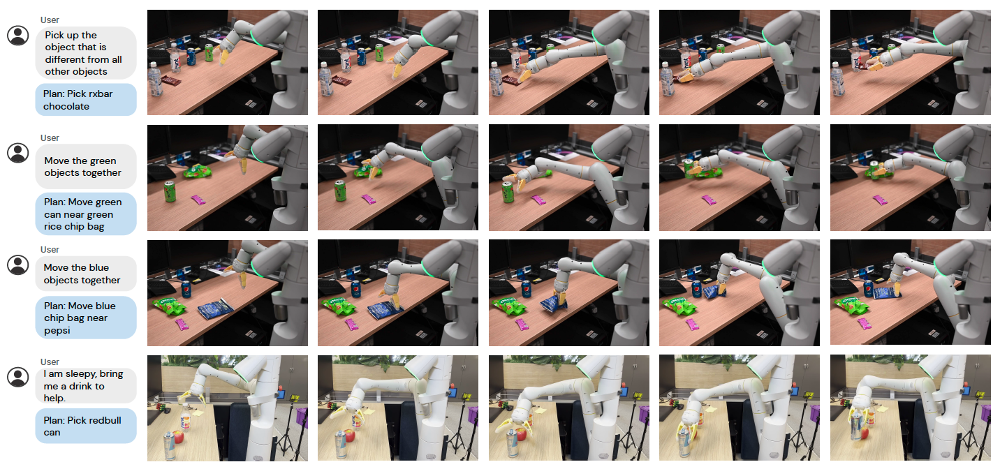

ご提示いただいた指示とルールに従って、ソース論文の最初から第4章の終わりまでを和訳しました。

# RT-2: Vision-Language-Action Models Transfer Web Knowledge to Robotic Control

（RT-2: 視覚-言語-行動モデルによるウェブ知識のロボット制御への転移）

Anthony Brohan, Noah Brown, Justice Carbajal, Yevgen Chebotar, Xi Chen, Krzysztof Choromanski, Tianli Ding, Danny Driess, Avinava Dubey, Chelsea Finn, Pete Florence, Chuyuan Fu, Montse Gonzalez Arenas, Keerthana Gopalakrishnan, Kehang Han, Karol Hausman, Alexander Herzog, Jasmine Hsu, Brian Ichter, Alex Irpan, Nikhil Joshi, Ryan Julian, Dmitry Kalashnikov, Yuheng Kuang, Isabel Leal, Lisa Lee, Tsang-Wei Edward Lee, Sergey Levine, Yao Lu, Henryk Michalewski, Igor Mordatch, Karl Pertsch, Kanishka Rao, Krista Reymann, Michael Ryoo, Grecia Salazar, Pannag Sanketi, Pierre Sermanet, Jaspiar Singh, Anikait Singh, Radu Soricut, Huong Tran, Vincent Vanhoucke, Quan Vuong, Ayzaan Wahid, Stefan Welker, Paul Wohlhart, Jialin Wu, Fei Xia, Ted Xiao, Peng Xu, Sichun Xu, Tianhe Yu, and Brianna Zitkovich (Google DeepMind. 著者はアルファベット順に記載し、貢献については付録Aに記載する。)

## Abstract

インターネット規模のデータで訓練された視覚-言語モデルをエンドツーエンドのロボット制御に直接組み込み、汎化性能を向上させ、創発的な意味的推論を可能にする方法について研究する。私たちの目標は、単一のエンドツーエンドで訓練されたモデルによって、ロボットの観測を行動にマッピングする学習と、ウェブからの言語および視覚-言語データによる大規模な事前学習の恩恵を両方とも享受できるようにすることである。この目的のために、私たちは最先端の視覚-言語モデルを、ロボットの軌跡データと、視覚的質問応答などのインターネット規模の視覚-言語タスクの両方で協調ファインチューニング（co-fine-tune）することを提案する。他のアプローチとは対照的に、この目標を達成するためのシンプルで一般的な手法を提案する：自然言語の応答とロボットの行動の両方を同じ形式に適合させるために、行動をテキストトークンとして表現し、自然言語のトークンと同じ方法でモデルの訓練セットに直接組み込む。私たちはこのようなモデルのカテゴリーを視覚-言語-行動モデル（Vision-Language-Action models: VLA）と呼び、その一例としてRT-2と呼ぶモデルをインスタンス化する。私たちの広範な評価（6,000回の評価試行）により、私たちのアプローチが高いパフォーマンスのロボット方策につながり、RT-2がインターネット規模の訓練からさまざまな創発的能力を獲得できることが示された。これには、未知の物体への汎化の著しい向上、ロボットの訓練データには存在しないコマンド（特定の数字やアイコンの上に物体を置くなど）を解釈する能力、およびユーザーのコマンドに応答して初歩的な推論（最も小さい/大きい物体を拾う、または別の物体に最も近いものを拾うなど）を行う能力が含まれる。さらに、思考の連鎖（chain of thought）推論を組み込むことで、RT-2が多段階の意味的推論を実行できるようになることを示す。たとえば、即席のハンマーとして使用するためにどの物体（石）を拾うべきか、または疲れている人にどの種類の飲み物（エナジードリンク）が最も適しているかを判断するなどである。

## 1. Introduction

広範なウェブ規模のデータセットで事前学習された大容量モデルは、さまざまな下流タスクに対して効果的かつ強力なプラットフォームを提供する：大規模言語モデルは、流暢なテキスト生成 (Anil et al., 2023; Brohan et al., 2022; OpenAI, 2023) だけでなく、創発的な問題解決 (Cobbe et al., 2021; Lewkowycz et al., 2022; Polu et al., 2022) や散文 (Brown et al., 2020; OpenAI, 2023) およびコード (Chen et al., 2021) の創造的な生成を可能にする一方で、視覚-言語モデルはオープン語彙での視覚的認識 (Kirillov et al., 2023; Minderer et al., 2022; Radford et al., 2021) を可能にし、画像内の物体とエージェントの相互作用に関する複雑な推論さえ行うことができる (Alayrac et al., 2022; Chen et al., 2023a,b; Driess et al., 2023; Hao et al., 2022; Huang et al., 2023; Wang et al., 2022)。このような意味的推論、問題解決、および視覚的解釈の能力は、現実世界の環境でさまざまなタスクを実行しなければならない汎用ロボットにとって非常に有用である。 しかしながら、ロボットがそのような能力をどのように獲得すべきかは不明である。

図1 | RT-2の概要：ロボットの行動を別の言語として表現し、テキストトークンに変換してインターネット規模の視覚-言語データセットと一緒に訓練できるようにする。推論中、テキストトークンはロボットの行動に逆トークン化（de-tokenize）され、閉ループ制御を可能にする。これにより、ロボット方策の学習において視覚-言語モデルのバックボーンと事前学習を活用し、その汎化能力、意味的理解、および推論能力の一部をロボット制御に転移することができる。RT-2の実行例はプロジェクトのウェブサイト robotics-transformer2.github.io で実演している。



ブルートフォースによるアプローチは、何百万ものロボットのインタラクション試行を収集することを伴うかもしれないが、最も有能な言語および視覚-言語モデルは、ウェブからの何十億ものトークンや画像で訓練されており (Alayrac et al., 2022; Chen et al., 2023a,b; Huang et al., 2023) 、近い将来にロボットデータでこれに匹敵する量が達成される可能性は低い。 その一方で、そのようなモデルをロボットのタスクに直接適用することも困難である：そのようなモデルは意味論、ラベル、およびテキストのプロンプトについて推論するが、ロボットはデカルト座標のエンドエフェクタのコマンドなど、グラウンディングされた低レベルの行動を必要とするからだ。 言語モデル（LLMs）や視覚-言語モデル（VLMs）をロボット工学に組み込もうとする最近の研究はいくつかあるが (Ahn et al., 2022; Driess et al., 2023; Vemprala et al., 2023) 、それらの手法は一般にロボットの計画の「より高いレベル」の側面にのみ対処しており、コマンドを解釈し、それらを個別のプリミティブ（物体のピッキングや配置など）に解析する状態機械の役割を本質的に果たしている。そして、それらは訓練中にインターネット規模のモデルの豊富な意味的知識から恩恵を受けない別の低レベルのコントローラーによって実行される。 したがって、本論文では次の問いを立てる：大規模な事前学習済みの視覚-言語モデルを低レベルのロボット制御に直接統合し、汎化性能を向上させ、創発的な意味的推論を可能にすることはできるか？

この目的のために、私たちはシンプルでありながら驚くほど効果的なアプローチを探求する：オープン語彙の視覚的質問応答と視覚的対話のために設計された視覚-言語モデルを、他のインターネット規模の視覚-言語タスクを解決するとともに、低レベルのロボット行動を出力するように直接訓練する。 そのようなモデルは通常、自然言語のトークンを生成するように訓練されるが、行動をテキストトークンにトークン化し、ロボットへの指示とカメラの観測がペアになった入力に「応答」して対応する行動を生成する「マルチモーダルな文」 (Driess et al., 2023) を作成することで、ロボットの軌跡に基づいてモデルを訓練することができる。 このようにして、視覚-言語モデルは、指示に従うロボット方策として機能するように直接訓練することができる。 このシンプルなアプローチは、ロボット方策にVLMを組み込むための以前の代替手段 (Shridhar et al., 2022a) や、最初から新しい視覚-言語-行動のアーキテクチャを設計すること (Reed et al., 2022) とは対照的である：代わりに、すでに多大な計算投資が償却された既存の視覚-言語モデルを、新しいパラメーターを一切追加することなく、テキストでエンコードされた行動を出力するように訓練する。 このモデルのカテゴリーを視覚-言語-行動（Vision-Language-Action: VLA）モデルと呼ぶ。 RT-1 (Brohan et al., 2022) で提案されたプロトコルに基づき、同様のデータセットを使用するが、大規模な視覚-言語バックボーンを使用するようにモデルを拡張することで、VLAモデルをインスタンス化する。したがって、私たちのモデルをRT-2（Robotics Transformer 2）と呼ぶ。概要は図1に示す。

このような視覚-言語モデルから派生したロボット方策は、ロボットデータから学習した物理的な動作と、ウェブデータから学習した画像やテキストを解釈する能力を単一のモデルに組み合わせることで、驚くべきさまざまな能力を示すことが観察された。 未知の物体や意味的に多様な指示に対する汎化能力が劇的に向上するという期待される利点に加えて、多くの創発的能力も観察された。 モデルの物理的スキルはロボットデータに見られるスキルの分布に限られているものの、モデルはウェブから得た知識を用いて画像や言語コマンドを解釈することで、それらのスキルを新しい方法で展開する能力を獲得する。ハイライトの例をいくつか図2に示す。 モデルは、ロボットデータにはそのような手がかりが存在しなかったにもかかわらず、ロボットデータから学習したピック・アンド・プレースのスキルを転用して、特定の数字やアイコンなど意味的に示された場所の近くに物体を置くことができる。 モデルはまた、ロボットのデモンストレーションにそのような関係性が提供されていなかったにもかかわらず、物体間の関係性を解釈して、どの物体を拾い、どこに置くかを決定することができる。 さらに、コマンドに思考の連鎖プロンプトを追加すると、モデルは、即席のハンマーとして使用するためにどの物体（石）を拾うべきか、または疲れている人にどの種類の飲み物（エナジードリンク）が最も適しているかを見つけ出すなど、さらに複雑な意味的推論を行うことができる。

私たちの主な貢献はRT-2であり、これはウェブ規模のデータで訓練された大規模な視覚-言語モデルをファインチューニングして導出されたモデル群であり、汎用的で意味を認識するロボット方策として直接機能する。 私たちの実験では、インターネットデータと先行研究 (Brohan et al., 2022) からの指示が付与されたロボットの軌跡を用いて訓練された、最大550億（55B）パラメーターを持つモデルを調査する。 6,000回のロボット評価を通じて、RT-2が物体、シーン、および指示にわたる汎化を大幅に改善し、ウェブ規模の視覚-言語の事前学習から受け継がれたさまざまな創発的能力を示すことを実証する。

## 2. Related Work

**視覚-言語モデル。** 視覚-言語モデル（VLMs） (Gan et al., 2022) にはいくつかのカテゴリーがあり、おそらく最も関連性の高い2つは以下の通りである：(1) 両方のモダリティに共通の埋め込みを学習する表現学習モデル、例えばCLIP (Radford et al., 2021) 、および (2) 視覚と言語を入力として受け取り、自由形式のテキストを提供するように学習する `$ \{vision, text\} \rightarrow \{text\} $` の形式の視覚言語モデル。 両方のカテゴリーは、物体分類 (Radford et al., 2021) 、検出 (Gu et al., 2021) 、およびセグメンテーション (Ghiasi et al., 2021) などの下流アプリケーションに適用される多種多様なタスクに事前学習を提供するために使用されてきた。 本研究では、後者のカテゴリー (Alayrac et al., 2022; Chen et al., 2023a,b; Driess et al., 2023; Hao et al., 2022; Li et al., 2023, 2019; Lu et al., 2019) に焦点を当てる。 これらのモデルは一般的に、画像キャプション、視覚的質問応答（VQA）、および複数のデータセットにおける一般的な言語タスクなど、多くの異なるタスクで同時に訓練される。 先行研究はロボット工学を含む幅広い問題や設定についてVLMを研究しているが、私たちの焦点は、VLMがロボットの行動を予測する能力を付与されることで、VLMの能力をどのようにロボットの閉ループ制御に拡張できるか、それによってVLMにすでに存在する知識を活用して新しいレベルの汎化を可能にする方法にある。

### ロボット学習における汎化

さまざまなシナリオで広く成功できるロボットコントローラーを開発することは、ロボット工学研究の長年の目標である (Kaelbling, 2020; Smith and Coles, 1973)。 ロボットの操作において汎化を可能にするための有望なアプローチは、大規模で多様なデータセットから学習することである (Dasari et al., 2019; Levine et al., 2018; Pinto and Gupta, 2016)。 そうすることで、先行手法は、ロボットが未知の物体のインスタンス (Finn and Levine, 2017; Levine et al., 2018; Mahler et al., 2017; Pinto and Gupta, 2016; Young et al., 2021) 、物体とスキルの新しい組み合わせを伴うタスク (Dasari and Gupta, 2021; Finn et al., 2017; James et al., 2018; Jang et al., 2021; Yu et al., 2018) 、新しいゴールや言語指示 (Jang et al., 2021; Jiang et al., 2022; Liu et al., 2022; Mees et al., 2022; Nair et al., 2022a; Pong et al., 2019) 、新しい意味的物体カテゴリーを伴うタスク (Shridhar et al., 2021; Stone et al., 2023) 、および未知の環境 (Cui et al., 2022; Du et al., 2023a; Hansen et al., 2020) にどのように汎化できるかを示してきた。 これらの以前の多くの研究とは異なり、私たちは、これらすべての軸に沿った未知の条件に汎化できる単一のモデルを開発し研究することを目指している。 私たちのアプローチの重要な要素は、ロボットが見たデータよりもはるかに広範なデータにさらされた事前学習済みモデルを活用することである。

### ロボット操作のための事前学習

事前学習にはロボット学習において長い歴史がある。 ほとんどの研究は、教師ありImageNet分類 (Shah and Kumar, 2021) 、データ拡張 (Kostrikov et al., 2020; Laskin et al., 2020a,b; Pari et al., 2021) 、またはロボット制御に合わせた目的関数 (Karamcheti et al., 2023; Ma et al., 2022; Majumdar et al., 2023b; Nair et al., 2022b; Xiao et al., 2022b) を介して、ロボットのカメラ観測のエンコーダーを初期化するために使用できる、事前学習済みの視覚表現に焦点を当てている。 他の研究では、事前学習済みの言語モデルを、指示エンコーダーとして (Brohan et al., 2022; Hill et al., 2020; Jang et al., 2021; Jiang et al., 2022; Lynch and Sermanet, 2020; Nair et al., 2022a; Shridhar et al., 2022b) 、またはハイレベルな計画のために (Ahn et al., 2022; Driess et al., 2023; Huang et al., 2022; Mu et al., 2023; Singh et al., 2023; Wu et al., 2023) 組み込んでいる。 事前学習済みの視覚モデルや言語モデルを使用するのではなく、私たちは特に事前学習済みの視覚-言語モデル（VLM）の使用を検討する。VLMは世界に関する豊富でグラウンディングされた知識を提供する。 先行研究では、ロボット工学のためのVLMの使用が研究されており (Driess et al., 2023; Du et al., 2023b; Gadre et al., 2022; Karamcheti et al., 2023; Shah et al., 2023; Shridhar et al., 2021; Stone et al., 2023) 、本研究のインスピレーションの一部となっている。 これらの以前のアプローチは、視覚的な状態表現 (Karamcheti et al., 2023) 、物体の特定 (Gadre et al., 2022; Stone et al., 2023) 、ハイレベルな計画 (Driess et al., 2023) 、または監督や成功の検出の提供 (Du et al., 2023b; Ma et al., 2023; Sumers et al., 2023; Xiao et al., 2022a; Zhang et al., 2023) のためにVLMを使用している。 CLIPort (Shridhar et al., 2021) とMOO (Stone et al., 2023) は事前学習済みのVLMをエンドツーエンドの視覚運動操作方策に統合しているが、どちらも方策に大幅な構造を組み込んでおり、その適用可能性を制限している。 特に、私たちの研究は制限された2D行動空間に依存しておらず、キャリブレーションされたカメラを必要としない。 さらに重要な違いは、これらの研究とは異なり、私たちは言語を生成するVLMを活用しており、私たちの定式化の統一された出力空間により、行動のみのモデルレイヤーコンポーネントを導入することなく、言語と行動のタスク間でモデルの重みを完全に共有できることである。

## 3. Vision-Language-Action Models

このセクションでは、私たちのモデルファミリーと、VLMが直接閉ループのロボット制御を実行できるように訓練するための設計上の選択肢について提示する。 まず、私たちのモデルの一般的なアーキテクチャと、視覚-言語タスクに一般的に使用されるモデルからどのように導出できるかを説明する。 次に、ウェブ規模のデータで事前学習された大規模なVLMをファインチューニングして、直接ロボットの行動を出力させ、VLAモデルにするためのレシピと課題について紹介する。 最後に、モデルサイズと推論速度の課題に対処してリアルタイム制御を可能にすることで、これらのモデルをロボットのタスクに実用的にする方法を説明する。

図2 | RT-2は、推論、シンボルの理解、および人間の認識を必要とするさまざまな現実世界の状況に汎化することができる。これらの困難なシナリオについては、セクション4で詳しく調査する。



### 3.1. Pre-Trained Vision-Language Models

本研究で基盤とする視覚-言語モデル (Chen et al., 2023a; Driess et al., 2023) は、1つ以上の画像を入力として受け取り、従来は自然言語テキストを表すトークンのシーケンスを生成する。 そのようなモデルは、画像の構成の推論から、個々の物体や他の物体との関係に関する質問への回答まで、幅広い視覚の解釈と推論タスクを実行できる (Alayrac et al., 2022; Chen et al., 2023a; Driess et al., 2023; Huang et al., 2023)。 このような幅広いタスクを実行するために必要な知識を表現するには、大規模なモデルとウェブ規模のデータセットが必要である。 本研究では、VLAモデルとして機能するように、以前に提案された2つのVLMを適応させる：PaLI-X (Chen et al., 2023a) とPaLM-E (Driess et al., 2023) である。 これらのモデルの視覚-言語-行動バージョンをRT-2-PaLI-XおよびRT-2-PaLM-Eと呼ぶ。 数十億から数百億のパラメーターに及ぶこれらのモデルのインスタンス化を活用する。これら2つのモデルのアーキテクチャの詳細な説明は付録Dで提供する。

### 3.2. Robot-Action Fine-tuning

視覚-言語モデルがロボットを制御できるようにするには、行動を出力するように訓練する必要がある。 私たちはこの問題に直接的なアプローチをとり、行動をモデルの出力におけるトークンとして表現し、言語トークンと同じ方法で扱う。 私たちの行動のエンコーディングは、RT-1モデルのために Brohan et al. (2022) によって提案された離散化に基づいている。 行動空間は、ロボットのエンドエフェクタの6自由度の位置および回転の変位と、ロボットグリッパーの拡張レベル、そして方策によってトリガーされて正常な完了を知らせるべきエピソード終了のための特別な離散コマンドで構成される。 連続次元（離散終了コマンドを除くすべての次元）は、均等に256個のビンに離散化される。 したがって、ロボットの行動は、離散ビンの順序数を使用して8つの整数として表現できる。 これらの離散化された行動を使用して視覚-言語モデルを視覚-言語-行動モデルにファインチューニングするために、各次元の行動ビンをモデルの既存のトークン化のトークンに関連付ける必要がある。 これには、256個のトークンを行動トークンとして機能するように予約する必要がある。 どのトークンを選択するかは、各VLMで使用される特定のトークン化に依存し、これについてはこのセクションの後半で説明する。 VLMのファインチューニングのターゲットを定義するために、各次元の行動トークンをスペース文字で単純に連結することで、行動ベクトルを1つの文字列に変換
する：

"terminate $ \Delta \text{pos}_x $ $ \Delta \text{pos}_y $ $ \Delta \text{pos}_z $ $ \Delta \text{rot}_x $ $ \Delta \text{rot}_y $ $ \Delta \text{rot}_z $ gripper_extension"

このようなターゲットのインスタンス化の可能性の1つは次のようになる：「1 128 91 241 5 101 127」。 実験でファインチューニングする2つのVLM、PaLI-X (Chen et al., 2023a) とPaLM-E (Driess et al., 2023) は、異なるトークン化を使用している。 PaLI-Xの場合、1000までの整数はそれぞれ一意のトークンを持っているため、行動ビンを対応する整数を表すトークンに単に関連付ける。 この便利な数字の表現を提供しないPaLM-Eモデルについては、使用頻度が最も低い256個のトークンを上書きして行動語彙を表現する。 VLMを訓練して既存のトークンを行動トークンで上書きすることは、シンボルチューニング（symbol tuning） (Wei et al., 2023) の一種であり、先行研究でVLMにおいてうまく機能することが示されていることは注目に値する。

上記の行動表現を採用し、ロボットデータをVLMモデルのファインチューニングに適した形に変換する。ここで、入力にはロボットのカメラ画像とテキストのタスク説明が含まれ（標準のVQA形式「Q: what action should the robot take to [task instruction]? A:」を使用）、出力はロボットの行動を表す数字/最も使用頻度の低いトークンの文字列としてフォーマットされる。

#### Co-Fine-Tuning.

実験で示すように、ロボットのパフォーマンスを向上させる訓練レシピの重要な技術的詳細は、ロボットデータのみでの素朴なファインチューニングの代わりに、元のウェブデータとロボットデータを協調ファインチューニング（co-fine-tuning）することである。 協調ファインチューニングにより、方策はロボットの行動だけでなく、ファインチューニング中にウェブ規模のデータからの抽象的な視覚的概念と低レベルのロボット行動の両方にさらされるため、より汎化可能な方策につながることがわかった。 協調ファインチューニング中、ロボットデータセットのサンプリングの重みを増やすことで、各トレーニングバッチにおけるロボットデータとウェブデータの比率のバランスを取る。

#### Output Constraint.

RT-2と標準のVLMの重要な違いの1つは、RT-2が実際のロボットで実行するために有効な行動トークンを出力する必要があることである。 したがって、デコード中にRT-2が有効な行動トークンを出力することを保証するために、モデルがロボットの行動タスクでプロンプトされた場合にのみ有効な行動トークンをサンプリングすることで出力語彙を制約する一方で、標準の視覚-言語タスクでは、モデルは引き続きすべての範囲の自然言語トークンを出力することが許可される。

### 3.3. Real-Time Inference

現代のVLMのサイズは数百億から数千億のパラメーターに達する可能性がある (Chen et al., 2023a; Driess et al., 2023)。 本研究で訓練された最大のモデルは550億（55B）のパラメーターを使用している。 このようなモデルを、標準のデスクトップスタイルのマシンや、リアルタイムのロボット制御に一般的に使用されるロボット搭載のGPUで直接実行することは不可能である。 私たちの知る限り、私たちのモデルは直接の閉ループのロボット制御に使用されたものとしては1桁以上大きく、過去最大のものであり、したがって効率的なリアルタイム推論を可能にする新しいソリューションのセットを必要とする。 RT-2モデルをマルチTPUクラウドサービスにデプロイし、ネットワーク経由でこのサービスにクエリを送信することで、ロボット上で実行できるプロトコルを開発する。 このソリューションにより、適切な制御周波数を達成し、同じクラウドサービスを使用して複数のロボットにサービスを提供することもできる。 私たちが評価した最大のモデルである55BパラメーターのRT-2-PaLI-X-55Bモデルは、1〜3 Hzの周波数で実行できる。 そのモデルの5Bパラメーターからなる小さいバージョンは、約5 Hzの周波数で実行できる。

## 4. Experiments

私たちの実験は、RT-2の現実世界での汎化と創発的能力に焦点を当てており、以下の質問に答えることを目的としている：

1. RT-2は見たことのあるタスクでどのように機能するか、さらに重要なこととして、新しい物体、背景、環境に対してどのように汎化するか？
2. RT-2の創発的能力を観察し、測定することはできるか？
3. パラメーター数やその他の設計上の決定によって汎化能力はどのように変化するか？
4. RT-2は視覚-言語モデルと同様に、思考の連鎖（chain-of-thought）推論の兆候を示すことができるか？

私たちのアプローチといくつかのベースラインを、以下のセクションで説明するさまざまな条件での約6,000回の評価軌跡で評価する。 特に指定がない限り、セクション3.2で説明した行動空間を持つ7自由度（7DoF）のモバイルマニピュレータを使用する。 また、プロジェクトのウェブサイト robotics-transformer2.github.io でRT-2の実行例を実演している。 事前学習済みVLMを活用するRT-2の2つの特定のインスタンスを訓練する：(1) 5Bおよび55BのPaLI-X (Chen et al., 2023a) から構築されたRT-2-PaLI-X、および (2) 12BのPaLM-E (Driess et al., 2023) から構築されたRT-2-PaLM-Eである。

訓練には、Chen et al. (2023a) および Driess et al. (2023) のオリジナルのウェブ規模のデータを活用する。これらは、視覚的質問応答、キャプション生成、および構造化されていない画像とテキストが織り交ぜられた例で構成されている。 これを、13台のロボットを使用してオフィス・キッチンの環境で17ヶ月間にわたって収集された、Brohan et al. (2022) のロボットのデモンストレーションデータと組み合わせる。 各ロボットのデモンストレーション軌跡には、実行されたタスクを説明する自然言語の指示が注釈として付けられている。これは、スキルを説明する動詞（例：「拾う（pick）」、「開ける（open）」、「〜の中に入れる（place into）」）と、操作される物体を説明する1つ以上の名詞（例：「7upの缶（7up can）」、「引き出し（drawer）」、「ナプキン（napkin）」）で構成される（使用されたデータセットの詳細については付録Bを参照）。 すべてのRT-2のトレーニング実行において、元のPaLI-X (Chen et al., 2023a) およびPaLM-E (Driess et al., 2023) の論文からのハイパーパラメーター（学習率のスケジュールや正則化を含む）を採用している。より詳細なトレーニングについては付録Eにある。

#### Baselines.

私たちの手法のさまざまな側面に挑戦する複数の最先端のベースラインと手法を比較する。すべてのベースラインは全く同じロボットデータを使用している。 最先端の方策と比較するために、3500万（35M）パラメーターのトランスフォーマーベースのモデルであるRT-1 (Brohan et al., 2022) を使用する。 最先端の事前学習済み表現と比較するために、VC-1 (Majumdar et al., 2023a) とR3M (Nair et al., 2022b) を使用し、それらの表現を入力として受け取るようにRT-1バックボーンを訓練することで方策を実装する。 VLMを使用するための他のアーキテクチャと比較するために、VLMを使用して意味的マップ用の追加の画像チャネルを作成し、それをRT-1バックボーンに入力するMOO (Stone et al., 2023) を使用する。詳細な情報は付録Cで提供される。

### 4.1. RT-2は既知のタスクにおいてどのような性能を発揮するのか、そしてさらに重要な点として、新しい物体、背景、環境に対してどの程度汎化できるのか？

図3 | 図4および6b、ならびに表4および6での評価に使用された汎化シナリオの例。



図4 | 見たことのある訓練タスク、ならびに新しい物体、新しい背景、新しい環境への汎化を測定する未知の評価にわたる、RT-2の2つのインスタンス化とベースラインの全体的なパフォーマンス。付録の表4に完全な結果の詳細がある。



分布内（in-distribution）のパフォーマンスと汎化能力を評価するために、RT-2-PaLI-XおよびRT-2-PaLM-Eモデルを前のセクションで挙げた4つのベースラインと比較する。 見たことのあるタスク（seen tasks）のカテゴリーには、RT-1 (Brohan et al., 2022) と同じ見たことのある指示のスイートを使用する。これには、この評価における200以上のタスクが含まれる：物体を拾うタスクが36個、物体をノックするタスクが35個、物体をまっすぐに置くタスクが35個、物体を動かすタスクが48個、さまざまな引き出しを開け閉めするタスクが18個、引き出しから物体を取り出したり中に入れたりするタスクが36個である。 ただし、これらの「分布内」の評価であっても、物体の配置や、時間帯やロボットの位置などの要因は変化するため、現実的な環境の変動に対してスキルが汎化することが求められる。

図3は汎化評価の例を示しており、未知のカテゴリー（物体、背景、環境）に分けられ、さらに簡単なケースと難しいケースに分けられている。 未知の物体については、難しいケースには掴みにくい物体やユニークな物体（おもちゃなど）が含まれる。 未知の背景については、難しいケースにはより多様な背景と新しい物体が含まれる。 最後に、未知の環境については、難しいケースはモニターやアクセサリーがあるより視覚的に異なるオフィスのデスク環境に対応し、簡単な環境はキッチンのシンクである。 これらの評価は、多くの多様なシナリオでのピック・アンド・プレースのスキルに主に焦点を当てた280以上のタスクで構成されている。未知のカテゴリーの指示のリストは付録F.2に指定されている。

評価結果は図4と付録の表4に示されている。 見たことのあるタスクでのパフォーマンスは、RT-2モデルとRT-1の間で類似しており、他のベースラインはより低い成功率を達成している。 RT-2モデルとベースラインの間の違いは、さまざまな汎化実験で最も顕著であり、視覚-言語-行動モデルの強みが、インターネット規模の事前学習データからより汎化可能な視覚的および意味的概念を転移することにあることを示唆している。 ここで、平均してRT-2の両方のインスタンス化は同様のパフォーマンスを示し、次の2つのベースラインであるRT-1とMOOに対して約2倍の改善、他のベースラインに対して約6倍の改善をもたらしている。 PaLM-EバージョンのRT-2は、より難しいバージョンの汎化シナリオでより優れたパフォーマンスを発揮する一方、簡単なものではパフォーマンスが低くなり、結果として平均パフォーマンスは同様になるように見える。

#### Open Source Language Table Benchmark.

オープンソースのベースラインと環境を使用した追加の比較ポイントを提供するために、Lynch et al. (2022) のオープンソースのLanguage-Tableシミュレーション環境を活用する。 より小さなPaLI 3Bモデルを、Language-Tableデータセットのドメイン内VQAタスクを含むいくつかの予測タスクで協調ファインチューニングし、得られた方策をシミュレーションで評価する。 行動予測タスクでは、行動を離散化して「X Y」という形式のテキストとしてエンコードする。ここでXとYは{-10, -9, ..., +9, +10}の範囲であり、エンドエフェクタのデルタ2Dデカルト座標のセットポイントを表す。 サイズが縮小されているため、得られたモデルは他のベースラインと同様の速度（5 Hz）で推論を実行できる。 この実験の結果は表1に示されている。 ベースラインと比較して、我々のモデルを使用した場合に大幅なパフォーマンスの向上が見られ、VLMベースの事前学習と、大規模なPaLIモデルの表現力が、他のシナリオ（この場合は異なるロボットを用いたシミュレーション）でも有益であることを示している。 また、図5に質的な現実世界での分布外の行動を示し、この環境ではこれまでに見られなかった新しい押し出しタスクや物体のターゲティングを実演している。 Language Tableの実験に関する詳細は、付録BとDに記載されている。

```markdown
| Model | Language-Table |
| :--- | :--- |
| BC-Zero (Jang et al., 2021) | 72 ± 3 |
| RT-1 (Brohan et al., 2022) | 74 ± 13 |
| LAVA (Lynch et al., 2022) | 77 ± 4 |
| RT-2-PaLI-3B (ours) | 90 ± 10 |
```
表1 | シミュレートされたLanguage-Tableタスクでのパフォーマンス (Lynch and Ser-manet, 2020)。

### 4.2. RT-2の新たな能力を観察・測定することは可能か？

視覚-言語-行動モデルの汎化能力を評価することに加えて、ウェブから知識を転移することによって、そのようなモデルがロボットデータで実証された以上の新しい能力をどの程度可能にできるかを評価することも目的としている。 このような能力を、インターネット規模の事前学習を転移することによって創発（emerge）するという意味で、私たちは創発的（emergent）と呼ぶ。 このような転移によって新しいロボットの動作が可能になるとは期待していないが、ロボットデータにその概念が見られなかった場合でも、関係性や名詞を含む意味的および視覚的概念が効果的に転移されることは期待している。

図5 | Language Table環境における、現実世界での分布外の行動。表1と同じRT-2-PaLI-3Bのモデルチェックポイントを使用している。



#### Qualitative Evaluations.

まず、RT-2-PaLI-Xモデルを使って実験を行い、視覚-言語の概念から転移されたさまざまな創発的能力を決定する。 そのような相互作用のいくつかの例を図2に示す。 探索を通じて、RT-2がシーンの文脈において意味の理解と基本的な推論の観点から新しい能力を受け継いでいることがわかった。 例えば、「イチゴを正しいボウルに入れる」というタスクを達成するには、イチゴやボウルが何であるかだけでなく、シーンの文脈で推論して、イチゴを同種のフルーツと一緒にするべきだという微妙な理解が必要である。 「テーブルから落ちそうになっているバッグを拾う」というタスクでは、RT-2は物理的な理解を実証して、2つのバッグを区別し、不安定に置かれた物体を認識する。 これらのシナリオでテストされたすべての相互作用はロボットデータでは一度も見られたことがなく、これは視覚-言語データからの意味的知識の転移を示している。

#### Quantitative Evaluations.

これらの創発的能力を定量化するために、以前の評価におけるトップ2のベースラインであるRT-1とVC-1を使用し、それらを我々の2つのモデル：RT-2-PaLI-XとRT-2-PaLM-Eと比較する。 この実験の分散を減らすために、A/Bテストのフレームワーク (Fisher, 1936) を使用してすべての手法を評価し、4つのモデルすべてをまったく同じ条件で次々と評価する。
RT-2の創発的能力を、推論と意味的理解の軸をカバーする3つのカテゴリーに分ける（それぞれの例は付録図8に示されている）。 1つ目はシンボルの理解（symbol understanding）と呼ぶもので、RT-2の方策がどのロボットデータにも存在しなかった視覚-言語の事前学習から意味的知識を転移するかどうかを明示的にテストする。 このカテゴリーの指示の例は「リンゴを3に移動させる」や「コーラの缶をハートの上に押し込む」である。 2つ目のカテゴリーは推論（reasoning）と呼び、基礎となるVLMの推論のさまざまな側面を制御タスクに適用する能力を実証する。 これらのタスクには、視覚的推論（「リンゴを同じ色のカップに移動させる」）、数学（「Xを2足す1の合計の近くに移動させる」）、多言語の理解（「mueve la manzana al vaso verde」）が必要である。 最後のカテゴリーを人間認識（human recognition）タスクと呼び、これには「コーラの缶を眼鏡をかけた人に移動させる」などのタスクが含まれ、人間を中心とした理解と認識を実証する。 この評価に使用された指示の完全なリストは付録F.2に指定されている。

この実験の結果を図6aに示し、すべての数値結果を付録H.2に示す。 私たちのVLAモデルはすべてのカテゴリーにわたってベースラインを大幅に上回り、最良のRT-2-PaLI-Xモデルは次の最良のベースライン（RT-1）と比較して平均成功率が3倍以上になっていることが観察された。 また、より大規模なPaLI-Xベースのモデルは平均してより優れたシンボル理解、推論、人物認識のパフォーマンスをもたらすが、より小さなPaLM-Eベースのモデルは数学的推論を伴うタスクで優位性を持っていることにも気付く。 この興味深い結果は、PaLM-Eで使用されている事前学習の混合が異なるためであり、それがほとんど視覚的に事前学習されたPaLI-Xよりも数学の計算に長けたモデルになっていることに起因すると考えている。

図6 | (6a) 創発的スキルおよび (6b) サイズとトレーニングのアブレーションにわたるRT-2の定量的パフォーマンス。付録の表5および6に完全な数値結果の詳細がある。
(a) RT-2と2つのベースライン間のさまざまな創発的スキルの評価におけるパフォーマンス比較（図8）。
(b) RT-2-PaLI-Xのアブレーション。パラメーター数とトレーニング戦略が汎化に与える影響を示している。



### 4.3. 一般化は、パラメータの数やその他の設計上の決定事項によってどのように変化するか？

この比較では、モデルサイズに関する柔軟性があるため、RT-2-PaLI-Xモデルを使用する（PaLM-Eの性質上、RT-2-PaLM-EはPaLMおよびViTモデルの特定のサイズにのみ制限されている）。 具体的には、5Bと55Bの2つの異なるモデルサイズと、3つの異なるトレーニングルーチンを比較する：VLMの事前学習による重みを一切使用せずに、モデルをゼロから訓練すること（training a model from scratch）；ロボットの行動データのみを使用して事前学習済みモデルをファインチューニングすること（fine-tuning）；そして、元のVLMのトレーニングデータとロボットデータの両方をVLMのファインチューニングに使用する、本研究の主要な手法である協調ファインチューニング（co-fine-tuning）である。 これらのモデルの汎化の側面に最も興味があるため、この一連の実験から見たことのあるタスクの評価を省略する。

アブレーションの結果は図6bと付録の表6に提示されている。 第一に、非常に大きなモデルをゼロから訓練すると、5Bモデルであっても非常に悪いパフォーマンスになることが観察された。 この結果を考慮して、ゼロから訓練する場合は、さらに大きな55BのPaLI-Xモデルの評価をスキップすることにした。 第二に、モデルを協調ファインチューニングすると（サイズに関係なく）、ロボットデータのみで単純にファインチューニングするよりも汎化パフォーマンスが向上することがわかった。 これは、トレーニングのファインチューニング部分の周辺に元のデータを保持することで、VLMのトレーニング中に学習した以前の概念をモデルが忘れないようにすることができるためだと考えている。 最後に、少しも驚くことではないが、モデルのサイズを大きくすると汎化パフォーマンスが向上することがわかった。

### 4.4. RT-2は、視覚言語モデルと同様に、連鎖的推論の兆候を示すことができるか？

LLMにおける思考の連鎖（chain-of-thought）プロンプト法 (Wei et al., 2022) に触発されて、PaLM-Eを使用したRT-2のバリアントを数百の勾配ステップだけでファインチューニングし、言語と行動を共同で利用する能力を高め、より洗練された推論行動を引き出すことを期待した。 データを拡張して追加の「計画（Plan）」ステップを含める。これは、ロボットが実行しようとしている行動の目的をまず自然言語で記述し、その後に実際の行動トークンを続けるものである。例：「Instruction: I’m hungry. Plan: pick rxbar chocolate. Action: 1 128 124 136 121 158 111 255.」 このデータ拡張スキームは、VQAデータセット（視覚的推論）と操作データセット（行動の生成）の間の架け橋として機能する。

思考の連鎖推論を持つRT-2は、最初に行動を自然言語で計画する場が与えられているため、より洗練されたコマンドに答えることができることを定性的に観察した。 これは、プランナーとしてLLMやVLMを使用すること (Ahn et al., 2022; Driess et al., 2023) が、単一のVLAモデルにおいて低レベルの方策と組み合わせることができるという初期の証拠を提供する有望な方向性である。 思考の連鎖推論を伴うRT-2のロールアウトは図7および付録Iに示されている。

図7 | 思考の連鎖推論を伴うRT-2のロールアウト。RT-2は計画と行動の両方を生成する。



## 5. Limitations

RT-2は有望な汎化特性を示しているが、このアプローチには複数の限界がある。第一に、VLMを介したウェブ規模の事前学習を含めることで、意味的および視覚的概念に関する汎化が向上することを示したが、ロボットはこの追加の経験を含めることによって新しい動作を実行する能力を獲得するわけではない。モデルの物理的スキルは、依然としてロボットのデータに見られるスキルの分布に限られている（付録Gを参照）が、それらのスキルを新しい方法で展開することを学習する。これは、データセットがスキルの軸に沿って十分に多様化されていない結果であると考えている。将来の刺激的な研究の方向性は、人間の動画などの新しいデータ収集パラダイムを通じて、新しいスキルをどのように獲得できるかを研究することである。

第二に、大規模なVLAモデルをリアルタイムで実行できることを示したが、これらのモデルの計算コストは高く、これらの手法が高周波制御を要求する設定に適用されるにつれて、リアルタイム推論が主要なボトルネックになる可能性がある。将来の刺激的な研究の方向性は、そのようなモデルがより高いレートで、またはより低コストのハードウェアで実行できるようにする量子化および蒸留技術を探求することである。これはまた、RT-2を作成するために使用できる一般に利用可能なVLMモデルの数が少ないという、現在のもう1つの限界にも関連している。より多くのオープンソースモデルが利用可能になり（例：https://llava-vl.github.io/ ）、独自のモデルがVLAモデルを構築するための十分な要件であるファインチューニングAPIを公開することを期待している。

## 6. Conclusions

本論文では、視覚-言語モデル（VLM）の事前学習とロボットのデータを組み合わせることで、視覚-言語-行動（VLA）モデルをどのように訓練できるかを説明した。次に、PaLM-EとPaLI-Xに基づくVLAの2つのインスタンス化を提示し、それらをRT-2-PaLM-EおよびRT-2-PaLI-Xと呼んだ。これらのモデルは、テキストトークンとして表現されるロボットの行動を出力するように、ロボットの軌跡データを用いて協調ファインチューニングされる。私たちのアプローチが非常に高いパフォーマンスのロボット方策をもたらし、さらに重要なことに、ウェブ規模の視覚-言語の事前学習から受け継いだ、汎化性能の著しい向上と創発的能力につながることを示した。私たちは、このシンプルで一般的なアプローチが、より優れた視覚-言語モデルからロボット工学が直接恩恵を受けるという期待を示しており、これがロボット学習の分野を、他の分野の進歩とともにさらに改善するための戦略的な立場に置くと信じている。

## Acknowledgments

フィードバックと貢献に対して、Fred Alcober, Jodi Lynn Andres, Carolina Parada, Joseph Dabis, Rochelle Dela Cruz, Jessica Gomez, Gavin Gonzalez, John Guilyard, Tomas Jackson, Jie Tan, Scott Lehrer, Dee M, Utsav Malla, Sarah Nguyen, Jane Park, Emily Perez, Elio Prado, Jornell Quiambao, Clayton Tan, Jodexty Therlonge, Eleanor Tomlinson, Wenxuan Zhou、およびより広範なGoogle DeepMindチームに感謝の意を表したい。

## References

[^1]: M. Ahn, A. Brohan, N. Brown, Y. Chebotar, O. Cortes, B. David, C. Finn, K. Gopalakrishnan, K. Hausman, A. Herzog, et al. Do as I can, not as I say: Grounding language in robotic affordances. arXiv preprint arXiv:2204.01691, 2022.
[^2]: J.-B. Alayrac, J. Donahue, P. Luc, A. Miech, I. Barr, Y. Hasson, K. Lenc, A. Mensch, K. Millican, M. Reynolds, et al. Flamingo: a visual language model for few-shot learning. arXiv preprint arXiv:2204.14198, 2022.
[^3]: R. Anil, A. M. Dai, O. Firat, M. Johnson, D. Lepikhin, A. Passos, S. Shakeri, E. Taropa, P. Bailey, Z. Chen, et al. Palm 2 technical report. arXiv preprint arXiv:2305.10403, 2023.
[^4]: A. Brohan, N. Brown, J. Carbajal, Y. Chebotar, J. Dabis, C. Finn, K. Gopalakrishnan, K. Hausman, A. Herzog, J. Hsu, et al. Rt-1: Robotics transformer for real-world control at scale. arXiv preprint arXiv:2212.06817, 2022.
[^5]: T. Brown, B. Mann, N. Ryder, M. Subbiah, J. D. Kaplan, P. Dhariwal, A. Neelakantan, P. Shyam, G. Sastry, A. Askell, et al. Language models are few-shot learners. Advances in neural information processing systems, 33:1877–1901, 2020.
[^6]: D. Cer, Y. Yang, S. Kong, N. Hua, N. Limtiaco, R. S. John, N. Constant, M. Guajardo-Cespedes, S. Yuan, C. Tar, Y. Sung, B. Strope, and R. Kurzweil. Universal sentence encoder. CoRR, abs/1803.11175, 2018. URL http://arxiv.org/abs/1803.11175.
[^7]: M. Chen, J. Tworek, H. Jun, Q. Yuan, H. P. d. O. Pinto, J. Kaplan, H. Edwards, Y. Burda, N. Joseph, G. Brockman, et al. Evaluating large language models trained on code. arXiv preprint arXiv:2107.03374, 2021.
[^8]: X. Chen, J. Djolonga, P. Padlewski, B. Mustafa, S. Changpinyo, J. Wu, C. R. Ruiz, S. Goodman, X. Wang, Y. Tay, S. Shakeri, M. Dehghani, D. Salz, M. Lucic, M. Tschannen, A. Nagrani, H. Hu, M. Joshi, B. Pang, C. Montgomery, P. Pietrzyk, M. Ritter, A. Piergiovanni, M. Minderer, F. Pavetic, A. Waters, G. Li, I. Alabdulmohsin, L. Beyer, J. Amelot, K. Lee, A. P. Steiner, Y. Li, D. Keysers, A. Arnab, Y. Xu, K. Rong, A. Kolesnikov, M. Seyedhosseini, A. Angelova, X. Zhai, N. Houlsby, and R. Soricut. Pali-x: On scaling up a multilingual vision and language model, 2023a.
[^9]: X. Chen, X. Wang, S. Changpinyo, A. Piergiovanni, P. Padlewski, D. Salz, S. Goodman, A. Grycner, B. Mustafa, L. Beyer, A. Kolesnikov, J. Puigcerver, N. Ding, K. Rong, H. Akbari, G. Mishra, L. Xue, A. Thapliyal, J. Bradbury, W. Kuo, M. Seyedhosseini, C. Jia, B. K. Ayan, C. Riquelme, A. Steiner, A. Angelova, X. Zhai, N. Houlsby, and R. Soricut. Pali: A jointly-scaled multilingual language-image model, 2023b.
[^10]: K. Cobbe, V. Kosaraju, M. Bavarian, M. Chen, H. Jun, L. Kaiser, M. Plappert, J. Tworek, J. Hilton, R. Nakano, et al. Training verifiers to solve math word problems. arXiv preprint arXiv:2110.14168, 2021.
[^11]: Z. J. Cui, Y. Wang, N. Muhammad, L. Pinto, et al. From play to policy: Conditional behavior generation from uncurated robot data. arXiv preprint arXiv:2210.10047, 2022.
[^12]: S. Dasari and A. Gupta. Transformers for one-shot visual imitation. In Conference on Robot Learning, pages 2071–2084. PMLR, 2021.
[^13]: S. Dasari, F. Ebert, S. Tian, S. Nair, B. Bucher, K. Schmeckpeper, S. Singh, S. Levine, and C. Finn. Robonet: Large-scale multi-robot learning. In Conference on Robot Learning, 2019.
[^14]: M. Dehghani, J. Djolonga, B. Mustafa, P. Padlewski, J. Heek, J. Gilmer, A. Steiner, M. Caron, R. Geirhos, I. Alabdulmohsin, R. Jenatton, L. Beyer, M. Tschannen, A. Arnab, X. Wang, C. Riquelme, M. Minderer, J. Puigcerver, U. Evci, M. Kumar, S. van Steenkiste, G. F. Elsayed, A. Mahendran, F. Yu, A. Oliver, F. Huot, J. Bastings, M. P. Collier, A. Gritsenko, V. Birodkar, C. Vasconcelos, Y. Tay, T. Mensink, A. Kolesnikov, F. Pavetić, D. Tran, T. Kipf, M. Lučić, X. Zhai, D. Keysers, J. Harmsen, and N. Houlsby. Scaling vision transformers to 22 billion parameters, 2023.
[^15]: D. Driess, F. Xia, M. S. Sajjadi, C. Lynch, A. Chowdhery, B. Ichter, A. Wahid, J. Tompson, Q. Vuong, T. Yu, et al. Palm-e: An embodied multimodal language model. arXiv preprint arXiv:2303.03378, 2023.
[^16]: M. Du, S. Nair, D. Sadigh, and C. Finn. Behavior retrieval: Few-shot imitation learning by querying unlabeled datasets. arXiv preprint arXiv:2304.08742, 2023a.
[^17]: Y. Du, K. Konyushkova, M. Denil, A. Raju, J. Landon, F. Hill, N. de Freitas, and S. Cabi. Vision-language models as success detectors. arXiv preprint arXiv:2303.07280, 2023b.
[^18]: C. Finn and S. Levine. Deep visual foresight for planning robot motion. In 2017 IEEE International Conference on Robotics and Automation (ICRA), pages 2786–2793. IEEE, 2017.
[^19]: C. Finn, T. Yu, T. Zhang, P. Abbeel, and S. Levine. One-shot visual imitation learning via meta-learning. In Conference on robot learning, pages 357–368. PMLR, 2017.
[^20]: R. A. Fisher. Design of experiments. British Medical Journal, 1(3923):554, 1936.
[^21]: S. Y. Gadre, M. Wortsman, G. Ilharco, L. Schmidt, and S. Song. Clip on wheels: Zero-shot object navigation as object localization and exploration. arXiv preprint arXiv:2203.10421, 2022.
[^22]: Z. Gan, L. Li, C. Li, L. Wang, Z. Liu, J. Gao, et al. Vision-language pre-training: Basics, recent advances, and future trends. Foundations and Trends® in Computer Graphics and Vision, 14(3–4):163–352, 2022.
[^23]: G. Ghiasi, X. Gu, Y. Cui, and T.-Y. Lin. Open-vocabulary image segmentation. arXiv preprint arXiv:2112.12143, 2021.
[^24]: K. Grauman, A. Westbury, E. Byrne, Z. Chavis, A. Furnari, R. Girdhar, J. Hamburger, H. Jiang, M. Liu, X. Liu, M. Martin, T. Nagarajan, I. Radosavovic, S. K. Ramakrishnan, F. Ryan, J. Sharma, M. Wray, M. Xu, E. Z. Xu, C. Zhao, S. Bansal, D. Batra, V. Cartillier, S. Crane, T. Do, M. Doulaty, A. Erapalli, C. Feichtenhofer, A. Fragomeni, Q. Fu, A. Gebreselasie, C. Gonzalez, J. Hillis, X. Huang, Y. Huang, W. Jia, W. Khoo, J. Kolar, S. Kottur, A. Kumar, F. Landini, C. Li, Y. Li, Z. Li, K. Mangalam, R. Modhugu, J. Munro, T. Murrell, T. Nishiyasu, W. Price, P. R. Puentes, M. Ramazanova, L. Sari, K. Somasundaram, A. Southerland, Y. Sugano, R. Tao, M. Vo, Y. Wang, X. Wu, T. Yagi, Z. Zhao, Y. Zhu, P. Arbelaez, D. Crandall, D. Damen, G. M. Farinella, C. Fuegen, B. Ghanem, V. K. Ithapu, C. V. Jawahar, H. Joo, K. Kitani, H. Li, R. Newcombe, A. Oliva, H. S. Park, J. M. Rehg, Y. Sato, J. Shi, M. Z. Shou, A. Torralba, L. Torresani, M. Yan, and J. Malik. Ego4d: Around the world in 3,000 hours of egocentric video, 2022.
[^25]: X. Gu, T.-Y. Lin, W. Kuo, and Y. Cui. Open-vocabulary object detection via vision and language knowledge distillation. arXiv preprint arXiv:2104.13921, 2021.
[^26]: N. Hansen, R. Jangir, Y. Sun, G. Alenyà, P. Abbeel, A. A. Efros, L. Pinto, and X. Wang. Self-supervised policy adaptation during deployment. arXiv preprint arXiv:2007.04309, 2020.
[^27]: Y. Hao, H. Song, L. Dong, S. Huang, Z. Chi, W. Wang, S. Ma, and F. Wei. Language models are general-purpose interfaces. arXiv preprint arXiv:2206.06336, 2022.
[^28]: F. Hill, S. Mokra, N. Wong, and T. Harley. Human instruction-following with deep reinforcement learning via transfer-learning from text. arXiv preprint arXiv:2005.09382, 2020.
[^29]: S. Huang, L. Dong, W. Wang, Y. Hao, S. Singhal, S. Ma, T. Lv, L. Cui, O. K. Mohammed, Q. Liu, et al. Language is not all you need: Aligning perception with language models. arXiv preprint arXiv:2302.14045, 2023.
[^30]: W. Huang, P. Abbeel, D. Pathak, and I. Mordatch. Language models as zero-shot planners: Extracting actionable knowledge for embodied agents. In International Conference on Machine Learning, pages 9118–9147. PMLR, 2022.
[^31]: S. James, M. Bloesch, and A. J. Davison. Task-embedded control networks for few-shot imitation learning. In Conference on robot learning, pages 783–795. PMLR, 2018.
[^32]: E. Jang, A. Irpan, M. Khansari, D. Kappler, F. Ebert, C. Lynch, S. Levine, and C. Finn. Bc-z: Zero-shot task generalization with robotic imitation learning. In Conference on Robot Learning, pages 991–1002. PMLR, 2021.
[^33]: Y. Jiang, A. Gupta, Z. Zhang, G. Wang, Y. Dou, Y. Chen, L. Fei-Fei, A. Anandkumar, Y. Zhu, and L. Fan. Vima: General robot manipulation with multimodal prompts. arXiv preprint arXiv:2210.03094, 2022.
[^34]: L. P. Kaelbling. The foundation of efficient robot learning. Science, 369(6506):915–916, 2020.
[^35]: S. Karamcheti, S. Nair, A. S. Chen, T. Kollar, C. Finn, D. Sadigh, and P. Liang. Language-driven representation learning for robotics. arXiv preprint arXiv:2302.12766, 2023.
[^36]: A. Kirillov, E. Mintun, N. Ravi, H. Mao, C. Rolland, L. Gustafson, T. Xiao, S. Whitehead, A. C. Berg, W.-Y. Lo, et al. Segment anything. arXiv preprint arXiv:2304.02643, 2023.
[^37]: I. Kostrikov, D. Yarats, and R. Fergus. Image augmentation is all you need: Regularizing deep reinforcement learning from pixels. arXiv preprint arXiv:2004.13649, 2020.
[^38]: M. Laskin, K. Lee, A. Stooke, L. Pinto, P. Abbeel, and A. Srinivas. Reinforcement learning with augmented data. Advances in neural information processing systems, 33:19884–19895, 2020a.
[^39]: M. Laskin, A. Srinivas, and P. Abbeel. Curl: Contrastive unsupervised representations for reinforcement learning. In International Conference on Machine Learning, pages 5639–5650. PMLR, 2020b.
[^40]: S. Levine, P. Pastor, A. Krizhevsky, J. Ibarz, and D. Quillen. Learning hand-eye coordination for robotic grasping with deep learning and large-scale data collection. The International journal of robotics research, 37(4-5):421–436, 2018.
[^41]: A. Lewkowycz, A. Andreassen, D. Dohan, E. Dyer, H. Michalewski, V. Ramasesh, A. Slone, C. Anil, I. Schlag, T. Gutman-Solo, et al. Solving quantitative reasoning problems with language models. arXiv preprint arXiv:2206.14858, 2022.
[^42]: J. Li, D. Li, S. Savarese, and S. Hoi. Blip-2: Bootstrapping language-image pre-training with frozen image encoders and large language models. arXiv preprint arXiv:2301.12597, 2023.
[^43]: L. H. Li, M. Yatskar, D. Yin, C.-J. Hsieh, and K.-W. Chang. Visualbert: A simple and performant baseline for vision and language. arXiv preprint arXiv:1908.03557, 2019.
[^44]: H. Liu, L. Lee, K. Lee, and P. Abbeel. Instruction-following agents with jointly pre-trained vision-language models. arXiv preprint arXiv:2210.13431, 2022.
[^45]: J. Lu, D. Batra, D. Parikh, and S. Lee. Vilbert: Pretraining task-agnostic visiolinguistic representations for vision-and-language tasks. Advances in neural information processing systems, 32, 2019.
[^46]: C. Lynch and P. Sermanet. Language conditioned imitation learning over unstructured data. arXiv preprint arXiv:2005.07648, 2020.
[^47]: C. Lynch, A. Wahid, J. Tompson, T. Ding, J. Betker, R. Baruch, T. Armstrong, and P. Florence. Interactive language: Talking to robots in real time. arXiv preprint arXiv:2210.06407, 2022.
[^48]: Y. J. Ma, S. Sodhani, D. Jayaraman, O. Bastani, V. Kumar, and A. Zhang. Vip: Towards universal visual reward and representation via value-implicit pre-training. arXiv preprint arXiv:2210.00030, 2022.
[^49]: Y. J. Ma, W. Liang, V. Som, V. Kumar, A. Zhang, O. Bastani, and D. Jayaraman. Liv: Language-image representations and rewards for robotic control. arXiv preprint arXiv:2306.00958, 2023.
[^50]: J. Mahler, J. Liang, S. Niyaz, M. Laskey, R. Doan, X. Liu, J. A. Ojea, and K. Goldberg. Dex-net 2.0: Deep learning to plan robust grasps with synthetic point clouds and analytic grasp metrics. arXiv preprint arXiv:1703.09312, 2017.
[^51]: A. Majumdar, K. Yadav, S. Arnaud, Y. J. Ma, C. Chen, S. Silwal, A. Jain, V.-P. Berges, P. Abbeel, J. Malik, et al. Where are we in the search for an artificial visual cortex for embodied intelligence? arXiv preprint arXiv:2303.18240, 2023a.
[^52]: A. Majumdar, K. Yadav, S. Arnaud, Y. J. Ma, C. Chen, S. Silwal, A. Jain, V.-P. Berges, P. Abbeel, J. Malik, et al. Where are we in the search for an artificial visual cortex for embodied intelligence? arXiv preprint arXiv:2303.18240, 2023b.
[^53]: O. Mees, L. Hermann, and W. Burgard. What matters in language conditioned robotic imitation learning over unstructured data. IEEE Robotics and Automation Letters, 7(4):11205–11212, 2022.
[^54]: M. Minderer, A. Gritsenko, A. Stone, M. Neumann, D. Weissenborn, A. Dosovitskiy, A. Mahendran, A. Arnab, M. Dehghani, Z. Shen, et al. Simple open-vocabulary object detection with vision transformers. arXiv preprint arXiv:2205.06230, 2022.
[^55]: Y. Mu, Q. Zhang, M. Hu, W. Wang, M. Ding, J. Jin, B. Wang, J. Dai, Y. Qiao, and P. Luo. Embodiedgpt: Vision-language pre-training via embodied chain of thought. arXiv preprint arXiv:2305.15021, 2023.
[^56]: S. Nair, E. Mitchell, K. Chen, S. Savarese, C. Finn, et al. Learning language-conditioned robot behavior from offline data and crowd-sourced annotation. In Conference on Robot Learning, pages 1303–1315. PMLR, 2022a.
[^57]: S. Nair, A. Rajeswaran, V. Kumar, C. Finn, and A. Gupta. R3m: A universal visual representation for robot manipulation. arXiv preprint arXiv:2203.12601, 2022b.
[^58]: OpenAI. Gpt-4 technical report, 2023.
[^59]: J. Pari, N. M. Shafiullah, S. P. Arunachalam, and L. Pinto. The surprising effectiveness of representation learning for visual imitation. arXiv preprint arXiv:2112.01511, 2021.
[^60]: L. Pinto and A. Gupta. Supersizing self-supervision: Learning to grasp from 50k tries and 700 robot hours. In 2016 IEEE international conference on robotics and automation (ICRA), pages 3406–3413. IEEE, 2016.
[^61]: S. Polu, J. M. Han, K. Zheng, M. Baksys, I. Babuschkin, and I. Sutskever. Formal mathematics statement curriculum learning. arXiv preprint arXiv:2202.01344, 2022.
[^62]: V. H. Pong, M. Dalal, S. Lin, A. Nair, S. Bahl, and S. Levine. Skew-fit: State-covering self-supervised reinforcement learning. arXiv preprint arXiv:1903.03698, 2019.
[^63]: A. Radford, J. W. Kim, C. Hallacy, A. Ramesh, G. Goh, S. Agarwal, G. Sastry, A. Askell, P. Mishkin, J. Clark, et al. Learning transferable visual models from natural language supervision. In Interna-tional Conference on Machine Learning, pages 8748–8763. PMLR, 2021.
[^64]: S. Reed, K. Zolna, E. Parisotto, S. G. Colmenarejo, A. Novikov, G. Barth-Maron, M. Gimenez, Y. Sulsky, J. Kay, J. T. Springenberg, et al. A generalist agent. arXiv preprint arXiv:2205.06175, 2022.
[^65]: M. Ryoo, A. Piergiovanni, A. Arnab, M. Dehghani, and A. Angelova. Tokenlearner: Adaptive space-time tokenization for videos. Advances in Neural Information Processing Systems, 34:12786–12797, 2021.
[^66]: D. Shah, B. Osiński, b. ichter, and S. Levine. Lm-nav: Robotic navigation with large pre-trained models of language, vision, and action. In K. Liu, D. Kulic, and J. Ichnowski, editors, Proceedings of The 6th Conference on Robot Learning, volume 205 of Proceedings of Machine Learning Research, pages 492– 504. PMLR, 14–18 Dec 2023. URL https://proceedings.mlr.press/v205/shah23b.html.
[^67]: R. Shah and V. Kumar. Rrl: Resnet as representation for reinforcement learning. arXiv preprint arXiv:2107.03380, 2021.
[^68]: M. Shridhar, L. Manuelli, and D. Fox. Cliport: What and where pathways for robotic manipulation. In Proceedings of the 5th Conference on Robot Learning (CoRL), 2021.
[^69]: M. Shridhar, L. Manuelli, and D. Fox. Cliport: What and where pathways for robotic manipulation. In Conference on Robot Learning, pages 894–906. PMLR, 2022a.
[^70]: M. Shridhar, L. Manuelli, and D. Fox. Perceiver-actor: A multi-task transformer for robotic manipula-tion. arXiv preprint arXiv:2209.05451, 2022b.
[^71]: I. Singh, V. Blukis, A. Mousavian, A. Goyal, D. Xu, J. Tremblay, D. Fox, J. Thomason, and A. Garg. Progprompt: Generating situated robot task plans using large language models. In ICRA, 2023.
[^72]: M. H. Smith and L. S. Coles. Design of a low cost, general purpose robot. In IJCAI, pages 324–336, 1973.
[^73]: A. Stone, T. Xiao, Y. Lu, K. Gopalakrishnan, K.-H. Lee, Q. Vuong, P. Wohlhart, B. Zitkovich, F. Xia, C. Finn, et al. Open-world object manipulation using pre-trained vision-language models. arXiv preprint arXiv:2303.00905, 2023.
[^74]: T. Sumers, K. Marino, A. Ahuja, R. Fergus, and I. Dasgupta. Distilling internet-scale vision-language models into embodied agents. arXiv preprint arXiv:2301.12507, 2023.
[^75]: Y. Tay, M. Dehghani, V. Q. Tran, X. Garcia, J. Wei, X. Wang, H. W. Chung, S. Shakeri, D. Bahri, T. Schuster, H. S. Zheng, D. Zhou, N. Houlsby, and D. Metzler. Ul2: Unifying language learning paradigms, 2023.
[^76]: S. Vemprala, R. Bonatti, A. Bucker, and A. Kapoor. Chatgpt for robotics: Design principles and model abilities. Microsoft Auton. Syst. Robot. Res, 2:20, 2023.
[^77]: J. Wang, Z. Yang, X. Hu, L. Li, K. Lin, Z. Gan, Z. Liu, C. Liu, and L. Wang. Git: A generative image-to-text transformer for vision and language. arXiv preprint arXiv:2205.14100, 2022.
[^78]: J. Wei, X. Wang, D. Schuurmans, M. Bosma, E. Chi, Q. Le, and D. Zhou. Chain of thought prompting elicits reasoning in large language models. arXiv preprint arXiv:2201.11903, 2022.
[^79]: J. Wei, L. Hou, A. Lampinen, X. Chen, D. Huang, Y. Tay, X. Chen, Y. Lu, D. Zhou, T. Ma, and Q. V. Le. Symbol tuning improves in-context learning in language models, 2023.
[^80]: J. Wu, R. Antonova, A. Kan, M. Lepert, A. Zeng, S. Song, J. Bohg, S. Rusinkiewicz, and T. Funkhouser. Tidybot: Personalized robot assistance with large languagemodels. arXiv preprint arXiv:2305.05658, 2023.
[^81]: T. Xiao, H. Chan, P. Sermanet, A. Wahid, A. Brohan, K. Hausman, S. Levine, and J. Tompson. Robotic skill acquisition via instruction augmentation with vision-language models. arXiv preprint arXiv:2211.11736, 2022a.
[^82]: T. Xiao, I. Radosavovic, T. Darrell, and J. Malik. Masked visual pre-training for motor control. arXiv preprint arXiv:2203.06173, 2022b.
[^83]: S. Young, D. Gandhi, S. Tulsiani, A. Gupta, P. Abbeel, and L. Pinto. Visual imitation made easy. In Conference on Robot Learning, pages 1992–2005. PMLR, 2021.
[^84]: K.-T. Yu, M. Bauza, N. Fazeli, and A. Rodriguez. More than a million ways to be pushed. a high-fidelity experimental dataset of planar pushing. In 2016 IEEE/RSJ international conference on intelligent robots and systems (IROS), pages 30–37. IEEE, 2016.
[^85]: T. Yu, C. Finn, A. Xie, S. Dasari, T. Zhang, P. Abbeel, and S. Levine. One-shot imitation from observing humans via domain-adaptive meta-learning. arXiv preprint arXiv:1802.01557, 2018.
[^86]: X. Zhai, A. Kolesnikov, N. Houlsby, and L. Beyer. Scaling vision transformers. In Proceedings of the IEEE/CVF Conference on Computer Vision and Pattern Recognition, pages 12104–12113, 2022.
[^87]: X. Zhang, Y. Ding, S. Amiri, H. Yang, A. Kaminski, C. Esselink, and S. Zhang. Grounding classical task planners via vision-language models. arXiv preprint arXiv:2304.08587, 2023.

## A. Contributions

*   **訓練と評価**（モデルの訓練のための手順の設計と実行、シミュレーションおよび現実世界でのモデルの評価、アルゴリズムの設計選択のためのアブレーションの実行）: Yevgen Chebotar, Krzysztof Choromanski, Tianli Ding, Danny Driess, Avinava Dubey, Pete Florence, Chuyuan Fu, Montse Gonzalez Arenas, Keerthana Gopalakrishnan, Kehang Han, Alexander Herzog, Brian Ichter, Alex Irpan, Isabel Leal, Lisa Lee, Yao Lu, Henryk Michalewski, Igor Mordatch, Karl Pertsch, Michael Ryoo, Anikait Singh, Quan Vuong, Ayzaan Wahid, Paul Wohlhart, Fei Xia, Ted Xiao, および Tianhe Yu.
*   **ネットワークアーキテクチャ**（モデルのネットワークモジュールの設計と実装、行動のトークン化の作業、実験中のモデルネットワークの推論の有効化）: Yevgen Chebotar, Xi Chen, Krzysztof Choromanski, Danny Driess, Pete Florence, Keerthana Gopalakrishnan, Kehang Han, Karol Hausman, Brian Ichter, Alex Irpan, Isabel Leal, Lisa Lee, Henryk Michalewski, Igor Mordatch, Kanishka Rao, Michael Ryoo, Anikait Singh, Quan Vuong, Ayzaan Wahid, Jialin Wu, Fei Xia, Ted Xiao, および Tianhe Yu.
*   **データ収集**（実ロボットでのデータ収集、実ロボットでの評価の実行、実ロボットの実行に必要な操作の実行）: Noah Brown, Justice Carbajal, Tianli Ding, Krista Reymann, Grecia Salazar, Pierre Sermanet, Jaspiar Singh, Huong Tran, Stefan Welker, および Sichun Xu.
*   **リーダーシップ**（プロジェクトの取り組みの主導、プロジェクトスタッフの管理、プロジェクトの方向性に関するアドバイス）: Yevgen Chebotar, Chelsea Finn, Karol Hausman, Brian Ichter, Sergey Levine, Yao Lu, Igor Mordatch, Kanishka Rao, Pannag Sanketi, Radu Soricut, Vincent Vanhoucke, および Tianhe Yu.
*   **論文**（論文原稿の作成、論文の視覚化および図の設計）: Yevgen Chebotar, Danny Driess, Chelsea Finn, Pete Florence, Karol Hausman, Brian Ichter, Lisa Lee, Sergey Levine, Igor Mordatch, Karl Pertsch, Quan Vuong, Fei Xia, Ted Xiao, および Tianhe Yu.
*   **インフラストラクチャ**（モデルの訓練、実験の実行、データの保存とアクセスに必要なインフラストラクチャとコードベースのバックボーンの作業）: Anthony Brohan, Yevgen Chebotar, Danny Driess, Kehang Han, Jasmine Hsu, Brian Ichter, Alex Irpan, Nikhil Joshi, Ryan Julian, Dmitry Kalashnikov, Yuheng Kuang, Isabel Leal, Lisa Lee, Tsang-Wei Edward Lee, Yao Lu, Igor Mordatch, Quan Vuong, Ayzaan Wahid, Fei Xia, Ted Xiao, Peng Xu, および Tianhe Yu.

## B. Datasets

視覚-言語データセットは、Chen et al. (2023b) と Driess et al. (2023) のデータセットの混合に基づいている。このデータの大部分はWebLIデータセットで構成されており、これは109の言語にわたる約100億（10B）の画像-テキストのペアであり、スコアが上位10%のクロスモーダル類似性の例にフィルタリングされて、10億（1B）の訓練例を提供している。他の多くのキャプション生成や視覚的質問応答データセットも含まれており、データセットの混合に関する詳細な情報は、RT-2-PaLI-Xについては Chen et al. (2023b) に、RT-2-PaLM-Eについては Driess et al. (2023) に記載されている。RT-2-PaLI-Xを協調ファインチューニングする際、Chen et al. (2023a) で説明されているEpisodic WebLIデータセットは使用しない。

ロボット工学のデータセットは、Brohan et al. (2022) のデータセットに基づいている。これは、モバイルマニピュレーションロボットで収集されたデモンストレーションエピソードで構成されている。各デモンストレーションには、7つのスキル（「物体を拾う（Pick Object）」、「物体を別の物体の近くに移動させる（Move Object Near Object）」、「物体をまっすぐに置く（Place Object Upright）」、「物体を倒す（Knock Object Over）」、「引き出しを開ける（Open Drawer）」、「引き出しを閉める（Close Drawer）」、「物体を容器に入れる（Place Object into Receptacle）」、「容器から物体を拾い上げてカウンターに置く（Pick Object from Receptacle and place on the counter）」）のいずれかから、自然言語の指示が注釈として付けられている。詳細については Brohan et al. (2022) を参照されたい。

RT-2-PaLI-Xは、協調ファインチューニングのための訓練混合物の約50%を占めるようにロボットデータセットを重み付けする。RT-2-PaLM-Eは、訓練混合物の約66%になるようにロボットデータセットを重み付けする。表1のLanguage-Tableの結果について、私たちのモデルは Lynch et al. (2022) のLanguage-Tableデータセットで訓練されている。私たちのモデルは、いくつかの予測タスクで協調ファインチューニングされる：（1）2つの連続した画像フレームとテキストの指示が与えられた場合の行動の予測、（2）画像フレームが与えられた場合の指示の予測、（3）画像フレームが与えられた場合のロボットアームの位置の予測、（4）与えられた画像フレーム間のタイムステップ数の予測、および（5）画像フレームと指示が与えられた場合にタスクが成功したかどうかの予測。

## C. Baselines

私たちのアプローチのさまざまな側面に挑戦する複数の最先端のベースラインと手法を比較する。すべてのベースラインはまったく同じロボットデータを使用している。
*   **RT-1:** Robotics Transformer 1 (Brohan et al., 2022) は、発表当時、同様のタスクスイートで最先端のパフォーマンスを達成したトランスフォーマーベースのモデルである。このモデルはVLMベースの事前学習を使用していないため、VLMベースの事前学習が重要かどうかを示すための重要なデータポイントを提供する。
*   **VC-1:** VC-1 (Majumdar et al., 2023a) は、ロボットタスク用に特別に設計された事前学習済みの視覚表現を使用する視覚基盤モデルである。VC-1 ViT-Lモデルからの事前学習済み表現を使用する。VC-1には言語条件付けが含まれていないため、Universal Sentence Encoder (Cer et al., 2018) を介して言語コマンドを個別に埋め込むことでこれを追加し、私たちの手法との比較を可能にする。具体的には、結果として得られた言語埋め込みトークンをVC-1によって生成された画像トークンに連結し、連結されたトークンシーケンスをトークンラーナー (Ryoo et al., 2021) に渡す。トークンラーナーによって生成されたトークンシーケンスは、RT-1のデコーダーのみのトランスフォーマーモデルによって消費され、ロボットの行動トークンを予測する。VC-1ベースラインをエンドツーエンドで訓練し、凍結されたVC-1の重みを使用するよりもはるかに良い結果をもたらしたため、訓練中はVC-1の重みを解凍する。
*   **R3M:** R3M (Nair et al., 2022b) は、R3Mが方策の訓練を改善するために事前学習済みの視覚-言語表現を使用するという点でVC-1に似た手法である。この場合、著者らは人間の活動のEgo4Dデータセット (Grauman et al., 2022) を使用して、方策によって使用される表現を学習する。VC-1とR3Mの両方は、VLMを使用する代わりとして、異なる最先端の表現学習手法をテストする。R3Mの事前学習済み表現から言語条件付きの方策を取得するために、VC-1について上記で説明したのと同じ手順に従う。ただし、画像トークンを取得するためにR3M ResNet50モデルを使用し、訓練中にそれを解凍する点が異なる。
*   **MOO:** MOO (Stone et al., 2023) は物体中心のアプローチであり、VLMはまず、元の画像内の単一の色の付いたピクセルの形で関心のある物体を指定するために使用される。次に、このピクセルが変更された画像は、一連の操作タスクを達成するためのエンドツーエンドの方策で訓練される。このベースラインは、VLMが知覚を向上させるための別個のモジュールとして使用されるが、その表現が方策の学習に使用されない状況に相当する。

## D. VLMs for RT-2

PaLI-Xモデルのアーキテクチャは、画像を処理するためのViT-22B (Dehghani et al., 2023) で構成されており、これは $ n $ 枚の画像のシーケンスを受け入れることができ、画像あたり $ n \times k $ 個のトークンにつながる。ここで $ k $ は画像あたりのパッチ数である。投影レイヤーを通過した画像トークンは、UL2 (Tay et al., 2023) に似た320億（32B）パラメーターと50レイヤーのエンコーダー-デコーダーバックボーンによって消費され、テキストと画像を埋め込みとして共同で処理して、自己回帰的な方法で出力トークンを生成する。テキスト入力は通常、タスクの種類と追加のコンテキスト（例えば、キャプション生成タスクの場合は「Generate caption in ⟨lang⟩」、VQAタスクの場合は「Answer in ⟨lang⟩: question」）で構成される。

Language-Table（表1）で訓練されたPaLI-3Bモデルは、画像を処理するために、より小さなViT-G/14 (Zhai et al., 2022) （20億/2Bパラメーター）を使用し、エンコーダー-デコーダーネットワークにはUL2-3B (Tay et al., 2023) を使用する。

PaLM-EモデルはデコーダーのみのLLMに基づいており、画像やテキストなどのロボットデータを言語トークン空間に投影し、高レベルの計画などのテキストを出力する。使用されているPaLM-E-12Bの場合、画像を言語埋め込み空間に投影するために使用される視覚モデルはViT-4B (Chen et al., 2023b) である。連続変数をテキスト入力に連結することで、PaLM-Eは完全にマルチモーダルになり、複数のセンサーモダリティ、物体中心の表現、シーン表現、物体のエンティティの参照など、多種多様な入力を受け入れることができる。

## E. Training Details

PaLI-X (Chen et al., 2023a) の5Bおよび55Bモデル、PaLI (Chen et al., 2023b) の3Bモデル、およびPaLM-E (Driess et al., 2023) の12Bモデルの事前学習済みモデルに対して、協調ファインチューニングを実行する。RT-2-PaLI-X-55Bの場合、学習率1e-3およびバッチサイズ2048を使用し、モデルを80Kの勾配ステップで協調ファインチューニングする。一方、RT-2-PaLI-X-5Bの場合、同じ学習率とバッチサイズを使用し、モデルを270Kの勾配ステップで協調ファインチューニングする。RT-2-PaLM-E-12Bの場合、学習率4e-4およびバッチサイズ512を使用して、モデルを1Mの勾配ステップで協調ファインチューニングする。両方のモデルは、次のトークン予測（next token prediction）の目的関数で訓練される。これは、ロボット学習における行動クローニングの損失に相当する。表1のLanguage-Tableの結果に使用されたRT-2-PaLI-3Bモデルの場合、学習率1e-3およびバッチサイズ128を使用して、モデルを300Kの勾配ステップで協調ファインチューニングする。

## F. Evaluation Details

### F.1. Evaluation Scenarios

RT-2の創発的能力を定量的に研究するために、推論、シンボルの理解、人間認識などの能力を測定することを目的とした、さまざまな困難な意味的評価シナリオを研究する。これらのシーンのサブセットの視覚的な概要は図8に提供されており、定量的な評価に使用された指示の完全なリストは表3に示されている。

図8 | RT-2の創発的能力を研究するために用いられた評価シナリオの一部を概観したものである。これらは、(a) 推論、(b) 記号の理解、(c) 人物認識という3つの大分類に焦点を当てている。図示された指示は、付録F.2に列挙されている完全な指示の一部である。



### F.2. Evaluation Instructions

表2は、未知の物体、背景、および環境のモデル評価に使用された自然言語の指示をリストしている。各指示は、その評価セット内の指示の総数に応じて、1〜5回実行された。表3は、定量的な創発的評価に使用された自然言語の指示をリストしている。各指示は5回実行された。

表2 | 新しい物体、新しい環境、および新しい背景の次元に沿った制御された分布シフトをテストする評価に使用された自然言語の指示。各カテゴリーについて、より小さな分布シフトとより大きな分布シフトを伴う評価設定を導入する。これらのシナリオの視覚化は図3に示されている。

| Task Group | Tasks |
| :--- | :--- |
| Unseen Objects (Easy) | pick banana, move banana near coke can, move orange can near banana, pick oreo, move oreo near apple, move redbull can near oreo, pick pear, pick coconut water, move pear near coconut water, move pepsi can near pear |
| Unseen Objects (Hard) | pick cold brew can, pick large orange plate, pick chew toy, pick large tennis ball, pick bird ornament, pick fish toy, pick ginger lemon kombucha, pick egg separator, pick wrist watch, pick green sprite can, pick blue microfiber cloth, pick yellow pear, pick pretzel chip bag, pick disinfectant wipes, pick pineapple hint water, pick green cup, pick pickle snack, pick small blue plate, pick small orange rolling pin, pick octopus toy, pick catnip toy |
| Unseen Backgrounds (Easy) | pick green jalapeno chip bag, pick orange can, pick pepsi can, pick 7up can, pick apple, pick blue chip bag, pick orange, pick 7up can, move orange near sink, pick coke can, pick sponge, pick rxbar blueberry |
| Unseen Backgrounds (Hard) | pick wrist watch, pick egg separator, pick green sprite can, pick blue microfiber cloth, pick yellow pear, pick pretzel chip bag, pick disinfectant wipes, pick pineapple hint water, pick green cup, pick pickle snack, pick small blue plate, pick small orange rolling pin, pick octopus toy, pick catnip toy, pick swedish fish bag, pick large green rolling pin, pick black sunglasses |
| Unseen Environments (Easy) | pick coke can, pick apple, pick rxbar blueberry, move apple near coke can, move rxbar blueberry near apple, move coke can near rxbar blueberry, pick blue plastic bottle, pick sponge, pick blue chip bag, move sponge near blue plastic bottle, move blue chip bag near sponge, move blue plastic bottle near blue chip bag, move coke can near white mug, move sponge near white mug, move coke can near yellow bowl, move sponge near yellow bowl, move coke can near green cloth, move sponge near green cloth, move coke can near plate, move sponge near plate, move coke can near spoon, move sponge near spoon, move coke can near orange cup, move sponge near orange cup, pick white mug, pick yellow bowl, pick green cloth, move white mug near sponge, move yellow bowl near sponge, move green cloth near sponge, pick plate, pick spoon, pick orange cup, move plate near sponge, move spoon near sponge, move orange cup near sponge, put coke can into sink, drop coke can into sink, push coke can into sink, put sponge into sink, drop sponge into sink, push sponge into sink, put green cloth into sink, drop green cloth into sink, push green cloth into sink |
| Unseen Environments (Hard) | pick coke can, pick apple, pick rxbar blueberry, move apple near coke can, move rxbar blueberry near apple, move coke can near rxbar blueberry, move coke can near stapler, move apple near stapler, move coke can near keyboard, move apple near keyboard, move coke can near tissue box, move apple near tissue box, move coke can near papers, move apple near papers, move coke can near mouse, move apple near mouse, move coke can near book, move apple near book, pick marker, pick stapler, pick mouse, move marker near apple, move stapler near apple, move mouse near apple, push coke can to the left, push coke can to the right, push sponge to the left, push sponge to the right, push tissue box to the left, push tissue box to the right, point at coke can, point at sponge, point at tissue box |

表3 | 定量的な創発的評価に使用された自然言語の指示。

| Task Group | Tasks |
| :--- | :--- |
| Symbol Understanding: Symbol 1 | move coke can near X, move coke can near 3, move coke can near Y |
| Symbol Understanding: Symbol 2 | move apple to tree, move apple to duck, move apple to apple, move apple to matching card |
| Symbol Understanding: Symbol 3 | put coke can close to dog, push coke can on top of heart, place coke can above star |
| Reasoning: Math | move banana to 2, move banna near the sum of two plus one, move banana near the answer of three times two, move banana near the smallest number |
| Reasoning: Logos | move cup to google, move cup to android, move cup to youtube, move cup to a search engine, move cup to a phone |
| Reasoning: Nutrition | get me a healthy snack, pick a healthy drink, pick up a sweet drink, move the healthy snack to the healthy drink, pick up a salty snack |
| Reasoning: Color and Multilingual | move apple to cup with same color, move apple to cup with different color, move green chips to matching color cup, move apple to vaso verde, Bewegen Sie den Apfel in die rote Tasse, move green chips to vaso rojo, mueve la manzana al vaso verde, déplacer les frites verts dans la tasse rouge |
| Person Recognition: Celebrities | move coke can to taylor swift, move coke can to tom cruise, move coke can to snoop dog |
| Person Recognition: CelebA | move coke can to person with glasses, move coke can to the man with white hair, move coke can to the brunette lady |

## G. Example Failure Cases

図9に、Language Tableの設定における顕著な種類の失敗例を示す。RT-2モデルは未知の物体のダイナミクスに汎化できていない。これらのケースでは、モデルは言語指示に正しく注意を向け、最初の正しい物体に移動できるにもかかわらず、これらの物体の困難なダイナミクスを制御することができない。これらは、この環境で見られたブロックの物体の小さなセットとは大きく異なる (Lynch et al., 2022)。ペンは単にテーブルから転がり落ち（図9、左）、バナナの重心はロボットが接触する場所から遠く離れている（図9、右）。押し出しのダイナミクスは予測と制御が難しいことで有名である (Yu et al., 2016)。多様な環境と物体全体でデータセットをさらにスケーリングすることで、ロボットと環境の相互作用ダイナミクスのより大きな汎化が可能になる可能性があると仮説を立てている。たとえばこの場合、より多様な押し出しダイナミクスの類似したタイプを含むデータセットである (Dasari et al., 2019)。

さらに、定性的および定量的な創発的評価における実際の操作タスクでのRT-2の有望なパフォーマンスにもかかわらず、依然として多くの顕著な失敗例が見つかった。例えば、現在の訓練データセットの構成と訓練手法では、RT-2は以下の点でパフォーマンスが低いようであった：
*   取っ手などの特定の部分による物体の把持
*   タオルで拭く、道具を使うなど、ロボットデータで見られたものを超える新しい動作
*   タオルを折りたたむなどの器用または正確な動作
*   複数層の間接性を必要とする拡張された推論

図9 | 未知の物体のダイナミクスへの汎化に失敗した、現実世界での定性的な失敗例。



## H. Quantitative Experimental Results

### H.1. Overall Performance, for Section 4.1

表4は、定量的な全体評価の結果をリストしている。RT-2は、見たことのあるタスクでベースラインと同等以上のパフォーマンスを発揮し、未知の物体、背景、および環境への汎化においてベースラインを大幅に上回っていることがわかる。

表4 | 見たことのある訓練タスク、ならびに新しい物体、新しい背景、および新しい環境への汎化を測定する未知の評価にわたる、RT-2の2つのインスタンス化とベースラインの全体的なパフォーマンス。
```markdown
| Model | Seen Tasks | Unseen Objects (Easy) | Unseen Objects (Hard) | Unseen Backgrounds (Easy) | Unseen Backgrounds (Hard) | Unseen Environments (Easy) | Unseen Environments (Hard) | Unseen Average |
| :--- | :--- | :--- | :--- | :--- | :--- | :--- | :--- | :--- |
| R3M (Nair et al., 2022b) | 45 | 32 | 14 | 13 | 9 | 0 | 2 | 12 |
| VC-1 (Majumdar et al., 2023a) | 63 | 34 | 10 | 13 | 3 | 0 | 0 | 10 |
| RT-1 (Brohan et al., 2022) | 92 | 31 | 43 | 71 | 9 | 26 | 14 | 32 |
| MOO (Stone et al., 2023) | 75 | 58 | 48 | 38 | 41 | 19 | 3 | 35 |
| RT-2-PaLI-X-55B (ours) | 91 | 70 | 62 | 96 | 48 | 63 | 35 | 62 |
| RT-2-PaLM-E-12B[^1] (ours) | 93 | 84 | 76 | 75 | 71 | 36 | 33 | 62 |
```

### H.2. Emergent Evaluation, for Section 4.2

表5は、定量的な創発的評価のすべての結果をリストしている。RT-2は、追加のロボットのデモンストレーションなしに、これらの新しい指示でRT-1より2倍から3倍優れたパフォーマンスを発揮することがわかった。これは、私たちのアプローチが、ウェブ規模の視覚-言語データセットでの事前学習からの能力をどのように活用できるかを示している。

表5 | 定量的な創発的評価におけるRT-2とベースラインのパフォーマンス。
```markdown
| Model | Symbol Understanding (Symbol 1) | Symbol Understanding (Symbol 2) | Symbol Understanding (Symbol 3) | Symbol Understanding (Average) | Reasoning (Math) | Reasoning (Logos) | Reasoning (Nutrition) | Reasoning (Color/Multilingual) | Reasoning (Average) | Person Recognition (Celebrities) | Person Recognition (CelebA) | Person Recognition (Average) | Average |
| :--- | :--- | :--- | :--- | :--- | :--- | :--- | :--- | :--- | :--- | :--- | :--- | :--- | :--- |
| VC-1 (Majumdar et al., 2023a) | 7 | 25 | 0 | 11 | 0 | 8 | 20 | 13 | 10 | 20 | 7 | 13 | 11 |
| RT-1 (Brohan et al., 2022) | 27 | 20 | 0 | 16 | 5 | 0 | 32 | 28 | 16 | 20 | 20 | 20 | 17 |
| RT-2-PaLI-X-55B (ours) | 93 | 60 | 93 | 82 | 25 | 52 | 48 | 58 | 46 | 53 | 53 | 53 | 60 |
| RT-2-PaLM-E-12B (ours) | 67 | 20 | 20 | 36 | 35 | 56 | 44 | 35 | 43 | 33 | 53 | 43 | 40 |
```

### H.3. Size and Training Ablations, for Section 4.3

表6は、モデルサイズと訓練アプローチ全体にわたるアブレーションの定量的な結果を詳述している。それぞれにおいて、モデルサイズがパフォーマンスに重要な役割を果たしており、協調ファインチューニングがファインチューニングを上回り、ファインチューニングがゼロからの訓練を上回ることがわかる。

表6 | パラメーター数と訓練戦略が汎化に与える影響を示すRT-2のアブレーション。
```markdown
| Model Size | Training | Unseen Objects (Easy) | Unseen Objects (Hard) | Unseen Backgrounds (Easy) | Unseen Backgrounds (Hard) | Unseen Environments (Easy) | Unseen Environments (Hard) | Average |
| :--- | :--- | :--- | :--- | :--- | :--- | :--- | :--- | :--- |
| RT-2-PaLI-X 5B | from scratch | 0 | 10 | 46 | 0 | 0 | 0 | 9 |
| RT-2-PaLI-X 5B | fine-tuning | 24 | 38 | 79 | 50 | 36 | 23 | 42 |
| RT-2-PaLI-X 5B | co-fine-tuning | 60 | 38 | 67 | 29 | 44 | 24 | 44 |
| RT-2-PaLI-X 55B | fine-tuning | 60 | 62 | 75 | 38 | 57 | 19 | 52 |
| RT-2-PaLI-X 55B | co-fine-tuning | 70 | 62 | 96 | 48 | 63 | 35 | 63 |
```

## I. Additional Chain-Of-Thought Reasoning Results

セクション4.4で説明したように、RT-2-PaLM-Eで達成された思考の連鎖推論（chain-of-thought reasoning）のロールアウトの追加例を図10に示す。

図10 | 思考の連鎖推論を伴うRT-2の追加例。



[^1]: PaLM-E-12Bで使用されている元の事前学習データの混合（Driess et al. (2023) で説明）には、汎化シナリオで遭遇する画像に類似している可能性のある、高レベルのVQA計画タスク用のロボット画像が含まれている。ただし、それらの訓練例には、この実験で評価されているような低レベルの行動は含まれていない。

